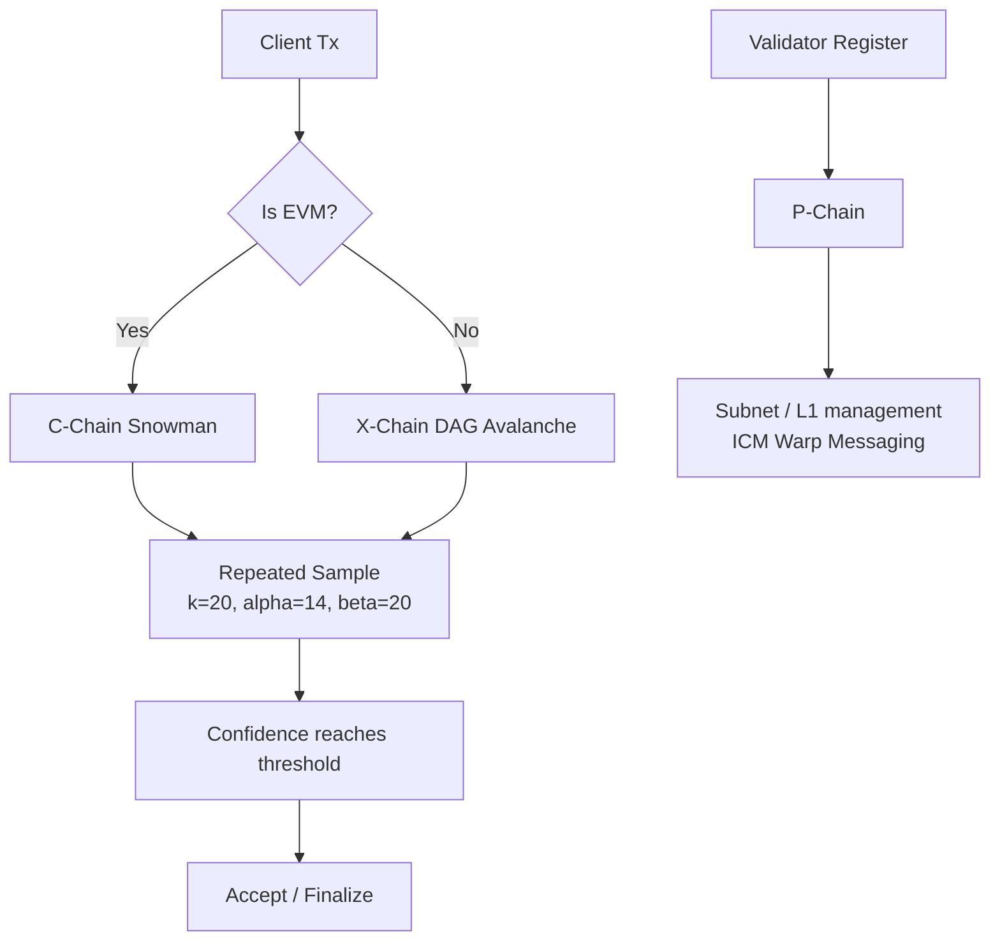

# Avalanche

> **TL;DR**：Avalanche 是 Emin Gün Sirer（康奈尔大学教授）团队 2018 年提出、Ava Labs 2020-09 主网启动的 **新型 L1 公链**。核心创新是 **Avalanche 共识家族**（Snowflake / Snowball / Avalanche / Snowman）——一种 **亚稳定重复随机抽样（metastable repeated random subsampling）** 的新范式，介于经典 BFT 与 Nakamoto 之间：每个节点每轮随机抽取 $k$ 个节点询问"你偏好什么"，若 $\alpha$ 个回答一致就翻转偏好，连续 $\beta$ 轮不变即接受。以 $k=20, \alpha=14, \beta=20$ 的默认参数，网络能在 **亚秒级** 达成概率趋近 1 的确定终局。独特的 **三链架构**：**P-Chain**（平台链，管 validator / staking / subnet）、**X-Chain**（资产链，UTXO + Avalanche 共识，原生代币与发行）、**C-Chain**（合约链，EVM 兼容 + Snowman）。在 2024 Durango + Etna 升级后，过去的 Subnet 演进为可自治的 **Avalanche L1**，通过 **ICM（Interchain Messaging / Teleporter）** 与 **ACP-77 自定义验证者管理** 获得极大灵活性。据官方估计主网活跃 validator 超过 1700 名。

---

## 1. 背景与动机

Avalanche 诞生于 2018 年的匿名白皮书 "Snowflake to Avalanche"（后署名 "Team Rocket"，团队后来公开为 Cornell 博士生 Kevin Sekniqi、Stephen Buttolph 与 Maofan "Ted" Yin，由 Emin Gün Sirer 教授带领）。当时 PoW 面临速度瓶颈，经典 BFT 在节点数超过数百就因 $O(n^2)$ 通信爆炸；Team Rocket 的观察是：**共识不一定要让所有节点两两同步**——只要每个节点随机询问少量邻居，通过 **偏好传染** 即能在对数时间内趋同，这对应伽尔顿-瓦特森过程的相变现象。

三链架构源于"分工优化"：资产转账（UTXO）不需要全局排序，交给 Avalanche DAG 共识；EVM 合约需要线性排序，交给 Snowman（Avalanche 的线性化变体）；而质押、Subnet 管理需要全局权威，交给 P-Chain 专职维护。

关键里程碑：2018 发表论文 → 2020-09-21 主网 → 2021-08 Apricot 升级支持大量新功能 → 2022 Banff + C-Chain 性能优化 → 2023 Cortina + BLS → 2024-03 Durango（ICM / Teleporter）→ 2024-12 Etna + ACP-77（Subnet → L1 范式转变）。

## 2. 核心原理

### 2.1 形式化定义：亚稳定共识

令每个节点 $u$ 在时间 $t$ 有一个偏好值 $c_u(t) \in \{0, 1\}$（Snowflake 二值情况）。共识过程定义为：

1. 随机抽样：每轮 $u$ 均匀无重复抽样 $k$ 个节点 $Q$。
2. 询问：向 $Q$ 查询其当前偏好。
3. 阈值反应：若收到 $\ge \alpha$ 个相同的值 $v$ 且 $v \ne c_u$，则 $c_u \leftarrow v$ 并计数器归零；否则计数器 $+1$。
4. 终止：当计数器 $\ge \beta$ 即 **接受** $c_u$。

数学上，若网络中偏好 $v=1$ 的节点比例 $p > 1/2$，则期望 $\alpha/k$ 查询返回 1，以指数速度拉高所有节点的 $v=1$ 偏好；反之亦然。这是一个 **亚稳定平衡**：$p=0.5$ 是不稳定点，任意微小扰动都会使系统滑向 0 或 1。

四阶段协议增量：
- **Slush**：无计数器，纯多轮抽样。
- **Snowflake**：加计数器 $\beta$，提供"决定点"。
- **Snowball**：加 **置信度 $d(v)$**——累计投票次数，切换偏好时需要置信度差距大于当前，避免频繁翻转。
- **Avalanche**：DAG 化，每个事务引用多条历史事务，针对 UTXO 模型批量决定冲突集（conflict set）。
- **Snowman**：线性化 Avalanche（DAG 退化为链），适用于需要全序的智能合约（C-Chain）。

### 2.2 关键算法：Snowman 出块与最终性

Snowman 把 Avalanche DAG 约束为 **单亲链**：

```
Snowman::poll(block):
    sample k validators
    responses = query(sample, block.parent)
    if majority prefer_block in responses:
        confidence++
        if confidence >= beta2: accept
    else:
        confidence = 0
```

- $\beta_1$（virtuous commit）与 $\beta_2$（rogue commit）可不同：前者针对"无冲突块"较松，后者针对"有竞争分叉"较严。
- 错误概率 $\varepsilon$ 可由参数量化：$P(\text{safety violation}) \le \varepsilon \approx (1-\text{adv})^{k\beta}$；合理参数下 $\varepsilon < 10^{-9}$。

拜占庭容错上限：理论证明 **任意 <1/2 stake 恶意节点**都无法破坏 Snowman（相比 BFT 的 1/3）。但该上限以"绝大多数样本正确回答"为前提，需要假设网络 ≠ 持续分裂。

### 2.3 子机制拆解

1. **Subnet → L1 (ACP-77)**：Subnet 原本是"P-Chain 上的一个 validator 子集"，Etna 后演化为 **完全自治的 L1**：validator 集合由 L1 自己维护（支持 PoS、PoA、自定义规则），不再强制每个 subnet validator 同时验证 Primary Network。大幅降低运行成本。
2. **BLS 聚合签名**：Cortina 引入，每个 validator 注册 BLS 公钥，支持跨 subnet 的 **Warp Message** 验证——一个 subnet 的 validator 集合签名被任意其它 subnet 高效验证。
3. **Teleporter / ICM**：跨 L1 的异步消息传递协议，基于 Warp，Sender L1 签名 → Relayer 抓取 → Target L1 验证；无信任第三方。
4. **P-Chain staking & slashing**：AVAX stake 最少 2,000 用于 validator / 25 用于 delegator，锁仓 2 周–1 年。Avalanche 历史上 **不做 slash**（长期被社区诟病），仅扣奖励；2024 社区正讨论引入部分 slashing 条件。
5. **C-Chain EVM**：基于 `coreth`（go-ethereum fork），支持 EIP-1559、Shanghai、Cancun 等主流 EVM 特性；Gas 用 nAVAX 计价。
6. **Fuji 测试网 / Dev-testnet**：便捷本地部署。

### 2.4 参数与常量（默认）

| 参数 | 值 | 说明 |
| --- | --- | --- |
| $k$ (sample size) | 20 | 每轮抽样 validators |
| $\alpha$ (quorum) | 14 (注：最新官方文档给出 0.7·k) | 翻转偏好阈值 |
| $\beta_1$ | 15 | virtuous 提交阈值 |
| $\beta_2$ | 20 | rogue 提交阈值 |
| Block time (C-Chain) | ~2 s | 实测 |
| Finality | ~1–2 s | 概率终局 |
| 最小 Validator 质押 | 2000 AVAX | 可治理 |
| Total AVAX supply cap | 720,000,000 | 软顶 |
| Avg Validator uptime | ≥ 80% | 拿奖励前置 |

### 2.5 边界条件与失败模式

- **偏好平衡攻击**：攻击者构造 50/50 冲突，使亚稳定点长期不坍缩；参数选择旨在最小化这种窗口，实测影响微弱。
- **网络分区**：若节点抽样无法触达足够正确 validator，共识"暂停"但不 fork——这是 Avalanche 选择活性 / 安全性的折衷（倾向安全）。
- **Validator 集中化**：如果少数实体托管大量 validator，共识安全降至该实体的诚实性；Ava Labs 长期推动地理分散。
- **缺 slashing**：历史事件表明验证者行为不当成本较低，需通过 uptime 奖励限制。

### 2.6 图示



## 3. 架构剖析

### 3.1 分层视图

```
┌────────────────────────────────────────────────┐
│ Wallets / SDKs / Teleporter Relayer            │
├────────────────────────────────────────────────┤
│ JSON-RPC (EVM) / Avalanche API                 │
├────────────────────────────────────────────────┤
│ AvalancheGo (node):                            │
│  ├── Consensus Engine (Snowman / Avalanche)    │
│  ├── VM Manager (plug in multiple VMs)         │
│  │     ├── PlatformVM (P-Chain)                │
│  │     ├── AVM (X-Chain)                       │
│  │     ├── Coreth (C-Chain EVM)                │
│  │     └── Subnet-EVM / Custom VM              │
│  ├── Networking (Avalanche p2p)                │
│  ├── Chain Manager                             │
│  └── Database (LevelDB)                        │
├────────────────────────────────────────────────┤
│ Primary Network: 3 chains                      │
└────────────────────────────────────────────────┘
```

### 3.2 核心模块清单（映射 `ava-labs/avalanchego` v1.11.x）

| 模块 / 目录 | 职责 | 依赖 | 可替换性 |
| --- | --- | --- | --- |
| `snow/consensus/` | Snowball / Snowman 核心算法 | math/sampler | 可切换策略 |
| `snow/engine/snowman/` | 线性链引擎 | consensus | 主力 |
| `vms/platformvm/` | P-Chain 验证者/子网逻辑 | staking, warp | 核心 |
| `vms/avm/` | X-Chain UTXO 资产 | secp256k1 | 核心 |
| `vms/proposervm/` | 在 Snowman 之上加 proposer 窗口 | | 防 MEV 抢跑 |
| `coreth/` (独立仓库) | C-Chain EVM，基于 geth | core-eth types | 可替换 subnet-evm |
| `network/p2p/` | TLS + msgpack 协议 | crypto | 可替换 QUIC |
| `indexer/` | Tx / Block 索引，供 API | database | 可关 |
| `api/` | JSON-RPC + HTTP Handler | 上述 | 标准接口 |
| `database/` | LevelDB / PebbleDB 封装 | | 可替换 |
| `chains/` | Chain Manager, 加载多 VM | vm manager | 核心 |
| `subnets/` | Subnet / L1 管理 | platformvm | 核心 |

### 3.3 数据流：EVM Tx 在 C-Chain 的生命周期

1. **dApp 签名 Tx**：通过 MetaMask / ethers，发到 `eth_sendRawTransaction`。
2. **coreth mempool**：与 geth 相同，按 gas price / nonce 排序。
3. **ProposerVM 随机选择 proposer 窗口**：给一批 validator 在短时间窗内 "优先" 提议区块，用于防止抢跑与控制网络风暴。
4. **Snowman poll**：提议块后，本节点抽样 20 个 validator，查询其 parent preference。
5. **连续 20 轮支持** → accept，写入 coreth BlockChain，触发 EVM 执行 → 生成 receipts。
6. **跨链 ICM**：若 Tx 调用了 `Teleporter::sendMessage`，Warp 预编译合约产出跨链消息，由 Relayer 捕获并投递至 target L1。
7. **终局性**：实测 1–2 s，绝大多数交易所 / bridge 设为 1 个确认。

### 3.4 客户端多样性

- **AvalancheGo (Go)**：唯一官方主实现。
- **Avalanche-rs (Rust)**：Ava Labs 在孵化的 Rust 节点，尚未主网生产。
- **Subnet-EVM / HyperSDK**：用户构建自定义 L1 的模板。
- 与多数新 L1 类似，客户端多样性较低，是共识层的重要风险。

### 3.5 扩展接口

- **EVM JSON-RPC**：C-Chain 完全兼容 MetaMask 生态。
- **Avalanche API**：平台链专有接口 `/ext/bc/P`, `/ext/bc/X`。
- **Warp + Teleporter Precompile**：`0x02...05` 地址调用跨链消息。
- **HyperSDK**：构建非 EVM L1 的框架（Rust + Go）。
- **ACP (Avalanche Community Proposal)**：协议级提案治理流程，对应 EIP。

## 4. 关键代码 / 实现细节

Snowman 投票循环（简化自 `avalanchego/snow/engine/snowman/transitive.go`）：

```go
// Poll 一个块是否被 accept
func (t *Transitive) poll(ctx context.Context, blkID ids.ID) {
    // 1. 随机采样 k 个 validator
    vdrs, _ := t.Config.Validators.Sample(t.Ctx.SubnetID, t.Params.K)
    // 2. 向每个发 PullQuery
    reqID := t.RequestID
    for _, v := range vdrs {
        t.Sender.SendPullQuery(ctx, v, reqID, blkID)
    }
    // 3. 收集响应，在 handler 中 t.Consensus.RecordPoll(...)
}

// Snowball 记录投票
func (sb *snowball) RecordSuccessfulPoll(blkID ids.ID) {
    sb.numSuccessfulPolls[blkID]++
    if sb.numSuccessfulPolls[blkID] >= sb.params.Beta {
        sb.finalized = true
    }
}
```

> 真实实现覆盖 ProposerVM 窗口、blocking / non-blocking poll、subnet 隔离；详见 commit tag `v1.11.x`。

## 5. 演进与版本对比

| 版本 | 时间 | 关键变化 | 影响 |
| --- | --- | --- | --- |
| Mainnet Launch | 2020-09-21 | Snowman + 三链 | 公链启动 |
| Apricot | 2021 | Atomic Tx, EIP-1559 提前 | EVM 生态繁荣 |
| Banff | 2022 | C-Chain 性能、ProposerVM | 防 MEV |
| Cortina | 2023 | BLS 密钥，铺垫 Warp | Subnet 互通 |
| Durango | 2024-03 | Teleporter / ICM 上线 | 子网互操作 |
| Etna (ACP-77) | 2024-12 | Subnet → L1，自定义验证者集 | 成本大幅下降 |
| Fuji + Frog/HyperSDK | 2025 持续 | 新应用链框架 | 据官方路线 |

## 6. 实战示例

```bash
# 本地运行 avalanchego
git clone https://github.com/ava-labs/avalanchego && cd avalanchego
./scripts/build.sh
./build/avalanchego \
  --network-id=local \
  --staking-enabled=false \
  --http-host=0.0.0.0

# 用 avalanche-cli 创建一个 Subnet / L1（Etna 风格）
avalanche subnet create myL1
avalanche subnet deploy myL1 --local

# 部署 EVM 合约到 C-Chain
forge create --rpc-url https://api.avax-test.network/ext/bc/C/rpc \
  --private-key $PK src/Counter.sol:Counter

# 查询 Tx 状态
curl -X POST --data '{"jsonrpc":"2.0","id":1,"method":"eth_getTransactionReceipt","params":["0x..."]}' \
  -H 'content-type:application/json' \
  https://api.avax.network/ext/bc/C/rpc
```

预期输出：节点启动后 RPC 可用；subnet 部署返回新的 chain ID；Tx 1–2 秒内有 receipt 且 `status=0x1`。

## 7. 安全与已知攻击

1. **2021-11 Pangolin/Snowball 网络拥堵**：C-Chain 因活动激增出现内存池爆满 / 节点掉线，被社区质疑 "2 秒终局" 与实际吞吐的兼容性；后续通过 atomic gas、合约优化修复。
2. **跨链桥 Avalanche Bridge（AB） 相关事件**：AB 本身由 Intel SGX 托管（可信执行环境），被批"中心化"；2022 年社区切向 LayerZero + Warp 组合，Warp/Teleporter 成为首选。
3. **理论攻击面**：① $\ge 50\%$ stake 攻击可破坏 Snowman（与 BFT 不同，不是 1/3 上限；但社区常误读 Snowman 为"4500 → 5000 才安全"）；② proposer 抢跑：当 ProposerVM 窗口内某 proposer 串通 MEV，可排序利己，缓解方案是随机延迟与 PBS；③ **无 slashing** 长期是治理与质押诚信的系统性隐患。

## 8. 与同类方案对比

| 维度 | Avalanche | Cosmos | Polkadot | Ethereum |
| --- | --- | --- | --- | --- |
| 共识 | Snowman (亚稳定抽样) | CometBFT (BFT) | BABE+GRANDPA | LMD-GHOST+FFG |
| BFT 容错上限 | < 50% | < 33% | < 33% | < 33% |
| 子链模型 | L1 (ACP-77) + ICM | App-Chain + IBC | Parachain 共享安全 | L2 Rollup |
| 共享安全 | 可选（原 Subnet 强制，Etna 后自选） | 可选（Interchain Security） | 强制共享 | L2 经 Ethereum DA |
| 智能合约 | EVM (C-Chain), 自定义 VM | CosmWasm / EVM 可选 | Wasm (ink!) | EVM |
| 跨链 | Warp / Teleporter | IBC | XCMP | CCIP / LayerZero 等 |
| 终局 | 1–2 s | 5–7 s | 12–60 s | 12 min |
| 客户端数 | 1 | 2+ (gaia, cosmos-sdk based) | 2 (Substrate, Kagome) | 5+ |

## 9. 延伸阅读

- **官方文档 / Spec**：
  - [Avalanche Developer Docs](https://build.avax.network/docs)
  - [Avalanche Whitepapers](https://www.avalabs.org/whitepapers)
  - [ACP Registry](https://github.com/avalanche-foundation/ACPs)
- **核心论文**：
  - [Snowflake to Avalanche (2018)](https://www.avalabs.org/whitepapers)
  - [Scalable and Probabilistic Leaderless BFT (2019)](https://arxiv.org/abs/1906.08936)
- **权威博客**：
  - [Ava Labs Blog](https://www.avalabs.org/blog)
  - [Messari Avalanche 研究](https://messari.io/)
  - [a16z — Avalanche Subnet 分析](https://a16zcrypto.com/)
- **视频**：
  - Emin Gün Sirer 于 Consensus 的 Avalanche 原理演讲
  - Luigi D'Onorio DeMeo 在 AvalancheSummit 的 Etna 升级介绍
- **规范 / ACP**：
  - [ACP-77 Reinventing Subnets](https://github.com/avalanche-foundation/ACPs/tree/main/ACPs/77-reinventing-subnets)
  - [ACP-30 Integrate Avalanche Warp Messaging](https://github.com/avalanche-foundation/ACPs)

## 10. 术语表

| 术语 | 英文 | 释义 |
| --- | --- | --- |
| 亚稳定共识 | Metastable Consensus | Avalanche 共识家族核心思想 |
| 重复随机抽样 | Repeated Random Subsampling | 每轮抽 k 个、以置信度累积 |
| 雪花/雪球 | Snowflake / Snowball | 共识协议的两个中间阶段 |
| 雪人 | Snowman | 线性化 Avalanche |
| 三链 | P/X/C-Chain | Platform / Exchange / Contract Chain |
| 子网 | Subnet | 一组 validator 共同验证的若干链 |
| L1 (Avalanche) | Avalanche L1 | Etna 后自治的子网，自管 validator |
| 传送门 | Teleporter | 基于 Warp 的跨 L1 消息合约 |
| 跨链消息 | Interchain Messaging (ICM) | Warp + Teleporter 总称 |
| 提议 VM | ProposerVM | 在 Snowman 之上加入 proposer 窗口 |

---

*Last verified: 2026-04-22*
