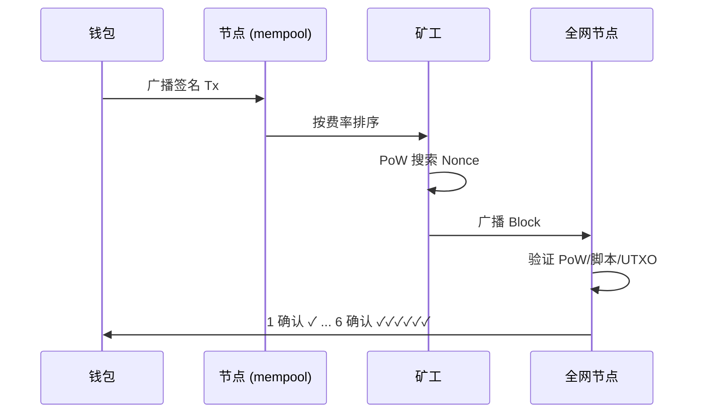
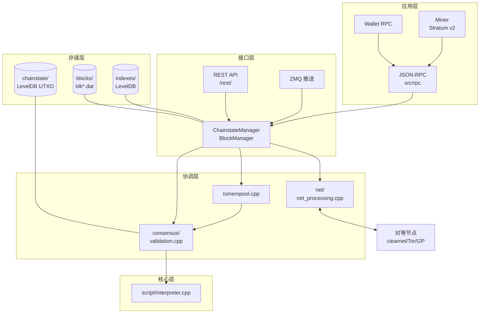

# Bitcoin（比特币）

> **TL;DR**：Bitcoin 是 2008 年由 Satoshi Nakamoto 发布、2009 年 1 月 3 日主网启动的首个去中心化点对点电子现金系统。它通过 **工作量证明（Proof of Work, PoW）+ 最长链规则** 解决了无需可信第三方的双花问题，采用 **UTXO 账本模型** 与 **Stack-based Script 脚本系统**。截至 2026 年 4 月，全网累计算力稳定在数百 EH/s 量级，区块高度已跨越 **第 4 次减半**（2024 年 4 月），区块奖励降至 3.125 BTC。Bitcoin 的协议演进节奏谨慎，自 2017 年激活 **SegWit**、2021 年激活 **Taproot**（BIP-340/341/342）后，未再经历重大共识层变更；生态外延通过 **Lightning Network**、**Ordinals/Inscriptions**、**Runes** 及 **Bitcoin L2（Stacks / Rootstock / BitVM 系）** 扩张。

---

## 1. 背景与动机

2008 年 10 月 31 日，匿名作者 Satoshi Nakamoto 将九页论文《[Bitcoin: A Peer-to-Peer Electronic Cash System](https://bitcoin.org/bitcoin.pdf)》发布到 cypherpunks 邮件列表。彼时全球金融危机正酣，论文解决了一个自 1980 年代 eCash（David Chaum）以来悬而未决的工程问题——**在不可信网络中，如何让价值转移无需银行/清算机构**。

白皮书要点凝练为八节，核心贡献可归纳为三点：

1. **时间戳服务器 + PoW**：将交易打包入按时间顺序链接的"区块"，每个区块包含上一区块的哈希，使历史记录篡改代价呈指数放大。
2. **最长链（最重链）共识**：诚实节点按"累计工作量最大"（非字面长度）选链，恶意重组需攻击者算力超过网络 50%。
3. **经济激励**：以新币 Coinbase 奖励 + 交易手续费支付矿工；区块奖励按几何级数递减（每 210,000 个区块减半一次），保证 **2100 万** 的硬顶。

前三代"数字现金"尝试（eCash、b-money、Bit Gold）均受制于"同步可信节点假设"或"防双花方案缺失"。Bitcoin 通过 **把账本作为概率性、可复制、可验证的公共数据结构**，第一次把"信任"外包给能量消耗与密码学。

## 2. 核心原理

### 2.1 区块与链

每个区块由 **80 字节区块头 + 变长交易体** 构成。区块头 6 个字段（参见 [Bitcoin Wiki: Block hashing algorithm](https://en.bitcoin.it/wiki/Block_hashing_algorithm)）：

| 字段 | 字节 | 含义 |
| --- | ---: | --- |
| Version | 4 | 协议版本（BIP-9 / BIP-8 信号位） |
| Previous Block Hash | 32 | 前驱块的 SHA-256d |
| Merkle Root | 32 | 交易 Merkle 树根 |
| Timestamp | 4 | Unix 秒时间戳 |
| nBits | 4 | 压缩表示的难度目标 |
| Nonce | 4 | PoW 随机数 |

"挖矿"即暴力搜索使 `SHA256(SHA256(header)) < target` 的 Nonce。target 每 **2016 个区块**（约两周）按过去两周实际出块速度调整，维持 **10 分钟/块** 的平均出块间隔。

完整链使用 **最大累计 chainwork**（难度乘以区块数）作为"主链"判定（`CChain::FindFork` in `chain.cpp`），这是对白皮书"最长链"措辞的严谨修正——防止攻击者用大量低难度块造伪链。

### 2.2 UTXO 与 Script

Bitcoin 不采用"账户余额"，而采用 **UTXO（Unspent Transaction Output）** 模型。每笔交易 `CTransaction`（定义于 [`src/primitives/transaction.h`](https://github.com/bitcoin/bitcoin/blob/master/src/primitives/transaction.h)）包含：

- `vin[]`：输入列表，每个 `TxIn` 引用某笔前置交易的 `(txid, vout)`，附带 `scriptSig`（解锁脚本）与 `nSequence`；
- `vout[]`：输出列表，每个 `TxOut` 写入 `value` 与 `scriptPubKey`（锁定脚本）；
- `nLockTime`：最早可被打包时间。

交易有效性取决于 **所有输入的解锁脚本 + 对应输出的锁定脚本** 拼接后在栈式解释器中成功执行（栈顶为 true）。典型锁定脚本对应 4 类地址：

| 类型 | 前缀 | 典型 scriptPubKey | 特点 |
| --- | --- | --- | --- |
| **P2PKH**（Pay-to-Public-Key-Hash） | `1...` | `OP_DUP OP_HASH160 <hash> OP_EQUALVERIFY OP_CHECKSIG` | 最古老、体积较大 |
| **P2SH**（Pay-to-Script-Hash, BIP-16） | `3...` | `OP_HASH160 <scriptHash> OP_EQUAL` | 支持多签、抽象复杂锁 |
| **P2WPKH / P2WSH**（SegWit v0, BIP-141） | `bc1q...` | `OP_0 <hash>` | 签名移到 witness 区，修复可塑性 |
| **P2TR**（Taproot, BIP-341） | `bc1p...` | `OP_1 <x-only-pubkey>` | Schnorr 签名 + MAST 脚本树 |

### 2.3 共识规则：PoW + 最长链

PoW 用 HashCash 思想。核心循环在 [`src/pow.cpp`](https://github.com/bitcoin/bitcoin/blob/master/src/pow.cpp)；难度重算见 `CalculateNextWorkRequired()`：

```cpp
// 简化示意：时间实测 vs 期望（2016 * 10 min = 1,209,600 秒）
int64_t nActualTimespan = pindexLast->GetBlockTime()
                        - pindexFirst->GetBlockTime();
// 限制为 [0.25x, 4x] 避免极端调整
if (nActualTimespan < params.nPowTargetTimespan/4)
    nActualTimespan = params.nPowTargetTimespan/4;
if (nActualTimespan > params.nPowTargetTimespan*4)
    nActualTimespan = params.nPowTargetTimespan*4;
arith_uint256 bnNew = bnOld;
bnNew *= nActualTimespan;
bnNew /= params.nPowTargetTimespan;
```

**区块奖励减半** 定义在 [`src/validation.cpp`](https://github.com/bitcoin/bitcoin/blob/master/src/validation.cpp) 的 `GetBlockSubsidy()`：

```cpp
CAmount GetBlockSubsidy(int nHeight, const Consensus::Params& c) {
    int halvings = nHeight / c.nSubsidyHalvingInterval; // 210000
    if (halvings >= 64) return 0;
    CAmount nSubsidy = 50 * COIN;
    nSubsidy >>= halvings;
    return nSubsidy;
}
```

历次减半：2012-11（50→25）、2016-07（25→12.5）、2020-05（12.5→6.25）、**2024-04（6.25→3.125）**。约 2140 年全部 2100 万 BTC 挖出。

### 2.4 终局性：概率终局

Bitcoin 不提供确定性终局，任何区块都可能被深度 reorg 回滚。社区约定 **6 确认** 经验阈值，对应在全网算力无异动的假设下，攻击者连续击败诚实链的概率低于 0.1%（白皮书 §11 给出二项概率公式）。这是"Nakamoto Consensus"的本质妥协——用概率换取完全无许可加入/退出的灵活性。

### 2.5 PoW 的形式化定义（HashCash 基因）

Bitcoin PoW 直接继承 Adam Back 1997 年反垃圾邮件提案 HashCash 的结构：给定字符串 `s`、目标位 `t`，求解一个 nonce `x` 使 `H(s‖x)` 的前缀零位数 ≥ `t`。Bitcoin 把 `H = SHA256²`，把"前缀零位数 ≥ t" 扩展为任意 256-bit 目标 `T`。形式化可写为：

```
PoW(header) = { nonce ∈ ℕ | SHA256(SHA256(header‖nonce)) < T }
```

其中 `T = (2^208) / difficulty`（粗略），满足 `T ∈ (0, 2^256)`。求解期望步数 `E[N] = 2^256 / T`，每步需进行两次 SHA256，因此**出块时间近似服从指数分布 `Exp(λ)`**（λ = hashrate / E[N]）。指数分布的"无记忆"特性保证：即使上一个块刚出，下一个块何时出仍是完全独立的事件，这是难度调整算法假设平均出块间隔 10 分钟时背后的概率前提。

**为什么双 SHA256？** 防御长消息扩展攻击（length-extension），虽然 SHA256 的 Merkle-Damgård 结构本身并非严格抗扩展，但在挖矿语境中 `SHA256²` 让算法对定制 ASIC 同样友好，Satoshi 早期邮件列表解释"safety margin"。

### 2.6 Nakamoto 共识的安全分析：白皮书 §11 概率还原

白皮书用二项/随机游走模型给出了攻击者成功双花的概率上界。记诚实算力占比为 `p`，攻击者算力占比 `q = 1 − p`（假设 `q < p`）。攻击者从落后 `z` 个区块起追赶诚实链的概率为：

```
P(attacker catches up) = (q/p)^z      (若 q < p)
```

代入白皮书 §11 实际建模（泊松过程下攻击者出块数服从 `Poisson(λ = z·q/p)`）：

```
P(double-spend | z confirmations)
    = 1 − Σ_{k=0..z} e^{-λ} λ^k / k! · (1 − (q/p)^{z-k})
```

| z | q = 10% | q = 30% | q = 45% |
| ---: | ---: | ---: | ---: |
| 1 | 0.2045 | 0.4140 | 0.7551 |
| 6 | 0.0002 | 0.0178 | 0.3411 |
| 10 | <0.0001 | 0.0042 | 0.2084 |

可见 **6 确认** 在 `q ≤ 10%` 场景下已足够安全；在 `q = 30%` 已非常危险，`q ≥ 45%` 则 6 确认完全失效。这就是"51% 攻击"命名源头——但实际风险阈值远低于 51%。现实世界算力集中度（前 3 矿池占比 > 55% 多年）也使这一模型成为比特币生态最常被引用的安全论证。

### 2.7 Script opcode 分类与 Taproot MAST 原理

Bitcoin Script 约有 **185 个 opcode**（含禁用与保留），可分 8 类：

| 类别 | 代表 opcode | 用途 |
| --- | --- | --- |
| 常量压栈 | `OP_0`..`OP_16`、`OP_PUSHBYTES_1..75`、`OP_PUSHDATA1/2/4` | 压入立即数 |
| 流控 | `OP_IF`/`OP_ELSE`/`OP_ENDIF`、`OP_VERIFY`、`OP_RETURN` | 条件分支；`OP_RETURN` 不可花费 |
| 栈操作 | `OP_DUP`、`OP_DROP`、`OP_SWAP`、`OP_ROT` | 栈元素重排 |
| 拼接/切片 | `OP_CAT`（禁用）、`OP_SUBSTR`（禁用） | 历史遗留 |
| 按位 | `OP_AND`/`OP_OR`/`OP_XOR`（禁用） | 反滥用 |
| 算术 | `OP_ADD`、`OP_SUB`、`OP_MIN`、`OP_BOOLAND` | 32-bit 有符号整数 |
| 密码 | `OP_SHA256`、`OP_RIPEMD160`、`OP_HASH160`、`OP_CHECKSIG`、`OP_CHECKMULTISIG`、`OP_CHECKSIGADD`（Taproot） | 签名与哈希 |
| 锁定 | `OP_CHECKLOCKTIMEVERIFY`（BIP-65）、`OP_CHECKSEQUENCEVERIFY`（BIP-112） | 绝对/相对时间锁 |

**Taproot 三支柱（BIP-340/341/342）**：

1. **Schnorr 签名（BIP-340）**：取代 ECDSA。Schnorr 支持密钥聚合（MuSig2、FROST），让 N-of-N 多签在链上呈现为单签名，隐私性与体积双赢。签名大小固定 64 字节。
2. **MAST（Merkelized Abstract Syntax Tree, BIP-341）**：把一个"N 种花费路径"的复杂脚本编译成 Merkle 树，每个叶子是一条 TapScript。花费时只需揭示被触发的叶子 + 从叶到根的 Merkle 证明（log N 长度）。未触发的分支永不上链，既省 witness 体积又提升隐私。
3. **TapScript（BIP-342）**：Taproot 新脚本版本，禁用了 `OP_CODESEPARATOR` 等历史坑位，新增 `OP_CHECKSIGADD` 便于批量验签，并为未来 opcode 升级预留 `OP_SUCCESS*`（软分叉友好占位）。

典型 P2TR 输出脚本：`OP_1 <32-byte x-only-pubkey>`，其中该 pubkey = `internal_key + tagged_hash("TapTweak", internal_key ‖ merkle_root) · G`。花费时可走 **Key Path**（合作路径，只出示 Schnorr 聚合签名）或 **Script Path**（某叶子 TapScript + Merkle 证明）。

### 2.8 Coinbase 交易结构与成熟度

区块中第一笔交易必须是 **Coinbase Tx**：

- 只有 1 个输入，其 `prevout = (0x00…00, 0xFFFFFFFF)`，`scriptSig` 被矿工填入任意 2–100 字节（BIP-34 要求前缀为当前区块高度的 minimal push）。
- `vout` 总额 ≤ 区块补贴 + 本块所有交易手续费。超额的部分被"烧毁"（历史上多次因矿工软件 bug 少收了应得费用）。
- **100 区块成熟度**（`COINBASE_MATURITY = 100`）：Coinbase 的 UTXO 在 100 个确认前不可被花费。目的是在 reorg 深度远小于 100 时，即使主链切换，新 Coinbase 奖励也不会二次被花费造成通胀；历史上最深 reorg 约 53 块（2010-08，属紧急修复）。
- SegWit 激活后，Coinbase Tx 的 witness 必须放置 **witness commitment**：一个 `OP_RETURN` 输出包含 `0xaa21a9ed ‖ SHA256(SHA256(witness_merkle_root ‖ witness_reserved_value))`，让轻节点可以验证见证数据的完整性。

### 2.9 费率市场与 RBF/CPFP 子市场

Bitcoin 的费率市场按 **聪/vbyte（sat/vB）** 定价。核心节点 `mempool` 按 `feerate = fee / vsize` 排序，优先打包高费率交易。由于交易具有依赖关系，实际排序算法使用 **ancestor feerate**（祖先集合总费率）而非孤立费率，避免"富父亲拉穷儿子"。

**RBF（Replace-By-Fee, BIP-125）** 规则（Core 默认 mempoolfullrbf 自 v24 起开启）：

1. 原 Tx 必须显式或隐式可替换（nSequence < 0xfffffffe 为显式 opt-in）。
2. 替换 Tx 必须有 **更高绝对费用** 且 **更高 feerate**。
3. 替换 Tx 支付的额外费用 ≥ 被驱逐交易集合的最小 relay 费 × 新 Tx 大小。
4. 不能引入新的未确认依赖。

**CPFP（Child-Pays-For-Parent）**：若父 Tx 费率过低，用户可在其未确认输出上构造子 Tx 并给子 Tx 足够高费率，矿工会计算父子整体 ancestor feerate 一并打包。LN、CoinJoin 协调者常用此技巧加速卡单。

**子市场**（sub-markets）概念：Runes/Ordinals 用户、支付用户、LN 通道操作者对延迟容忍度不同，2023–2024 Ordinals 热潮使普通支付费率一度飙升至 500+ sat/vB，之后 Core 引入 **package relay**、**v3 transaction relay policy**（BIP-431 草案）试图把 LN 等时敏场景从主 mempool 拥塞中隔离。



## 3. 架构剖析

### 3.1 模块表（Bitcoin Core）

Bitcoin Core（参考实现）是 C++ 单体节点，核心模块可对应 [`src/`](https://github.com/bitcoin/bitcoin/tree/master/src) 子目录：

| 目录 | 职责 | 代表文件 |
| --- | --- | --- |
| `src/consensus/` | 共识规则、区块校验规则（脱离可变代码） | `tx_verify.cpp`, `validation.cpp` |
| `src/validation.{h,cpp}` | 区块/交易接入主链、UTXO 集维护 | `ConnectBlock`, `AcceptBlock` |
| `src/script/` | Script 解释器、Segwit/Taproot 执行 | `interpreter.cpp`, `sign.cpp` |
| `src/net/`, `src/net_processing.cpp` | P2P（`version`/`inv`/`getdata`/`block` 消息） | `net_processing.cpp` |
| `src/rpc/` | JSON-RPC 接口 | `blockchain.cpp`, `mining.cpp` |
| `src/wallet/` | BDB/SQLite 钱包、HD 派生、PSBT 构造 | `wallet.cpp` |
| `src/miner.cpp` | 区块模板构造（调用 CPU/外部 Stratum） | `miner.cpp` |
| `src/txmempool.{h,cpp}` | mempool 数据结构、ancestor/descendant 索引、驱逐策略 | `txmempool.cpp` |
| `src/index/` | txindex、blockfilterindex（BIP-157/158 compact filters） | `txindex.cpp` |
| `src/node/` | 节点协调（`BlockManager`、`ChainstateManager`） | `chainstate.cpp` |

其余 **替代实现** 有：Rust 实现的 [bitcoin-rs](https://github.com/rust-bitcoin/rust-bitcoin)（库）、BitcoinJ（Java 轻节点库）、[btcd](https://github.com/btcsuite/btcd)（Go 全节点，主要科研用途）、[Floresta](https://github.com/vinteumorg/Floresta)（Rust，utreexo 路线）、[libbitcoinkernel](https://github.com/bitcoin/bitcoin/tree/master/src/kernel)（Core 从主代码中抽出的可嵌入共识库）。生产部署绝对主流仍是 Bitcoin Core（> 98% 节点）。

### 3.2 分层视图



### 3.3 Initial Block Download（IBD）流程

新节点冷启动需下载并验证整条链（~600 GB blocks，2026-04）。Core 自 0.10 版起采用 **Headers-First Sync**：

1. **Headers sync**：从对等方下载仅 80 字节/块的全部头部（~50 MB 总量），按 chainwork 选择候选主链。
2. **Parallel block download**：并行从多个 peer 下载块（`CNodeState::vBlocksInFlight`），按 window 限流避免慢速 peer 拖累。
3. **AssumeValid / AssumeUTXO**：Core 内置一个硬编码 block hash（`assumevalid`），在该高度以下跳过脚本验证（仍校验 PoW、Merkle、UTXO 一致性）。v24 起进一步支持 **[AssumeUTXO](https://github.com/bitcoin/bitcoin/pull/15606)**（快照加载 UTXO 集，几分钟内可上线，背后异步校验历史块）。
4. **ConnectBlock**：将下载的块逐一应用至 UTXO 集。单线程，约 4–8 小时在 NVMe + 16 核机器上完成全量 IBD。

### 3.4 UTXO set 维护与 LevelDB

UTXO 集是 Bitcoin 状态的唯一真源。存储在 `chainstate/` 目录的 **LevelDB** 中，键格式 `C + txid + vout(little-endian varint)`，值为压缩后的 `Coin`（含 `nHeight | fCoinBase`、`nValue` 变长编码、`scriptPubKey` 字典压缩）。2026-04 活跃 UTXO ~1.8 亿条，压缩后 ~10 GB 磁盘。内存中另有 `CCoinsViewCache` 作为 LRU 写缓冲，按 `-dbcache`（默认 450 MB）大小定期 flush。

**Utreexo**（[论文](https://dci.mit.edu/utreexo)）是研究路线：把 UTXO 集压缩为 Merkle-Forest 累加器，节点仅需几 KB 常驻即可验证，代价是交易须附带 membership proof。Floresta 节点已实验性实现。

### 3.5 mempool 策略

`CTxMemPool` 核心参数（见 [`src/policy/policy.h`](https://github.com/bitcoin/bitcoin/blob/master/src/policy/policy.h)、`src/kernel/mempool_options.h`）：

- `-maxmempool`：内存上限（默认 300 MB）。超限时按最低 descendant feerate 驱逐。
- `-minrelaytxfee`：1 sat/vB（默认），低于此的 Tx 不转发也不入池。
- `-limitancestorcount = 25`、`-limitancestorsize = 101 kvB`：限制未确认祖先数量与体积，防止链式 DoS。
- `-limitdescendantcount = 25`、`-limitdescendantsize = 101 kvB`：同理限制后代。
- **BIP-125 RBF**：见 §2.9。v24 起 `-mempoolfullrbf` 默认 true，所有 Tx 默认可替换。
- **v3 transaction relay**（BIP-431 提案）：为 LN 设计的特殊 topology 限制（1 父 1 子、子不能再有子），配合 ephemeral anchor 让通道强制关闭能以静态手续费成功。

### 3.6 Compact Block Relay（BIP-152）

2016 年激活的带宽优化。Peer 接收方收到新块通知后，对方不发完整块（~1.5 MB），而发送 **Compact Block**：

- 区块头 80 字节
- 一个 nonce
- `shortids[]`：每笔 Tx 的 6 字节短哈希（用 nonce + 块哈希作为 SipHash-2-4 key，使预计算碰撞不可行）
- `prefilledTxn[]`：预填入的 Coinbase 等关键交易

接收方在本地 mempool 查 shortid，缺失的通过 `getblocktxn` 补拉。实际上 > 95% 的块只需一次往返即完成同步。**High-bandwidth mode**（BIP-152 §6）：三个选定 peer 在听到块消息前就直接推送 compact block，进一步压缩传播延迟到 ~几百毫秒量级，是降低孤块率的关键机制。

### 3.7 Tor / I2P / CJDNS 支持

Core v22 起内置多网络支持：

- **Tor v3**：通过本地 `tor` 进程的 SOCKS5 监听（端口 9050）与 control 接口（9051）自动申请 `.onion` 地址。
- **I2P SAM**：通过 i2pd 的 SAM v3 API（端口 7656），获得 `.b32.i2p` 地址。
- **CJDNS**：IPv6 隐私网络，直接在 `-cjdnsreachable` 标志下工作。
- **Address Relay**：为避免跨网络信息泄漏，Core 对 addr 消息按网络分桶发送；`addrv2`（BIP-155）支持多网络地址编码。

对隐私节点而言，**仅 outbound over Tor + inbound clearnet 禁用** 是常见配置，既避免网络指纹、又保留帮助新节点 IBD 的能力。

### 3.8 P2P 与节点类型

- **Full Node**：验证所有规则，存储 UTXO 集（~10 GB）+ 区块链（~600 GB，2026-04）。
- **Pruned Node**：验证全部规则但仅保留近期区块（可低至 2 GB）。
- **SPV Client**：仅下载 Header 链，用 Merkle proof 验证交易。移动钱包主流方案之一。
- **Electrum 服务器**：对外暴露索引，不独立校验。

### 3.9 端到端数据流

一笔交易从签名到终局的完整路径：

1. 钱包用私钥对 `sighash` 做 ECDSA/Schnorr 签名 → 构造 PSBT → finalize 成 raw tx。
2. `sendrawtransaction` RPC → `CTxMemPool::accept` 做策略校验（feerate、ancestors、RBF）→ 放入本地 mempool。
3. 广播：`INV(tx)` → peer 回 `GETDATA` → 发送 `TX`。BIP-339 `wtxidrelay` 让见证可替换 Tx 按 wtxid 去重。
4. 矿工 `GetBlockTemplate` 选择 ancestor feerate 最高集合构造候选块 → 外部 hasher/ASIC 暴力搜索 nonce → 命中后 `submitblock`。
5. 全网收到新 header → compact block relay → 本地 `ConnectBlock` → UTXO 应用 → 深度 +1。
6. 用户钱包观察 `n` 确认达到策略阈值 → 视为最终。

### 3.10 接口规范

- **P2P 协议**：二进制魔数 `0xf9beb4d9`（mainnet），消息结构 `magic(4) ‖ command(12) ‖ length(4) ‖ checksum(4) ‖ payload`。命令集约 40 个（`version`, `verack`, `inv`, `getdata`, `block`, `tx`, `addrv2`, `cmpctblock`, `getblocktxn`, `blocktxn`, `feefilter`, ...）。
- **JSON-RPC**：HTTP Basic Auth，端口 8332（mainnet）。接口约 150 个，按主题分布在 `rpc/blockchain.cpp`、`rpc/mining.cpp`、`rpc/rawtransaction.cpp`、`rpc/wallet/*`、`rpc/net.cpp`。
- **REST**：`/rest/block/<hash>.{bin,hex,json}`、`/rest/headers/<count>/<hash>.bin` 只读接口，无认证。
- **ZMQ**：`rawblock`、`rawtx`、`hashblock`、`hashtx` 推送，索引服务常用。
- **Stratum v2**（BIP-310 系）：矿池协议，支持 job negotiation 让矿工自行选择交易集合（抗审查意义）。
- **BIP-174 PSBT**：部分签名交易交换格式，硬件钱包/多签协调的事实标准。

### 3.11 Lightning Network（闪电网络）

由 Poon 和 Dryja 于 2015 年提出（[paper](https://lightning.network/lightning-network-paper.pdf)），通过 **HTLC + 承诺交易** 建立链下双向支付通道。LN 不是 Bitcoin 共识的一部分，而是完全基于 Bitcoin Script 的链外协议。主流实现：LND（Go）、Core Lightning（C）、Eclair（Scala）。

## 4. 关键代码 / 实现细节

以下代码引用 Bitcoin Core 主线（参考 v27.x 标签，2025 年仍在维护）。

**PoW 校验**——[`src/pow.cpp`](https://github.com/bitcoin/bitcoin/blob/master/src/pow.cpp) 的 `CheckProofOfWork()`：

```cpp
bool CheckProofOfWorkImpl(uint256 hash, unsigned int nBits,
                          const Consensus::Params& params) {
    bool fNegative, fOverflow;
    arith_uint256 bnTarget;
    bnTarget.SetCompact(nBits, &fNegative, &fOverflow);
    // 目标必须为正、未溢出、且不超过 params.powLimit
    if (fNegative || bnTarget == 0 || fOverflow ||
        bnTarget > UintToArith256(params.powLimit))
        return false;
    // 关键：区块头哈希作为 256-bit 大整数 <= 目标
    if (UintToArith256(hash) > bnTarget)
        return false;
    return true;
}
```

**Coinbase 成熟度**——新铸造的 BTC 须等待 100 个区块确认（`COINBASE_MATURITY = 100`）方可花费，防御 reorg 导致的双花。见 [`src/consensus/tx_verify.cpp`](https://github.com/bitcoin/bitcoin/blob/master/src/consensus/tx_verify.cpp)。

**Script 解释器**——[`src/script/interpreter.cpp`](https://github.com/bitcoin/bitcoin/blob/master/src/script/interpreter.cpp) 的 `EvalScript()` 以 ~100 个 opcode 构成图灵不完备（无循环）栈机，核心为 `CHECKSIG` 家族（ECDSA on secp256k1，Taproot 后新增 Schnorr）。

## 5. 演进与版本对比

Bitcoin 以"软分叉为主、硬分叉慎之又慎"的风格升级。关键里程碑：

| 时间 | 事件 | 形式 | 作用 |
| --- | --- | --- | --- |
| 2008-10 | 白皮书发布 | — | |
| 2009-01-03 | 创世区块（Height 0） | — | Genesis 含"Chancellor on brink..."报头 |
| 2010-08-15 | Value Overflow Incident（1840 亿 BTC 漏洞） | 硬分叉修复 | 首次紧急修复 |
| 2012-04 | [BIP-16](https://github.com/bitcoin/bips/blob/master/bip-0016.mediawiki) P2SH | 软分叉 | 多签普及 |
| 2013-03 | 0.7/0.8 分叉（BDB 锁表） | 自发修复 | 客户端分叉，未共识改动 |
| 2015-12 | [BIP-68/112/113](https://github.com/bitcoin/bips) CLTV/CSV | 软分叉 | 相对/绝对时间锁，解锁 LN |
| 2017-08 | [BIP-141/143/147/148] SegWit | 软分叉 | 签名分离、修复可塑性、块重量模型（1 MB → 4 Mw）|
| 2017-08 | Bitcoin Cash 硬分叉 | 生态分叉 | 反对 SegWit 的派系 |
| 2021-11 | [BIP-340/341/342] Taproot | 软分叉 | Schnorr 签名、MAST、TapScript |
| 2024-04 | 第 4 次减半（Height 840,000） | 按预设 | 3.125 BTC/块 |
| 2023–2025 | Ordinals (BRC-20) / Runes | 共识无变 | 基于 witness/OP_RETURN 的代币生态 |

> **重要语义**：SegWit 将"区块大小 1 MB"替换为"区块重量 ≤ 4,000,000 weight units"（1 vbyte = 4 WU，非见证数据 1 字节=4 WU，见证数据 1 字节=1 WU）。实际区块在 1.5–3.8 MB 之间浮动。

## 6. 实战示例

**最小可运行节点**（macOS / Linux）：

```bash
# 官方下载
curl -LO https://bitcoincore.org/bin/bitcoin-core-27.0/bitcoin-27.0-x86_64-linux-gnu.tar.gz
tar xzf bitcoin-*.tar.gz
./bitcoin-27.0/bin/bitcoind -chain=signet -datadir=./btc-data -daemon

# 查看链状态
./bitcoin-27.0/bin/bitcoin-cli -datadir=./btc-data getblockchaininfo

# 生成 P2TR 地址
./bitcoin-27.0/bin/bitcoin-cli -datadir=./btc-data createwallet "demo"
./bitcoin-27.0/bin/bitcoin-cli -datadir=./btc-data getnewaddress "" bech32m
```

**用 rust-bitcoin 构造 P2WPKH 地址**（[文档](https://docs.rs/bitcoin)）：

```rust
use bitcoin::{Address, Network, PublicKey, secp256k1::Secp256k1, PrivateKey};
let secp = Secp256k1::new();
let sk = PrivateKey::from_wif("cV...")?;
let pk = PublicKey::from_private_key(&secp, &sk);
let addr = Address::p2wpkh(&pk.into(), Network::Testnet)?;
println!("{}", addr); // tb1q...
```

## 7. 安全与已知攻击

1. **2010-08 Value Overflow Bug**（CVE-2010-5139）：Height 74638 处一笔 TX 因溢出铸造 1,840 亿 BTC。Satoshi 5 小时内发布补丁并软/硬分叉重组。
2. **2013-03 BDB 分叉**：0.7 节点与 0.8 节点对某区块锁行为差异导致短时链分裂，社区协调回滚。这是"实现层"分叉的典型教训。
3. **2018-09 CVE-2018-17144**：双花 + 通胀漏洞，Core 0.14.x–0.16.2 受影响，被 ABCore 开发者发现并在未广泛披露前修复。
4. **交易所/钱包事故**：Mt.Gox（2014，约 85 万 BTC）、Bitfinex（2016，约 12 万 BTC）均为 **托管层** 失误，非协议漏洞。
5. **51% 攻击**：Bitcoin 主网从未被成功攻击；山寨分叉 BCH/BSV/BTG/ETC 都曾遭遇。攻击 Bitcoin 的理论成本（按 Crypto51 估算）为每小时数千万美元量级。
6. **量子威胁**：Shor 算法可破 ECDSA；社区研究 post-quantum 迁移方案（如 SPHINCS+、FALCON），但尚无激活计划。

## 8. 与同类方案对比

| 维度 | Bitcoin | Ethereum | Solana |
| --- | --- | --- | --- |
| 共识 | PoW + 最长链 | PoS（Gasper） | PoH + Tower BFT |
| 账本模型 | UTXO | Account | Account（程序与数据分离） |
| 出块时间 | ~10 分钟 | 12 秒（slot） | ~400 毫秒（slot） |
| 终局性 | 概率（6 确认 ~1h） | 经济终局 ~12.8 分钟（2 epoch） | 确定性 <13 秒（2/3 validator 投票） |
| TPS（实测） | 7–15 | 15–30 L1 / 数千 L2 | 千级实测，万级理论 |
| VM | Script（非图灵完备） | EVM（图灵完备） | BPF/SBF（图灵完备） |
| 年通胀（2026） | ~0.9% | ~0.3%（扣烧） | ~5%（退烧中） |
| 代码行数（主实现） | ~600k LOC | ~700k LOC（geth） | ~2M LOC（Agave，Rust） |

**定位差异**：Bitcoin 以 **价值存储 + 结算层** 定位；Ethereum 追求 **可编程世界计算机**；Solana 追求 **单体高性能链**。三者并非直接竞品。

## 9. 延伸阅读

- **一手源**
  - 白皮书：<https://bitcoin.org/bitcoin.pdf>
  - Bitcoin Core：<https://github.com/bitcoin/bitcoin>
  - BIPs 全集：<https://github.com/bitcoin/bips>
  - 开发者指南：<https://developer.bitcoin.org/devguide/>
  - 协议文档（wiki）：<https://en.bitcoin.it/wiki/Protocol_documentation>
- **权威研究**
  - River《State of Bitcoin》年报：<https://river.com/learn>
  - Glassnode / CoinMetrics 链上指标报告
- **教学经典**
  - Antonopoulos《[Mastering Bitcoin](https://github.com/bitcoinbook/bitcoinbook)》第 3 版（O'Reilly，中文译本已出）
  - learnmeabitcoin 可视化：<https://learnmeabitcoin.com/>
  - Jameson Lopp 资源聚合：<https://lopp.net/bitcoin.html>
- **视频**
  - 3Blue1Brown《[But how does bitcoin actually work?](https://www.youtube.com/watch?v=bBC-nXj3Ng4)》
  - Andreas Antonopoulos "The Internet of Money" 系列（YouTube）
  - 登链社区《区块链基础课》（B 站 / 学习平台）
- **关键 BIP**
  - [BIP-32](https://github.com/bitcoin/bips/blob/master/bip-0032.mediawiki) HD 钱包
  - [BIP-39](https://github.com/bitcoin/bips/blob/master/bip-0039.mediawiki) 助记词
  - [BIP-141](https://github.com/bitcoin/bips/blob/master/bip-0141.mediawiki) SegWit
  - [BIP-340/341/342](https://github.com/bitcoin/bips) Schnorr/Taproot/TapScript

## 10. 术语表

| 术语 | 英文 | 释义 |
| --- | --- | --- |
| 工作量证明 | Proof of Work | 通过计算消耗能量证明出块权 |
| 未花费输出 | UTXO | 交易中尚未被花费的输出，是账本状态基本单元 |
| 脚本 | Script | Bitcoin 的栈式、非图灵完备交易脚本语言 |
| 隔离见证 | SegWit | 把签名数据从 txid 计算中剥离，修复可塑性 |
| 默克尔树 | Merkle Tree | 用于将多笔交易哈希成单一 Root 的二叉哈希树 |
| 减半 | Halving | 每 210,000 区块将块奖励减半的预设机制 |
| 闪电网络 | Lightning Network | 基于 HTLC 的链下支付通道网络 |
| Taproot | Taproot | 2021 年软分叉，引入 Schnorr 与 MAST 脚本树 |

---

*Last verified: 2026-04-22*
