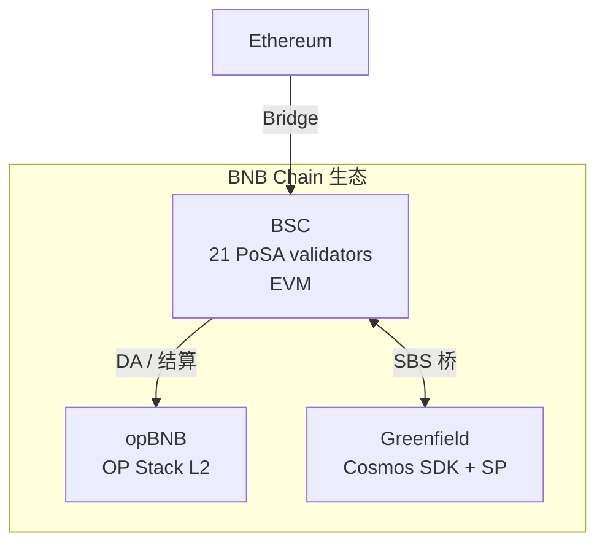

# BNB Chain

> **TL;DR**：BNB Chain 是 Binance 生态的多链集合，历经三次重大结构演进：(1) 2019-04 BNB Beacon Chain（原名 Binance Chain，基于 Tendermint，专做交易所结算与治理，BEP-2 代币）；(2) 2020-09 推出 **BSC（Binance Smart Chain）**，EVM 兼容 + **PoSA（Proof of Staked Authority）** 共识，21 活跃验证者、3s 出块；(3) 2022-02 品牌统一为 "BNB Chain"，并在 2024-06 完成 **BNB Chain Fusion**——把 Beacon Chain 退役，所有 BEP-2 资产与治理功能迁移到 BSC，形成"单主链 + opBNB L2 + Greenfield 存储链"的三位一体。截至 2026-04，BSC 日活地址 > 150 万，TVL 稳居公链 Top 5（DefiLlama），PancakeSwap、Venus、Binance Launchpad Meme、opBNB 游戏、AI Agent 构成主要叙事；opBNB 基于 OP Stack，Greenfield 基于 Cosmos SDK + 去中心化存储。

---

## 1. 背景与动机

2017 年 Binance 成立后，上交易所需要一个"可控的链上结算层"。2019 年推出 **Binance Chain（BC）**，是 Tendermint fork，以 DEX + BEP-2 代币发行为主。但 BC 不支持通用智能合约，无法承载 DeFi 浪潮。2020 年 9 月，Binance 发布 **BSC 白皮书**，核心设计：

1. **EVM 兼容** → 以太坊生态合约 0 成本迁移；
2. **PoSA 共识（21 验证者）** → 出块 3s、gas 费极低；
3. **双链架构** → BC 与 BSC 通过跨链桥传递 BEP-2 ↔ BEP-20 资产。

BSC 上线后 4 个月 TVL 突破 100 亿美元（2021-Q2），但同时也成为黑客攻击、rug pull、meme 投机的重灾区。2022-02，团队把 BC + BSC 合并品牌为 **BNB Chain**。2023-01 推出 opBNB（OP Stack L2，专注游戏/社交），2023-10 Greenfield 主网（去中心化存储）。2024-06 **BNB Chain Fusion**：Beacon Chain 退役，治理与 staking 搬到 BSC，实现"单主链"。

## 2. 核心原理

### 2.1 PoSA 共识：形式化

PoSA = **Proof of Staked Authority**，是 Ethereum Clique（PoA）与 Tendermint PoS 的混合：

- **验证者集合** `V`：链上注册并抵押 ≥ 2,000 BNB（自抵押门槛）的节点，每日从抵押排名前 45 中选出：
  - 前 21 名称 **Cabinets**；
  - 22–45 名称 **Candidates**。
- **出块轮转（Parlia 共识）**：每个 Epoch（200 blocks ≈ 10 min）重新选出 21 个活跃验证者（**18 Cabinets + 3 Candidates**），按确定性顺序轮流出块（round-robin）：
  - 出块 slot 时间 = 3 秒（2024 BEP-336 后可配置至 1.5s）；
  - 非当前出块人在"In-turn"迟 1 秒后可以"Out-of-turn"出块，避免 leader 缺席时停滞；
- **终局性**：原 Parlia 只有概率确定性（通常 2–3 个 epoch 即 **不可逆**）。2023-07 **BEP-126 Fast Finality** 上线，引入额外的 BLS 投票：21 验证者中 **≥ 2/3 投票** 的区块达成"finalized"，终局时间 ~7.5s（3 个 block 的窗口）。

**安全假设**：诚实验证者 > 1/2 时可持续出块；诚实 > 2/3 时 Fast Finality 有效。

### 2.2 验证者选举与 slashing

- **日选举**：每天 UTC 00:00 按 stake 排名重选；
- **质押最低自抵押**：2,000 BNB；
- **Slashing**（据 BSC 文档）：
  - **Double Sign**：没收 200 BNB + jail 30 天；
  - **Malicious Fast Finality Vote**：没收 200 BNB + jail 30 天；
  - **Downtime**（24h 内缺席 ≥ 150 个出块轮）：没收 10 BNB + jail 2 天；
  - **Self-delegation < 2,000 BNB**：jail 2 天。
- **Delegator 分润**：普通持币者可委托给验证者，按佣金率（例如 20%）分享区块奖励。

### 2.3 EVM 兼容的实现层面

BSC fork 自 go-ethereum（Geth）并做了以下改造：

- **Consensus module**：以 `consensus/parlia` 替代 ethash / clique；
- **State trie**：仍使用 Ethereum MPT（Merkle Patricia Trie）+ RLP 编码；
- **Chain ID = 56**（主网），与 Ethereum（1）区隔；
- **Gas 价格低廉**：典型 1–3 gwei（2024 后动态下降到 0.1 gwei 通缩目标）；
- **Block gas limit**：140M（2024 年提升），EVM 指令集与 Cancun 保持同步（延后 1–3 个月跟进）。

### 2.4 opBNB：OP Stack L2

opBNB 是 OP Stack fork，唯一改动：

- **结算层 = BSC**（而非 Ethereum L1）；
- **数据可用性 = BSC calldata**（或可选 Greenfield 存储）；
- **Sequencer** 目前由 BNB Chain 团队运营；
- **TPS 数千，gas < 0.001 USD**；主要承载链游（例如 CyberConnect、opBNB 上的 Roach Racing Club）。

### 2.5 Greenfield：去中心化存储层

- **架构**：基于 Cosmos SDK 的独立链 + 链下存储提供者（SP，Storage Provider）；
- **Object model**：类 S3 的 bucket/object，大对象切片后分布式存储于多个 SP；
- **数据完整性**：链上存储 object merkle root + SP 签名承诺；
- **与 BSC 互操作**：SBS（Store-Bridge-Serve）跨链桥，BSC 智能合约可调用 Greenfield 对象（查询 owner、change permission）；
- **代币**：BNB 作为 gas 和存储支付。

### 2.6 BNB 代币经济与销毁

- **总供给**：初始 2 亿，目标减至 1 亿（通过销毁）；
- **季度销毁（Auto-Burn）**：2021 BEP-95 引入，根据 BNB 链上活跃度与币价自动计算销毁量，2024 年通过 auto-burn + BSC gas 实时销毁已累计销毁 5,500 万枚+；
- **Real-Time Burn**：BSC 每笔交易的 10% gas fee 直接销毁（EIP-1559 类似）。

### 2.7 关键参数

| 参数 | 值 | 可治理 |
|---|---|---|
| BSC 出块时间 | 3 s（2024-Q4 后部分区间 1.5s）| BEP |
| Epoch 长度 | 200 blocks ≈ 10 min | BEP |
| 活跃验证者 | 21（18 Cabinet + 3 Candidate）| BEP |
| 最低自抵押 | 2,000 BNB | BEP |
| Fast Finality 窗口 | ~7.5 s | BEP |
| Chain ID | 56 | 硬编码 |
| opBNB 出块 | 1 s | BEP |

### 2.8 图示



## 3. 架构剖析

### 3.1 分层视图（BSC 节点）

1. **P2P Layer（devp2p）**：复用 geth 的 P2P；
2. **Consensus Layer（Parlia + BLS Fast Finality）**：21 验证者轮流出块 + BLS 投票；
3. **Execution Layer（EVM）**：fork geth 的 EVM；
4. **State Layer**：MPT；
5. **RPC Layer**：JSON-RPC / WS / GraphQL（Erigon RPC 风格）。

### 3.2 核心模块清单（对应 `bnb-chain/bsc`）

| 模块 | 目录 | 职责 | 可替换性 |
|---|---|---|---|
| Parlia 共识 | `consensus/parlia/` | PoSA 区块验证、签名者轮转 | 低（协议核心）|
| BLS 投票 | `core/vote/` | Fast Finality 投票池 | 低 |
| Validator Contract | `core/systemcontracts/` | 验证者抵押/选举系统合约 | 低 |
| EVM | `core/vm/` | fork geth | 低 |
| State | `core/state/` | 状态 trie | 低 |
| TxPool | `core/txpool/` | mempool，支持 snap/fast sync | 高 |
| RPC | `internal/ethapi/` | JSON-RPC | 高 |
| Cross-chain precompile | `core/vm/contracts.go` | 与 BC 通信（fusion 后冻结）| 中 |
| P2P | `p2p/` | devp2p | 低 |
| Snap sync | `eth/protocols/snap/` | 快速同步 | 高 |

### 3.3 数据流：一笔 BSC 转账

1. 钱包签名 Tx（chain id=56, EIP-1559 格式）→ 广播至 RPC；
2. TxPool 校验余额、nonce；
3. 当前 in-turn 验证者在 3s 内打包；
4. 打包后广播区块 → 其他验证者快速验证 EVM 执行 + state root；
5. 21 验证者中 ≥ 14 BLS 投票 → 进入 finality buffer；
6. 3 个 finality window 后 block finalized（≈ 7.5s）；
7. 用户钱包显示 confirmed。

### 3.4 客户端多样性

- **bnb-chain/bsc（Go）**：唯一全功能验证者实现，基于 go-ethereum。
- **bnb-chain/bsc-erigon**（2023 推出）：基于 Erigon 的存档/RPC 节点，不作为验证者（无 Parlia 模块）。
- **Greenfield node**（Cosmos SDK Go）、**op-node（opBNB Sequencer，OP Stack Go）**。

BSC 存在 **单客户端 Geth 风险**——与 Ethereum 早期相似。社区讨论过 Rust 实现但尚未启动。

### 3.5 扩展接口

- **JSON-RPC**：与 Ethereum 兼容，支持 `eth_*`、`debug_*`、`trace_*`；
- **Cross-chain Contract**：BEP-20 ↔ BEP-2 桥（2024 Fusion 后只剩少量冷钱包迁移）；
- **BEP 系列**：BEP-2（BC）、BEP-8（mini token）、BEP-20（BSC ERC-20 对应）、BEP-721 / 1155（NFT）、BEP-126（Fast Finality）、BEP-336（Block Time）、BEP-466（Validator election）。

## 4. 关键代码 / 实现细节

Parlia Seal 函数（简化自 `consensus/parlia/parlia.go`）：

```go
// Seal：当前节点若为 in-turn 验证者则签名并广播
func (p *Parlia) Seal(chain ChainHeaderReader, block *types.Block, results chan<- *types.Block) error {
    header := block.Header()
    // 从 snapshot 读取当前 validator set
    snap, err := p.snapshot(chain, header.Number.Uint64()-1, header.ParentHash)
    // 检查本节点是否被选为此 block 的 signer
    if _, authorized := snap.Validators[p.val]; !authorized {
        return errUnauthorizedValidator
    }
    // 等到 inturn 时刻
    delay := time.Until(time.Unix(int64(header.Time), 0))
    if snap.inturn(p.val) == false {
        delay += wiggleTime // out-of-turn 延迟 1s
    }
    // 签名 header
    sighash, _ := signFn(accounts.Account{Address: p.val}, types.SealHash(header).Bytes())
    copy(header.Extra[len(header.Extra)-extraSeal:], sighash)
    // 广播
    go func() { ... results <- block.WithSeal(header) ... }()
    return nil
}
```

## 5. 演进与版本对比

| 时间 | 事件 | 影响 |
|---|---|---|
| 2019-04 | Binance Chain (BC) 上线 Tendermint | 中心化 DEX 结算 |
| 2020-09 | BSC 上线，EVM + PoSA | DeFi 爆发 |
| 2021-Q2 | BSC TVL > 100 亿美元 | 超越 Ethereum 周日活 |
| 2022-02 | 品牌统一为 BNB Chain | 生态整合 |
| 2022-10 | Cross-chain 漏洞事件（2 亿 BNB 被非法铸造）| 紧急停链 |
| 2023-01 | opBNB 测试网 | L2 战略启动 |
| 2023-07 | BEP-126 Fast Finality 主网激活 | 终局性 ~7.5s |
| 2023-10 | Greenfield 主网 | 存储层 |
| 2024-06 | BNB Chain Fusion：BC 退役 | 生态简化 |
| 2024-Q4 | Opcode Shanghai→Cancun 对齐、0.75s 测试 | 性能升级 |
| 2026-04 | Maxwell 硬分叉计划（出块 0.75s、更高 gas 上限）| 见官方 BEP-524 |

## 6. 实战示例：部署一个 BEP-20 代币到 BSC

```solidity
// MyToken.sol
// SPDX-License-Identifier: MIT
pragma solidity ^0.8.20;
import "@openzeppelin/contracts/token/ERC20/ERC20.sol";
contract MyToken is ERC20 {
    constructor() ERC20("MyToken", "MTK") {
        _mint(msg.sender, 1_000_000 * 1e18);
    }
}
```

```bash
# Foundry
forge create --rpc-url https://bsc-dataseed.bnbchain.org \
  --private-key $PK src/MyToken.sol:MyToken
# 预期输出：
# Deployer: 0x...
# Deployed to: 0x...
# Transaction hash: 0x...
```

查 https://bscscan.com/tx/<hash> 验证。

## 7. 安全与已知攻击

### 7.1 2022-10 BSC Token Hub 跨链桥漏洞

2022-10-06 攻击者利用 BSC Token Hub（BEP-2 ↔ BEP-20 IAVL 证明验证漏洞）**伪造 Merkle proof 铸造 200 万 BNB（~5.7 亿美元）**。验证者紧急投票暂停出块，冻结跨链桥 ~20 小时，并硬分叉黑名单攻击者地址（约 1.1 亿美元资金被提款到外部链后无法追回）。事件后官方重写 cross-chain precompile（BEP-171），引入更严格的 IAVL verifier，是 BSC 被迫"紧急回滚"的代表事件。详见 [BSC Postmortem](https://www.bnbchain.org/en/blog/bnb-chain-ecosystem-update) 与 [慢雾分析](https://slowmist.com)。

### 7.2 rug pull 与 SquidGame (2021-11)

SquidGame 代币在 PancakeSwap 上线后通过合约 `transfer` 黑名单锁卖，开发者卷走 ~300 万美元。暴露了 BSC 早期合约审核缺失、用户对代币合约代码审查能力不足。此后 DEX Aggregator（1inch、Dodo）开始集成 Honeypot 检测。

### 7.3 Venus Protocol 2021-05 清算危机

LUNA 式闪崩（XVS 价格被操纵）导致 Venus 产生 1 亿美元坏账。事件后 Venus 引入延迟预言机与杠杆限制。

### 7.4 Fast Finality 激活后的理论攻击面

引入 BLS 后增加了 **malicious fast finality vote** 的 slashing 条件。若超过 1/3 验证者串谋签名两个冲突的 finalized block，会被惩罚 200 BNB/节点。目前无实际事故。

## 8. 与同类方案对比

| 维度 | BNB Chain (BSC) | Ethereum L1 | Polygon PoS | Avalanche C-Chain |
|---|---|---|---|---|
| 共识 | PoSA (Parlia + BLS FF) | Gasper PoS | PoS + Heimdall | Snowman + Snow BFT |
| 验证者数 | 21 活跃 / 45 候选 | ~100 万 | ~100 | ~1,400 |
| 出块 | 3 s（1.5 s in-progress）| 12 s | 2 s | 1–2 s |
| Finality | ~7.5 s (BLS) | 12–15 min | 概率性，checkpoint 30 min | ~1 s |
| Gas 费 | 极低 | 中–高 | 低 | 低 |
| EVM 兼容 | ✅ | ✅（源）| ✅ | ✅ |
| L2 策略 | opBNB (OP Stack) | 多 rollup | CDK / zkEVM | Subnet |
| TVL（2026-04，DefiLlama）| ~60 亿美元 | ~600 亿美元 | ~10 亿美元 | ~15 亿美元 |

权衡：BSC 去中心化程度远低于 Ethereum（21 vs. 100 万 validator），但日活与散户交易量稳居前列；其"低 gas + CEX 出入金便利 + 币安宣发"构成最强飞轮。

## 9. 延伸阅读

- **官方文档**：
  - [BNB Chain Docs](https://docs.bnbchain.org)
  - [BSC Docs](https://docs.bnbchain.org/bnb-smart-chain)
  - [BEP List](https://github.com/bnb-chain/BEPs)
- **核心仓库**：
  - [bnb-chain/bsc](https://github.com/bnb-chain/bsc)
  - [bnb-chain/opbnb](https://github.com/bnb-chain/opbnb)
  - [bnb-chain/greenfield](https://github.com/bnb-chain/greenfield)
- **权威研究**：
  - [Messari: State of BNB Chain](https://messari.io/research)
  - [L2BEAT: opBNB](https://l2beat.com)
  - [DefiLlama BSC Chain](https://defillama.com/chain/BSC)
- **博客 / 复盘**：
  - [慢雾 BSC Token Hub 事件分析](https://slowmist.com)
  - [登链社区 BSC 专栏](https://learnblockchain.cn/column/bsc)
- **视频**：
  - CZ Binance Blockchain Week（YouTube 回放）
  - 链闻 BSC 深度分析（B 站）

## 10. 术语表

| 术语 | 英文 | 释义 |
|---|---|---|
| BSC | Binance Smart Chain | BNB Chain 的 EVM 主链 |
| BC | Beacon Chain | 原 Binance Chain，2024 Fusion 退役 |
| PoSA | Proof of Staked Authority | 授权节点 + 抵押的混合 PoS |
| Parlia | Parlia | BSC 的 PoSA 共识实现名 |
| Cabinets / Candidates | Cabinets / Candidates | 验证者分级，前 21 / 22–45 |
| Fast Finality | Fast Finality (BEP-126) | BLS 投票的快速终局 |
| opBNB | opBNB | BSC 基于 OP Stack 的 L2 |
| Greenfield | Greenfield | BNB Chain 去中心化存储 |
| BEP | Binance Evolution Proposal | BNB Chain 协议改进提案 |
| BEP-20 | BEP-20 | BSC 上等同 ERC-20 的代币标准 |
| Fusion | Fusion | 2024-06 BC 退役迁移事件 |
| Auto-Burn | Auto-Burn | 季度 BNB 销毁机制 |

---

*Last verified: 2026-04-22*
