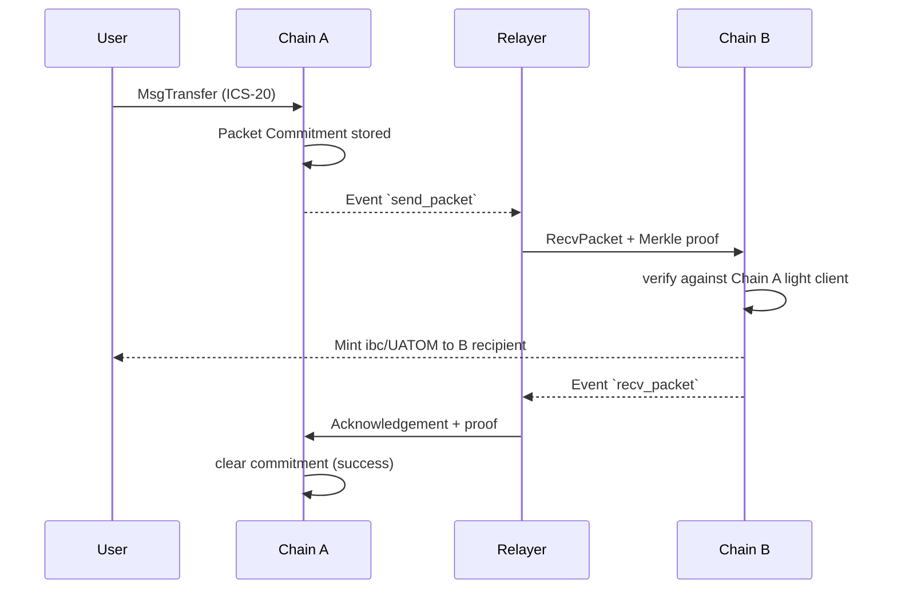

# Cosmos

> **TL;DR**：Cosmos 并不是"一条公链"，而是 **以 Tendermint/CometBFT 为共识内核、Cosmos SDK 为应用框架、IBC 为跨链协议** 的应用链（App-Chain）宇宙。其核心命题——"**Internet of Blockchains**"——假设每个应用应该有自己的主权区块链，通过标准化的跨链协议像 TCP/IP 一样互联。具体而言：(1) **Tendermint Core / CometBFT** 提供 ~5 秒确定性终局、基于 BLS 的 PBFT 变种；(2) **ABCI++** 是"共识 ↔ 应用"边界接口，把状态转移函数完全抽象为 gRPC 调用；(3) **Cosmos SDK** 是 Go 语言模块库，`x/bank`、`x/staking`、`x/gov`、`x/ibc` 等可插拔模块支撑数十条主流链；(4) **IBC (Inter-Blockchain Communication)** 基于轻客户端证明与超时机制，成为去信任跨链的事实标准（现已扩展到非 Cosmos 链）。生态代表：Cosmos Hub（ATOM）、Osmosis（AMM）、dYdX v4（orderbook L1）、Celestia（模块化 DA）、Injective、Neutron、Noble（USDC 发行链）。据 map.interchain 与 Cosmos 官方估计活跃 IBC 互联链数约 100+。

---

## 1. 背景与动机

2014 年 Jae Kwon（Tendermint 发明者）发表 ["Tendermint: Consensus without Mining"](https://tendermint.com/static/docs/tendermint.pdf)，提出把 BFT 共识与应用解耦、用 ABCI 定义清晰边界。2016 年 Kwon 与 Ethan Buchman 撰写 [Cosmos Whitepaper](https://github.com/cosmos/cosmos/blob/master/WHITEPAPER.md)，阐述 "Internet of Blockchains" 愿景：放弃 "一条全球链承载所有应用" 的思路，允许每条应用拥有自己的主权（治理、 validator 集、甚至代币经济），通过 IBC 标准协议互通。2017-04 ICO、2019-03-13 Cosmos Hub 主网启动、2019 首版 Cosmos SDK 发布、2021 IBC v1 上线并快速成为 Cosmos 生态事实标准。

2023 年 Tendermint Core 更名 **CometBFT** 并由 Informal Systems 等社区托管；ATOM 2.0 提案（2022 被否） 转向 ATOM 3.0 讨论，强调 ATOM 作为生态价值存储 + ICS (Interchain Security)。核心研发由 Interchain Foundation、Informal Systems、Binary Builders、Strangelove Labs、Notional 等分布式合作推进。

## 2. 核心原理

### 2.1 形式化定义：Tendermint/CometBFT 共识

CometBFT 是 **部分同步网络假设** 下的经典 PBFT 变种，容错上限 $f < n/3$。共识按 **高度 height → 轮次 round → 阶段 step** 递归推进：

$$
(H, R, S) \in \mathbb{N} \times \mathbb{N} \times \{\text{Propose, Prevote, Precommit, Commit}\}
$$

每一 round 流程：
1. **Propose**：按确定性轮值（根据 voting power 加权 round-robin）产生的 proposer 广播 proposal block。
2. **Prevote**：每个 validator 验证 block 并广播 prevote；若 2f+1 prevote 同一块则 **polka**（俚语波尔卡，表示首轮意向一致）。
3. **Precommit**：收集 polka 后 validator 发送 precommit；若 2f+1 precommit 同一块则 **commit**，块上链。
4. 否则 round++，超时翻倍（$t_{prop} \cdot 2^R$）。

安全性定理：不可能有 2 个不同 block 都在同一 height 被 commit（假设 $f < n/3$）。活性定理：在 GST（global stabilization time）之后，合法 validator 最终会 commit 新 block。参见 [Tendermint 论文](https://arxiv.org/abs/1807.04938)。

### 2.2 ABCI++ 接口

**Application Blockchain Interface (ABCI)** 是 Cosmos 的哲学基石：把状态机完全抽象为 gRPC 调用，使 **共识引擎（CometBFT）** 与 **应用（Cosmos SDK 或自定义 VM）** 完全正交。核心方法（ABCI++，2023 引入）：

| 方法 | 时机 | 作用 |
| --- | --- | --- |
| `InitChain` | 创世 | 初始化状态、validator set |
| `PrepareProposal` | 每高度 Propose 前 | 应用决定 block 里 tx 顺序（1.0 后加入，支持 MEV 抢跑防护与 encrypted mempool） |
| `ProcessProposal` | Prevote 前 | validator 判断 proposal 是否接受 |
| `VoteExtension` | Prevote | 附加 extension 数据（预言机推送、lane 信息） |
| `FinalizeBlock` | Commit 时 | 执行 tx、更新 state |
| `Commit` | 之后 | 落盘状态、返回 AppHash |
| `Query` | 任何时刻 | 查询状态 |

ABCI++ 使应用可自由定制 block 组装（Skip 的 Block SDK、Mekatek）、实施 threshold encryption mempool、追加 validator 签名证明（Pyth 预言机就依赖 VoteExtension）。

### 2.3 IBC 协议

IBC 是 Cosmos 最具价值的基础设施之一（[IBC Spec](https://github.com/cosmos/ibc) ICS 标准集）。核心组件：

1. **Light Client** (ICS-02)：每条链为另一条链维护轻客户端（存 validator set + 近期 header）。
2. **Connection** (ICS-03)：两链间的一次性握手，确定信任对端 light client。
3. **Channel** (ICS-04)：类似 TCP 连接的有序/无序通道，绑定特定应用模块（port_id）。
4. **Packet**：应用层消息，附带 commitment proof 与超时 height/timestamp。
5. **Relayer**：链下无信任中继（任何人都可运行），抓取 packet、生成 Merkle proof 并提交目标链。

去信任来源：**Merkle proof + 对方链 header 验证**。换言之"信任双方链的共识，而非 relayer"。此性质让 IBC 成为目前 security 最强的通用跨链协议之一。

ICS-20 Token Transfer、ICS-27 Interchain Accounts、ICS-29 Relayer Incentivization、ICS-721 NFT transfer 已被广泛部署。2024 后 IBC-Eureka 扩展到以太坊等非 Cosmos 链。

### 2.4 子机制拆解

1. **Staking / Delegation**：Bonded Proof-of-Stake，委托人 delegate 给 validator，21 天 unbonding 期。Slashing 条件：double-sign（~5% stake）、downtime（~0.01% + jail）。
2. **x/gov 治理**：参数、代码升级、社区基金全部上链投票；quorum 40%、threshold 50%、veto 33.4%。
3. **Inflation & Distribution**：目标质押率 2/3 时通胀率 ~7%，偏离时通胀调节。奖励经 `x/distribution` 分发给 delegator。
4. **Interchain Security (ICS)**：Cosmos Hub 出借 validator 集合为消费链（replicated security）或 mesh security（多 provider）保驾护航。
5. **Fee Grant / Auth / Vesting**：账户抽象前置：`x/feegrant` 让别人代付、`x/authz` 授权别人操作、`x/vesting` 线性解锁。
6. **App-Chain 定制自由度**：可换代币、可禁用 `x/gov`、可自写 `x/custom`；因此 dYdX 可以构建 orderbook，Celestia 可以构建 DA-only 链。

### 2.5 参数与常量

| 参数 | 典型值 | 说明 |
| --- | --- | --- |
| Block time | 5–7 s (Hub), 1 s (dYdX) | 每链可调 |
| Validator 上限 | 180 (Hub)，可调 | 按 voting power 选 |
| Unbonding 期 | 21 天 (Hub) | 对抗长程攻击 |
| Slashing double-sign | ~5% | |
| Slashing downtime | ~0.01% + jail | |
| IBC packet timeout | 通常 10 min | 可配 |
| ATOM inflation | 7% ± 动态 | 目标 bonded 67% |

### 2.6 边界条件与失败模式

- **> 1/3 validator 恶意**：安全性被破坏，需硬分叉。
- **Hub 停摆**：2023 年有 validator 因性能下降导致出块变慢的记录，Comet 会持续重试 proposer 直到超时。
- **IBC 超时 / 包卡死**：Relayer 未能在 timeout 前送达会导致 refund；若对方链 halt，refund 无法完成，需跨链治理。
- **链升级不兼容**：Comet + SDK 组合升级需 validator 同步部署同版本；历史上有链因此短暂 halt。

### 2.7 图示



## 3. 架构剖析

### 3.1 分层视图

```
┌────────────────────────────────────────────────┐
│ Wallets (Keplr, Leap) / CLI / REST API         │
├────────────────────────────────────────────────┤
│ gRPC / REST Gateway / Tendermint RPC           │
├────────────────────────────────────────────────┤
│ Cosmos SDK Application:                        │
│   ├── BaseApp (tx routing, ante handler)       │
│   ├── x/* modules (bank, staking, gov, ibc...) │
│   ├── Keeper pattern (module-to-module)        │
│   └── KVStore (IAVL tree on LevelDB)           │
├────────────────────────────────────────────────┤
│ ABCI++ interface                               │
├────────────────────────────────────────────────┤
│ CometBFT Consensus:                            │
│   ├── P2P (libp2p-like gossip)                 │
│   ├── Mempool                                  │
│   ├── Consensus State Machine                  │
│   └── Block Store + WAL                        │
└────────────────────────────────────────────────┘
```

### 3.2 核心模块清单（映射 `cosmos/cosmos-sdk` v0.50.x）

| 模块 / 目录 | 职责 | 依赖 | 可替换性 |
| --- | --- | --- | --- |
| `baseapp/` | Tx 路由、Ante 链、CheckTx/DeliverTx | KVStore | 应用必装 |
| `x/auth` | 账户、签名、fee 验证 | keyring | 必选 |
| `x/bank` | 原生代币余额、MsgSend | auth | 必选 |
| `x/staking` | validator 注册 / 委托 | bank, distribution | 通常必选 |
| `x/slashing` | 双签 / downtime 罚没 | staking | 通常必选 |
| `x/distribution` | 奖励分配 | staking | 通常必选 |
| `x/gov` | 提案、投票 | bank | 可替换自定义 |
| `x/ibc` (单独 ibc-go) | ICS 标准族实现 | x/capability | 跨链必选 |
| `x/upgrade` | 链上协议升级流程 | | 必选 |
| `x/wasm` (CosmWasm) | Rust/Wasm 合约引擎 | x/bank | 可选 |
| `x/evm` (如 Ethermint) | EVM 兼容层 | | 可选 |
| `store/` | IAVL + multi-store | LevelDB/Pebble | 可替换存储引擎 |

### 3.3 数据流：Cross-chain IBC 转账

以 Alice 从 Osmosis 转 OSMO 到 Cosmos Hub 为例：

1. Alice 在 Keplr 钱包发 `MsgTransfer{source_channel, token:OSMO, receiver}`。
2. Osmosis 节点 CheckTx，进入 mempool。
3. 当前 round 的 proposer 打包，经 CometBFT 三阶段 commit（~5 s）。
4. Osmosis `x/ibc-transfer` 在 `FinalizeBlock` 处理时：锁 OSMO、写入 packet commitment、发 event `send_packet`。
5. **Hermes / Go Relayer** 监听事件，从 Osmosis 生成 Merkle proof 打包 RecvPacket 交易发到 Cosmos Hub。
6. Hub 的 light client 验证 proof 对应的 Osmosis header 已 finalized，IBC 模块 mint `ibc/OSMO-voucher` 到 Alice 的 Hub 地址。
7. Hub 写 event `recv_packet`，Relayer 再把 acknowledgement proof 发回 Osmosis 清理 commitment。

整个过程链上无信任，Relayer 仅做数据搬运。延迟一般 **20–40 秒**（两链 commit + Relayer 延时）。

### 3.4 客户端多样性

- **CometBFT** (Go)：当下唯一生产主实现。
- **gaiad / cosmos-sdk** 基于 Go + Comet 的 App-Chain 节点；每条链有自己的 binary（osmosisd、dydxprotocold 等）。
- **Informal Systems** 的 Rust TLA+ / quint 规范 与 实验性 Rust 实现（例如 **Malachite** 共识引擎）正在评审。
- **CometBFT** 替代选择：Informal 正尝试 **Malachite** 用 Rust 重写，目前尚未主网。

### 3.5 扩展接口

- **Tendermint RPC**：WebSocket + JSON，可订阅 block/tx。
- **Cosmos SDK gRPC & REST**：由 protobuf 定义，自动生成文档。
- **CosmWasm**：Rust → Wasm 合约，跨 App-Chain 可移植。
- **EVM 兼容层**：Evmos / Ethermint / Injective 提供 `eth_*` JSON-RPC。
- **Interchain Accounts (ICS-27)**：一条链在另一条链"开户"并代为签署交易。

## 4. 关键代码 / 实现细节

`BaseApp` Tx 处理主循环（简化自 `cosmos-sdk/baseapp/baseapp.go` v0.50）：

```go
func (app *BaseApp) runTx(mode runTxMode, txBytes []byte) (sdk.GasInfo, *sdk.Result, error) {
    tx, err := app.txDecoder(txBytes)
    if err != nil { return gInfo, nil, err }
    // 1. AnteHandler：签名验证、账号存在、gas 预留、fee 扣
    newCtx, err := app.anteHandler(ctx, tx, mode == runTxModeSimulate)
    if err != nil { return gInfo, nil, err }
    // 2. 逐个 Msg 路由到对应模块 Handler
    for _, msg := range tx.GetMsgs() {
        handler := app.msgServiceRouter.Handler(msg)
        res, err := handler(newCtx, msg)
        if err != nil { return gInfo, nil, err }
    }
    // 3. PostHandler（可选）
    return gInfo, result, nil
}
```

> 真实实现有 Checkpoint、消息路由缓存、Gas Refund、EIP-1559 风格 fee market（在 SDK Feemarket 模块）等细节；详见 v0.50+。

## 5. 演进与版本对比

| 版本 | 时间 | 关键变化 | 影响 |
| --- | --- | --- | --- |
| Cosmos Hub Launch | 2019-03-13 | Tendermint + SDK 0.x | 启动 |
| IBC v1 | 2021-03 | Inter-Blockchain 生产 | 网络效应飞轮 |
| Stargate (SDK 0.40) | 2021 | Protobuf + IBC | 重大升级 |
| Theta / Rho (Hub) | 2022 | Interchain Accounts, Security 预研 | 基础设施 |
| CometBFT 0.37 / 0.38 | 2023 | 从 Tendermint 更名，ABCI++ | 接口规范化 |
| SDK 0.47 / 0.50 | 2023–2024 | PreBlocker、ABCI++ 正式、Store v2 推进 | 开发者体验 |
| IBC-Eureka | 2024 | 把 IBC 适配到非 Cosmos 链 | 跨生态互联 |
| Malachite (实验) | 2025 | Rust 新共识引擎 | 性能 + 客户端多样性 |

## 6. 实战示例

```bash
# 本地跑一条基于 Cosmos SDK 的 mini chain
git clone https://github.com/cosmos/cosmos-sdk
cd cosmos-sdk/simapp && go run ./cmd/simd init testnet && go run ./cmd/simd start

# 用 Keplr 钱包发 MsgSend
simd tx bank send alice cosmos1rcpt... 1000stake --chain-id test-1

# 启动 Hermes Relayer 建立 IBC Connection
hermes create connection --a-chain chainA --b-chain chainB
hermes create channel --a-chain chainA --a-port transfer --b-chain chainB --b-port transfer

# 跨链转账
simd tx ibc-transfer transfer transfer channel-0 cosmos1x... 100stake
```

预期：本地 chain 出块；跨链后目标链多出 `ibc/<hash>` 凭证，在 Keplr 中可见。

## 7. 安全与已知攻击

1. **IBC Dragonberry 漏洞 (2022-10)**：ibc-go 在 `MsgTimeoutOnClose` 的证明验证中存在一个使 light client 被欺骗的路径，由 [Imperator](https://x.com/imperatorco) 与 Informal 发现，通过链上协调静默热修复，据估计波及百亿级 TVL。复盘见 [IBC security advisory GHSA-753q-fppg-qpcx](https://github.com/cosmos/ibc-go/security/advisories)。
2. **Tendermint 0.34 ABCI 回放漏洞**：历史 Comet 版本中 `LastResultsHash` 计算顺序错误，使恶意应用能伪造 FinalizeBlock 响应，hub 做过协调升级。
3. **理论攻击面**：① 长程攻击 — delegator unbond 后 21 天内旧 key 可构造历史分叉，但 weak subjectivity checkpoint（节点启动时指定 trusted height）将此最小化；② IBC light client 过期——若双方链长期不通信，light client 超过 trust period 失效需手动 recovery；③ Relayer 拒绝投递不影响安全但影响活性。

## 8. 与同类方案对比

| 维度 | Cosmos (App-Chain) | Polkadot (Parachain) | Avalanche (L1) | Ethereum (L2 Rollup) |
| --- | --- | --- | --- | --- |
| 主权度 | 极高（自有 validator） | 低（共享 Relay Chain） | 中（Etna 后高） | 中（Rollup 受 L1 限制） |
| 共享安全 | 可选（ICS） | 默认 | 可选 | 默认（L1 承担 DA） |
| 跨链协议 | IBC（去信任） | XCMP（消息总线） | Warp/Teleporter | CCIP/L0/Native bridges |
| 共识 | CometBFT | BABE+GRANDPA | Snowman | LMD-GHOST+FFG |
| 合约模型 | Go 模块 + CosmWasm / EVM | ink! / Wasm | EVM (C-Chain) | EVM |
| 代币 | 每条链自有 | DOT 租 slot | AVAX/subnet | ETH/L2 token |
| 生态链数 | ~100 IBC 互联 | ~数十 parachain | 数十 subnet/L1 | ~30 主要 rollup |
| 启动成本 | 中（自建 validator 集） | 高（slot 拍卖/coretime） | 低（Etna 后） | 低（用 L2 框架） |

## 9. 延伸阅读

- **官方文档 / Spec**：
  - [Cosmos SDK Docs](https://docs.cosmos.network/)
  - [CometBFT Docs](https://docs.cometbft.com/)
  - [IBC Spec (ICS)](https://github.com/cosmos/ibc)
- **核心论文**：
  - [Tendermint: Byzantine Fault Tolerance in the Age of Blockchains (Buchman, 2016)](https://atrium.lib.uoguelph.ca/xmlui/handle/10214/9769)
  - [The Latest Gossip on BFT Consensus (2018)](https://arxiv.org/abs/1807.04938)
- **权威博客**：
  - [Interchain Foundation Blog](https://interchain.io/)
  - [Informal Systems Blog](https://informal.systems/blog)
  - [Messari Cosmos Ecosystem Map](https://messari.io/)
  - [a16z crypto on App-Chain 架构](https://a16zcrypto.com/)
- **视频**：
  - Sunny Aggarwal 的 Osmosis / App-Chain thesis 演讲
  - Jae Kwon Tendermint 10 周年回顾
- **规范 / 提案**：
  - [ADR Index (cosmos-sdk)](https://docs.cosmos.network/main/build/architecture/)
  - [ICS Standards (ibc)](https://github.com/cosmos/ibc)

## 10. 术语表

| 术语 | 英文 | 释义 |
| --- | --- | --- |
| 应用链 | App-Chain | 为特定应用定制的独立 L1 |
| ABCI | Application Blockchain Interface | 共识 ↔ 应用的 gRPC 接口 |
| ABCI++ | ABCI 2.0 | 加入 PrepareProposal / VoteExtension 等 |
| 跨链通信 | IBC (Inter-Blockchain Communication) | Cosmos 去信任跨链标准 |
| 中继器 | Relayer | 链下无信任消息中继 |
| 消费链 | Consumer Chain | 通过 ICS 租用 Hub 安全性的链 |
| 委托 | Delegation | ATOM 持有者把权益投给 validator |
| 波尔卡 | Polka | 2/3 prevote 达成共识的俗称 |
| 软分叉一致性 | Weak Subjectivity | 节点启动时指定可信 checkpoint |
| 轻客户端 | Light Client | 只存 header + validator set，验证证明 |

---

*Last verified: 2026-04-22*
