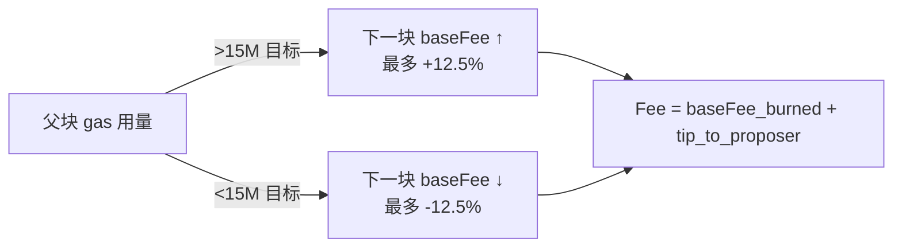
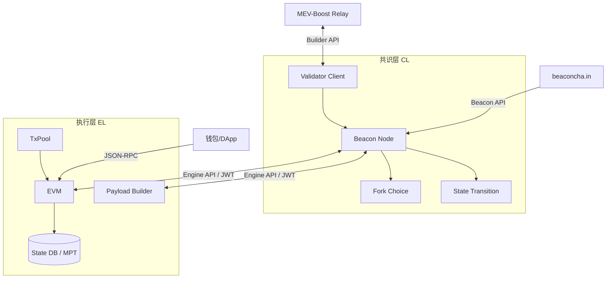

# Ethereum（以太坊）

> **TL;DR**：Ethereum 是 Vitalik Buterin 于 2013 年末提出、2015 年 7 月 30 日创世的 **可编程区块链**。与 Bitcoin 的差异核心在于图灵完备的 **EVM**、基于 Gas 的资源计费、以及 **Account 状态模型**。它经历了从 PoW 到 PoS 的历史性跃迁（2022-09-15 **The Merge**）、EIP-1559 费用市场改革（2021-08，费用销毁）、Shanghai 取款激活（2023-04）、Cancun-Deneb 的 **EIP-4844 Blob**（2024-03，为 L2 降本 10~100 倍）、Pectra 引入 **EIP-7702 EOA 账户抽象**（2025-05）。其生态是整个智能合约赛道的事实标准：ERC-20/721/1155/4626、DeFi 乐高、L2 Rollup、Restaking 均诞生于此。截至 2026 年 4 月，ETH 质押率约 28%，活跃验证者超 100 万，L2 聚合 TVL 已超过 L1。

---

## 1. 背景与动机

2013 年 11 月，Vitalik 发布《[Ethereum White Paper](https://ethereum.org/en/whitepaper/)》，指出 Bitcoin 脚本语言的三大局限：**非图灵完备、UTXO 对状态的表达笨拙、缺少区块链原生资产与身份抽象**。解决方案是在区块链内置一个图灵完备虚拟机，将"智能合约"作为一等公民。2014 年 Gavin Wood 发布《[Yellow Paper](https://ethereum.github.io/yellowpaper/paper.pdf)》，用形式化记号精确定义 EVM 与状态转换函数 `Υ`。

白皮书 vs 黄皮书的区分：白皮书是动机+蓝图，黄皮书是**协议规范**（含确切的 Gas 收费表、RLP 编码、Merkle-Patricia Trie 结构）。黄皮书与 [consensus-specs](https://github.com/ethereum/consensus-specs)（共识层）和 [execution-specs](https://github.com/ethereum/execution-specs)（执行层）共同构成 Ethereum 的事实规范。

Ethereum 自诞生起就定位为"世界计算机"：**单机 Serial 执行 + 全球复制验证**，以牺牲执行吞吐换取**状态一致性 + 抗审查**。这一核心假设持续到 Rollup-centric Roadmap 时代，被 L2/DA 分层重构。

## 2. 核心原理

### 2.1 Account 模型

Ethereum 采用 **Account 模型**——世界状态是 `address → AccountState` 的映射。账户分两类：

- **EOA**（Externally Owned Account）：由 secp256k1 私钥控制；有 `nonce`、`balance`，无 `code` 与 `storage`。
- **Contract Account**：由部署者的 `init code` 创建；有 `nonce`、`balance`、`codeHash`、`storageRoot`（指向该账户的 Storage Trie 根）。

世界状态由 **4 棵 Merkle-Patricia Trie** 组织（每区块一组根被放入区块头）：

| Trie | 记录 | 用途 |
| --- | --- | --- |
| State Trie | 所有账户 | 全局状态根 |
| Storage Trie | 某合约的键值存储 | 每合约一棵 |
| Transaction Trie | 当前块所有 Tx | 证明 Tx 被包含 |
| Receipt Trie | 每笔 Tx 的执行收据 | 日志/状态/Gas 用量证明 |

*注*：2024 年起 Ethereum 在推进 **Verkle Tree**（Vector Commitment 化的 MPT，见 [EIP-6800 draft](https://eips.ethereum.org/EIPS/eip-6800)）以支持无状态客户端，预计在 The Verge 阶段合并。

### 2.2 EVM

EVM 是 **256-bit 字长的栈式虚拟机**，约 140+ opcode：

| 类别 | 代表 opcode |
| --- | --- |
| 算术 | ADD, MUL, EXP, MOD |
| 比较 | LT, EQ, ISZERO |
| 堆栈 | PUSH1..PUSH32, DUP, SWAP |
| 内存 | MLOAD, MSTORE, MCOPY (EIP-5656) |
| 存储 | SLOAD, SSTORE, TLOAD/TSTORE (EIP-1153) |
| 控制 | JUMP, JUMPI, JUMPDEST |
| 系统 | CALL, DELEGATECALL, STATICCALL, CREATE, CREATE2, RETURN, REVERT |
| 密码 | SHA3 (Keccak-256), ECRECOVER (预编译) |

执行以 **Gas** 计费防无限循环，每 opcode 定价写在 [execution-specs/src/ethereum/.../gas.py](https://github.com/ethereum/execution-specs)。Gas 既是反女巫手段，也是资源市场。

### 2.3 共识：从 PoW 到 Gasper

**PoW 时代（2015-07 → 2022-09）**：使用 Ethash（Dagger-Hashimoto 系，ASIC 抗性设计）。

**The Merge（2022-09-15）** 完成 PoW → PoS 切换。PoS 共识称 **Gasper = Casper FFG + LMD-GHOST**：

- **LMD-GHOST**（Latest Message Driven, Greediest Heaviest-Observed Sub-Tree）：分叉选择规则，选择累积"验证者最新证明权重"最大的子树。
- **Casper FFG**（Friendly Finality Gadget）：每 **epoch（32 slot ≈ 6.4 分钟）** 进行 2 阶段投票（Justified → Finalized），提供 **确定性经济终局**——违反最终性的验证者将被大规模 slash。
- **Slot/Epoch**：12 秒一个 Slot，32 Slot 组成 Epoch。每 Slot 1 个 proposer + 多个 committee 做 attestation。
- **验证者激活**：质押 **32 ETH** 成为一个 validator；Pectra 后 (EIP-7251) 允许单 validator 余额最高 2048 ETH。

**区块构造**：引入 **PBS（Proposer-Builder Separation）** 实践：proposer 只决定 "接收哪个已排序区块"，builder 负责竞价打包（MEV-Boost 生态）。

### 2.4 费用市场：EIP-1559

自 2021-08 起交易费分两部分：

- **base fee**（基础费）：每块由协议按父块 gas 用量自动调整（占用 > 目标 15M 时每块上涨最多 12.5%，反之下降）；**全部销毁**。
- **priority fee / tip**（优先费）：用户给 proposer 的小费，决定排序。
- 用户设置的 `maxFeePerGas` 是上限；实付 = `min(maxFeePerGas, baseFee + priorityFee)`。



销毁机制让 ETH 在活跃期 **净通缩**。2022–2024 年累计销毁 > 400 万 ETH。

### 2.5 EIP-4844 Blob（Proto-Danksharding）

**目的**：Rollup 将压缩后的 L2 数据发布到 L1。过去只能放入 calldata（昂贵）。EIP-4844 引入新 Tx 类型 `BLOB_TX_TYPE(0x03)`，允许附带 **最多 6 个 blob（每个 128 KB，共 ~0.75 MB/block）**，数据不入 EVM 状态、仅在 Consensus 层暂存 **18 天**，价格由独立 blob base fee 市场决定。

效果：主流 L2（Arbitrum、Optimism、Base、zkSync）发布费用下降 95%+，用户端交易费从 $0.5–$5 降至 $0.01–$0.1 量级。

### 2.6 RLP 编码

**RLP（Recursive Length Prefix）** 是 Ethereum 的主序列化格式，遍布区块头、交易、MPT 节点、DevP2P 消息。规则只有两条：

1. **单字节 0x00–0x7f**：直接表示自身。
2. **字符串** 长度 `l`：
   - `l ≤ 55`：前缀 `0x80 + l`。
   - `l > 55`：前缀 `0xb7 + bytes(l)`，后跟 `l` 的大端编码。
3. **列表** 负载总长 `L`：
   - `L ≤ 55`：前缀 `0xc0 + L`。
   - `L > 55`：前缀 `0xf7 + bytes(L)`。

优点：编码自描述、最小冗余、天然支持任意嵌套。缺点：不是自描述类型（仅"字符串 vs 列表"两层），需外部 schema 解释字段。为此 EIP-2718 引入 **typed transaction**（首字节 < 0x80 视为 type），EIP-4844 的 Blob Tx（`0x03`）就是按此扩展。Verkle 阶段将引入 **SSZ（Simple Serialize）** 替代部分 RLP 使用，以获得 Merkleization 友好的固定 offset 结构。

### 2.7 MPT 详解与 Verkle 路线

**Merkle-Patricia Trie（MPT）** 是 Merkle 树 + Radix 树（基数树）的融合：

- **节点类型**：Branch（16 children + value）、Extension（shared nibble prefix）、Leaf（key 末段 + value）。
- **nibble 路径**：key 预先 Keccak-256 哈希得到 32 字节，再展开为 64 个 nibble（4 bit）作为路径。哈希映射保证攻击者无法构造长公共前缀使 trie 退化。
- **witness 大小**：访问一条路径需 proof ~64 层 × 每层 ~500 字节 ≈ **30–50 KB**。全 state proof 数 GB。这是无状态客户端的最大障碍。

**Verkle Tree**（基于 Vector Commitment，多用 Pedersen / IPA 或 KZG）：

- 每个内部节点是 **256 孩子** 的向量承诺，commitment 体积固定（32–48 字节）。
- 打开某叶子的 proof 由 **一个承诺 + 一个标量证明** 组成，不再随深度线性扩大，大约 **200 字节/全 witness**。
- 路线图（The Verge）：EIP-6800 定义 Verkle tree 的 key encoding；EIP-7709 描述迁移方案。主网落地预计 Fusaka 之后。

**Stateless clients**：携带 witness 的块可以被从未同步过 state 的客户端验证；这是 Ethereum 实现"轻节点 = 全节点"的长期愿景，意义堪比 Bitcoin 的 SPV。

### 2.8 EVM 执行上下文（call stack / subcall / EEI）

每个合约调用在 EVM 中对应一个 **execution frame**，核心字段：

| 字段 | 含义 |
| --- | --- |
| `caller` | 发起者（`msg.sender`） |
| `codeAddress` / `callee` | 执行代码的合约地址 |
| `input` / `calldata` | 调用数据（只读） |
| `value` | 附带 wei（`msg.value`） |
| `gas` | 剩余 gas |
| `stack` | 最多 1024 项、每项 256 bit |
| `memory` | 字节数组，按 32 字节字对齐，增长按二次方 gas 收费 |
| `storage` | 键值存储（仅 `CALL`/`SSTORE` 落地） |
| `returnData` | 上一次 subcall 的返回缓冲区 |

**Subcall 语义**：

- **CALL**：新 frame，新的 `msg.sender = 当前合约`、`msg.value = value`、可选转账，独立 storage。
- **DELEGATECALL**：代码执行在 **caller 的 storage 上下文**；`msg.sender/value` 保留为上层。代理模式、EIP-7702 的基石。
- **STATICCALL**：禁止一切状态写（`SSTORE`、`LOG`、外部 `CALL{value > 0}`）。
- **CALLCODE**：遗留，语义混乱，不推荐使用。

**EEI（Ethereum Environment Interface）**：EVM 与宿主之间的 API 集合（`BLOCKHASH`、`TIMESTAMP`、`COINBASE`、`CHAINID`、`SELFBALANCE`、`BASEFEE`、`BLOBHASH`、`BLOBBASEFEE` 等 opcode 即是 EEI 的字节码形式）。Execution Specs 用 Python 给出 EEI 的参考实现，是客户端一致性测试（Hive、EELS）的源码真源。

**Gas 退款**：EIP-3529（London）将 SSTORE 清零退款从 15000 降至 `min(gas_used/5, new_refund)`，并删除 SELFDESTRUCT 退款；EIP-6780（Cancun）让 SELFDESTRUCT 仅在同一交易内创建的合约上生效，实际上"软废弃"了该 opcode。

### 2.9 Engine API 与 fork choice 规则

**Engine API** 是 Merge 之后 EL ↔ CL 之间唯一的 JSON-RPC 通道（JWT 认证，默认端口 8551），核心方法：

| 方法 | 作用 |
| --- | --- |
| `engine_newPayloadV4` | CL 把 Beacon Block 中的 execution payload 交给 EL 执行并返回 VALID/INVALID/SYNCING |
| `engine_forkchoiceUpdatedV3` | CL 告诉 EL 新的 head / safe / finalized block，以及是否需要构造新 payload |
| `engine_getPayloadV4` | 让 EL 返回刚构造好的 payload（含 blob sidecars） |
| `engine_exchangeCapabilities` | 能力协商 |
| `engine_getBlobsV1` | Pectra 后，让 CL 补拉 blob 以加速传播 |

**Fork Choice（LMD-GHOST + FFG 过滤）**：

1. 从最新 justified checkpoint 起步。
2. 对每个候选 head，按 **validator 最新 attestation 投票权重（stake-weighted）** 累加，选择权重最大的子树。
3. 排除与 finalized checkpoint 冲突的分叉（FFG filter）。
4. **Proposer boost**（提案者加权）：当前 slot 的 proposer 可为其区块临时获得 40% committee weight 的"新鲜奖励"，抑制 late-block reorg 攻击。
5. **Pull-up tips / confirmation rule**（Three.js rule）：未来 slots 内若持续累计权重，可在 1–2 slot 内给出"乐观确认"。

**经济终局**：在 2 个 epoch（~12.8 min）内，若 ≥ 2/3 stake 对同一 checkpoint 做 source+target 投票，则该 checkpoint finalized，违反者将被 **correlation slash**（惩罚按同期违约验证者数量二次方放大），使攻击成本相对 Bitcoin PoW 更"可审计"。

### 2.10 Blob 订阅采样（DAS 前奏）

EIP-4844 本质是 **Proto-Danksharding**：Blob 数据并非 Full Danksharding 中的"数据分片"，而是临时存在于 CL gossip 上的 ~18 天（`MIN_EPOCHS_FOR_BLOB_SIDECARS_REQUESTS = 4096 epoch`）的副车数据。每个 Blob 由 **4096 个 BLS12-381 scalar 组成的多项式** 表示，提交为 **KZG commitment**（48 字节）。EVM 中新 opcode `BLOBHASH` 返回该 commitment 的 versioned hash（`0x01 ‖ SHA256(commitment)[1:]`），Rollup 合约用它在 L1 上做数据可用性校验。

**PeerDAS（EIP-7594，Fusaka 路线）** 将引入列采样：

- 每个 blob 被 2D Reed-Solomon 编码成 128×128 矩阵。
- 验证者只订阅 2 列样本，随机采样即可以高概率推断数据可用。
- 承载能力从 6 blob/block 提升至 32–64 blob/block，为 Rollup 带来 5–10× 进一步降价。

这是 Ethereum "模块化" 世界观的灵魂：把数据可用性抽象成可独立扩展的原语，让执行层不再受制于完整节点带宽。

## 3. 架构剖析

Ethereum 采用 **执行层（EL）+ 共识层（CL）分离** 架构（Merge 后）。节点由两个独立客户端配对运行。

### 3.1 执行层客户端

- **[go-ethereum (Geth)](https://github.com/ethereum/go-ethereum)** — Go，主导市场 ~60%+
- **[Nethermind](https://github.com/NethermindEth/nethermind)** — .NET
- **[Besu](https://github.com/hyperledger/besu)** — Java
- **[Erigon](https://github.com/ledgerwatch/erigon)** — Go，存档优化
- **[Reth](https://github.com/paradigmxyz/reth)** — Rust，Paradigm 主导

### 3.2 共识层客户端

- **[Prysm](https://github.com/prysmaticlabs/prysm)** — Go
- **[Lighthouse](https://github.com/sigp/lighthouse)** — Rust
- **[Teku](https://github.com/Consensys/teku)** — Java
- **[Nimbus](https://github.com/status-im/nimbus-eth2)** — Nim
- **[Lodestar](https://github.com/ChainSafe/lodestar)** — TypeScript

**Engine API**（[spec](https://github.com/ethereum/execution-apis/tree/main/src/engine)）是 EL/CL 之间的 JSON-RPC over JWT 通信协议。客户端多样性是网络韧性的关键：任何单一客户端 >2/3 都会导致 slashing 级别的共识风险。

### 3.3 go-ethereum 目录地图（参考 v1.14.x）

| 目录 | 职责 |
| --- | --- |
| `core/` | 区块/Tx 处理主循环、状态数据库、链 |
| `core/vm/` | EVM 解释器（`interpreter.go`、`jump_table.go`） |
| `consensus/` | PoW/PoS 引擎接口（`beacon/consensus.go`） |
| `eth/` | 以太坊协议服务（sync、filter、gasprice） |
| `p2p/` | DevP2P / discv5 节点发现 |
| `trie/` | Merkle-Patricia Trie 实现 |
| `les/` | 轻客户端协议（部分弃用） |
| `miner/` | 区块构造（Merge 前 PoW，Merge 后转 payload 构造） |
| `rpc/`, `signer/` | JSON-RPC、签名代理 |

### 3.4 Prysm/Lighthouse 共识层模块映射

| 模块 | Prysm (Go) | Lighthouse (Rust) | 职责 |
| --- | --- | --- | --- |
| beacon-node 主循环 | `beacon-chain/node` | `beacon_node/src` | 启动、组件编排 |
| 分叉选择 | `beacon-chain/forkchoice` | `consensus/fork_choice` | LMD-GHOST + FFG 过滤 |
| 状态转换 | `beacon-chain/core/transition` | `consensus/state_processing` | 处理 block / epoch |
| P2P | `beacon-chain/p2p`（libp2p） | `beacon_node/lighthouse_network` | gossipsub、req/resp |
| 区块生产 | `validator/client` | `validator_client` | proposer duty、attester |
| Engine 接口 | `beacon-chain/execution` | `beacon_node/execution_layer` | engine_forkchoiceUpdated 等 |

### 3.5 EL/CL 执行层模块（go-ethereum + reth 对照）

| 模块 | go-ethereum | reth | 职责 |
| --- | --- | --- | --- |
| 账户状态 | `core/state/statedb.go` | `crates/storage/provider` | MPT cache + dirty tracking |
| 交易池 | `core/txpool/legacypool` | `crates/transaction-pool` | pending / queued / blob 池 |
| EVM | `core/vm/interpreter.go` | `crates/revm`（revm 作为子依赖） | 执行引擎 |
| 块构造 | `miner/worker.go` | `crates/payload/builder` | payload 构造 |
| 网络栈 | `p2p/`、`eth/protocols/eth` | `crates/net/network` | devp2p、eth/69、snap |
| Engine API | `eth/catalyst` | `crates/rpc/rpc-engine-api` | JWT 交换 payload |

### 3.6 DevP2P 协议栈

Ethereum 的 P2P 分 **Node Discovery** 与 **Application Wire** 两层：

- **discv5**（[spec](https://github.com/ethereum/devp2p/blob/master/discv5/discv5.md)）：基于 UDP 的 Kademlia DHT，节点记录 (ENR) 含 IP/port/公钥/协议能力。相对 discv4 引入主题订阅（topic advertisement）、ENR 更新与更强的加密握手。
- **RLPx**：TCP 之上的加密/认证多路通道，使用 ECDH + ECIES 建立对称密钥，采用 MAC 校验帧。上层复用不同 capability（`eth`, `snap`, `les`, `pip`）。
- **eth/68 协议**（最新稳定）消息：`Status`、`NewBlockHashes`、`Transactions`（含类型字节）、`GetBlockHeaders`、`BlockHeaders`、`GetBlockBodies`、`BlockBodies`、`NewPooledTransactionHashes`、`GetPooledTransactions`、`PooledTransactions`、`Receipts`。**Merge 后 `NewBlock`/`NewBlockHashes` 被废弃**，EL 不再通过 P2P 广播块——新块由 CL 通过 Engine API 推入。
- **snap/1 协议**：快照同步专用，直接传递 account range proof 与 storage range proof，极大加速首次同步。

### 3.7 State sync（snap / light / full）

| 模式 | 机制 | 存储需求 | 初始化耗时 |
| --- | --- | --- | --- |
| Full sync | 从创世块逐块执行 | ~1.2 TB（Geth 归档 > 15 TB） | 数周 |
| Snap sync | 先下载最新 state snapshot（account range + storage range + bytecode），再历史回填 | ~1.2 TB | 6–24 小时 |
| Light（LES） | 按需请求 Merkle proof，只存 header | 数百 MB | 分钟级 |
| Portal Network | 轻节点 DHT：历史数据分散到社区节点，按需 proof | <10 GB | 实验阶段 |
| Stateless（Verkle 后） | 携带 witness 验块 | 0（状态） | 即时 |

Snap sync 的核心挑战是 "state moving target"：快照生成中 state 在变。解决方案：客户端选择一个 pivot block，期间所有状态变化后补（healing phase），最后一致。

### 3.8 JSON-RPC 与 Execution API

Ethereum 的用户面由两组 RPC 组成：

- **Execution API**（`eth_*`, `net_*`, `web3_*`, `debug_*`, `trace_*`, `txpool_*`）：钱包、索引器使用。关键方法 `eth_getBalance`, `eth_call`, `eth_estimateGas`, `eth_sendRawTransaction`, `eth_getLogs`, `eth_feeHistory`, `eth_blobBaseFee`（EIP-7706 后）。
- **Engine API**（`engine_*`）：仅 EL-CL 内部使用，JWT 认证强制。
- **JSON-RPC over IPC / HTTP / WSS**：IPC 最快但限本机；WSS 支持 subscribe；HTTP 最常见公共端点协议。
- **批量请求**：单 HTTP 请求可含多个 JSON-RPC 调用，但大型 provider（Alchemy、Infura）常限制批次上限。
- **执行规范一致性测试**：[execution-apis](https://github.com/ethereum/execution-apis) 定义 OpenRPC schema，所有客户端须通过 `hive` / `eest` 兼容测试。

### 3.9 Beacon API

共识层对外暴露 REST（OpenAPI 定义于 [beacon-APIs](https://github.com/ethereum/beacon-APIs)）：

| 资源 | 用途 |
| --- | --- |
| `/eth/v1/beacon/blocks/{id}` | 取 Beacon Block |
| `/eth/v1/beacon/states/{id}/validators` | 列出验证者状态 |
| `/eth/v2/debug/beacon/states/{id}` | 取完整 BeaconState（供分析） |
| `/eth/v1/validator/duties/*` | 验证者职责查询 |
| `/eth/v3/validator/blocks/{slot}` | 获取要签名的 block payload |
| `/eth/v1/events` | SSE 订阅 head/finalized_checkpoint/chain_reorg |
| `/eth/v1/beacon/blob_sidecars/{id}` | 取 blob sidecar（4844） |

Beacon API 是 block explorer（beaconcha.in）、staking 监控（rated.network）、MEV-Boost relay 等基础设施的基石。

### 3.10 Supply / Subsidy / Issuance 经济学

Merge 前 ETH 发行 = PoW 区块奖励（2 ETH × ~6500 块/日 ≈ 4.7%/年）+ Uncle rewards。Merge 后转为 PoS 发行公式：

```
issuance_per_epoch ≈ BASE_REWARD_FACTOR × effective_balance / √total_stake
```

- `BASE_REWARD_FACTOR = 64`；每个 validator 的 base reward 近似 `64 × 32e9 / √(total_stake)` Gwei/epoch。
- **总发行率反比于 √质押总量**：stake 越多，单 validator APR 越低，整体发行越高但增速放缓。
- 2026-04 约 3400 万 ETH 被质押，年化发行率 ~0.65%。叠加 EIP-1559 销毁 ~0.4–1.2%/年，净供给在 **[-0.5%, +0.3%]** 波动（活跃期净通缩，低活跃期轻微通胀）。
- **MEV rewards**（链外，归 proposer）：实际 validator 收入常比基础发行高 20–40%，来自交易排序与套利。
- **EIP-7251 MaxEB**：Pectra 激活后，单 validator 可质押至 2048 ETH，不再必须 32 ETH 分片；减少 committee size，提升最终性速度。



### 3.11 端到端数据流

用户一笔 ERC-20 转账：

1. 钱包用 EIP-1559/EIP-7702 签名交易（secp256k1） → 发送到 EL RPC。
2. EL `txpool` 做基本校验（nonce、余额、baseFee、黑白名单） → gossip 到其他 EL 节点。
3. 下个 slot proposer 的 CL 对 EL 调 `engine_forkchoiceUpdatedV3` 带 `payloadAttributes` → EL 构造 payload（可选委托 MEV-Boost builder）。
4. proposer 签名 Beacon Block（含 payload、attestation aggregates、blob KZG commitments）并广播 gossipsub。
5. 其它 CL 收到后调 `engine_newPayloadV4` 让各自 EL 执行；attester committee 广播 attestation。
6. 2 个 epoch 后，supermajority 证明构成 checkpoint finality → 状态不可回滚。

## 4. 关键代码 / 实现细节

**EVM 解释器主循环**——[`core/vm/interpreter.go`](https://github.com/ethereum/go-ethereum/blob/master/core/vm/interpreter.go) 的 `EVMInterpreter.Run()`（简化）：

```go
// 伪代码 – 真实实现在 go-ethereum/core/vm/interpreter.go
for {
    op := contract.GetOp(pc)
    operation := in.cfg.JumpTable[op]
    // gas 计费（静态 + 动态）
    cost, err := operation.constantGas + operation.dynamicGas(...)
    if err := contract.UseGas(cost); err != nil { return ErrOutOfGas }
    // 栈深度/内存校验
    if err := operation.validateStack(stack); err != nil { return err }
    // 执行
    res, err := operation.execute(&pc, in, callContext)
    if err != nil { return err }
    if operation.halts { return res, nil }
    if !operation.jumps { pc++ }
}
```

**EIP-1559 base fee 计算**——[`consensus/misc/eip1559.go`](https://github.com/ethereum/go-ethereum/blob/master/consensus/misc/eip1559/eip1559.go) 的 `CalcBaseFee()`：

```go
// Simplified
parentGasUsed := parent.GasUsed
parentGasTarget := parent.GasLimit / ElasticityMultiplier   // 2
if parentGasUsed == parentGasTarget {
    return parent.BaseFee
}
if parentGasUsed > parentGasTarget {
    gasUsedDelta := parentGasUsed - parentGasTarget
    x := parent.BaseFee * gasUsedDelta / parentGasTarget / BaseFeeChangeDenominator // 8
    baseFeeDelta := max(x, 1)
    return parent.BaseFee + baseFeeDelta
}
// 下调
...
```

## 5. 演进与版本对比（关键硬分叉 / 升级）

| 升级 | 时间 | 关键变更 / EIP |
| --- | --- | --- |
| Frontier | 2015-07-30 | 创世 |
| Homestead | 2016-03 | 安全修复 |
| DAO Fork | 2016-07-20 | 退还被攻击 ETH（导致 ETC 分叉） |
| Tangerine Whistle | 2016-10 | EIP-150 防 DoS Gas 重定价 |
| Spurious Dragon | 2016-11 | EIP-155 Chain ID 防重放、状态清理 |
| Byzantium | 2017-10 | EIP-196/197/198 配对配对（zkSNARK 预编译）、奖励 5→3 ETH |
| Constantinople | 2019-02 | EIP-1014 CREATE2、CPU 优化、奖励 3→2 ETH |
| Istanbul | 2019-12 | EIP-152/1108/1344/1884/2028/2200 L2 / zk 友好 |
| Berlin | 2021-04 | EIP-2565/2718/2929/2930 交易类型、冷热 gas |
| **London** | **2021-08-05** | **EIP-1559 费用市场 + 销毁**、EIP-3554 难度炸弹延迟 |
| Altair | 2021-10 | 首次 Beacon 升级（同步委员会） |
| Arrow/Gray Glacier | 2021-12 / 2022-06 | 难度炸弹延迟 |
| **The Merge (Bellatrix+Paris)** | **2022-09-15** | PoW → PoS 切换 |
| **Shanghai+Capella** | **2023-04-12** | EIP-4895 质押取款激活 |
| **Cancun+Deneb** | **2024-03-13** | **EIP-4844 Blob**、EIP-1153 Transient Storage、EIP-4788、EIP-5656 MCOPY、EIP-6780 SELFDESTRUCT 语义调整 |
| **Pectra** | **2025-05** | **EIP-7702 EOA 合约逻辑委托**（AA 步入主网）、EIP-7251 验证者余额上限 2048 ETH、EIP-2537 BLS 预编译 |
| Fusaka（规划中） | 预计 2026 | PeerDAS（Full Danksharding 过渡）、EOF |

**Roadmap（Vitalik 2022 之后反复重绘）** 六大阶段：The Merge → The Surge（L2+DA 扩容）→ The Scourge（抗 MEV/质押中心化）→ The Verge（Verkle/无状态）→ The Purge（历史数据清理）→ The Splurge（杂项 EIP）。

## 6. 实战示例

**本地启一个 Geth + Prysm 测试网节点**（Holesky）：

```bash
# 执行层
./geth --holesky --http --authrpc.jwtsecret=./jwt.hex \
       --datadir=./el-data

# 共识层
./prysm beacon-chain --holesky --datadir=./cl-data \
       --jwt-secret=./jwt.hex \
       --execution-endpoint=http://localhost:8551
```

**用 ethers.js 读取最新 base fee**：

```ts
import { JsonRpcProvider } from "ethers";
const p = new JsonRpcProvider("https://ethereum-rpc.publicnode.com");
const blk = await p.getBlock("latest");
console.log("baseFee (gwei):", Number(blk.baseFeePerGas) / 1e9);
```

## 7. 安全与已知攻击

1. **The DAO Hack (2016-06)**：The DAO 合约递归调用漏洞导致约 360 万 ETH 被抽走。社区通过硬分叉回滚，诞生 Ethereum Classic（ETC）分叉派。
2. **Parity Multisig 冻结 (2017-11)**：用户误触 `kill()` 锁死 ~51 万 ETH；至今未解。
3. **Shanghai DoS (2016-09)**：垃圾操作码轰炸节点，催生 EIP-150 Gas 重定价。
4. **1inch / Nomad / Ronin**：大多是应用层而非协议层漏洞。
5. **The Merge 预演期的分叉风险**：为保守，Paris 后禁用了 PoW 客户端；少数 PoW 节点短暂继续（ETHW），不影响主链。
6. **Restaking 系统性风险**：EigenLayer 等二层机制可能放大 slashing 级联，Vitalik 多次警告"勿让以太坊共识承担过多外部责任"。
7. **MEV 与审查抵抗**：2022-10 OFAC 制裁 Tornado Cash 后，大批 relay/builder 开始过滤交易；社区通过推广抗审查 relay（如 Ultrasound Relay）对抗。

## 8. 与同类方案对比

见 [`bitcoin.md` §8 对比表](./bitcoin.md#8-与同类方案对比)。此处补充 Ethereum 路线图与同代智能合约链的差异：

| 维度 | Ethereum | Solana | Sui | Cosmos |
| --- | --- | --- | --- | --- |
| 定位 | 结算 + 数据可用性层 | 单体高性能执行层 | 并行对象模型执行层 | 主权应用链网络 |
| L2 生态 | 极度繁荣（40+ 主流） | 无（或极少） | 无 | IBC 多链互通 |
| VM | EVM（即将 + EOF） | SBF/BPF | MoveVM | CosmWasm / 自定义 |
| 可升级方式 | 硬分叉 + 客户端多样性 | 客户端升级（Agave/Firedancer 并存） | MoveVM 升级 | SDK 版本迭代 |

## 9. 延伸阅读

- **一手源**
  - 白皮书：<https://ethereum.org/en/whitepaper/>
  - 黄皮书：<https://ethereum.github.io/yellowpaper/paper.pdf>
  - Execution Specs：<https://github.com/ethereum/execution-specs>
  - Consensus Specs：<https://github.com/ethereum/consensus-specs>
  - EIPs：<https://eips.ethereum.org>
- **权威博客**
  - Vitalik: <https://vitalik.eth.limo>
  - Paradigm Research: <https://www.paradigm.xyz/writing>
  - a16z crypto: <https://a16zcrypto.com>
  - Dankrad on Danksharding: <https://dankradfeist.de/ethereum/>
  - 登链社区 Ethereum 专栏：<https://learnblockchain.cn/tags/Ethereum>
- **工具 / 数据**
  - Etherscan：<https://etherscan.io>
  - beaconcha.in：<https://beaconcha.in>
  - L2BEAT：<https://l2beat.com>
  - ultrasound.money（销毁仪表）：<https://ultrasound.money>
- **视频**
  - Ethereum Foundation YouTube（Devcon 全录）
  - Smart Contract Programmer 频道
  - 登链社区 "Ethereum 核心" 系列（B 站）

## 10. 术语表

| 术语 | 英文 | 释义 |
| --- | --- | --- |
| 以太坊虚拟机 | Ethereum Virtual Machine, EVM | 栈式、256-bit 字长的合约执行环境 |
| 外部账户 | Externally Owned Account, EOA | 私钥控制的账户 |
| 合约账户 | Contract Account | 代码+存储的账户 |
| 基础费 | Base Fee | EIP-1559 按区块自动调整并销毁的费用 |
| 优先费 | Priority Fee / Tip | 用户付给 proposer 的小费 |
| 信标链 | Beacon Chain | PoS 共识层（2020-12 启动） |
| 合并 | The Merge | 2022-09-15 PoW→PoS 切换 |
| 验证者 | Validator | 质押 ≥ 32 ETH 的 PoS 节点 |
| 终局性 | Finality | 经 Casper FFG 两轮投票后不可逆的状态 |
| Blob | Blob | EIP-4844 引入的 L2 数据块，仅短期保留 |
| 账户抽象 | Account Abstraction | 把 EOA 智能合约化，EIP-4337/7702 |

---

*Last verified: 2026-04-22*
