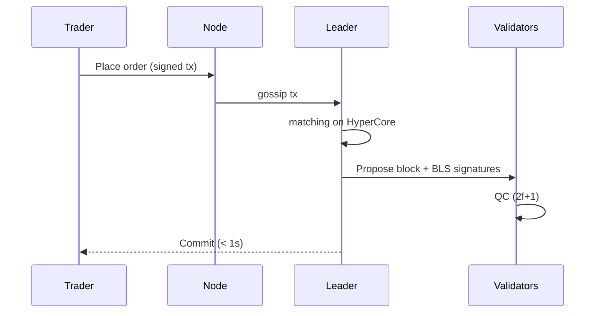

# Hyperliquid

> **TL;DR**：Hyperliquid 由 Jeff Yan（前 Hudson River Trading）于 2022 年创立，是一条 **为订单簿永续交易定制的 Layer 1**：底层共识 **HyperBFT**（自研 HotStuff 变体，单区块 ~70ms 终局、全链 200k orders/sec 容量）；应用层分两半——**HyperCore** 负责订单簿撮合与清算，**HyperEVM**（2025-02 主网）承载通用 EVM 智能合约并可直接读写 HyperCore 状态；做市靠 **HLP（Hyperliquid Liquidity Provider）金库** 被动对冲；原生代币 **HYPE** 在 2024-11-29 通过"史上最大比例社区空投"（31% 初始分发给早期用户、零 VC）上线，上线后 6 个月市值一度突破 300 亿美元。截至 2026-04，Hyperliquid 占全体去中心化永续市场份额 ~55%（DeFiLlama），验证者从主网初期 4 名扩展至 21 名。

---

## 1. 背景与动机

2020–2022 年 DEX 永续赛道几乎被 dYdX v3（StarkEx 订单簿 + 中心化 matcher）与 GMX（无订单簿的 vAMM）瓜分；两者都无法同时满足：
1. 低延迟（< 100ms 成交），
2. 链上可验证（无中心化 matcher），
3. 深度和品种丰富。

Jeff Yan 与团队的核心判断是："**高性能订单簿交易不需要通用 EVM，它需要一条为它定制的链**"。2022 年 6 月 Hyperliquid 启动封闭测试，2023-06 上线主网（仅永续）、2024-04 接入现货、2024-11-29 推出 HYPE 代币 + 大规模空投，2025-02 上线 HyperEVM——把生态从"单一交易所"扩展为"可承载任意 DApp 的金融链"。

Hyperliquid 选择 **零 VC 融资** 路线，这在 2024 行业被贴上"最清流项目"的标签，但也意味着所有代币集中在团队 + 社区 + 基金会，中长期股权/代币价值对齐性仍需观察。

## 2. 核心原理

### 2.1 HyperBFT：HotStuff 变体的形式化

HyperBFT 是 Libra/Aptos 的 **HotStuff** 家族协议的定制变体，同时借鉴 **Jolteon / Bullshark** 的部分优化。形式化共识模型：

- 系统模型：部分同步（Partial Synchrony）网络，Byzantine fault ≤ `f`，总验证者 `n ≥ 3f + 1`。
- 不变式：**Safety** 任何两个已提交的 block 都在同一链上；**Liveness** 若 leader 非拜占庭且网络进入同步期，则每 view 内至少一个 block 被提交。
- 三阶段 QC（quorum certificate）收集：`prepare → pre-commit → commit`，HotStuff 链式版可把三个阶段流水线化，**每个 view 只需一轮投票**。

HyperBFT 的定制化：

1. **Pipelined leader rotation**：leader 每 block（而非每 view）轮换，提升带宽利用；
2. **Deterministic block time**：块间隔硬编码 ~70–100ms，不留等待空间，为订单簿提供近乎连续的撮合窗口；
3. **Aggregated BLS signatures**：QC 使用 BLS 聚合，n-of-n 签名打包为单个 48-byte 签名，显著减少验证负载。

**View change**：当 leader 超时或提案不被 2f+1 签名，诚实节点把投票权转移到 next view 的 leader（按确定性轮转表）。由于流水线化，view change 仅惩罚一个 block 的延迟，而非三个。

### 2.2 HyperCore：原生订单簿状态机

HyperCore 不是智能合约，而是 **协议一等公民** —— 节点直接在 Rust 原生代码中维护全局订单簿数据结构：

- 每个市场（perp / spot）维护一个 **price-time priority** 的双向链表索引（bid & ask）；
- 订单、取消、成交、清算都是 **链上 Transaction 类型**，不经过任何虚拟机；
- Leader 在每个 block 开始时从 mempool 抽取该 block 的订单集合，按协议规则 **确定性撮合**（同一输入 → 同一输出，这是共识的必要条件）；
- 成交产生头寸变化、保证金变化、funding 结算、ADL（Auto-Deleveraging）；所有这些都被编码到 block 里。

因为整个 matching engine 在共识逻辑里，**不存在"链下撮合器 + 链上结算"的信任裂缝**——这是 Hyperliquid 与 dYdX v3、Aevo、Lyra 等的关键差异。

### 2.3 HLP：链上做市金库

HLP 是用户存入 USDC 组成的 **无许可被动做市池**，策略由基金会维护的链上参数控制：

- **Market-making vault**：在主流 perp 市场挂双边限价单，赚取 maker rebate + 买卖价差；
- **Liquidator vault**：执行清算，接管破产头寸并平仓；
- **PnL 分润**：每个 epoch（约 4 小时）结算，用户持仓按份额分配收益/亏损。

HLP 让散户 LP 能被动参与高频做市，同时为订单簿提供基石流动性（截至 2026-04，HLP TVL > 5 亿美元，占全平台做市量 30%+）。

### 2.4 HyperEVM 与 Core 的双向互操作

2025-02 主网上线的 HyperEVM 是一个 **完全兼容 Cancun EVM** 的执行层，但嵌入在同一个共识下（即不是 rollup）。关键设计：

- HyperEVM block 与 HyperCore block **一一对齐**（同 height 同 hash 前缀）；
- 预编译合约 `0x...3333` 暴露 HyperCore 的"读"接口（头寸、价格、订单簿深度）；
- 预编译合约 `0x...3334` 暴露 HyperCore 的"写"接口（下单、取消、转账）——**任何 EVM 合约可直接向订单簿下单**，无需桥；
- Gas 支付使用 HYPE，价格由 EIP-1559 机制动态调整。

这种"**原生金融原语 + 通用 EVM**"的结合是 Hyperliquid 与 dYdX（v4 是 Cosmos SDK 应用链）、Injective（CosmWasm + 订单簿）路径的最大差异。

### 2.5 HYPE 代币经济

- **总供给**：10 亿 HYPE，硬顶。
- **分配**（2024-11-29 TGE）：
  - 31.0% 空投给早期用户（无锁仓）；
  - 38.9% 未来社区激励（逐步释放）；
  - 23.8% 团队与贡献者（1 年 cliff + 多年线性）；
  - 6.0% Hyper Foundation；
  - 0.3% HIP-2 社区基金；
  - **0% VC**。
- **用途**：Gas、validator staking、HLP 治理、生态激励。
- **回购销毁**：平台交易手续费（perp + spot）一部分自动回购 HYPE 销毁——这是其通缩预期的主要来源。

### 2.6 参数与常量

| 参数 | 值 |
|---|---|
| 块时间 | ~70–100 ms |
| 单块订单容量 | 200,000 orders/sec 全链 |
| 验证者数 | 21（截至 2026-04）|
| 最低抵押 | 10,000 HYPE（可治理）|
| Epoch（HLP 结算）| ~4 h |
| EVM 兼容 | Cancun 及之前（截至 2026-04）|
| 终局性 | 即时（single-slot finality, < 1s）|

### 2.7 边界条件

- **> 1/3 拜占庭**：HotStuff 基本假设被破坏，系统可能停滞（liveness 失败）或分叉（safety 失败，需人工介入）；
- **Oracle 操纵**：HyperCore 依赖内部中位数价（多 CEX 喂价）；2024-03 曾因 JELLY 代币价格操纵事件引发治理争议（见 §7）；
- **HyperEVM ↔ Core 跨调用失败**：预编译返回状态码，EVM 合约需自行处理失败。

### 2.8 图示



## 3. 架构剖析

### 3.1 分层视图

1. **Network Layer**：自研 Rust 基于 TCP + Noise 协议的 P2P 通道；
2. **Consensus Layer（HyperBFT）**：链式 HotStuff + BLS；
3. **Execution Layer**：并列两个执行环境——HyperCore（原生 Rust）与 HyperEVM（基于 revm）；
4. **State Layer**：状态使用自研 Merkle 树（Blake3 哈希），持久化到 RocksDB；
5. **API Layer**：JSON-RPC / WebSocket（订单簿 L2 数据流）/ gRPC（validator 间）。

### 3.2 核心模块清单

注：Hyperliquid **核心节点代码尚未完全开源**（截至 2026-04）。下表基于 [Python SDK](https://github.com/hyperliquid-dex/hyperliquid-python-sdk) 和官方文档推断的模块划分。

| 模块 | 职责 | 可替换性 |
|---|---|---|
| `consensus/hyperbft` | HotStuff + BLS 聚合 | 低 |
| `core/orderbook` | 订单簿数据结构、撮合 | 低 |
| `core/margin` | 杠杆、保证金、ADL | 低 |
| `core/funding` | 永续资金费率计算 | 低 |
| `core/oracle` | 多 CEX 中位数喂价 | 中 |
| `evm/revm` | HyperEVM 执行器 | 中 |
| `evm/precompile/core-bridge` | EVM ↔ Core 预编译 | 低 |
| `state/merkle` | 状态树 | 低 |
| `rpc/json` | 用户 API | 高 |
| `rpc/ws` | 订单簿推送 | 高 |

### 3.3 数据流：一次 perp 下单

1. 用户在前端签名 order（EIP-712 结构）；
2. API 节点收到，转发给当前 leader；
3. Leader 在 70ms 窗口内收集 mempool 订单，构建 block：
   - 按价格优先、时间优先匹配；
   - 生成 trades、funding payments、liquidations；
4. Leader 广播 block 提案 + BLS partial signatures 请求；
5. 2f+1 签名聚合为 QC → block committed；
6. 节点更新 HyperCore 状态 + 推送 WebSocket；
7. 用户前端显示 fill < 1s。

### 3.4 客户端多样性与风险

**截至 2026-04，Hyperliquid 仍仅有一份验证者实现**（闭源 Rust binary，由 Hyperliquid Labs 发布）。官方已承诺 2026 内开源节点代码并发布 Rust 参考实现的独立审计版本，但尚未兑现。这是 Hyperliquid 最大的去中心化批评点——一个 21 验证者、单客户端的链，其"信任属性"介于 CEX 与成熟 L1 之间。

### 3.5 扩展接口

- **Info API（REST）**：`/info` 查询订单簿、持仓、K 线；
- **Exchange API**：下单、取消、转账；EIP-712 签名；
- **WebSocket**：订单簿深度、trades、用户 fills 实时推送；
- **HyperEVM JSON-RPC**：与以太坊完全兼容（`eth_call`、`eth_sendRawTransaction` 等）；
- **Cross-chain 桥**：HyperCore ↔ Arbitrum 的 USDC 桥（多签 + 12h 延迟）。

## 4. 关键代码 / 实现细节

由于核心代码未开源，以下以官方 Python SDK 展示与 HyperCore 交互的签名规范（`hyperliquid-python-sdk/hyperliquid/utils/signing.py`）：

```python
# 构造 order action（简化）
def order_request(asset: int, is_buy: bool, sz: float, px: float, 
                  order_type: dict, reduce_only: bool = False) -> dict:
    return {
        "a": asset,                  # 资产 id
        "b": is_buy,
        "p": float_to_wire(px),      # 价格
        "s": float_to_wire(sz),      # 数量
        "r": reduce_only,
        "t": order_type,             # {"limit": {"tif": "Gtc"}}
    }

# EIP-712 签名
def sign_l1_action(wallet, action, active_pool, nonce, is_mainnet):
    data = encode_structured_data(construct_phantom_agent(action, nonce, is_mainnet))
    signed = wallet.sign_message(data)
    return {"r": signed.r, "s": signed.s, "v": signed.v}
```

HyperEVM 预编译合约调用示例（Solidity 伪代码）：

```solidity
interface ICoreWriter {
    function placeOrder(uint32 asset, bool isBuy, uint64 sz, uint64 px, 
                       uint8 orderType) external returns (uint64 oid);
}

contract MyStrategy {
    ICoreWriter constant CORE = ICoreWriter(0x3333000000000000000000000000000000003334);
    function arb() external {
        uint64 oid = CORE.placeOrder(0, true, 100, 50000e6, 0); // 市价买 BTC
    }
}
```

## 5. 演进与版本对比

| 时间 | 事件 | 影响 |
|---|---|---|
| 2022-06 | Hyperliquid 封测启动 | 种子用户 |
| 2023-06 | 永续主网上线 | 验证 HyperBFT + 订单簿可行性 |
| 2024-04 | 现货市场上线 | 扩品类 |
| 2024-11-29 | HYPE TGE + 史上最大比例空投 | 日活跃钱包翻 10 倍，行业风向标 |
| 2025-02 | HyperEVM 主网 | 打开通用 DApp 生态 |
| 2025-03 | JELLY 代币操纵事件 | 治理压力测试 |
| 2025-Q3 | 验证者扩容到 21 | 去中心化推进 |
| 2026-Q1 | DefiLlama 显示 Hyperliquid 占 DEX perp 市场 55%+ | 事实上的行业龙头 |

## 6. 实战示例：用 Python SDK 下单

```bash
pip install hyperliquid-python-sdk
```

```python
from hyperliquid.exchange import Exchange
from hyperliquid.info import Info
from eth_account import Account

wallet = Account.from_key("0x...")       # 测试用私钥
exchange = Exchange(wallet, base_url="https://api.hyperliquid.xyz")
info = Info(base_url="https://api.hyperliquid.xyz")

# 查询 BTC perp mid price
mids = info.all_mids()
btc_price = float(mids["BTC"])

# 限价买 0.001 BTC
resp = exchange.order(
    name="BTC", is_buy=True, sz=0.001, limit_px=btc_price * 0.99,
    order_type={"limit": {"tif": "Gtc"}}
)
print(resp)
# 预期输出：{"status": "ok", "response": {"type": "order", "data": {"statuses": [{"resting": {"oid": 12345}}]}}}
```

## 7. 安全与已知攻击

### 7.1 2025-03 JELLY 代币价格操纵事件

攻击者在低流动性代币 JELLY 上开巨额空头，接着在现货市场拉盘使预言机价格飙升，导致 HLP 金库作为清算对手方接盘大额头寸、浮亏数百万美元。基金会最终 **通过验证者多签下架 JELLY 市场并回滚相关 PnL**，保护 HLP 存款人。社区分裂：
- 支持方：HLP 是公共池，应该兜底；
- 反对方：团队能单方面"撤销交易"等于中心化金融。

事件暴露了 Hyperliquid **"治理介入链上状态"** 的能力边界，也推动了后续 validator 扩容与风险参数重审。详见 [Hyperliquid 风险文档](https://hyperliquid.gitbook.io/hyperliquid-docs/risks)。

### 7.2 2024-12 HYPE 空投期间的 RPC 过载

TGE 当天 app.hyperliquid.xyz 前端数次崩溃，根因为 RPC 节点遭受大规模查询请求。验证者 + API 节点均过载——协议共识未停，但用户无法下单。事后团队增加 API 节点并引入速率限制。

### 7.3 单一客户端风险（未爆发，但理论存在）

由于所有验证者运行同一二进制，任何未披露 bug 可能导致全网同时停机（如 Solana 早期）。社区预期 2026 代码开源与独立审计可缓解。

### 7.4 HyperEVM ↔ Core 预编译攻击面

EVM 合约通过预编译下单时，若合约逻辑被重入或闪电贷操纵，可能向 HyperCore 下毒单。官方建议合约对 `CoreWriter` 调用加权限控制，目前无已公开的生产环境大额事故。

## 8. 与同类方案对比

| 维度 | Hyperliquid | dYdX v4 | GMX v2 | Aevo |
|---|---|---|---|---|
| 架构 | 自研 L1 + 原生订单簿 | Cosmos SDK 应用链 + 订单簿 | Arbitrum/Avalanche 合约 + AMM | OP Stack + 订单簿 |
| 共识 | HyperBFT | CometBFT | 以太坊 L1 | OP Rollup |
| 撮合 | 链上确定性 | 链上 | 无撮合（资产池）| 链下 sequencer + 链上结算 |
| 成交延迟 | < 1s | ~1s | ~12s (L2 block) | ~10ms + 1 block |
| 通用合约 | ✅ HyperEVM | ❌（仅 module）| ✅ | ❌（部分）|
| 验证者数 | 21 | ~70 | N/A | N/A（单 sequencer）|
| 市场占有率（DEX perp, 2026-04 DefiLlama）| ~55% | ~15% | ~8% | ~5% |

权衡：Hyperliquid 交易体验最接近 CEX，但去中心化程度与主流 L1 相比仍有差距；dYdX v4 更去中心化，但开发者生态较窄；GMX 无订单簿，滑点是弱点。

## 9. 延伸阅读

- **官方文档**：
  - [Hyperliquid Docs](https://hyperliquid.gitbook.io/hyperliquid-docs)
  - [HyperEVM Docs](https://hyperliquid.gitbook.io/hyperliquid-docs/hyperevm)
  - [Validator Docs](https://hyperliquid.gitbook.io/hyperliquid-docs/validators)
- **白皮书 / 核心博客**：
  - [HIP-1 (token standard) + HLP](https://hyperliquid.gitbook.io/hyperliquid-docs/tokenomics/hyperliquidity-provider-hlp)
- **权威研究**：
  - [Messari: Hyperliquid Thesis](https://messari.io/research)
  - [Delphi Digital: Deconstructing Hyperliquid](https://members.delphidigital.io)
- **博客**：
  - [Paradigm: On-chain orderbooks](https://paradigm.xyz/writing)
  - [登链社区 Hyperliquid 专栏](https://learnblockchain.cn)
- **视频**：
  - Jeff Yan "Building Hyperliquid" Bankless podcast（YouTube）
  - DeFi Dad 中文播讲（B 站）
- **SDK**：
  - [hyperliquid-python-sdk](https://github.com/hyperliquid-dex/hyperliquid-python-sdk)
  - [hyperliquid-rust-sdk](https://github.com/hyperliquid-dex/hyperliquid-rust-sdk)

## 10. 术语表

| 术语 | 英文 | 释义 |
|---|---|---|
| HyperBFT | HyperBFT | Hyperliquid 自研 HotStuff 变体 |
| HyperCore | HyperCore | 原生订单簿执行层 |
| HyperEVM | HyperEVM | EVM 兼容执行层，与 Core 同共识 |
| HLP | Hyperliquid Liquidity Provider | 被动做市金库 |
| HYPE | HYPE | 原生代币 |
| HIP | Hyperliquid Improvement Proposal | 协议改进提案 |
| ADL | Auto-Deleveraging | 强制减仓机制 |
| BLS 聚合 | BLS aggregate signature | 多签名压缩为单签 |
| QC | Quorum Certificate | HotStuff 中 2f+1 投票证明 |
| View Change | View Change | leader 超时后的切换 |
| JELLY 事件 | JELLY incident | 2025-03 代币操纵与治理干预 |

---

*Last verified: 2026-04-22*
