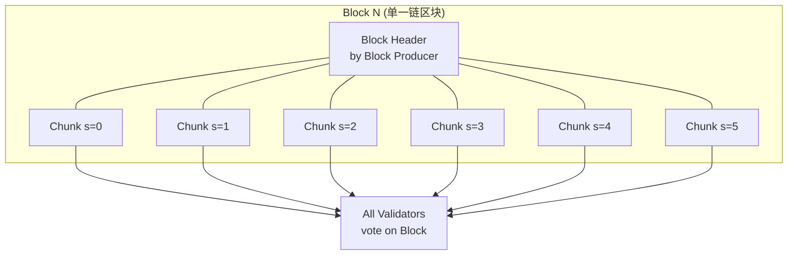

# NEAR Protocol

> **TL;DR**：NEAR 由 Illia Polosukhin（Transformer 论文共同作者）与 Alexander Skidanov 于 2018 年创立，主网 2020-04 上线。核心设计是 **Nightshade 分片**：不像 Ethereum 2.0 的"分片独立共识"，Nightshade 把 **"一个大的逻辑区块切成多个 chunk"**，每个 chunk 由不同验证者组处理，但仍嵌入到 **单一的区块链** 中——既保留线性链视图，又获得水平扩展。虚拟机是 **NEAR VM（基于 WebAssembly/Wasmer）**，合约以 Rust / JS 为主。特色功能：(1) **人类可读账户名**（`alice.near`），基于账户树而非纯地址；(2) **Aurora**——NEAR 上的 EVM 兼容执行层（独立合约）；(3) **Rainbow Bridge** 无信任 ETH↔NEAR 轻客户端桥；(4) **BOS（Blockchain Operating System）** 去中心化前端组件注册中心（后更名 near.social）；(5) **Chain Signatures**（2024-Q2）——基于 MPC 的跨链签名 oracle，让 NEAR 账户能直接签名 Bitcoin / Ethereum / Solana 等 30+ 链交易。截至 2026-04，NEAR 活跃验证者 ~270（主网），Shards 数 6（从 4 扩容），日活账户 > 100 万（受 AI Agent 和小游戏驱动）。

---

## 1. 背景与动机

2018 年 Polosukhin（前 Google Research，Transformer 论文作者之一）与 Skidanov（MemSQL 前工程总监）认为当时的区块链面临两个核心瓶颈：

1. **开发者体验差**：以太坊账户是十六进制地址、gas 需要手动调优、上链路径复杂；
2. **可扩展性天花板**：单链 TPS 不足，但分片理论（Ethereum 2.0）几年没落地。

NEAR 的回答：

- **DevEx 优先**：命名账户（`name.near`）、Actions（账户可授权创建子账户、Access Keys 权限分级）、合约热更新、JavaScript SDK；
- **Sharding 优先**：放弃"独立 shard 链"模型，改用"单链多 chunk"的 Nightshade；
- **PoS 优先**：避免 PoW；验证者通过竞价（拍卖式）进入活跃集合。

2020-04 MainNet Restricted（无转账）；2020-09 MainNet Phase 2（代币可转账）；2021-09 Simple Nightshade（单 chunk）；2022-Q4 Nightshade v1（4 shards）；2024 年 Stateless Validation 开发（v2）。

## 2. 核心原理

### 2.1 Nightshade 分片：形式化

Nightshade 的白皮书（[nightshade.pdf](https://near.org/papers/nightshade)）将分片定义为：

- 全网一个单一的、线性的 **Block**；
- 每个 Block 由 N 个 **Chunk** 组成（N = shard 数，目前 = 6）；
- 每个 Chunk 由一个 **Chunk Producer** 打包（从该 shard 的验证者子集里选）；
- 整个 Block 的提案由一个 **Block Producer** 汇总并签名（其从所有验证者中选）；
- 最后由 **全体验证者** 对 Block 投票完成共识。

形式化：`Block_n = (Header_n, {Chunk_{n,s} : s ∈ shards})`。只需所有 chunk 的 Merkle root 都合法，Block 就合法。

关键好处：

- **线性视图**：外界看 NEAR 像一条链；
- **状态无重复跨链**：跨 shard receipt（内置异步消息）在下一个 block 被目标 shard 消费；
- **扩展性**：shard 数可线性增长。

### 2.2 Stateless Validation（v2 核心升级，2024–2026 推进中）

原 Nightshade v1 要求 chunk producer 有完整 shard 状态（与 BCH/BSV 类似），限制规模。**Stateless Validation** 的思路：

- Chunk producer 不持有状态，而是基于 **state witness**（执行所需状态 + Merkle proof）验证；
- 所有验证者只需下载 **state witness**（数十 MB 级）就能验证 chunk，而无需 full state；
- 允许 validator 硬件需求下降 + shard 数扩容至 100+。

2024-Q4 Protocol Version 69 已激活 Stateless Validation 第一阶段。2025-Q4 预计完成全量切换。

### 2.3 共识：Doomslug + Block Finality

NEAR 共识称 **Doomslug**，逻辑：

- Chunk Producer 产出 chunk，Block Producer 收集后广播 block；
- 验证者对 block 投票（`Approval`）；
- 若一个 block 收到超过 2/3 加权 stake 的 approvals，则它 "Doomslug finalized" —— 不会有冲突 block 成为 doomslug final；
- 然而 Doomslug final 只是弱终局，**最终终局（Final block）** 需要后续 block 上的 BFT 投票（类似 Tendermint 的 commit）——典型 2 个 block 后（~2 秒）确认。

### 2.4 账户模型（与以太坊差异）

- **账户名**：`alice.near`、`alice.pool.near` 等，底层是账户 ID；
- **Access Keys**：账户可持有多个 **Access Key**，每个 key 可有 **FullAccess**（全部权限）或 **FunctionCall Access**（仅能调用特定合约的特定方法 + 预算限制）。这个设计让：
  - 游戏可以获得用户的"每日最多花 0.1 NEAR 调用我们合约"的 key，无需每次签名；
  - 被盗 key 风险隔离。
- **余额**：所有账户必须维持最小 **storage staking**（1 NEAR ≈ 100 KB）；状态占用多则需锁更多 NEAR。

### 2.5 Aurora：EVM 上的二等公民？

Aurora 是 NEAR 上 **一个合约**，但该合约内部是 EVM 执行引擎（基于 SputnikVM）。机理：

- 用户向 Aurora 合约发送一笔 NEAR Tx，交易 payload 是标准 Ethereum RLP 签名交易；
- Aurora 合约解码、执行 EVM 状态转移，更新 Aurora 内部的 ETH-like 状态；
- Gas 以 Aurora ETH 计价；Aurora 用 ETH 作 gas（通过 Rainbow Bridge 跨链而来）；
- 以太坊开发者可近 0 成本把 Solidity 合约部署到 Aurora。

Aurora 曾与 NEAR 账户模型合作推出 **Aurora+（免 gas）**，用户经 meta-transaction 转发 tx 由 Aurora DAO 代付。

### 2.6 Rainbow Bridge：双向轻客户端桥

- **Eth2Near**：NEAR 链上部署 Ethereum 轻客户端合约（跟踪 Ethereum header），用户提交 Ethereum proof 即可在 NEAR 上 mint 对应 wrapped 资产；
- **Near2Eth**：反向——Ethereum 上部署 NEAR 轻客户端（跟踪 NEAR block header），由链上验证 NEAR 证明；
- 无中心化托管 / 中继——但因 ETH L1 gas 高昂，Rainbow Bridge 在 2023 后流量下降。

### 2.7 Chain Signatures（2024-Q2 主网）

Chain Signatures 是 NEAR 基金会把 **分布式 MPC**（阈值 ECDSA / Ed25519）作为协议级服务推出的产品：

- NEAR 上任意账户可向特定 MPC 合约请求"用我的派生 key 签一笔 Bitcoin / Ethereum / Solana 交易"；
- MPC 节点集合（目前 ~8 个独立机构）协作完成阈值签名，不泄露私钥；
- 用户等于拥有 **一个 NEAR 账户控制所有链账户**；
- 从 DevEx 角度相当于"无需跨链桥"的跨链——这个方向在 2025 年被 a16z/Paradigm 视为"chain abstraction"的关键原语。

### 2.8 关键参数

| 参数 | 值 |
|---|---|
| 出块时间 | ~1.2 s（2024 后 ~1 s 目标）|
| Shards | 6（截至 2026-04，可扩）|
| Epoch 长度 | 43,200 blocks ≈ 12 h |
| Doomslug Finality | ~1 block |
| Final Block Finality | ~2 blocks ≈ 2–3 s |
| Validator 数 | ~270（主网）|
| 最低 Seat Price | 动态拍卖，2026-04 约 20 万 NEAR |
| Storage staking | 每 100 KB 锁 1 NEAR |
| 代币总供给 | 10 亿初始 + 5% 年通胀，90% 给 validator、10% 给 treasury |
| 交易费销毁 | 70% gas 销毁（通缩压力），30% 给合约部署者 |

### 2.9 失败模式

- **2023-12 单 shard 停机**：Shard 2 因 contract runtime panic 约 8 小时无法打包（见 §7）；
- **MPC 故障**：Chain Signatures 的 MPC 节点若 < 阈值，则所有跨链签名停滞；
- **Rainbow Bridge Watchdog**：2022-08 Watchdog 模式被触发，暴露了 Near2Eth 方向被恶意 block producer 攻击的代价机制。

### 2.10 图示



## 3. 架构剖析

### 3.1 分层视图

`near/nearcore`（Rust 实现）节点：

1. **Networking**：自研 P2P（TCP + Noise）；
2. **Chain**：区块接收、验证、链头维护；
3. **Chunk Producer / Validator**：分片逻辑；
4. **Runtime**：执行引擎，跑 Wasm 合约；
5. **Storage**：Flat Storage（2023 引入，平铺 state trie 加速读取）+ RocksDB；
6. **RPC**：JSON-RPC、gRPC。

### 3.2 核心模块清单（`near/nearcore`）

| 模块 | Crate | 职责 | 可替换性 |
|---|---|---|---|
| `chain/` | near-chain | 链结构、orphan pool | 低 |
| `chain/chunks/` | near-chunks | Chunk 提案、分发 | 低 |
| `runtime/near-vm/` | near-vm | WASM 执行 | 低 |
| `runtime/runtime/` | node-runtime | 状态转移函数 | 低 |
| `core/primitives/` | near-primitives | 类型、hash | 低 |
| `chain/network/` | near-network | P2P | 低 |
| `chain/client/` | near-client | 客户端主循环 | 低 |
| `core/store/` | near-store | Flat Storage + RocksDB | 中 |
| `neard/` | neard | 节点二进制入口 | 中 |
| `tools/state-viewer/` | state-viewer | 状态调试 | 高 |

### 3.3 数据流：一笔 `ft_transfer` 跨 shard 转账

1. 用户（`alice.near`，shard 0）签名 `ft_transfer` 发给 `usdt.tether-token.near`（shard 3）；
2. Tx 广播到 shard 0 的 chunk producer；
3. Shard 0 chunk 执行该 tx → 由于目标合约在 shard 3，runtime 产生 **Receipt**（跨 shard 消息）放入出向队列；
4. Block N 提交，receipt 持久化；
5. Block N+1 时 shard 3 chunk producer 拉入该 receipt，在 shard 3 执行合约 `ft_transfer` handler → 又可能产生下一级 receipt（如通知回调 `ft_on_transfer`）；
6. Block N+2 执行回调；
7. 一条完整跨 shard 交易一般 2–3 blocks（2–4 秒）。

### 3.4 客户端多样性

- **nearcore（Rust）**：官方唯一全功能实现；
- **nayduck / integration test node**：测试用；
- **近似第二实现**：无。

NEAR 是典型单客户端链（与 Hyperliquid、Tron、BSC 类似问题）。2024 年 Pagoda（NEAR 主要开发公司）重组后，有关"第二客户端"的讨论暂停。

### 3.5 扩展接口

- **JSON-RPC**：官方端点 `https://rpc.mainnet.near.org`；
- **Indexer Framework**：Rust 框架，让外部服务订阅 block / receipt 流；
- **NEAR API JS**：类似 ethers.js；
- **BOS Gateway**：去中心化前端组件注册，dApp 前端可 import 任意 widget；
- **NEPs**（NEAR Enhancement Proposals）：NEP-141（FT）、NEP-171（NFT）、NEP-245（MT 多代币）、NEP-518（Chain Signatures）。

## 4. 关键代码 / 实现细节

Nightshade 的 Chunk 结构（简化自 `core/primitives/src/sharding.rs`）：

```rust
pub struct ShardChunkHeader {
    pub prev_block_hash: CryptoHash,
    pub prev_state_root: StateRoot,      // 该 shard 上一个 chunk 的状态根
    pub encoded_merkle_root: CryptoHash, // chunk 数据 erasure coding Merkle 根
    pub encoded_length: u64,
    pub height_created: BlockHeight,
    pub shard_id: ShardId,
    pub gas_used: Gas,
    pub gas_limit: Gas,
    pub balance_burnt: Balance,
    pub outgoing_receipts_root: CryptoHash, // 本 chunk 产生的跨 shard receipts
    pub tx_root: CryptoHash,
    pub validator_proposals: Vec<ValidatorStake>,
    pub signature: Signature,
}
```

Access Key 权限检查（`runtime/runtime/src/verifier.rs`）：

```rust
// Function Call Access Key 只允许调用特定合约的特定方法
if let AccessKeyPermission::FunctionCall(fc) = &access_key.permission {
    if tx.receiver_id != fc.receiver_id { return Err("receiver mismatch"); }
    for action in &tx.actions {
        if let Action::FunctionCall(call) = action {
            if !fc.method_names.is_empty() && !fc.method_names.contains(&call.method_name) {
                return Err("method not allowed");
            }
        } else { return Err("only FunctionCall allowed"); }
    }
}
```

## 5. 演进与版本对比

| 时间 | 事件 | 影响 |
|---|---|---|
| 2018-08 | NEAR 项目启动 | Polosukhin + Skidanov 创立 |
| 2020-04 | MainNet Restricted | 无转账 |
| 2020-09 | MainNet Phase 2 | 代币可转账 |
| 2021-05 | Aurora 上线 | EVM 兼容 |
| 2021-09 | Simple Nightshade | 无状态分片雏形 |
| 2022-08 | Rainbow Bridge Watchdog 触发 | 暴露经济安全边界 |
| 2022-Q4 | Nightshade Phase 1（4 shards）| 真分片 |
| 2023-05 | BOS / near.social | 去中心化前端 |
| 2023-11 | 单 shard 停机事件（8h）| 单客户端风险暴露 |
| 2024-Q2 | Chain Signatures 主网 | 跨链抽象 |
| 2024-Q4 | Stateless Validation 激活（v2 阶段一） | shards 可扩容 |
| 2025–2026 | AI Agent 叙事（near.ai）+ Shards 6 | 新生态 |

## 6. 实战示例：用 near-api-js 创建账户并转账

```bash
npm install near-api-js
```

```javascript
const { connect, keyStores, KeyPair, utils } = require('near-api-js');

const keyStore = new keyStores.InMemoryKeyStore();
const keyPair = KeyPair.fromString(process.env.PRIVATE_KEY);
await keyStore.setKey('mainnet', 'alice.near', keyPair);

const near = await connect({
  networkId: 'mainnet',
  nodeUrl: 'https://rpc.mainnet.near.org',
  keyStore
});

const alice = await near.account('alice.near');
const res = await alice.sendMoney(
  'bob.near',
  utils.format.parseNearAmount('1')  // 1 NEAR
);
console.log(res.transaction.hash);
// 预期输出：类似 "8ABQwSd3kAjxv7kfHjCmZCGe9i5kUjEp6xK3..."
```

## 7. 安全与已知攻击

### 7.1 2022-08 Rainbow Bridge Watchdog 事件

Near2Eth 方向依赖"乐观模式"：任何人可挑战恶意 NEAR block header。2022-08-22 攻击者向 Ethereum 上的 Bridge 合约提交伪造 header 试图盗取桥内资产。Watchdog 机器人在 3 分钟内提交 fraud proof，攻击者损失 5 ETH bond；无用户资金损失。事后团队强化挑战期门槛到 4 小时并增加多 watchdog。详见 [Aurora Labs postmortem](https://near.org/blog)。

### 7.2 2023-11 Shard 停机

Nightshade 某 shard 的 chunk producer 在特殊输入下触发 runtime panic，导致该 shard 无法打包约 8 小时。其他 shard 继续运作，但跨 shard receipt 堆积。修复需要硬分叉（protocol 版本升级）。事件暴露：
- 单客户端的共同故障面；
- 分片"部分故障"不等于"部分可用"——应用如果跨 shard 则全挂。
- 修复后 Pagoda 加强 fuzzing 与 canary network。

### 7.3 2024 Chain Signatures 早期 rate-limit 绕过（非资金损失）

Chain Signatures 主网上线早期，MPC 合约的 rate limit 可被绕过触发拒绝服务。未导致签名泄露；团队在主网补丁内修复。

### 7.4 理论攻击面：Stateless Validation 攻击

Stateless Validation 依赖 chunk producer 提供正确 state witness；若 producer 恶意提供错误 witness，validator 应该能通过 Merkle proof 发现不一致并拒绝。若 proof 构造漏洞被利用，可能导致终局性攻击。正在由 Trail of Bits / Aurora Labs 多轮审计中。

## 8. 与同类方案对比

| 维度 | NEAR | Ethereum + L2 | Solana | Cosmos Hub |
|---|---|---|---|---|
| 扩展路径 | 原生分片 Nightshade | Rollup | 单体并行 | IBC 多链 |
| 共识 | Doomslug + BFT | Gasper | PoH + TowerBFT | CometBFT |
| VM | WASM (NEAR VM) + Aurora EVM | EVM | SVM | CosmWasm |
| 账户模型 | 命名账户 + Access Keys | EOA/Contract | Account model | Account |
| TPS（实测） | 数千（分片并行） | L2 可 >10k | 2k–3k | 数千 |
| Finality | ~2 s | 12–15 min (L1)，L2 即时 soft | 12 s | 5 s |
| 跨链特性 | Rainbow Bridge + Chain Signatures | 桥协议 | Wormhole | IBC |
| 客户端多样性 | ❌ 单实现 | ✅ 多实现 | 中（Agave + Firedancer）| ✅ CometBFT 多 fork |

权衡：NEAR 的 DevEx（命名账户、Access Keys、Chain Signatures）独一档，但生态 TVL 与 DApp 数量长期低于 Ethereum L2 与 Solana；Nightshade v2 + Stateless Validation 能否真正把 shards 推到 100+ 是未来 2 年关键。

## 9. 延伸阅读

- **官方文档 / 白皮书**：
  - [NEAR Docs](https://docs.near.org)
  - [Nightshade Paper](https://near.org/papers/nightshade)
  - [NEAR White Paper](https://near.org/papers/the-official-near-white-paper)
- **核心仓库**：
  - [near/nearcore](https://github.com/near/nearcore)
  - [near/NEPs](https://github.com/near/NEPs)
  - [aurora-is-near/aurora-engine](https://github.com/aurora-is-near/aurora-engine)
- **权威研究**：
  - [Messari: NEAR State](https://messari.io/research)
  - [Electric Capital Developer Report](https://www.developerreport.com)
- **博客**：
  - [Illia's blog](https://nearbuilders.org)
  - [Pagoda Engineering Blog](https://near.org/blog)
  - [登链社区 NEAR 专栏](https://learnblockchain.cn)
- **视频**：
  - NEARCON 大会主题报告（YouTube）
  - Illia 与 Balaji 对谈（Bankless）
- **相关 NEP**：NEP-141（FT）、NEP-171（NFT）、NEP-245（MT）、NEP-366（Meta Tx）、NEP-518（Chain Signatures）、NEP-509（Stateless Validation）。

## 10. 术语表

| 术语 | 英文 | 释义 |
|---|---|---|
| Nightshade | Nightshade | NEAR 的分片协议 |
| Chunk | Chunk | 一个 block 内某个 shard 的数据块 |
| Chunk Producer | Chunk Producer | 打包某 shard chunk 的验证者 |
| Block Producer | Block Producer | 汇总全局 block 的验证者 |
| Doomslug | Doomslug | NEAR 的第一阶段共识/弱终局机制 |
| Final Block | Final Block | 经 BFT 终局的区块（~2 blocks 后）|
| Access Key | Access Key | 账户上的权限分级密钥 |
| Storage Staking | Storage Staking | 占用状态需锁 NEAR |
| Aurora | Aurora | NEAR 上的 EVM 兼容合约层 |
| Rainbow Bridge | Rainbow Bridge | NEAR↔Ethereum 无信任轻客户端桥 |
| BOS | Blockchain OS | 去中心化前端组件注册（即 near.social）|
| Chain Signatures | Chain Signatures | 协议级 MPC 阈值签名跨链服务 |
| Stateless Validation | Stateless Validation | 不持完整状态即可验证 chunk |
| NEP | NEAR Enhancement Proposal | 协议改进提案 |

---

*Last verified: 2026-04-22*
