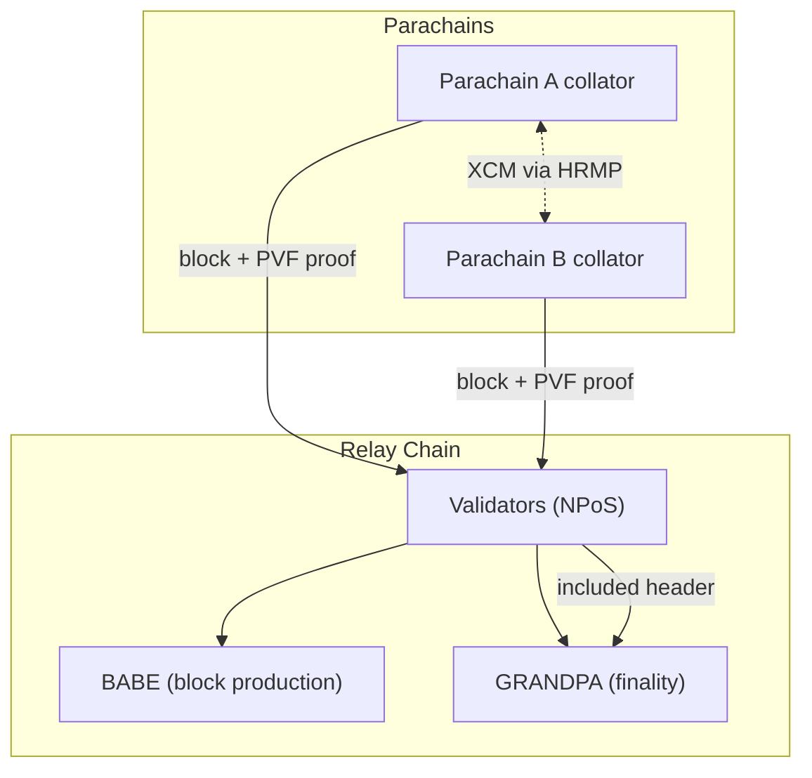

# Polkadot

> **TL;DR**：Polkadot 是 Ethereum 联合创始人 Gavin Wood 2016 年提出、2020-05 主网启动的 **共享安全的异构多链平台**。其核心抽象是 **中继链（Relay Chain）+ 平行链（Parachain）**：中继链只负责共识与元数据，不跑应用逻辑；Parachain 运行应用但把"验证安全"外包给中继链。共识层是 **混合共识**：**BABE**（基于 VRF 的区块生产） + **GRANDPA**（基于 GHOST 规则的终局性 gadget），实现 **6 秒出块 + 12–60 秒绝对终局**。质押模型是 **NPoS (Nominated Proof-of-Stake)**：有限的 validator 槽位（上限 ~1000）由 DOT 持有者 Nominate，**Phragmén 算法**最大化公平分配。2024 起，Parachain 从"两年拍卖 slot"演进为 **Agile Coretime**（按 28 天周期租赁计算核心），加上 **JAM (Join-Accumulate Machine)** 升级路线，Polkadot 正从"专属链平台"转向"**通用无信任计算网络**"。Substrate 框架（2025 后统一为 polkadot-sdk）是 Polkadot / Kusama / 众多独立链的构建工具。据官方估计 validator 约 600，nominator 数十万。

---

## 1. 背景与动机

2016 年 11 月，Gavin Wood 发表 [Polkadot Whitepaper](https://polkadot.com/whitepaper)，提出 "**互操作多链**" 的三个核心命题：

1. **可扩展性靠异构分片**：不同应用需求不同（TPS / 私密 / 合约模型），不应塞进同一 VM。
2. **互操作靠共享安全**：parachain 向同一 validator 集合 "租用" 安全，省去自建 PoS 的启动成本与攻击面。
3. **治理靠链上投票 + 无 fork 升级**：协议参数由 on-chain referendum 决定，WebAssembly runtime 可原子替换（**forkless upgrade**）。

2017 ICO 融资 ~1.45 亿美元；2019 主网 "Genesis Block" 发布；2020-05-26 主网 Launch；2020-08 Sudo 权限移除（完成去中心化）；2021-12 第一批 Parachain（Acala、Moonbeam、Astar、Parallel 等）拍卖成功；2023 OpenGov 替代 Council 治理；2024-09 Agile Coretime 上线；2024 至今 **JAM Implementer's Prize** 推进新架构研发。

## 2. 核心原理

### 2.1 形式化定义：Relay + Parachain

Polkadot 把状态分为两层：

- 中继链状态 $\mathcal{S}_R$：Validator set、Nominator 声明、Parachain 注册表、跨链消息队列。
- 每条 parachain 状态 $\mathcal{S}_{P_i}$：由该 parachain 自己的 runtime 定义（WebAssembly 字节码）。

中继链共识只对 **parachain 的 header + 证明** 达成一致，不在中继链内执行 parachain 的状态转移。parachain 通过 **collator** 节点生成区块，validator 通过 **Parachain Validation Function (PVF)**（WebAssembly 执行）验证该块合法。

**Availability & Validity (AnV)**：每个 parachain block 需被 (a) 充分可用（erasure-code 分散到 validator），(b) 有效验证（由随机分组的 validator 子集重新执行 PVF）。随机分组使攻击者必须同时贿赂 ≥ 1/3 validator 才能破坏 parachain 安全。

### 2.2 关键算法：BABE、GRANDPA、Phragmén

**BABE**（Blind Assignment for Blockchain Extension）：

- 时间分成 **slot**（6 秒）与 **epoch**（2400 slot = 4 小时）。
- 每个 slot，每个 validator 用 **VRF**（Verifiable Random Function）以自己私钥对 `(epoch_randomness, slot_number)` 计算 $(\pi, r)$；若 $r < T$（阈值，视 stake 决定）则获得出块权。
- 多个 validator 可能同时中奖 → **fork**。次要 slot（无 VRF 中奖）由 round-robin 选定 fallback proposer，保证无"空 slot"。

**GRANDPA**（GHOST-based Recursive ANcestor Deriving Prefix Agreement）：

- 与 BABE 正交：BABE 负责 "不断产出候选链"，GRANDPA 对 **最长 finalized 前缀** 投票。
- 每轮每 validator 广播 "prevote + precommit"，达到 2/3 stake 后，**所有该块之前的链段一次性 finalize**（批量终局）。
- 容错：< 1/3 恶意。终局延迟通常 **12–60 秒**；异常下可能延长，但不回滚已终局的历史。

**Phragmén**（Sequential Phragmén）：NPoS 验证者选举算法。每位 nominator 列出 ≤16 个偏好 validator，Phragmén 从 DOT 权重出发，**最大化被选 validator 组的最低 stake**（maximin），避免小股东 nominate 失败。扩展 **Proportional Justified Representation (PJR)** 属性。

### 2.3 子机制拆解

1. **Collator / Validator 分工**：collator 是 parachain 的"出块者"，无 stake 要求；validator 是中继链 staker，随机分组验证 parachain 块。
2. **Availability & Validity (AnV)**：每个 parachain block 由 ~5 个 backer 签名后提交到中继链，然后 **随机 assignment** 的 validator 群再次执行 PVF，若结果不一致触发 **dispute**（投票）。
3. **Erasure Coding**：validator 把每个 parachain block 的数据分片成 $n$ 块 Reed-Solomon 编码，任何 $2f+1$ 个片即可恢复，防止数据隐藏。
4. **XCM / XCMP (HRMP)**：Cross-Consensus Messaging。XCM 是消息格式（类似 HTTP），XCMP 是传输层；目前过渡方案 HRMP 通过中继链中转，未来目标 direct channel。
5. **On-chain Governance (OpenGov)**：治理完全链上，无 Council。提案分 **Origin/Track**（普通消费、白盒、紧急修复等），每 Track 有独立投票 / 决策周期。
6. **Forkless Runtime Upgrade**：Runtime 以 WebAssembly 字节码形式存于链上 `:code` 键；升级 = 修改该键。节点下次出块自动加载新 runtime，无需节点升级。
7. **Agile Coretime**：把 parachain slot 拍卖替换为 "Core" 概念——Polkadot 有若干计算核心，每核心按 28 天 Region 出租；应用可买整核（dedicated）或共享核心（on-demand）。这使小项目也能上 Polkadot。

### 2.4 参数与常量

| 参数 | 典型值 | 说明 |
| --- | --- | --- |
| Block time | 6 s (slot) | BABE |
| Epoch | 4 h (2400 slots) | Validator set 冻结 |
| Session | 4 h | Era 包含 6 session = 24 h |
| Era | 24 h | 奖励结算 / validator 切换 |
| Validator 上限 | 1000 左右（治理调） | 实际激活 ~600 |
| Min Nominator bond | 250 DOT（变） | |
| Min Validator bond | 按前 300 动态 | |
| Unbonding | 28 天 | 防长程攻击 |
| Slashing level | 最高 100%（严重违规） | |
| Coretime Region | 28 天 | |

### 2.5 边界条件与失败模式

- **> 1/3 GRANDPA validator 恶意**：终局性暂停（但 BABE 仍出块，形成未 finalized chain）；通过社会层 recovery（weak subjectivity）。
- **Parachain PVF 死循环 / OOM**：PVF 在 sandbox 内被限制 gas（weight），超限即 block invalid。
- **Coretime 市场失灵**：Region 拍卖价格崩盘时，parachain 仍保留 5 个 system chain（core），保证基础功能。
- **Runtime 升级 bug**：上线前 `on_runtime_upgrade` 必须对旧状态兼容；历史上多条 parachain 因此 brick，治理救场。

### 2.6 图示



## 3. 架构剖析

### 3.1 分层视图

```
┌────────────────────────────────────────────────┐
│ Wallets (Talisman, Nova, Polkadot.js apps)     │
├────────────────────────────────────────────────┤
│ JSON-RPC / WebSocket / Substrate RPC           │
├────────────────────────────────────────────────┤
│ polkadot-sdk node:                             │
│  ├── Client (block import, networking)         │
│  ├── Consensus (BABE + GRANDPA)                │
│  ├── PVF host (isolated Wasm executors)        │
│  ├── Parachains subsystems (backing, dispute)  │
│  ├── Transaction pool                          │
│  └── Offchain worker runtime                   │
├────────────────────────────────────────────────┤
│ Runtime (Wasm on-chain)                        │
│  ├── FRAME pallets (balances, staking, xcm...) │
│  └── Parachain runtimes (Asset Hub, Collectives│
│       , Bridge Hub, Coretime Chain, People)    │
├────────────────────────────────────────────────┤
│ Storage: Trie + RocksDB/ParityDB               │
└────────────────────────────────────────────────┘
```

### 3.2 核心模块清单（映射 `paritytech/polkadot-sdk`）

| 模块 / 目录 | 职责 | 依赖 | 可替换性 |
| --- | --- | --- | --- |
| `substrate/client/consensus/babe` | BABE slot lottery | primitives, vrf | 可替换其他 PoS |
| `substrate/client/consensus/grandpa` | 终局性投票 | network | 可替换 finality |
| `substrate/frame/*` | 链上 pallets（balances/staking/gov/xcm...） | Runtime | 每条链自选 |
| `substrate/primitives/runtime` | Runtime API / Version | | 稳定接口 |
| `polkadot/node/core/backing` | Parachain 候选块 backing | subsystems | 必选 |
| `polkadot/node/core/av-store` | Availability Store（erasure chunk） | storage | 必选 |
| `polkadot/node/core/dispute-coordinator` | Dispute 流程 | validation | 必选 |
| `polkadot/node/core/pvf` | PVF Wasm 沙盒执行 | wasmtime | 核心 |
| `cumulus/*` | Parachain 节点框架（collator） | substrate | Parachain 必选 |
| `polkadot/xcm` | XCM 执行器 | | 跨链必选 |
| `substrate/client/network` | libp2p 封装 | | 可替换传输 |
| `substrate/client/db` | 存储后端 | rocksdb/paritydb | 可替换 |

### 3.3 数据流：Parachain Tx 的端到端路径

1. 用户通过 polkadot.js 发 Tx 给某 parachain RPC。
2. Parachain transaction pool 接收并通过 gossip 广播给 collators。
3. 当前 collator 打包 block，附带 **PoV (Proof of Validity)** 快照（证明执行所需最小状态）。
4. Collator 推送 `(block, PoV)` 给"分配到该 parachain"的 validator 小组（约 5 人）。
5. Validator 执行 PVF，签名 `Statement::Seconded` / `Valid`，形成 **backable candidate**。
6. 中继链 block proposer 在下个块 include 该 candidate header。
7. **AnV 阶段**：candidate 的数据 erasure-code 分片存到 ~全体 validator；随机分配 ~30 个 validator 再次执行 PVF → `approval`。
8. 足够 approval 后 GRANDPA 最终化，parachain block 获"**included + available + approved + finalized**"完整性。
9. XCM 消息在此时被中继链放入下游 parachain 的 ingress queue。

端到端终局延迟约 **12–60 秒**（正常情况 ~12 s）。

### 3.4 客户端多样性

- **polkadot / polkadot-parachain (Rust)**：Parity 官方实现，主力节点。
- **Kagome (C++)**：Soramitsu 实现的第二客户端，通过 Web3 Foundation 资助开发。
- **Gossamer (Go)**：ChainSafe 实现的另一选择；进展较慢。
- **Smoldot (Rust, 轻客户端)**：浏览器 / 嵌入式用，基于 substrate-connect。
- 相比 Ethereum 的 5+ 客户端，Polkadot 客户端多样性偏弱但非单点。

### 3.5 扩展接口

- **JSON-RPC & Runtime API**：通过 metadata 自描述（Scale codec），polkadot.js 自动生成类型。
- **XCM**：跨共识消息格式，版本 v3/v4，支持 Teleport / Reserve-backed 转账、远程执行。
- **Cumulus Bridges**：Snowbridge（ETH ↔ Polkadot）、Polkadot-Kusama Bridge、Hyperbridge 等，在 Bridge Hub parachain 上统一。
- **Smart Contracts**：`pallet-contracts`（ink! / Wasm）与 `pallet-revive`（EVM 兼容，2024 起孵化）。
- **Offchain Workers**：Runtime 可发起 HTTP 请求、写本地存储，典型用例：预言机推送签名。

## 4. 关键代码 / 实现细节

BABE slot claim（简化自 `substrate/client/consensus/babe/src/authorship.rs`）：

```rust
fn claim_slot(
    slot: Slot,
    epoch: &Epoch,
    keystore: &SyncCryptoStore,
) -> Option<PreDigest> {
    for authority_id in &epoch.authorities {
        // 用 VRF 计算 output, proof
        let transcript = make_transcript(&epoch.randomness, slot, epoch.epoch_index);
        let vrf = keystore.sr25519_vrf_sign(authority_id, &transcript).ok()?;
        // 比较阈值
        let threshold = calculate_primary_threshold(&epoch.config.c, &epoch.authorities, idx);
        if vrf.output.as_bytes() < threshold.to_le_bytes() {
            return Some(PreDigest::Primary { slot, vrf_output: vrf.output, ... });
        }
    }
    None
}
```

> 真实实现包含 secondary slot claim、VRF 转录构造与权重校验；详见仓库 tag `polkadot-sdk-stable2407+`。

## 5. 演进与版本对比

| 版本 | 时间 | 关键变化 | 影响 |
| --- | --- | --- | --- |
| Genesis / Launch | 2020-05-26 | NPoS + BABE + GRANDPA | 主网启动 |
| Sudo removal | 2020-08 | 完全去中心化 | 治理门槛 |
| First Parachain Auctions | 2021-11 | 11 条 Parachain 上线 | 生态扩张 |
| XCM v2 / v3 | 2022-2023 | 跨 parachain 稳定消息 | 互操作性 |
| OpenGov | 2023-06 | 无 Council，完全公投 | 治理透明 |
| Async Backing | 2024-Q1 | 6s→2s 可能 parachain 出块 | 吞吐上升 |
| Agile Coretime | 2024-09 | slot 拍卖 → 28d Region | 上链成本下降 |
| JAM 路线 | 2024-至今 | 从 Relay/Para 架构向通用 ROLLUP 状态机演进 | 据官方 RFC |

## 6. 实战示例

```bash
# 运行本地 dev node
git clone https://github.com/paritytech/polkadot-sdk
cd polkadot-sdk && cargo build --release --bin polkadot
./target/release/polkadot --chain=rococo-local --alice --tmp

# 使用 polkadot.js CLI 发 balances.transfer
polkadot-js-api --ws ws://localhost:9944 tx.balances.transferKeepAlive \
  5FHneW46xGXgs5mUiveU4sbTyGBzmstUspZC92UhjJM694ty 1000000000000 \
  --seed "//Alice"

# 构建 parachain 模板
git clone https://github.com/paritytech/polkadot-sdk-parachain-template
cargo build --release
./target/release/parachain-template-node --dev
```

预期：block 持续产出；Alice 的 balance 事件成功；parachain template 按 12 秒节奏产块，PVF 在本地 validator 侧验证通过。

## 7. 安全与已知攻击

1. **Acala aUSD 超发事件（2022-08）**：Acala parachain 部署 iBTC/aUSD 流动性池时 config 错误，一个地址在 ~1.3 亿 aUSD 超发，价格崩到 $0.01。治理介入冻结地址并销毁铸造额。事件暴露 **Parachain 自主治理 vs 共享安全语义边界**——安全由 Polkadot 提供，但应用逻辑错误只能自救。[Acala Post-Mortem](https://acala.network/blog/)。
2. **Parity Wallet Freeze (2017)**：虽发生于 Ethereum 时代且非 Polkadot，但作为 Parity 团队教训，直接启发 Polkadot 在 runtime 升级、合约迁移上的严苛政策（forkless + on-chain governance）。
3. **理论攻击面**：① Long-range / Nothing-at-stake：unbond 延长到 28 天 + weak subjectivity 缓解；② Collator 垄断某 parachain 出块 → 可审查，但无法改变状态（因 validator 执行 PVF），用户仍可通过 XCM 出逃；③ GRANDPA stall：> 1/3 离线 → 停终局但不停出块，社会层恢复。

## 8. 与同类方案对比

| 维度 | Polkadot | Cosmos | Avalanche | Ethereum |
| --- | --- | --- | --- | --- |
| 共识 | BABE + GRANDPA | CometBFT | Snowman | LMD-GHOST + FFG |
| 共享安全 | 默认（Parachain 全部继承） | 可选 (ICS) | 可选 (Etna 前/后) | 默认（Rollup via L1 DA） |
| 跨链 | XCM + HRMP → XCMP | IBC | Warp | CCIP / L0 |
| 链治理 | OpenGov（链上 referendum） | x/gov | 多机构提案 | 社会层 + EIP |
| 合约模型 | Wasm (ink!) / EVM | CosmWasm / EVM | EVM / 自定义 | EVM |
| Runtime 升级 | 原子替换 Wasm runtime | 硬升级（需协调） | 硬升级 | 硬分叉 |
| 验证者数 | 600+ | 每链 ~150 | 1700+ | 100 万级 |
| 终局延迟 | 12–60 s | 5 s | 1–2 s | 12 min |
| 启动成本 | Coretime (28d region) | 自建 validator | 自建 L1 | 基于 Rollup SDK |

## 9. 延伸阅读

- **官方文档 / Spec**：
  - [Polkadot Wiki](https://wiki.polkadot.com/)
  - [Polkadot Protocol Specification](https://spec.polkadot.network/)
  - [Polkadot SDK Docs](https://paritytech.github.io/polkadot-sdk/master/polkadot_sdk_docs/)
- **核心论文 / RFCs**：
  - [Polkadot Whitepaper (Wood, 2016)](https://polkadot.com/whitepaper)
  - [GRANDPA: a Byzantine Finality Gadget](https://arxiv.org/abs/2007.01560)
  - [SASSAFRAS (BABE successor)](https://eprint.iacr.org/2023/031)
  - [JAM Gray Paper](https://graypaper.com)
  - [Polkadot Fellowship RFCs](https://github.com/polkadot-fellows/RFCs)
- **权威博客**：
  - [Parity Technologies Blog](https://www.parity.io/blog/)
  - [Web3 Foundation Research](https://research.web3.foundation/)
  - [Messari Polkadot 研究](https://messari.io/)
- **视频**：
  - Gavin Wood 历届 Polkadot Decoded keynote
  - Rob Habermeier 对 Agile Coretime 的工程解读
- **规范 / RFCs**：
  - [RFC-5 Coretime](https://github.com/polkadot-fellows/RFCs/blob/main/text/0005-coretime-interface.md)
  - [XCM v4 spec](https://github.com/paritytech/xcm-format)

## 10. 术语表

| 术语 | 英文 | 释义 |
| --- | --- | --- |
| 中继链 | Relay Chain | Polkadot 主链，承担共识与跨链路由 |
| 平行链 | Parachain | 连接到中继链的应用链 |
| 核 | Core | Agile Coretime 中的计算单元，可被 parachain 租用 |
| 核心时间 | Coretime | 28 天为 Region 的核出租合约 |
| 提名权益证明 | NPoS | Nominated Proof of Stake |
| Phragmén | Sequential Phragmén | NPoS validator 选举算法 |
| 验证函数 | PVF | Parachain Validation Function，Wasm |
| 可用性与有效性 | Availability & Validity (AnV) | erasure + 抽查 approval |
| 跨共识消息 | XCM | Cross-Consensus Messaging 格式 |
| 异步背书 | Async Backing | 允许 parachain 更快出块 |
| JAM | Join-Accumulate Machine | Polkadot 下一代执行架构 |

---

*Last verified: 2026-04-22*
