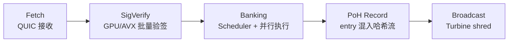

# Solana

> **TL;DR**：Solana 是 Anatoly Yakovenko 于 2017 年发起、2020 年 3 月主网 Beta 启动的 **单体高性能 L1**。其核心创新不是单一共识算法，而是 **八项工程叠加**：**Proof of History（PoH，历史证明）** 提供全局时钟、**Tower BFT** 在 PoH 时间轴上定义拜占庭容错投票、**Gulf Stream** 把 mempool 转发给已知 leader、**Turbine** 分片广播区块、**Sealevel** 并行执行无冲突交易、**Pipelining** 流水线化 TPU、**Cloudbreak** 水平分片账户数据库、**Archivers** 做历史数据归档。字节码使用 **BPF/SBF**（基于 eBPF），合约以 Rust 为主、C/Zig 辅之。Slot 时间 400ms，确定性终局数十秒至十几秒。截至 2026-04，Agave 与 Firedancer 双客户端并存，活跃验证者 ~1,500 名，生态覆盖 DePIN（Helium、Render）、Meme（pump.fun）、永续（Jupiter Perp）、支付（Solana Pay）。

---

## 1. 背景与动机

2017 年 11 月 Anatoly Yakovenko（前 Qualcomm）发表 Solana 白皮书，核心命题："**区块链的真正瓶颈不是共识算法本身，而是'节点无法对时间达成共识'**"。若节点对事件顺序有一个可验证的、无需互相通信就能生成的时间序列，就能把"达成共识"简化为"对已排好序的事件串投票"——数量级地降低消息开销。

白皮书给出了 8 大核心创新的雏形（详见 §2）。2020-03 主网 Beta 上线；2021-09 爆款 NFT 项目 Degenerate Ape Academy 带来第一波流量；2022 年后历经 7 次以上全网停机，社区以 **客户端多样化 + 调度器改革 + 本地费用市场** 修复。2024-07 Firedancer 测试网激活，标志 Solana 从"单客户端单点风险"走向客户端多样性。

## 2. 核心原理

### 2.1 Proof of History（PoH）

PoH **不是共识**，而是 **可验证延时函数（VDF）意义上的全局时钟**。算法极简：

```
seed_0 = initial_hash
seed_n = SHA256(seed_{n-1})  // 反复哈希
```

每个哈希消耗固定时间；由于 SHA256 不可并行，任何人想生成 `seed_n` 必须依次计算 `n` 次。任何事件 `E` 被"插入"时间轴时，将其哈希混入当前 seed：`seed_n = SHA256(seed_{n-1} || hash(E))`，后续节点反查哈希链即可验证"E 至少发生在第 n 步之前"。

- **单核串行生成、多核并行验证**：验证是 embarrassingly parallel，这是 PoH 性能前提。
- **作为时钟**：Leader 持续生成 PoH ticks（每 Tick 若干哈希），64 个 slot 组成一个 Epoch。每 Slot 由一名 Leader 打包。

### 2.2 Tower BFT

Tower BFT 是 Solana 版 PBFT，利用 PoH 作为**伪时钟**对投票锁定时间进行指数增长：

- 每个验证者对某 Slot 投票（vote）后，该投票在若干 Slot 内"锁定"，若试图投另一派分叉，锁定时间 **按 2^n 指数增长**。
- 锁定满足指数曲线意味着 **长程攻击成本极高**。
- 经 2/3 stake 投票确认的 Slot 达成 **优化确定性（optimistic confirmation）**，约 400–1000 ms；**绝对终局**（Rooted）约 12.8 秒（32 slot）。

### 2.3 Sealevel 并行执行

EVM 默认串行执行（状态不可分），Solana 要求 **每笔交易事先声明所有要读写的账户地址**，从而：

- 运行时用 `AccountLock` 把"本交易写入的账户"标记互斥、"仅读的账户"共享；
- 调度器按照"账户访问集互斥/相容"分组，**同一 Slot 内多交易可并行** 跑在多个核心上；
- 冲突交易延后到下一 Slot 重试。

这与数据库的乐观并发控制思路一致。代价：开发者必须精确声明账户（否则 Tx 报 `AccountNotSignerError`/`ReadOnlyLockFailure`）。

### 2.4 BPF / SBF 运行时

Solana 程序编译成 **Solana BPF（sBPF）** 字节码——基于 Linux eBPF 的受限子集 + 少量 Solana 专用 syscall。使用 [rbpf](https://github.com/solana-labs/rbpf) 解释执行（亦支持 JIT）。

- 每条指令消耗 **Compute Units（CU）**；默认交易预算 200,000 CU，可用 `ComputeBudgetInstruction::set_compute_unit_limit` 调整至最多 1,400,000 CU。
- **Priority Fee**（见 [SIMD-0096](https://github.com/solana-foundation/solana-improvement-documents)）按 micro-lamports / CU 计价，给 leader 排序激励。

### 2.5 Account 模型

Solana 中一切皆 Account。与 EVM 最大差异：**程序（代码）和状态（数据）分离在不同的账户**。

- `executable = true` 的 Account 存字节码；
- 普通 Account 存业务状态；
- `owner` 字段指向"谁能写这个账户"——通常是某个 Program。
- **PDA（Program Derived Address）**：由程序 + 种子 derive 出来、无私钥的地址，作为程序子状态容器。PDA 是 Solana 合约开发的核心设计模式。

### 2.6 网络协议

- **Gulf Stream**：验证者预知未来 Leader，直接把 Tx 推送给未来 Leader，消除广泛 gossip。
- **Turbine**：区块分片广播——Leader 把区块切为 FEC 编码 shreds，按 tree fanout 广播，近似 BitTorrent 的数据分发效率。
- **TPU（Transaction Processing Unit）**：Leader 节点的 Tx 处理管线（Fetch → Verify → Banking → Broadcast），流水线化。
- **Cloudbreak**：账户数据库使用 mmap + 水平分片 SSD IO。

### 2.7 PoH 作为"弱 VDF"的形式分析

严格意义的 VDF（Verifiable Delay Function，Boneh 等 2018）要求：(1) 必须经过不可并行的 `T` 步计算才能得出输出，(2) 任何人可在 `O(polylog T)` 时间内验证。Solana 的 PoH **只满足 (1) 的粗略近似，而不满足 (2)**：验证同样需要 `O(T)` 次 SHA256，只是可以 **多核并行** 把墙钟时间降到 `O(T/P)`。

为什么 SHA256 递归哈希可以当 VDF 使用？形式化论证：

- **顺序性假设**：SHA256 的内部压缩函数 `F` 已被工程界接受为不可并行（ASIC 也做不到"跳步"）。若求解 `H^n(x)` 存在 `o(n)` 算法，相当于发现 SHA256 近似结构攻击，整个比特币生态也随之崩塌。因此在当下安全假设下，`H^n(x)` 具备"至少 n 步串行工作"的下界。
- **可验证性弱化**：Solana 不要求"快速验证"，只要求 **可并行验证**——把 `n` 步哈希链切成 `k` 段，每段并行 rehash 再拼接。实际验证只需读取 PoH entry 流 + 并行 SHA256 比对，吞吐与 leader 生成速度相当或更高。
- **仅作时钟**：PoH 不承担安全终局——真正的分叉选择与终局由 Tower BFT 的投票决定。PoH 失效的最坏情况是 leader 伪造时间，但此时诚实 validator 会拒绝 vote，slash 机制兜底。

因此把 PoH 称作 "**VDF-style ticker / cryptographic clock**" 比称作严格 VDF 更准确。Firedancer 团队正研究用 GPU/AVX-512 把 PoH 验证吞吐进一步拉高。

### 2.8 Tower BFT lockout 数学

核心结构 `VoteState` 维护一个 **投票塔**——栈中保存最近若干个 `(slot, confirmation_count)` 投票项。每次投票压栈：

- 若新 vote 在旧 vote 子孙链上：旧 vote 的 `confirmation_count += 1`。
- 若新 vote 在分叉链上且违反锁定：该 validator 被 slash（失去质押）。

**锁定期**（lockout）定义为：

```
lockout(v) = 2 ^ confirmation_count(v)   slots
```

栈中每项 `v_i` 要求 `v_i.slot + lockout(v_i) > v_{i+1}.slot`，否则 `v_i` 过期并从栈底弹出。具体规则：栈深度 `n`，最底端 `v_0.confirmation_count = n`，最顶端 `v_{n-1}.confirmation_count = 1`。

**Rooted slot**（绝对终局）的判定：当栈中某 vote 的 `confirmation_count = MAX_LOCKOUT_HISTORY = 31`（Pectra 等效概念），即意味着该 slot 在 2^31 > 20 亿 slot 时间内都不能被翻转——等价于经济终局。实践中，Solana 确定性终局约 **32 slot ≈ 12.8 秒**（在 ≥ 2/3 stake 已对该 slot 投票的情况下）。

**双重投票惩罚**：发现同一 validator 在冲突分叉上都投了同 slot → 自动 slash（质押罚没 + 永久禁入）。这是 Tower BFT 能在 PoH 基础上实现经济终局的根本激励。

### 2.9 Sealevel 的 SVM runtime 与 sBPF 指令集

**sBPF（Solana BPF）** 基于 Linux eBPF 字节码，但做了若干 Solana 特化：

| 维度 | Linux eBPF | sBPF |
| --- | --- | --- |
| 寄存器 | 10 个 64-bit GP + 1 FP | 11 个 64-bit |
| 栈 | 512 B | 4 KB（按 frame） |
| 堆 | 无 | 32 KB（`sol_alloc_free_` syscall） |
| 调用栈深度 | 内核限制 | 最多 64 层 |
| 循环 | 有限（verifier 强制） | 更宽松，但受 CU 限制 |
| syscall | 内核 helpers | Solana runtime helpers（`sol_log_`, `sol_invoke_signed_*`, `sol_get_clock_sysvar` 等 ~50 个） |

**SVM 执行流程**：

1. 交易进入 `Bank::process_transaction` → 账户加锁（read-set 共享，write-set 互斥）。
2. `MessageProcessor::process_message` 依次执行每条指令。
3. 每条指令对应某 Program：system_instruction_processor / BPF loader 执行 sBPF 字节码。
4. Cross-Program Invocation (CPI)：合约 A 通过 `invoke_signed` 调用合约 B，需提前在 `accounts` 数组声明 B 所需账户 + PDA seeds。
5. 执行消耗 CU；超限时整个 Tx revert，账户锁释放。

**并行度上界**：理论上同一 slot 可并行数等于写集互不相交的 Tx 数。实测 2026 年主网每 slot ~800 Tx，并行度在 30–100× 之间（大量 hot account 如 pump.fun bonding curve、Jupiter aggregator 会让某些 slot 退化为串行）。

### 2.10 Fee Market 与 Local Fee Market

Solana 交易费分两部分：

- **Base fee**：`5000 lamports × 签名数`，固定，**50% 销毁、50% 给 leader**（SIMD-0096 把销毁全部转给 validator vote rewards 池，逐步生效）。
- **Priority fee**（optional）：`compute_unit_price × compute_unit_limit` 微 lamports，**完全给 leader**。

**Local Fee Market（SIMD-0110 及后续）**：传统"按费率排序"会让全网因一个 hot account 的抢跑而全部变贵。Solana 的创新：**按写账户做本地市场**。

- 调度器对每个 writable account 建立独立 fee 窗口。
- 若交易只写非 hot 账户，即使全网拥堵也可走低费通道。
- 让 NFT mint 或 DEX 抢跑的高费只影响涉及该账户的 Tx，普通转账保持 <0.0001 SOL。

这与 Ethereum"全局 basefee"形成鲜明对比，也是 Solana 在 meme 洪流下仍能保持普通用户低费的关键。

### 2.11 Vote credit 与质押收益

Solana 的验证者收益由两部分组成：

1. **Inflation rewards**：当前年通胀 ~4.5%（按 `Disinflation Schedule`：initial 8%，每 epoch -15%，直到 1.5% 长期稳态）。95% 发给质押者，5% 发给基金会（此值逐步降低至 0）。
2. **Vote credit**：每成功投票一个 slot，获得 1 个 vote credit。Epoch 结束时按 `(my_vote_credits × my_stake) / (Σ vote_credits × stake)` 分配通胀 reward。因此 **缺席投票 = 直接扣奖励**，虽然不 slash，但 APY 会明显低于诚实 validator。
3. **MEV**：Jito-Solana 路径下 validator 可参与 Bundle 拍卖，收益可达基础 APY 的 20–80%。

**vote transaction cost**：每个 validator 每 slot 必发一笔 vote Tx（占主网 **~70% 交易量**），Turbine 与 TPU 必须为此做优化（vote Tx 走独立 QoS 队列，SIMD-0123 提案将 vote 移出交易池进入专用 gossip 通道以释放带宽）。

## 3. 架构剖析

### 3.1 客户端多样性（2024-2026）

- **[Agave](https://github.com/anza-xyz/agave)**（Rust）：原 solana-labs 主分支由 Anza 分叉维护。当前主力客户端。
- **[Firedancer](https://github.com/firedancer-io/firedancer)**（C/C++）：Jump Crypto 从零实现的高性能客户端；2024 年上线 Testnet 并逐步接管 leader 职责，目标大幅提升 TPS 上限并分散客户端风险。
- **[Jito-Solana](https://github.com/jito-foundation/jito-solana)**：Agave 分叉，嵌入 Bundle/MEV 拍卖。

### 3.2 Agave 目录地图

| 目录 | 职责 |
| --- | --- |
| `core/` | 共识核心（Tower BFT、replay stage） |
| `runtime/` | Bank（账户状态机）、rent、vote |
| `ledger/` | Shred / Blockstore（RocksDB） |
| `poh/` | PoH 时钟生成与验证 |
| `tpu/` / `tvu/` | Transaction Processing/Validator Unit |
| `net-utils/` | QUIC-based TPU transport |
| `programs/` | 内置 Program（System、Stake、Vote、Config） |
| `sdk/` | Rust SDK（账户、Tx、Pubkey） |
| `validator/` | 节点二进制入口 |

### 3.3 开发范式

- **Native Rust**：直接用 `solana_program` crate 手写 `process_instruction`。
- **[Anchor](https://github.com/coral-xyz/anchor)**：类 DSL 宏 + IDL 自动生成，类似 Solidity 对 EVM 的作用。
- **Seahorse**（Python）/ **Solang**（Solidity→SBF）：实验路径。

### 3.4 Agave 模块表（扩展）

| 模块 | 路径 | 职责 |
| --- | --- | --- |
| PoH 时钟 | `poh/src/poh.rs`, `poh/src/poh_service.rs` | 连续哈希、记录 mixin 事件 |
| Tower BFT | `core/src/consensus.rs`, `vote` program | 投票锁定、分叉选择 |
| Replay Stage | `core/src/replay_stage.rs` | 重放收到的块并更新 Bank |
| Banking Stage | `core/src/banking_stage/` | 调度并执行 Tx，产出 entries |
| Broadcast Stage | `core/src/broadcast_stage/` | Turbine 分发 shreds |
| TPU | `turbine/`, `streamer/`, `core/src/tpu.rs` | 接收-校验-执行-广播管线 |
| TVU | `core/src/tvu.rs` | 其它 validator 接收 shreds、重建块、重放 |
| Blockstore | `ledger/src/blockstore.rs` | RocksDB 存 shreds/blocks |
| AccountsDB | `accounts-db/src/` | mmap 分片账户存储 |
| Runtime (SVM) | `runtime/src/bank.rs`, `program-runtime` | 账户锁、指令调度、rent |
| rbpf / sBPF VM | `sbf/`, `programs/bpf_loader/` | 字节码解释 + JIT |
| Gossip | `gossip/src/cluster_info.rs` | 集群状态传播、验证者发现 |
| QUIC transport | `quic-client/`, `streamer/src/nonblocking/quic.rs` | TPU 接收客户端 Tx |
| RPC | `rpc/src/`, `rpc-client/` | JSON-RPC + pubsub WSS |
| SDK | `sdk/src/` | 给客户端/程序共用的类型 |

### 3.5 TPU / TVU 阶段详解

**TPU（Transaction Processing Unit，leader 视角）** 是一条五级流水线：



- **Fetch Stage**：原 UDP，2022 年改 QUIC（stake-weighted QoS 按 validator 质押加权分配带宽）。
- **SigVerify Stage**：批量 Ed25519 验签，GPU/AVX-512 加速。
- **Banking Stage**：**Central Scheduler**（2024 起默认）按 writable account 分片，多 worker thread 并行执行 Tx，最大化 Sealevel 并行度。
- **PoH Record**：执行结果被编码为 entry 并通过 PoH record 接口混入当前 slot 的哈希流。
- **Broadcast Stage**：将 entries 打包成 shreds（FEC 编码，每组 32 data + 32 recovery），经 Turbine tree 扩散。

**TVU（Transaction Validation Unit，非 leader validator 视角）**：

```
Receive shreds → Retransmit → Blockstore 写入 → Replay Stage 重放 → Vote
```

Replay 时再次执行 Bank，更新本地 fork 集合，随后通过 Tower BFT 决定投票哪个分叉。

### 3.6 Blockstore（RocksDB）

Solana 的链数据与 shred 存在 **RocksDB**（与 EVM 家族类似选择）。主要 column families：

| CF | 内容 |
| --- | --- |
| `data_shred` | 原始数据 shred（FEC 前） |
| `code_shred` | 纠删码 shred |
| `meta` | slot 元数据（父 slot、已收到 shred 数等） |
| `roots` | 已 root 的 slot 索引 |
| `tx_status` | 交易结果 / logs |
| `address_signatures` | `getSignaturesForAddress` 的反向索引 |
| `perf_samples` | 性能采样 |

主网 validator ledger 大小 ~1 TB（保留最近 2 epoch ≈ 1024 slot × 秒 × 带宽）。归档节点（archivers / Warehouse）保留完整历史，体积数十 TB。

### 3.7 QUIC Transport

Solana 的 TPU 在 2022-06（v1.13.4）将 UDP 全面切换到 **QUIC**（RFC 9000）。动机与实现：

- **问题**：UDP 下 bot spam 可任意灌满 leader 带宽（"Solana 2021–2022 停机的主因"）。
- **QUIC 带来**：连接级拥塞控制、流级 backpressure、连接 ID 防伪、单包认证。
- **Stake-weighted QoS**：leader 对入站连接按 `sender_stake / total_stake` 动态分配流配额，保证诚实高 stake validator 永远能推进 block；零 stake 的匿名客户端仅能抢剩余带宽。
- **客户端侧**：`@solana/web3.js v2` 默认通过 RPC provider，后者与 leader 维持长连接。Firedancer 实现了高性能 C QUIC 栈（`fd_quic`），零拷贝接收。

### 3.8 Gossip 协议

Solana Gossip（[`gossip/src/cluster_info.rs`](https://github.com/anza-xyz/agave/blob/master/gossip/src/cluster_info.rs)）是 **Plumtree + PUSH/PULL** 风格：

- **CrdsTable**（Cluster Replicated Data Store）保存每个 validator 的 `ContactInfo`、`Vote`、`SnapshotHashes`、`EpochSlots` 等条目。
- **Push**：按短 fanout 树散布新条目。
- **Pull**：周期性 bloom filter 对齐，弥补 push 丢失。
- **Ping/Pong**：健康检查 + IP 验证。
- Gossip 不承担块传播（那是 Turbine 的事），只承担 validator 发现与轻量状态同步。

### 3.9 客户端多样性（更新）

| 客户端 | 语言 | 状态（2026-04） | 特色 |
| --- | --- | --- | --- |
| Agave | Rust | 主力（~70% stake） | Anza 维护，从 solana-labs 分叉 |
| Firedancer | C | 生产上线（~15% stake） | Jump Crypto，完全独立实现，目标百万 TPS |
| Frankendancer | Rust + C 混合 | 过渡方案（~10% stake） | Agave consensus + FD 网络/sigverify |
| Jito-Solana | Rust | 应用层 fork | 内置 Bundle/MEV 拍卖 |
| Sig | Zig | 研究原型 | Syndica 主导，只读 validator |

### 3.10 SIMD 治理流程

**SIMD（Solana Improvement Document）** 是协议变更的唯一正式通道（类 EIP）：

1. 提交 PR 到 [solana-foundation/solana-improvement-documents](https://github.com/solana-foundation/solana-improvement-documents)。
2. SIMD Editor 分配编号，进入 Draft → Review → Accepted → Activated 流程。
3. **Feature Gate 激活**：客户端代码以 `feature_set::enable_xxx` 作为开关。Stake-weighted voting 在 epoch 边界激活，需 ≥ 95% stake 支持才正式启用。
4. 若共识相关，所有主流客户端必须同步实现，否则分叉。

典型已激活或在途 SIMD：

- SIMD-0033：Local Fee Market。
- SIMD-0096：Vote rewards 重分配。
- SIMD-0123：Vote transactions 出交易池。
- SIMD-0180/0207：Token-2022 extensions。
- SIMD-0228：validator commission 改革。

### 3.11 端到端数据流

一笔 Solana 交易生命周期：

1. 钱包构造 Message（含 `recent_blockhash` + `instructions` + `account_keys`），用 Ed25519 私钥签名。
2. RPC provider 通过 QUIC 把 Tx 推送到未来若干个 leader（Gulf Stream）。
3. 当前 leader 的 TPU Fetch → SigVerify（GPU 批量）→ Banking（调度 + 执行）→ PoH Record → Broadcast（Turbine FEC shred）。
4. 其它 validator TVU 收 shred → 重建块 → Replay Stage 重放 → Tower BFT vote。
5. 累计 ≥ 2/3 stake 投票 → Optimistic Confirmation（~1–2 秒）。
6. 32 slot 后 → Rooted / Finalized。
7. 客户端通过 RPC `signatureSubscribe` 或 `confirmTransaction(commitment: 'finalized')` 接收最终确认。

### 3.12 接口规范

- **JSON-RPC v2.0**：HTTP + WSS，默认端口 8899/8900。约 60 个方法，如 `getAccountInfo`、`getSignatureStatuses`、`sendTransaction`、`simulateTransaction`、`getProgramAccounts`、`getLatestBlockhash`、`getRecentPerformanceSamples`。
- **pubsub**：`accountSubscribe`、`signatureSubscribe`、`slotSubscribe`、`logsSubscribe`。
- **Geyser Plugin**：validator 内嵌的流式推送（账户变更、slot、交易），为数据索引（Helius、Triton、Yellowstone gRPC）而设。
- **TPU QUIC**：客户端直连 leader 的 QUIC 端口发送 raw Tx，跳过 RPC。
- **ALT（Address Lookup Tables, v0 message）**：让一笔 Tx 可以引用数百账户，打破"传统 message 格式 ~35 账户上限"。

## 4. 关键代码 / 实现细节

**PoH 生成器**——`poh/src/poh.rs` 中的 `Poh::hash()`：

```rust
// 简化示意 – 参考 anza-xyz/agave poh/src/poh.rs
pub struct Poh {
    pub hash: Hash,        // 当前哈希（32 bytes）
    num_hashes: u64,
    hashes_per_tick: u64,
    tick_number: u64,
}

impl Poh {
    pub fn hash(&mut self, max_num_hashes: u64) -> bool {
        let num_hashes = std::cmp::min(
            self.hashes_per_tick - self.num_hashes,
            max_num_hashes);
        for _ in 0..num_hashes {
            self.hash = hashv(&[self.hash.as_ref()]); // SHA256 链
        }
        self.num_hashes += num_hashes;
        self.num_hashes == self.hashes_per_tick
    }

    pub fn record(&mut self, mixin: Hash) -> Option<PohEntry> {
        // 把事件哈希混入 PoH 流
        if self.num_hashes >= self.hashes_per_tick { return None; }
        self.hash = hashv(&[self.hash.as_ref(), mixin.as_ref()]);
        self.num_hashes += 1;
        Some(PohEntry { num_hashes: self.num_hashes, hash: self.hash })
    }
}
```

**Anchor 程序骨架**：

```rust
use anchor_lang::prelude::*;

declare_id!("4Nd1mYh5BQZaT..."); // 程序 ID

#[program]
pub mod counter {
    use super::*;
    pub fn increment(ctx: Context<Increment>) -> Result<()> {
        let c = &mut ctx.accounts.counter;
        c.count += 1;
        Ok(())
    }
}

#[account]
pub struct Counter { pub count: u64 }

#[derive(Accounts)]
pub struct Increment<'info> {
    #[account(mut)]
    pub counter: Account<'info, Counter>,
    pub authority: Signer<'info>,
}
```

## 5. 演进与版本对比

| 时间 | 事件 |
| --- | --- |
| 2017-11 | Anatoly 发布 PoH 白皮书 |
| 2018-02 | Solana Labs 成立 |
| 2020-03-16 | **主网 Beta 启动** |
| 2020-07 | SPL（Solana Program Library）基础 Token 程序上线 |
| 2021-09 | Degen Ape NFT 引爆，TPS 压测至 50,000+ |
| **2021-09 & 2022 多次** | **全网停机**（duplicate block、bot spam、时钟偏差等）|
| 2022-06 | QUIC for TPU 取代 UDP，缓解 spam |
| 2023-02 | Local Fee Market（SIMD-0033 系）本地化拥堵费 |
| 2023-08 | 引入 Priority Fee 市场化 |
| 2024-02 | Agave 分叉，Anza 接管维护 |
| 2024-04 | 主网 v1.18 上线 |
| 2024-07 | **Firedancer Testnet 上线** |
| 2024-09 | Token Extensions (Token-2022) 主网激活 |
| 2025 | SIMD-0096 多特征、Turbine 改进、Sealevel v2 路线 |

**关键改进方向**：调度器改革（原来 banking-stage 使用单调度器，现引入 central scheduler，参考 [SIMD-0097](https://github.com/solana-foundation/solana-improvement-documents)）；状态压缩（State Compression，针对 NFT 海量规模）；ZK-compression（Light Protocol 联动的压缩账户）。

## 6. 实战示例

**本地节点**：

```bash
# 安装
sh -c "$(curl -sSfL https://release.anza.xyz/stable/install)"
# 启动测试验证者
solana-test-validator

# 另开终端
solana config set --url http://127.0.0.1:8899
solana-keygen new --outfile ~/.config/solana/id.json
solana airdrop 2
```

**用 @solana/web3.js v2 发送转账**：

```ts
import { createSolanaRpc, lamports, getBase58Encoder,
         generateKeyPairSigner, sendAndConfirmTransactionFactory } from "@solana/web3.js";

const rpc = createSolanaRpc("https://api.devnet.solana.com");
const signer = await generateKeyPairSigner();
// ... 构造 Tx (见官方 docs，略)
```

## 7. 安全与已知攻击

1. **重复停机**（2021-09、2022-01、2022-05、2022-06、2023-02）：多由 spam/tx 队列壅塞或 duplicate block 共识冲突引发。**无用户资金损失**，但严重影响信誉。应对措施：QUIC + Stake-weighted QoS + Local Fee Market。
2. **Wormhole Bridge 被盗 (2022-02)**：~12 万 ETH；Jump Crypto 垫付弥补。这是应用层漏洞，非 Solana 协议问题。
3. **Saga/Solana Phone 争议**：非安全事件，属产品层。
4. **MEV 与 pump.fun 现象**：2024 meme 热导致 TPU spam 激增，引出 Jito Bundle 的集中化质疑。
5. **硬件门槛**：验证者需要 256+ GB RAM / 数 T NVMe，中心化风险持续被批评，但相较 EVM L1 也吸引了更多 DePIN 类项目。
6. **ZK / 量子威胁**：与 Bitcoin/Ethereum 同一代议题，路径图中未优先安排。

## 8. 与同类方案对比

| 维度 | Solana | Sui | Aptos | Sei |
| --- | --- | --- | --- | --- |
| 共识 | PoH + Tower BFT | Mysticeti (Narwhal/Bullshark 衍生) | AptosBFTv4 | Twin-turbo BFT |
| 并行执行 | Sealevel（预声明账户） | 对象级依赖 DAG | 并行执行器（OCC） | EVM 并行层 |
| 语言 | Rust/C | Move | Move | Solidity |
| 主网时间 | 2020-03 | 2023-05 | 2022-10 | 2023-08 |

**与 Ethereum L2 的对比**：Solana 选择 **单体高性能 + 客户端多样性**；Ethereum 选择 **Rollup-centric 模块化**。前者读写一致性好、延迟低；后者去中心化程度更高、历史数据可验证性更强。

## 9. 延伸阅读

- **一手源**
  - 白皮书：<https://solana.com/solana-whitepaper.pdf>
  - 官方文档：<https://solana.com/docs>
  - Anza Agave 客户端：<https://github.com/anza-xyz/agave>
  - Firedancer：<https://github.com/firedancer-io/firedancer>
  - Anchor：<https://github.com/coral-xyz/anchor>
  - SIMDs（Solana Improvement Docs）：<https://github.com/solana-foundation/solana-improvement-documents>
- **权威博客**
  - Helius Labs：<https://www.helius.dev/blog>
  - Solana Compass：<https://solanacompass.com>
  - Jito Labs：<https://www.jito.network/blog>
  - Toly（Anatoly）演讲：<https://www.youtube.com/@SolanaFndn>
  - 登链社区 Solana 专栏：<https://learnblockchain.cn/tags/Solana>
- **数据**
  - solscan.io、solana.fm、stakewiz.com（validator 监控）
- **视频**
  - Solana Breakpoint 大会（YouTube）
  - "Solana Under the Hood"（Helius 系列）

## 10. 术语表

| 术语 | 英文 | 释义 |
| --- | --- | --- |
| 历史证明 | Proof of History | 通过 SHA256 哈希链构造可验证的时间轴 |
| Tower BFT | Tower BFT | 建立在 PoH 时间轴上的拜占庭投票协议 |
| Slot / Epoch | Slot / Epoch | Slot 为 400 ms 单位；Epoch = 432,000 Slot |
| Sealevel | Sealevel | 基于账户预声明的并行执行运行时 |
| Gulf Stream | Gulf Stream | 把 Tx 预转发给未来 Leader 的 mempool 替代方案 |
| Turbine | Turbine | 区块分片（shred）广播协议 |
| PDA | Program Derived Address | 无私钥、由程序派生的账户地址 |
| CU | Compute Unit | Solana 交易资源计量单位（类 Gas） |
| BPF / SBF | Berkeley Packet Filter | Solana 合约字节码格式 |

---

*Last verified: 2026-04-22*
