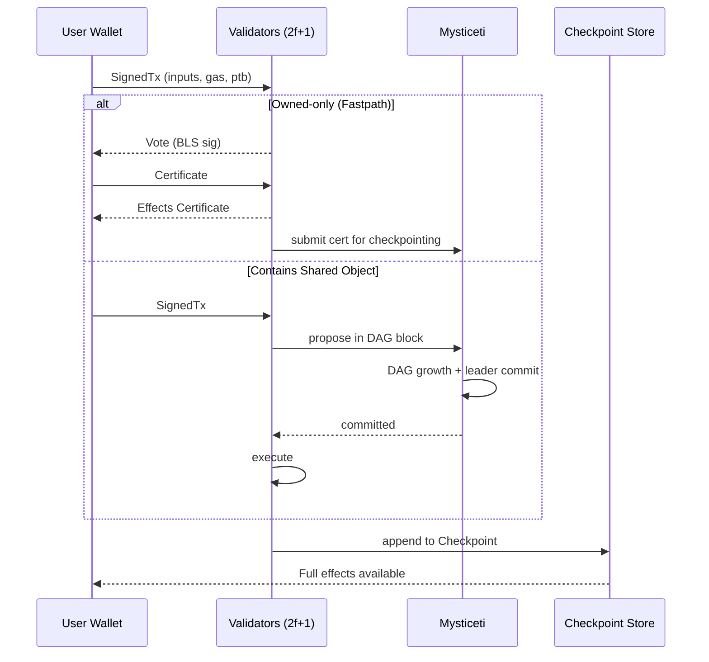

# Sui

> **TL;DR**：Sui 是前 Meta/Novi 团队创建的 MystenLabs 于 2023-05 主网启动的 **对象中心（object-centric）高性能 L1**。其与传统账户模型 / UTXO 均不同：**一切链上状态都是带有全局唯一 ID 和版本号的 Object**，交易以"消费输入对象、产生输出对象"为原语。共识层采用自研的 **Mysticeti**（2024 年由 Narwhal + Bullshark 演进而来）——基于 DAG 的 BFT 共识，理论最少 3 轮消息即可提交，亚秒级延迟。执行层通过 **Fastpath（无共识的 owned-object 交易）+ Consensus path（共享对象交易）** 双通道实现：简单转账可在 ~400 ms 内独立终局，复杂 DeFi 调用才进共识。合约语言为 **Sui Move**（对 Diem Move 做了重大改造：删除了 global storage，改为对象所有权），支持 **zkLogin**（Google/Apple OAuth 直接生成链上地址）、**Sponsored Transaction**（第三方代付 Gas）、**可编程交易块（PTB）**（单交易组合多个 Move 调用）。截至 2026-04 据官方估计活跃验证者约 110+ 名。

---

## 1. 背景与动机

Sui 的团队来自 Meta 内部的 Diem / Novi 稳定币项目。2022 年 Diem 解散后，Evan Cheng、Sam Blackshear（Move 语言发明者）、Kostas Chalkias 等创立 MystenLabs。他们的判断：**以太坊"全局可变状态 + 串行执行"是 2015 年受 Simula/Solidity 启发的设计债，并非必须**。若把状态拆成互相独立的 Object，大多数用户行为（转账、NFT 转移）只涉及**单人独占**的对象，完全不需要进入全局共识，只需要验证者对"这个 Object 的所有者签了字"达成 Byzantine 一致即可。

这一观察直接导出了 Sui 的两个核心设计：

- **对象 所有权类型化**：Owned / Shared / Immutable / Dynamic Field，不同类型走不同验证路径；
- **双通道执行**：Fastpath 处理独占对象的 Tx，Consensus path 处理共享对象。

2022-05 Devnet、2023-05-03 主网启动；2023-10 Narwhal + Bullshark 上线；2024-08 切换至 Mysticeti，提交延迟从 ~2.5s 降至 ~0.5s；2024 年推出 zkLogin、Enoki、SuiNS。2025 年开始推进 **Mysticeti v2 + 异步实时流水线**。

## 2. 核心原理

### 2.1 形式化定义：Object 模型

Sui 状态是一个 **Object 字典** $\mathcal{S} : \text{ObjectID} \to \text{Object}$。每个 Object 是一个八元组：

$$
O = (\text{id}, \text{version}, \text{digest}, \text{type}, \text{owner}, \text{fields}, \text{previous\_tx}, \text{storage\_rebate})
$$

- **id**：32 字节全局唯一 ID，创建时由交易摘要派生（`derive_id(tx_digest, counter)`），保证任何网络分区下不会冲突。
- **version**：单调递增的 u64。每次 Object 被交易"消费"（作为输入）时，新产生的 Object 版本号 = $\max(\text{input versions}) + 1$。这就是 Sui 的"乐观并发控制戳"。
- **owner**：`AddressOwner(addr)` / `ObjectOwner(parent_id)` / `Shared{ initial_shared_version }` / `Immutable`。
- 不变式：**任一时刻某 ObjectID 只对应唯一的 (id, version)**。Committee 通过"拒绝已被消费的 version"来防止双花。

交易即状态转移 $T : (\text{inputs}, \text{code}, \text{gas}) \to (\text{outputs}, \text{events}, \text{effects})$。Effects 结构是 Sui 的收据，包括 `created / mutated / deleted / wrapped / unwrapped / transferred` 六种对象变更集合（见 `crates/sui-types/src/effects/`）。

### 2.2 关键算法与数据结构

**Causal history（因果历史）**：Sui 不维护"账户 nonce"。防重放与顺序依靠 **Object version**：每笔 Tx 声明 `(objectID, version)` 作为输入，共识/投票层只接受"该 version 未被消费过"的 Tx。这样：

- 独占 Object 的 Tx 可以**并行**（完全无序）；
- Tx 之间的**因果图**自然由 version 串联。

**Mysticeti 共识（DAG + 隐式确认）**（见 [Mysticeti Paper](https://arxiv.org/abs/2310.14821)）：

- 每个 validator 同时是 "proposer"。每轮（round）每个 validator 广播一个 Block，Block 引用 ≥ 2f+1 个上轮 Block 形成 DAG。
- "提交规则"：在 DAG 上挑选 leader，若后两轮有 2f+1 个 Block 引用 leader，则 leader 及其因果历史被 commit。
- **隐式背书**：引用即投票，不需要显式 vote message，这是相比 Narwhal+Bullshark 的关键优化。
- 3 轮消息（proposal → support → commit）即可终局，接近 BFT 理论下界。

**Fastpath（owned-object 路径）**：

1. Client 把 Tx 送给所有 validators；
2. 每个 validator 用 BLS 对 `(tx_digest, input_versions)` 签名返回 "vote"；
3. Client 收集 2f+1 签名，组装 **Certificate**；
4. Client 把 Certificate 再发给 validators，执行并返回 **Effects Certificate**；
5. 无需过 Mysticeti。延迟 ~400 ms。

但：Fastpath **牺牲了 liveness**——如果 2f+1 validator 中发生"签名分裂"（validator 为同一对象的不同 Tx 签了两次），该对象会被 **equivocation lock**，必须下一个 Epoch 才能解锁。这是 Sui 最大的"非理想情况"。

### 2.3 子机制拆解

1. **所有权类型系统**：`TransferPolicy` 决定对象能否被转让，为 Kiosk（NFT 市场标准）奠基。
2. **动态字段（Dynamic Field / Dynamic Object Field）**：在不改变对象类型的前提下附加任意 key→value，用于模拟"以太坊 mapping"，但保持精细并行粒度。
3. **可编程交易块（PTB）**：单个 Tx 里链接最多 1024 条 Move 指令（MoveCall / TransferObjects / SplitCoins / MergeCoins / MakeMoveVec / Publish），中间值在栈上流转，无需部署临时合约。
4. **Gas 机制**：**计算 Gas + 存储 Gas + 存储退款**。删除/减小 Object 时返还 **99%** 的存储费，形成"状态租金"激励。参考价（Reference Gas Price, RGP）由验证者每 Epoch 投票决定。
5. **Checkpoint**：Sui 没有传统"区块"，只有 Checkpoint（每 ~250 ms 产生一次），将该段时间内所有 commit 的 Tx 做因果排序并写入持久化。Light Client 只需验证 Checkpoint 签名即可。
6. **zkLogin**：用 OAuth JWT + Groth16 SNARK 证明"我持有一段未泄露的盐值 s，并且 OIDC provider 签了我的 sub"，派生出链上地址。无私钥门槛参考 [zkLogin Doc](https://docs.sui.io/concepts/cryptography/zklogin)。

### 2.4 参数与常量（可治理）

| 参数 | 值 | 说明 |
| --- | --- | --- |
| Checkpoint 间隔 | ~250 ms | 目标值 |
| Epoch 长度 | 24 h | 主网 |
| 最小质押 | 30,000,000 SUI | 可治理 |
| Validator committee size | 上限 150 | |
| PTB 最大指令数 | 1024 | |
| Max Tx size | 128 KB | |
| Max gas budget per Tx | 50 SUI | |
| 存储退款率 | 99% | |
| BLS 签名 | BLS12-381 | 聚合签名 |

### 2.5 边界条件与失败模式

- **Equivocation lock**：用户自用私钥对同一 owned object 签两条冲突 Tx，会被锁定到下一 Epoch。对普通钱包一般不会发生，但需要关注 **MPC / 多设备场景**。
- **共享对象争用**：写锁冲突的 Tx 在 Mysticeti 内按到达顺序定序，严重热点（如 DeFi 池）可能出现秒级延迟。
- **Validator > 1/3 拜占庭**：若超过 1/3 stake 恶意，会丧失安全性；Mysticeti 假设同步/部分同步网络模型。
- **Move 资源泄漏**：Sui Move 没有 global storage，所以传统 Move 的资源"卡"风险降低，但 **wrapping** 不当仍可能让 Object 永久锁死。

### 2.6 图示：Tx 生命周期



## 3. 架构剖析

### 3.1 分层视图

```
┌────────────────────────────────────────────────┐
│ Client SDK (TS/Rust/Kotlin/Swift)              │
├────────────────────────────────────────────────┤
│ JSON-RPC / GraphQL / gRPC Gateway              │
├────────────────────────────────────────────────┤
│ Full Node (sui-node):                          │
│   ├── Authority Server (validation & signing)  │
│   ├── Execution Engine (Move VM + Adapter)     │
│   ├── Consensus (Mysticeti)                    │
│   ├── Checkpoint Builder                       │
│   └── Storage (RocksDB / Authority perpetual)  │
├────────────────────────────────────────────────┤
│ Storage: LSM-Tree + Snapshots + Pruning        │
└────────────────────────────────────────────────┘
```

### 3.2 核心模块清单（映射 `MystenLabs/sui` 主分支）

| 模块 / Crate | 职责 | 依赖 | 可替换性 |
| --- | --- | --- | --- |
| `crates/sui-core` | Authority 状态机、Tx 验证、Effects 生成 | sui-types, consensus, move-vm | 核心，不可替换 |
| `crates/sui-node` | 进程入口，整合 all services | 上述所有 | 主客户端 |
| `consensus/` (含 core/dag) | Mysticeti 共识实现 | sui-network | 可替换为其它 BFT |
| `crates/sui-types` | Object / Effects / Transaction 定义 | move-core-types | 稳定接口层 |
| `crates/sui-framework` | 系统 Move 包（`sui`, `std`, `sui_system`, `deepbook`, `bridge`） | move | 通过 framework 升级 |
| `crates/sui-execution` | Move VM 与 Adapter 桥接，gas 计价 | move-vm-runtime | 可版本化 |
| `crates/sui-network` | anemo p2p + gRPC | tonic | 可替换传输层 |
| `crates/sui-storage` | RocksDB 封装、快照 | typed-store | 可改 Sled/Parity-DB |
| `crates/sui-indexer` | 读路径索引（PostgreSQL） | 上述 | 独立进程 |
| `crates/sui-json-rpc` | RPC API 与 GraphQL | 上述 | 可部署多副本 |
| `crates/sui-bridge` | 与 Ethereum 桥接 | | 生态可选 |
| `crates/sui-rosetta` | Coinbase Rosetta 适配 | | 可选 |

### 3.3 数据流：从用户钱包到 Checkpoint

1. **构造 PTB**：钱包调用 SDK `TransactionBlock.moveCall(...)`，本地生成 BCS 序列化的 TX。
2. **Dry-run 估 Gas**：RPC `dryRunTransactionBlock`，返回 `gas_used` 和 `effects` 模拟。
3. **签名 + 提交**：Ed25519 / Secp256k1 / zkLogin 任一签名。RPC `executeTransactionBlock` 发给全节点。
4. **Authority 投票**：每个 Authority 检查 `(object_id, version)` 未被消费 → 执行 Move（若 owned-only）→ 返回签名。
5. **聚合 Certificate**：客户端或 Gateway 聚合 2f+1 BLS 签名。
6. **Fastpath 提交或入 Mysticeti DAG**：前者直接得 Effects；后者进入 DAG，等待 leader commit。
7. **Checkpoint**：每 ~250 ms Checkpoint Builder 从 commit 队列打包、签名，写入持久化并广播。
8. **Indexer 消费**：sui-indexer 读 Checkpoint → 落 Postgres → 为 GraphQL 查询提供。

端到端延迟：owned 约 **400 ms**，共享约 **0.6 – 1 s**（Mysticeti 一个 commit 周期）。

### 3.4 客户端多样性

- **sui-node (Rust)**：官方唯一主实现。
- **sui-lite-node / Full Node archival**：官方派生，不同配置。
- 目前 **单客户端风险突出**。据官方讨论，MystenLabs 有在评估 Go 实现（类似 Solana 的 Firedancer 路线），但尚无时间表。参见 [Sui Safe](https://blog.sui.io/) 与 GitHub issues。

### 3.5 扩展接口

- **JSON-RPC**：`sui_*` / `suix_*` 命名空间，兼容 ETH 风格。
- **GraphQL RPC**：推荐替代 JSON-RPC，v2 主打统一索引查询（见 `crates/sui-graphql-rpc`）。
- **gRPC (tonic)**：全节点间通信、Indexer 推送。
- **WebSocket / Subscribe**：订阅事件、对象变更。
- **Bridge API**：与 Ethereum 的官方 L2 风格桥。

## 4. 关键代码 / 实现细节

Object 结构（简化自 `crates/sui-types/src/object.rs`，tag `mainnet-v1.33.x`）：

```rust
pub struct Object {
    pub data: Data,           // Move 对象 or Package
    pub owner: Owner,         // AddressOwner / ObjectOwner / Shared / Immutable
    pub previous_transaction: TransactionDigest,
    pub storage_rebate: u64,  // 删除时退款
}

pub enum Data {
    Move(MoveObject),
    Package(MovePackage),
}

pub struct MoveObject {
    type_: MoveObjectType,
    has_public_transfer: bool,
    version: SequenceNumber,  // 关键：每次消费 +1
    contents: Vec<u8>,        // BCS 编码字段
}
```

验证器状态机核心（简化自 `crates/sui-core/src/authority.rs`）：

```rust
pub async fn handle_transaction(
    &self,
    tx: VerifiedTransaction,
) -> Result<HandleTransactionResponse> {
    // 1. 检查输入 object versions 是否未被锁
    let locks = self.check_owned_locks(&tx).await?;
    // 2. 对 owned objects 写 lock：(object_id, version) -> tx_digest
    self.set_transaction_lock(locks, tx.clone()).await?;
    // 3. 签名 tx，返回 vote
    let vote = AuthorityVote::new(self.name, tx.digest(), &self.secret);
    Ok(HandleTransactionResponse { vote })
}
```

> 省略了错误处理、Epoch 切换、共享对象入共识的分支。

## 5. 演进与版本对比

| 版本 | 时间 | 关键变化 | 影响 |
| --- | --- | --- | --- |
| Devnet | 2022-05 | 首个公开网络，Narwhal + HotStuff | 概念验证 |
| Testnet Wave 1 | 2022-12 | Narwhal + Bullshark | 提交延迟 ~2 s |
| 主网 Launch | 2023-05-03 | 生产级上线，TPS 实测 数千 | 生态启动 |
| Mysticeti 上线 | 2024-08 | 新共识替换 Bullshark | 延迟 ~0.5 s |
| zkLogin | 2024-Q1 | OAuth 直接登录 | 用户门槛降低 |
| PTB v2 / DeepBook v3 | 2024-Q4 | CLOB + PTB 原生组合 | 做市与聚合提升 |
| Mysticeti v2 / 流水线化 | 2025 持续 | 进一步降延迟与提吞吐 | 据官方路线 |

## 6. 实战示例

**在本地启动 localnet + 发布 Move 包 + PTB 调用**（官方 CLI）：

```bash
# 安装
curl -fsSL https://sh.rustup.rs | sh
cargo install --git https://github.com/MystenLabs/sui.git --branch mainnet sui

# 启动本地网
sui start --with-faucet --force-regenesis
sui client faucet

# 初始化 Move 包
sui move new hello
cd hello
# 编辑 sources/hello.move 添加一个 public entry fun mint
sui client publish --gas-budget 100000000

# 通过 PTB 组合调用
sui client ptb \
  --move-call "0xYOUR_PACKAGE::hello::mint" \
  --assign obj \
  --transfer-objects "[obj]" "@0xRECIPIENT" \
  --gas-budget 10000000
```

预期输出：交易 `digest`、`effects.status=success`、创建的 Object ID、存储退款数值。

## 7. 安全与已知攻击

1. **Cetus DEX 事件（2025-05）**：Cetus Protocol 因 Move 合约中"价格 tick 边界"溢出问题被攻击，损失约 2.2 亿美元级（据公开估计）。事后 Sui 社区通过短期冻结部分账户的链上白名单方式止损，引发关于 **Sui 实际去中心化度** 的激烈讨论（validators 协调冻结被视作治理权力过强）。参考 [Cetus 官方复盘](https://x.com/CetusProtocol)。
2. **Sui 共识层 equivocation 防护**：owned object 的"分叉签名"会立即锁对象并可切片（slashing）。虽未发生真实事件，但 MPC 钱包集成方需要谨慎同步 signing quorum，否则用户资产会被锁到下一个 Epoch。
3. **理论攻击面**：① zkLogin 依赖 OIDC provider（Google/Apple/Twitch）可信度，provider 篡改 `sub` 即可接管账户，因此引入 `salt service` 与 session key 限制交易范围；② Mysticeti 在部分同步模型外（网络长期非同步）理论可能出现活性故障。

## 8. 与同类方案对比

| 维度 | Sui | Aptos | Solana | Ethereum |
| --- | --- | --- | --- | --- |
| 状态模型 | Object-centric | Account/Resource | Account | Account/Storage Trie |
| 语言 | Sui Move | Aptos Move | Rust/C (BPF) | Solidity/Vyper |
| 共识 | Mysticeti (DAG BFT) | Jolteon / AptosBFTv4 | PoH + Tower BFT | LMD-GHOST + Casper FFG |
| 并行执行 | 静态分析 + Object lock | Block-STM（动态乐观） | Sealevel（静态声明） | 串行（EIP-7600 研究中） |
| 独占 Tx 终局 | ~400 ms Fastpath | ~600 ms | ~1 s | 12–15 s（软）~12 min（硬） |
| 合约安全模型 | 所有权 + 类型 | 资源权限 | 账户 + Signer | msg.sender + storage |
| 客户端多样性 | 单一（Rust） | 单一（Rust） | 双（Agave + Firedancer） | 多（geth/reth/nethermind/erigon/besu） |

**Sui vs Aptos Move 的差异**：Aptos Move 保留了 Diem 的 `global storage`（`move_to/move_from`），资源通过账户地址索引；Sui Move 删除该抽象，**一切资源都是 Object 并由 Object 表层调度**，这使 Sui 能在共识前判断冲突集合，但也使从 Aptos 迁移合约非零工作量。

## 9. 延伸阅读

- **官方文档 / Spec**：
  - [Sui Docs](https://docs.sui.io/)
  - [Sui Framework Reference](https://docs.sui.io/references/framework)
- **核心论文**：
  - [Mysticeti: Reaching the Latency Limits with Uncertified DAGs (2023)](https://arxiv.org/abs/2310.14821)
  - [Narwhal & Tusk (EuroSys 2022)](https://arxiv.org/abs/2105.11827)
  - [Bullshark (CCS 2022)](https://arxiv.org/abs/2209.05633)
- **权威博客**：
  - [MystenLabs Blog](https://blog.sui.io/)
  - [a16z: The State of Crypto — Move Chains](https://a16zcrypto.com/)
- **视频**：
  - Kostas Chalkias 在 Consensus 2024 的 Mysticeti 讲解（YouTube）
  - Sam Blackshear 关于 Move 设计的 Stanford 演讲
- **相关规范**：
  - [SIP Process](https://github.com/sui-foundation/sips)
  - [Move 语言 Book](https://move-book.com/)

## 10. 术语表

| 术语 | 英文 | 释义 |
| --- | --- | --- |
| 对象 | Object | Sui 的基本状态单元，带 ID/version/owner |
| 可编程交易块 | Programmable Transaction Block (PTB) | 单 Tx 内组合多条 Move 指令 |
| 快速路径 | Fastpath | 仅涉及 owned object 的 Tx 不走共识 |
| 共享对象 | Shared Object | 多用户可写的 Object，需经 Mysticeti |
| 等价分叉 | Equivocation | 对同一对象签两次冲突交易 |
| 参考 Gas 价 | Reference Gas Price (RGP) | Epoch 层面投票决定 |
| 存储退款 | Storage Rebate | 删除/缩减 Object 退还 99% 存储费 |
| 检查点 | Checkpoint | Sui 的"块"概念，每 ~250 ms 产出 |

## 11. FAQ

以下问题来自与学习者的真实对话，聚焦 Sui 最容易"从抽象掉到具体"出错的几个点。

### Q1：Sui 真正独特的设计是哪些？与 Aptos / Solana / Ethereum 相比什么是"只有 Sui 这样做"？

5 个互相咬合的设计点：

1. **Object-centric 状态模型**：不是 `account → balance/storage`，而是一切皆 Object，每个带 `ID / version / owner`。Owner 类型（Owned / Shared / Immutable / Wrapped / Dynamic Field）决定交易验证路径。这不是语法糖，是并行执行的前提——依赖关系**显式写在 tx 输入里**，不需要推测执行或回滚。
2. **Fast path：owned-object 不走共识**。仅涉及 Owned object 的交易走 Byzantine Consistent Broadcast，2f+1 签名即终局（~400 ms），**不进入 Mysticeti**。只有涉及 Shared object 的交易才走共识。等价于把"因果序 vs 全序"分离：大多数单用户操作只需因果序。
3. **Sui Move（与 Aptos Move 分叉）**：删除 global storage，所有资源必须存在 Object 里；`key` ability + UID 让 object 有链上真实身份；`transfer` 是协议原语而非合约逻辑；权限通过 Capability object（而非 `msg.sender` 检查）。
4. **Programmable Transaction Block (PTB)**：一个 tx 串联最多 ~1024 条 Move call / 原生命令，前一个的返回值可直接作为后一个的输入，原子执行。去掉了"为组合操作单独部署 router 合约"的必要。
5. **Mysticeti + Narwhal 解耦**：数据可用性（DAG mempool）与排序（共识提交规则）分离，只对 DAG 的 commit point 投票，带宽利用率远高于 Tendermint 式"打包—投票—出块"。

**一句话**：其他链在比"谁共识更快"，Sui 在做"让大部分 tx 根本不需要共识"。

### Q2：Fast path 下 validator 如何验证用户提交的 tx？是否要验证 object version？

是的，version 验证是 fast path **防双花的唯一锚点**。Validator 收到 tx 后的检查：

1. **签名 / 语法层**：sender 签名合法；gas object 属于 sender，余额 ≥ `budget × price`。
2. **Object 有效性**（对每个 owned input）：
   - ObjectID 存在
   - **Version 严格等于本地记录的当前 version**（必须 `==`，不是 `≥`）
   - Digest 等于本地 object 的 digest（防 TOCTOU）
   - Owner 是 sender（或持有对应 Capability）
   - 类型确实是 `Owned`
3. **Lock 获取（核心）**：validator 本地维护 `(ObjectID, Version) → signed_tx_digest`。
   - 未锁 → 记录本 tx digest，签名返回
   - 已锁给**同一 tx** → 幂等重发
   - 已锁给**另一 tx** → 拒签（equivocation detected）

每个诚实 validator 对 `(O, v)` 最多签一个 tx → 最多一个 tx 能拿到 2f+1 → 无需共识即可防双花。

**两阶段视角**：

| 阶段 | 输入 | 动作 | version 变化 |
| --- | --- | --- | --- |
| Signing (vote) | raw tx | 上述 1–3 检查、上锁、签名 | 不变 |
| Execution (cert) | 2f+1 certificate | 跑 Move、写新状态 | `v → v+1`，旧 `(O,v)` 锁释放 |

**坑：equivocation 自锁**。若 sender 把 `tx_A(O@v)` 和 `tx_B(O@v)` 分别发给不同 validator 子集，两 tx 都拿不到 2f+1，但 `(O,v)` 在所有诚实 validator 处都被锁住——**object 卡死直到 epoch 切换**。这是 Sui 显式选择的 tradeoff。

### Q3：`2f+1` 中的 f 是什么？全局如何保证所有人认同同一个 f？节点动态加入/退出时 f 如何变且大家一致？

**f 的定义**：经典 BFT `n ≥ 3f+1` 的作恶上限。但 Sui 是 PoS 权益加权，**f 是权益单位不是节点数**：

- 每个 validator 的 voting power = 其 stake 归一化后的值，**全网总和 = 10000**
- 作恶上限 f = 最多 3333（<1/3）
- Quorum `2f+1` = 累计 voting power **≥ 6667**（>2/3 stake）

"拿到 2f+1 个回应"准确说法是**签名累计权重 ≥ 6667**，和节点数量无关。按 stake 计数可防 Sybil，要突破阈值需真金白银。

**全局一致性来自"committee 是链上状态"**：

- `SuiSystemState`（shared object，地址 `0x5`）记录当前 epoch 的 validator 集合 + 每人 voting power
- f 可直接算出：`f = floor((total_voting_power - 1) / 3)`
- 所有诚实 full node 同步到同一状态 → 自动得到同一个 f

客户端验证 2f+1 签名流程：读当前 epoch committee → 对每个签名累加其 voting power → 检查是否 ≥ quorum。epoch 号是签名的一部分，防止用旧 committee 验新签名。

**动态进出靠"epoch 边界"原子切换**：committee 在 epoch 内冻结（主网 epoch ≈ 24h）。

- **Epoch 内**：候选人用 `request_add_validator`、现任用 `request_remove_validator`、用户 `request_add_stake` / `request_withdraw_stake`——这些都只是 **pending 状态**，当前投票权不变。
- **Epoch N → N+1**：当前 committee 对 `change_epoch` 交易跑共识；该交易内应用所有 pending 变更，确定性计算新 voting power，写入 `SuiSystemState`。**由旧 committee 的 2f+1 签名背书**。
- 所有诚实节点独立算出的新 committee 必然相同（相同旧状态 + 相同 pending + 确定性函数）。

**信任链**：
```
Genesis committee（创世写死）
   ──签名─→ Epoch 1 committee
               ──签名─→ Epoch 2 committee
                           ...
```
Light client 只需顺着这条链验证每次 epoch 切换签名，即可安全跟上当前 committee，不用同步全部历史。

**尖角**：

- **Epoch 内 > f 作恶**：安全/活性可能受损至 epoch 切换。代价即静态 committee 的代价，靠 slashing + 24h 窗口压低风险。
- **客户端落后一个 epoch**：用旧 committee 验新签名会失败，必须先追到最新 epoch。
- 即使没有节点进出，只要 stake 分布变化，voting power 归一化后 f 与 quorum 阈值仍会变——每 epoch 重算。

### Q4：SUI 余额如何记账？转账 / 质押的 TX 具体长什么样？

**余额没有字段，是 `Coin<SUI>` object 的聚合**：

```move
struct Coin<phantom T> has key, store {
    id: UID,
    balance: Balance<T>,  // u64，单位 MIST（1 SUI = 10^9 MIST）
}
```

用户余额 = 其地址下所有 `Coin<SUI>` object balance 之和。同一"余额 1000 SUI"可以是 1 个 coin 也可以是 100 个 coin——链上结构不同，影响后续 tx 如何构造。钱包展示的 balance 是客户端聚合视图，**链上没有这个数字**。

- `coin::split(&mut c, amount)` → c 的 UID 不变、version+1、balance 减少；返回新 Coin（新 UID）。
- `coin::join(&mut c, c2)` → c2 balance 并入 c，c2 UID 销毁。

**TX 顶层结构**：

```
TransactionData {
  sender, gas_data { payment, owner, price, budget }, expiration,
  kind: ProgrammableTransaction(PTB { inputs: [CallArg...], commands: [Command...] })
}
```

Command 原语：`MoveCall` / `TransferObjects` / `SplitCoins` / `MergeCoins` / `Publish` / `MakeMoveVec` / `Upgrade`。

#### 场景 A：转账 10 SUI 给 Bob（用 gas coin 作来源）

```
inputs:
  [0] Pure(u64 = 10_000_000_000)       // 10 SUI
  [1] Pure(address = Bob)
commands:
  [0] SplitCoins(GasCoin, [Input(0)])        → Result(0): Coin<SUI> of 10
  [1] TransferObjects([Result(0)], Input(1)) // owner → Bob
```

`GasCoin` 是 PTB 对 `gas_data.payment` 的特殊引用；`Pure` 参数是原始字节（无 version/digest）。所有 input 均为 **owned** → **走 fast path**，~400 ms 终局。

上链变化：gas coin balance -= 10 + gas_cost、version+1；产生新 Coin（UID 新、owner=Bob、version=1）；Alice 收到 storage rebate。

#### 场景 B：用独立 `Coin<SUI>` 作源

```
inputs:
  [0] Object(ImmOrOwned(id: 0xALICE_COIN, version: 42, digest: 0xABC...))
  [1] Pure(u64 = 10_000_000_000)
  [2] Pure(address = Bob)
commands:
  [0] SplitCoins(Input(0), [Input(1)])  → Result(0)
  [1] TransferObjects([Result(0)], Input(2))
```

Input[0] 的三元组 `(id, version, digest)` 就是 Q2 中 validator 严格校验的锚点。

#### 场景 C：原生 staking（委托给 validator）

System package `0x3`，入口 `sui_system::request_add_stake`：

```
inputs:
  [0] Object(Shared(id: 0x5, initial_shared_version: 1, mutable: true))  // SuiSystemState
  [1] Pure(u64 = 100_000_000_000)
  [2] Pure(address = 0xVALIDATOR)
commands:
  [0] SplitCoins(GasCoin, [Input(1)])   → Result(0): Coin<SUI> 100
  [1] MoveCall {
        package: 0x3, module: "sui_system", function: "request_add_stake",
        args: [Input(0), Result(0), Input(2)],
      }
```

结果：100 SUI 并入 staking pool；用户收到一个 owned `StakedSui` object（记录 pool_id / principal / activation_epoch）作赎回凭证。

#### 场景 D：存入第三方 DeFi 合约（借贷池 / AMM）

```
inputs:
  [0] Object(Shared(id: 0xPOOL, initial_shared_version: 1337, mutable: true))
  [1] Pure(u64 = 100_000_000_000)
  [2] Pure(address = Alice)
commands:
  [0] SplitCoins(GasCoin, [Input(1)])       → Result(0)
  [1] MoveCall {
        package: 0xLENDING_PKG, module: "lending", function: "deposit",
        type_args: [<SUI 完整类型路径>],
        args: [Input(0), Result(0)],
      }                                      → Result(1): LPToken<SUI>
  [2] TransferObjects([Result(1)], Input(2))
```

注意 `Result(1)` 被下一条 command 直接接住并转给 Alice——**这正是 PTB 的价值：原子完成"拆币 → 存入 → 收 LP token"，无需 router 合约**。

#### Owned vs Shared 的关键差异

| 维度 | 转账（场景 A/B） | 原生 staking（C） | DeFi 存入（D） |
| --- | --- | --- | --- |
| 关键 input | 仅 owned + pure | shared(`0x5`) + owned | shared pool + owned |
| 执行路径 | **Fast path** | 共识 | 共识 |
| 终局时间 | ~400 ms | ~1–2 s | ~1–2 s |
| 产生凭证 | Coin<SUI>@Bob | StakedSui object | LPToken object |
| Version 处理 | 客户端带完整 `ObjectRef`，validator 静态校验 | Shared 部分只带 `initial_shared_version`，当前 version 由共识赋予 | 同左 |

**核心分野不在"转 vs 存"而在"输入里是否有 shared object"**——这决定了 400 ms fast path 还是走完整 Mysticeti 共识。

---

*Last verified: 2026-04-22*
