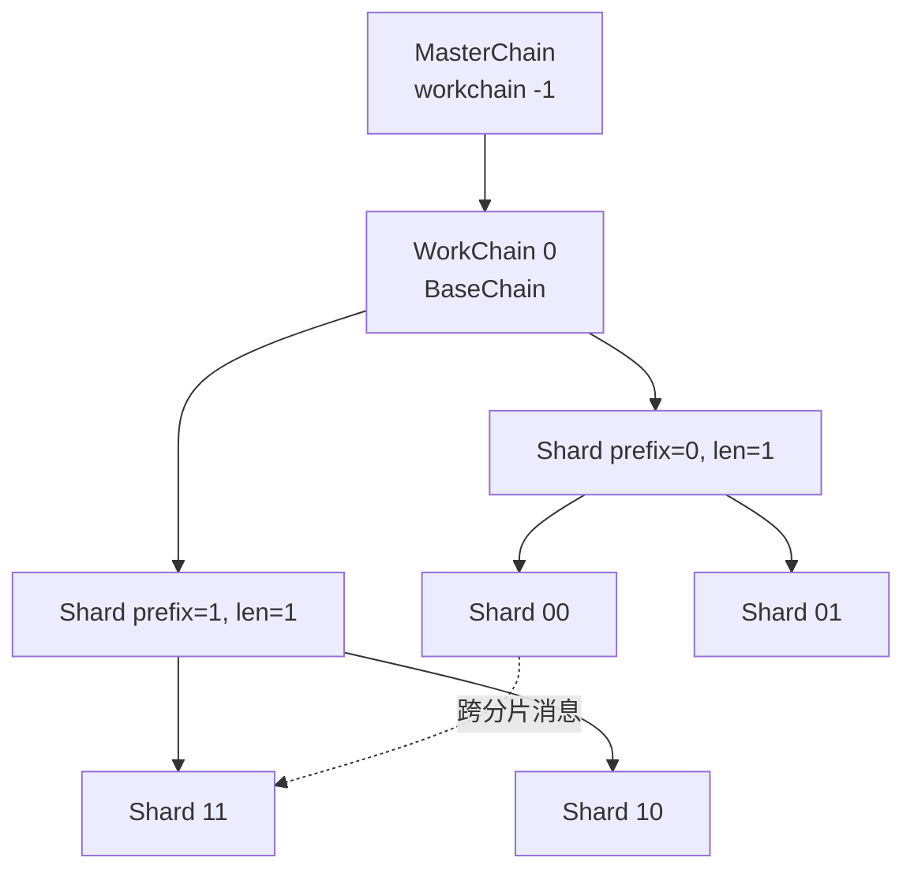

# TON（The Open Network）

> **TL;DR**：TON 由 Telegram 创始团队 Pavel/Nikolai Durov 于 2018 年构思、2020 年因 SEC 诉讼被迫放弃并移交开源社区（TON Foundation），后经 NewTON/TON Foundation 重启。核心定位是 **能承载 10 亿用户的超大规模异构多链**：通过 **"Infinite Sharding Paradigm（无限分片范式）"** 把账户状态动态切成 MasterChain（1 条）/ WorkChain（最多 2^32 条）/ ShardChain（每条 WorkChain 最多 2^60 个分片）三层树；智能合约基于 **Actor 模型** 与 **异步消息**，运行于 **TVM（TON Virtual Machine）**，合约语言有低级 Fift、主流 FunC、类 TypeScript 的 Tact、以及 2024 年新推出的 Tolk；通过 Telegram 内嵌的 TON-Connect 协议向 9 亿月活用户分发 DApp，诞生了 Notcoin、Hamster Kombat、DOGS、TapSwap 等现象级 Tap-to-Earn 游戏。截至 2026-04，TON 全网出块 ~5s，基础链活跃验证者 ~380 名，TON-connect 钱包月活跃已超过以太坊主网。

---

## 1. 背景与动机

2018 年 1–2 月，Telegram 在美国提交 Form D，计划通过 ICO 为"Telegram Open Network"募集 17 亿美元，用于建设一条能承载即时通讯 + 支付 + 去中心化应用的新链。白皮书由 Nikolai Durov（数学家）主笔，提出 **Infinite Sharding** 概念——这是 TON 与 Ethereum 2.0 分片思路最根本的差异：

- **Ethereum 2.0（现已放弃）**：固定数量（64 条）分片，交易和状态按分片编号静态划分；
- **TON**：分片数 **动态**，任何 ShardChain 负载过高时可自动 *split*，负载下降时可 *merge*；理论上限 2^60 条/workchain。

2019 年测试网 "Testnet-2" 上线；2020-03-24 SEC 以"未注册证券发行"起诉 Telegram，法院颁布禁令，Telegram 于 2020-05 放弃项目并向投资者退款约 12 亿美元。开源代码由 NewTON 社区（后更名 TON Foundation）接管，2020-09 主网被重新上线并更名 **The Open Network**。

2023 年 Q3 Telegram 与 TON Foundation 签署独家战略合作，把 TON 设为 Telegram 应用内的"官方区块链"，随后两年 Telegram Mini App（TMA）+ TON-Connect 组合催生了 **Tap-to-Earn 现象**：Notcoin（2024-05 TGE，市值峰值 30 亿美元）、DOGS（2024-08 TGE）、Hamster Kombat（2024-09 TGE）、TapSwap、Catizen 等均达 1 亿+ 玩家级别，为 TON 带来单日百万级新钱包开户的极端流量。

## 2. 核心原理

### 2.1 Infinite Sharding Paradigm 的形式化定义

TON 白皮书（[tblkch.pdf](https://ton.org/tblkch.pdf) 第 2.1 节）把分片形式化为 **状态的前缀分区**。令账户地址空间为 256 bit 整数，一个 ShardChain 由二元组 `(w, s)` 标识：

- `w ∈ [-2^31, 2^31)`：workchain_id；
- `s = (prefix, len)`：一个 0 ≤ len ≤ 60 的位串前缀，该 shard 包含所有地址前 `len` 位等于 `prefix` 的账户。

若某 shard `s` 的工作负载高于阈值（TPS 或账户数），它可以 **split** 成两个子分片 `s || 0` 与 `s || 1`（len + 1）；反之相邻分片可 **merge**。由此：

- 所有 shard 的前缀组成一棵二叉树（动态变化）；
- 跨 shard 消息只需沿"父 shard ← LCA → 子 shard"的最短路径路由，最坏 O(log N)；
- 每个账户在任意时刻 **仅存在于唯一 shard**（强分区，解决了"同一账户同时在多 shard"的一致性难题）。

MasterChain（`workchain_id = -1`）是特权链，仅记录：全网配置、验证者集合、各 WorkChain/ShardChain 最新区块哈希、Epoch 切换。任何其他 shard 的终局性都通过"在 MasterChain 上登记其区块哈希"来获得——这等价于一个两层 finality gadget。

### 2.2 共识：BFT + Catchain + 验证者组轮转

TON 采用改进的 BFT 共识（TON 文档称 "Catchain" / "Validator Session"）：

- **全局验证者集合**：由 MasterChain 维护，目前约 380 人（截至 2026-04，据 tonscan 数据）。加入门槛为抵押 ≥ 30 万 TON。
- **任务组（task group）**：对每个 shard，协议从全局集合中 **伪随机抽取 ~100–400 名验证者** 组成 "validator group"，负责该 shard 一个 Epoch（约 60,000 MasterChain 块 ≈ 3 天）内的出块与投票。
- **Catchain**：组内的 BFT 协议，类似 PBFT：Leader 提议 → 预提交 → 提交。容忍 ≤ 1/3 拜占庭。出块时间 ~5 秒（MasterChain）、~3 秒（ShardChain），软确定性 < 6 秒，绝对终局在 MasterChain 登记后 ≤ 6 秒。
- **轮转**：每个 Epoch 结束后 MasterChain 重新洗牌所有 validator group，防止长期勾结。

### 2.3 TVM 与 Actor 模型

TVM 是一台 **栈式虚拟机**，但与 EVM 有三大差异：

1. **数据单位是 Cell**：每个 Cell 最多 1023 bit 数据 + 4 个子 Cell 引用，组成 DAG。账户状态、合约代码、消息体都是 Cell 树；Cell hash 使用 SHA-256 树状哈希（见 [tvm.pdf](https://ton.org/tvm.pdf) §3）。
2. **Actor 模型**：每个合约即一个 actor，拥有自己的地址、余额、持久化状态。合约之间 **只能异步通过 message 通信**——没有"原子多合约调用"。一笔用户交易可能触发一串消息，跨多个 block 才执行完毕。
3. **TON Gas**：以 *gas units* 计量，但最终转化为 Toncoin 按当前 gas price 扣费。Gas price 可由 MasterChain 配置治理。

形式化地，TVM 状态转移函数可写作 `(State, Msg) -> (State', [Msg'])`：给定当前账户状态与入站消息，计算新状态并输出一组出站消息。出站消息在下一个 block 由对应目标合约消费。这种异步模型是 **无限分片的必要条件**：若要求跨 shard 同步调用，则分片就失去独立出块能力。

### 2.4 智能合约语言栈：Fift / FunC / Tact / Tolk

- **Fift**（2019）：类 Forth 的底层脚本，直接操作 TVM 指令；主要用作编译器后端与 ABI 胶水。
- **FunC**（2019）：类 C 的函数式语言，是目前绝大多数 TON 合约（包括 Jetton、NFT 标准合约）的实际实现语言。语法极简但安全约束多（需要手动管理 storage cell、手动序列化）。
- **Tact**（2023，由 Tact Lang 社区）：类 TypeScript + Rust 的高级语言，以 trait 和 message handler 为一等公民，降低 Actor 模型的学习成本。2024 年起 Telegram 文档推荐新项目使用 Tact。
- **Tolk**（2024-Q4 TON Foundation 官方发布）：改进自 FunC 的新语言，目标是"10 倍易用 + 与 FunC 二进制兼容"。语法更接近 Rust/TypeScript，默认启用严格检查。

### 2.5 关键参数与常量

| 参数 | 值 | 可治理 |
|---|---|---|
| MasterChain 出块时间 | ~5 s | 是 |
| ShardChain 出块时间 | ~3 s | 是 |
| Epoch（validator rotation 周期）| ~65,536 MC blocks ≈ 18 h–3 d | 是 |
| 验证者最低抵押 | 30 万 TON（约 950 万美元 @ 2026-04）| 是 |
| 单 shard 容量阈值（split 触发）| 可配置 | 是 |
| 分片最大深度 | 60 bit | 硬编码 |
| 总供给 | 5,069,024,478 TON（2020 genesis 数量，之后通过 inflation ~0.6%/yr 增长）| 部分 |

### 2.6 边界条件与失败模式

- **验证者组内 > 1/3 拜占庭**：该 shard 可能产生分叉；MasterChain 的 "vertical blockchain" 机制允许 **发布修正块（vertical block）** 回滚被攻击的 shard 状态。这是少有的"链上回滚原语"。
- **跨 shard 消息积压**：在极端流量（如 Notcoin TGE 期间）曾出现消息从发送到送达延迟数小时。协议并不保证 bounded 延迟，仅保证最终送达。
- **低 workchain 独立性**：目前仅 BaseChain（workchain 0）有业务流量，MasterChain 单点瓶颈明显。理论上的"多 workchain 异构"尚未实践检验。

### 2.7 图示：分片树与消息路由



```
  用户 Tx ──► Shard A ──(出站 msg)──► 父 shard 消息队列
                                          │
                                          ▼
                                      Shard B 入站队列
                                          │
                                          ▼
                                      next block 执行
```

## 3. 架构剖析

### 3.1 分层视图

TON 节点自顶向下分 5 层：

1. **Network Layer / ADNL**：TON 的 P2P 层，全名 *Abstract Datagram Network Layer*，基于 UDP + 非对称加密 + Kademlia DHT。所有上层协议（RLDP、Overlay、Catchain、TON Storage、TON DNS）都复用 ADNL。
2. **Overlay Layer**：节点按参与的 shard / validator group 加入多个 overlay 子网，实现点播/组播。
3. **Consensus Layer（Catchain）**：组内 BFT。
4. **Collator & Block Layer**：Collator 负责把账户集内的入站消息 + 用户 Tx 打包成区块；Validator 负责投票。
5. **TVM Execution Layer**：跑单笔交易。
6. **RPC/Lite-Client Layer**：对外暴露 JSON-RPC 风格的 lite-client 接口，TonCenter/TonAPI 是其 HTTP 封装。

### 3.2 核心模块清单（对应 `ton-blockchain/ton` 仓库目录）

| 模块 | 目录 | 职责 | 可替换性 |
|---|---|---|---|
| crypto | `crypto/` | Ed25519、SHA-256、BLS、VRF | 低（协议锁定） |
| tl / tl-utils | `tl/` | 类 Protobuf 的 schema 系统 | 低 |
| adnl | `adnl/` | P2P 传输与加密 | 低 |
| overlay | `overlay/` | 子网管理 | 低 |
| catchain | `catchain/` | 验证者 BFT | 低（协议核心） |
| dht | `dht/` | Kademlia DHT | 中 |
| validator | `validator/` | Collator + Validator 主循环 | 低 |
| tonlib | `tonlib/` | Lite-client 查询库 | 中 |
| crypto/fift | `crypto/fift/` | Fift 解释器 | 低 |
| crypto/func | `crypto/func/` | FunC 编译器 | 低 |
| tvm | `crypto/vm/` | TVM 实现 | 低 |

### 3.3 数据流：一笔 Jetton 转账的端到端

1. 用户在 Tonkeeper 签名一笔外部消息（external in），目标是用户自己的钱包合约 `v4r2`；
2. 钱包 App 通过 TonAPI 提交消息到距离最近的 Validator；
3. 该 Validator 若正属于目标 shard 的 validator group，则把消息放入 mempool，等待 Collator 打包；
4. Collator 在下一个 shard block 执行钱包合约代码 → 钱包合约 **向用户的 Jetton wallet 地址发送内部消息**；
5. Jetton wallet 合约所在 shard 不一定相同。该内部消息先进入本 shard 的 **outbound message queue**，下一个 block 由路由逻辑投递到目标 shard 的 **inbound queue**；
6. 目标 shard 的 Collator 在再下一个 block 执行，调用 Jetton wallet 合约 `transfer` handler → 再向接收方 Jetton wallet 发送内部消息；
7. 最终接收方 wallet 收到消息，更新余额。整条链路通常 3–4 个 block（9–12 秒）。

每一跳的 block 哈希会登记在 MasterChain，登记后该步骤获得全局终局。

### 3.4 客户端多样性

TON 生态目前仍以 **C++ 单实现** 为主（`ton-blockchain/ton`，TON Core 团队维护），这是最大的客户端风险。备选实现进展：

- **ton-kotlin**（JetBrains & Telegram，Kotlin 版 lite-client）— 目前仅支持轻节点；
- **tonutils-go / pytonlib**（Go/Python 客户端库）— 非完整验证者实现；
- **Everscale（原 FreeTON）**：2021 年分叉版本，Rust 实现 `ever-node`，**共识协议有部分兼容**，但生态已分道扬镳。

### 3.5 扩展接口

- **Lite-client protocol**：TL schema 定义的 RPC，ADNL 传输，适合原生 app；
- **TonAPI / TonCenter HTTP API**：RESTful 封装；
- **TON-Connect 2.0**：Wallet ↔ DApp 的连接协议（类似 WalletConnect），深度集成 Telegram Mini App；
- **TEPs（TON Enhancement Proposals）**：协议/合约标准提案，如 TEP-62 NFT、TEP-74 Jetton、TEP-85 SBT。

## 4. 关键代码 / 实现细节

TVM Cell 的引用与哈希（简化自 `crypto/vm/cells/Cell.h`）：

```cpp
// Cell = 最多 1023 bit data + 最多 4 refs
class Cell {
    BitString data;               // 位串，变长 ≤ 1023
    std::array<Ref<Cell>, 4> refs;// 子 cell 引用
    size_t refs_cnt;

    // Merkle-like 树哈希：SHA256(descriptor || data || child_hashes)
    Hash compute_hash() const {
        Hasher h;
        h.update(descriptor_bytes());
        h.update(data.raw_bytes());
        for (size_t i = 0; i < refs_cnt; i++)
            h.update(refs[i]->compute_hash());
        return h.finalize();
    }
};
```

FunC 合约示例（标准 v4 wallet，节选）：

```
() recv_external(slice in_msg) impure {
  var signature = in_msg~load_bits(512);
  var cs = in_msg;
  var (subwallet_id, valid_until, msg_seqno) = (cs~load_uint(32), cs~load_uint(32), cs~load_uint(32));
  throw_if(36, valid_until <= now());
  var (stored_seqno, stored_subwallet, public_key, old_plugins) = load_data();
  throw_unless(33, msg_seqno == stored_seqno);
  throw_unless(34, subwallet_id == stored_subwallet);
  throw_unless(35, check_signature(slice_hash(in_msg), signature, public_key));
  accept_message();
  ...
}
```

## 5. 演进与版本对比

| 时间 | 事件 | 影响 |
|---|---|---|
| 2018-01 | Telegram 提交 Form D，ICO 启动 | 募集 17 亿美元 |
| 2019 | Testnet-2 上线 | 早期开发者参与 |
| 2020-03 | SEC 诉讼获胜、Telegram 退出 | 项目转交社区 |
| 2020-09 | 社区重启主网（NewTON → TON Foundation） | 项目续命 |
| 2022-10 | TON 纳入 Telegram 官方钱包选项 | 分发渠道打通 |
| 2023-09 | TON Connect 2.0 + Telegram Mini App 战略合作 | 触达 9 亿 MAU |
| 2024-05 | Notcoin TGE（Tap-to-Earn 首爆款） | 千万级新钱包 |
| 2024-Q4 | Tolk 语言发布；Accelerator 升级（BLS 聚合签名、更快的 Catchain） | DevEx 改善 |
| 2025 | TON DNS、TON Storage、TON Proxy 集成到钱包 | 基础设施成熟 |

## 6. 实战示例：用 Tact 写一个 Hello 合约并部署

```typescript
// hello.tact
contract Hello {
    counter: Int as uint32;

    init() { self.counter = 0; }

    receive("inc") {
        self.counter = self.counter + 1;
    }

    get fun count(): Int { return self.counter; }
}
```

```bash
# 使用 Blueprint（官方脚手架）
npm create ton@latest my-hello
# 选择 Tact 模板，贴入上述代码
npx blueprint build
npx blueprint run deploy  # 选择 testnet，Tonkeeper 扫码签名
# 查询计数
npx blueprint run getCount
```

## 7. 安全与已知攻击

### 7.1 2020 Telegram/SEC 诉讼（合规事件，非技术漏洞）

SEC 裁定 Gram（现 TON）构成未注册证券，Telegram 被迫退款 12 亿美元并支付 1,850 万美元罚款。此事件塑造了后续加密行业的 Howey Test 实践，也让 TON 成为"社区接管后重生"的典型案例。

### 7.2 2024-Q2 Notcoin TGE 期间消息积压

Notcoin 上线当日 TON 全网承压，Jetton 转账出现数十分钟到数小时延迟。根因是：

- 单一 BaseChain 未触发分片 split（split 阈值保守）；
- Validator 带宽与 Collator 处理能力不足；
- Jetton wallet 的 "one wallet per user per token" 模型导致账户数爆炸。

后续 TON Foundation 发布 "Accelerator" 升级（2024-Q4），改进 Catchain 与 BLS 聚合签名，并上调 shard split 敏感度。

### 7.3 2024-11 Tact 合约 getter 精度漏洞（非资金损失）

Tact 早期版本中 `Int as uint64` 在 getter 返回值序列化时存在边界 bug，部分 DApp 显示错误余额；Tact 1.5 修复。

### 7.4 钓鱼生态

由于 TON 钱包地址可注册 `.ton` DNS，并深度集成 Telegram，大量钓鱼 bot 在 2024 下半年通过"伪装空投机器人"诱导用户签名恶意外部消息，估算损失千万美元级。Tonkeeper/MyTonWallet 相继引入 transaction simulation 作为对策。

## 8. 与同类方案对比

| 维度 | TON | Ethereum L1 | Near | Solana |
|---|---|---|---|---|
| 共识 | BFT + Catchain + PoS | Gasper（LMD-GHOST + Casper）| Nightshade BFT + PoS | Tower BFT + PoH |
| 分片 | ✅ 无限动态分片 | ❌（已放弃 L1 分片，转 rollup）| ✅ 4 shard，Stateless | ❌（单体并行）|
| VM | TVM（Cell + Actor）| EVM（Account 模型）| NEAR VM（WASM）| SVM（Sealevel/BPF）|
| 出块 | 3–5 s | 12 s | ~1 s | 0.4 s |
| 合约模型 | 异步 Actor | 同步 | 异步（Promise）| 并行同步 |
| 典型 TPS（实测）| 数千 | 15–30 | 数百 | 2,000–3,000 |
| 用户分发 | Telegram 内嵌 | Web/钱包 | Web | Web |

最大 trade-off：TON 的 Actor + 异步模型使 DeFi 开发远难于 EVM，生态 TVL（截至 2026-04，DefiLlama 数据）远低于其用户规模所暗示的水平。

## 9. 延伸阅读

- **官方文档 / Spec**：
  - [TON Documentation](https://docs.ton.org)（Tier 1，中英日多语）
  - [TON Whitepaper](https://ton.org/ton.pdf)、[TON Blockchain](https://ton.org/tblkch.pdf)、[TVM Spec](https://ton.org/tvm.pdf)
  - [TON Improvement Proposals](https://github.com/ton-blockchain/TEPs)
- **核心仓库**：
  - [ton-blockchain/ton](https://github.com/ton-blockchain/ton)（C++ 核心节点）
  - [tact-lang/tact](https://github.com/tact-lang/tact)（高级语言）
  - [ton-org/blueprint](https://github.com/ton-org/blueprint)（脚手架）
- **权威研究**：
  - [Messari: State of TON](https://messari.io/research) 年度报告
  - [Electric Capital Developer Report](https://www.developerreport.com)（开发者指标）
- **博客 / 教程**：
  - [ton.academy](https://ton.academy)（社区教程）
  - [登链社区 TON 专栏](https://learnblockchain.cn/column/ton)
- **视频**：
  - TON Society Dev Sessions（YouTube）
  - TonTech 中文频道（B 站）

## 10. 术语表

| 术语 | 英文 | 释义 |
|---|---|---|
| 无限分片 | Infinite Sharding | 按账户前缀动态切分、可 split/merge 的分片范式 |
| MasterChain | Masterchain | 协议顶层链，登记全网元数据与其他 shard 的区块哈希 |
| 工作链 | WorkChain | 独立配置的二级链，可与 BaseChain 异构 |
| 分片链 | ShardChain | WorkChain 下的动态 shard |
| Cell | Cell | TVM 的基本存储单位，≤1023 bit + ≤4 子引用 |
| TVM | TON Virtual Machine | TON 栈式虚拟机 |
| Catchain | Catchain | 验证者组内 BFT 共识协议 |
| FunC | FunC | TON 主流低级合约语言 |
| Tact | Tact | 类 TS 的高级合约语言 |
| Tolk | Tolk | 2024 新合约语言，改进 FunC |
| TON-Connect | TON Connect | 钱包 ↔ DApp 连接协议 |
| Jetton | Jetton | TON 可替代代币标准（TEP-74）|
| TEP | TON Enhancement Proposal | 协议 / 合约标准提案 |
| Tap-to-Earn | Tap-to-Earn | TMA 上点击挖矿玩法的代称 |

---

*Last verified: 2026-04-22*
