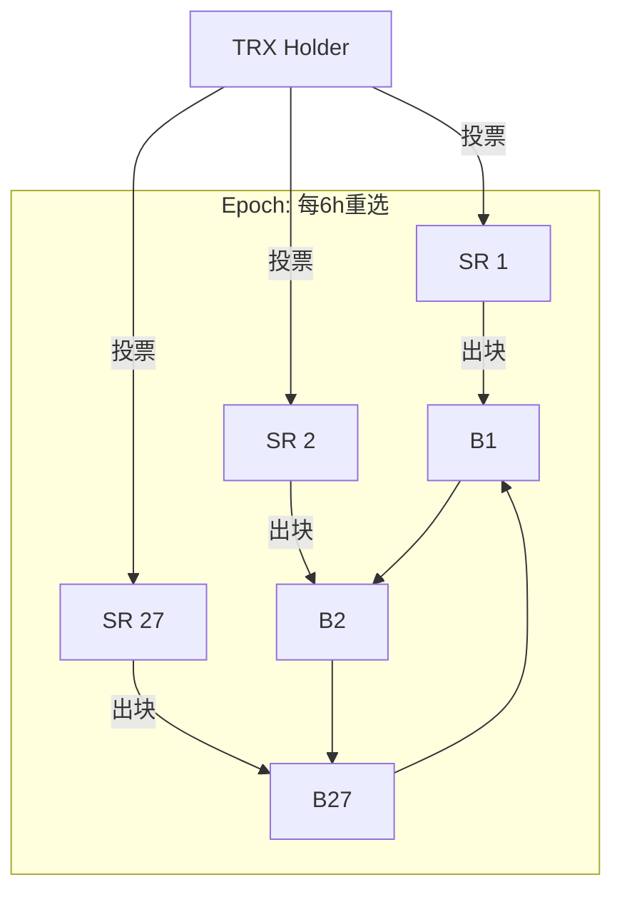

# Tron

> **TL;DR**：Tron 由孙宇晨（Justin Sun）于 2017 年创立，初期是以太坊 ERC-20 代币（TRX），2018-06 主网 Odyssey 2.0 上线后切换到独立链。技术底座是 **3 层架构（Storage / Core / Application）** + **DPoS（Delegated PoS）共识**：全体 TRX 持有者投票选出 **27 Super Representatives（SR，超级代表）** 轮流出块、3s 一块、块内完成确定性。虚拟机 **TVM（Tron Virtual Machine）** 字节码与 Solidity 语法与 EVM 近乎 1:1 兼容，方便以太坊合约迁移。最独特的是 **Bandwidth / Energy 资源模型**：用户质押 TRX（2022 年后 Stake 2.0 引入）获取带宽（覆盖转账的字节开销）与能量（覆盖合约执行的 opcode 开销）——这让 **USDT 转账对用户几乎零成本**，使 Tron 成为 USDT-TRC20 的最大流通网络（截至 2026-04 承载超 600 亿 USDT，占 Tether 总发行近 50%，Tronscan 数据）。代价是：27 SR 高度集中、监管风险持续累积（SEC 2023-03 起诉孙宇晨未决）。

---

## 1. 背景与动机

Tron 白皮书发布于 2017-09。创始人孙宇晨（Ripple 前大中华区首席代表、马云湖畔大学学员）的定位是"娱乐与内容分发区块链"，早期叙事围绕 BitTorrent 收购（2018-06）、高 TPS 与免费转账。技术上，Tron 最初照搬 Ethereum 账户模型 + EVM，但将共识改成 DPoS（借鉴 Steemit / EOS），以换取"数量级 TPS 提升与近 0 手续费"。

真正让 Tron 成为不可忽视的基础设施，是 **USDT 发行**：

- 2019-04 Tether 在 Tron 上线 USDT-TRC20；
- USDT-TRC20 因"免 gas（带宽/能量模型）+ 3s 到账 + 大型 CEX 默认支持"成为全球 C 端加密用户（尤其东南亚、非洲、拉美）跨境汇款的事实标准；
- 截至 2026-04，USDT-TRC20 在流通中的占比已经约 50%（[Tether Transparency](https://tether.to/en/transparency/)），高于 USDT-ERC20。

但 Tron 也因此承担了 **灰色产业与合规压力**：Chainalysis 多次将 USDT-TRC20 列为非法交易载体第一名（2023–2025 各版本跨境诈骗报告），迫使 Tether 在 2024-06 与 Tron 联合成立 T3 金融犯罪部门（与 TRM Labs 合作），定期冻结可疑地址。

## 2. 核心原理

### 2.1 DPoS 共识：形式化

Tron DPoS 源自 BitShares / EOS，核心流程：

- **候选节点**：任何节点抵押 9,999 TRX（"Apply for SR"）即可成为 27 SR 候选；
- **投票**：TRX 持有者（必须先"Freeze"或 Stake 2.0 中"Stake for Resource"）按自己冻结的 TRX 数量为任意节点投票，可多投；
- **选举**：每 6 小时（2 epochs）重新排名，**得票前 27 名成为活跃 SR**；第 28–127 名为 "SR Partner" 或 "SR Candidate"（有部分区块奖励但不出块）；
- **出块顺序**：27 SR 按确定性顺序轮流出块，每 SR 连续出 1 个块，共 27 块为一 round，持续 27 × 3 = 81 秒；
- **缺席惩罚**：SR 在一个 maintenance period（6h）内产出率 < 某阈值会损失信誉、影响下一期投票。

**终局性**：
- **SR Solidification**：当一个 block 被 **≥ 18 个不同 SR** 确认（即经过 18 × 3 = 54 秒），视为"固化"（solidified），不可逆；
- 不同于 BFT 的数学终局，Tron 依赖 **经济终局 + 诚实 SR 多数** 假设。

### 2.2 与 EOS / BSC 的 DPoS 差异

| 维度 | Tron | EOS | BSC (PoSA) |
|---|---|---|---|
| 出块节点 | 27 SR | 21 BP | 21 Cabinet + 3 Candidate |
| 投票间隔 | 6h maintenance | 每 126 块 | 每日 |
| 投票权重 | 冻结 TRX 数量 | Staked EOS | Staked BNB |
| Slashing | 弱（仅信誉惩罚）| 弱 | 强（200 BNB + jail）|

### 2.3 Bandwidth / Energy 资源模型

Tron 独创 "**资源代替 gas**" 的设计：

- **Bandwidth（带宽）**：每笔交易消耗字节数对应的带宽。每账户每天免费获得 600 bandwidth（`FreeNet`），转账约 250 bandwidth/次，所以普通用户每天可 **免费转账 2 笔**。不足部分可：
  1. **Stake TRX for Bandwidth**（质押 TRX 获得按比例分配的带宽配额）；
  2. 直接按 burn TRX 方式支付（每 byte = 1000 SUN，10^-3 TRX）。

- **Energy（能量）**：合约执行（EVM opcode）消耗。普通转账不消耗 Energy，只有合约调用（如 USDT-TRC20.transfer）消耗。用户可：
  1. **Stake TRX for Energy**（Stake 2.0 后独立维度）；
  2. 直接 burn TRX（typical USDT 转账 ~27 TRX 以 burn 方式 ≈ 3–7 USD）。

- **Stake 2.0（2022-10 激活）**：
  - 解耦带宽与能量，可分别质押；
  - 引入 **资源租赁市场**（能量租赁），散户可从做市商租 10 分钟 Energy 完成一次 USDT 转账；
  - 冻结解锁从 3 天降至实时；
  - Unstake 后 14 天冷却期。

这让 Tron 的 USDT 转账实际体验成为：**有能量的用户（含 CEX 热钱包）→ 转账完全免费**；**没能量的用户 → 从 feee.io 等租赁市场支付 1–2 TRX 租 Energy**。经济体验远优于 Ethereum ERC-20 的 5–30 美元 gas。

### 2.4 TVM：EVM 兼容与差异

TVM 字节码 99% 兼容 EVM，兼容 Solidity 0.5.x–0.8.x；差异：

- **Gas 改为 Energy**，每 opcode 消耗不同，由 SR 投票定价；
- **Address 前缀**：Base58 编码（以 `T` 开头），链上存储为 21 字节（前缀 0x41 + 20 字节地址），与 EVM 的 0x 地址数学等价；
- **系统合约**：TRC-10（原生代币，非合约）、TRC-20（合约代币，等同 ERC-20）、TRC-721/1155；
- **合约间调用**：CALL 与 CALLCODE 行为与 EVM 一致，但 Gas 栈上限差异；
- **预编译**：Tron 增加了 `batchvalidatesign`、`validatemultisign` 等适配 multisig 的预编译。

### 2.5 3 层架构（白皮书原文）

- **Storage Layer（存储层）**：区块数据 + 状态，持久化到 LevelDB（官方 java-tron）；
- **Core Layer（核心层）**：共识（DPoS）、账户模型、TVM、合约引擎；
- **Application Layer（应用层）**：钱包 SDK、DApp、智能合约生态。

### 2.6 参数与常量

| 参数 | 值 | 可治理 |
|---|---|---|
| 出块时间 | 3 s | SR 委员会投票 |
| Super Representatives | 27 | 硬编码 |
| SR Partners | 27–127 | 硬编码 |
| Maintenance Period | 6 h | SR 投票 |
| Block Solidification | 18 confirmations ≈ 54 s | 硬编码（BFT-like）|
| FreeNet 每日免费带宽 | 600 | 可治理 |
| 最低 SR 注册抵押 | 9,999 TRX | 可治理 |
| TRX 总供给 | ~104 亿（2024 后无定期销毁，稍通胀）| |

### 2.7 失败模式

- **SR 集中**：27 SR 中长期由 Tron Foundation 系、Binance、Huobi 等占多数。如果 ≥ 10 SR 合谋可延迟出块（影响 liveness），≥ 19 SR 合谋可双花（影响 safety）。
- **冻结 TRX 攻击**：低流通下对 27 SR 席位的竞选可被少量巨鲸主导。
- **合规冻结**：USDT-TRC20 合约本身允许 Tether 冻结任意地址（[USDT 合约代码](https://tronscan.org/#/contract/TR7NHqjeKQxGTCi8q8ZY4pL8otSzgjLj6t/code)），这不是链的技术风险但对用户是事实的中心化风险。

### 2.8 图示



## 3. 架构剖析

### 3.1 分层视图

`tronprotocol/java-tron`（Java 实现）节点内部：

1. **Net Layer**：基于 Netty 的 P2P，协议 TronProtos（protobuf）；
2. **Db Layer**：LevelDB + 自研 Store 接口；
3. **Consensus Layer**：`consensus/dpos`；
4. **Actuator Layer**：Tx 类型分派到 actuator（Transfer、Freeze、Vote、TriggerSmartContract 等）；
5. **VM Layer**：TVM 执行；
6. **API Layer**：gRPC + HTTP REST + JSON-RPC（2021 年新增以适配 MetaMask 类钱包）。

### 3.2 核心模块清单（对应 `tronprotocol/java-tron`）

| 模块 | 目录 | 职责 | 可替换性 |
|---|---|---|---|
| 共识 | `consensus/src/main/java/org/tron/consensus/` | DPoS + Solidification | 低 |
| Actuator | `actuator/` | Tx 类型处理器 | 中 |
| TVM | `chainbase/src/main/java/org/tron/core/vm/` | EVM fork | 低 |
| P2P | `framework/src/main/java/org/tron/core/net/` | 区块、交易传播 | 低 |
| Store | `chainbase/src/main/java/org/tron/core/db/` | LevelDB 持久化 | 中 |
| Plugin | `plugins/` | Event subscribe、Shielded TRC20 | 高 |
| API | `framework/.../services/` | gRPC/HTTP/JSON-RPC | 高 |
| Vote Counter | `consensus/.../dpos/DposTask.java` | 6h 维护期重选 | 低 |

### 3.3 数据流：一笔 USDT-TRC20 转账

1. 用户在 TronLink 钱包签名 `triggerSmartContract`（调用 USDT 合约 `transfer(to, amount)`）；
2. 钱包 SDK 预估 Energy（查本地 CostCalculator）；
3. 若用户无足够 Energy：或 burn TRX，或通过 Energy market 租借；
4. 广播 Tx 到 full node → gossip 到当前 SR；
5. SR 打包进下一个 block（3s 内）；
6. TVM 执行 `transfer`，修改 USDT 合约 storage；
7. Block 经 18 SR 确认固化（~54s），tx 视作不可逆；
8. Tether 在后台若检测到制裁清单地址可 `blacklist` 冻结。

### 3.4 客户端多样性

- **java-tron（Java, 官方主实现）**：99% SR 运行版本；
- **tronprotocol/wallet-cli（Java 命令行钱包）**；
- **go-tron**（社区维护，非 SR 使用）——存在但活跃度低。

实际上 Tron 是 **近乎单客户端链**，与 BSC / Hyperliquid 同属客户端多样性弱项。

### 3.5 扩展接口

- **gRPC API**（端口 50051）：Validator 间 & 专业开发；
- **Solidity Node（历史节点）端口 8091**：只读查询；
- **HTTP REST API**：`GET /wallet/getaccount`、`POST /wallet/triggersmartcontract`；
- **JSON-RPC（EVM 兼容）**：适配 MetaMask / web3.js（端口 8545 类）；
- **TronGrid**：官方 RPC 服务，带 API Key 限流。

## 4. 关键代码 / 实现细节

DPoS 出块判定（简化自 `consensus/src/.../DposTask.java`）：

```java
// 每 3 秒检查是否轮到本节点出块
public void produceBlock() {
    long now = System.currentTimeMillis();
    long slot = (now - genesisTime) / BLOCK_PRODUCED_INTERVAL;
    int pos = (int) (slot % activeWitnesses.size());
    ByteString witness = activeWitnesses.get(pos).getAddress();
    if (!witness.equals(myAddress)) return; // 非本轮
    // 从 mempool 取 tx，执行 Actuator，构造 block
    BlockCapsule block = generateBlock(witness, now);
    // 签名并广播
    block.sign(privateKey);
    broadcast(block);
}
```

USDT-TRC20 合约关键片段（与 ERC-20 一致，但地址 Base58 编码）：

```solidity
function transfer(address _to, uint _value) public returns (bool) {
    require(!isBlackListed[msg.sender]);  // 合规黑名单检查
    balances[msg.sender] -= _value;
    balances[_to]        += _value;
    emit Transfer(msg.sender, _to, _value);
    return true;
}
```

## 5. 演进与版本对比

| 时间 | 事件 | 影响 |
|---|---|---|
| 2017-09 | Tron 白皮书、ERC-20 TRX 众筹 | 立项 |
| 2018-06 | Odyssey 2.0 主网独立 | 脱离 ETH |
| 2018-07 | 收购 BitTorrent | 基础设施叙事 |
| 2019-04 | USDT-TRC20 上线 | 启动 USDT 第一引擎 |
| 2020-01 | SUN 网络（Tron DeFi 桥）、JustLend | DeFi 起步 |
| 2020-12 | JustLink 预言机 | 喂价基础设施 |
| 2022-05 | USDD 算法稳定币上线（后脱锚）| 争议 |
| 2022-10 | Stake 2.0 升级 | 资源模型重构 |
| 2023-03 | SEC 起诉孙宇晨和 Tron Foundation | 合规压力 |
| 2024-06 | 与 Tether 成立 T3 金融犯罪部门 | 冻结可疑地址 |
| 2025–2026 | USDT-TRC20 超越 ERC20 稳居流通第一 | 基础设施地位巩固 |

## 6. 实战示例：TronWeb 发一笔 USDT-TRC20

```bash
npm install tronweb
```

```javascript
const TronWeb = require('tronweb');
const tronWeb = new TronWeb({
  fullHost: 'https://api.trongrid.io',
  privateKey: process.env.PK
});

const USDT = 'TR7NHqjeKQxGTCi8q8ZY4pL8otSzgjLj6t';
const to   = 'TXYZopYRdj2D9XRtbG411XZZ3kM5VkAeBf';

async function send() {
  const contract = await tronWeb.contract().at(USDT);
  const tx = await contract.transfer(to, 1_000_000).send({ feeLimit: 30_000_000 });
  console.log('tx hash:', tx);
  // 预期输出：tx hash: 0xabcdef...（64 hex chars）
}
send();
```

## 7. 安全与已知攻击

### 7.1 2023-03 SEC 起诉（合规事件）

SEC 指控 Tron Foundation、BitTorrent、孙宇晨操纵 TRX/BTT 市场、未注册证券销售、向名人支付推广费用。案件至今未结，但已在美国对 Tron 形成长期合规阴影——**许多美国 DeFi 协议与托管商不支持 TRX**。

### 7.2 2022-05 USDD 脱锚

USDD（Decentralized USD）是 Tron 版本算法稳定币，设计类似 UST。UST 崩盘后 USDD 也一度脱锚至 0.93 美元，但 Tron DAO Reserve 动用储备（BTC/USDC）护盘避免归零。事件说明算法稳定币在 Tron 生态同样脆弱。USDD 目前保留运营但占比微小。

### 7.3 2024 合规冻结事件

T3 单元在 2024 年冻结 > 1 亿美元的 USDT-TRC20（反欺诈、反洗钱）。对用户的启示：**USDT-TRC20 不是抗审查资产**。

### 7.4 理论攻击面：SR 集中

若 ≥ 19 SR 合谋，可产生双花区块。从历史数据看，Binance/Huobi 类交易所 SR 出镜率高，学术界曾多次发文（[Liu et al., DPoS Security Analysis](https://arxiv.org/)）指出 DPoS 系链实际去中心化度远低于 PoW/PoS 链。

### 7.5 Energy 市场前端钓鱼

2024 年出现伪装 "feee.io" 的钓鱼网站，用户租能量时签了恶意 TRC-20 `approve` → 被批量盗取 USDT。解决方案：钱包对 `approve` 大额调用强制二次确认。

## 8. 与同类方案对比

| 维度 | Tron | BSC | EOS | Solana |
|---|---|---|---|---|
| 共识 | DPoS（27 SR）| PoSA（21）| DPoS（21 BP）| PoH + TowerBFT（1000+）|
| 出块 | 3 s | 3 s | 0.5 s | 0.4 s |
| 终局性 | ~54 s（18 conf）| ~7.5 s（FF）| ~2 s | ~12 s |
| Gas 模型 | Bandwidth + Energy | gwei | CPU/NET 质押 | 固定 lamport |
| EVM 兼容 | ✅（TVM）| ✅ | ❌（EOS-VM/WASM）| ❌（SVM）|
| USDT 流通 | ~600 亿（第一）| ~50 亿 | 几乎零 | ~50 亿 |
| 合规压力 | 高（SEC 诉讼中）| 中（Binance 罚款后缓和）| 低 | 中 |
| 去中心化度 | 低（27）| 低（21）| 低（21）| 中（1000+，但一客户端）|

权衡：Tron 以极度中心化的共识换取极低转账成本，这在东南亚/拉美灰色/合法汇款用途上占据事实地位；Solana 在去中心化指标上胜出但 USDT 流通远不及。

## 9. 延伸阅读

- **官方文档**：
  - [Tron Developer Hub](https://developers.tron.network)
  - [Protocol Documentation (EN)](https://tronprotocol.github.io/documentation-en/)
  - [TIP List](https://github.com/tronprotocol/tips)
- **核心仓库**：
  - [tronprotocol/java-tron](https://github.com/tronprotocol/java-tron)
  - [tronprotocol/wallet-cli](https://github.com/tronprotocol/wallet-cli)
- **权威研究**：
  - [Messari: State of Tron](https://messari.io/research)
  - [Chainalysis 年度 Crypto Crime Report](https://www.chainalysis.com/reports/)（含 USDT-TRC20 分析）
  - [DefiLlama Tron chain](https://defillama.com/chain/Tron)
- **博客**：
  - [Tether Transparency](https://tether.to/en/transparency/)
  - [登链社区 Tron 专栏](https://learnblockchain.cn)
- **视频**：
  - HTX Research Tron Ecosystem（YouTube）
  - 币世界 Tron 深度（B 站）
- **相关 TIP**：TIP-3（TRC-10）、TIP-20（TRC-20）、TIP-127（MetaMask JSON-RPC）、TIP-467（Stake 2.0）。

## 10. 术语表

| 术语 | 英文 | 释义 |
|---|---|---|
| SR | Super Representative | Tron 的 27 出块节点 |
| SR Partner | SR Partner | 第 28–127 的候选节点 |
| TRX | TRX | Tron 原生代币 |
| TRC-10 | TRC-10 | 原生系统代币（非合约）|
| TRC-20 | TRC-20 | 合约代币，等同 ERC-20 |
| TVM | Tron Virtual Machine | EVM 兼容虚拟机 |
| Bandwidth | Bandwidth | 转账消耗的字节资源 |
| Energy | Energy | 合约调用消耗的计算资源 |
| Stake 2.0 | Stake 2.0 | 2022-10 升级的资源质押模型 |
| Maintenance Period | Maintenance Period | 每 6 小时的 SR 重选周期 |
| Solidified Block | Solidified Block | 经 18 SR 确认的不可逆区块 |
| USDT-TRC20 | USDT-TRC20 | Tron 链上的 USDT 版本 |
| T3 | T3 Financial Crime Unit | Tether+Tron+TRM Labs 合规单位 |

---

*Last verified: 2026-04-22*
