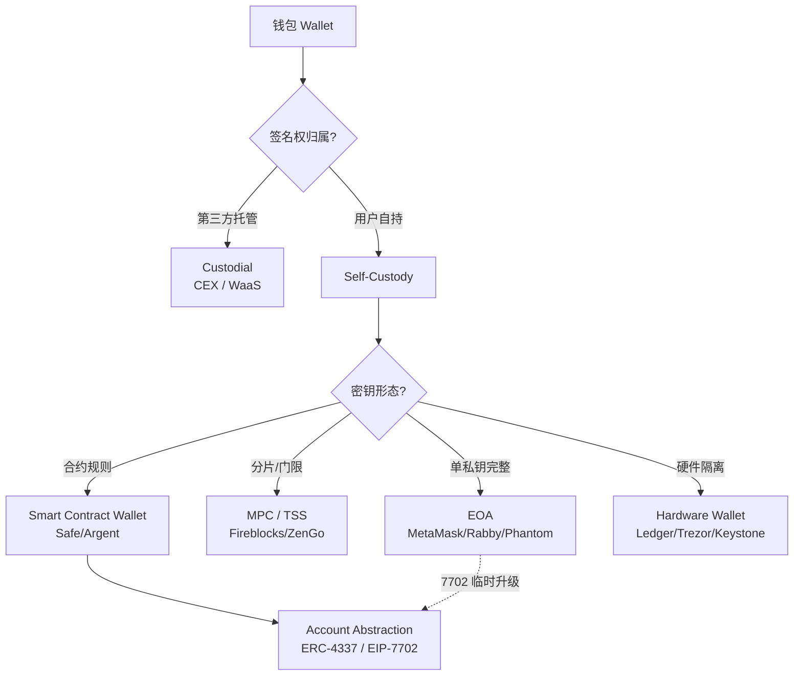

# 钱包层总览（Wallet Overview）

> **TL;DR**：Web3 钱包的本质是 **密钥管理器 + 交易签名器 + RPC 客户端 + 权限仲裁面板**，而不是"放币的容器"。链上资产始终存在链上；钱包真正持有的是 **操纵这些资产的授权（签名权）**。按 **信任模型** 可分 5 类：**托管钱包（Custodial）**、**自托管 EOA**、**MPC / TSS**、**智能合约钱包（SCW）**、**硬件钱包（HW）**。2024–2026 随 EIP-4337（Account Abstraction）成熟与 EIP-7702（Pectra，2025-05）激活，EOA 与 SCW 边界被打破，形成 **"EOA 可临时升级为合约账户"** 的混合模型。选型核心三维：**谁持有签名权（Who holds keys）** / **签名权可恢复性（Recoverability）** / **交互灵活度（Programmability & UX）**。

---

## 1. 背景与动机

中本聪 2009 年在 Bitcoin 创世时给出的"钱包"是 `wallet.dat` 文件——一组本地存储的 secp256k1 私钥加上 UTXO 索引。此后 15 年间，"钱包"语义经历四次重构：

1. **文件时代（2009–2012）**：Bitcoin Core、Electrum，用户直接管理私钥文件，备份靠手抄 WIF。
2. **确定性钱包（2012–2017）**：BIP32/39/44 引入 12/24 词助记词（Mnemonic）+ 分层派生路径，一次备份覆盖全部账户。Ledger（2014）、Trezor（2014）推出首批硬件钱包。
3. **以太坊 EOA 时代（2015–2022）**：MetaMask（2016-07）把钱包搬进浏览器扩展；智能合约钱包雏形 Gnosis Multisig（2017）、Argent（2018）带来 **合约即账户**。
4. **AA / MPC 并起（2022 至今）**：EIP-4337（2023-03 主网）将 UserOp、Bundler、Paymaster、EntryPoint 标准化；MPC 钱包（Fireblocks/BitGo/Coinbase WaaS）凭借"无助记词"体验迅速吞食机构市场；2025-05 Pectra 激活 EIP-7702，EOA 可在单笔交易周期内"戴上合约外壳"。

根本驱动力在于：**私钥是人类无法记忆、遗失即永久丢失的 256 bit 随机数**。围绕它需要解决三对矛盾：**易用 vs 安全**、**自主 vs 可恢复**、**灵活 vs 成本**。不同方案在这三轴上各有取舍，没有绝对的最优。

## 2. 核心原理

### 2.1 形式化定义：钱包作为签名预言机

把钱包抽象为函数 `Sign : (sk, msg) → σ`，则五种钱包类型的差别在于 **私钥 sk 的分布形态** 与 **签名权限策略** `Π`：

```
Wallet := (KeyShape, AuthPolicy, RecoveryPolicy, Interface)
KeyShape       ∈ { singleKey, shamirShard, tssShare, contractRule, noneKey-sessionKey }
AuthPolicy     ∈ { sigEq(sk), mOfN, threshold(t,n), EVM-bytecode, SGX-attest }
RecoveryPolicy ∈ { mnemonicBackup, guardianSet, companyKYC, socialRecovery, multiLocFactors }
Interface      ∈ { EOA-RPC, ERC-4337 UserOp, WalletConnect, Hardware-USB/BLE, RPC-Custodian }
```

状态转移：对每个待授权意图 `Intent = (domain, chainId, calldata, value)`，钱包输出 `Σ(Intent) ∈ {Approve, Deny, Delegate}`。**钱包不是单纯的密钥容器，而是一个 "策略执行引擎"**——这是理解 MPC、SCW、AA 本质差异的起点。

### 2.2 核心密码学原语

| 原语 | 用途 | 曲线 / 参数 |
| --- | --- | --- |
| 非对称签名 | 交易授权 | secp256k1（ETH/BTC）、ed25519（SOL/Sui）、BLS12-381（ETH validator）|
| KDF | 派生子密钥、助记词加盐 | PBKDF2-SHA512（BIP39），scrypt（Ethereum keystore）|
| 对称加密 | 私钥落盘加密 | AES-128-CTR + HMAC-SHA256（Ethereum keystore v3）|
| 阈值签名 TSS | MPC 钱包核心 | GG18/GG20（ECDSA 门限）、FROST（Schnorr/EdDSA 门限）|
| 零知识证明 | 社交恢复、密钥找回 | Groth16 / PLONK（Sismo、zkLogin）|

选择 secp256k1 而非 NIST P-256 的原因：Koblitz 曲线参数可验证无后门（中本聪在 2008 年白皮书落地时的关键选择），且与 BTC 生态对齐。以太坊在 2024 年 EIP-7212 开始支持 P-256 预编译，为 WebAuthn / Passkey 钱包铺路。

### 2.3 子机制拆解

1. **熵源与助记词生成（Entropy → Mnemonic）**：从 CSPRNG 取 128–256 bit 熵 → 附加 checksum → 映射 BIP39 wordlist（2048 词、11 bit 每词）→ 12/24 词短语。熵必须 ≥ 128 bit，否则 2026 年 GPU 算力可暴力破解。
2. **种子派生（Mnemonic → Seed → Master Key）**：`seed = PBKDF2(mnemonic, "mnemonic" || passphrase, 2048, 64 bytes)`；`master = HMAC-SHA512("Bitcoin seed", seed)` → `(sk_master, chain_code)`。passphrase 即 BIP39 的"第 25 词"，支持 **plausible deniability**（同一助记词配不同 passphrase 派生不同钱包）。
3. **分层派生（HD Derivation）**：BIP32 定义 `CKD_priv(k_parent, c_parent, i)`；BIP44 规定路径 `m / 44' / coin_type' / account' / change / address_index`。硬化派生（`i ≥ 2^31`）防止父 xpub 泄露后子密钥可回推。
4. **签名策略（Authorization）**：EOA 为 `sk → σ` 单路径；SCW 执行合约字节码 `isValidSignature(hash, sig)` (EIP-1271)；MPC 将 `sk` 切为 n 片，t 片协同签名，**原始 sk 从未在任何一方内存中完整出现**。
5. **恢复路径（Recovery）**：助记词手抄、Shamir（SLIP-39）、Guardian 社交恢复、Company KYC（Coinbase WaaS）、Passkey + iCloud 同步（iOS 16+）。每种恢复路径对应不同的 **信任锚**。
6. **交互协议（Interface）**：dApp ↔ 钱包的桥由 **EIP-1193**（Provider API）、**WalletConnect v2**（多链 session + JSON-RPC over Relay）、**EIP-6963**（多钱包共存发现）标准化。

### 2.4 关键参数

| 参数 | 典型值 | 出处 / 可治理 |
| --- | --- | --- |
| 助记词熵 | 128 / 160 / 192 / 224 / 256 bit | BIP39，固定 |
| PBKDF2 迭代 | 2048 | BIP39，固定 |
| secp256k1 曲线阶 n | 2^256 − 2^32 − 977 | SEC 2，固定 |
| Ethereum keystore scrypt N | 262144 | Web3 Secret Storage v3 |
| AA EntryPoint verificationGasLimit | ≤ 10M | EIP-4337，可升级合约参数 |
| EIP-7702 授权 tuple | `(chainId, address, nonce, y, r, s)` | EIP-7702，Pectra 固定 |

### 2.5 边界条件与失败模式

- **熵源弱**：2013 年 Android `SecureRandom` bug 导致部分 BTC 被盗；任何调用 `Math.random()` 派生的钱包都应视为已被攻破。
- **助记词侧信道**：纸质备份拍照上传云盘（iCloud/Google Photos）= 自毁。
- **Rogue-Key 攻击**：MPC 中若协议未使用 Proof-of-Possession，攻击者可选择性构造公钥绕过门限（BLS 聚合签名的经典陷阱）。
- **合约钱包可升级代理被劫持**：Parity Multisig 2017 事件（~51.4 万 ETH 被永久冻结）。
- **盲签**：硬件钱包无法解析复杂 calldata 时"盲签"批准恶意 swap（Ledger Connect Kit 2023-12 供应链攻击即利用此）。

### 2.6 分类全景图（Mermaid）



## 3. 架构剖析

### 3.1 分层视图

自顶向下，一款现代 Web3 钱包由 5 层构成：

```
┌────────────────────────────────────────────────┐
│  UI / UX 层     │ 资产面板 / DApp 浏览器 / 签名审阅页
├────────────────────────────────────────────────┤
│  策略 / 策略引擎 │ Tx 预览、模拟、风险评分、Gas 估算
├────────────────────────────────────────────────┤
│  密钥管理层     │ Vault / Keystore / TSS / SE / Enclave
├────────────────────────────────────────────────┤
│  协议适配层     │ EIP-1193, WalletConnect, ERC-4337 客户端
├────────────────────────────────────────────────┤
│  网络 / RPC 层  │ Infura/Alchemy/QuickNode, mempool, 索引器
└────────────────────────────────────────────────┘
```

### 3.2 核心模块清单

| 模块 | 职责 | 依赖 | 可替换性 | 代表实现 |
| --- | --- | --- | --- | --- |
| KeyVault | 私钥加密存储 | OS Keychain / Secure Enclave | 中（抽象接口） | MetaMask `app/scripts/lib/encryptor.ts` |
| AccountManager | HD 派生、多账户管理 | ethers/web3.js, bip32 lib | 高 | Rabby `apps/keyring-eth-hd` |
| TransactionController | 构造、模拟、签名、广播 | RPC Provider | 中 | MetaMask `app/scripts/controllers/transactions` |
| RPC Provider | 与节点通信 | Infura / self-host | 高 | MetaMask `network-controller` |
| DApp Gateway | EIP-1193 注入 / WC 协议 | content-script, postMessage | 中 | `@walletconnect/web3wallet` |
| RiskEngine | 钓鱼域名、黑名单、Tx 模拟 | Blockaid / GoPlus / TxPro | 高 | Rabby `rabby-api/src/blockaid` |
| Signer | 最终签名执行 | KeyVault / HW / TSS | 低（安全核心） | Safe `@safe-global/protocol-kit` |
| Bundler Client | ERC-4337 UserOp 发送 | Pimlico/StackUp/Alchemy | 高 | `userop.js` |
| Paymaster Client | Gas 代付授权 | Paymaster 服务商 | 高 | `@pimlico/permissionless` |
| Recovery Module | 助记词/Guardian/Passkey | 场景化 | 低 | Argent `contracts/modules/RecoveryManager.sol` |

### 3.3 端到端数据流：一次 swap 的全生命周期

以 MetaMask 在 Uniswap 做一次 ETH→USDC swap 为例：

1. **DApp 请求**：Uniswap 前端调用 `window.ethereum.request({ method: "eth_sendTransaction", params: [tx] })`。耗时 < 1ms（inpage script ↔ content script postMessage）。
2. **策略过滤**：MetaMask `TransactionController` 调用 Blockaid 模拟，返回 `simulation.balanceChanges` 和 `risk: benign|warn|malicious`。耗时 100–600 ms。
3. **用户审阅**：UI 展示金额、目标合约、Gas、风险标签；用户点击 Confirm。
4. **密钥解锁**：从 KeyVault 解密 `sk`（仅存活于当前调用栈），调用 ethers `wallet.signTransaction(tx)`，secp256k1 签名耗时 < 5 ms。
5. **广播**：通过 `eth_sendRawTransaction` 发送到 Infura；mempool 到上链 12–60 s。
6. **终局**：等待 2–12 个 block；MetaMask 订阅 `newBlockHeaders`，匹配 txHash 后更新 UI。
7. **可观测点**：每步在 `metamask-composable-controllers` 的 `TransactionStatus` 枚举中有状态字段：`unapproved → approved → signed → submitted → confirmed|failed`。

### 3.4 客户端多样性 / 参考实现

| 类型 | 实现 | 语言 | 开源 | 市占（2026-Q1 估计） |
| --- | --- | --- | --- | --- |
| EOA 浏览器扩展 | MetaMask | TypeScript | 是 | ~45% EVM 活跃用户 |
| EOA 安全增强 | Rabby | TypeScript | 是 | ~8% |
| 多链移动 | Trust Wallet | Kotlin/Swift | 部分 | ~15%（含 BNB 生态）|
| Solana 生态 | Phantom | TypeScript/Swift | 否 | Solana >50% |
| 合约钱包 | Safe{Wallet} | Solidity + TS | 是 | 机构事实标准（锁仓 >$100B）|
| 合约钱包 SDK | Argent / Braavos | Cairo/Solidity | 是 | Starknet 主流 |
| MPC | Fireblocks | 闭源 | 否 | 机构托管 >$6T 累计 |
| MPC 消费级 | ZenGo / Coinbase WaaS | 混合 | 部分 | 快速增长 |
| 硬件 | Ledger / Trezor / Keystone | C / Rust | 部分 | 硬件累计出货 >2000 万 |

**风险多样性**：若 MetaMask 出现 0-day 漏洞，Rabby / Rainbow 可立即接管——这正是"客户端多样性"的价值。反之 Ledger 2023-12 Connect Kit 供应链攻击殃及所有接入它的 dApp，说明 **基础设施级组件集中是系统性风险**。

### 3.5 扩展 / 互操作接口

- **EIP-1193**：浏览器注入 `window.ethereum`，定义 `request / on / removeListener`。
- **EIP-6963**：Multi Injected Provider Discovery，解决多钱包共存冲突。
- **WalletConnect v2**：基于 WebSocket + libp2p Relay，QR Code pairing → session 对话，支持多链 namespace。
- **ERC-4337**：UserOp → EntryPoint → Bundler → 上链。
- **EIP-1271**：合约账户的 `isValidSignature(hash, sig)` 标准。
- **EIP-712**：结构化数据签名。
- **EIP-5792**：`wallet_sendCalls` / `wallet_getCapabilities`，dApp 感知钱包能力（Atomic Batch、Paymaster）。
- **EIP-7702**：EOA 临时委托至合约代码。

版本兼容策略：以太坊 EIP 遵循"Last-Call → Final → Deprecated"生命周期；钱包一般在 Final 后 1–2 个 hardfork 窗口引入。

## 4. 关键代码 / 实现细节

MetaMask 私钥加密与解锁的核心（简化自 `metamask-extension/app/scripts/lib/encryptor.ts`，commit 主干 `v11.x`，2025-10）：

```typescript
// 1. 派生加密 key: PBKDF2-SHA256, 900k 轮, salt 16 bytes
async function keyFromPassword(password: string, salt: Uint8Array): Promise<CryptoKey> {
  const keyMaterial = await crypto.subtle.importKey(
    "raw", encoder.encode(password), { name: "PBKDF2" }, false, ["deriveKey"],
  );
  return crypto.subtle.deriveKey(
    { name: "PBKDF2", salt, iterations: 900_000, hash: "SHA-256" },
    keyMaterial,
    { name: "AES-GCM", length: 256 },
    false, ["encrypt", "decrypt"],
  );
}

// 2. 加密 vault
export async function encrypt(password: string, data: unknown): Promise<string> {
  const salt = crypto.getRandomValues(new Uint8Array(16));
  const iv   = crypto.getRandomValues(new Uint8Array(16));
  const key  = await keyFromPassword(password, salt);
  const cipher = await crypto.subtle.encrypt(
    { name: "AES-GCM", iv },
    key,
    encoder.encode(JSON.stringify(data)),
  );
  return JSON.stringify({
    data: bytesToBase64(new Uint8Array(cipher)),
    iv:   bytesToBase64(iv),
    salt: bytesToBase64(salt),
  });
}
```

> 注：MetaMask 2024-05 把 PBKDF2 从 10k 轮升到 900k（OWASP 2023 推荐）。Vault 解密仅在用户输入密码的瞬间发生，明文私钥立即写回 Redux in-memory；扩展锁定 / 15 分钟空闲即清零。

## 5. 演进与版本对比

| 世代 | 代表 | 年份 | 关键特征 | 信任锚 |
| --- | --- | --- | --- | --- |
| V1 文件钱包 | Bitcoin Core wallet.dat | 2009 | 随机密钥池 | 文件备份 |
| V2 HD 钱包 | Electrum / Mycelium | 2013 | BIP32/39/44 | 助记词 |
| V3 EOA 浏览器 | MetaMask | 2016 | 注入 provider | 助记词 + 密码 |
| V4 硬件 | Ledger Nano S | 2016 | SE 隔离 | PIN + 种子卡 |
| V5 合约钱包 | Gnosis Safe | 2018 | 多签、模块 | 多方签名 |
| V6 MPC | Fireblocks | 2019 | TSS、无单点 | 机构 KMS |
| V7 AA (4337) | Stackup/Biconomy | 2023 | UserOp、Paymaster | 合约逻辑 |
| V8 EOA+AA 混合 | Pectra EIP-7702 | 2025 | 授权委托 | EOA 签名 |

## 6. 实战示例：选型决策树

```
你的身份？
├─ 交易所用户 / 合规优先   → Custodial（Coinbase、Binance）
├─ 机构 / DAO Treasury     → Safe + MPC（Fireblocks 管 signer key）
├─ DeFi 重度玩家           → Rabby 或 MetaMask + Ledger
├─ 新手 / 社交优先         → Argent X / Zerion（社交恢复）
├─ 长期囤币 (>$50k)        → Keystone / Ledger（air-gapped + passphrase）
└─ 开发者                   → Foundry anvil + test mnemonic
```

## 7. 安全与已知攻击

| 事件 | 年份 | 根因 | 教训 |
| --- | --- | --- | --- |
| Android SecureRandom | 2013 | 熵源弱 | 助记词必须来自硬件 RNG |
| Parity Multisig Freeze | 2017 | library selfdestruct | 代理合约需不可摧毁基 |
| Ledger Recover 风波 | 2023-05 | 助记词分片交第三方（争议）| 用户对"可恢复硬件"持怀疑 |
| Ledger Connect Kit 投毒 | 2023-12 | 前员工 npm token 泄露 | 钱包连接 SDK 需锁版本 + SRI |
| Atomic Wallet hack | 2023-06 | 服务端漏洞 | 闭源钱包不可审计 |
| Safe + 朝鲜 Lazarus | 2024–2026 | UI 层钓鱼、盲签 | 多签需硬件 + 结构化签名 |

## 8. 与同类方案对比

| 维度 | Custodial | EOA | MPC | SCW | Hardware |
| --- | --- | --- | --- | --- | --- |
| 私钥持有 | 交易所 | 用户设备 | 分片多方 | 合约规则 | 安全芯片 |
| 可恢复 | 客服 | 助记词 | Company / 社交 | Guardian | 助记词 |
| 抗审查 | ✗ | ✓ | 取决于设计 | ✓ | ✓ |
| Gas 成本 | 无 | 低 | 低 | 高（部署+执行）| 低 |
| 用户学习 | 极低 | 高 | 中 | 中 | 高 |
| 合规友好 | ✓ | ✗ | ✓ | 取决于规则 | ✗ |
| 链支持 | 广 | 全 | 广 | 受限 EVM | 广 |
| 典型 | Coinbase | MetaMask | Fireblocks | Safe | Ledger |

## 9. 延伸阅读

- **官方规范**：BIP32/39/44、EIP-1193、EIP-4337、EIP-7702、EIP-6963、EIP-5792。
- **论文**：Gennaro-Goldfeder "Fast Multiparty Threshold ECDSA"（GG18/20）；Komlo-Goldberg "FROST: Flexible Round-Optimized Schnorr Threshold"。
- **博客**：Vitalik "Why we need wide adoption of social recovery wallets"（2021-01-11）；a16z "Decentralization of Wallets"（2023）。
- **课程**：learnblockchain.cn 钱包系列；Patrick Collins YouTube "AA from scratch"。

## 10. 术语表

| 术语 | 英文 | 释义 |
| --- | --- | --- |
| EOA | Externally Owned Account | 由私钥直接控制的账户 |
| SCW | Smart Contract Wallet | 由合约字节码定义授权逻辑的账户 |
| MPC | Multi-Party Computation | 多方协同而不泄露输入的计算 |
| TSS | Threshold Signature Scheme | 门限签名，t-of-n 协同出签 |
| HD | Hierarchical Deterministic | 分层确定性（BIP32）|
| AA | Account Abstraction | 账户抽象，ERC-4337 / EIP-7702 |
| SE | Secure Element | 硬件安全芯片（如 ST33、CC EAL5+）|
| WaaS | Wallet-as-a-Service | 钱包即服务，如 Fireblocks / Coinbase WaaS |
| Guardian | — | 社交恢复的担保方 |
| Paymaster | — | ERC-4337 中代付 Gas 的合约 |

---

*Last verified: 2026-04-22*
