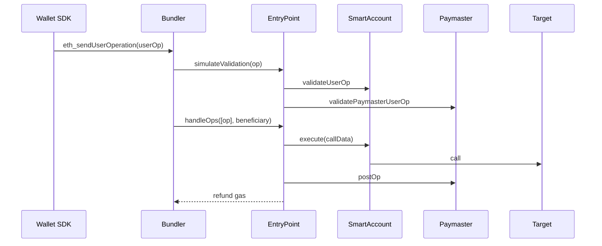

# 账户抽象（Account Abstraction, EIP-4337 + EIP-7702）

> **TL;DR**：**账户抽象（AA）** 让"账户"不再被 secp256k1 私钥锁死。**EIP-4337（2023-03 主网）** 在协议外通过 **UserOperation mempool + Bundler + EntryPoint 合约** 实现，不改 Ethereum 共识；任何 DApp 可像用普通 tx 一样用合约钱包。**EIP-7702（2025-05 Pectra）** 在协议内加一个 **`SET_CODE` tx 类型**，允许 EOA 在单笔 / 一段时间内"委托"到合约代码——EOA 瞬间拥有 AA 能力（Batch、Paymaster、Session Key、Social Recovery）。两者 **互补而非替代**：4337 适合原生合约钱包 + Gas 代付复杂场景，7702 适合让 10 亿 existing EOA 一夜获得 AA 体验。核心角色：**UserOp, EntryPoint, Bundler, Paymaster, Factory, Aggregator**。

---

## 1. 背景与动机

Vitalik 早在 2016 年就倡导 Account Abstraction（EIP-86 / EIP-2938），但改共识层阻力巨大：需升级所有节点且直接影响 Gas 计量。2021 Yoav Weiss + Dror Tirosh + Vitalik 等提出 **EIP-4337**：**不改共识**，通过 UserOp 伪交易 + 链上 EntryPoint 合约实现全部 AA 能力。2023-03-01 以太坊主网部署 EntryPoint v0.6；2024 v0.7 简化且升级。

但 4337 的缺口：**现有 EOA（超 2 亿活跃地址）无法享受 AA，必须迁移到新合约地址**。这在 UX 与资产迁移层几乎不可行。**EIP-7702**（Vitalik 2024-05 提案）在 EOA 层叠加 `authorization_list`，让 EOA 在一笔 tx 的执行上下文里"读取"某合约的 code 作为自身 code；在 2025-05 Pectra 升级激活。

## 2. 核心原理

### 2.1 形式化定义：UserOperation 与 EntryPoint

**UserOperation (4337 v0.7)**：伪交易结构，33 字段，提交到独立 mempool。

```
UserOp = (
  sender, nonce, factory, factoryData,
  callData, callGasLimit, verificationGasLimit, preVerificationGas,
  maxFeePerGas, maxPriorityFeePerGas,
  paymasterAndData (paymaster,paymasterVerificationGasLimit,paymasterPostOpGasLimit,paymasterData),
  signature
)
```

**EntryPoint.handleOps(UserOp[] ops, address beneficiary)** 生命周期：

1. **verificationPhase**：对每笔 UserOp
   - `sender.validateUserOp(op, opHash, missingFunds)` → 校验签名 + nonce + 支付前置 Gas。
   - 若设 paymaster → `paymaster.validatePaymasterUserOp(...)`。
2. **executionPhase**：逐笔 `sender.execute(op.callData)`，收 Gas 费给 beneficiary（Bundler）。
3. `paymaster.postOp(...)` 处理余款。

状态转移保证：**验证阶段不得访问他人状态、不得依赖外部调用**（除例外白名单 opcode），以防 mempool DoS。

**EIP-7702 authorization list**：

```
AuthTuple = (chainId, address (delegate contract), nonce, y, r, s)  // secp256k1 签名
SET_CODE_tx.authorizationList = [AuthTuple₁, ...]
```

执行时：对每个 AuthTuple，若签名合法，则 `ACCOUNT[authority].code = 0xEF0100 || delegate`（委托前缀）。此后对该 EOA 的 CALL 会读 delegate 合约代码。授权在链上持续，直到下一次 7702 tx 覆盖或清除（`delegate = 0x0`）。

### 2.2 关键算法 / 数据结构

**EntryPoint v0.7 存储**：

```solidity
mapping(address => DepositInfo) public deposits;  // pre-fund gas
mapping(address => mapping(uint192 => uint256)) public nonceSequence;  // 2D nonce
```

2D nonce `(key, seq)`：allowing parallel nonces for concurrent UserOps from same sender（不同 key 互不冲突）。

**Bundler mempool 规则**（ERC-7562）：

- 验证阶段调用 `SLOAD/SSTORE/CALL` 限白名单 slot；**禁用 BLOCK_HASH / TIMESTAMP** 等易变 opcode。
- 每地址最多 4 笔未打包 UserOp（staking 解锁）。
- 若 `validateUserOp` 消耗 Gas > verificationGasLimit → 丢弃。

**Paymaster 模式**：

- **ERC20 Paymaster**：代付 ETH，用户从中扣 USDC。
- **Verifying Paymaster**：中心化后端签 `sig(userOpHash)`，供链上验。
- **Self Pay**：sender 直接 pre-fund。

### 2.3 子机制拆解

1. **EntryPoint**：唯一信任根，合约单例；所有 AA 流经它，便于审计。
2. **Bundler**：运营 UserOp mempool、打包调 `handleOps`，利润来自 Gas 差。
3. **Paymaster**：代付 Gas，允许免 ETH 钱包、法币付费、订阅模型。
4. **Factory**：第一次 UserOp 内部署 sender 合约（counterfactual address via CREATE2）。
5. **Aggregator (optional)**：批量验签的聚合合约（如 BLS 签名聚合以降 Gas）。
6. **Sender Contract**：实际账户合约，实现 `validateUserOp + execute`。
7. **EIP-7702 授权**：EOA 提交 SET_CODE tx，把自己的 code 指向某 delegate；之后任何 tx 经过该 EOA 都执行 delegate 字节码。

### 2.4 参数与常量

| 参数 | 值 | 出处 |
| --- | --- | --- |
| EntryPoint v0.6 地址 | 0x5FF137D4b0FDCD49DcA30c7CF57E578a026d2789 | 4337 |
| EntryPoint v0.7 地址 | 0x0000000071727De22E5E9d8BAf0edAc6f37da032 | 4337 |
| verificationGasLimit 上限 | ≤ 10M | bundler 惯例 |
| preVerificationGas | ~21k + calldata | 覆盖 L1 data cost |
| Bundler stake (ERC-7562) | 1 ETH unstake 1 d | DoS 抑制 |
| 7702 delegate prefix | 0xEF0100 | EIP-7702 |
| 7702 authority nonce | 严格自增 | EIP-7702 |

### 2.5 边界条件与失败模式

- **Mempool DoS**：恶意 UserOp 在验证阶段消耗大量 Gas 然后 revert → bundler 亏损。ERC-7562 规则 + staking 缓解。
- **Paymaster 挤兑**：Verifying paymaster 签名泄露 → 瞬间烧光 deposit。
- **EntryPoint 升级**：v0.6 → v0.7 需钱包迁移；不同版本互不兼容。
- **EIP-7702 phishing**：用户签一次 7702 授权把 EOA 委托给 drainer 合约 → 永久破产（直到再次覆盖）。**签名语义必须严格展示**。
- **7702 state clash**：delegate 合约的 `SLOAD` 读到的是 EOA 地址的存储槽，可能与先前 delegate 冲突；建议用 ERC-7201 namespaced storage。
- **Sender gas refund**：v0.6 退款机制曾引发 sandwich；v0.7 已修。

### 2.6 Mermaid：UserOp 生命周期



## 3. 架构剖析

### 3.1 分层视图

```
┌─────────────────────────────────────────────┐
│ Wallet UI / SDK (permissionless.js, userop) │
├─────────────────────────────────────────────┤
│ UserOp Mempool (off-chain, alt-mempool)     │
├─────────────────────────────────────────────┤
│ Bundler (EOA) → 打包 handleOps              │
├─────────────────────────────────────────────┤
│ EntryPoint 合约（信任根）                    │
├─────────────────────────────────────────────┤
│ Smart Account (Safe 4337 / Kernel / SimpleAccount) │
├─────────────────────────────────────────────┤
│ Paymaster (代付 Gas)                         │
└─────────────────────────────────────────────┘
```

### 3.2 核心模块清单

| 模块 | 职责 | 源码 (eth-infinitism/account-abstraction) | 依赖 | 可替换性 |
| --- | --- | --- | --- | --- |
| EntryPoint | 校验+执行 | `contracts/core/EntryPoint.sol` | — | 低（单例）|
| SenderCreator | 部署 sender | `contracts/core/SenderCreator.sol` | factory | 中 |
| StakeManager | bundler/paymaster 抵押 | `contracts/core/StakeManager.sol` | — | 中 |
| NonceManager | 2D nonce | `contracts/core/NonceManager.sol` | — | 低 |
| SimpleAccount | 参考实现 | `contracts/samples/SimpleAccount.sol` | — | 高 |
| SimpleAccountFactory | CREATE2 部署 | `contracts/samples/SimpleAccountFactory.sol` | — | 高 |
| TokenPaymaster | ERC20 付费 | `contracts/samples/TokenPaymaster.sol` | Uniswap | 高 |
| VerifyingPaymaster | 后端签 | `contracts/samples/VerifyingPaymaster.sol` | 服务端 | 高 |
| BLSAccount | 聚合签名 | `contracts/samples/bls/BLSAccount.sol` | BLS lib | 高 |
| 7702Delegate | Pectra 委托逻辑 | Safe / MetaMask Smart Account | — | 高 |

### 3.3 数据流：首次 Swap 用 Gas 代付

1. 用户在 MetaMask Smart Account（4337 帐）点 Swap，SDK 构造 `callData = router.swap(...)`。
2. SDK 调 Paymaster 服务（如 Pimlico）获 `paymasterData`（签名 + 限额）。
3. SDK 打包 UserOp，`sender.signMessage(opHash)` → signature。
4. 发 Bundler（Alchemy/Pimlico/StackUp），Bundler 做 `simulateValidation`，通过后入池。
5. Bundler 收集若干 UserOp，调用 `EntryPoint.handleOps`。
6. EntryPoint 先 verify 每个 UserOp（调 sender + paymaster），然后 execute。
7. Sender 执行 Swap，Target（Uniswap Router）返回结果；Paymaster 内部扣 USDC、回补 ETH。
8. Bundler 拿 Gas 差价作为 MEV。

### 3.4 客户端多样性

| 类型 | 实现 | 备注 |
| --- | --- | --- |
| EntryPoint | eth-infinitism / EF 维护 | 单例 v0.6、v0.7、v0.8 (draft) |
| Bundler (Go) | Stackup "Bundler" | 开源 |
| Bundler (TS) | Voltaire / Skandha | 多实现 |
| Bundler SaaS | Pimlico, Alchemy, Biconomy | 高可用 |
| Smart Account | Safe + 4337 Module | 兼容 Safe 多签 |
| Smart Account | ZeroDev Kernel | 模块化 |
| Smart Account | Biconomy Nexus | ERC-7579 实现 |
| Smart Account | Alchemy LightAccount | 简洁 |
| SDK | permissionless.js (viem) | 主流 |
| SDK | userop.js / bundler-sdk | 替代 |

### 3.5 扩展 / 互操作接口

- **RPC**：`eth_sendUserOperation`, `eth_estimateUserOperationGas`, `eth_getUserOperationByHash`, `eth_supportedEntryPoints`。
- **ERC-7562**：bundler mempool 规则规范。
- **ERC-7702**：EOA 委托 tx 类型。
- **ERC-5792**：dApp 用 `wallet_sendCalls` 无感知 AA。
- **ERC-7677**：Paymaster Web Service 标准。
- **ERC-7579 / ERC-6900**：模块化账户。
- **ERC-7521 (Intent)**：UserOp → Intent 升级提案。

## 4. 关键代码 / 实现细节

EntryPoint v0.7 `innerHandleOp`（摘自 `contracts/core/EntryPoint.sol`，简化）：

```solidity
function innerHandleOp(
    bytes memory callData,
    UserOpInfo memory opInfo,
    bytes calldata context
) external returns (uint256 actualGasCost) {
    uint256 preGas = gasleft();
    MemoryUserOp memory mUserOp = opInfo.mUserOp;

    // 1. 执行 callData，允许失败
    bool success;
    bytes memory result;
    if (callData.length > 0) {
        (success, result) = address(mUserOp.sender).call{gas: mUserOp.callGasLimit}(callData);
        if (!success) {
            emit UserOperationRevertReason(opInfo.userOpHash, mUserOp.sender, mUserOp.nonce, result);
        }
    }

    // 2. 收 Gas
    uint256 actualGas = preGas - gasleft() + opInfo.preOpGas;
    return _postExecution(
        success ? IPaymaster.PostOpMode.opSucceeded : IPaymaster.PostOpMode.opReverted,
        opInfo, context, actualGas
    );
}
```

> 省略 StakeManager、事件、refund 细节。v0.7 把 v0.6 里"打包收 Gas 再退款"改为 `deposit - actualCost` 直扣。

EIP-7702 最小 delegate（示意）：

```solidity
// 部署后可被 EOA 通过 7702 委托
contract Delegate7702 {
    function execute(Call[] calldata calls) external {
        require(msg.sender == address(this), "only self");   // msg.sender = EOA = address(this)
        for (uint i; i<calls.length; i++) {
            (bool ok,) = calls[i].to.call{value:calls[i].value}(calls[i].data);
            require(ok);
        }
    }
}
```

授权后调用 `EOA.execute([...])` 即可原子批量；`msg.sender` = EOA 本身。

## 5. 演进与版本对比

| 版本 | 年份 | 关键 |
| --- | --- | --- |
| EIP-86 | 2016 | 最早 AA 提案（未实施）|
| EIP-2938 | 2020 | 共识层 AA（弃用）|
| EIP-3074 | 2021 | AUTH/AUTHCALL opcode（被 7702 取代）|
| EIP-4337 v0.6 | 2023-03 | 首批主网 |
| EIP-4337 v0.7 | 2024 | Paymaster 分离、2D nonce、Gas 优化 |
| ERC-7579 | 2024 | 模块化账户 |
| EIP-7702 | 2025-05 (Pectra) | EOA 委托 |
| EIP-4337 v0.8 (草案) | 2026 | Intent、聚合优化 |

## 6. 实战示例

用 `permissionless.js` 发一笔 4337 UserOp：

```typescript
import { createSmartAccountClient } from "permissionless";
import { signerToSimpleSmartAccount } from "permissionless/accounts";

const account = await signerToSimpleSmartAccount(publicClient, {
  signer: eoa,
  entryPoint: "0x0000000071727De22E5E9d8BAf0edAc6f37da032",
  factoryAddress: "0x91E60e0613810449d098b0b5Ec8b51A0FE8c8985",
});
const smartClient = createSmartAccountClient({
  account,
  bundlerTransport: http(pimlicoUrl),
  middleware: { gasPrice: async () => (await bundler.getUserOperationGasPrice()).fast },
});
const txHash = await smartClient.sendTransaction({
  to: "0xUniswapRouter",
  data,
  value: 0n,
});
```

## 7. 安全与已知攻击

| 事件 | 年份 | 影响 |
| --- | --- | --- |
| 4337 Bundler DoS PoC | 2023 | 引入 ERC-7562 规则 |
| Paymaster 签名重放 | 2023 | Verifying Paymaster 需 chainId + op nonce |
| Unbound gas in validate | 2023 | 规则限制 SLOAD 槽位 |
| 7702 delegate phishing | 2025+ | 钱包必须解析并人类可读展示委托 |
| Safe Bybit 事件后 | 2025-02 | 促进 AA 标准签名审阅 |
| Pimlico 曾暂停 chainId | 2024 | 客服流程补救 |

## 8. 与同类方案对比

| 维度 | EIP-4337 | EIP-7702 | SCW 原生 | EOA |
| --- | --- | --- | --- | --- |
| 改共识 | ✗ | ✓（新 tx type）| ✗ | 基础 |
| 适用用户 | 新账户 / SCW | 现有 EOA | 新账户 | — |
| Gas 代付 | ✓ Paymaster | ✓ | 需搭 Paymaster | ✗ |
| Batch | ✓ | ✓ | ✓ | ✗ |
| Session Key | ✓ | ✓ | ✓ | ✗ |
| 社交恢复 | ✓ | ✓（委托到 Recovery 合约）| ✓ | ✗ |
| 复杂度 | 高 | 中 | 中 | 低 |

## 9. 延伸阅读

- **规范**：EIP-4337、EIP-7702、ERC-7562、ERC-7677、ERC-7579、ERC-6900。
- **论文/博客**：Vitalik "Three Transitions"；Yoav Weiss "ERC-4337 Deep Dive"；a16z "The State of AA in 2025"。
- **源码**：eth-infinitism/account-abstraction；safe-global/safe-modules 4337；zerodevapp/kernel。
- **工具**：Pimlico, Stackup, Alchemy AA, Biconomy, Candide, ZeroDev。
- **视频**：Patrick Collins Cyfrin "ERC-4337 Explained"。

## 10. 术语表

| 术语 | 英文 | 释义 |
| --- | --- | --- |
| AA | Account Abstraction | 账户抽象 |
| UserOp | UserOperation | 4337 伪交易 |
| EntryPoint | — | 核心入口合约 |
| Bundler | — | 打包 UserOp 的 EOA |
| Paymaster | — | 代付 Gas 的合约 |
| Factory | — | 部署 sender 的工厂 |
| Counterfactual | — | 未部署但已可计算地址 |
| Session Key | — | 限定范围的临时 key |
| 7702 Authorization | — | EOA 指定 delegate 的签名授权 |

---

*Last verified: 2026-04-22*
