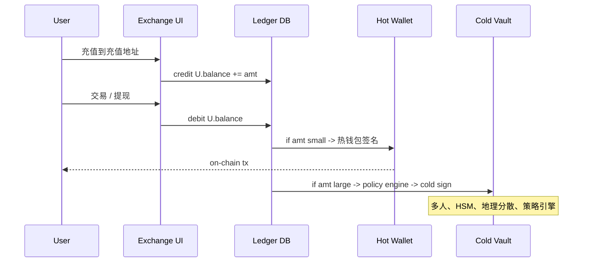

# 托管钱包（Custodial Wallet / 交易所钱包）

> **TL;DR**：托管钱包指 **私钥由第三方机构代管** 的钱包：用户在平台开设账户、资产在链上归属机构钱包地址、用户持有的是 IOU 式记账凭证。代表机构是 Coinbase、Binance、OKX、Kraken、Gemini 等中心化交易所（CEX）以及 BitGo、Fidelity Digital Assets、Anchorage 等专业 Qualified Custodian。核心架构是 **冷热分离 + 多签 + 审计 + 保险**；当代最佳实践是 Fireblocks/BitGo 级的 **MPC-TSS + SGX + 策略引擎**。FTX（2022-11 倒闭）后，"**Proof-of-Reserves（PoR）储备证明**"（基于 Merkle Tree + ZK 负债证明）成为交易所必答题，但 **Proof-of-Liability** 仍是未解难题。

---

## 1. 背景与动机

Bitcoin 最初的愿景是 "Be Your Own Bank"，但 **99% 的散户无法安全保管助记词**：Chainalysis 估计约 20% 的 BTC 永久丢失。2010 Mt.Gox 作为第一批交易所托管用户币；2014 Mt.Gox 监守自盗丢失 85 万 BTC 是加密托管史最黑暗一页。Coinbase（2012 创立）率先在美国将 98% 资产放入 **air-gapped cold storage**，并购买 $320M 保险。2018 前后涌现 **机构级托管** 细分赛道（BitGo、Anchorage、Fireblocks）。2020-07 美国 OCC 发布 Interpretive Letter 1170，允许国家银行托管加密资产，打开华尔街大门。

## 2. 核心原理

### 2.1 形式化：托管钱包的信任委托

用户 U 与托管方 C 的关系：

```
U --signs account agreement--> C
U.asset_on_chain_balance = 0
C.vault_address.balance  += deposit(U, amount)
C.off_chain_ledger[U]    += amount   // IOU
withdraw(U, amount):
    require C.off_chain_ledger[U] >= amount
    C.sign_tx(vault_sk, {to: U, amt})
```

信任假设：C **诚实 + 偿付力 + 抗审查**。Mt.Gox/FTX 证明这三者缺一则溃。监管工具包：**segregated accounts（客户资金隔离）**、**qualified custodian license**、**SOC 2 Type II 审计**、**保险**。

### 2.2 关键数据结构

- **Hot Wallet**：7×24 在线，支撑日常提币，通常 < 5% 总资产。
- **Warm Wallet**：延时审核型，用于再平衡。
- **Cold Wallet**：air-gapped，占 ≥ 95%；HSM/SE 存 sk 或 MPC 分片。
- **Policy Engine**：规则（白名单地址、单日限额、时间窗、多人审批）。
- **Ledger DB**：内部复式记账，通常基于 Postgres / 自研分布式账本。
- **AML/KYT Pipeline**：Chainalysis/TRM Labs 实时扫描入金地址。

### 2.3 子机制拆解

1. **冷热分离**：链上主储备在多签冷钱包，每日补液到热钱包（threshold-based refill）。
2. **多签 / MPC 签名**：机构级冷签通常 3-of-5 或 4-of-7 多签，geo-distributed；现代方案用 MPC-TSS 把 sk 分布在不同 HSM，单点被攻破不出币。
3. **交易策略引擎**：Fireblocks Workflow 支持"白名单 + 限额 + 双人复核 + 时间锁"。
4. **风险监控**：地址标签（Chainalysis KYT）、Tornado Cash 等 mixer 入金即冻结。
5. **审计与 Proof-of-Reserves**：定期第三方 attestation（Grant Thornton, Mazars, Armanino）+ 自愿 PoR。
6. **保险与备付**：商业保险（Lloyd's, AON）+ 自有 SAFU（Binance：$1B）。

### 2.4 参数与常量

| 参数 | 典型值 | 说明 |
| --- | --- | --- |
| 热钱包占比 | 2%–5% | 余额随用户提币活跃度波动 |
| 冷钱包多签 | 3/5 或 4/7 | 物理分离的 HSM |
| 多签 geo 分布 | ≥ 3 国 | 防扣押 |
| 审计频率 | 季度 / 月度 | SOC 2 / PoR |
| 提币延时 | 5 min–24 h | 大额触发人审 |
| 白名单冷却 | 24 h | 新地址锁定期 |
| SAFU 基金 | Binance ≥ $1B | 事故先赔 |

### 2.5 边界条件与失败模式

- **Rug Pull**：FTX 2022 把客户资金借给 Alameda，负债 > 资产。
- **内鬼**：Mt.Gox CEO Mark Karpelès、Quadriga CEO Gerald Cotten（"死亡"带走密钥）。
- **热钱包被盗**：Bitfinex 2016（~12 万 BTC）、Coincheck 2018 NEM（$530M）。
- **政府扣押**：制裁导致客户资产冻结（SDN list）。
- **脱钩挤兑**：PoR 只能证资产 ≥ 某快照，无法证资产 ≥ 负债；挤兑时揭露穿仓。
- **Oracle / PoR 造假**：Deloitte 退出 Binance 审计、Mazars 2022-12 暂停加密审计后，PoR 权威性下降。

### 2.6 Mermaid：托管资金流



## 3. 架构剖析

### 3.1 分层视图

```
┌─────────────────────────────────────────────┐
│  UI / App  (Web / iOS / Android / API)      │
├─────────────────────────────────────────────┤
│  Matching / Trading Engine (CEX 独有)        │
├─────────────────────────────────────────────┤
│  Ledger / Accounting (Postgres / Kafka)     │
├─────────────────────────────────────────────┤
│  Wallet Service (Hot/Warm/Cold 抽象)         │
├─────────────────────────────────────────────┤
│  Signer Layer (HSM / MPC-TSS / SE)          │
├─────────────────────────────────────────────┤
│  Blockchain Adapters (BTC/ETH/SOL ...)      │
└─────────────────────────────────────────────┘
```

### 3.2 核心模块清单

| 模块 | 职责 | 典型实现 | 依赖 | 可替换性 |
| --- | --- | --- | --- | --- |
| Deposit Detector | 监听链上充值并入账 | 自研或 Alchemy Webhook | Node RPC | 高 |
| Ledger Service | 内部复式记账 | Postgres + double-entry | RDBMS | 中 |
| Withdrawal Queue | 提币请求编排 | Kafka + state machine | — | 高 |
| Policy Engine | 交易策略决策 | Fireblocks TAP / 自研 | Ledger, KYT | 中 |
| KYT / AML | 地址标签扫描 | Chainalysis KYT, TRM Labs | 外部 API | 高 |
| Hot Signer | 高频小额签名 | HSM 或 TSS MPC | SE / cloud HSM | 中 |
| Cold Signer | 冷签多签 | 多地 HSM + air-gap | 物理隔离 | 低 |
| Re-balancer | Hot ↔ Cold 余额调度 | 定时任务 | Policy Engine | 高 |
| PoR Reporter | 定期生成储备证明 | 自研 + Merkle | 审计 | 高 |
| Insurance Ops | 索赔/赔付流程 | 法务 + 保险公司 | 律师 | 低 |

### 3.3 数据流：用户提币一条路径

1. 用户 Web 提交 withdraw(amount, addr)，2FA 通过。
2. API 落单至 WithdrawalQueue，状态 `pending_kyt`。
3. KYT 扫描目标地址；命中 OFAC/Tornado → 人工审核。
4. Policy Engine 判定：小额→Hot；大额→Cold。耗时 < 5 s 或 > 30 min（冷签）。
5. Hot Signer 从 HSM 取出 sk，构造 tx，广播至 ETH/BTC 节点。
6. Deposit Detector（对立角度）监听广播成功后回写 Ledger `confirmed`。
7. 客户邮件 + 短信通知。

可观测性：每一步写入 audit log；监管报告、回测、PoR 生成均查询此日志。

### 3.4 客户端多样性 / 参考实现

| 类型 | 厂商 | 侧重 |
| --- | --- | --- |
| CEX | Coinbase / Binance / OKX / Kraken / Bitstamp | 交易 + 托管 |
| Qualified Custodian | Coinbase Custody / BitGo / Anchorage Digital / Fidelity Digital Assets | 机构冷储 |
| Tech Platform | Fireblocks / Copper / Ceffu（Binance Custody）| SaaS 级托管栈 |
| Bank-grade | BNY Mellon / State Street | 银行托管探路 |
| Stablecoin Issuer | Circle / Paxos | 储备金托管 |

Fireblocks 披露 2024 年累计处理交易 $6T+，客户 2000+。BitGo 2023 收购 Heightline 以扩张 API。

### 3.5 扩展 / 互操作接口

- **REST API**：用户账户、提币、历史。
- **FIX / WebSocket**：机构交易通道。
- **Travel Rule**：FATF R16 跨所 KYC 数据传输（Notabene, Sygna, Shyft）。
- **Proof-of-Reserves**：Merkle Tree 负债根，ZK 范围证明（zkPoR, Summa）。
- **Custody API**：BitGo v2 API, Fireblocks API 允许 DeFi 直投。

## 4. 关键代码 / 实现细节

Binance PoR 使用 Merkle Sum Tree（概念伪代码，参考 Binance 开源仓库 `binance-exchange/proof-of-reserves-v2`）：

```python
# 叶子：对每个用户 uid 的 (balance_btc, balance_eth, ...)
def build_merkle_sum_tree(leaves):
    # leaf = H(uid || balances) 并携带 sum
    nodes = [(h_leaf(u, b), b) for u, b in leaves]
    while len(nodes) > 1:
        next_level = []
        for i in range(0, len(nodes), 2):
            l, r = nodes[i], nodes[i+1] if i+1 < len(nodes) else nodes[i]
            parent_sum = vector_add(l[1], r[1])
            parent_hash = H(l[0] || r[0] || parent_sum)
            next_level.append((parent_hash, parent_sum))
        nodes = next_level
    return nodes[0]  # (root_hash, total_liability)

# 用户可拿 audit_path 验证自己余额被计入 total_liability
# 总负债 = root.sum；资产则需链上地址签名证明所有权
# 不足之处：无法证明"没有隐藏负债"
```

## 5. 演进与版本对比

| 世代 | 代表 | 年份 | 关键 | 问题 |
| --- | --- | --- | --- | --- |
| V1 单热钱包 | 早期 Mt.Gox | 2010 | 易用 | 监守自盗 |
| V2 冷热分离 | Coinbase | 2014 | 95% 冷储 | 冷签成本 |
| V3 多签 | Xapo | 2015 | geo 多签 | 协调复杂 |
| V4 HSM+Policy | BitGo | 2017 | HSM+策略 | 仍中心化 |
| V5 MPC | Fireblocks | 2019 | TSS | 协议复杂 |
| V6 PoR 公开 | Kraken | 2014/2022 | Merkle | 无负债证 |
| V7 ZK-PoR | Binance zkPoR | 2023 | 零知识负债 | 主流化中 |

## 6. 实战示例

Coinbase Custody 流程：

```
1. 机构开户 → KYC/AML (4–6 周)
2. 签订托管协议 (SOC1/SOC2 报告)
3. 充币到专属隔离地址
4. 提现需 2FA + 视频面签 + 24–48h 冷签延时
5. 年费约 0.5% AUM，出金 fee 单笔
```

PoR 查询（Binance）：登录官网 → "Proof of Reserves" → 输入 uid，验证 Merkle Path 是否根 hash 匹配。

## 7. 安全与已知攻击

| 事件 | 年份 | 损失 | 根因 |
| --- | --- | --- | --- |
| Mt.Gox | 2014 | 85 万 BTC | 监守自盗 + 内部 bug |
| Bitfinex | 2016 | 12 万 BTC | 热钱包多签被攻 |
| Coincheck | 2018 | $530M NEM | 热钱包无冷存 |
| QuadrigaCX | 2019 | $190M | CEO 死亡/独管密钥 |
| FTX | 2022-11 | $8B | 挪用客户金 |
| DMM Bitcoin | 2024-05 | $305M | 热钱包私钥泄露 |
| WazirX | 2024-07 | $230M | Liminal MPC 接口漏洞 |

## 8. 与同类方案对比

| 维度 | CEX | Qualified Custodian | MPC-as-a-Service | Self-Custody |
| --- | --- | --- | --- | --- |
| 私钥 | 机构 | 机构 | 机构+用户 | 用户 |
| 适合 | 交易 | 长期冷藏 | DeFi 机构 | 真 Web3 |
| 保险 | 部分 | 强 | 强 | 无 |
| 抗审查 | 弱 | 弱 | 弱 | 强 |
| UX | 极好 | 企业级 | 企业级 | 学习曲线 |

## 9. 延伸阅读

- **官方**：Coinbase Prime Custody 白皮书；BitGo Cold Storage 文档；Fireblocks MPC-CMP 论文（Lindell 2021）。
- **监管**：OCC Letter 1170；NYDFS Virtual Currency License；MiCA Title IV。
- **博客**：Nic Carter "Proof of Reserves" 系列；Paradigm "zkPoR"。
- **事件**：FTX bankruptcy docket（PACER）。

## 10. 术语表

| 术语 | 英文 | 释义 |
| --- | --- | --- |
| Hot Wallet | — | 在线热钱包 |
| Cold Wallet | — | 离线冷储 |
| HSM | Hardware Security Module | 硬件安全模块 |
| SAFU | Secure Asset Fund for Users | Binance 用户保险基金 |
| PoR | Proof of Reserves | 储备证明 |
| Travel Rule | FATF R16 | 跨所数据传输 |
| Qualified Custodian | — | 合规指定托管人 |
| SOC 2 | Service Organization Control | 审计标准 |

---

*Last verified: 2026-04-22*
