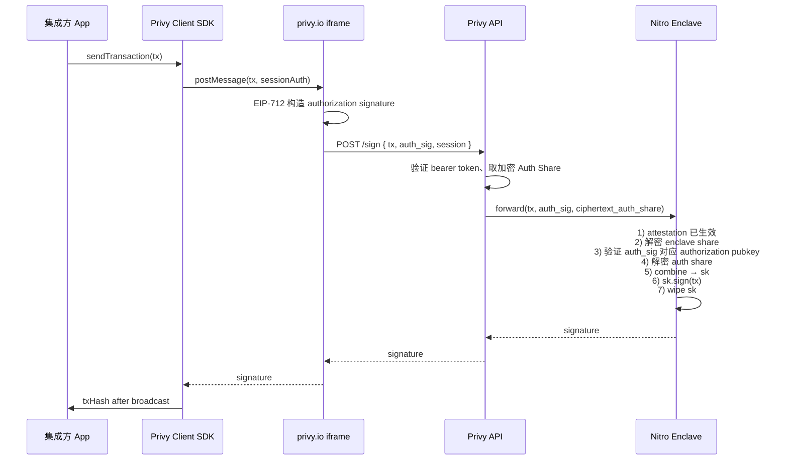

# 嵌入式钱包：Privy（Embedded Wallet）

> **TL;DR**：**Privy** 是最主流的"嵌入式钱包 / Wallet-as-a-Service"基础设施之一。它让开发者通过 SDK 在自家 App 内为用户"凭 email/社交账号一键开钱包"，而不要求用户安装 MetaMask 或记助记词。底层用 **Shamir 秘密分享（SSS，2-of-2 阈值）** 把 secp256k1/Ed25519 私钥切成两份：**Auth Share**（Privy 基础设施持有，凭用户认证凭据解密）与 **Enclave Share**（存于 **AWS Nitro Enclaves** TEE，只能在 enclave 内解密）。任意单 share 不泄露任何密钥信息；签名时两 share 在 TEE 内存里临时重建、签完即销毁。Privy **不持有可独立签名的密钥**，因此被归类为"非托管（non-custodial）"。2025-04 被 **Stripe 以约 $200M 收购**，之后 Stripe 的 crypto stack（稳定币收款、Tempo 链）全面采用 Privy 账户底座。本内容不构成投资建议。

---

## 1. 背景与动机

Web3 的新用户漏斗长期卡在"钱包安装 + 助记词抄写"这一步：Coinbase/Binance 的一键注册转化率能到 80%，而 MetaMask 首次安装转化率仅个位数。"**嵌入式钱包**（embedded wallet）"——也叫"wallet-as-a-service（WaaS）"——就是为了抹平这道鸿沟：

- 开发者像集成 Stripe Checkout 一样集成一段钱包 SDK，不再要求用户了解钱包概念。
- 用户用邮箱、Google、Apple、短信等"Web2 凭证"登录，服务端在后台为其自动创建 secp256k1/Ed25519 账户。
- 钱包在应用内显示为普通 UI 组件，与 App 视觉融合。
- 但钱包必须保持"**非托管（non-custodial）**"的可信承诺，否则就退化成中心化交易所账户。

这条赛道的典型竞争者（截至 2026-04）：**Privy、Magic、Dynamic、Web3Auth（now torus/openlogin）、Turnkey、thirdweb In-App Wallet、Coinbase Wallet-as-a-Service、Crossmint**。它们在"自托管的技术实现路径"上分道扬镳——有的走真 MPC 门限签名（Web3Auth）、有的走 TEE 集中持钥再用多层隔离弥补（Turnkey）、有的提供完整托管（Magic 的 Magic Link）。**Privy 选择的是 "SSS(2-of-2) + TEE" 的复合信任方案**：两把 share 分散在两个独立信任域，单一信任域失守不足以盗取密钥。

**企业背景要点**：Privy 由 Henri Stern、Asta Li（前 a16z）2021 年创立；2022 Founders Fund + Sequoia 领投；2024 Ribbit + Paradigm 跟投；**2025-04-24 Stripe 宣布以约 $200M 全资收购 Privy**（来源：Stripe 官方 newsroom、TechCrunch），保留其独立产品线并为 Stripe 的稳定币 acquiring 与 Tempo 链提供账户底座。至 2026-04，Privy 披露在集成 App 内创建的钱包数达到千万量级、覆盖数百家头部 consumer dApp（Friend.tech、Farcaster 客户端、Hyperliquid 前端、Blackbird 等）。

---

## 2. 核心原理

### 2.1 形式化：2-of-2 复合信任 = SSS × TEE

把一个嵌入式钱包账户 `W` 抽象为一个签名预言机：

```
W = (skdist, sign)

skdist  : sk  →  (share_auth, share_enclave)   // Shamir (2, 2) over GF(2^8)
sign    : (msg, share_auth, share_enclave) → sig
          其中 share_auth, share_enclave 必须同时满足
          "在 TEE 内存内短暂可见" 的约束
```

不变式：

- **I1 — 非求和知识**：单独持有 `share_auth` 或 `share_enclave` 的任一方，**关于 sk 的信息论不确定性 = 完整 sk 的不确定性**（SSS 在阈值未到达时的标准性质）。这是"非托管"声称的数学基础。
- **I2 — 重建的空间/时间边界**：`sk` 的重建只发生在 **AWS Nitro Enclave 的内存页** 内，且仅存在于一次 `sign(msg)` 调用的生命周期；enclave 无持久存储、无网络、无交互通道，因此 sk 不可能被导出或快照。
- **I3 — 授权链闭合**：TEE 不凭"来自 Privy 后端"就放行任何签名；它对每一次请求都要求携带 **authorization public key** 下签出的凭证（可以是 bearer token + EIP-712 signature），并与当前钱包绑定的策略做本地校验。

Privy 与"真 MPC 钱包"（GG18/GG20/FROST）的本质差异就藏在这里：**MPC 的 `sk` 从生成到使用从未存在于任何单一内存**，每次签名是多轮交互协议；**SSS+TEE 则允许 sk 在 TEE 内存中短暂重建**——它把"密钥从不整存"换成"整存时空被严格收紧到一个硬件隔离域"。对链上而言，Privy 产出的签名与 EOA 不可区分（依然是标准 secp256k1 / ECDSA），无需适配；对信任模型而言，用户需要信任 AWS Nitro 的硬件安全边界 + Privy 的运维。

### 2.2 Shamir 秘密分享（SSS）的密码学细节

Shamir 1979 年的经典方案思路：要把秘密 `s` 切成 n 个 share，任意 t 个可恢复：

1. 选一个 t−1 次多项式 `f(x) = s + a_1·x + a_2·x² + … + a_{t-1}·x^{t-1}`，`a_i` 取随机数。
2. 第 i 个 share 为 `(i, f(i))`，i ≠ 0。
3. 恢复时任选 t 个点用拉格朗日插值反解出 `f(0) = s`。

`privy-io/shamir-secret-sharing`（TypeScript 实现，v0.0.3）把这个方案落在 **`GF(2^8)` 伽罗瓦域** 上逐字节并行运行：

- `split(secret: Uint8Array, shares: number, threshold: number) → Uint8Array[]`
- `combine(shares: Uint8Array[]) → Uint8Array`
- 每个字节独立做一次 SSS，因此性能线性于密钥长度；32 字节私钥只需 32 次独立的 GF(2^8) 插值。
- 库零依赖、浏览器 & Node 都能跑，经过 **Cure53 与 Zellic 各一次独立审计**（审计报告公开在仓库 `audits/` 目录下）。

Privy 的参数是 **(2, 2)**——只有两份 share，缺一不可。这意味着 SSS 本身并没有带来"冗余容错"（3-of-5 那种多数容错），它只是把"一条密钥 = 一条 32 字节"变成"两条加密 share，分散到两个运维域"。**容错来自恢复机制**（见 §3.4），而非 SSS 的阈值。

### 2.3 Auth Share 与 Enclave Share 的角色定位

| Share | 持有方 | 加密方式 | 解密前提 |
| --- | --- | --- | --- |
| **Auth Share** | Privy API 基础设施 | 用一条与用户 auth 凭证绑定的对称密钥加密 | 用户当前会话合法（bearer token 有效、满足 authorization policy） |
| **Enclave Share** | AWS Nitro Enclaves | 由 TEE 自身生成的 enclave key 加密 | 只能在同一 enclave（measured boot + 正确 attestation）内解密 |

两种 share 的加密密钥存在于两个互斥的信任域中：

- 拿到 Privy 基础设施数据库 rowdump 也不能解 Auth Share（缺会话态 auth）。
- 拿到 Enclave Share 也没用（缺 enclave 内密钥）。
- 就算同时拿到两份加密 share，也必须诱导 enclave 本身去做解密+合并，而 enclave 的签名策略要求原始 authorization 签名。

官方架构文档原文："Both shares are required in order to generate signatures. Neither the auth share nor the enclave share in isolation provide any information or access to the wallet."

### 2.4 TEE 信任根：AWS Nitro Enclaves 的硬件边界

Privy 的服务端 enclave 选 AWS Nitro Enclaves（EC2 派生的轻量 VM 级 TEE），关键属性：

- **无持久存储**：enclave 运行期间没有磁盘，重启后任何内部状态归零。
- **无网络**：只能通过 vsock 与父 EC2 通信，无外部路由。
- **无交互 shell**：运维人员无法登入 enclave 内部。
- **measured boot + attestation**：每次 enclave 启动都会产出一份由 AWS 根证书签发的 attestation document，内含 PCR（Platform Configuration Register）值；Privy 的密钥签发组件只对"经过认证的构建哈希 + 认证的 attestation"授信。
- **独立构建管道**：官方文档强调 "build pipeline and enclave attestation are issued by separate hardened systems"——即生成 enclave 镜像的 CI 与验证 attestation 的 KMS 使用不同的硬件/账号域，防止单一内部人员同时控制两侧。

这套模型的核心抵抗是 **insider attack + infrastructure compromise**：即使一个 Privy 工程师拥有数据库 root 权限，他拿到的只有密文 share；无法在不触发 attestation 失败的情况下替换 enclave 逻辑偷跑 signing 操作。

### 2.5 关键参数与常量

| 参数 | 取值 | 说明 |
| --- | --- | --- |
| SSS 阈值 | (2, 2) | 两份 share，缺一不可 |
| SSS 域 | GF(2^8) | 字节级并行，任意长度秘密 |
| 签名算法 | secp256k1 / ECDSA（EVM）、Ed25519（Solana）等 | 原生链上兼容 |
| TEE | AWS Nitro Enclaves | 官方指定 |
| Enclave 重建时间 | 一次签名调用生命周期（~毫秒级） | 随签随销 |
| 密钥持久化 | 从不 | enclave 无磁盘 |
| 授权凭证 | bearer token + authorization signature | EIP-712 结构化 |
| 支持链 | Ethereum/EVM L2、Solana、Base、Tempo 等 | 多链同 UX |
| 开源组件 | shamir-secret-sharing | Apache-2.0 |
| 审计 | Cure53、Zellic、Doyensec | 公开报告 |
| 合规 | SOC2 Type I + Type II | — |

### 2.6 边界条件与失败模式

1. **Privy 基础设施下线** → 不影响资产所有权（share 仍在两方），但 App 内签名请求无法路由，用户暂时无法发起交易。Privy 承诺 "wallet export" 接口让用户能导出原始私钥（触发后 Auth Share 在 enclave 内与 Enclave Share 合成 sk 返还给用户），作为 exit channel。
2. **用户凭证被盗**（email/OAuth 身份提供商被钓鱼）→ 攻击者可冒充用户完成 auth，再通过合法 API 触发签名。**这是 Privy 信任模型里最现实的威胁面**：安全性上限等于身份提供商 + 用户设备的安全性。对此 Privy 提供可选的 **MFA、password share、passkey 绑定** 作为额外 factor。
3. **Privy 与 AWS 合谋** → 理论上可以签任意交易，但需要同时攻破 Privy auth 层 + 修改 enclave 镜像 + 骗过 attestation。破坏的是"独立信任域"假设，属于 catastrophic 事件。
4. **App 端 XSS** → 攻击者在 App 上下文构造伪造的 sendTransaction 请求，Privy 客户端仍会走合法签名路径——因此嵌入方 App 的前端安全是 Privy 信任边界的一部分。这是 Privy 推荐**关键签名走 iframe 隔离**（由 privy.io 域渲染）的原因：iframe 与 App 处于不同源，即使 App 被 XSS 也读不到 iframe 里的会话令牌。
5. **用户丢失 auth 通道**（email 服务关停、Google 账号锁定）→ 触发 **recovery**：通过 password share、passkey 或事先配置的 recovery email 重新生成 Auth Share。若未配置任何 recovery factor 且身份完全丢失，资产将不可访问（Privy 不持有独立恢复钥）。

### 2.7 Mermaid：一次签名的端到端授权流



---

## 3. 架构剖析

### 3.1 分层视图

```
┌─────────────────────────────────────────────────┐
│ 集成方 App（React / iOS / Android / Flutter）   │
├─────────────────────────────────────────────────┤
│ Privy Client SDK                                │
│  @privy-io/react-auth / swift-sdk / android-sdk │
├─────────────────────────────────────────────────┤
│ privy.io iframe（浏览器端）                     │
│  - session 会话令牌（同源隔离）                 │
│  - postMessage 通信                             │
├─────────────────────────────────────────────────┤
│ Privy API Gateway                               │
│  - 认证（email / OAuth / passkey / MFA）        │
│  - 加密 Auth Share 存储                         │
│  - authorization policy 校验                    │
├─────────────────────────────────────────────────┤
│ AWS Nitro Enclave 集群                          │
│  - 加密 Enclave Share                           │
│  - 解密 + 组合 + 签名 + 销毁                    │
│  - attestation / measured boot                  │
├─────────────────────────────────────────────────┤
│ 链上层（原生 EOA 或可选 Smart Wallet）          │
│  - Ethereum/EVM / Solana / Base / Tempo …       │
│  - 可叠加：Safe / Kernel / Biconomy / Alchemy / │
│    Coinbase Smart Wallet / Thirdweb             │
└─────────────────────────────────────────────────┘
```

### 3.2 核心模块清单

| 模块 | 开源/闭源 | 仓库或路径 | 职责 |
| --- | --- | --- | --- |
| `shamir-secret-sharing` | 开源 (Apache-2.0) | [`privy-io/shamir-secret-sharing`](https://github.com/privy-io/shamir-secret-sharing) v0.0.3 | 字节级 SSS split/combine，供客户端与 enclave 共用 |
| `@privy-io/react-auth` | 开源 npm | [`privy-io/privy-js`](https://github.com/privy-io/privy-js) | 浏览器端 React Provider、iframe 宿主、wagmi/viem 桥 |
| `@privy-io/server-auth` | 开源 npm | [`privy-io/privy-node`](https://github.com/privy-io/privy-node) | 服务器端 token 校验、server-wallet API 封装 |
| iOS / Android SDK | 闭源 | swift-sdk、android-sdk（npm/CocoaPods/Maven） | 原生 keychain 绑定、biometrics、passkey |
| Privy API Gateway | 闭源 | privy.io | 认证 + 加密 share 存储 + 策略校验 |
| Nitro Enclave image | 闭源（可 attestation 验证） | 部署在 AWS | 密钥重建 + 签名 + 审计日志 |
| Smart Wallet Adapters | 闭源（SDK 代码开源） | 同 `privy-js` | 绑定 Kernel/Safe/Biconomy/Alchemy/Coinbase SW |
| Recovery Service | 闭源 | privy.io/recovery | password share、passkey、社交恢复 |

### 3.3 数据流：端到端的一次 EVM 交易

1. 集成方 App 调用 `sendTransaction({ to, value, data })`（通过 wagmi / viem / ethers 的 Privy provider）。
2. Client SDK 组装 EIP-1559 交易；postMessage 到 **privy.io 域的 iframe**，附带当前会话 token（由 Privy 认证流下发）。
3. iframe 内用会话密钥派生 **authorization signature**（EIP-712 结构化），将 `{tx, auth_sig, session}` 发给 Privy API。
4. API 用 bearer token 查定位到用户账户 → 取出其 **加密 Auth Share**（静态库中密文），与请求一并 vsock 转发入 Nitro Enclave。
5. Enclave 中：
   (a) 验证自身的 attestation 与 PCR 值；
   (b) 用 enclave key 解密 **Enclave Share**；
   (c) 用用户绑定的 authorization public key 验证 `auth_sig`；
   (d) 用会话派生的对称钥解密 **Auth Share**；
   (e) SSS `combine(share_auth, share_enclave)` 得到 `sk`；
   (f) 用 `sk` 对 `keccak256(rlp(tx))` 签名得 `(r, s, v)`；
   (g) 显式抹除 `sk` 与两份明文 share 的内存页。
6. 签名回程经 API → iframe → SDK → App，SDK 再通过用户配置的 RPC 节点把 `eth_sendRawTransaction` 打到链上。
7. 整个流程在典型网络下 ~400 ms–1 s；enclave 内密钥驻留时间在毫秒量级。

### 3.4 恢复与 Session 模型

Privy 的"恢复"是对 **Auth Share 的可重建性** 做文章，而不是重建 Enclave Share（后者由 TEE 自主管理）。主要 factor：

- **邮箱/OAuth 重登** ：若身份提供商仍可用，用户凭 email OTP / Google 重新登录即可恢复 session，Privy API 重新下发 Auth Share 的访问权限。
- **Password share**：用户可在创建钱包时设置密码，密码会作为 **Auth Share 加密钥** 的一部分；Privy 基础设施只持有"密码派生钥加密后的 Auth Share"，身份提供商丢失时可用密码恢复。
- **Passkey / WebAuthn 绑定**：iOS/Android 设备 Secure Enclave 生成的 WebAuthn 凭证可作为额外的 authorization public key。
- **Cross-device**：同一用户在新设备登录，Privy 下发 Auth Share 的解密访问权限，SDK 再次在浏览器/App 进程内使用。

注意：**没有任何恢复流程可以绕开 Enclave Share**——Enclave Share 永远由 TEE 持有；用户侧丢失的只是 "能够让 TEE 放行签名" 的凭证。这同时意味着：**Privy 基础设施彻底丢失所有 Enclave Share 数据（例如整库删库）即等于全体用户资产不可签**——这是 Privy 的中心化单点，官方缓解手段是 **wallet export**：用户可主动触发 "把 sk 一次性从 enclave 导回本地"，之后再把它导入 MetaMask 等自主钱包。

### 3.5 三种产品形态

Privy 把同一密码学底座包装成三条产品线：

| 形态 | 使用者 | 典型调用方 | 适用场景 |
| --- | --- | --- | --- |
| **Embedded Wallet** | End user | App 内 UI + SDK | 消费者 dApp，需 email/OAuth 登录、用户自签 |
| **Server Wallet** | Backend | `@privy-io/server-auth` | 程序化支付、自动化做市、链上游戏后端代签 |
| **Global Wallet** | 跨 App | OAuth-style provider/requester | 一把钱包跨多个合作 App，减少重复开通 |

Server Wallet 把"用户凭证"替换为"App API key + authorization signature"；钱包由 App 的服务器代持"签名权"，但依然是 SSS+TEE 分片，Privy 不单方持有 sk。Global Wallet 借用 OAuth 的 provider/requester 模型让一把 embedded wallet 在跨 App 场景"被授权使用"，用户每次 cross-app 调用都需显式确认。

### 3.6 与 Smart Wallet 的叠加

Privy 自身产出的是一把 **EOA 签名**。为了获得账户抽象的能力（原子批量、gas 代付、session key、社恢），Privy 在 SDK 层封装了 ERC-4337 smart wallet adapter，可把 Privy EOA 作为 signer 装入：**Alchemy Light Account、ZeroDev Kernel、Safe（4337 Module）、Biconomy Smart Account、Thirdweb Account、Coinbase Smart Wallet**。开发者选择其中之一，Privy 负责：

- CREATE2 预测/部署对应 SCW；
- 把用户的 EOA 写为 `owner / validator`；
- 把 `sendTransaction` 自动改写为 `UserOperation` 并发往开发者配置的 bundler；
- 代付网关：在 Privy Dashboard 填入 paymaster URL 即可开启 gas sponsorship。

对 EIP-7702（Pectra 2025-05 上线），截至 2026-04 Privy 文档未正式列为 GA 特性，但其官方 blog 已表态将随 Ethereum mainnet 的普及加入 delegation 支持；官方同时列出 **ERC-7715（permissions/session key）、ERC-7579（MSA 模块）、ERC-7555（account discovery）** 作为 forthcoming。

---

## 4. 关键代码 / 实现细节

### 4.1 SSS split / combine（GF(2^8) 字节级）

引用：[`privy-io/shamir-secret-sharing @ v0.0.3`](https://github.com/privy-io/shamir-secret-sharing/tree/v0.0.3)，文件 `src/index.ts`。

```typescript
// split(secret, shares, threshold) → Uint8Array[]
//   每个输出 share 的长度 = secret.length + 1（末字节为 share index）
export function split(
  secret: Uint8Array,
  shares: number,   // 本次生成多少份
  threshold: number // 恢复所需的最小数量
): Uint8Array[] {
  if (shares < 2 || shares > 255) throw new Error("shares out of range");
  if (threshold < 2 || threshold > shares) throw new Error("threshold invalid");

  const out: Uint8Array[] = [];
  for (let i = 1; i <= shares; i++) {
    out.push(new Uint8Array(secret.length + 1));
    out[i - 1][secret.length] = i;   // share index 存末字节
  }

  // 对 secret 的每一字节做一次独立的 GF(2^8) SSS
  for (let byteIdx = 0; byteIdx < secret.length; byteIdx++) {
    // 随机抽 (threshold - 1) 个系数 a_1 … a_{t-1}
    const coeffs = new Uint8Array(threshold - 1);
    crypto.getRandomValues(coeffs);

    for (let i = 1; i <= shares; i++) {
      // 在 x = i 处计算 f(x) = secret[byteIdx] + Σ a_k · x^k （GF(2^8) 乘法）
      out[i - 1][byteIdx] = evalPoly(secret[byteIdx], coeffs, i);
    }
  }
  return out;
}

// combine(shares) → secret
// 任取 >= threshold 份 share，用拉格朗日插值求 f(0)
export function combine(shares: Uint8Array[]): Uint8Array {
  const secretLen = shares[0].length - 1;
  const out = new Uint8Array(secretLen);
  for (let byteIdx = 0; byteIdx < secretLen; byteIdx++) {
    out[byteIdx] = lagrangeAtZero(
      shares.map(s => [ s[secretLen], s[byteIdx] ] as [number, number])
    );
  }
  return out;
}
```

> 实际仓库将 `evalPoly` / `lagrangeAtZero` 实现为常量时间的 GF(2^8) 算术（使用预计算的乘法表 `gfMul`、逆元表 `gfInv`），防止侧信道时序分析。审计报告对此专门做了 timing side-channel 评估，结论是"在 V8 引擎语义下达到实际可行的 constant-time"。

### 4.2 客户端 SDK：embedded wallet 的 sendTransaction 骨架

引用：[`privy-io/privy-js`](https://github.com/privy-io/privy-js) 公共类型，实际路由实现大部分在 iframe 内闭源。

```typescript
import { usePrivy, useWallets } from "@privy-io/react-auth";
import { createWalletClient, custom } from "viem";
import { sepolia } from "viem/chains";

function PayButton() {
  const { user } = usePrivy();
  const { wallets } = useWallets();
  const embedded = wallets.find(w => w.walletClientType === "privy");

  const onPay = async () => {
    const provider = await embedded!.getEthereumProvider();
    // provider.request 会把 eth_sendTransaction postMessage 到 privy.io iframe
    // iframe 调 Privy API → Nitro Enclave → 返回 (r,s,v)
    const hash = await provider.request({
      method: "eth_sendTransaction",
      params: [{ to: "0x…", value: "0x2386f26fc10000", data: "0x" }], // 0.01 ETH
    });
    console.log("tx broadcast", hash);
  };
  return <button onClick={onPay}>Pay 0.01 ETH</button>;
}
```

### 4.3 Server Wallet 调用：authorization_signature 机制

引用：[`privy-io/privy-node`](https://github.com/privy-io/privy-node) 公共 API。

```typescript
import { PrivyClient } from "@privy-io/server-auth";

const privy = new PrivyClient(APP_ID, APP_SECRET, {
  walletApi: {
    // 用 EIP-712 对每次签名请求做 authorization
    authorizationPrivateKey: process.env.PRIVY_AUTH_KEY!,
  },
});

// 1. 为后端任务创建一把 server wallet
const wallet = await privy.walletApi.create({ chainType: "ethereum" });

// 2. 发起一笔签名 —— Privy 会要求请求体带 authorization_signature
const { hash } = await privy.walletApi.ethereum.sendTransaction({
  walletId: wallet.id,
  transaction: { to: RECIPIENT, value: "0x…", chainId: 8453 /* Base */ },
});
```

Server Wallet 的安全模型可以粗略理解为："App 后端持有 Privy 颁发的签名授权私钥 → 授权 TEE 代签一笔 tx"；任何没有授权私钥的人，即使拿到 APP_SECRET，也无法越权签名。

---

## 5. 演进与版本对比

| 时间 | 事件 | 关键变化 |
| --- | --- | --- |
| 2021 | Privy 成立（Henri Stern / Asta Li） | Web2 身份 + Web3 密钥的 WaaS 赛道定位 |
| 2023-08 | `shamir-secret-sharing` v0.0.3 开源 | GF(2^8) 实现 + Cure53/Zellic 审计 |
| 2024 | Cure53 / Zellic / Doyensec 联合审计发布 | 对 TEE 架构、iframe 隔离、恢复流程做了完整评估 |
| 2024 | 推出 Server Wallet | 后端签名场景（自动化、游戏、agent） |
| 2024-Q4 | 推出 Smart Wallet Adapter | 支持 Safe/Kernel/Biconomy/Alchemy/Coinbase SW/thirdweb |
| 2025-04-24 | Stripe 宣布 $200M 收购 | 成为 Stripe crypto stack 的账户底座 |
| 2025-05 | Ethereum Pectra（EIP-7702 上线） | Privy 规划 7702 delegation（未正式 GA） |
| 2025-Q3 | Tempo 链集成 | Privy 为 Stripe 发起的 L1/L2 提供账户层 |
| 2026-04 | Global Wallet GA | 跨 App OAuth-style provider/requester 模型 |

---

## 6. 实战示例

### 6.1 React 侧集成 5 分钟到第一笔交易

```tsx
// _app.tsx
import { PrivyProvider } from "@privy-io/react-auth";
export default function App({ Component, pageProps }) {
  return (
    <PrivyProvider
      appId={process.env.NEXT_PUBLIC_PRIVY_APP_ID!}
      config={{
        loginMethods: ["email", "google", "apple", "wallet"],
        embeddedWallets: { createOnLogin: "users-without-wallets" },
        defaultChain: { id: 8453 /* Base */ },
      }}
    >
      <Component {...pageProps} />
    </PrivyProvider>
  );
}
```

```tsx
// pages/index.tsx
import { usePrivy, useWallets } from "@privy-io/react-auth";

export default function Home() {
  const { ready, authenticated, login, logout, user } = usePrivy();
  const { wallets } = useWallets();

  if (!ready) return null;
  if (!authenticated) return <button onClick={login}>Log in</button>;

  const privyWallet = wallets.find(w => w.walletClientType === "privy");
  return (
    <>
      <p>Hi {user?.email?.address}, wallet: {privyWallet?.address}</p>
      <button onClick={logout}>Log out</button>
    </>
  );
}
```

### 6.2 叠加 ERC-4337 smart wallet（ZeroDev Kernel）

```tsx
import { PrivyProvider } from "@privy-io/react-auth";
import { SmartWalletsProvider } from "@privy-io/react-auth/smart-wallets";

<PrivyProvider
  appId={APP_ID}
  config={{
    embeddedWallets: { createOnLogin: "users-without-wallets" },
    defaultChain: base,
  }}
>
  <SmartWalletsProvider
    config={{
      kind: "kernel",
      paymasterContext: { sponsorshipPolicyId: "sp_xxx" },
    }}
  >
    <App />
  </SmartWalletsProvider>
</PrivyProvider>
```

### 6.3 wallet export 触发链外迁移

```ts
import { usePrivy } from "@privy-io/react-auth";

function ExportButton() {
  const { exportWallet } = usePrivy();
  // 触发后 Privy UI 弹出 2FA 流程，最终把明文 sk 显示在 privy.io iframe 中
  return <button onClick={exportWallet}>导出私钥至 MetaMask</button>;
}
```

---

## 7. 安全与已知攻击

截至 2026-04，Privy 基础设施本身**未公开披露任何资金级失陷事件**（来源：SlowMist Hacked、rekt.news）。公开讨论的攻击面主要在模型层，而非实现缺陷：

| 面向 | 攻击面 | 现实风险 | 官方缓解 |
| --- | --- | --- | --- |
| 集成方 App | 前端 XSS 构造假签名请求 | 高（与 App 安全水平直接挂钩） | 关键签名走 iframe、推荐 EIP-712 结构化签名 |
| 身份提供商 | Google/Apple/Email 账号被钓鱼或 SIM swap | 中–高 | 可选 MFA、passkey、password share |
| Privy 基础设施 | 单边失陷仍缺 enclave share | 低（需同时攻破 TEE） | measured boot + attestation |
| TEE 侧 | AWS Nitro 0-day、侧信道 | 低（AWS 层威胁模型） | 随 AWS 安全公告升级 |
| 供应链 | `@privy-io/*` npm 包被投毒 | 低（开源可审计，CI 双端） | 审计签名 + SBOM |
| Export path | 用户导出 sk 后自行保管不当 | 与普通 EOA 相同 | 明示导出责任归用户 |

**可观察的历史教训**：同赛道的中心化托管型 WaaS 曾出过事——例如 2023 SlopeWallet（移动钱包把助记词明文上传日志，导致 Solana Phantom 用户被动失陷），再到 2024 Magic Link 的 phishing 活动——都指向"身份入口被攻破"这一共同弱点。Privy 的模型用 SSS+TEE 把这种"一点泄露即全量失陷"降为"需要同时攻破身份 + 基础设施"，但并不能完全消除身份入口的风险。

Stripe 收购后还多了一条企业维度：**Privy 的运营合规对接 Stripe 的 KYC/KYT 系统**，为发起异常交易提供事前风控。但这也改变了纯粹"非托管"的语义：Privy 可以按策略拒绝签名（比如被制裁地址、OFAC 名单），这是一种软性审查面。

---

## 8. 与同类方案对比

| 维度 | Privy | Magic | Web3Auth | Turnkey | Dynamic | Coinbase WaaS | 传统 EOA | 真 MPC（Fireblocks） |
| --- | --- | --- | --- | --- | --- | --- | --- | --- |
| 密钥技术 | SSS(2,2) + TEE | 托管 + HSM | MPC-like (Torus) + 用户 share | TEE-first（全密钥在 enclave） | 以连接器为主，可选 embedded | TEE + MPC 组合 | 本地单钥 | GG18/GG20/CMP 真门限 |
| 自托管声称 | 非托管 | 托管（标称 non-custodial 有争议） | 非托管 | 非托管（用户持 authorization key） | 依赖所选路径 | 混合 | 完全自托管 | 非托管（机构场景） |
| 身份入口 | Email/OAuth/SMS/passkey | Magic Link（魔术邮件） | Web2 OAuth | 开发者 API | 多选 | Coinbase 账号 | 助记词 | 多方签 + 策略引擎 |
| 签名方案 | 原生 ECDSA / Ed25519 | 原生 ECDSA | 原生 ECDSA | 原生 ECDSA | 多 | 原生 ECDSA | 原生 ECDSA | 原生 ECDSA（链上不可见多方） |
| SCW 叠加 | 6 家 4337 主流实现 | 可选 | 可选 | 自研 | 丰富 | Coinbase Smart Wallet | 外部 | 可选 |
| 收购/母公司 | Stripe (2025) | Consensys 投资 | Torus Labs | 独立 | 独立 | Coinbase | — | 独立 |
| 目标客户 | consumer dApp | consumer dApp | 开发者 / DeFi | B2B 基础设施 | consumer dApp | 消费者 / B2B | 极客 | 机构 |
| 合规立场 | 可接 KYC/KYT | 强合规 | 轻合规 | 企业合规 | 轻合规 | 强合规 | 无 | 强合规 |

没有绝对赢家：**Privy 的甜蜜点是"consumer dApp 的快速集成 + 非托管底线 + 自愿升级到 SCW"**；机构级走真 MPC / Fireblocks；极致掌控自研走 Turnkey；纯消费者托管一站式走 Magic 或 Coinbase WaaS。

---

## 9. 延伸阅读

- **官方文档 / 白皮书**
  - Privy docs — https://docs.privy.io/
  - Privy Security Overview — https://docs.privy.io/security/overview.md
  - Wallet Infrastructure Architecture — https://docs.privy.io/security/wallet-infrastructure/architecture.md
  - Secure Enclaves — https://docs.privy.io/security/wallet-infrastructure/secure-enclaves.md
  - Smart Wallets — https://docs.privy.io/wallets/using-wallets/evm-smart-wallets/overview
  - Global Wallets — https://docs.privy.io/wallets/global-wallets/overview
- **开源仓库（本篇已锁定版本）**
  - [`privy-io/shamir-secret-sharing @ v0.0.3`](https://github.com/privy-io/shamir-secret-sharing/tree/v0.0.3)
  - [`privy-io/privy-js`](https://github.com/privy-io/privy-js)
  - [`privy-io/privy-node`](https://github.com/privy-io/privy-node)
- **论文与底层原语**
  - Adi Shamir, "How to Share a Secret", Communications of the ACM 22(11), 1979
  - AWS Nitro Enclaves 用户指南 — https://docs.aws.amazon.com/enclaves/latest/user/
- **权威博客**
  - Stripe Newsroom, "Stripe acquires Privy" (2025-04-24)
  - a16z crypto, "Wallet infrastructure: the new abstraction layer"
  - 慢雾科技（SlowMist）对 WaaS 赛道的风险综述
- **审计报告**
  - Cure53 对 `shamir-secret-sharing` 的审计 — 仓库 `audits/` 目录
  - Zellic 对 `shamir-secret-sharing` 的审计 — 同上
  - Doyensec 对 Privy 基础设施的年度评估
- **相关标准**
  - ERC-4337（Account Abstraction）
  - ERC-7579（Modular Smart Accounts）
  - ERC-7715（Permissions / Session Keys）
  - ERC-7555（Account Discovery）
  - EIP-7702（EOA delegation）

---

## 10. 术语表

| 术语 | 英文 | 释义 |
| --- | --- | --- |
| 嵌入式钱包 | Embedded Wallet | 直接集成在 App 内、对用户隐藏钱包概念的账户 |
| 钱包即服务 | Wallet-as-a-Service, WaaS | 把钱包能力作为 SDK/API 提供给 App 的商业形态 |
| Shamir 秘密分享 | Shamir's Secret Sharing, SSS | 基于多项式插值的阈值秘密分享方案 |
| Auth Share | — | Privy 基础设施侧持有、由用户认证门控的密文 share |
| Enclave Share | — | AWS Nitro Enclave 侧持有、由 TEE 密钥加密的 share |
| 可信执行环境 | Trusted Execution Environment, TEE | 具备隔离、完整性、度量启动能力的硬件计算环境 |
| AWS Nitro Enclaves | — | AWS 在 EC2 之上提供的 VM 级 TEE 产品 |
| 度量启动 | Measured Boot | 启动链上每一步的哈希写入 PCR，供后续 attestation |
| 证明 | Attestation | TEE 对自身身份 + 度量的签名陈述 |
| Authorization Signature | — | Privy 在签名请求中要求的 EIP-712 结构化授权签名 |
| 全球钱包 | Global Wallet | 可跨合作 App 使用同一 embedded wallet 的 Privy 形态 |
| Server Wallet | — | App 后端代签场景下的 Privy 钱包形态 |
| Wallet Export | — | 把密钥从 enclave 一次性导出给用户的退出通道 |

---

*Last verified: 2026-04-29*
