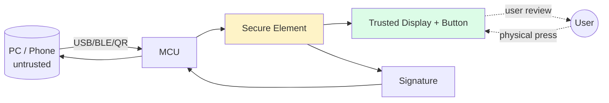

# 硬件钱包（Ledger / Trezor / Keystone）

> **TL;DR**：**硬件钱包（Hardware Wallet, HW）** 用 **独立安全芯片** 把助记词与签名操作与通用操作系统完全隔离，主机 PC/手机即使感染恶意软件也无法读取私钥或静默篡改签名。三大范式：**Ledger**（ST33 **Secure Element (SE)** + STM32 MCU 双芯片，闭源固件 + 开源 SDK）、**Trezor**（单 MCU、开源固件，Model T 升级 EAL5+ SE）、**Keystone / Coldcard / Grid+**（**air-gapped**，二维码/SD 卡传数据，完全物理隔离）。核心安全目标：**Seed 永不出芯 + Human-in-the-loop 屏幕确认 + 防物理拆解**；最大用户失败模式是 **盲签**（屏幕显示不全、看不懂 calldata）。2023-05 Ledger Recover 争议、2023-12 Connect Kit 供应链攻击两件事重塑了用户对"硬件 != 绝对安全"的认知。

---

## 1. 背景与动机

2013-14 间 Bitcoin 市值暴涨、交易所频繁被黑，独立硬件存储需求爆发。**Trezor One**（2014，SatoshiLabs）开源先行者；**Ledger Nano S**（2016，Ledger SAS）引入 **双芯架构**（SE + MCU）并获 CC EAL5+ 认证；**KeepKey**（2015）后被 ShapeShift 收购。2019 前后 **Coldcard**（Coinkite）与 **Keystone**（原 Cobo Vault）走向 **air-gapped**：无 USB/BLE，只用摄像头+二维码或 microSD 转移交易，消除远程攻击面。

硬件钱包基本命题：**假设主机被攻破，我仍能安全签名**。这与软件钱包的"假设主机可信，加密存放助记词"形成根本差别。

## 2. 核心原理

### 2.1 形式化：隔离信任边界

```
Components:
  MCU:  通用微控制器，处理 USB/BLE I/O、UI 驱动
  SE:   安全元件（Smart Card 级芯片，抗物理+侧信道攻击）
  Display: 屏幕 + 物理按键 (Trust Anchor for Human Review)
  Seed: 存于 SE，永不出芯
  PIN: 解锁 SE 操作

签名流程：
  Host → MCU → SE: sign(tx)
  SE displays parsed tx on screen
  User reviews → presses physical button
  SE signs inside; returns signature only
```

**安全模型**：host + MCU 均视为不可信。SE 保证 sk 物理隔离；**屏幕 + 物理按键是唯一 Trusted Path**。核心假设：用户 **读得懂** 屏幕内容（否则盲签陷阱）。

### 2.2 关键数据结构

**SE 内存**（简化）：

```c
struct SEState {
    uint8_t  pin_hash[32];
    uint8_t  attempts_left; // 3 次，归零则全擦
    uint8_t  seed_encrypted[64];   // BIP39 seed，加密存在 flash
    uint8_t  master_xprv[...];
    Apps[]   installed_apps; // BTC/ETH/SOL 等
};
```

**App 模型（Ledger BOLOS）**：每条链是一个独立 app（ETH app、BTC app 等）；BOLOS 保证 App 间内存隔离，App 只能 `os_perso_derive_node_bip32` 派生自己授权路径的子 key。

### 2.3 子机制拆解

1. **Secure Element (SE)**：CC EAL5+/6+ 认证芯片（ST33、Infineon SLE、NXP A71CH）。抗差分功耗分析（DPA）、故障注入（FI）、电磁注入；内置真随机数发生器（TRNG）。
2. **Seed 保护**：BIP39 seed 在 SE 内生成；导出时仅通过 **用户手抄助记词** 出设备（工厂设定、不可软件导出）。
3. **App 签名机制**：PIN 解锁后，host 请求 ETH-app 签 tx；ETH-app 解码 tx、屏幕展示收款地址 + 金额 + Gas；用户物理按键确认；SE 签名输出 (r,s,v)。
4. **屏幕解析（Clear Signing）**：ETH/BTC 标准 tx 字段可完全解析；但复杂 calldata（ERC-4337 UserOp、Uniswap Universal Router、Safe Multisig）需 **ABI plugin**，否则退化为盲签十六进制。
5. **Passphrase (BIP39 25th word)**：在 SE 内与 seed 合并派生；支持 "hidden wallet"，受胁迫时可开空钱包。
6. **Air-gap 传输**：Keystone/Coldcard 用 QR Code（animated QR 分片）或 microSD PSBT 文件；物理隔离杜绝远程攻击。

### 2.4 参数与常量

| 参数 | 值 | 说明 |
| --- | --- | --- |
| Ledger Nano S+/X SE | ST33K1M5 | CC EAL5+ |
| Trezor Model T SE | Optiga Trust M (NXP) | CC EAL5+ |
| Keystone 3 Pro SE | 3x EAL 5+ MCUs | 物理隔离 |
| BIP39 seed 长度 | 12/18/24 词 | 用户选 |
| PIN 长度 | 4–50 位 | Trezor 数字 pad shuffle |
| PIN 重试 | 3（Ledger）/可配（Trezor）| 归零擦盘 |
| 支持币种 | Ledger 5500+，Trezor 1600+ | 以 app 安装 |
| 传输协议 | USB / BLE / NFC / QR / SD | 见机型 |

### 2.5 边界条件与失败模式

- **盲签**：复杂合约 calldata 显示 "0xa9059cbb..." 用户看不懂 → Lazarus Bybit $1.4B 事件。
- **固件后门**：Ledger 2020-07 Shopify 数据泄露导致钓鱼邮件；本身未破，但教训：HW 非绝对。
- **供应链**：Ledger Connect Kit 2023-12 前员工 npm token 被盗，注入 drainer；虽非固件漏洞，但用户仍中招。
- **物理攻击**：Trezor One 2018 电压故障 → dump flash（需物理拥有 + 数小时），Trezor T 已修复。
- **Evil Maid**：未保管的设备可被植假固件；所有主流 HW 开机校验 root of trust。
- **Recovery 争议**：Ledger Recover 2023-05 允许将 seed shard 给第三方托管引起抗议——支持者称合规、反对者称违背"永不出芯"承诺。

### 2.6 Mermaid：签名信任边界



## 3. 架构剖析

### 3.1 分层视图（Ledger）

```
┌──────────────────────────────────────┐
│ Ledger Live / 第三方钱包 (MM/Rabby)   │
├──────────────────────────────────────┤
│ ledgerjs / hw-app-eth (JS SDK)       │
├──────────────────────────────────────┤
│ USB/BLE Transport (HID / WebUSB)     │
├──────────────────────────────────────┤
│ MCU firmware (STM32)                 │
├──────────────────────────────────────┤
│ BOLOS OS (SE) + Apps                 │
├──────────────────────────────────────┤
│ ST33K1M5 secure chip                 │
└──────────────────────────────────────┘
```

### 3.2 核心模块清单

| 模块 | 职责 | 示例 / 源码 | 依赖 | 可替换性 |
| --- | --- | --- | --- | --- |
| SE Chip | seed 存储 + 签名执行 | ST33K1M5 / Optiga | — | 低 |
| BOLOS OS | App 隔离、系统调用 | ledger-secure-sdk | SE | 低 |
| ETH App | tx 解析/签名 | `app-ethereum` | BOLOS | 中 |
| BTC App | PSBT/签名 | `app-bitcoin` | BOLOS | 中 |
| Clear Signing Plugin | 解析 Uniswap/Aave calldata | `ethereum-plugin-sdk` | App | 高 |
| Ledger Live | 主桌面 UI | `ledger-live` | JS SDK | 高 |
| hw-app-eth | JS API | `@ledgerhq/hw-app-eth` | — | 中 |
| Transport | USB/BLE/HID 抽象 | `@ledgerhq/hw-transport-*` | — | 高 |
| Firmware Updater | 校验 + 烧录 | Ledger Live / Trezor Suite | — | 中 |
| Recovery 备份 | 手抄 / Shamir | — | — | 低 |

Trezor 与 Keystone 对应模块名有差异，但结构同构。

### 3.3 数据流：MetaMask 通过 Ledger 签一笔以太坊 tx

1. MM 用户选 Ledger 账户（`m/44'/60'/0'/0/0`）。
2. MM 用 `@ledgerhq/hw-app-eth` 打开 transport，发送 `GET_PUBLIC_KEY` → 显示 address 供用户确认。
3. 用户发起 Swap，MM 构造 tx → 发 `SIGN_ETH_TX(rawTxHex)`。
4. MCU 转发至 ETH App → App 解码字段：chainId, nonce, to, value, gas, data。
5. 屏幕显示 Review → Amount → Address → Fee → Confirm。
6. 用户按"✓"按键确认。
7. SE 内 secp256k1 签名，生成 (r,s,v)。
8. 返回 MM，MM 拼接 raw signed tx → `eth_sendRawTransaction`。

若 calldata 不在已知 ABI 内，屏幕显示 "Blind Signing Required" 警告，需用户在 App 设置中预先开启。

### 3.4 客户端多样性

| 厂商 | 产品 | 架构 | 开源 | 特色 |
| --- | --- | --- | --- | --- |
| Ledger | Nano S+/X, Stax, Flex | SE + MCU | 部分 | 生态广，5000+ 币 |
| Trezor | One, Model T, Safe 3/5 | MCU / MCU+SE | ✓ 全开源 | 社区信任 |
| Keystone | 3 Pro | air-gapped 3SE | 部分 | QR、适配多钱包 |
| Coldcard | Mk4, Q | air-gapped | 部分 | 纯 BTC, PSBT |
| Grid+ / Lattice | — | HSM-like | 部分 | 机构 |
| OneKey | Mini/Pro/Touch | MCU+SE, 兼容 Trezor protocol | ✓ | 中文友好 |
| BitBox | 02 | SE | ✓ | CH 产 |
| Tangem | card | SE | 部分 | NFC 卡片 |

### 3.5 扩展接口

- **USB HID / WebUSB / WebHID**：PC 连接标准。
- **BLE**：Ledger Nano X。
- **QR (UR format, BlueWallet)**：air-gapped 标准；BC-UR, animated QR。
- **microSD**：Coldcard PSBT。
- **EIP-4527**：QR-Code 交易签名标准。
- **Keystore file**：HW 通常不支持；仅软件钱包。
- **Clear Signing Registry**：Ledger 2024 推出，提交合约 ABI 供公开审核。

## 4. 关键代码 / 实现细节

Ledger ETH App `handleProvideERC20TokenInformation` (`app-ethereum/src/shared_context.c` 简化)：

```c
// Host 发来 "此合约是 USDT，decimals=6"，SE 校验签名后缓存
void handleProvideERC20(uint8_t *dataBuffer, uint16_t dataLength) {
    uint8_t tickerLen = dataBuffer[0];
    // layout: [tickerLen][ticker][addr(20)][decimals(4)][chainId(4)][sig(70)]
    ...
    if (!cx_ecdsa_verify(&ledger_signer_pubkey, CX_LAST, CX_SHA256,
                         payloadHash, 32, signature, sigLen)) {
        THROW(SW_INVALID_SIGNATURE);
    }
    strncpy(tmpCtx.transactionContext.tokenContext.ticker, ticker, tickerLen);
    tmpCtx.transactionContext.tokenContext.decimals = decimals;
}
```

> 这段逻辑让 ETH App 在屏幕上显示 "Send 100 USDT"（而非 100 * 10^6 原始 uint），但前提是 host 必须提供 **Ledger 官方签名过的** 元数据，防止钓鱼伪造 token。

## 5. 演进与版本对比

| 产品 | 年份 | 关键 |
| --- | --- | --- |
| Trezor One | 2014 | 开源先驱 |
| Ledger Nano S | 2016 | 双芯 SE+MCU |
| Ledger Nano X | 2019 | BLE + 更大存 |
| Trezor Model T | 2018 | 触屏 + SE（后续）|
| Coldcard Mk3 | 2019 | 纯 BTC + air-gap |
| Keystone 3 Pro | 2023 | 3 EAL5 SE + 指纹 |
| Ledger Stax/Flex | 2024 | E-ink + 大屏 |
| Trezor Safe 3/5 | 2023-24 | 终于加入 SE |
| OneKey Pro | 2024 | 双屏 + AirGap |

## 6. 实战示例

Ledger + MetaMask 使用：

```
1. 插入 Nano X → 输入 PIN → 打开 Ethereum App
2. MetaMask → Connect Hardware → Ledger → 选 account 0
3. Swap tx → MetaMask 弹窗 → Review on Ledger device
4. 按右键 → 验 amount / addr / gas
5. 按双键 ✓ → 签名回传
```

Coldcard + Sparrow（纯 BTC）：

```
Sparrow: 构造 PSBT → 导出到 microSD
Coldcard: 插 SD → Verify → Sign → 写回 SD
Sparrow: 导入 → Broadcast
```

## 7. 安全与已知攻击

| 事件 | 年份 | 根因 | 教训 |
| --- | --- | --- | --- |
| Trezor One glitch | 2018 | 电压故障 dump | SE 必要 |
| Ledger Shopify 泄露 | 2020-07 | 第三方数据库 | 用户不应实名 |
| Wallet.Fail demos | 2018–2024 | 故障注入、供应链 | 物理保管 |
| Ledger Connect Kit | 2023-12 | npm token 泄 | 锁版本 SRI |
| Ledger Recover 争议 | 2023-05 | 商业模式冲突 | 保留可选性 |
| Bybit Safe Lazarus | 2025-02 | 盲签 delegatecall | clear-signing + 结构化审阅 |

## 8. 与同类方案对比

| 维度 | Ledger | Trezor | Keystone/Coldcard | MPC |
| --- | --- | --- | --- | --- |
| SE | ✓ | 部分 | ✓ (air-gap) | 软件 enclave |
| 开源 | 部分 | 全 | 部分 | 部分 |
| 抗物理 | 强 | 中 | 强 | 分布式 |
| 传输 | USB/BLE | USB | QR/SD | 网络 |
| 恢复 | 助记词 | 助记词/SLIP39 | 助记词/SLIP39 | share |
| 用户易用 | 中 | 中 | 稍难 | 好 |
| 适合 | 普通高净值 | 极客 | 高安全囤币 | 机构/消费 |

## 9. 延伸阅读

- **Ledger** `developers.ledger.com`；Ledger Donjon research 博客。
- **Trezor** `trezor.io/learn`；开源 firmware 源码。
- **Keystone** `keyst.one/docs`。
- **论文**：Wallet.Fail 研究（35C3）；"DEFCON 27: Breaking Hardware Wallets"。
- **事件复盘**：Ledger Connect Kit post-mortem（2023-12-14 Ledger 官方）。
- **BIP**：BIP39/44 / SLIP39 Shamir。

## 10. 术语表

| 术语 | 英文 | 释义 |
| --- | --- | --- |
| SE | Secure Element | 安全芯片 |
| MCU | Microcontroller Unit | 微控制器 |
| CC EAL | Common Criteria EAL | 通用安全认证级别 |
| Air-gap | — | 物理隔离无网络 |
| Blind Signing | — | 盲签，UI 未解析 calldata |
| Clear Signing | — | 人类可读签名审阅 |
| TRNG | True RNG | 硬件随机数源 |
| PSBT | Partially Signed Bitcoin Tx | BIP-174 标准 |

---

*Last verified: 2026-04-22*
