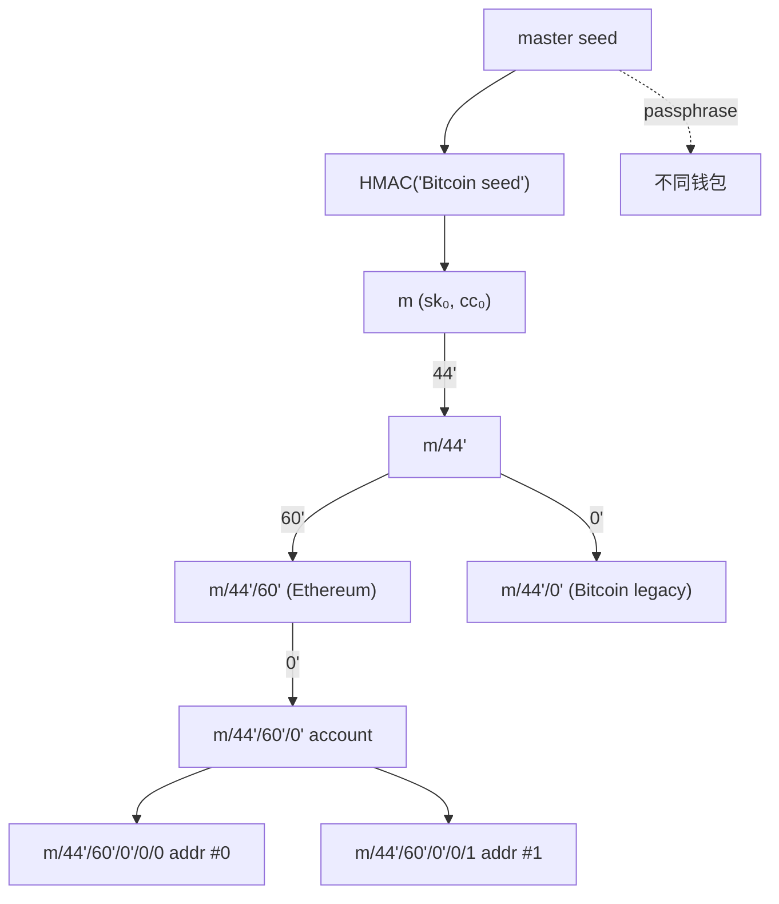

# HD 钱包与 BIP 系列（BIP32/39/44/49/84/86）

> **TL;DR**：**HD（Hierarchical Deterministic）钱包** 把单一 256-bit 种子扩展为一棵可无限派生的密钥树——一次备份覆盖所有币种、所有账户、所有地址。BIP32 定义树的数学结构（`CKD_priv / CKD_pub`），BIP39 把种子编码为 12/24 词 **助记词**，BIP44 规定多币种标准派生路径 `m/44'/coin'/account'/change/index`，BIP49/84/86 分别对应 P2SH-P2WPKH、P2WPKH、P2TR 地址类型。**硬化派生** `i ≥ 2³¹` 保障父 xpub 泄露时子 sk 不可推导。SLIP-44 维护 coin_type 全局注册表（BTC=0、ETH=60、SOL=501）。

---

## 1. 背景与动机

Bitcoin 0.1 使用"keypool" 随机私钥池，每用完 100 个就重新备份——用户体验灾难。2012-02 Peter Wuille 提出 **BIP32**：从单一主种子派生无限密钥，且公钥可独立于私钥派生（为 watch-only 钱包赋能）。2013 Marek Palatinus（Trezor 创始人）提出 **BIP39**：把 128–256 bit 熵映射为 12/24 词助记词，便于人类誊抄。2014 **BIP44** 引入多币种路径。此后 **BIP49/84/86** 对应比特币升级至 SegWit、Native SegWit、Taproot 时的新地址类型。

HD 钱包解决了三件事：一次备份、多账户隔离、watch-only 公钥披露。

## 2. 核心原理

### 2.1 形式化定义

BIP32 节点 `N = (sk, cc)`，其中 sk 是 32 字节私钥，cc 是 32 字节 **chain code**。**子密钥派生（CKD）**：

```
CKD_priv(N_parent, i):
    if i ≥ 2^31:               # hardened
        I = HMAC-SHA512(cc_par, 0x00 || sk_par || i)
    else:
        I = HMAC-SHA512(cc_par, serP(pk_par) || i)
    I_L, I_R = I[:32], I[32:]
    sk_child = (I_L + sk_par) mod n
    cc_child = I_R
    return (sk_child, cc_child)
```

公钥派生（仅非硬化）：

```
CKD_pub(pk_par, cc_par, i):
    I = HMAC-SHA512(cc_par, serP(pk_par) || i)
    pk_child = I_L · G + pk_par
    cc_child = I[32:]
```

这就是 **xpub → 子 xpub 可推** 但 **xpub + 普通 chain code 不能反推 sk** 的关键结构。

### 2.2 BIP39 助记词算法

```
1. entropy ← CSPRNG(ENT bits)   # ENT ∈ {128,160,192,224,256}
2. checksum = SHA256(entropy)[:ENT/32]
3. bits = entropy || checksum
4. 每 11 bit 查 BIP39 wordlist (2048 词) → mnemonic
5. seed = PBKDF2-HMAC-SHA512(mnemonic, "mnemonic" || passphrase, 2048, 64)
```

wordlist 精心挑选：每词首 4 字符唯一、避免歧义（如 "board" vs "broad"）。支持 10 种语言（英、日、韩、西、中简/繁、法、意、捷、葡），但跨语言不互通。**passphrase（第 25 词）** 是 plausible deniability 的钥匙：同 mnemonic + 不同 passphrase = 完全不同钱包。

### 2.3 BIP44 路径结构

```
m / purpose' / coin_type' / account' / change / address_index
m / 44'      / 60'        / 0'       / 0      / 0          <- ETH #0
m / 44'      / 0'         / 0'       / 0      / 0          <- BTC legacy #0
```

- `purpose`：44/49/84/86 区分地址类型。
- `coin_type`：SLIP-0044 注册表。
- `account`：独立会计单元；硬化以防跨账户关联。
- `change`：0=外部（收款），1=内部（找零）。
- `address_index`：顺序递增。

### 2.4 子机制拆解

1. **熵源**：必须来自 CSPRNG 或硬件 RNG；ENT 必须 ≥128 bit。
2. **助记词编码**：词表查找 + 校验位。
3. **Seed 派生**：PBKDF2 2048 轮 SHA-512。
4. **主密钥**：`HMAC-SHA512("Bitcoin seed", seed)` → `(sk_0, cc_0)`。
5. **扩展密钥序列化**：`xprv/xpub` 是 111 字符 Base58Check 字符串，含 version / depth / parent fingerprint / child number / chain code / key。
6. **硬化 vs 非硬化**：硬化保护父 xpub 泄露；非硬化允许 watch-only 派生子地址。

### 2.5 参数与常量

| 参数 | 值 | 出处 |
| --- | --- | --- |
| ENT | 128–256 bit | BIP39 |
| PBKDF2 迭代 | 2048 | BIP39 |
| Wordlist 大小 | 2048 | BIP39 |
| Chain code | 256 bit | BIP32 |
| 硬化阈值 | 2³¹ | BIP32 |
| xprv/xpub 版本 | 0x0488ADE4 / 0x0488B21E | BIP32 |
| SLIP-44 BTC/ETH/SOL | 0 / 60 / 501 | SLIP-44 |

### 2.6 派生树（Mermaid）



## 3. 架构剖析

### 3.1 分层视图

```
┌──────────────────────────────────────────┐
│ UI: 12/24 词 import/export / 账户切换    │
├──────────────────────────────────────────┤
│ BIP39: mnemonic <-> seed                │
├──────────────────────────────────────────┤
│ BIP32: master <-> 子节点派生             │
├──────────────────────────────────────────┤
│ BIP44/49/84/86: 路径约定 + 地址编码      │
├──────────────────────────────────────────┤
│ secp256k1 / keccak256 / base58 原语      │
└──────────────────────────────────────────┘
```

### 3.2 核心模块清单

| 模块 | 职责 | 参考实现 | 依赖 | 可替换性 |
| --- | --- | --- | --- | --- |
| MnemonicGenerator | 熵→mnemonic | bitcoinjs-lib/bip39 | CSPRNG, wordlist | 高 |
| SeedDeriver | mnemonic→seed | bip39.mnemonicToSeedSync | PBKDF2 | 中 |
| MasterKey | seed→(sk,cc) | bip32 | HMAC-SHA512 | 低 |
| CKD | 子节点派生 | bip32.derive() | HMAC, ECC | 低 |
| PathParser | "m/44'/60'/0'/0/0" 解析 | 自写 | — | 高 |
| AccountManager | 多币种账户索引 | MetaMask keyring-hd | BIP32 | 高 |
| Address Encoder | sk→地址 | keccak256 (ETH) / bech32 (BTC SegWit) / base58 (BTC legacy) | — | 中 |
| xprv Serializer | 扩展密钥编码 | bip32 | Base58Check | 中 |
| Watch-only | 用 xpub 派生地址 | Sparrow、Coldcard | BIP32 非硬化 | 高 |
| Backup Tool | 助记词冷备 | Cryptosteel、Seedplate | — | 高 |

### 3.3 数据流：从 mnemonic 到 ETH 地址

```
"abandon abandon ..."   ← 12 words
   │  PBKDF2(2048, "mnemonic")
   ▼
seed (64 B)
   │  HMAC-SHA512("Bitcoin seed")
   ▼
(sk₀, cc₀)
   │  BIP44 path m/44'/60'/0'/0/0
   ▼
sk_leaf (32 B)
   │  pk = sk·G (secp256k1)
   ▼
pk (64 B X‖Y)
   │  keccak256(pk)[12:]
   ▼
address 0x...
```

### 3.4 客户端多样性 / 参考实现

- **bip39 / bip32**（JS，bitcoinjs 维护）：浏览器 & Node.js，MetaMask、Rabby、Trust Wallet 内部均基于它。
- **python-bip_utils**：Python 全套 BIP32/39/44/49/84/86。
- **rust-bitcoin / rust-bip39**：硬件钱包厂商偏好。
- **libwally-core**（Blockstream）：C 实现，低资源设备友好。
- **Ledger BOLOS**：硬件端自主实现，种子永不出设备。

### 3.5 扩展 / 互操作接口

- **SLIP-10**：把 BIP32 扩展到 ed25519、nist256p1 曲线（Solana/Cardano 依赖）。
- **SLIP-39**：Shamir 助记词 secret sharing (20/33 词)。
- **BIP85**：从 HD 主种子派生"子助记词"，一树管全家钱包。
- **BIP39 passphrase**：第 25 词，兼具"隐藏钱包"用途。
- **Wallet Import Format (WIF)**：单私钥兼容导出。

## 4. 关键代码 / 实现细节

bip32 派生核心（简化自 `bitcoinjs/bip32` 源码 `src/bip32.ts`，`v4.0.x`）：

```typescript
derive(index: number): BIP32Interface {
  const isHardened = index >= HIGHEST_BIT; // 0x80000000
  const data = Buffer.allocUnsafe(37);

  if (isHardened) {
    data[0] = 0x00;
    this.privateKey!.copy(data, 1);            // sk_parent
  } else {
    this.publicKey.copy(data, 0);              // pk_parent
  }
  data.writeUInt32BE(index, 33);

  const I  = crypto.hmacSHA512(this.chainCode, data);
  const IL = I.slice(0, 32);
  const IR = I.slice(32);
  if (!ecc.isPrivate(IL)) return this.derive(index + 1);

  const sk_child = ecc.privateAdd(this.privateKey!, IL); // (IL + sk_p) mod n
  return fromPrivateKey(sk_child, IR, /* network */);
}
```

> 省略了公钥路径与异常。`ecc.isPrivate` 过滤极小概率的无效 IL（> n），对应 BIP32 提示"若无效则 index++ 重试"。

## 5. 演进与版本对比

| 标准 | 年份 | 地址类型 | 典型前缀 | purpose |
| --- | --- | --- | --- | --- |
| BIP44 | 2014 | P2PKH | 1... | 44' |
| BIP49 | 2017 | P2SH-P2WPKH | 3... | 49' |
| BIP84 | 2017 | P2WPKH (native SegWit) | bc1q... | 84' |
| BIP86 | 2021 | P2TR (Taproot) | bc1p... | 86' |

以太坊生态仅使用 BIP44 purpose=44'，因地址由公钥 keccak 直接派生、无地址类型之分。

## 6. 实战示例

用 `ethers.js` 从助记词派生多账户：

```javascript
import { HDNodeWallet, Mnemonic } from "ethers";
const mne = Mnemonic.fromPhrase("abandon abandon abandon abandon abandon abandon abandon abandon abandon abandon abandon about");
const root = HDNodeWallet.fromMnemonic(mne);
for (let i = 0; i < 3; i++) {
  const w = root.derivePath(`m/44'/60'/0'/0/${i}`);
  console.log(i, w.address);
}
// 0 0x9858EfFD232B4033E47d90003D41EC34EcaEda94 (well-known test)
// 1 0x6Fac4D18c912343BF86fa7049364Dd4E424Ab9C0
// 2 0xb6716976A3ebe8D39aCEB04372f22Ff8e6802D7A
```

## 7. 安全与已知攻击

- **弱熵**：Android SecureRandom 2013 漏洞；任何非硬件 RNG 的助记词都需警惕。
- **passphrase 遗忘**：等同于丢失 25 词；无任何恢复渠道。
- **不硬化的账户层**：若把 `account` 写成非硬化，xpub 泄露可回推全部 sk。
- **Cloud backup**：iCloud/Google Drive 扫描 OCR "abandon" 出现即触发钓鱼邮件。
- **供应链**：Trezor One 2018 电压故障注入事件（物理攻击）。
- **BIP39 冲突**：不同钱包对 passphrase 规范化（NFKD Unicode）实现不一致导致同助记词派生不同地址（Ledger vs Trezor 2017）。

## 8. 与同类方案对比

| 维度 | BIP32/39/44 | SLIP-39 | BIP85 | 直接单 sk |
| --- | --- | --- | --- | --- |
| 备份单位 | 1 助记词 | t-of-n 分片 | 主+子助记词 | 每账户单独 |
| 跨币种 | ✓ | ✓ | ✓ | ✗ |
| 恢复难度 | 中 | 高 | 高 | 低 |
| 隐私（watch-only） | ✓ | ✓ | ✓ | ✗ |
| 标准化 | 广泛 | Trezor/Shamir | 小众 | 非标 |

## 9. 延伸阅读

- **官方规范**：BIP32/39/44/49/84/86、SLIP-0010/39/44。
- **论文**：Courtois et al. "Stealth Address and Key Management"（HD 扩展）。
- **博客**：Andreas Antonopoulos《Mastering Bitcoin》第 5 章；Ledger Academy "HD wallets explained"。
- **工具**：iancoleman.io/bip39（离线使用）；seed.guru（字体抗 OCR 备份）。
- **EIP**：EIP-84（非强制，Ethereum 派生路径建议）。

## 10. 术语表

| 术语 | 英文 | 释义 |
| --- | --- | --- |
| HD | Hierarchical Deterministic | 分层确定性钱包 |
| Mnemonic | — | 助记词，12/24 词 |
| Seed | — | 从 mnemonic 派生的 64B 主种子 |
| xprv / xpub | — | BIP32 扩展私/公钥 |
| Chain code | — | 派生过程防碰撞的附加 32B |
| Hardened | — | 硬化派生，index ≥ 2³¹ |
| SLIP-44 | — | 币种注册表 |
| Passphrase | — | 第 25 词，隐藏钱包 |

---

*Last verified: 2026-04-22*
