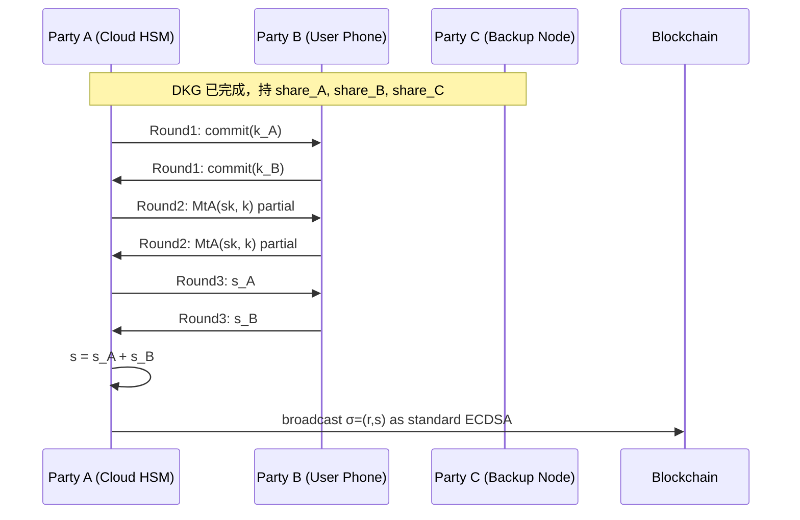

# MPC 钱包（Fireblocks / BitGo / Coinbase WaaS / ZenGo）

> **TL;DR**：**MPC（Multi-Party Computation）钱包** 用 **门限签名 TSS** 把一把私钥 sk 切成 n 个 **share**，t 方协同出签；完整 sk **从诞生到退役都不存在任何单一内存**。ECDSA 的主流 TSS 协议是 **GG18/GG20**（三轮，依赖 Paillier 加密 + 零知识证明），Schnorr/EdDSA 家族则用 **FROST**。Fireblocks 2019 推出首个商用 MPC 产品，其 2021 **MPC-CMP** 论文把 ECDSA 门限降到 **1 轮** in online phase。优势：**无单点私钥、签名仍是链上标准 ECDSA（链侧不感知）、可审计策略**。劣势：协议复杂、需活跃网络、share 备份 & 恢复仍是工程难点。2024–2026 Binance-chain tss-lib、ZenGo multi-party-ecdsa、Silence Labs DKLs23 是事实开源基准。

---

## 1. 背景与动机

早期机构冷钱包靠 **多签（m-of-n multisig）**：每方持独立 sk，链上发起 m 笔签名。缺点：
- 链上可见签名方数量（失去隐私、昂贵）。
- 各链多签实现不一（BTC P2SH、ETH 合约、Cosmos multisig），跨链难统一。
- 审计面扩大：每把 sk 都需单独保护。

2018 Gennaro-Goldfeder 论文 GG18/20 解决 ECDSA 分布式签名问题（此前 ECDSA 因为 `k⁻¹` 步骤难 MPC，落后 RSA/BLS 十几年）。2019 Fireblocks 商用化；同年 Unbound（被 Coinbase 2021 收购 → WaaS）；ZenGo 面向消费者。FROST（2020 CMU）在 Schnorr/EdDSA 曲线上实现更简单高效的门限签名，被 Solana MPC 方案采用。

根本价值：**私钥不再是单点物理对象**，可在 HSM + 云 + 用户手机三方分布；攻破任意 t-1 方都无法签名，**真正的"多人签名"而非多签名**。

## 2. 核心原理

### 2.1 形式化：门限签名

门限签名方案 `TSS = (DKG, Sign, Verify)`：

- `DKG(n, t) → (share₁,...,share_n, pk)`：分布式密钥生成，n 方协同生成 share，任一方无 sk 全量信息。
- `Sign({share_i}_{i∈S}, m) → σ`，|S| ≥ t，输出合法签名 σ。
- `Verify(pk, m, σ) → bool`：标准单密钥签名验证（链上无感）。

安全性：UC-secure against `t-1` malicious 参与方（GG18/20 在 ECDSA 假设 + Paillier 假设下）。

### 2.2 关键算法

**GG20 签名（简述）**：

1. **DKG 阶段**：
   - 每方 P_i 选 Feldman VSS 多项式 `f_i(x) = a_{i,0} + a_{i,1}x + ...`，`a_{i,0}` 是其"私钥贡献"。
   - 互相发 share `f_i(j)`，收到后 sum 得 `share_i = Σ_j f_j(i)`。
   - 公共 pk = Σ Commit(a_{j,0})。

2. **Sign 阶段（online + offline）**：
   - 每方取 k_i, γ_i；广播 k_i·G, γ_i·G 的 commit。
   - 通过 **MtA (Multiplicative-to-Additive)** 子协议计算 `k·γ`、`k·sk` 的加性分享（用 Paillier 同态加密 + ZK 证明保真实）。
   - 合成 `R = k·G, r = R.x`，`s = k·(m + r·sk)` 加法分片；广播 `s_i`，聚合得最终 s。

**复杂度**：GG18 6–9 轮，GG20 3 轮。Fireblocks MPC-CMP（Lindell 2021）**预计算 offline**，online 只 1 轮，适配实时交易场景。

**FROST（Schnorr）**：

- DKG 同 Feldman VSS。
- Sign：先 commit nonce pair `(d_i, e_i)`，再生成绑定因子 `ρ_i = H(i, m, B)`（B 是所有 commit 的集合），各方输出 `z_i = d_i + e_i·ρ_i + λ_i·share_i·c`（λ 是 Lagrange 系数）。
- 聚合 `z = Σ z_i`，签名 `(R, z)`。

更简单，仅 2 轮，无需 Paillier。Solana、Sui 生态 MPC 多用 FROST 或 ROAST（异步变体）。

### 2.3 子机制拆解

1. **DKG**：分布式生成 share，避免"受信第三方切 sk"。
2. **Refresh / Rotate**：周期性重刷 share（proactive secret sharing），防止长期潜伏攻击者逐片窃取。每次 refresh 后旧 share 作废。
3. **Add / Remove Party**：resharing 协议支持 t-of-n 扩缩容。
4. **Signing**：多方通信 + 本地计算 + ZK 证明。
5. **Backup / Disaster Recovery**：若一方永久失联，剩余 t 方可 resign + recover 新 share。
6. **Strategy / Policy**：在 MPC 协同之前叠加"允许/拒绝"策略引擎（Fireblocks TAP）。

### 2.4 参数与常量

| 参数 | 典型值 | 说明 |
| --- | --- | --- |
| n, t | (2,2) / (3,2) / (5,3) | 消费级 vs 机构 |
| 曲线 | secp256k1 / ed25519 / stark | 覆盖主链 |
| DKG 通信轮数 | 4–6 | GG20 / FROST-keygen |
| Sign 轮数 | 3 (GG20) / 2 (FROST) / 1 (CMP online) | 与协议相关 |
| Refresh 周期 | 24 h–30 d | 策略可配 |
| Paillier key | 2048–3072 bit | ECDSA-TSS 必需 |
| 网络延迟预算 | <2 s | 移动用户 UX 底线 |

### 2.5 边界条件与失败模式

- **Rogue-key**：DKG 若无 POK 校验，敌方可选择性构造 share 主导 pk。
- **Paillier 弱素数**：GG20 对 Paillier 参数要求严格；2023 "TSSHock" 研究指出若不做 Range Proof 可密钥恢复。
- **偏置 nonce**：MtA 若简化 ZK 证明会泄露 k bit → 可解 sk（2023 Verichains "0-value attack"）。
- **重放 share**：若 share 被老备份覆盖，刷新失败。
- **可活性**：t 方同时在线才出签，单方掉线 → 阻塞。
- **信道安全**：所有通信需 TLS + mutual auth，防 MITM 冒名。

### 2.6 Mermaid：2-of-3 TSS 签名



## 3. 架构剖析

### 3.1 分层视图

```
┌──────────────────────────────────────────┐
│ UI / API (Client SDK)                    │
├──────────────────────────────────────────┤
│ Policy Engine (TAP / Rule)               │
├──────────────────────────────────────────┤
│ MPC Orchestrator                         │
│  - Session mgmt, message routing         │
├──────────────────────────────────────────┤
│ TSS Core (GG20 / FROST / CMP / DKLs23)   │
├──────────────────────────────────────────┤
│ Secure Runtime (SGX / Nitro / HSM)       │
├──────────────────────────────────────────┤
│ Chain Adapter (ECDSA/EdDSA signer → tx)  │
└──────────────────────────────────────────┘
```

### 3.2 核心模块清单

| 模块 | 职责 | 参考实现 | 依赖 | 可替换性 |
| --- | --- | --- | --- | --- |
| DKG Engine | 分布式密钥生成 | tss-lib, multi-party-ecdsa | 网络 + Paillier | 低 |
| Sign Engine | 协同签名 | 同上 | DKG 输出 | 低 |
| Paillier Lib | ECDSA-TSS 同态加密 | kzen-paillier, paillier-rs | — | 中 |
| ZK Proofs | range / MtA 证明 | bulletproofs, curv | — | 中 |
| Refresh Manager | 定期 rotate share | Fireblocks内部 | Engine | 中 |
| Session Manager | 消息通道 | gRPC / WebSocket | — | 高 |
| Policy Engine | 审批规则 | Fireblocks TAP / Copper Co-sign | — | 中 |
| Secure Enclave | share 落地保护 | Intel SGX / AWS Nitro | OS | 中 |
| Chain Adapter | 链侧广播 | ethers / bitcoinjs | — | 高 |
| KMS / HSM | share 静态加密 | AWS KMS / CloudHSM | — | 中 |

### 3.3 数据流：用户发起 DeFi 交易

1. 用户 App 构造 tx。
2. 策略引擎判定：白名单地址 ✓ / 额度 ✓。
3. MPC Orchestrator 发起 Sign Session ID；通知 Party A（云 HSM）、Party B（用户手机）。
4. 两方各在 SGX 内加载 share，协同 2 轮 FROST（Solana）或 3 轮 GG20。
5. 聚合出 σ；返回 Orchestrator。
6. 链上广播，收据回写。
7. 签名日志落审计链。

耗时预算：云内 MPC 100–300 ms；user phone 介入 500 ms–2 s。

### 3.4 客户端多样性

| 厂商 | 场景 | 协议 | 开源 |
| --- | --- | --- | --- |
| Fireblocks | 机构托管 | MPC-CMP (ECDSA) | 否 |
| BitGo | 机构托管 | TSS-ECDSA/EdDSA | 部分 |
| Coinbase WaaS | 开发者 API | DKLs23 | 部分 |
| ZenGo | 消费者 | GG20 + 2P | 开源 lib |
| Safeheron | 亚洲机构 | GG20 | 开源核心 |
| Binance tss-lib | 开源库 | GG18/20 | ✓ |
| Lit Protocol | 去中心化 MPC 网络 | ECDSA/BLS via DKG | ✓ |
| Web3Auth (Torus) | 社交登录 | TSS + OAuth | 部分 |

### 3.5 扩展 / 互操作接口

- **Custody API**：REST + Webhook（Fireblocks API v1.x）。
- **Policy File**：YAML/JSON 描述规则。
- **SDK**：TypeScript / Python / Go / Java / Rust。
- **Audit Trail**：每次 sign session 的完整消息日志，支持事后重放。
- **Cross-chain**：一套 share 复用于 BTC/ETH/SOL，只需不同曲线 DKG。

## 4. 关键代码 / 实现细节

Binance `tss-lib` 签名轮 3（摘自 `github.com/bnb-chain/tss-lib/ecdsa/signing/round_3.go`，tag `v2.x`，简化）：

```go
func (round *round3) Start() *tss.Error {
    Pi := round.PartyID()

    // 1. 解密对方 MtA 发来的 alpha_ij
    for j, msg := range round.temp.signRound2Messages {
        if j == Pi.Index { continue }
        r2msg := msg.Content().(*SignRound2Message)
        alphaIJ, err := round.key.PaillierSK.Decrypt(r2msg.GetC1())
        if err != nil { return round.WrapError(err) }
        round.temp.alphaJI[j] = alphaIJ
    }

    // 2. 计算 delta_i = k_i * gamma_i + Σ(alpha_ij + beta_ji)
    deltaI := new(big.Int).Mul(round.temp.kI, round.temp.gammaI)
    for j := range round.Parties().IDs() {
        if j == Pi.Index { continue }
        deltaI.Add(deltaI, round.temp.alphaJI[j])
        deltaI.Add(deltaI, round.temp.betaIJ[j])
    }
    deltaI.Mod(deltaI, tss.EC().Params().N)

    // 3. 广播 delta_i 给其他方
    round.out <- NewSignRound3Message(Pi, deltaI)
    return nil
}
```

> 实际代码包含更严格的 ZK 范围证明与 Feldman VSS 验证。任何省略这些校验的实现都被 "TSSHock" 或 "0-value" 攻击。

## 5. 演进与版本对比

| 年份 | 里程碑 |
| --- | --- |
| 1979 | Shamir Secret Sharing |
| 1989 | Feldman VSS |
| 2018 | GG18 ECDSA-TSS |
| 2019 | Fireblocks 商用 MPC |
| 2020 | GG20、FROST |
| 2021 | MPC-CMP (Lindell)，online 1 轮 |
| 2023 | DKLs23（双人 ECDSA，简洁）|
| 2023 | TSSHock 披露 GG18/20 多实现漏洞 |
| 2024 | Silence Labs 开源 DKLs23 |
| 2025 | Coinbase WaaS 社交恢复 MPC |

## 6. 实战示例

使用 `multi-party-ecdsa`（ZenGo, Rust）本地 2-of-2 签名：

```bash
git clone https://github.com/ZenGo-X/multi-party-ecdsa
cd multi-party-ecdsa
cargo test --release --test gg18_sign_client
# 启动两个客户端协同签 "hello"
```

ZenGo 移动端产品：用户装 App → 云端做 DKG → 一份 share 在手机 Secure Enclave，一份在 ZenGo 服务器；使用时两方协同，服务器仅辅助、无法单独签名。

## 7. 安全与已知攻击

| 事件/研究 | 年份 | 影响 |
| --- | --- | --- |
| GG18 Paillier 参数问题 | 2019 | 理论风险，已修复 |
| TSSHock (Verichains) | 2023 | bnb-chain/tss-lib 等若干库需更新 |
| 0-value MtA 攻击 | 2023 | 丢失 range proof 可解 sk |
| WazirX Liminal | 2024-07 | MPC 产品前端签名被劫 $230M |
| Silence Labs DKLs23 | 2024 | 引入 UC 安全证明 |
| BitGo v2 升级 | 2024 | 废弃旧 GG 版本，迁移 DKLs |

## 8. 与同类方案对比

| 维度 | MPC/TSS | 链上多签 | 智能合约钱包 | 硬件钱包 |
| --- | --- | --- | --- | --- |
| 链上感知 | ✗（普通签名）| ✓（Safe 合约）| ✓ | ✗ |
| 跨链 | ✓ | 难 | 受限 EVM | ✓ |
| Gas | 标准 | 高 | 高 | 标准 |
| 协议复杂 | 高 | 低 | 中 | 低 |
| 恢复 | 分片多元备份 | 助记词 | Guardian | 助记词 |
| 适合 | 机构/WaaS | DAO | DeFi 用户 | 个人高净值 |

## 9. 延伸阅读

- **论文**：Gennaro-Goldfeder GG18/20；Lindell "Fast Secure Two-Party ECDSA"；Komlo-Goldberg "FROST"；Lindell "MPC-CMP"。
- **开源**：bnb-chain/tss-lib、ZenGo-X/multi-party-ecdsa、Silence Labs DKLs23。
- **博客**：Paradigm "The state of MPC" (2023)；Fireblocks 技术博客。
- **审计**：Kudelski Security、Trail of Bits、Veridise TSS reports。

## 10. 术语表

| 术语 | 英文 | 释义 |
| --- | --- | --- |
| TSS | Threshold Signature Scheme | 门限签名 |
| DKG | Distributed Key Generation | 分布式密钥生成 |
| MtA | Multiplicative-to-Additive | ECDSA-TSS 关键子协议 |
| Paillier | — | 加法同态加密方案 |
| VSS | Verifiable Secret Sharing | 可验证秘密分享 |
| Proactive | — | 主动重刷分片抗长期攻击 |
| UC Security | Universal Composability | 密码学强安全模型 |
| FROST | — | Schnorr/EdDSA 门限方案 |

---

*Last verified: 2026-04-22*
