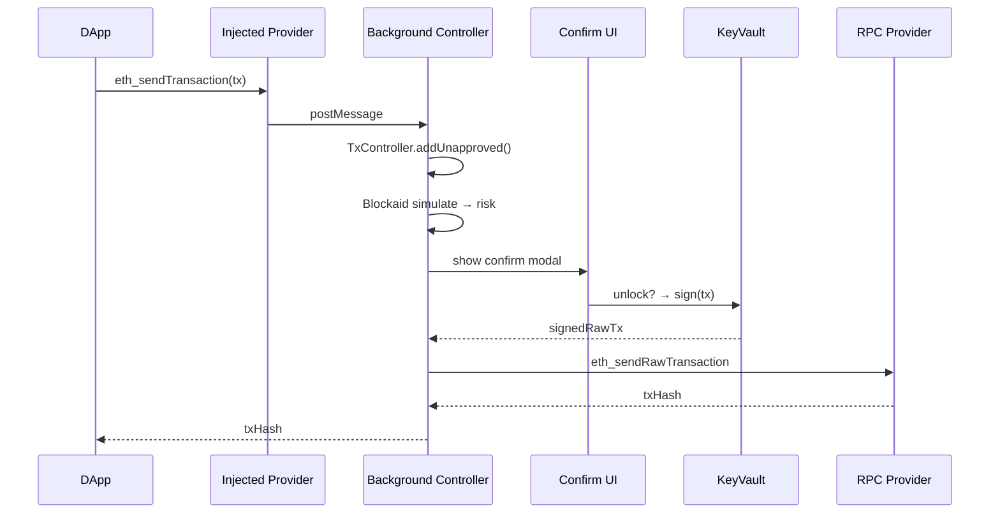

# 自托管 EOA 钱包（MetaMask / Rabby / Trust / Phantom）

> **TL;DR**：**自托管 EOA 钱包** 指把 secp256k1 / ed25519 私钥由 **用户设备本地** 存储与签名的软件钱包，账户即 **一个由私钥直接控制的外部账户（EOA）**。MetaMask（2016）是 EVM 事实标准入口，Rabby（DeBank 2021）主打"结构化签名 + 风险预警"，Trust Wallet（Binance 2017）主打移动多链，Phantom（2021）是 Solana 生态霸主。它们的共同架构是 **KeyVault（PBKDF2+AES-GCM）+ Controller 状态机 + RPC Provider + DApp Gateway（EIP-1193 / 6963）**，差别在风险引擎、链支持、UI 心智与 HW/MPC 集成深度。自托管 EOA 的根本 Trade-off 是：**灵活性最高，但任何一次误签或助记词泄露即终身损失，无客服可找回**。

---

## 1. 背景与动机

2015 年以太坊主网上线后，用户只能用 Mist、Geth CLI 或 MyEtherWallet 的网页签名操作合约，UX 极其糟糕。2016-07 Aaron Davis 与 Dan Finlay 启动 **MetaMask**：把私钥 + RPC Provider 塞进浏览器扩展，在页面注入 `window.web3`，DApp 无需自建节点即可调用以太坊。这一设计定义了此后十年所有 Web3 钱包的基本形态：**扩展 + 注入 Provider + 助记词备份**。

随生态发展，EOA 钱包的痛点被逐一暴露：（1）**每次签名盲目信任**，用户不懂 calldata；（2）**跨链管理混乱**；（3）**Approve 无限额授权**成重灾区（PeckShield 统计 2023 年 DeFi 钓鱼损失 >$900M）。Rabby（2021）由 DeBank 团队以"**签名前可视化模拟 + 风险评分**"切入，快速占据高净值 DeFi 用户。Phantom 凭 Solana 的爆发成为非 EVM 生态代表。

## 2. 核心原理

### 2.1 形式化：EOA 钱包的内部状态机

```
Wallet := (Vault, KeyRings, Accounts, Networks, Permissions, TxHistory)
Vault     = AES-GCM(PBKDF2(password, salt, iter), JSON{mnemonic, privKeys, ...})
KeyRing   ∈ { HD, Imported, Trezor, Ledger, QR }
Account   = (address, derivationPath, keyRingId, label)
Network   = (chainId, rpcUrl, nativeCurrency)
Permission= (origin, accounts, caveats)  # CAIP-25
```

所有事件流通过 **Controller** 模式：`UnapprovedTx → Approved → Signed → Submitted → Confirmed | Failed`。MetaMask 用 `@metamask/controllers` 提供这些状态机；Rabby fork 自 MetaMask v10，保留同构。

### 2.2 关键算法与数据结构

1. **Vault 加密**：`AES-256-GCM(key, plaintext)`，`key = PBKDF2-SHA256(password, salt=16B, iter=900000)` (MetaMask 2024-05 后)。密文存 `localStorage` / IndexedDB。
2. **助记词管理**：`@metamask/scure-bip39` 与 `@metamask/scure-bip32` 派生；内部 KeyRing 持 xprv，不断 derive 子账户。
3. **交易构造**：`@metamask/transaction-controller` 针对 EIP-1559、EIP-2930、EIP-7702 等类型分别处理。
4. **签名**：HD KeyRing 直接 sign；硬件 KeyRing 转发至 HW；snap KeyRing 通过 MetaMask Snaps 扩展。
5. **Provider API**：注入 `window.ethereum` (EIP-1193)；多钱包共存用 EIP-6963 的 announce/request event。
6. **权限系统**：CAIP-25 / PermissionController 维护 origin → permission 映射。

### 2.3 子机制拆解

1. **KeyVault 解锁/锁定**：输入密码 → 派生加密 key → 解密 mnemonic → 保存在运行内存；15 min 空闲自动锁定，清零。
2. **账户派生**：通过 `m/44'/60'/0'/0/i` 增量生成。
3. **网络与 RPC**：默认 Infura（2023 后 MetaMask 直连 Linea/Arbitrum 等 L2 代理），用户可自定义 RPC。
4. **DApp 连接**：网页通过 `eth_requestAccounts` 请求许可；钱包弹窗授权 → 写入 PermissionController。
5. **签名审阅**：`eth_signTransaction`, `personal_sign`, `eth_signTypedData_v4`；Rabby 插入 **pre-execution 模拟**（Blockaid/GoPlus/Tenderly）。
6. **风险拦截**：黑名单钓鱼域名（PhishFort、Scamsniffer 数据源）+ calldata 模式匹配（如 setApprovalForAll, approve(uint max)）。

### 2.4 参数与常量

| 参数 | 值 | 钱包 |
| --- | --- | --- |
| PBKDF2 iter | 900,000 | MetaMask ≥2024-05 |
| Auto-lock | 15 min 默认 | MetaMask/Rabby |
| 默认 gas 预测模型 | 1559 baseFee + tip 策略 | 所有 EVM 钱包 |
| 最大历史 Tx | 100/帐 | MetaMask |
| Chain presets | 9 预设 +自定义 | MetaMask |
| 快照恢复 `stateLog` | json dump 全状态 | MetaMask debug |

### 2.5 边界条件与失败模式

- **扩展进程崩溃**：service worker 失活 → 签名窗口丢失，需刷新。
- **Clipboard 劫持**：恶意扩展读取粘贴板改地址，已有案例。
- **注入冲突**：多个钱包争夺 `window.ethereum` → EIP-6963 解决。
- **盲签**：LedgerLive 或钱包不支持解码 calldata，用户只见十六进制。
- **Phishing Approve**：Permit2 / SetApprovalForAll 钓鱼，链上事后 revoke.cash。
- **RPC Provider 故障**：Infura 宕机（2020-11、2022-11）→ 用户应配置多 RPC 回退。

### 2.6 Mermaid：DApp 签名时序



## 3. 架构剖析

### 3.1 分层视图（以 MetaMask 为例）

```
┌────────────────────────────────────────┐
│  UI (React + Redux)                    │
│  - popup / full page / notification    │
├────────────────────────────────────────┤
│  Controllers (background SW)            │
│  - Preferences / Network / Accounts    │
│  - Transaction / Swap / Bridge         │
│  - Approval / Permission               │
├────────────────────────────────────────┤
│  KeyVault + KeyRings                   │
│  - HD / Simple / Trezor / Ledger / QR  │
├────────────────────────────────────────┤
│  Providers (network-controller)        │
│  - Infura / custom RPC                 │
├────────────────────────────────────────┤
│  Platform (Extension APIs / RN bridge) │
└────────────────────────────────────────┘
```

### 3.2 核心模块清单

| 模块 | 职责 | 源码路径 (MetaMask) | 依赖 | 可替换性 |
| --- | --- | --- | --- | --- |
| KeyringController | 管理多 KeyRing | `app/scripts/controllers/keyring-controller` | encryptor | 低 |
| TransactionController | Tx 全生命周期 | `app/scripts/controllers/transactions` | networks, keyring | 中 |
| PreferencesController | 用户设置 | `app/scripts/controllers/preferences.ts` | storage | 高 |
| NetworkController | RPC 网络切换 | `app/scripts/controllers/network` | providers | 中 |
| PermissionController | DApp 权限 | `@metamask/permission-controller` | CAIP-25 | 中 |
| AssetsController | Token 列表 / NFT | `@metamask/assets-controllers` | indexer | 高 |
| Snap Execution | Plugin 沙盒 | `@metamask/snaps` | SES | 中 |
| PhishingController | 钓鱼名单 | `@metamask/phishing-controller` | eth-phishing-detect | 高 |
| SignatureController | EIP-712 签名审阅 | `app/scripts/controllers/sign.ts` | UI | 中 |
| ApprovalController | 任意审批弹窗 | `@metamask/approval-controller` | UI | 中 |

### 3.3 数据流：安装到首次签名

1. 用户安装扩展 → `onInstalled` 触发初始化。
2. 创建密码 → 生成 12 词 mnemonic → 要求确认 → 存入 KeyVault。
3. 派生 account[0] (`m/44'/60'/0'/0/0`)。
4. 访问 Uniswap → inpage script 注入 → `window.ethereum` 可见。
5. Uniswap 调 `eth_requestAccounts` → PermissionController 弹确认。
6. 用户 Swap → `eth_sendTransaction` → 签名确认流（见 Mermaid）。
7. 广播 → 等待 → UI 更新余额。

### 3.4 客户端多样性

| 钱包 | 链 | 特色 | 开源 | 2026 估用户 |
| --- | --- | --- | --- | --- |
| MetaMask | EVM + Snaps 多链 | 生态最广 | ✓ | >100M MAU 累计 |
| Rabby | EVM | 预模拟 + 签名可视化 | ✓ | ~3M |
| Trust Wallet | 多链 (BNB 嫡系) | 移动端好用 | 部分 | ~70M |
| Phantom | Solana + EVM | Solana 龙头 | 否 | ~10M |
| Rainbow | EVM | UX + ENS 名片 | ✓ | ~2M |
| Coinbase Wallet | EVM + Solana | 自家生态 | 部分 | 大 |
| OKX Wallet | 多链 | 交易所联动 | 否 | 大 |
| Zerion | EVM | 资产面板 + AA | ✓ | — |
| Frame | EVM 桌面 | 硬件友好 | ✓ | 小 |
| Exodus | 多链桌面 | 非技术用户 | 否 | — |

### 3.5 扩展 / 互操作接口

- **EIP-1193**：`request({method, params}) / on('accountsChanged')`
- **EIP-6963**：`window.dispatchEvent(new CustomEvent('eip6963:announceProvider', ...))`
- **EIP-3085**：`wallet_addEthereumChain`
- **EIP-747**：`wallet_watchAsset`
- **EIP-5792**：`wallet_getCapabilities / wallet_sendCalls`（batch）
- **WalletConnect v2**：跨设备桥；Rabby/MetaMask 双向支持
- **MetaMask Snaps**：开放插件系统（2023-09 正式），允许第三方扩展签名、账户类型（BTC/Cosmos/Solana snap）

## 4. 关键代码 / 实现细节

MetaMask KeyringController 添加 HD 账户（简化自 `app/scripts/controllers/keyring-controller/index.ts`，主干 `v11.x`）：

```typescript
async addNewAccount(accountCount?: number): Promise<string> {
  const [primaryKeyring] = this.getKeyringsByType("HD Key Tree");
  if (!primaryKeyring) throw new Error("No HD Keyring found");

  // 1. 派生下一个子账户（索引递增）
  const oldAccounts = await primaryKeyring.getAccounts();
  await primaryKeyring.addAccounts(1); // BIP44 path 自增

  const newAccounts = await primaryKeyring.getAccounts();
  await this.verifyAccountsNotDuplicated(newAccounts);

  // 2. 持久化加密 Vault
  await this.persistAllKeyrings();

  // 3. 通知订阅者更新状态
  this.messagingSystem.publish("KeyringController:accountAdded", newAccounts[newAccounts.length - 1]);
  return newAccounts[newAccounts.length - 1];
}
```

> 简化省略了 mutex、重复地址校验、日志、事件发布细节。`persistAllKeyrings` 内部会重新对整个 keyring 序列化、AES-GCM 加密、写入 extension storage。

## 5. 演进与版本对比

| 版本 | 年份 | 关键变化 |
| --- | --- | --- |
| MetaMask 1 | 2016 | 浏览器注入 web3 |
| MetaMask 7 | 2019 | EIP-1193 完整实现 |
| MetaMask 10 | 2022 | MV3 service worker 迁移 |
| MetaMask 11 | 2023 | Snaps 正式、Blockaid 接入 |
| MetaMask 12 | 2024 | PBKDF2 900k、EIP-6963、Delegation Toolkit |
| MetaMask Smart Account (Pectra) | 2025 | EIP-7702 集成 |
| Rabby 0.92 | 2024 | pre-exec 覆盖所有 EVM L2 |
| Phantom | 2023 → | 加 EVM + Bitcoin |

## 6. 实战示例

命令行用 MetaMask 导出 xpub（仅高级用户）：

```javascript
// 开发者控制台（MetaMask 内部调试，非普通用户可达）
chrome.runtime.getBackgroundPage((bg) => {
  const mm = bg.getState();
  console.log(mm.keyrings[0].mnemonic); // 不要在公开环境执行！
});
```

Rabby 的签名前模拟：

```
Tx: Uniswap.swap(ETH→USDC, 1 ETH, minOut=3000)
Simulation result:
  + 3002.14 USDC  (expected)
  - 1 ETH
  - 0.00089 ETH gas
Risk: LOW  (合约已验证, 无 approve)
```

## 7. 安全与已知攻击

| 事件 | 年份 | 钱包 | 根因 |
| --- | --- | --- | --- |
| MyEtherWallet DNS hijack | 2018 | MEW | BGP + DNS 劫持 |
| MetaMask Phishing Fake site | 持续 | MM | DApp 钓鱼 + approve |
| Slope wallet Solana | 2022-08 | Slope | 日志上传明文助记词 |
| Atomic Wallet hack | 2023-06 | Atomic | 服务端漏洞 |
| Rabby "EIP-712 盲签"事件 | 2023 | Rabby | Opensea Seaport 结构签名被利用 |
| Drainer-as-Service | 2023–2026 | 所有 | 签名恶意 Permit2 |

## 8. 与同类方案对比

| 维度 | MetaMask | Rabby | Trust | Phantom |
| --- | --- | --- | --- | --- |
| 链支持 | EVM + Snaps | EVM 全 L2 | 多链 | SOL + EVM + BTC |
| 预模拟 | 中 | 强 | 弱 | 中 |
| 开源 | ✓ | ✓ | 部分 | ✗ |
| 硬件 | Ledger/Trezor/QR/OneKey | 同 | Ledger | Ledger |
| AA/4337 | 弱（Snap）| 实验 | 无 | 无 |
| UX | 普通 | 优秀 | 移动佳 | Solana 佳 |

## 9. 延伸阅读

- **源码**：`github.com/MetaMask/metamask-extension`、`github.com/RabbyHub/Rabby`、`github.com/trustwallet/wallet-core`。
- **官方文档**：`docs.metamask.io`、`rabby.io/docs`。
- **博客**：Dan Finlay "Designing a Sustainable Wallet"；DeBank 团队 Rabby 公告。
- **安全**：SlowMist 钱包安全指南；Blockaid / GoPlus API docs。
- **EIP**：EIP-1193 / 6963 / 3085 / 747 / 5792。

## 10. 术语表

| 术语 | 英文 | 释义 |
| --- | --- | --- |
| EOA | Externally Owned Account | 由 secp256k1 私钥直接控制的账户 |
| KeyRing | — | 一组相关 key 的抽象（HD/HW/Import）|
| Provider | — | dApp 与节点通信接口 EIP-1193 |
| Snaps | — | MetaMask 插件系统 |
| Pre-execution | — | 模拟 tx 后果，Rabby 核心能力 |
| CAIP-25 | — | 链无关权限协议 |
| Drainer | — | 利用 Permit2 / SetApprovalForAll 空 drain |
| Inpage / Background | — | 扩展前台注入 / 后台 SW |

---

*Last verified: 2026-04-22*
