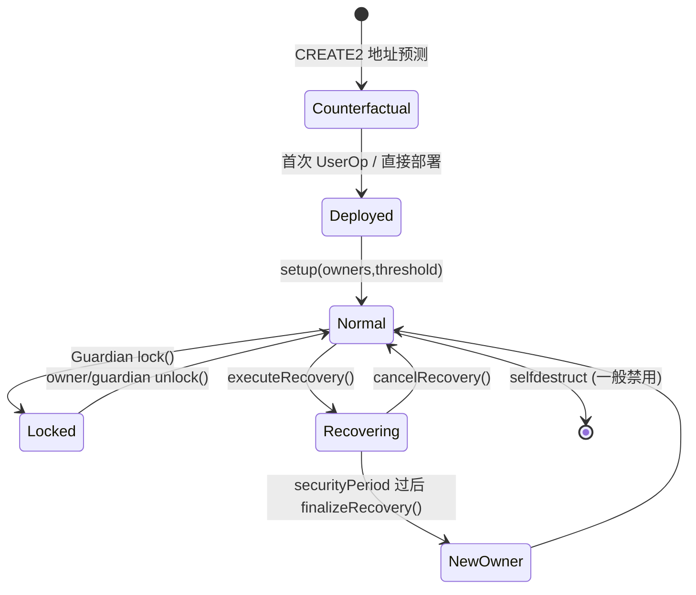

# 智能合约钱包（Smart Contract Wallet, SCW）

> **TL;DR**：**智能合约钱包** 把"账户"的定义从"一把 ECDSA 私钥"换成"**一段可验证的合约字节码**"——"谁、在何种条件下、能动哪些资产"完全由代码决定。本篇先彻底拆解 SCW 的通用抽象（授权函数、EIP-1271/4337 接口、签名方案空间、状态机），再按产品独立讲解四条主路线：**Safe**（Singleton+Proxy 多签）、**Argent**（Module 聚合 + Guardian 恢复）、**ERC-4337 原生 SCW**（SimpleAccount / ZeroDev Kernel）、以及 **Starknet 原生 AA**（Argent X / Braavos）。EIP-7702 于 2025-05 Pectra 上线后，EOA 本身也能"临时变合约"，EOA 与 SCW 的边界正在融合。本内容不构成投资建议。

---

## 1. 背景与动机

EOA（Externally Owned Account）把"账户身份"与"secp256k1 私钥"绑死：一把私钥即是账户本身，一旦泄露即是全部资产暴露；一旦丢失，资产即永久锁定。这个设计在比特币时代是合理的极简主义，但在 DeFi 与移动端主导的当代 Web3 中暴露了四类固有缺陷：

1. **授权规则不可编程**：EOA 只有"单签"一种授权模式，无法表达"白天限额、大额多签、特定合约免确认"等自然需求。
2. **密钥管理二元化**：要么明文存手机，要么硬件签名冷战式体验；没有"渐进式信任"的中间态。
3. **用户体验天花板**：每笔交易必须用户亲手签名，无法把多步 DeFi 操作打包为一次授权；gas 代付也需要额外协议层。
4. **升级与抢救能力缺失**：账户一旦被钓鱼，资产转出的窗口只有几秒，无法在链上表达"撤销 + 冻结 + 恢复"的生命周期。

2017 年 Parity Multisig 两次事件（7 月 $30M 被盗、11 月 library selfdestruct 导致 $150M ETH 永久冻结）既是警钟也是催化剂：**把钱包做成合约的红利和风险都被放大了**。Gnosis 团队据此重写 **Gnosis Safe**（2018，后更名 Safe），以"最小核心 + 模块化扩展 + 多轮审计"为哲学；同年 Itamar Lesuisse 创立 **Argent**，从消费者视角提出"取消助记词"，用 **Guardian + 手机** 作为密钥恢复方。2021 年 EIP-4337 草案把 SCW 推入标准化赛道，2025-05 Pectra 的 EIP-7702 进一步让 EOA 本身可以"临时附身合约"。至 2026-04，Safe 合约地址上锁定的 TVL 超过 $100B（来源 DefiLlama、Dune Safe 仪表盘），构成以太坊上最大的链上资金托管层。

SCW 的核心回答只有一句：**"私钥的'授权权力'能否由代码定义？"**——不仅可以，而且可以做远超 EOA 的事情。

---

## 2. 核心原理

本节不讨论任何具体产品；只拆解 SCW 作为一个抽象对象的形式化定义、接口标准、签名空间、状态机与失败模式。产品级设计在第 3 节分别展开。

### 2.1 形式化定义：合约账户即"可编程授权机"

把一个合约账户 `W` 抽象为一个二元函数族：

```
W := (validate, execute)

validate : (opHash, auth, ctx) → {OK, FAIL}
execute  : (targets, values, calldatas, mode) → receipts
```

- `opHash`：待授权操作的摘要（对 Safe 为 EIP-712 `SafeTxHash`，对 4337 为 `userOpHash`）。
- `auth`：授权材料，既可以是单个 ECDSA 签名，也可以是"m 个签名 + 恢复证明 + session token"的复合结构。
- `ctx`：调用上下文，包括 `msg.sender`、`block.timestamp`、`nonce`、"当前是否处于 lock 期"等。
- 返回：`OK` 才允许进入 `execute`；`FAIL` 则 revert。

**EOA 是该函数族的退化实例**：`validate(h, sig) = ecrecover(h, sig) == owner`，`execute` 则是 EVM 原生的交易派发。SCW 的超能力源自把 `validate` 变成一段任意逻辑——任何可在 EVM 内表达的断言都能作为授权规则。

不变式（Invariant）：
- `I1 — 单调 nonce`：`execute` 成功后 `nonce` 必须 +1，或以等价的 `usedOpHash[opHash] = true` 标志防止重放。
- `I2 — 授权闭包`：任何能修改 `validate` 行为的函数（owner 变更、module 添加）本身必须经过 `validate` 校验（self-call 或 self-authorized modifier）。
- `I3 — 可预测地址`：SCW 地址应能在部署前由 `CREATE2(factory, salt, initCode)` 确定，以便 counterfactual 打款——这是 4337 的 `initCode` 字段依赖的前提。

### 2.2 与 EOA 对比的五大差异

| 维度 | EOA | SCW |
| --- | --- | --- |
| 账户身份 | 由私钥派生 `address = keccak(pub)[-20:]` | 由合约部署地址决定（支持 CREATE2 预定） |
| 签名方案 | 仅 secp256k1 ECDSA | 任意：ECDSA、P-256 (WebAuthn)、Schnorr、BLS、ZK proof |
| 交易入口 | `eth_sendRawTransaction`（需 gas 在账户内） | `execTransaction`（任意 caller 支付 gas） / 4337 `handleOps` |
| 状态存储 | 仅余额 + nonce | 任意字段（owners、guardians、limits、session keys） |
| 可升级性 | 永久不可变 | 通过 Proxy pattern 或模块热插拔升级 |

正是这五条差异撑起 SCW 的所有高级特性：多签、社交恢复、限额、批量、会话 key、gas 代付、keyless 登录（WebAuthn/Passkey）、ZK 白名单、自动化支付。

### 2.3 通用接口标准矩阵

SCW 生态由几条 ERC/EIP 织成互操作网：

- **EIP-712（Typed Data）** — 所有 SCW 的 `opHash` 都用 EIP-712 结构化签名，避免"盲签任意 bytes"的钓鱼面。
- **EIP-1271 `isValidSignature(hash, sig) → 0x1626ba7e`** — 让 DApp 用单一接口校验合约账户签名；Uniswap Permit2、OpenSea、Safe{Wallet} 都依赖它。
- **EIP-6492 (pre-deploy signatures)** — 解决"SCW 尚未部署但要预先签名"的场景：签名里打包 `factory + initCode + innerSignature`，验证方先反事实验证，再 delegatecall 合约验签。
- **EIP-4337（Account Abstraction）** — 把 SCW 推到协议级标准：`EntryPoint` 合约负责 `validateUserOp` + `handleOps`，`Paymaster` 代付 gas，`Bundler` 承担 mempool。
- **EIP-7579（Minimal Modular Smart Accounts, MSA）** — 极简模块接口：`installModule(type, module, data)` + `execute(mode, calldata)`；模块分类为 Validator / Executor / Fallback / Hook。
- **EIP-6900（Modular Smart Contract Accounts）** — 更完整但更重的模块标准，定义 manifest 与权限细粒度控制；与 ERC-7579 并存。
- **EIP-7702（Set Code for EOAs, Pectra 2025-05）** — 让 EOA 在一笔交易内临时拥有合约代码，是"EOA→SCW 零摩擦升级"的原生通道。

### 2.4 签名方案空间

SCW 把"合法授权"与"ECDSA"解耦，于是签名方案成为设计空间：

1. **单 ECDSA（secp256k1）**：最简单，等价 EOA；4337 SimpleAccount 默认选项。
2. **m-of-n ECDSA**：n 个 owner 各自签名，合约内逐个 `ecrecover`，按地址升序防止重复。Safe 与 Gnosis 时期的多签核心。
3. **EIP-1271 嵌套**：一个 owner 本身也可以是合约账户（另一个 SCW），形成合约套合约的多层授权。
4. **WebAuthn / Passkey（P-256）**：硬件安全芯片或设备 Secure Enclave 产生 secp256r1 签名，需链上 P-256 验证（Ethereum EIP-7212 precompile / Solana 原生）。体验为"无密钥、生物识别"。
5. **BLS / Schnorr / FROST**：支持链上聚合多签一次验证，节省 gas。
6. **门限签名 (TSS/MPC)**：链下多方生成一把 ECDSA 签名，对链上视为单签。常与 SCW 组合为"MPC-SCW 混合"。
7. **ZK 断言**：通过 zk-SNARK 证明"知道满足某策略的秘密"，链上只验证 proof。典型应用：隐私白名单、Passkey 身份 ZK 包装。

一个 SCW 可以同时支持多条路径：主路径 ECDSA，备份路径 Guardian 多签，紧急路径 ZK 社恢。

### 2.5 核心子机制

把 SCW 拆成可单独实现的 6 个子机制，产品差异主要体现在它们的组合方式：

1. **多签 / 门限（Multi-sig）** — `validate` 里收集并校验 m 个独立签名；常用 EIP-712 + 升序 owner 地址去重。
2. **模块 (Modules)** — 外部授权合约，经 owner 明确启用后可以在不走 m-of-n 的路径下执行特定动作（定时支付、限额转账、4337 入口）。
3. **守卫 (Guards / Hooks)** — `preExecute/postExecute` 钩子，对 `execute` 的参数做黑白名单检查；实现"禁止向非白名单合约 delegatecall"等策略。
4. **社交恢复 (Guardians)** — n 个 Guardian 的多数批准即可改写 `owner`，通常伴随 **锁定期** 与 **取消窗口** 防止恶意发起。
5. **会话密钥 (Session Keys)** — 临时 sub-key，带过期时间 / 目标合约白名单 / 金额上限，常用于游戏与高频 DeFi，避免每步都弹钱包。
6. **原子批量 (Batching / Multicall)** — 一次 `execute` 内顺序调用多个子操作，任一失败全部回滚；EIP-5792 `wallet_sendCalls` 把这条能力暴露给 DApp。

### 2.6 关键参数与常量（产品无关的通用口径）

| 参数 | 典型范围 | 说明 |
| --- | --- | --- |
| `threshold` | 1–n | m-of-n 多签的 m |
| `n` (owners/guardians) | 1–~50 | 实际由 gas 上限约束 |
| 恢复锁定期 | 24–72 h | Argent 默认 36 h |
| Session key expiry | 分钟–天 | 由策略决定 |
| 部署 gas | 150k–350k | 单次，CREATE2 Proxy |
| validate gas | 20k–80k | 按签名类型线性增加 |
| 4337 handleOps 开销 | 额外 ~40k | EntryPoint + bundler bookkeeping |

### 2.7 边界条件与失败模式

- **密钥完全丢失**：若未启用恢复模块，SCW 资产仍会永久锁定——合约架构本身不"免疫"丢钥。
- **Module 越权**：模块一旦启用就等同 root access；恶意或被攻破的 module 即全账户失陷（参见 2025-02 Bybit 事件）。
- **EIP-1271 盲签**：若 owner 对 DApp 发来的任意 hash 盲签，链下签名可被二次利用；正确做法是让 DApp 传"人类可读"的 EIP-712 结构。
- **Init race**：Proxy 部署与 `setup()` 必须在同一 bundle，否则前端可被抢跑改写 owners（Safe 通过 `createProxyWithNonce` 原子化解决）。
- **Gas grief**：refund 机制若未妥善设置 gasPrice 上限，relayer 可在交易中骗取过量 ETH；Safe v1.4 修正了历史实现。
- **Delegatecall 风险**：任何允许 `delegatecall` 的 module 都可覆盖本地 storage；需显式 guard 或 `onlySelfCall`。
- **4337 reputation 惩罚**：`validateUserOp` 不得访问禁止的 opcode / storage slot，否则 bundler 将拒绝；直接影响 SCW 实现自由度。

### 2.8 Mermaid：SCW 通用状态机



ASCII 授权路径：

```
UserOp ──► validate() ──► [sigType switch]
                            ├── ECDSA      ─► ecrecover
                            ├── EIP-1271   ─► call other SCW
                            ├── session    ─► scope + expiry check
                            └── guardian   ─► m-of-n over guardians
                   ─► preExecute guard ─► execute() ─► postExecute guard
```

---

## 3. 架构剖析（按产品独立展开）

本节把四条主路线分别讲透，不做跨产品穿插。每小节先给分层视图，再列核心合约清单，再追一条端到端数据流。

### 3.1 Safe（Singleton + Proxy 多签标准）

#### 3.1.1 分层视图

```
┌────────────────────────────────────────────────┐
│ UI: Safe{Wallet} Web / Mobile / SDK            │
├────────────────────────────────────────────────┤
│ Safe Transaction Service (off-chain 签名聚合)  │
├────────────────────────────────────────────────┤
│ Safe SDK (protocol-kit / api-kit / relay-kit)  │
├────────────────────────────────────────────────┤
│ SafeProxy (per-wallet instance, delegatecall)  │
├────────────────────────────────────────────────┤
│ Safe Singleton (共享实现)                      │
│   Safe.sol : OwnerManager / ModuleManager      │
│              / GuardManager / FallbackManager  │
│              / SignatureDecoder / ...          │
├────────────────────────────────────────────────┤
│ Modules: 4337Module / AllowanceModule / ...    │
└────────────────────────────────────────────────┘
```

#### 3.1.2 核心合约清单（`safe-global/safe-smart-account @ v1.4.1-3`）

| 合约 | 路径 | 职责 |
| --- | --- | --- |
| `Safe` | `contracts/Safe.sol` | Singleton 核心执行合约 |
| `SafeProxy` | `contracts/proxies/SafeProxy.sol` | 极简 proxy，转发 delegatecall |
| `SafeProxyFactory` | `contracts/proxies/SafeProxyFactory.sol` | CREATE2 部署 + 原子 setup |
| `OwnerManager` | `contracts/base/OwnerManager.sol` | 链表结构维护 owners，O(1) 增删 |
| `ModuleManager` | `contracts/base/ModuleManager.sol` | `enableModule` / `execTransactionFromModule` |
| `GuardManager` | `contracts/base/GuardManager.sol` | 交易前后 hook（`checkTransaction` / `checkAfterExecution`） |
| `FallbackManager` | `contracts/base/FallbackManager.sol` | 未匹配调用委托到可配置 handler（常为 `CompatibilityFallbackHandler` 以支持 EIP-1271） |
| `SignatureDecoder` | `contracts/common/SignatureDecoder.sol` | 定长 65 字节切片解析 |
| `MultiSendCallOnly` | `contracts/libraries/MultiSendCallOnly.sol` | 批量 `call`（禁止 `delegatecall` 的安全变体） |

#### 3.1.3 端到端数据流：部署 Safe + 首次多签转账

1. 用户在 Safe UI 选 `owners=[A,B,C]`、`threshold=2`、`saltNonce=k`。
2. SDK 构造 `initializer = Safe.setup(owners, threshold, fallbackHandler, ...)` 的 calldata。
3. 调 `SafeProxyFactory.createProxyWithNonce(singleton, initializer, k)` → 内部先 `CREATE2` 部署 Proxy，再用返回地址 delegatecall 执行 `setup()`，两步原子。
4. UI 以 `CREATE2(factory, keccak(initializer‖k), proxyCreationCode)` 预测地址——counterfactual 成立，地址可在部署前使用。
5. Owner A 构造 `SafeTx{to,value,data,op,safeTxGas,baseGas,gasPrice,gasToken,refundReceiver,nonce}`，对其 EIP-712 `SafeTxHash` 做 ECDSA 签名。
6. Owner A 把 hash + sig 分享给 Owner B，B 同样签名；UI 把 2 个 65-byte 签名按 **owner 地址升序** 拼接。
7. 任一 relayer 调 `execTransaction(...)` + 拼接签名。Safe 内部依次：(a) 计算 `safeTxHash` (b) `checkSignatures` (c) `nonce++` + emit (d) `execute(to,value,data,op)`。
8. 成功即触发 target call（`op==Call` 或 `op==DelegateCall`），否则整笔回滚。

#### 3.1.4 设计要点

- **Singleton+Proxy 的价值**：所有 Safe 实例共享 ~20KB 的逻辑代码，新部署只是 ~150 字节的 Proxy。审计一次即覆盖全网。
- **owners 链表**：`owners[SENTINEL] → firstOwner → … → SENTINEL`，`addOwnerWithThreshold` 与 `removeOwner` 都是 O(1)；额外校验 `currentOwner > lastOwner`（升序）防止同一签名重复计数。
- **签名多态**：`checkNSignatures` 支持四种 `v` 取值（见 §4.1），把 EIP-1271 合约签名、预批准 hash、`eth_sign` 包装、标准 EIP-712 合并在同一循环内。
- **Guard vs Module**：Guard 是全局前后钩子（每笔都执行），Module 是旁路授权；两者正交。2025-02 Bybit 事件中攻击者通过替换 UI 诱导 signer 把 module 指向恶意合约，提示 Module 列表是最敏感的 storage 区。
- **4337 融合**：官方 `safe-modules/4337` 把 `EntryPoint` 注册为一个"特殊 module"，`EntryPoint.handleOps` 在 Safe 里通过 module 路径触发，绕开 owner m-of-n 完成 UserOp 验证。

### 3.2 Argent（V2 consolidated Module + Guardian 恢复）

Argent V1（2019）用单模块封装全部逻辑；V2（2020）拆成 GuardianManager / RecoveryManager / TransferManager 等多个 Module；到 **2.5.1（2021-05）** 官方又将它们合并回一个 `ArgentModule`，以减少跨模块调用成本并简化升级路径。本文以 2.5.1 为基准。

#### 3.2.1 分层视图

```
┌─────────────────────────────────────────────┐
│ Argent App (iOS / Android / Web)            │
├─────────────────────────────────────────────┤
│ Relayer Service（gas 代付 + 签名转发）      │
├─────────────────────────────────────────────┤
│ BaseWallet (per-user proxy)                 │
│  - owner                                    │
│  - modules mapping                          │
│  - invoke(target,value,data)                │
├─────────────────────────────────────────────┤
│ ArgentModule (singleton, 被所有 wallet 共享)│
│  ├── BaseModule (通用校验/升级)             │
│  ├── RelayerManager (EIP-712 meta-tx)       │
│  ├── SecurityManager (Guardians + Recovery) │
│  └── TransactionManager (多签 exec / Session)│
├─────────────────────────────────────────────┤
│ DappRegistry (白名单合约与权限标签)         │
└─────────────────────────────────────────────┘
```

#### 3.2.2 核心合约清单（`argentlabs/argent-contracts @ 2.5.1`）

| 合约 | 路径 | 职责 |
| --- | --- | --- |
| `BaseWallet` | `contracts/wallet/BaseWallet.sol` | 每个用户的钱包实例；保存 `owner` + `modules` |
| `ArgentModule` | `contracts/modules/ArgentModule.sol` | 聚合所有行为的单一 Module |
| `BaseModule` | `contracts/modules/common/BaseModule.sol` | 升级与模块生命周期 |
| `RelayerManager` | `contracts/modules/RelayerManager.sol` | `execute()` meta-tx 入口、gas refund 逻辑 |
| `SecurityManager` | `contracts/modules/SecurityManager.sol` | Guardians 管理、`lock/unlock`、Recovery 三阶段 |
| `TransactionManager` | `contracts/modules/TransactionManager.sol` | `multiCall`、`multiCallWithSession`、白名单检查 |
| `DappRegistry` | `contracts/infrastructure/dapp/DappRegistry.sol` | 合约白名单 + 行为过滤器 |
| `TransferStorage` | `contracts/infrastructure/storage/TransferStorage.sol` | 持久化用户白名单 |

> 2.5.1 版本已没有独立的 `GuardianManager.sol` / `RecoveryManager.sol` / `TransferManager.sol`——这些逻辑被合并到 `SecurityManager.sol` 与 `TransactionManager.sol` 中。旧版本（2.2.x）仍保留独立文件，历史资料请锁定相应 tag。

#### 3.2.3 端到端数据流：Guardian 社恢流程

1. 用户在 App 中触发 "Recover my wallet"，输入目标 `newOwner`。
2. App 收集 ⌈n/2⌉+1 个 Guardian 的同意（每个 Guardian 对 `execute()` meta-tx 做 EIP-712 签名）。
3. Relayer 将聚合签名送入 `ArgentModule.execute(wallet, data=executeRecovery, signatures)`；内部路由至 `SecurityManager.executeRecovery(wallet,newOwner)`。
4. 合约进入 "Recovering" 状态：
   - 设置 `recovery.recoveryPeriod` 结束时间（默认 36 h）。
   - 调 `_setLock(wallet, block.timestamp + lockPeriod, LOCK_OWNER_CHANGE)`——此时钱包对所有 owner-权限交易锁定。
5. 若合法 owner 未在窗口内 `cancelRecovery`（需 owner + majority guardians 联签），则 `finalizeRecovery` 可被任何人触发，合约执行 `IWallet(wallet).setOwner(newOwner)` 完成所有权转移。

#### 3.2.4 设计要点

- **Wallet vs Module 的分层**：逻辑集中在单例 `ArgentModule`，存储留在 `BaseWallet`。升级时用户只需迁移 `modules` 映射，不必部署新钱包。
- **Relayer 经济学**：每笔 meta-tx 内含 `refund(gasPrice, gasLimit, tokenPrice, refundAddress)` 字段，钱包用 ETH 或 ERC-20（含稳定币）向 relayer 补偿；`RelayerManager._refund` 会重算实际用量并卡 `gasPrice <= tx.gasprice`。
- **多策略签名**：`multiCall` 的函数级签名需求表（见 `ArgentModule._getRequiredSignatures`）定义了"转 whitelist 仅 owner / 添加 guardian 需 owner+guardian / executeRecovery 需多数 guardian"等 12+ 规则——这是 Argent 的安全模型核心。
- **Session Key（multiCallWithSession）**：`startSession(sessionKey, duration)` 由 owner 一次签名授予临时 key，该 key 可在 duration 内自由调用 whitelisted 合约；session 由 `TransactionManager._clearSession` 显式清理。
- **DappRegistry + Filter**：每个受信 dApp 都有一个 `Filter` 合约定义"允许的方法选择器 + 参数约束"；`multiCall` 在放行前会对每个子调用跑 filter。这是比 Safe Guard 更细粒度的前置防护。
- **与 Safe 的核心差异**：Argent 把 "恢复" 作为第一公民放入合约本体；Safe 则把恢复留给可选模块（Safe Recovery、Sygma）。Argent 的 Guardian 模型更亲近消费者，Safe 的 m-of-n 更亲近机构。

### 3.3 ERC-4337 原生 SCW（SimpleAccount 与 Kernel 两条路线）

ERC-4337 把"账户抽象"从 EOA 语义完全解耦到应用层合约：交易不再走 `eth_sendRawTransaction`，而是 `UserOperation` 经 Bundler 送入 **EntryPoint**，EntryPoint 先调用 SCW 的 `validateUserOp`（核查签名与付费前置），再调 `execute`（执行用户意图）。SCW 可以自由实现任意签名方案。

#### 3.3.1 参考实现：SimpleAccount（`eth-infinitism/account-abstraction @ v0.7.0`）

这是最小化的 4337 SCW：单 owner，ECDSA，无模块。阅读它是理解 4337 的最快路径。

- `contracts/samples/SimpleAccount.sol`
  - `address public owner;`
  - `execute(address dest, uint256 value, bytes calldata func)` — 单步调用
  - `executeBatch(address[] dest, uint256[] value, bytes[] func)` — 原子批量
  - `_validateSignature(PackedUserOperation calldata userOp, bytes32 userOpHash) → uint256 validationData` — `owner.recover(userOpHash) == owner ? 0 : SIG_VALIDATION_FAILED`
  - 继承 `BaseAccount`，后者实现 `validateUserOp` 的公共部分（付款、nonce 检查、授权到 EntryPoint）
- `contracts/core/EntryPoint.sol`
  - `handleOps(PackedUserOperation[] ops, address beneficiary)`：两阶段循环——先对每个 op 调 `_validatePrepayment`（内部调 `account.validateUserOp`），再进入 `_executeUserOp`。
  - `innerHandleOp`：捕获执行阶段的 revert，保留预付费即可（payMaster 可自选是否退款）。
- `contracts/samples/SimpleAccountFactory.sol`
  - `createAccount(address owner, uint256 salt)`：用 `new ERC1967Proxy{salt}(impl, init)` 做 CREATE2 部署，返回确定性地址。

**validateUserOp 的核心契约**：
1. 校验签名。
2. 支付到 EntryPoint 的 `depositTo(address(this))`——若 paymaster 存在则由 paymaster 处理。
3. **禁止访问** 非 SCW/paymaster 的 storage（ERC-7562 rules），否则 bundler 会将 UserOp 打入黑名单。

#### 3.3.2 模块化产品：ZeroDev Kernel（`zerodevapp/kernel @ v3.3`）

Kernel 是目前主流的"模块化 4337 SCW"内核之一，代表了 ERC-7579 方向的生产级实现。与 SimpleAccount 的差异可概括为：

- **验证器可插拔（Validator plugins）**：`Kernel` 不再硬编码单 owner，而是把 `validateUserOp` 委派给当前激活的 `IValidator` 实例；常见实现：`ECDSAValidator`、`WebAuthnValidator`、`PasskeyValidator`、`SessionKeyValidator`。切换方案只需安装/启用新 validator。
- **Execution hook 三元组**：每次 `execute(mode, calldata)` 可路由到 `IExecutor`（例：批量、`delegatecall`）；并可在 `Hook` 模块里写入限额、黑名单、时间锁等策略。
- **多身份并存**：Kernel 支持同时激活多个 validator + fallback validator；Passkey 主签名 + ECDSA 应急 + Session key 临时，三条路径共处一个钱包。
- **权限系统 (Permissions)**：v3 引入 `Permission` 抽象——一次安装即定义"哪个 validator 在哪些 selector + 哪些目标地址 + 哪些时间窗"内有效；比 Safe Module 粒度细至函数级。
- **与 ERC-7579 对齐**：`installModule(moduleType, module, initData)` / `uninstallModule` 完全遵循 ERC-7579，使 Kernel 账户可以直接复用 Biconomy、Safe v1.5（计划）、ZeroDev 等共享模块市场。

#### 3.3.3 端到端数据流：一笔 4337 UserOp 的生命周期

1. DApp 发起意图 → SDK（viem/account-kit/permissionless.js）构造 `UserOperation`，含 `sender, nonce, callData, callGasLimit, verificationGasLimit, preVerificationGas, maxFeePerGas, paymasterAndData, signature, initCode`。
2. 若 `sender` 尚未部署，`initCode` 填 `factory + createAccount(...)` 的 calldata；签名阶段用 EIP-6492 做"pre-deploy signature"。
3. UserOp 经 `eth_sendUserOperation` 送至 Bundler；Bundler 用 `eth_estimateUserOperationGas` + ERC-7562 opcode/storage 限制白名单过滤。
4. Bundler 聚合 N 笔 UserOp 成一笔 L1 tx，调 `EntryPoint.handleOps(ops, beneficiary)`。
5. EntryPoint 进入 validation loop：对每个 op 依次做 `_validatePrepayment`，内部先 `simulateValidation` 再真正 `account.validateUserOp(userOp, userOpHash, missingAccountFunds)`。
6. 进入 execution loop：EntryPoint 对 account 调 `innerHandleOp(callData)`；account 在 `execute`/`executeBatch` 中执行业务逻辑。
7. Paymaster（若有）在 validation 阶段已承诺付费；post-op 阶段 EntryPoint 会与 paymaster 结算。
8. 每笔 UserOp 产出一条 `UserOperationEvent`，客户端用 `sender + nonce` 关联回执。

### 3.4 Starknet 原生 AA（Argent X / Braavos）

Starknet 从第一天起就把"所有账户都是合约"作为 L1 协议级选择（没有 EOA），所以 SCW 在 Starknet 上不是扩展而是唯一形态。

- **Argent X (`argentlabs/argent-contracts-starknet @ v0.4.0`, Cairo 1.x)**：核心合约 `src/account/argent_account.cairo`。授权结构 = `owner signer + optional guardian + optional guardian_backup`。模型与 EVM Argent 对应：owner 为高频签名方，guardian 充当 "双因子"；`escape_owner` / `escape_guardian` 两条逃逸路径带 7 天延迟。
- **Braavos**：原生支持硬件 Passkey（iOS Secure Enclave / Android StrongBox），签名方案 `Stark curve + secp256r1`；"Multi-owner / daily limit / rate-limit" 是合约级字段。
- **Starknet 原生优势**：账户合约可直接声明 `__validate__` 与 `__execute__` 两个函数，protocol 层保证先 `validate` 再 `execute`，无需额外 EntryPoint——4337 的心智模型在 Starknet 是免费内置的。
- **签名域扩展**：Cairo 的 `poseidon` 哈希与 `stark curve` 原生支持 STARK-friendly 签名；同一合约可并行支持 Stark、ECDSA、Passkey 三种 `validate` 策略。

---

## 4. 关键代码 / 实现细节

以下代码块均来自官方仓库，**commit/tag 已在 frontmatter `primary_sources` 中锁定**。如未特别注明，省略的部分只是与本主题无关的样板代码。

### 4.1 Safe `checkNSignatures`

引用：`safe-global/safe-smart-account @ v1.4.1-3`，文件 `contracts/Safe.sol`，函数 `checkNSignatures` 约 L387–L436。

```solidity
function checkNSignatures(
    bytes32 dataHash,
    bytes memory data,
    bytes memory signatures,
    uint256 requiredSignatures
) public view {
    // signatures 每 65 字节编码一组 {v, r, s}
    require(signatures.length >= requiredSignatures * 65, "GS020");

    address lastOwner = address(0);
    address currentOwner;
    uint8 v; bytes32 r; bytes32 s;

    for (uint256 i = 0; i < requiredSignatures; i++) {
        (v, r, s) = signatureSplit(signatures, i);

        if (v == 0) {
            // 1) 合约签名（EIP-1271）：currentOwner 写在 r，偏移写在 s
            currentOwner = address(uint160(uint256(r)));
            bytes memory contractSig;
            assembly { contractSig := add(add(signatures, s), 0x20) }
            require(
                ISignatureValidator(currentOwner)
                    .isValidSignature(data, contractSig) == EIP1271_MAGIC_VALUE,
                "GS024"
            );
        } else if (v == 1) {
            // 2) 预批准 hash：通过 approveHash() 提前登记或是当前 msg.sender
            currentOwner = address(uint160(uint256(r)));
            require(
                msg.sender == currentOwner ||
                approvedHashes[currentOwner][dataHash] != 0,
                "GS025"
            );
        } else if (v > 30) {
            // 3) eth_sign 包装：还原 "\x19Ethereum Signed Message:\n32" 前缀
            currentOwner = ecrecover(
                keccak256(abi.encodePacked(
                    "\x19Ethereum Signed Message:\n32", dataHash)),
                v - 4, r, s
            );
        } else {
            // 4) 标准 EIP-712 签名
            currentOwner = ecrecover(dataHash, v, r, s);
        }

        // 升序 owner 防止同一 signer 被重复计数
        require(
            currentOwner > lastOwner &&
            owners[currentOwner] != address(0) &&
            currentOwner != SENTINEL_OWNERS,
            "GS026"
        );
        lastOwner = currentOwner;
    }
}
```

关键点：**四种签名类型在同一循环内切换**；升序 owner 地址是防重放的核心不变式；EIP-1271 递归验签使得"owner 本身是另一个 Safe"成为可能。

### 4.2 Argent `_getRequiredSignatures` 签名策略表

引用：`argentlabs/argent-contracts @ 2.5.1`，文件 `contracts/modules/ArgentModule.sol`，函数 `_getRequiredSignatures`。

```solidity
// 按调用的函数选择器返回 "需要几个签名 + 谁必须签"。
// OwnerSignature 枚举：Owner / Guardian / Both / Majority / Anyone
function _getRequiredSignatures(
    address _wallet,
    bytes calldata _data
) internal view returns (uint256, OwnerSignature) {
    bytes4 methodId = Utils.functionPrefix(_data);

    if (methodId == MULTI_CALL || methodId == ENABLE_ERC1155)      // 高频转账 / 白名单内调用
        return (1, OwnerSignature.Owner);
    if (methodId == MULTI_CALL_WITH_SESSION)                       // 走 session key
        return (1, OwnerSignature.Session);
    if (methodId == ADD_GUARDIAN || methodId == REVOKE_GUARDIAN)   // 添加/移除 guardian
        return (1, OwnerSignature.Owner);
    if (methodId == CANCEL_GUARDIAN_ADDITION                       // 取消待生效的 guardian
        || methodId == CANCEL_GUARDIAN_REVOKATION)
        return (1, OwnerSignature.Owner);
    if (methodId == EXECUTE_RECOVERY)                              // 社恢启动：多数 guardian
        return (_majorityOfGuardians(_wallet), OwnerSignature.Disallowed);
    if (methodId == CANCEL_RECOVERY)                               // owner + 多数 guardian
        return (1 + _majorityOfGuardians(_wallet), OwnerSignature.Both);
    if (methodId == FINALIZE_RECOVERY)                             // 锁期过后任何人可触发
        return (0, OwnerSignature.Anyone);
    // ... lock / transferOwnership / session 管理 / 模块变更 类同
}
```

该函数相当于一份"链上可读的权限矩阵"——把 Argent 的产品语义（"换 owner 必须多数 guardian 同意"）写成合约常量；审计者与用户都能以 ABI 为 source-of-truth 验证策略是否被偷偷改动。

### 4.3 SimpleAccount `_validateSignature`

引用：`eth-infinitism/account-abstraction @ v0.7.0`，文件 `contracts/samples/SimpleAccount.sol`，函数 `_validateSignature`（约 L127）。

```solidity
function _validateSignature(
    PackedUserOperation calldata userOp,
    bytes32 userOpHash
) internal virtual override returns (uint256 validationData) {
    // EntryPoint 已经把 userOp 哈希算好并去掉 signature 字段
    bytes32 hash = MessageHashUtils.toEthSignedMessageHash(userOpHash);

    if (owner != ECDSA.recover(hash, userOp.signature)) {
        return SIG_VALIDATION_FAILED;  // = 1
    }
    return SIG_VALIDATION_SUCCESS;    // = 0
}
```

返回值编码了 "validUntil / validAfter / aggregator"；SimpleAccount 直接用 0/1 表示"无限期有效 / 拒绝"。所有更复杂的 4337 账户（Kernel、Biconomy、Safe 4337 Module）都只是把这段换成 Validator 插件路由。

### 4.4 EntryPoint handleOps 主循环

引用：`eth-infinitism/account-abstraction @ v0.7.0`，文件 `contracts/core/EntryPoint.sol`，函数 `handleOps`。

```solidity
function handleOps(
    PackedUserOperation[] calldata ops,
    address payable beneficiary
) external nonReentrant {
    uint256 opslen = ops.length;
    UserOpInfo[] memory opInfos = new UserOpInfo[](opslen);

    // === 阶段 1：全部 UserOp 的 validation（需满足预付费）===
    unchecked {
        for (uint256 i = 0; i < opslen; i++) {
            UserOpInfo memory opInfo = opInfos[i];
            (uint256 validationData, uint256 pmValidationData) =
                _validatePrepayment(i, ops[i], opInfo);
            _validateAccountAndPaymasterValidationData(
                i, validationData, pmValidationData, address(0));
        }
    }

    // === 阶段 2：逐个执行并结算 gas / 退款 ===
    uint256 collected = 0;
    emit BeforeExecution();
    for (uint256 i = 0; i < opslen; i++) {
        collected += _executeUserOp(i, ops[i], opInfos[i]);
    }
    _compensate(beneficiary, collected);
}
```

两阶段循环的意义在于 **fail-fast**：若任一 op 的 validation 出问题整笔 L1 tx 回滚，bundler 承担 gas；execution 阶段的 revert 则被 `innerHandleOp` 内部吞掉——只损失该 op 的预付费，不会拖累其他 op。

### 4.5 Kernel v3 Validator 路由骨架

引用：`zerodevapp/kernel @ v3.3`，文件 `src/Kernel.sol`，函数 `validateUserOp`。

```solidity
function validateUserOp(
    PackedUserOperation calldata userOp,
    bytes32 userOpHash,
    uint256 missingAccountFunds
) external payable onlyEntryPoint returns (uint256 validationData) {
    // 从 nonce 的高位解析出本次使用的 validator id
    ValidationId vId = ValidationId.wrap(bytes21(userOp.nonce >> 64));
    ValidationManager.ValidationConfig storage cfg =
        _validationConfig(vId);

    // 委派给激活 validator 做真实签名校验
    validationData = IValidator(cfg.validator)
        .validateUserOp(userOp, userOpHash);

    // 若账户欠 EntryPoint 押金，一并补足
    if (missingAccountFunds != 0) {
        (bool ok,) = payable(msg.sender).call{value: missingAccountFunds}("");
        (ok);
    }
}
```

> Kernel 用 `userOp.nonce` 的高 21 字节编码 validator id，无需额外字段即可携带"本次 UserOp 走哪条授权路径"的信息；这是 ERC-7579 推荐的 multi-validator 路由技巧。

---

## 5. 演进与版本对比

| 产品 / 标准 | 版本 | 发布 | 关键变化 | 对外部影响 |
| --- | --- | --- | --- | --- |
| Gnosis Multisig | — | 2017 | 多签早期形态 | 奠定 m-of-n 心智 |
| Gnosis Safe | v1.0 | 2018 | Singleton + Proxy 架构 | 成本骤降，部署门槛打开 |
| Gnosis Safe | v1.3 | 2021-06 | `Guard` hook、MultiSend 重构 | 前后钩子成为标配 |
| Safe | v1.4.1 | 2023-11 | FallbackHandler 拆分、EIP-1271 强化、refund 修正 | 当前主线 |
| Safe{Core} | — | 2023 | Safe 品牌独立、SDK 现代化、4337 Module | 4337 生态入口 |
| Safe | v1.5（计划） | 2026 | 对齐 ERC-7579 模块接口 | 与 Kernel / Biconomy 模块市场互通 |
| Argent V1 | — | 2019 | Guardian 社恢首发 | 面向消费者的 UX 标杆 |
| Argent V2 | 2.0–2.4 | 2020–2021 | Module 拆分（Guardian/Recovery/Transfer） | 第三方可组合 |
| Argent | 2.5.1 | 2021-05 | Module 合并回 `ArgentModule` + `DappRegistry` | Gas 优化 + 权限表固化 |
| Argent X | v0.4.0 | 2024 | Starknet Cairo 1.x、Passkey 支持 | 原生 AA 代表 |
| ERC-4337 | draft → final | 2021–2023 | UserOp、EntryPoint、Paymaster | SCW 互操作标准 |
| EntryPoint | v0.6 → v0.7 | 2024 | `PackedUserOperation`、gas 经济优化 | 主流 bundler 升级 |
| ZeroDev Kernel | v3.3 | 2025-04 | ERC-7579 对齐、Permission 权限系统 | 模块化 4337 参考 |
| EIP-7702 | live | 2025-05 Pectra | EOA 临时附身合约 | EOA↔SCW 边界消融 |

---

## 6. 实战示例

### 6.1 用 `protocol-kit` 部署 Safe 2/3

```typescript
import Safe, { SafeFactory } from "@safe-global/protocol-kit";

const factory = await SafeFactory.init({ provider, signer });
const safe = await factory.deploySafe({
  safeAccountConfig: {
    owners: ["0xA...", "0xB...", "0xC..."],
    threshold: 2,
  },
  saltNonce: 42n,
});
console.log("Safe at", await safe.getAddress());

const tx = await safe.createTransaction({
  transactions: [{ to, value, data }],
});
const signed = await safe.signTransaction(tx);
// 把 signed.signatures 送给 owner B；owner B 也 signTransaction
const receipt = await safe.executeTransaction(signedWithAllOwners);
```

### 6.2 用 `permissionless.js` 发送一笔 Kernel UserOp

```typescript
import { createSmartAccountClient } from "permissionless";
import { signerToEcdsaKernelSmartAccount } from "permissionless/accounts";
import { createPimlicoClient } from "permissionless/clients/pimlico";

const account = await signerToEcdsaKernelSmartAccount(publicClient, {
  signer,
  entryPoint: "0x0000000071727De22E5E9d8BAf0edAc6f37da032", // v0.7
  version: "0.3.1",
});

const paymasterClient = createPimlicoClient({ transport: http(PIMLICO_URL) });
const aaClient = createSmartAccountClient({
  account,
  chain: sepolia,
  bundlerTransport: http(BUNDLER_URL),
  paymaster: paymasterClient,
});

const hash = await aaClient.sendTransaction({
  to: tokenAddr,
  data: encodeFunctionData({ abi: erc20Abi, functionName: "transfer",
                             args: [recipient, 1n * 10n ** 18n] }),
});
```

### 6.3 Argent 发起社交恢复（链上 meta-tx 视角）

```javascript
// Guardian 端对 executeRecovery 做 EIP-712 签名
const safeTx = {
  to: argentModule.address,
  value: 0,
  data: argentModule.interface.encodeFunctionData("executeRecovery", [wallet, newOwner]),
  nonce: await relayer.getNonce(wallet),
};
const digest = buildArgentDigest(wallet, safeTx); // EIP-712 over wallet + module + nonce
const sigG1 = await guardian1._signTypedData(domain, types, safeTx);
const sigG2 = await guardian2._signTypedData(domain, types, safeTx);
const merged = sortByAddressAsc([sigG1, sigG2]).join("");

// Relayer 打包上链
await argentModule.execute(wallet, safeTx.data, merged);
```

---

## 7. 安全与已知攻击

| 事件 | 年份 | 损失 | 根因 |
| --- | --- | --- | --- |
| Parity Multisig v1 | 2017-07 | $30M | `initWallet` 未初始化即可被外部调用 |
| Parity Multisig 库 selfdestruct | 2017-11 | $150M 冻结 | 未保护的 library `selfdestruct` |
| Rubic Exchange | 2022 | $1.4M | Safe module 权限被利用 |
| Radiant Capital | 2024-10 | $50M | 多名 multisig signer 签名设备被植入恶意固件 |
| Bybit | 2025-02 | $1.46B | Safe{Wallet} 前端被替换 + signer 盲签 delegatecall；Lazarus 归因 |
| 持续存在 | — | — | EIP-1271 盲签、钓鱼 UI 替换、恶意 module install |

**教训**：(i) Safe{Wallet} 这样的"官方前端"本身是信任边界的一部分——2025 Bybit 事件完全绕过合约层而在 UI 层得手；(ii) 任何允许 `delegatecall` 的 module 或路径都应被视作 root；(iii) 合约钱包不能替代硬件隔离——多数被盗案例的最后一米仍是私钥设备失守。

---

## 8. 与同类方案对比

| 维度 | Safe | Argent (EVM) | 4337 原生（SimpleAccount/Kernel） | Starknet AA (Argent X/Braavos) | EOA | EIP-7702 EOA |
| --- | --- | --- | --- | --- | --- | --- |
| 账户形态 | Proxy → Singleton | BaseWallet + Module | Proxy → Impl（可带 plugin） | 纯合约（协议级 AA） | 私钥 | 临时附身合约 |
| 多签 | m-of-n 强 | 可选 | 取决于 validator | 可选（owner+guardian） | ✗ | 通过附身合约达成 |
| 社交恢复 | 模块化（选装） | 原生（核心合约） | 通过 validator/hook | 原生（escape 机制） | ✗ | 附身期间 |
| Gas | 中–高 | 中（relayer 补偿） | 中（+EntryPoint overhead） | 中 | 低 | 低 |
| Session Key | 通过模块 | 原生 `multiCallWithSession` | Kernel 原生 | Braavos 原生 | ✗ | 附身期间 |
| 链兼容 | 几乎所有 EVM | EVM + Starknet 版本 | 所有部署 EntryPoint 的 EVM | 仅 Starknet | 所有 | 支持 Pectra 的 EVM |
| 机构场景 | 事实标准 | 少用 | 仍在起步 | 小众 | 仅托管 | 过渡形态 |
| 用户体验 | 偏机构 | 消费者优秀 | 取决于 SDK / paymaster | 消费者优秀 | 硬核 | 取决于前端 |

没有全局最优：机构托管走 Safe；消费者钱包走 Argent 或 Kernel+Passkey；新用户入门走 EIP-7702；跨链一致性走 Starknet 原生 AA。

---

## 9. 延伸阅读

- **官方文档 / Spec**
  - Safe docs — https://docs.safe.global/
  - Argent Security — https://www.argent.xyz/blog/wallet-security/
  - ERC-4337 — https://eips.ethereum.org/EIPS/eip-4337
  - ERC-7579 — https://eips.ethereum.org/EIPS/eip-7579
  - EIP-7702 — https://eips.ethereum.org/EIPS/eip-7702
  - Starknet AA — https://docs.starknet.io/architecture-and-concepts/accounts/
- **源码（本篇已锁定版本）**
  - `safe-global/safe-smart-account @ v1.4.1-3`
  - `argentlabs/argent-contracts @ 2.5.1`
  - `argentlabs/argent-contracts-starknet @ v0.4.0`
  - `eth-infinitism/account-abstraction @ v0.7.0`
  - `zerodevapp/kernel @ v3.3`
- **权威博客**
  - Richard Meissner, "How Safe works under the hood"
  - Argent Security blog 系列
  - Vitalik, "Why we need wide adoption of social recovery wallets"
  - Dror Tirosh（4337 主作者）on EntryPoint 经济学
- **审计报告**
  - Safe v1.4 审计：Trail of Bits、Ackee、Certora
  - Argent 2.5.x 审计：OpenZeppelin、Trail of Bits
  - ZeroDev Kernel v3：Spearbit、Cantina
- **相关 EIP**：1271 / 4337 / 6492 / 6900 / 7579 / 7702 / 7212（secp256r1 precompile）

---

## 10. 术语表

| 术语 | 英文 | 释义 |
| --- | --- | --- |
| 智能合约钱包 | Smart Contract Wallet, SCW | 把账户身份与授权规则写进合约的钱包 |
| 外部拥有账户 | Externally Owned Account, EOA | 由一把 secp256k1 私钥持有的传统账户 |
| 账户抽象 | Account Abstraction, AA | 把交易验证与执行规则交由合约决定 |
| 单例代理模式 | Singleton + Proxy | 多个 Proxy 共享一份实现代码的合约部署模式 |
| 模块 | Module | SCW 上被授权执行特定动作的外部合约 |
| 守卫 | Guard / Hook | 在 execute 前后运行的检查合约 |
| 监护人 | Guardian | 具有社恢批准权的第三方 |
| 会话密钥 | Session Key | 有范围限制与过期时间的临时 sub-key |
| 用户操作 | UserOperation / UserOp | ERC-4337 的链下意图结构 |
| 入口合约 | EntryPoint | ERC-4337 的协议级分发器 |
| Bundler | — | 聚合 UserOp 并上链的 relayer |
| Paymaster | — | 代付 gas 的合约 |
| 预部署签名 | Pre-deploy Signature | 合约未部署时生成可验证签名的方案（EIP-6492） |
| EIP-1271 | — | 合约签名验证标准，magic value `0x1626ba7e` |
| ERC-7579 | — | 极简模块化账户标准（Validator/Executor/Fallback/Hook） |

---

*Last verified: 2026-04-29*
