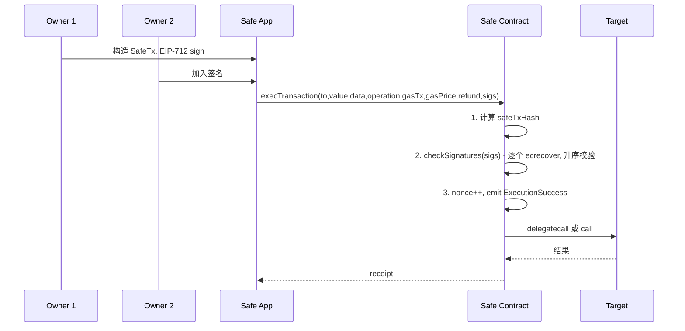

# 智能合约钱包（Safe / Argent）

> **TL;DR**：**智能合约钱包（SCW）** 把"账户"的定义从"一把 ECDSA 私钥"换成"**一段合约字节码**"——谁能动资产由代码定义。最典型的两个方向：**Safe（原 Gnosis Safe，2018）** 是机构级多签标准，已锁仓 $100B+；**Argent**（2018）面向消费者，主打 **Guardians 社交恢复 + 每日额度 + 安全模块**。SCW 的超能力：任意签名规则（ECDSA/Schnorr/WebAuthn/ZK）、多签、会话 key、原子批量交易、日限额、白名单、社交恢复、模块化升级。代价：合约部署与每次调用 Gas 更高、兼容性需 EIP-1271（签名）与 EIP-4337（UserOp）。在 EIP-7702（2025-05 Pectra）与 ERC-4337 成熟后，SCW 正在成为新用户的默认起点。

---

## 1. 背景与动机

2017 Parity Multisig 两次事件（7 月 $30M 被盗、11 月 $150M ETH 被永久冻结）揭示：**把钱包写成合约的同时也把密钥策略暴露在智能合约风险面下**。Gnosis 团队以此为契机 2018 年重写 **Gnosis Safe**，其安全哲学：**最小化核心合约面、模块化扩展、多审计迭代**。Argent 2018 年由 Itamar Lesuisse 创立，愿景是"**像网银一样好用的加密钱包**"：取消助记词，改为 Guardian + 手机作为恢复方式。

两者回答了同一个问题："私钥的"授权"能否由代码定义？答案——不仅能，而且能**做更多 EOA 做不到的事**。"

## 2. 核心原理

### 2.1 形式化：合约账户的授权函数

```
Account := contract Wallet {
    function validate(bytes32 opHash, bytes signature) returns (bool)
    function execute(address target, uint value, bytes data) external
}

AuthRule = validate 的内部实现可以任意，例：
- Safe: 对 opHash 收集 m 个 owner ECDSA 签名
- Argent: (owner ECDSA) or (guardians 多签恢复) or (session key + daily limit)
- WebAuthn SCW: 调用 P-256 预编译 + PublicKey
```

**EIP-1271 `isValidSignature(hash, sig) → 0x1626ba7e`** 给合约账户统一验签接口，让 DApp（如 Uniswap Permit2）无需改代码即可识别合约签名。

### 2.2 关键算法与数据结构

**Safe 核心存储（Singleton + Proxy 模式）**：

```solidity
// Safe singleton, delegatecall 目标
mapping(address => address) internal owners;  // 链表：owner → nextOwner
uint256 internal threshold;                     // m-of-n 的 m
uint256 public nonce;
mapping(bytes32 => uint256) public signedMessages; // EIP-1271
mapping(address => mapping(bytes32 => uint256)) public approvedHashes;
```

Safe 用链表存 owners（而非数组）以 O(1) 增删。Proxy 合约仅存 singleton 地址；每次调用通过 `delegatecall` 转发到 singleton，**所有 Safe 共享实现代码** → Gas / 审计效率高。

**Argent V2 模块化**：一个 `BaseWallet` + 若干 `Module`（GuardianManager、RecoveryManager、DappRegistry、ApprovedTransfer 等）。每模块可独立升级；用户通过 `addModule/removeModule` 开关功能。

### 2.3 子机制拆解

1. **多签 / 门限**：Safe `m-of-n`，各 owner 各自 ECDSA 签 Safe tx hash（EIP-712 结构化），按 owner 地址升序拼接后在 `execTransaction` 中逐一 ecrecover 验证。
2. **模块 (Modules)**：授权的外部合约，可在 Safe 上执行逻辑而不需收集 m 签名（如定时支付、Spending Limit、Recovery）。
3. **Guards**：`preExecute/postExecute` 钩子，可阻止危险调用（Safe{Wallet} Transaction Guard）。
4. **社交恢复 (Guardians)**：Argent 允许 n 个 Guardian（其他 Argent 用户、硬件钱包、email-key）中多数批准 → 重置 owner。
5. **会话 key / Session Key**：临时 sub-key，限期限额度、限目标合约，允许游戏/DeFi 一次授权多步执行。
6. **原子批量 (Multicall)**：一次 tx 内顺序执行多笔子调用，错一退回；Safe `MultiSendCallOnly`、Argent `executeTransactions`。

### 2.4 参数与常量

| 参数 | 典型值 | 说明 |
| --- | --- | --- |
| Safe threshold | 2/3, 3/5, 4/7 | 机构常见 |
| Owner 最大数 | 实际限 ~50，Gas 限制 | Gnosis 无硬上限 |
| Safe 部署 gas | ~300k | 一次性 |
| `execTransaction` gas | 50k–100k + 内部 | 每签名 ~2k |
| Argent daily limit | 用户设置 | UI 默认 $500 |
| Guardian 最小批准 | ⌈n/2⌉ + 1 | Argent V1 |
| Recovery lockout | 36 h 取消期 | Argent |
| Session key expiry | 小时–天 | 用户设置 |

### 2.5 边界条件与失败模式

- **Gas grief**：`execTransaction` 的 gasPrice 参数 & refund 机制可被 relayer 滥用 → Safe 1.4 重写。
- **Signature malleability**：EIP-2 强制 low-s；历史 Safe <1.3 曾有边界问题。
- **Owner key 全丢**：若无恢复模块且密钥全丢 → 资产永久锁定（需提前启用 Recovery Module）。
- **Module approval 失控**：第三方 Module 若被攻破等同于 full access；需审核。
- **Init race**：Safe proxy 部署+`setup` 必须在同一 bundle，否则抢跑改 owner。
- **EIP-1271 盲签**：DApp 发过来的 off-chain 签名若 Safe owner 盲签，可被滥用。

### 2.6 Mermaid：Safe execTransaction 流程



## 3. 架构剖析

### 3.1 分层视图（Safe）

```
┌──────────────────────────────────────────┐
│ UI: Safe{Wallet} Web / Mobile            │
├──────────────────────────────────────────┤
│ Safe Core SDK (protocol-kit, api-kit)    │
├──────────────────────────────────────────┤
│ Singleton Contract (Safe.sol)            │
│  - OwnerManager / ModuleManager / ...    │
├──────────────────────────────────────────┤
│ Proxy (each wallet instance)             │
├──────────────────────────────────────────┤
│ Modules (Spending Limit / Recovery / AA) │
├──────────────────────────────────────────┤
│ External: Relayer / 4337 Bundler         │
└──────────────────────────────────────────┘
```

### 3.2 核心模块清单

| 模块 | 职责 | 源码 (safe-smart-account) | 依赖 | 可替换性 |
| --- | --- | --- | --- | --- |
| Safe (singleton) | 核心执行 | `contracts/Safe.sol` | — | 低 |
| SafeProxy | 代理实例 | `contracts/proxies/SafeProxy.sol` | singleton | 低 |
| OwnerManager | owners 管理 | `contracts/base/OwnerManager.sol` | — | 低 |
| ModuleManager | 模块注册 | `contracts/base/ModuleManager.sol` | — | 中 |
| GuardManager | pre/post 钩子 | `contracts/base/GuardManager.sol` | — | 中 |
| FallbackHandler | 非匹配调用委托 | `contracts/handler/CompatibilityFallbackHandler.sol` | EIP-1271 | 高 |
| SafeProxyFactory | 部署工厂 | `contracts/proxies/SafeProxyFactory.sol` | CREATE2 | 中 |
| SignatureDecoder | 签名解码 | `contracts/common/SignatureDecoder.sol` | — | 低 |
| MultiSend | 批量 tx | `contracts/libraries/MultiSend.sol` | — | 高 |
| 4337Module | UserOp 入口 | safe-modules/4337 | EntryPoint | 高 |

Argent V2 的模块（精选）：`GuardianManager`, `RecoveryManager`, `TransferManager`, `ApprovedTransfer`, `DappRegistry`, `SessionKeyManager`。

### 3.3 数据流：创建 Safe + 首次转账

1. 用户 UI 选 owners + threshold = 2/3。
2. 前端计算 `initializer = Safe.setup(owners, threshold, ...)` calldata。
3. `SafeProxyFactory.createProxyWithNonce(singleton, initializer, saltNonce)` → CREATE2 部署 proxy，同时 delegatecall 调 setup。
4. Safe 地址可在部署前通过 CREATE2 预测（counterfactual）。
5. 用户转账：owner1 用 UI 签 EIP-712 `SafeTx`，分享 hash 给 owner2，同样签名。
6. Relayer（或任一 owner）调 `execTransaction`。
7. Safe 内部验签 → 执行 target call → emit 事件。

### 3.4 客户端多样性

| 工具/钱包 | 侧重 |
| --- | --- |
| Safe{Wallet} Web | 主流 UI |
| Safe Mobile | iOS/Android |
| Safe Apps | 内嵌 DApp 市场 |
| Candide / Pimlico | 4337 bundler 接入 |
| Argent X (Starknet) | Cairo 版合约钱包 |
| Argent Wallet (ETH L1/L2) | Guardian 恢复 |
| Braavos | Starknet 原生 SCW |
| Ambire | EOA+SCW 混合 |
| Biconomy Smart Account | 4337 SDK |
| ZeroDev Kernel | 模块化 4337 核 |

### 3.5 扩展 / 互操作接口

- **EIP-1271**：合约签名校验。
- **EIP-712**：结构化签名。
- **EIP-4337**：UserOp，SCW 成为 AA 天然底座。
- **EIP-5792**：`wallet_sendCalls` 让 dApp 批量调用合约钱包。
- **EIP-6900 (draft)**：模块化账户标准（MSCA）。
- **ERC-7579**：极简模块接口标准。
- **Safe Transaction Service**：跨客户端 off-chain 签名聚合。
- **4337 Bundler**：Pimlico、Alchemy、StackUp、Candide。

## 4. 关键代码 / 实现细节

Safe 核心 `checkSignatures` 验签（摘自 `safe-smart-account/contracts/Safe.sol`，tag `v1.4.1`）：

```solidity
function checkSignatures(bytes32 dataHash, bytes memory data, bytes memory signatures) public view {
    uint256 _threshold = threshold;
    require(_threshold > 0, "GS001");
    checkNSignatures(dataHash, data, signatures, _threshold);
}

function checkNSignatures(
    bytes32 dataHash, bytes memory data, bytes memory signatures, uint256 requiredSignatures
) public view {
    require(signatures.length >= requiredSignatures * 65, "GS020");
    address lastOwner = address(0);
    address currentOwner;
    uint8 v; bytes32 r; bytes32 s;
    for (uint256 i = 0; i < requiredSignatures; i++) {
        (v, r, s) = signatureSplit(signatures, i);
        if (v == 0) {
            // Contract signature via EIP-1271
            currentOwner = address(uint160(uint256(r)));
            bytes memory contractSig;
            // offset & length encoded in s
            assembly { contractSig := add(add(signatures, s), 0x20) }
            require(ISignatureValidator(currentOwner).isValidSignature(data, contractSig)
                    == EIP1271_MAGIC_VALUE, "GS024");
        } else if (v == 1) {
            // Approved hash (pre-approved via approveHash())
            currentOwner = address(uint160(uint256(r)));
            require(msg.sender == currentOwner || approvedHashes[currentOwner][dataHash] != 0, "GS025");
        } else if (v > 30) {
            // eth_sign wrapped (v-4)
            currentOwner = ecrecover(keccak256(abi.encodePacked(
                "\x19Ethereum Signed Message:\n32", dataHash)), v - 4, r, s);
        } else {
            currentOwner = ecrecover(dataHash, v, r, s);
        }
        require(currentOwner > lastOwner && owners[currentOwner] != address(0)
                && currentOwner != SENTINEL_OWNERS, "GS026");
        lastOwner = currentOwner;
    }
}
```

> 按 owner 地址升序校验避免重复签名；支持 4 种签名类型（合约、预批准、eth_sign、EIP-712）。

## 5. 演进与版本对比

| 版本 | 年份 | 变化 |
| --- | --- | --- |
| Gnosis Multisig | 2017 | 早期多签 |
| Gnosis Safe v1.0 | 2018 | Singleton+Proxy 架构 |
| Safe v1.3 | 2021 | Guard hook、multisend refactor |
| Safe{Core}SDK | 2023 | 品牌独立、4337 支持 |
| Safe v1.4 | 2023 | EIP-1271 加强、fallback handler 区分 |
| Safe v1.5 (计划) | 2026 | ERC-7579 模块接入 |
| Argent V1 | 2019 | 基础 Guardian |
| Argent V2 | 2020 | 模块化拆分 |
| Argent X (Starknet) | 2022 | Cairo 原生 AA |

## 6. 实战示例

用 `@safe-global/protocol-kit` 部署 Safe：

```typescript
import Safe, { SafeFactory } from "@safe-global/protocol-kit";
const factory = await SafeFactory.init({ provider, signer });
const safe = await factory.deploySafe({
  safeAccountConfig: {
    owners: ["0xA...", "0xB...", "0xC..."],
    threshold: 2,
  },
  saltNonce: 42n,
});
console.log("Safe deployed at", await safe.getAddress());
```

创建 tx 并收集签名：

```typescript
const tx = await safe.createTransaction({ transactions: [{ to, value, data }] });
const signed = await safe.signTransaction(tx);
// 把 signed.signatures 分享给其他 owner 签名
const execResult = await safe.executeTransaction(signedWithAll);
```

## 7. 安全与已知攻击

| 事件 | 年份 | 损失 | 教训 |
| --- | --- | --- | --- |
| Parity Multisig (不是 Safe) | 2017 | $30M + $150M 冻结 | 库合约 selfdestruct 风险 |
| Rubic exchange | 2022 | $1.4M | Module 权限被滥用 |
| Safe UI 钓鱼 | 持续 | — | 结构化签名必须审读 |
| Bybit $1.4B | 2025-02 | $1.4B | Safe UI 被 Lazarus 替换前端/盲签 delegatecall |
| Radiant Capital | 2024-10 | $50M | multisig signer 私钥被盗 3 个 |

## 8. 与同类方案对比

| 维度 | Safe | Argent | EOA | 4337 原生 SCW |
| --- | --- | --- | --- | --- |
| 多签 | 强 | 可选 | ✗ | 支持 |
| 社交恢复 | 模块化 | 原生 | ✗ | 可配置 |
| Gas | 中–高 | 中 | 低 | 中 |
| 链 | EVM 全 | ETH + L2/Starknet | 全 | EVM 支持 4337 |
| 机构适配 | 事实标准 | 个人 | ✗ | 新兴 |
| UX | 较硬核 | 优秀 | 中 | 取决于 SDK |

## 9. 延伸阅读

- **源码**：safe-global/safe-smart-account；argentlabs/argent-contracts。
- **文档**：docs.safe.global；argent.xyz/developers。
- **博客**：Richard Meissner "How Safe works"；Argent Security blog。
- **EIP**：EIP-1271 / 4337 / 6900 / 7579 / 7702。
- **审计**：G0 审计报告（Trail of Bits、OpenZeppelin、Ackee）。

## 10. 术语表

| 术语 | 英文 | 释义 |
| --- | --- | --- |
| SCW | Smart Contract Wallet | 合约账户钱包 |
| Singleton+Proxy | — | 实现合约共享 + 代理实例 |
| Module | — | Safe 的外部扩展合约 |
| Guard | — | Safe 交易前后钩子 |
| Guardian | — | Argent 社交恢复方 |
| Session Key | — | 有限范围的临时 sub-key |
| EIP-1271 | — | 合约签名标准 |
| ERC-7579 | — | 极简模块化账户标准 |

---

*Last verified: 2026-04-22*
