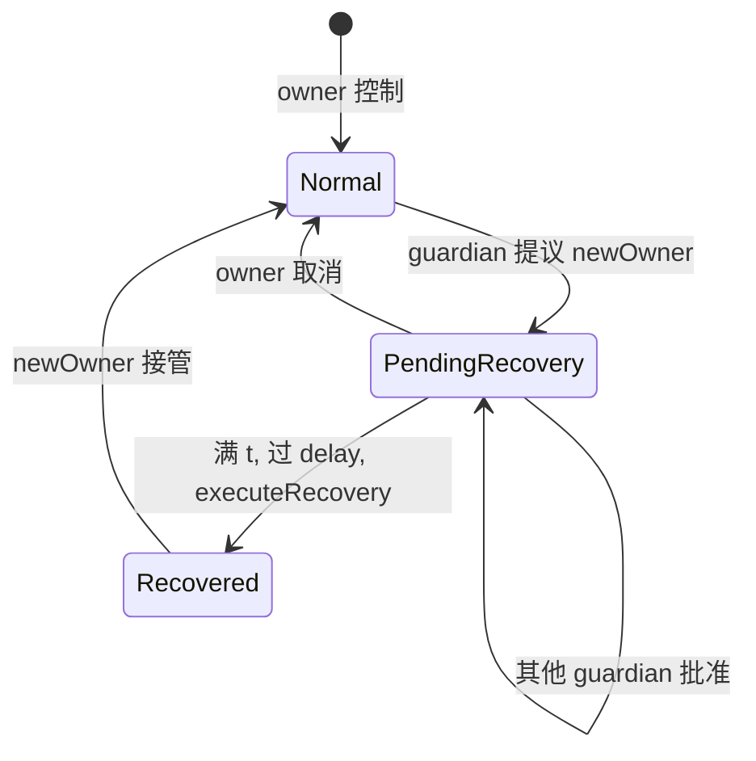

# 社交恢复（Social Recovery Wallet）

> **TL;DR**：**社交恢复** 用一组 **Guardians（担保人）** 取代（或补充）助记词作为 **Recovery Anchor**；当签名 key 丢失/被盗时，Guardians 多数批准即可把账户 owner 更换为新 key。Vitalik 2021-01 博文《Why we need wide adoption of social recovery wallets》为该范式奠定词典级地位。代表实现：**Argent**（原生内置 GuardianManager）、**Safe Recovery Module**、**Braavos**、**Coinbase Smart Wallet**、**Web3Auth tKey（MPC 2-of-3 分片：设备 / 设备 / 社交恢复 factor）**。设计核心：**Guardian 数量 n ≥ 3、阈值 t ≈ ⌈n/2⌉+1、恢复冷却 24–72h、UI 清晰的 Guardian 管理**。最大风险：**Guardian 共谋或被社工**，因此推荐 **Guardian 多样化（硬件 + 熟人 + 机构）+ 链上 Recovery Delay + 安全问题二次确认**。

---

## 1. 背景与动机

**助记词是反人类的设计**：12 个英文词须完美抄写、永不拍照、数十年后仍可取。遗失率触目惊心——Chainalysis 估算约 4 百万 BTC 永久无法取出。Vitalik 2021-01-11 博文指出："密码学家为了无信任而把钱包设计成'丢失即毁灭'；但人类的信任网络本身就是最好的恢复机制。" 他提出社交恢复三要素：

1. **主签名 key** 用于日常；
2. **Guardians 集合** 用于应急；
3. **时间锁** 防止 Guardian 被临时胁迫。

这不是新概念（2017 Argent 已实装 V1，2018 升级 V2），但在 ERC-4337 / EIP-7702 普及后，Guardian 机制可直接 **叠加在任何合约账户** 之上，成为 AA 基础能力之一。

## 2. 核心原理

### 2.1 形式化：Guardian 恢复模型

```
SocialRecoveryWallet {
    owner:          address        // 当前控制者
    guardians:      set<address>   // Guardian 集合 (|G|=n)
    threshold:      uint           // ≥ ⌈n/2⌉+1 建议
    recoveryDelay:  uint           // 24–72h cooldown
    pendingRecovery:{
        newOwner:   address
        approvals:  map<addr,bool>
        executeAt:  timestamp
    }
}

executeRecovery(newOwner) =
    require count(approvals) >= threshold
    require now >= executeAt
    owner := newOwner
    clear pendingRecovery

cancelRecovery() =
    require msg.sender == currentOwner OR ≥ threshold guardians
```

**时间锁的关键**：恶意 Guardian 联合发起恢复后，旧 owner 有 24–72 小时窗口 call `cancelRecovery()` 并转移资产。这是防 Guardian 合谋的主要闸门。

### 2.2 关键算法与数据结构

Argent V2 `RecoveryManager` 维护：

```solidity
struct RecoveryConfig {
    uint64 executeAfter;   // unix timestamp
    uint32 guardianCount;
    uint32 requiredApprovals;
    address recovery;      // new owner
}
mapping(address => RecoveryConfig) internal wallets;
mapping(address => mapping(address => bool)) internal approvals;
```

关键选择：
- **使用合约本身的 nonce**（而非 Guardian nonce）防重放。
- **Recovery 触发需 guardian 多签**（EIP-712 off-chain 批准，链上一次性提交）。
- **Owner 可立即 veto**：单方撤销 pending 即可。

### 2.3 子机制拆解

1. **Guardian 注册**：owner 指定初始 guardians；后续 `addGuardian/revokeGuardian` 需冷却期（防恶意改 guardian 前置）。
2. **恢复请求**：任一 guardian（或中间协调者）发起 `initiateRecovery(newOwner)`；广播供其他 guardians 签。
3. **批准聚合**：guardians 用 EIP-712 签 `{walletAddr, newOwner, expiry}`；达阈值后任何人提交 `executeRecovery`。
4. **时间锁**：`executeAfter = now + recoveryDelay`；期内 owner 可取消。
5. **Guardian 身份**：普通 EOA、硬件钱包、另一 Argent 钱包（"朋友圈套娃"）、甚至 **Sismo ZK badge**（匿名但可证身份）。
6. **Social + MPC 混合**：Web3Auth tKey 方案把 sk 切成 3 share：设备、设备、**Social Factor**（如 OAuth Google Sub + TSS 分片）。任 2 即可恢复。

### 2.4 参数与常量

| 参数 | 典型 | 说明 |
| --- | --- | --- |
| n (guardians) | 3–5 | ≥ 3 避免单点 |
| t (threshold) | ⌈n/2⌉+1 | Argent 默认 |
| recovery delay | 36 h | Argent V2 |
| add/revoke guardian 冷却 | 24 h | 防快速清洗 |
| owner change 冷却 | 24–48 h | 同上 |
| Guardian 身份 | ≥ 2 类型多样 | 防共谋 |
| 签名类型 | EIP-712 typed | 防盲签 |

### 2.5 边界条件与失败模式

- **Guardian 共谋**：若 t 个 guardian 串通，可直接夺权。缓解：多样化身份 + 延时 + 用户活体监控告警。
- **Guardian 全丢**：若 guardians 全失联（换手机、死亡），则资产不可恢复。缓解：预留 1 个"机构 Guardian"。
- **钓鱼 guardian approve**：攻击者发假恢复请求诱导 guardian 签。缓解：UI 显示 newOwner 标签、Guardian 安全问题。
- **Guardian 私钥自身被盗**：Guardian 自身也是 EOA，风险转嫁。
- **链下协调服务故障**：中心化后端宕 → 恢复阻塞。Argent 已做去中心化 fallback。
- **Forks / Chain Replay**：跨链恢复签名重放，需 chainId 绑定。

### 2.6 Mermaid：社交恢复流程



## 3. 架构剖析

### 3.1 分层视图

```
┌───────────────────────────────────────────┐
│ UX: 助记词 → "手机 + 邮箱 + 熟人"心智     │
├───────────────────────────────────────────┤
│ Recovery SDK: 协调通信 / 签名收集         │
├───────────────────────────────────────────┤
│ Guardian Registry (链上或链下 DID)        │
├───────────────────────────────────────────┤
│ Recovery Module (合约)                    │
├───────────────────────────────────────────┤
│ Smart Account Core (Safe/Argent/Kernel)   │
└───────────────────────────────────────────┘
```

### 3.2 核心模块清单

| 模块 | 职责 | 参考实现 | 依赖 | 可替换性 |
| --- | --- | --- | --- | --- |
| GuardianManager | 增删 guardian | argent-contracts `GuardianManager.sol` | Wallet | 中 |
| RecoveryManager | 恢复逻辑 | argent-contracts `RecoveryManager.sol` | GuardianManager | 中 |
| SafeRecoveryModule | Safe 插件 | safe-modules recovery | Safe core | 高 |
| tKey / MPC split | 3 share 社交 + 设备 | tkey/tkey | Web3Auth | 中 |
| Coordinator | 协调通知 Guardian | Argent 后端 | IPFS/Relay | 高 |
| Notification | 告警/邮件 | 各项目 | — | 高 |
| DID / ENS | Guardian 身份 | ENS / Sismo | 外部 | 高 |
| TimeLock | 冷却控制 | 内嵌 | — | 低 |
| UI Widget | 恢复流程界面 | Argent / Safe Kit | — | 高 |
| Audit Log | 防事后篡改 | 链上事件 | — | 低 |

### 3.3 数据流：Alice 丢失手机并恢复

1. Alice 发现主 key 丢失 → 用备用设备登录 Argent。
2. 点"恢复" → 输入新 key address。
3. SDK 通知已注册 guardians（推送 + 邮件）。
4. Guardian Bob 用自己的钱包 `approveRecovery(newOwner)`，EIP-712 签名上链。
5. Guardian Carol 同样批准 → 达阈值 2/3。
6. 合约记录 `executeAfter = now + 36h`，广播告警给"旧 owner 通知邮箱"。
7. 36h 后若 Alice（旧 owner）未取消 → `executeRecovery` 可由任何人调用。
8. 新 owner 生效，Alice 在新设备掌握控制权。

### 3.4 客户端多样性

| 方案 | 曲线 | 恢复机制 |
| --- | --- | --- |
| Argent V2 (ETH) | 合约 | Guardian + TimeLock |
| Argent X (Starknet) | Cairo | 类似 |
| Safe Recovery Module | 合约 | 增设模块 |
| Coinbase Smart Wallet | 4337 + Passkey | Passkey + Cloud |
| Web3Auth tKey | TSS | 3-share (device+device+social) |
| Privy | MPC | Web2 登录 + recovery 问答 |
| Lit Protocol | 网络 MPC | 节点门限 |
| Soul Wallet | 合约 | Guardian + ZK |

### 3.5 扩展接口

- **EIP-4337 RecoveryModule**：UserOp 触发 guardian 批准。
- **EIP-7702**：EOA 可临时委托至 recovery 合约做 rescue 操作。
- **EIP-5375 (draft)**：NFT 合约级托管/恢复结构参考。
- **ERC-6551**：Token-Bound Account + 社交恢复复合。
- **Sismo / Verax**：ZK 身份作 guardian。

## 4. 关键代码 / 实现细节

Argent `RecoveryManager.executeRecovery`（摘自 `argent-contracts/contracts/modules/RecoveryManager.sol`，简化）：

```solidity
function executeRecovery(address _wallet) external {
    RecoveryConfig storage config = recoveryConfigs[_wallet];
    require(config.executeAfter > 0, "RM: no recovery");
    require(config.executeAfter <= uint64(block.timestamp), "RM: ongoing period");

    address newOwner = config.recovery;
    delete recoveryConfigs[_wallet];

    // 通过 wallet 自身执行 setOwner
    IWallet(_wallet).setOwner(newOwner);
    emit RecoveryFinalized(_wallet, newOwner);
}

function cancelRecovery(address _wallet) external onlyOwnerOrSelf(_wallet) {
    require(recoveryConfigs[_wallet].executeAfter > 0, "RM: no recovery");
    delete recoveryConfigs[_wallet];
    emit RecoveryCanceled(_wallet);
}
```

## 5. 演进与版本对比

| 项目 | 年份 | 亮点 |
| --- | --- | --- |
| Argent V1 | 2018 | 首个社交恢复消费钱包 |
| Argent V2 | 2020 | 模块化 + DApp 审批 |
| Safe Recovery Module | 2023 | Safe 生态引入 |
| Coinbase Smart Wallet | 2024 | Passkey + social |
| Soul Wallet | 2023 | ZK 增强 guardian 匿名 |
| EIP-7702 Recovery | 2025 | EOA 引入 recovery 条目 |
| Clave / Ambire | 2023+ | Turnkey / MPC + guardian 混合 |

## 6. 实战示例

Argent CLI 添加 Guardian：

```
Argent App → Security → Guardians → Add
选择：ENS 地址 / 硬件钱包地址 / 朋友的 Argent 钱包
签名并等待 24h 生效
```

Safe + Recovery Module：

```typescript
import { createRecoveryModule } from "@safe-global/safe-recovery";
const mod = await createRecoveryModule(safe, {
  guardians: ["0xA...", "0xB...", "0xC..."],
  threshold: 2,
  recoveryDelay: 3600 * 36,
});
await safe.enableModule(mod.address);
```

## 7. 安全与已知攻击

| 事件 | 年份 | 教训 |
| --- | --- | --- |
| Argent 早期 UI bug | 2019 | pending recovery 显示不明确 |
| Guardian "睡眠钱包" | 持续 | 需定期 ping guardian 活性 |
| Ledger Recover 争议 | 2023 | 第三方托管 shard 激起社区反弹 |
| tKey OAuth 账户劫持 | 2022 | Sub 字段锁定 + 2FA |
| Telegram 钱包 guardian 钓鱼 | 2024 | 社工诱导 guardian 签名 |

## 8. 与同类方案对比

| 维度 | 社交恢复 | 助记词 | 单钱包多签 | MPC tKey |
| --- | --- | --- | --- | --- |
| 抗遗忘 | 强 | 弱 | 中 | 强 |
| 抗胁迫 | 时间锁 | 无 | 多签 | 中 |
| 抗共谋 | 多样 guardian | 无 | 多签本地 | 多 factor |
| 链上成本 | 低（仅恢复时）| — | 高 | 低 |
| UX | 好 | 差 | 差 | 好 |
| 依赖 | guardian 活性 | 纸质 | m/n | OAuth / TSS |

## 9. 延伸阅读

- **Vitalik** "Why we need wide adoption of social recovery wallets"（2021-01）。
- **Argent Docs** `argent.xyz/developers/contracts`。
- **Safe Recovery Module** `github.com/safe-global/safe-modules/tree/main/modules/recovery`。
- **Web3Auth tKey** docs。
- **论文**：Ernstberger et al. "Social Wallet Security"（2024）。
- **EIP**：EIP-4337、EIP-7702、EIP-5375。

## 10. 术语表

| 术语 | 英文 | 释义 |
| --- | --- | --- |
| Guardian | — | 担保人，辅助恢复 |
| Recovery Delay | — | 恢复冷却时间 |
| Threshold | — | 批准阈值 |
| Factor | — | tKey 中的一份 share 源 |
| Time Lock | — | 时间锁 |
| Veto | — | owner 撤销恢复 |
| DID | Decentralized Identifier | 去中心化身份 |

---

*Last verified: 2026-04-22*
