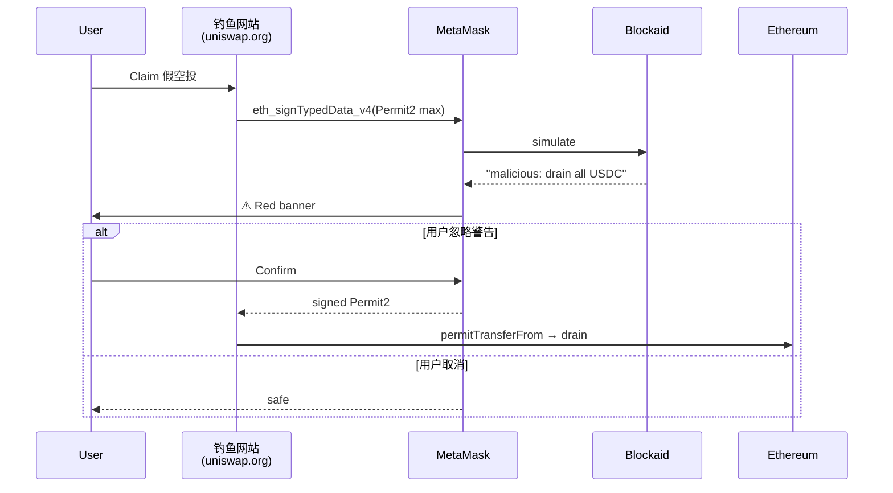

# 钱包安全（钓鱼 / 盲签 / 权限 / EIP-712 / 恶意 DApp）

> **TL;DR**：链上世界没有"撤销"按钮，钱包安全的本质是 **在签名那一刻保证用户意图与链上行为一致**。2023–2025 DeFi 钓鱼累计损失超 **$2.5B**（SlowMist Hacked 统计），绝大多数与 **盲签 + 授权滥用** 相关。核心防线四层：（1）**域名 / 合约来源判定**（反钓鱼）；（2）**签名解析 + 预执行模拟**（反盲签）；（3）**授权管理 revoke**（反过期授权）；（4）**硬件 + 结构化签名 EIP-712**（反 UI 劫持）。核心攻击模式：**Permit2 / setApprovalForAll 钓鱼**、**eth_sign 盲签 delegatecall**（Bybit $1.4B，2025-02）、**Drainer SaaS**、**前端 Connect Kit 注毒**（Ledger 2023-12）。防御原则："**Never sign what you can't read**"。

---

## 1. 背景与动机

区块链最革命性的属性也是最无情的属性：**不可逆**。2018 年前，加密损失多来自交易所被黑；2021 DeFi Summer 后，随 MetaMask 用户突破亿级，**对 EOA 直接下手**成为主流攻击路径——无需攻破节点/交易所，只要诱导 **用户自己签名** 即可。典型手法：

- **假官网 + 假连接钱包 widget**（DNS 钓鱼、Google Ads 投毒）。
- **Discord/Twitter 假空投**，诱导 approve。
- **Seaport/Permit2 off-chain 签名** 被盗卖 NFT。
- **Delegatecall 盲签**（Bybit 事件 2025-02-21，$1.4B ETH/stETH）。
- **前端 Connect Kit 供应链**（Ledger 2023-12-14，$600K）。
- **Drainer-as-a-Service** 租用工具包，分成钓鱼人 80%。

钱包厂商、浏览器、风控 API 共同构成 "防御栈"，但 **最终一环是用户自己看签名确认**。

## 2. 核心原理

### 2.1 形式化：签名攻击面分类

```
Intent = {who, what, how_much, to_whom, when, where}
Signature(Intent) 攻击 = Intent_declared ≠ Intent_onchain

攻击维度：
A. 目标错位: DApp 实际合约 ≠ 用户以为的合约（钓鱼域名）
B. 数据错位: 钱包展示 ≠ 实际 calldata（盲签）
C. 权限错位: 批准范围 > 所需（approve max / setApprovalForAll）
D. 时间错位: Permit 长期有效（Off-chain signed order 被后用）
E. 签名错位: eth_sign(hash) 可伪造任意交易
```

### 2.2 关键签名标准

**`personal_sign` / EIP-191**：`"\x19Ethereum Signed Message:\n" || len || msg`。安全：消息不含可执行语义。

**`eth_sign`（旧 RPC）**：直接签 32 字节 hash，无前缀。**极度危险**：hash 可被构造成 tx hash，导致任意交易签名。主流钱包（MetaMask）已默认禁用或给出红色警告。

**`eth_signTypedData_v4` / EIP-712**：结构化数据签名。

```
domain_separator = keccak256(EIP712Domain, name, version, chainId, verifyingContract)
type_hash = keccak256("Permit(address owner,address spender,uint256 value,...)")
hash_struct = keccak256(type_hash, ...fields)
digest = keccak256(0x19, 0x01, domain_separator, hash_struct)
σ = sign(digest, sk)
```

优势：(1) domain 绑定合约+链，防跨链/跨合约重放；(2) 类型化字段可在钱包 UI 人类可读展示。

**EIP-2612 Permit**：ERC20 off-chain 授权，免 Approve tx。语义字段：`owner, spender, value, nonce, deadline`。

**Permit2**（Uniswap，2022）：通用 Permit 中间层，一次授权 Permit2，后续所有 DApp 通过 signature-transfer 拉款。便利 + 危险并存。

### 2.3 子机制：攻击与防御

1. **钓鱼域名 / ICA 同形字**：`uniswаp.org`（西里尔 а）、Google Ads 投假广告。防御：PhishFort、ScamSniffer、钱包内置 phishing-controller。
2. **盲签**：钱包展示 hex calldata，用户无感。防御：Clear Signing（硬件 ABI plugin）、Blockaid/GoPlus 模拟展示 balance change。
3. **授权滥用**：approve(uint256.max)、setApprovalForAll、Permit2 max duration。防御：revoke.cash / etherscan tokenapprovalchecker 定期清理。
4. **Drainer 脚本**：一键窃取所有钱包里 NFT/token 的 Drainer-SaaS（Inferno, Pink, Angel, Monkey）。
5. **前端注毒**：Connect Kit、@walletconnect 版本劫持。防御：SRI（Subresource Integrity）、锁版本。
6. **社工 + 假空投**：Airdrop claim 页实际调 setApprovalForAll。
7. **DNS / BGP 劫持**：MyEtherWallet 2018 年 BGP 事件。防御：硬件钱包 + 地址白名单。

### 2.4 参数与常量

| 风控参数 | 典型 | 说明 |
| --- | --- | --- |
| Blockaid latency | 100–600 ms | 实时 |
| GoPlus API QPS 免费 | 30/s | 开发者 |
| revoke.cash batch | 50 approvals/tx | 节约 Gas |
| Permit2 expiration 建议 | 30 分钟 | DApp 行业实践 |
| MM phishing list | eth-phishing-detect | 社区维护 |
| 钱包红/黄警告阈值 | 可配 | 按 calldata 特征 |
| ScamSniffer DB | 80万+ 钓鱼域名 | 2025 统计 |

### 2.5 边界条件与失败模式

- **风控 API SPoF**：Blockaid 宕机 → 降级为黑名单。
- **新合约无信誉**：第 1 笔交易的合约未被任何 DB 收录 → 启发式模拟。
- **可升级代理**：今天安全，明天 upgrade 成恶意（类 UUPS rug）。
- **多签 UI 被替**：Bybit Safe UI 被朝鲜 Lazarus 替换前端展示"正常"但实际签 delegatecall。
- **移动端剪贴板劫持**：复制地址 → 贴时被换。
- **社工**："客服"诱导用户分享屏幕签名。

### 2.6 Mermaid：一次恶意签名解剖



## 3. 架构剖析

### 3.1 分层视图：钱包安全防线

```
┌─────────────────────────────────────────────┐
│ L1 UX: 用户教育 / 图标 / 颜色警告             │
├─────────────────────────────────────────────┤
│ L2 风险引擎: Blockaid/GoPlus/Tenderly 模拟   │
├─────────────────────────────────────────────┤
│ L3 签名解析: ABI 解码 / EIP-712 展示          │
├─────────────────────────────────────────────┤
│ L4 授权管理: allowance 列表 / revoke         │
├─────────────────────────────────────────────┤
│ L5 硬件隔离 + 结构化签名                      │
├─────────────────────────────────────────────┤
│ L6 链上合约安全: 审计/Bug Bounty/immunefi     │
└─────────────────────────────────────────────┘
```

### 3.2 核心模块清单

| 模块 | 职责 | 代表实现 | 依赖 | 可替换性 |
| --- | --- | --- | --- | --- |
| Phishing Detector | 钓鱼域名黑名单 | @metamask/phishing-controller, ScamSniffer | 列表源 | 高 |
| Simulation | 模拟 tx 执行 | Blockaid, Tenderly, GoPlus | 节点 fork | 中 |
| ABI Decoder | calldata 解析 | 4byte, OpenChain, Sourcify | DB | 高 |
| EIP-712 Parser | typed data 渲染 | 钱包内置 | — | 中 |
| Approval Tracker | 授权扫描 | revoke.cash, etherscan | indexer | 高 |
| Hardware Integration | clear signing | Ledger plugins | HW | 中 |
| KYC/Bridge KYT | 入金地址筛 | Chainalysis, TRM | 外部 | 高 |
| Firewall SDK | DApp 内嵌防护 | Blockaid Defender, WalletGuard | — | 高 |
| User Reporting | 一键举报 | SlowMist MistTrack, GoPlus | 社区 | 高 |
| Bug Bounty | 赏金计划 | Immunefi, HackenProof | — | 高 |

### 3.3 数据流：一次安全的 Swap

1. 用户打开 **正规** Uniswap，Wallet 校验域名（phishing DB ✓）。
2. DApp 发 `eth_sendTransaction(tx)`；Wallet 调 Blockaid `/simulate`。
3. Blockaid fork mainnet、模拟执行、返回：`tokenOut: +300 USDC, tokenIn: -0.1 ETH`, risk `benign`。
4. Wallet 把 balance change 以图标化方式展示；domain/contract 信誉得分。
5. 用户按 Confirm → 硬件钱包展示 Clear Signing ABI 解析 → 物理按键。
6. 链上广播；钱包监听 tx，成功即更新余额。
7. 钱包每日扫描 allowance → 对闲置授权弹 revoke 建议。

### 3.4 客户端多样性

| 类型 | 产品 | 侧重 |
| --- | --- | --- |
| 浏览器内置 | Rabby Security, Pocket Universe | 插件辅助 |
| 风控 API | Blockaid, GoPlus, Hacken Guard | 接入钱包 |
| 授权 | revoke.cash, etherscan tokenapprovalchecker | 批量撤销 |
| 签名模拟 | Tenderly, Phalcon | 开发者级 |
| 反钓鱼 | ScamSniffer, Wallet Guard, Fire | 社区 DB |
| 硬件辅助 | Ledger Clear Signing Registry | 官方合约清单 |
| 安全公司 | SlowMist MistTrack, PeckShield CoBo | 事后追查 |
| 保险 | Nexus Mutual, Sherlock | 灾后赔付 |

### 3.5 扩展 / 互操作接口

- **EIP-712**：结构化签名。
- **EIP-2612 Permit** / **Permit2**：off-chain 授权。
- **EIP-5792** `wallet_sendCalls`：批量原子调用，降低"多次 Approve"风险面。
- **EIP-6492**：counterfactual smart account 签名标准。
- **EIP-7702**：EOA 委托（安全需求陡增：钱包必须展示 delegate 合约信息）。
- **ERC-7527**：Safe app whitelisting。
- **CAIP-25**：链无关权限。

## 4. 关键代码 / 实现细节

MetaMask `PhishingController` 检查域名（简化 `@metamask/phishing-controller`）：

```typescript
export class PhishingDetector {
  check(url: string): { result: boolean; type: 'blocklist'|'fuzzy'|'allowlist' } {
    const hostname = new URL(url).hostname;
    if (this.allowlist.has(hostname)) return { result: false, type: 'allowlist' };
    if (this.blocklist.has(hostname)) return { result: true, type: 'blocklist' };
    // Levenshtein 距离小于 2 视作仿冒
    for (const target of this.fuzzylist) {
      if (distance(hostname, target) <= 2) return { result: true, type: 'fuzzy' };
    }
    return { result: false, type: 'allowlist' };
  }
}
```

revoke.cash 的 approval 扫描逻辑（简化）：

```typescript
const logs = await provider.getLogs({
  address: tokenAddress,
  topics: [
    id("Approval(address,address,uint256)"),
    zeroPadValue(userAddress, 32)   // owner filter
  ],
  fromBlock: 0, toBlock: 'latest'
});
// 将每个 (spender, value) 汇总 → UI 列出未清零的 allowance
```

## 5. 演进与版本对比

| 年份 | 事件 | 防御升级 |
| --- | --- | --- |
| 2018 | MEW DNS 劫持 | 硬件钱包普及 |
| 2020 | Flash loan 首爆 | 协议侧审计 |
| 2021 | NFT approveAll 钓鱼 | 授权撤销工具 |
| 2022 | WalletConnect v2 | session 管理 |
| 2022 | Blockaid 成立 | 实时模拟 |
| 2023-03 | 4337 主网 | session key / 限额 |
| 2023-12 | Connect Kit 投毒 | SRI、pin 版本 |
| 2024 | Drainer SaaS 工业化 | Scamsniffer 联盟 |
| 2025-02 | Bybit Safe 盲签 | Clear Signing v2 |
| 2025-05 | EIP-7702 激活 | 钱包增强签名展示 |

## 6. 实战示例

用 revoke.cash 清理授权：

```
1. 连接钱包 → 扫描历史 Approval
2. 列出所有 non-zero allowance：
   - Uniswap V2 Router: USDC max     <— 高风险
   - OpenSea Seaport: BAYC approveAll <— 已弃
3. 点击 "Revoke"，单笔 Gas ~30k
4. 可用 EIP-5792 batch 一次撤 20 条
```

硬件钱包开启 Clear Signing：

```
Ledger Live → My Ledger → Ethereum app → Settings
Enable: "Display data"
Disable: "Blind signing" (除非必要)
再连接 MetaMask：复杂合约仍显红字警告 "Not supported"
```

## 7. 安全与已知攻击

| 事件 | 年份 | 损失 | 根因 | 教训 |
| --- | --- | --- | --- | --- |
| MyEtherWallet DNS | 2018 | ~150k USD | BGP 劫持 | 硬件 + 多 RPC |
| Nomad Bridge | 2022 | $190M | init msg = 0 | 合约侧 |
| Wintermute DeFi ops | 2022 | $160M | Profanity vanity | 熵问题 |
| OpenSea Permit 钓鱼 | 2022 | — | Seaport 签名 | 解析 UI |
| Atomic Wallet | 2023 | $100M | 服务端 | 开源重要 |
| Ledger Connect Kit | 2023-12 | $600k | npm 供应链 | 锁版本 |
| DeFi Drainer YTD | 2024 | ~$500M | 钓鱼 | 教育 + 风控 |
| Bybit Safe (Lazarus) | 2025-02 | $1.4B | 盲签 delegatecall | Clear Signing |
| Scroll/Radiant multisig | 2024 | $50M+ | 多签 signer 私钥被盗 | HW + PT |

## 8. 与同类方案对比

| 防御 | 软件钱包 | 硬件钱包 | 风控 API | 合约审计 |
| --- | --- | --- | --- | --- |
| 反钓鱼域名 | ✓ | ✗ | ✓ | — |
| 反盲签 | 部分 | 强（clear signing）| ✓ | 合约侧 |
| 反过度授权 | revoke 提醒 | ✗ | ✓ | — |
| 抗主机木马 | ✗ | ✓ | ✗ | — |
| 抗合约漏洞 | 部分 | ✗ | 模拟 | ✓ |
| 需用户配合 | 高 | 高 | 中 | 低 |

## 9. 延伸阅读

- **SlowMist Hacked** 数据库（持续更新的事件大全）。
- **Blockaid Research**、**GoPlus Security** 报告。
- **Vitalik** "The Three Transitions"（账户安全章节）。
- **a16z** "Practical wallet security" 系列。
- **revoke.cash** 使用文档。
- **EIP**：EIP-712 / 2612 / 5792 / 6492 / 7702。
- **工具**：ScamSniffer、Wallet Guard、Fire.xyz、Pocket Universe、Harpie。

## 10. 术语表

| 术语 | 英文 | 释义 |
| --- | --- | --- |
| Blind Signing | — | 钱包不解析 calldata 的签名 |
| Clear Signing | — | 人类可读签名 |
| Permit / Permit2 | — | Off-chain 授权标准 |
| Drainer | — | 钓鱼窃币脚本 |
| Allowance | — | ERC-20 授权额度 |
| setApprovalForAll | — | ERC-721 全集合授权 |
| SRI | Subresource Integrity | 前端资源完整性校验 |
| CAIP-25 | — | 权限链无关协议 |
| Simulation | — | 模拟执行交易 |
| Revoke | — | 撤销授权 |

---

*Last verified: 2026-04-22*
