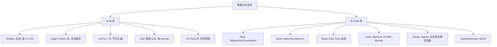

# 智能合约总览（Smart Contract Overview）

> **TL;DR**：智能合约是运行在区块链虚拟机内的确定性程序，其运行结果必须在所有节点上 bit-for-bit 一致。主流 VM 分四大谱系：**EVM（Ethereum 栈式，256-bit 字长、Gas 计费）**、**SVM（Solana，BPF/SBF、账户并行执行）**、**MoveVM（Aptos/Sui，资源线性类型）**、**WASM（CosmWasm/ink!/NEAR/Stylus）**。语言层面 Solidity 一家独大（> 90% TVL），Vyper 守安全极简阵地，Yul/Huff 下探到汇编，Rust 统治 Solana/ink!/CosmWasm，Move 在资产语义上革新。选择 VM = 选择账户模型、并发模型、升级模型、工具链与生态债务。本文给出横向坐标，后续章节分别深挖。

---

## 1. 背景与动机

1994 年 Nick Szabo 首次提出 **Smart Contract** 概念——把合约条款写进可自动执行的协议；因缺乏信任基底未成规模。2013–2015 年 Vitalik 在 [Ethereum Whitepaper](https://ethereum.org/en/whitepaper/) 把"图灵完备执行环境 + 全局共识状态"首次实现，EVM 成为第一个生产级智能合约 VM。

此后十年分叉为两条路线：

1. **"以 EVM 为准"路线**——BNB Chain / Polygon / Avalanche C-Chain / Arbitrum / Optimism / zkSync Era 等直接复用 EVM + Solidity 生态，迁移成本最低。
2. **"重新设计 VM"路线**——Solana 追求低延迟并行（Sealevel），Aptos/Sui 追求资产安全（Move），CosmWasm/NEAR/ink! 追求 WASM 通用性。

选择背后的 trade-off：**确定性 vs 并行度 vs 资产语义 vs 工具链成熟度**。本目录按 VM 家族分层，EVM 目录最厚，因为这是当前工程实践的重心。

## 2. 核心原理

### 2.1 智能合约的形式化定义

一个区块链状态转换函数可以写作：

```
σ_{t+1} = Υ(σ_t, T)
```

其中 `σ` 是世界状态，`T` 是交易，`Υ` 是**确定性**转换函数。智能合约把 `Υ` 的一部分下放成用户可编程的逻辑：合约字节码 `c ∈ σ`，合约的执行记作：

```
(σ', g', o) = Ξ(σ, g, I)
```

`g` 是剩余 gas，`I` 是执行环境（调用者、value、calldata），`o` 是返回数据。黄皮书 §9 精确定义了 `Ξ` 的递归展开。三个核心不变式：

- **确定性（Determinism）**：相同输入必须产出相同输出，禁止浮点、系统时钟、随机数系统调用。
- **可计量（Meterable）**：每条指令必须有明确的资源成本（gas / compute unit），便于 DoS 防护。
- **沙盒隔离（Sandboxed）**：合约只能通过显式系统调用与外界交互，无直接文件系统/网络能力。

### 2.2 VM 四大谱系对比

| 维度 | EVM | SVM（Solana） | MoveVM | WASM 系 |
| --- | --- | --- | --- | --- |
| 字长 | 256-bit | 64-bit | 64-bit + 泛型 | 32/64-bit |
| 执行模型 | 栈式串行 | 并行（基于账户声明） | 串行（Aptos）/对象并行（Sui） | 串行（多数） |
| 资源模型 | Gas（单一） | Compute Unit + Signature + Account | Gas（多维，Aptos Block-STM） | Gas |
| 状态模型 | Account + Storage Trie | Account（数据 + owner） | Global Storage（按地址+类型寻址）/ Object（Sui） | Account / KV |
| 字节码 | EVM bytecode | SBF（BPF 派生） | Move bytecode | WASM |
| 代表语言 | Solidity / Vyper / Yul / Huff | Rust（Anchor）/ C | Move | Rust（ink!/CosmWasm）/ AssemblyScript / Sway |
| 升级性 | 代理模式（应用层实现） | Upgradeable BPF Loader（原生支持） | 原生 `package upgrade`（Sui）/ 治理（Aptos） | CosmWasm 原生 `migrate` entry |
| 并行度 | 0（单线程） | 高（Sealevel 冲突检测） | 中（Block-STM）/ 高（Sui DAG） | 0（多数） |

### 2.3 账户模型关系

智能合约平台的账户模型决定了可编程的基本单位：

- **EVM**：`(EOA, Contract)` 二元账户，合约账户 = `codeHash + storageRoot`，状态通过 SLOAD/SSTORE 键值读写。升级必须靠 delegatecall 代理。
- **Solana**：统一账户（Account），owner 字段指向程序（Program），账户的数据区由 owner 程序独占写入。程序本身无状态——"代码即无状态 Program，状态外化到 Account"的倒置设计，带来天然多实例/原子升级。
- **Move**：全局存储按 `(address, Type)` 键寻址，资源（`resource`）有线性类型保证——不可 copy 不可 drop，必须显式 move。天然杜绝双花 bug。
- **WASM 系（CosmWasm）**：合约有独立 `address` 与 KV 存储区；消息驱动执行（`execute/query/migrate`）。

### 2.4 开发语言谱系



### 2.5 关键参数对比

| 参数 | Ethereum | Solana | Aptos | Sui |
| --- | --- | --- | --- | --- |
| 块时间 | 12 s | ~0.4 s | ~0.15 s | ~0.25 s (共识前可乐观出) |
| 单笔 gas 限额 | 30 M / block | 1.4 M CU / tx | 可变 | 50 M 计量单位 |
| 合约字节码上限 | 24 KB（EIP-170）/ runtime | 10 MB Program | 60 KB package | 100 KB package |
| 升级机制 | 代理模式 | BPFLoaderUpgradeable | 源码替换 + 兼容性检查 | `package::upgrade` |

### 2.6 失败模式与边界

- **重入（Reentrancy）**：EVM 特有（CALL 可回调），DAO 事件后成为第一安全课。非 EVM 如 Move 因线性类型几乎免疫。
- **账户冲突**：SVM 需事先声明读写账户；错误声明会导致 tx 失败，但也成为并行化前提。
- **字节码大小限制**：Spurious Dragon 硬分叉（EIP-170）上的 24 KB 限制迫使 Solidity 项目使用 Diamond/外部库分割。
- **无状态客户端挑战**：Verkle Tree 之前，Full Node 需保存全部 Trie，节点运行门槛高。

## 3. 架构剖析

### 3.1 分层视图

自底向上：

1. **物理/共识层**：出块、终局性。合约层对它的要求是"确定性到账"。
2. **VM 层**：opcode 解释/JIT、Gas 计量、系统调用。
3. **状态层**：State Trie / Account Store / Object Store。
4. **标准库与 Framework**：OpenZeppelin（EVM）、Anchor（SVM）、Move stdlib、CW-plus（CosmWasm）。
5. **应用层**：DeFi / NFT / Social / Game。

### 3.2 核心模块清单

| 模块 | 代表实现 | 职责 | 可替换性 |
| --- | --- | --- | --- |
| 编译器 | solc / vyper / rustc-bpf / move-compiler | 源码 → 字节码 | 可同链多编译器共存 |
| VM 运行时 | evmone / geth EVM / Sealevel / MoveVM | 执行字节码 | 每链通常单一官方实现 |
| 状态引擎 | go-ethereum triedb / rocksdb / SlotDB | 持久化 KV、Merkle 证明 | 客户端多样性影响 |
| Mempool | geth txpool / Solana banking_stage | 交易排序、广播 | 各客户端独立实现 |
| 预编译 | ecrecover / modexp / bn256 / Blake2 | 链原生加速原语 | 由 EIP 硬分叉加入 |
| 标准库 | OpenZeppelin / solmate / Anchor / Move stdlib | 通用安全组件 | 开发者选择 |
| 开发工具 | Foundry / Hardhat / Anchor CLI / Sui CLI | 编译、测试、部署 | 同链可多选 |
| 索引器 | The Graph / Helius / Aptos Indexer | 链外数据聚合 | 第三方生态 |

### 3.3 生命周期：合约诞生到被调用

```
Source (.sol) 
  → solc 编译出 init bytecode + metadata
  → 部署 Tx（to = 0）→ 矿工/验证者执行 CREATE
  → init code 返回 runtime bytecode 存入状态树
  → 合约地址 = keccak256(rlp(sender, nonce)) / CREATE2 确定性
  → 外部调用 Tx：calldata 进入 mempool → 打包 → EVM 执行 → 状态更新 → 日志（events）写入 Receipt Trie
  → 索引器/RPC 订阅日志 → 前端/子图刷新
```

### 3.4 实现分散度

- EVM：**客户端多样性健康**——geth / nethermind / besu / erigon / reth（Rust）。
- Solana：官方 Agave（Rust）+ Firedancer（Jump, C）为第二实现。
- Aptos/Sui：仅官方实现，多样性弱，属"联邦开发期"。

### 3.5 扩展接口

`eth_call` / `eth_sendRawTransaction` / `eth_getLogs` 是 EVM JSON-RPC 核心。Solana 用 `sendTransaction` + WebSocket subscribe。Move 系用 GraphQL（Sui）/REST（Aptos）。

## 4. 关键代码 / 实现细节

Solidity 合约编译产物结构（以 solc 0.8.26 为例）：

```
{
  "abi": [...],                    // 接口描述，前端/ethers.js 使用
  "bytecode": {
    "object": "0x608060...",       // init code, 部署时使用
    "linkReferences": {}           // library 占位
  },
  "deployedBytecode": {
    "object": "0x608060...",       // runtime code, 链上保存
    "immutableReferences": {...}
  },
  "metadata": "{...}",             // 含 compiler hash、源码 IPFS
  "storageLayout": {...}           // 每个变量的 slot/offset (0.5.13+)
}
```

`storageLayout` 是升级/存储碰撞分析的关键——Diamond/代理调试必看。参考 [solidity/libsolidity/interface/StandardCompiler.cpp](https://github.com/ethereum/solidity/blob/v0.8.26/libsolidity/interface/StandardCompiler.cpp)。

## 5. 演进与版本对比

| 阶段 | 代表 | 特征 |
| --- | --- | --- |
| 2015–2017 Genesis | Solidity 0.4, EVM Frontier/Homestead | 几乎无安全工具；DAO 被黑 |
| 2018–2020 DeFi Summer 前夜 | Solidity 0.5/0.6, OpenZeppelin v3 | 升级代理、ERC-20/721 标准化 |
| 2021 多链爆发 | BSC/Polygon/Avax 复制 EVM | Solidity 0.8 默认溢出检查 |
| 2022 非 EVM 崛起 | Aptos/Sui 主网、Solana 稳定 | Move、Anchor 成熟 |
| 2023–2024 Account Abstraction | ERC-4337 + EIP-7702 (Pectra) | 合约钱包、Session Key |
| 2025–2026 | EVM Object Format (EOF, EIP-7692) | 字节码版本化、静态跳转分析 |

## 6. 实战示例

最小部署流程（Foundry，EVM 路线）：

```bash
forge init hello && cd hello
cat > src/Hello.sol <<'EOF'
pragma solidity ^0.8.26;
contract Hello {
    string public greet = "hi";
    function setGreet(string calldata s) external { greet = s; }
}
EOF
forge build
anvil &                             # 本地链
forge create src/Hello.sol:Hello --rpc-url http://127.0.0.1:8545 \
  --private-key 0xac0974...         # 返回合约地址
cast call $ADDR "greet()(string)"   # 预期输出: "hi"
```

同等 Solana/Anchor 版本、Move 版本在后续分章给出。

## 7. 安全与已知攻击

整个智能合约史上的 Top 损失（> 1 亿美金）几乎全部在 EVM 系：

| 事件 | 年份 | 损失 | 根因 |
| --- | --- | --- | --- |
| The DAO | 2016 | ~$60M | 重入 |
| Parity Multisig | 2017 | ~$300M 冻结 | `selfdestruct` 误调用 |
| Ronin Bridge | 2022 | $625M | 多签私钥泄漏（链下） |
| Wormhole | 2022 | $325M | 签名校验绕过（Solana 合约） |
| Euler | 2023 | $197M | 清算逻辑漏洞 |
| Multichain | 2023 | $126M | 私钥失控 |
| Radiant | 2024 | $50M | 代理管理员被钓 |

结论：重入 + 代理升级 + 跨链桥 是三大高危面，三者均与 VM 设计哲学相关，后续专题深讲。

## 8. 与同类方案对比

| 维度 | EVM | SVM | MoveVM | WASM 系 |
| --- | --- | --- | --- | --- |
| 生态规模 (TVL) | 极大 (> 90%) | 中 | 小 | 小-中 |
| 语言选择 | 丰富 | 偏窄（Rust 为主） | 单一（Move） | 丰富 |
| 资产安全 | 一般（需审计） | 一般 | 好（线性类型） | 一般 |
| 并行执行 | 无 | 强 | 中/强 | 无 |
| 工具链成熟度 | 高 | 中 | 中 | 中 |
| 可移植性 | 高（EVM 等价链多） | 低 | 中 | 高 |

## 9. 延伸阅读

- **官方规范**：Ethereum Yellow Paper、Solana Architecture、Move Book、CosmWasm Docs。
- **对比论文**：[The Move Language](https://developers.diem.com/docs/technical-papers/move-paper/)、[Sealevel: Parallel Smart Contracts](https://medium.com/solana-labs/sealevel-parallel-processing-thousands-of-smart-contracts-d814b378192)。
- **a16z crypto**：Smart Contract Languages 系列。
- **Paradigm Research**：EVM 深度文、MEV 研究。
- **EIP 必读**：EIP-170、EIP-1014 (CREATE2)、EIP-1153 (Transient Storage)、EIP-7702、ERC-4337、ERC-6900。

## 10. 术语表

| 术语 | 英文 | 释义 |
| --- | --- | --- |
| 虚拟机 | Virtual Machine (VM) | 执行链上字节码的抽象机器 |
| 字节码 | Bytecode | VM 直接执行的指令流 |
| Gas | Gas | EVM 资源计量单位 |
| Compute Unit | CU | Solana 计算资源单位 |
| 代理 | Proxy | 通过 delegatecall 转发的合约，用于升级 |
| 资源 | Resource | Move 中线性类型的一等资产 |
| 预编译 | Precompile | VM 原生加速原语（合约地址 0x01-0xff） |

---

*Last verified: 2026-04-22*
