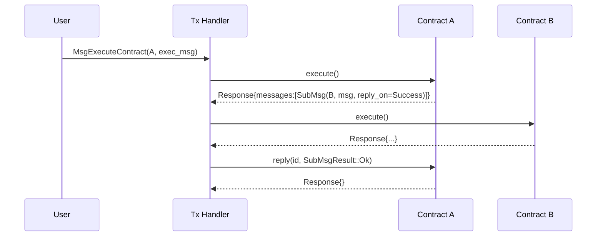
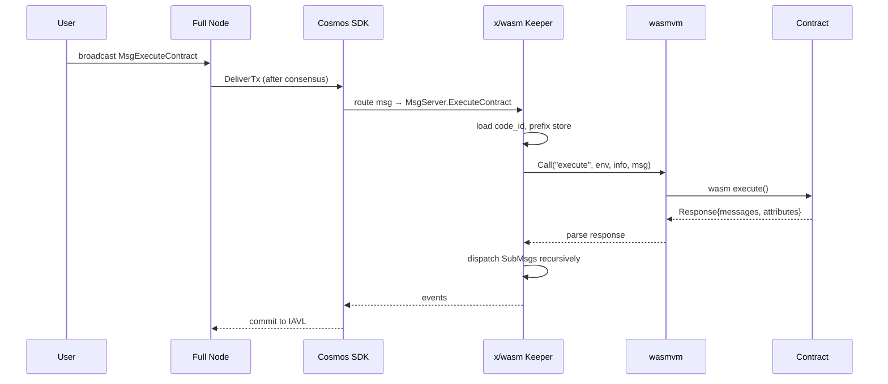

# CosmWasm（WASM 智能合约与 Actor 模型）

> **TL;DR**：CosmWasm 是基于 WebAssembly 的智能合约平台，作为 `x/wasm` 模块嵌入到任意 Cosmos SDK 链中（Juno / Osmosis / Neutron / Injective / Archway / Secret Network 等）。它选择 **Rust + Wasm32** 作为首要编译目标，采用 **Actor 模型** 组织合约间交互：合约之间没有同步嵌套调用，取而代之的是 `SubMsg` 消息与 `Reply` 回调，天然防御重入。CosmWasm 的存储抽象为 KV Store，通过 `cw-storage-plus` 提供 Map / Item / IndexedMap 高阶类型；合约入口点有 `instantiate` / `execute` / `query` / `migrate` / `sudo` / `reply` / `ibc_*`，运行时由 `wasmvm`（封装 Wasmer）执行。与 EVM 相比，CosmWasm 具备 IBC 原生互操作、链级参数可定制、gas 计量精确（基于 Wasm 操作码）等优势，代价是生态小于 EVM。

## 1. 背景与动机

Cosmos 生态的核心产品是 Cosmos SDK（Go 语言模块化区块链框架）与 IBC（链间通信协议）。早期 Cosmos 链的业务逻辑只能以 Go Module（Pallet 风格的 `x/*` 模块）形式写入链二进制，每次升级都需要协调所有验证者热升级。这种模式适合链级基础设施（质押、治理、IBC），但不适合 **应用层高速迭代**——DeFi 协议、NFT、DAO 等场景希望像 Ethereum 一样部署合约即上线。

2018 年 Confio（Ethan Frey 团队）开始探索「在 Cosmos SDK 中添加通用合约层」。需求包括：
1. **安全沙箱**：合约执行不能影响主链状态一致性。
2. **确定性**：所有验证者执行结果必须逐字节一致，禁止浮点、系统时间等非确定性源。
3. **计量**：每条指令必须消耗 gas，避免死循环。
4. **多语言、跨平台**：避免绑定单一 VM（如 EVM）。

WebAssembly 天然满足前三条：它是栈式字节码、有标准化 spec、支持 gas 注入（通过代码改写）。2019–2020 年 CosmWasm 完成第一版，选择 Rust 作为主要源语言，原因是 Rust 能编译到 `wasm32-unknown-unknown` target 且无 GC、二进制体积小、内存安全。2021 年 Juno Network 成为第一条以 CosmWasm 为核心的应用链，随后 Osmosis、Neutron 等在核心 DeFi / 桥接 / 跨链账户场景大量使用。

与 EVM 的本质差异在于 **执行模型**：EVM 合约互相调用时栈内嵌套执行（同步），重入是主要风险源；CosmWasm 明确抛弃同步调用，采用 Actor 模型——一个合约无法同步获取另一合约的执行结果，必须通过 `SubMsg` 发送消息并等待 `reply`。这类似 Erlang / Akka 的思路，在架构层消除了重入家族漏洞。

另一关键动机是 **IBC 原生**：CosmWasm 合约可以通过 `ibc_channel_open` / `ibc_packet_receive` 等入口直接参与 IBC 通信，不需要额外桥接层。这使得跨链合约（如 Neutron 的 Interchain Accounts、Noble 的 USDC 跨链分发）比 Ethereum 桥方案更自然。

## 2. 核心原理

### 2.1 形式化定义

设 CosmWasm 合约状态空间为 KV Store `S: Bytes → Bytes`，合约行为由四元组 `(C, I, E, Q)` 刻画：
- `C`：Wasm 字节码（`code_id` 在链上唯一标识）。
- `I: (Env, Info, InstantiateMsg, S₀) → (S₁, Response)`：实例化函数。
- `E: (Env, Info, ExecuteMsg, Sₙ) → (Sₙ₊₁, Response)`：执行函数。
- `Q: (Env, QueryMsg, S) → Binary`：查询函数（只读，不修改 S）。

`Response` 是合约返回值的代数结构：
```
Response = { messages: Vec<SubMsg>, attributes: Vec<Attr>, events: Vec<Event>, data: Option<Binary> }
SubMsg   = { id: u64, msg: CosmosMsg, reply_on: ReplyOn, gas_limit: Option<u64> }
```

状态转移规则：当 `execute` 返回 `Response{ messages: [m₁, m₂, ...] }`，这些消息 **按顺序** 在当前交易中同级执行（不是嵌套入栈）。若 `reply_on = Always | OnError | OnSuccess`，子消息执行完毕后调用原合约的 `reply(env, Reply{ id, result }, S)` 入口。这定义了一个 **flattened call tree**：所有消息在交易顶层的 message queue 依序处理，没有 EVM 式的 call depth。

确定性约束：合约内禁止访问 `Instant::now()` / `SystemTime` / 线程 / 文件系统 / 未初始化内存；所有时间信息通过 `env.block.time` / `env.block.height` 注入。随机源必须来自链上（如 Drand / oracle），不能使用宿主随机。

### 2.2 关键数据结构与存储抽象

底层 KV Store 是 Cosmos SDK 的 IAVL 树（带 Merkle 证明的平衡 AVL）。CosmWasm 合约在其上封装了几层抽象：

**Raw Storage**（`cosmwasm_std::Storage`）：
```rust
trait Storage {
    fn get(&self, key: &[u8]) -> Option<Vec<u8>>;
    fn set(&mut self, key: &[u8], value: &[u8]);
    fn remove(&mut self, key: &[u8]);
    fn range(...) -> Box<dyn Iterator<Item = Record>>;
}
```

**cw-storage-plus 高阶类型**（生态事实标准）：
- `Item<T>`：单值，内部 key 固定。
- `Map<K, V>`：多值映射，key 可以是元组（自动拼接）。
- `IndexedMap<K, V, I>`：带二级索引的 Map，索引存于独立 namespace。
- `SnapshotMap` / `Deque`：带快照 / 双端队列语义。

所有类型都自动处理 key 前缀避免冲突、使用 `serde_json_wasm` 或 `bincode` 序列化，确保跨版本兼容。

### 2.3 Actor 模型与消息流



要点：
1. A 调用 B 时，A 的 `execute` 已经 **返回**，B 的执行不在 A 的栈帧内。
2. A 若需要 B 的返回值，必须在 `reply` 入口处读取 `data` 字段。
3. 若 B 失败且 `reply_on=OnError`，A 可以捕获错误避免整笔交易 revert；若 `reply_on=Never`（默认 `SubMsg::new`），子消息失败直接回滚。
4. 所有 State 修改在 `reply` 执行前已持久化（但若最终整笔 tx 失败，全部一起回滚）。

### 2.4 Gas 计量机制

Wasm 没有原生 gas 概念，CosmWasm 使用 **Gas Metering 代码注入**：在合约上传时（`MsgStoreCode`），`wasmvm` 通过 `pwasm-utils` 在每个 basic block 入口插入 gas 扣减指令：

```
(call $gas (i64.const 42))   ;; consume 42 gas for upcoming block
```

`$gas` 是宿主函数，检查全局计数器，超限则 trap。参考单位：1 Wasm operation ≈ 140 Cosmos SDK gas（`GasMultiplier = 140`，`wasmd/x/wasm/types/params.go`）。

### 2.5 合约入口点（Entry Points）

必选：
- `instantiate(deps, env, info, msg)`：首次部署。
- `execute(deps, env, info, msg)`：状态修改。
- `query(deps, env, msg)`：只读。

可选：
- `migrate(deps, env, msg)`：从旧 code_id 迁移到新 code_id，由 admin 触发。
- `sudo(deps, env, msg)`：特权调用，只能由链治理 / 模块触发（不经 EOA）。
- `reply(deps, env, reply)`：SubMsg 回调。
- `ibc_channel_open/connect/close` / `ibc_packet_receive/ack/timeout`：IBC 生命周期。

### 2.6 参数与常量

| 参数 | 默认值 | 可治理 | 说明 |
| --- | --- | --- | --- |
| `code_upload_access` | `Everybody` / `Nobody` / `AnyOfAddresses` | ✅ | 谁可上传 Wasm |
| `instantiate_default_permission` | `Everybody` | ✅ | 谁可实例化已上传代码 |
| `max_wasm_code_size` | 819200（800 KiB） | ✅ | 单个 Wasm 二进制上限 |
| `GasMultiplier` | 140 | ⚠ 链级常量 | Wasm op → SDK gas |
| `SmartQueryGasLimit` | 3,000,000 | ✅ | 合约内 query 调用 gas 上限 |

### 2.7 边界条件与失败模式

- **非确定性 panic**：合约若依赖主机实现差异（内存排序、浮点）会导致共识分叉。CosmWasm 禁用了 Wasm 浮点 op，但仍需警惕 `HashMap` 迭代顺序（Rust 默认 hasher 非确定）。
- **Gas exhaustion**：无限递归消息（A → B → A → B ...）受 `CallDepth` 隐式限制（message queue 上限），实际更多由 gas 上限终止。
- **State bloat**：合约可以无限写入 KV（只要 gas 够），链需通过治理提高最低 fee 或收取 storage rent。
- **Migrate 风险**：管理员可将合约迁移到恶意 code_id，用户资金可能被抽走。安全最佳实践是将 admin 设为 Nobody 或 DAO 多签，或直接 `ClearAdmin`。

## 3. 架构剖析

### 3.1 分层视图

```
┌─────────────────────────────────────────────┐
│  Contract Layer (Rust → Wasm)               │  cw-plus, cw20, cw721
├─────────────────────────────────────────────┤
│  cosmwasm-std / cosmwasm-vm (Host Interface)│  deps, env, messages
├─────────────────────────────────────────────┤
│  wasmvm (Go ↔ Rust FFI via cgo)             │  wasmer runtime
├─────────────────────────────────────────────┤
│  x/wasm Module (Cosmos SDK)                 │  keeper, handler, MsgServer
├─────────────────────────────────────────────┤
│  Cosmos SDK Base (bank, staking, ibc)       │  IAVL, Tendermint / CometBFT
└─────────────────────────────────────────────┘
```

- **Contract Layer**：开发者代码，编译为 Wasm 后上链。
- **cosmwasm-std**：宿主 ABI 封装，定义 `Deps` / `DepsMut` / `Env` / `MessageInfo`。
- **wasmvm**：Go 写的 `x/wasm` 与 Rust 写的 `cosmwasm-vm` 之间的胶水层，经 cgo 调用 Wasmer。
- **x/wasm**：标准 Cosmos SDK 模块，处理 `MsgStoreCode` / `MsgInstantiateContract` / `MsgExecuteContract` / `MsgMigrateContract` 等。
- **SDK Base**：账户、资产、质押、IBC 等原生模块，合约通过 `CosmosMsg::Bank` / `CosmosMsg::Staking` / `CosmosMsg::Ibc` 与之交互。

### 3.2 核心模块清单

| 模块 | 职责 | 依赖 | 可替换性 |
| --- | --- | --- | --- |
| `cosmwasm-std` | 合约 SDK：类型、宏、helpers | serde, schemars | 核心，不可替换 |
| `cosmwasm-vm` | Rust VM 接口，抽象 wasmer | wasmer | 可换 wasmtime |
| `cosmwasm-crypto` | secp256k1 / ed25519 / bls12-381 验证 | k256, ed25519-dalek | 通过 host fn 暴露 |
| `wasmvm` | cgo 桥，供 Go 调用 Rust VM | cosmwasm-vm | 核心 |
| `x/wasm` keeper | 状态管理 + Msg 处理 | Cosmos SDK | 可 fork 改造 |
| `cw-storage-plus` | 存储高阶类型 | cosmwasm-std | 生态事实标准 |
| `cw-plus` | 参考合约集（cw20/cw721/cw1-multisig） | cw-storage-plus | 可自研 |
| `cw-orch` / `ts-codegen` | 客户端代码生成 | schema | 可选 |

### 3.3 数据流：一次 ExecuteContract 全流程



关键耗时点：
- Wasm 实例化（冷启动 cache miss）：几十 ms，靠 `InstanceCache` 减缓。
- IAVL 读写：视状态大小，每 key 约 O(log N) 哈希。
- 典型 execute tx 链上 1–3s 出块，可观察 `tx_results.events`。

### 3.4 参考实现

- **wasmd**（`github.com/CosmWasm/wasmd`）：官方 Go 实现，最常见部署。
- **cosmwasm-vm**（`github.com/CosmWasm/cosmwasm/packages/vm`）：Rust VM。
- **neutron-core / osmosis**：自定义链 fork，在 x/wasm 基础上加定制 Hook（如 Sudo Hook 调用合约）。

### 3.5 对外接口

- **Tendermint RPC / gRPC**：标准 Cosmos 接口，查询合约状态用 `abci_query path="/cosmwasm.wasm.v1.Query/SmartContractState"`。
- **IBC**：合约可打开 IBC channel，收发 ICS-20（fungible token）/ ICS-27（interchain accounts）/ ICS-721（NFT）数据包。
- **CosmJS**：TypeScript 客户端（`@cosmjs/cosmwasm-stargate`），前端常用。

## 4. 关键代码 / 实现细节

合约典型骨架（`cw-plus/contracts/cw20-base/src/contract.rs`, tag `v1.1.2`）：

```rust
// 路径：cw-plus/contracts/cw20-base/src/contract.rs:40-95（简化）
#[cfg_attr(not(feature = "library"), entry_point)]
pub fn instantiate(
    mut deps: DepsMut,
    env: Env,
    _info: MessageInfo,
    msg: InstantiateMsg,
) -> Result<Response, ContractError> {
    msg.validate()?;                          // 校验 symbol/decimals
    let total_supply = create_accounts(&mut deps, &msg.initial_balances)?;
    let data = TokenInfo {
        name: msg.name,
        symbol: msg.symbol,
        decimals: msg.decimals,
        total_supply,
        mint: msg.mint.map(|m| MinterData { minter: deps.api.addr_validate(&m.minter)?, cap: m.cap }),
    };
    TOKEN_INFO.save(deps.storage, &data)?;    // Item::save
    Ok(Response::default())
}

#[cfg_attr(not(feature = "library"), entry_point)]
pub fn execute(
    deps: DepsMut,
    env: Env,
    info: MessageInfo,
    msg: ExecuteMsg,
) -> Result<Response, ContractError> {
    match msg {
        ExecuteMsg::Transfer { recipient, amount } =>
            execute_transfer(deps, env, info, recipient, amount),
        ExecuteMsg::Send { contract, amount, msg } =>
            execute_send(deps, env, info, contract, amount, msg),
        // ...
    }
}

// 典型 Actor 模式：发送 cw20 到另一个合约
// 路径：cw-plus/contracts/cw20-base/src/contract.rs:243
pub fn execute_send(...) -> Result<Response, ContractError> {
    // 1. 修改 BALANCES
    BALANCES.update(deps.storage, &info.sender, |b| b.unwrap_or_default().checked_sub(amount))?;
    BALANCES.update(deps.storage, &rcpt_addr, |b| b.unwrap_or_default().checked_add(amount))?;
    // 2. 构造对 recipient 合约的回调消息
    let msg = Cw20ReceiveMsg { sender: info.sender.into(), amount, msg }
        .into_cosmos_msg(contract)?;
    Ok(Response::new()
        .add_attribute("action", "send")
        .add_message(msg))                    // Actor 消息，不嵌套执行
}
```

要点：
1. `entry_point` 宏生成 Wasm 导出符号 `instantiate` / `execute` / `query`，宿主通过名字查找。
2. 状态修改（`BALANCES.update`）**先于** `SubMsg` 执行，但若后续失败，整笔交易回滚（原子性）。
3. `Cw20ReceiveMsg` 是 cw20 标准约定：接收方合约必须实现 `Receive { sender, amount, msg }` 入口。

## 5. 演进与版本对比

| 版本 | 发布时间 | 关键变化 | 对外部影响 |
| --- | --- | --- | --- |
| CosmWasm 0.14 | 2021-05 | Stargate msgs 支持；Submsg/Reply 引入 | Actor 模型正式定型 |
| CosmWasm 0.16 | 2021-10 | IBC entry points（ibc_channel_*） | 合约可直接收发 IBC 包 |
| CosmWasm 1.0 | 2022-05 | Stable API，冻结 storage 布局 | 生产级使用 |
| CosmWasm 1.1 | 2022-09 | GovMsg 支持；Distribution 查询 | 合约可提案治理 |
| CosmWasm 1.2 | 2023-01 | `instantiate2`（确定性地址）；WeightedVoteOption | 跨链确定性部署 |
| CosmWasm 1.3 | 2023-06 | Distribution withdraw；bls12-381 host fn | zk 应用可行 |
| CosmWasm 1.5 | 2024-01 | IBC fee middleware；crypto 扩展 | 更丰富的 IBC |
| CosmWasm 2.0 | 2024-Q2 | Capabilities 重构；多版本 std | 部分 API break |
| CosmWasm 2.1 | 2024-下 | IBCv2 草案；EVM interop 探索 | 仍迭代中 |

## 6. 实战示例

以下 demo 展示在本地 `wasmd` 单节点上部署并调用一个简单 counter 合约（cw-template）。

```bash
# 1. 安装工具链
rustup target add wasm32-unknown-unknown
cargo install cargo-generate --locked
cargo install cosmwasm-check

# 2. 生成合约骨架
cargo generate --git https://github.com/CosmWasm/cw-template.git --name my-counter

# 3. 编译为优化 wasm
cd my-counter
docker run --rm -v "$(pwd)":/code cosmwasm/optimizer:0.15.1
# 输出 artifacts/my_counter.wasm（~150 KB）

# 4. 静态验证
cosmwasm-check artifacts/my_counter.wasm
# Available capabilities: {"iterator", "staking", "stargate", ...}

# 5. 部署（本地 wasmd）
wasmd tx wasm store artifacts/my_counter.wasm \
  --from validator --gas auto --gas-adjustment 1.3 --fees 5000uwsm -y
# 返回 code_id=1

# 6. 实例化
wasmd tx wasm instantiate 1 '{"count":0}' \
  --from validator --label counter --no-admin --fees 5000uwsm -y
# 返回合约地址 wasm1...

# 7. 执行与查询
wasmd tx wasm execute $CONTRACT '{"increment":{}}' --from validator --fees 5000uwsm -y
wasmd query wasm contract-state smart $CONTRACT '{"get_count":{}}'
# {"data":{"count":1}}
```

## 7. 安全与已知攻击

- **Terra Classic LUNA/UST 崩盘（2022-05）**：不是 CosmWasm 自身漏洞，但暴露了 **合约 admin key 集中** 的风险——Mirror Protocol 的 migrate 权限集中在少数账户。Lesson：生产合约应 `ClearAdmin` 或交由多签 / DAO。
- **Osmosis v8 升级漏洞（2022-06, #78）**：`x/gamm` 模块 LP share 计算 bug，允许超额铸造 LP。虽然不在合约层，但展示了 Cosmos SDK chain 升级测试必要性。
- **Reply 数据遗失（CosmWasm 1.0 → 1.1 breaking）**：在 1.0，若 SubMsg success，`reply.result.data` 包含 B 的 response data；1.1 之后改为 `reply.payload`。错用会导致跨版本行为偏差。
- **非确定性输入**：多次出现合约内误用 `HashMap`（Rust 默认 randomized hasher），导致不同节点遍历顺序不同 → 共识分叉。建议统一用 `BTreeMap` 或 `cw-storage-plus::Map`。
- **Jito / IBC replay（2023）**：非 CosmWasm 本身，但 Interchain Queries (ICQ) 实现若未校验证明高度，攻击者可伪造跨链状态。

合约级攻击面与 Solidity 有本质差异：重入基本不存在，但 **逻辑错误** / **权限错配** / **整数溢出（`u128` 算术）** / **Migrate 后门** 仍是主要风险。

## 8. 与同类方案对比

| 维度 | CosmWasm | EVM (Solidity) | Solana (Sealevel) | ink!（Substrate） |
| --- | --- | --- | --- | --- |
| 源语言 | Rust（主）| Solidity / Vyper | Rust / C / C++ | Rust |
| 字节码 | Wasm（通用） | EVM bytecode | BPF / SBF | Wasm |
| 调用模型 | Actor（异步消息） | 同步嵌套 | 同步嵌套 | 同步嵌套（XCM 异步） |
| 重入风险 | 架构消除 | 高，需 ReentrancyGuard | 受限（锁账户） | 类似 EVM |
| 并发执行 | 顺序 | 顺序 | 并行（账户锁） | 顺序 |
| Gas 单位 | Wasm op × 140 | EVM op | CU（Compute Units） | Wasm op |
| IBC 原生 | ✅ | ❌（需桥） | ❌ | ❌（通过 XCM） |
| 合约升级 | admin migrate | Proxy pattern | Program upgrade authority | Contracts pallet + set_code |
| 生态规模 | 中等（Juno/Osmosis/Neutron） | 最大 | 大 | 小 |

Trade-offs：
- 若主打 EVM 兼容、最大流动性 → 选 EVM。
- 若追求跨链合约、Actor 模型、Cosmos 栈原生 → 选 CosmWasm。
- 若需要极致并行 → Solana。
- 若 Substrate / Polkadot 栈 → ink!。

## 9. 延伸阅读

- **官方文档**：<https://docs.cosmwasm.com/>、<https://book.cosmwasm.com/>（Terran One）
- **规范仓库**：<https://github.com/CosmWasm/cosmwasm>（核心）、<https://github.com/CosmWasm/wasmd>（链模块）
- **参考合约**：<https://github.com/CosmWasm/cw-plus>、<https://github.com/public-awesome/cw-nfts>
- **学习资源**：Area-52（<https://area-52.io/>）、CosmWasm Academy
- **社区博客**：Confio、Neutron docs、Osmosis Labs blog
- **视频**：Ethan Frey 在 HackAtom 的系列演讲、Juno Box

## 10. 术语表

| 术语 | 英文 | 释义 |
| --- | --- | --- |
| 代码 ID | code_id | 链上 Wasm 字节码的唯一编号 |
| 实例化 | Instantiate | 由 code_id 派生一个合约实例（地址） |
| 子消息 | SubMsg | Actor 模型中由合约发起的后续消息 |
| 回复 | Reply | 子消息执行后触发的原合约回调入口 |
| 迁移 | Migrate | admin 将合约实例切换到新 code_id |
| 能力 | Capability | 链级宣告的特性集合（iterator/staking/stargate） |
| 桩 | Stub | 自动生成的跨合约调用辅助代码（cw-orch） |
| 精确实例化 | instantiate2 | 用 salt 计算确定性合约地址 |

---

*Last verified: 2026-04-22*
