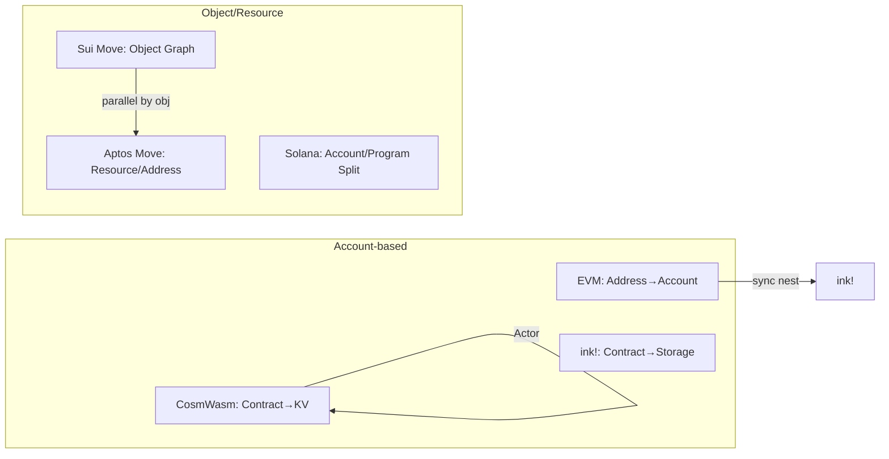
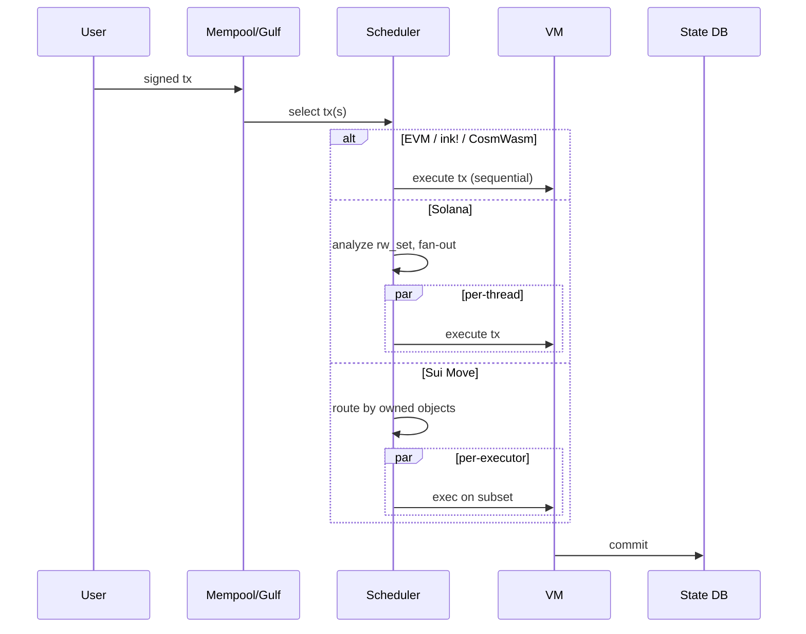

# 合约虚拟机横向对比（EVM / SVM / MoveVM / Wasm / CosmWasm）

> **TL;DR**：智能合约平台的技术分野不是表面的 "Solidity vs Rust"，而是 **执行模型** 的差异：账户模型 vs 资源模型、顺序执行 vs 并行执行、同步调用 vs Actor 消息。EVM（Ethereum / L2）以账户 + 堆栈 VM + 顺序执行构筑了最大开发者生态，但并行度受限、重入易错；SVM（Solana）用账户预声明 + Sealevel 并行获得极高吞吐，但开发者心智负担最重；MoveVM（Aptos / Sui）通过线性类型把资产做成 **资源（Resource）**，从类型系统消除双花；Wasm-based VM 包含 ink!（同步）与 CosmWasm（Actor），各自对接 Polkadot / Cosmos 栈。本文以 6 个维度（ISA / 账户模型 / 调用模型 / 并行度 / 计量 / 升级）给出统一对比框架，并给出选择建议。

## 1. 背景与动机

智能合约 VM 的设计目标在 2014–2024 年经历了几轮范式变迁：
- **EVM（2015）** 是第一代通用合约 VM，以 256-bit 栈式虚拟机 + 账户模型为核心。优势是抽象简洁、实现多样，但并行度、计量精度、状态膨胀都受历史包袱约束。
- **EOS WASM / Tezos Michelson（2018）** 尝试用 Wasm / 形式化类型语言替代 EVM，但生态未起。
- **Solana SVM（2020）** 以 BPF / SBF 为字节码，强制 tx 预声明读写账户集合，实现多核并行执行。代价：开发心智与可升级性。
- **Move（2020, Diem/Libra 遗产）** 在 Aptos / Sui 复活，引入线性类型与资源模型，从类型系统保证资产不可复制。
- **CosmWasm（2020）** 选择 Wasm + Actor 模型，与 IBC 深度融合；ink!（2019→） 走同步 Wasm 路线。
- **fuel-sway（2022）**、**MoveVM v2 / object-centric Sui**、**RISC-V PolkaVM（2024）** 等不断刷新可能性。

它们不是线性进步关系，而是多维 trade-off 空间：**表达力 ↔ 可分析性、吞吐 ↔ 可组合性、生态 ↔ 安全**。理解 VM 差异是选型（链 / 语言）与迁移（EVM → Move）的前提。

## 2. 核心原理

### 2.1 形式化定义

统一抽象：**状态转移系统** `T: (S, tx) → (S', events, gas)`。不同 VM 的核心差异是 `S` 的结构与 `T` 的调度策略。

| VM | 状态 S 结构 | tx 执行单位 | 调度 |
| --- | --- | --- | --- |
| EVM | `Address → Account{nonce, balance, storage, code}`（MPT） | 单 tx，顺序 | 顺序 + STM 的 optimistic parallelism（Monad/BSC 新方向） |
| SVM | `Pubkey → Account{data, owner, lamports}` | 单 tx（显式声明 rw set） | 多线程并行（Sealevel） |
| MoveVM | `Address → Resource<T>`（资源按类型存储） | 单 tx，顺序（Aptos BlockSTM） | Aptos：BlockSTM 乐观并行；Sui：对象级并行（Narwhal/Bullshark DAG） |
| CosmWasm | `Contract → KVStore`（IAVL） | 单 tx，flattened message queue | 顺序（Actor） |
| ink!/pallet-contracts | `Contract → KVStore`（PATRICIA Trie） | 单 tx，同步嵌套 | 顺序 |

### 2.2 关键数据结构：账户 vs 资源

**EVM 账户**：扁平字节存储 + 代码不可修改（除非 SELFDESTRUCT / DELEGATECALL）。合约拥有 storage，资产记为 `balances[addr] = amount` 的键值。缺点：合约要自己防双花，靠 CEI 防重入。

**SVM 账户**：链上所有状态都在 `Account` 数据结构中，包括程序代码、配置、用户 token。tx 必须声明访问的账户，Solana 据此并行调度。合约（program）无状态，数据存在外部 Account 中。缺点：跨账户事务需要精心编排。

**Move 资源**：`Resource` 是带 `key` / `store` 能力的结构体，有线性类型：不能被复制（`!Copy`），必须显式 `move` 或销毁。转账 = `move coin from A to B`，类型系统保证 coin 不会凭空产生。

```move
struct Coin has key, store { value: u64 }
public fun transfer(from: &signer, to: address, amount: u64) {
    let coin = withdraw(from, amount);  // 资源从 from 的账户中移出
    deposit(to, coin);                  // 资源移入 to（若 !drop，必须显式消耗）
}
```

**CosmWasm**：合约持有 KV 前缀，资产靠 Bank module（链原生）而非合约自定义，cw20 是合约自建 token 的惯例。

### 2.3 调用模型三分

| 模型 | 代表 | 特征 | 重入风险 |
| --- | --- | --- | --- |
| 同步嵌套 | EVM / ink! / Move | A.call(B) 将 B 推入当前栈帧，B 执行完返回 A | 高，需 CEI / Guard |
| CPI（Cross-Program Invocation） | Solana | A 通过 invoke 调用 B，但 B 的 rw set 必须是 A rw set 的子集 | 受限（账户锁） |
| Actor（异步） | CosmWasm | A 返回 SubMsg，B 在下一条 msg 执行；反馈通过 reply 回调 | 架构上消除 |

### 2.4 并行执行三档

1. **完全顺序**：EVM 主网、CosmWasm、ink!。
2. **乐观并行**：Aptos BlockSTM、Monad、BSC "Parallel EVM"、Sei v2。事务乐观并行执行，冲突检测后重放冲突者。
3. **确定性并行**：Solana Sealevel（预声明读写集）、Sui（对象-owner 级并行）。吞吐最高但开发者心智重。

### 2.5 计量机制对比

| VM | 单位 | 注入方式 | 精度 |
| --- | --- | --- | --- |
| EVM | Gas | 每条 opcode 固定表 | 粗粒度（2100 cold SLOAD 等常量） |
| SVM | Compute Units（CU） | 每 BPF 指令按权重 | 中 |
| MoveVM | Gas（Aptos）/ Computation Unit（Sui） | 每 bytecode 指令 | 细 |
| CosmWasm | Wasm op × 140 | 代码注入 `call $gas` | 细 |
| ink! | Weight（`RefTimeWeight`） | 代码注入 + schedule | 细 |

### 2.6 失败模式对比

- **EVM**：重入（The DAO）、整数溢出（pre-0.8）、delegatecall 混淆（Parity）、未初始化存储指针。
- **SVM**：missing signer check、account confusion、PDA 冲突、owner 校验缺失（曾有 Magic Eden 事件涉及此）。
- **Move**：Sui 对象所有权错配、Aptos capability 泄露；整体漏洞密度显著低于 EVM。
- **CosmWasm**：migrate 权限、SubMsg reply 处理遗漏、非确定性 iteration。
- **ink!**：Storage 版本迁移、selector 冲突、Chain Extension 权限。

### 2.7 统一对比图



## 3. 架构剖析

### 3.1 分层视图（各 VM 的共性骨架）

```
┌───────────────────────────────────────────┐
│ Contract / Program (Source Language)      │
├───────────────────────────────────────────┤
│ Bytecode / IR (EVM / BPF / Move / Wasm)   │
├───────────────────────────────────────────┤
│ VM Runtime (Interpreter / JIT)            │
├───────────────────────────────────────────┤
│ State Backend (MPT / AccountsDB / Object) │
├───────────────────────────────────────────┤
│ Consensus / Ordering                      │
└───────────────────────────────────────────┘
```

区别主要在 Bytecode、Runtime、State backend 三层。

### 3.2 核心维度对照表

| 维度 | EVM | SVM | MoveVM | CosmWasm | ink! |
| --- | --- | --- | --- | --- | --- |
| 源语言 | Solidity/Vyper/Yul | Rust/C | Move | Rust | Rust |
| 字节码 | EVM bytecode (256-bit stack) | BPF/SBF | Move bytecode | Wasm | Wasm（→ PolkaVM） |
| Word size | 256-bit | 64-bit native | 任意 | 32/64-bit | 32/64-bit |
| 账户模型 | Address→storage | Pubkey+owner | Resource+Address / Object | Contract→KV | Contract→KV |
| 调用 | 同步 | CPI（≤4 depth） | 同步 | Actor | 同步 |
| 并行 | 顺序（主流） | Sealevel 并行 | Sui 对象并行 / Aptos BlockSTM | 顺序 | 顺序 |
| 升级 | Proxy / EIP-1967 | BPFLoaderUpgradeable | package upgrade | admin migrate | set_code_hash |
| 重入默认 | 允许（危险） | 受限 | 架构减弱 | 无同步 | 禁同合约 |
| 正式验证 | Certora/K-EVM | 有限 | Move Prover（官方） | 有限 | Kani/Prusti |

### 3.3 数据流：从用户签名到状态落盘



### 3.4 典型参考实现

- EVM：go-ethereum、Reth、Besu、Nethermind、EthereumJS；L2 特化：op-geth、arb-geth。
- SVM：Solana Labs Agave（Rust）、Firedancer（Jump, C++，更高吞吐）。
- MoveVM：`aptos-move/move-vm-runtime`、`sui-move-vm`（各自 fork）。
- CosmWasm：cosmwasm-vm（Rust）+ wasmvm（Go cgo）+ x/wasm（wasmd）。
- ink!：pallet-contracts / pallet-revive + wasmi / wasmtime / PolkaVM。

### 3.5 接口与互操作

- EVM：JSON-RPC（`eth_*`）、EOF（未来）、Precompile。
- SVM：JSON-RPC（Solana 风格）、Geyser（流式推送）。
- Move：REST API（Aptos）、GraphQL + RPC（Sui）。
- CosmWasm：Tendermint RPC + `cosmwasm.wasm.v1.Query`。
- ink!：Substrate RPC + ContractsApi。

## 4. 关键代码 / 实现细节

片段 1：EVM 栈式执行核心（go-ethereum，tag `v1.14.11`, `core/vm/interpreter.go:196`）。

```go
// 路径：go-ethereum/core/vm/interpreter.go:196
for {
    // ... 省略 trace/gas hook
    op = contract.GetOp(pc)
    operation := in.table[op]
    cost = operation.constantGas
    if !contract.UseGas(cost) { return nil, ErrOutOfGas }
    if operation.dynamicGas != nil {
        dyn, err := operation.dynamicGas(in.evm, contract, stack, mem, memorySize)
        if err != nil || !contract.UseGas(dyn) { return nil, ErrOutOfGas }
    }
    res, err := operation.execute(&pc, in, callContext)
    if err != nil { return nil, err }
    pc++
}
```

片段 2：Solana CPI（solana-program, crate `solana-program v1.18`, `program.rs:264`）。

```rust
// 路径：solana-sdk/program/src/program.rs:264
pub fn invoke_signed(
    instruction: &Instruction,
    account_infos: &[AccountInfo],
    signers_seeds: &[&[&[u8]]],
) -> ProgramResult {
    // 所有 account_infos 必须是 caller 已在 rw_set 中声明的账户子集
    unsafe { crate::syscalls::sol_invoke_signed_rust(&instruction, &account_infos, &signers_seeds) }
}
```

片段 3：Move 资源移动（move-language, `move-stdlib/sources/coin.move`）。

```move
// 路径：move-stdlib/sources/coin.move（简化）
public fun withdraw<CoinType>(account: &signer, amount: u64): Coin<CoinType> acquires CoinStore {
    let store = borrow_global_mut<CoinStore<CoinType>>(signer::address_of(account));
    assert!(store.coin.value >= amount, EINSUFFICIENT_BALANCE);
    Coin { value: amount, coin_type: store.coin.coin_type }
    // `store.coin.value -= amount` 在真实实现里；此处重点：返回的 Coin 是线性资源
}
```

片段 4：CosmWasm 子消息（cosmwasm-std v2.x, `submessage.rs`）。

```rust
// 路径：cosmwasm-std/src/results/submessages.rs（简化）
pub struct SubMsg<T = Empty> {
    pub id: u64,
    pub msg: CosmosMsg<T>,
    pub gas_limit: Option<u64>,
    pub reply_on: ReplyOn, // Always | OnSuccess | OnError | Never
}
```

## 5. 演进与版本对比

| 阶段 | 年份 | 代表事件 |
| --- | --- | --- |
| Gen 1（Stack VM） | 2015 | EVM 上线；Solidity 发布 |
| Gen 2（WASM 初探） | 2018 | EOS WASM；Substrate 启动 |
| Gen 3（资源语言） | 2019–2020 | Libra Move；Diem 暂停 |
| Gen 4（并行） | 2020–2021 | Solana Sealevel；Aptos / Sui 启动 |
| Gen 5（模块化 + 互操作） | 2022–2024 | CosmWasm IBC；PolkaVM 提案；fuel-sway；Monad EVM 并行 |
| Gen 6（未来） | 2025+ | RISC-V 合约（PolkaVM, RISC-V for EVM 提案）；zkVM 接近主流 |

关键趋势：
1. **并行化**：所有新 L1 必须支持并行，BlockSTM 或 Sealevel 成为基线。
2. **形式化**：Move Prover、Aiken（Cardano）代表资产逻辑形式化方向。
3. **zkVM**：SP1、RISC0、Cairo 等正把通用计算搬上 zk 证明。
4. **ABI 融合**：pallet-revive、Polygon AggLayer、EVM Object Format 探索跨 VM 兼容。

## 6. 实战示例

同一个 counter 合约在各 VM 的核心代码对比：

Solidity（EVM）：
```solidity
contract Counter { uint256 public n; function inc() external { n++; } }
```

Rust（Solana Anchor）：
```rust
#[program] pub mod counter {
  pub fn inc(ctx: Context<Inc>) -> Result<()> { ctx.accounts.state.n += 1; Ok(()) }
}
#[account] pub struct State { pub n: u64 }
```

Move（Aptos）：
```move
module counter::counter { struct State has key { n: u64 }
  public entry fun inc(acc: &signer) acquires State { borrow_global_mut<State>(signer::address_of(acc)).n += 1; } }
```

Rust（CosmWasm）：
```rust
#[cw_serde] pub enum ExecuteMsg { Inc }
pub fn execute(deps: DepsMut, _: Env, _: MessageInfo, msg: ExecuteMsg) -> StdResult<Response> {
    COUNT.update(deps.storage, |c| -> StdResult<_> { Ok(c + 1) })?;
    Ok(Response::default())
}
```

Rust（ink!）：
```rust
#[ink(message)] pub fn inc(&mut self) { self.n += 1; }
```

同一语义下，EVM/Move 最短；Solana/CosmWasm 需处理账户或响应结构；ink! 借 Rust 宏最接近普通 Rust。

## 7. 安全与已知攻击

各 VM 的标志性事件（按 VM 归类）：
- **EVM**：The DAO（2016, 重入）、Parity Multisig（2017, delegatecall）、Poly Network（2021, 跨链 + 代理逻辑错误）、Nomad（2022, 初始化）、Euler Finance（2023, 捐赠攻击）。
- **SVM**：Wormhole（2022, signer 校验缺失 → 3.2 亿美元）、Cashio（2022, PDA 验证缺失）、Solend oracle。
- **MoveVM**：Cetus（Sui，2023, 小规模）；Move 生态整体事故少，与 Move Prover / 资源模型强相关。
- **CosmWasm**：Levana（Osmosis, 2023, 池操纵不是 VM 问题）；Terra 崩盘也非 VM 漏洞。
- **ink!**：生产事故较少；主要见测试网 Chain Extension 权限问题。

观察：事故密度大致 `EVM > SVM > MoveVM ≈ CosmWasm ≈ ink!`，但与 TVL/暴露面正相关，不能简单说 VM X 更安全。

## 8. 与同类方案对比

选择建议：

| 目标 | 推荐 VM | 理由 |
| --- | --- | --- |
| 最大流动性、成熟审计生态 | EVM | 开发者最多、审计工具最全、L2 丰富 |
| 极致吞吐 + 低费率 | SVM（Solana / Eclipse） | Sealevel 并行 + Firedancer |
| 资产安全优先（RWA / 托管） | MoveVM | 线性类型、资源模型、Move Prover |
| Cosmos / IBC 原生 | CosmWasm | IBC 入口、Actor 模型防重入 |
| Polkadot 生态 | ink! / pallet-revive | 与 Pallet 深度集成 |
| 并行 EVM 过渡 | Monad / Sei v2 / BSC Parallel | 保留 Solidity，提高 TPS |

反例（不推荐）：
- 追求形式化 + EVM 互操作：目前无完美解，Solidity 上 Certora / K 仍复杂。
- 追求极简：EVM 表面简单，但生态包袱重，反而不如 Move 简洁。

## 9. 延伸阅读

- **EVM**：Yellow Paper、EIP-2929 / 3529、Geth source
- **SVM**：Solana runtime docs、Sealevel paper
- **Move**：Move book（<https://move-language.github.io/move/>）、Aptos Move docs、Sui Move by Example
- **Wasm-VM**：CosmWasm book、use.ink Docs、PolkaVM RFC
- **比较分析**：
  - "Smart Contract Programming Languages" — Vitalik on Reddit / HackMD
  - a16z crypto "The evolution of smart contract platforms"
  - Paradigm research — "Specialized VMs for blockchains"
- **学术**：Move Prover paper（OOPSLA 2022）、Sealevel 原始设计 blog

## 10. 术语表

| 术语 | 英文 | 释义 |
| --- | --- | --- |
| 读写集 | rw_set | Tx 预声明要访问的账户集合（Solana 必备） |
| 资源 | Resource | Move 线性类型，天然不可复制 |
| 对象 | Object | Sui Move 以对象为中心的状态单元 |
| BlockSTM | BlockSTM | Aptos 乐观并行调度算法 |
| CPI | Cross-Program Invocation | Solana 程序间调用 |
| PolkaVM | PolkaVM | Polkadot RISC-V VM |
| Gas/CU/Weight | - | 不同链对"计算成本"的计量单位 |

---

*Last verified: 2026-04-22*
