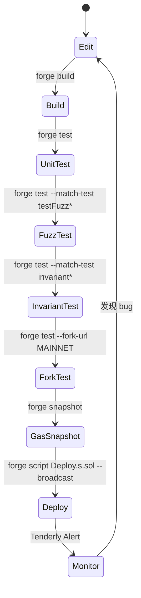

# EVM 开发工具链：Foundry / Hardhat / Remix / Tenderly

> **TL;DR**：2026 年 EVM 开发的主流工具分四类：**Foundry（Rust, CLI, forge/cast/anvil/chisel）** 以 Solidity 写测试 + 极速编译 + 模糊测试一体化；**Hardhat（TypeScript/Node.js, ethers/viem 集成）** 以 JS 生态、丰富插件、脚本化部署见长；**Remix（Web IDE, 浏览器内）** 适合入门、教学、一次性调试；**Tenderly（商业 SaaS, 含 Virtual TestNet + Simulator + Monitoring）** 侧重生产阶段的模拟、告警、Debug。现代团队常用组合：**Foundry 写合约 & 测试 + Hardhat 负责部署脚本 & 前端胶水 + Tenderly 做 monitoring + Remix 快速 scratch pad**。选择标准不是二选一，而是"每个阶段选最顺手的"。

---

## 1. 背景与动机

EVM 开发工具演进三波：

1. **Truffle + Ganache（2016–2019）**：JavaScript 测试框架 + 本地链模拟器。长期是事实标准。2023 年 ConsenSys 宣告 Truffle sunset。
2. **Hardhat（2019–）**：Nomic Labs 重新设计 JS 工具，堆叠式插件体系（hardhat-ethers、hardhat-deploy、hardhat-verify）；TypeScript 优先；网络 fork、console.log 调试合约为首推。
3. **Foundry（2021–, Paradigm）**：Rust 实现，"**用 Solidity 写测试**"颠覆传统——测试与合约同语言，零序列化开销，编译与执行速度比 Hardhat 快 10 倍以上；模糊测试（fuzz）与不变式测试（invariant）一等公民。

Remix 一直在旁支上作为浏览器内 IDE 服务教学/一次性测试；Tenderly 则从 2019 年商业化"EVM tracer SaaS"起步，如今承担生产合约的监控与事件触发。

## 2. 核心原理

### 2.1 核心命令对照

| 场景 | Foundry | Hardhat | Remix |
| --- | --- | --- | --- |
| 编译 | `forge build` | `npx hardhat compile` | 浏览器按钮 |
| 测试 | `forge test` | `npx hardhat test` | Remix plugin |
| 本地链 | `anvil` | `npx hardhat node` | Remix VM |
| 部署 | `forge script / forge create` | `hardhat ignition / run` | 点击部署 |
| 交互 | `cast call / send` | `npx hardhat console` | 点击按钮 |
| 模糊测试 | 原生 `forge test` fuzz/invariant | 需 plugin | 无 |
| Trace | `cast run tx` / `-vvv` | `hardhat-tracer` plugin | 有 |

### 2.2 Foundry 的执行引擎

Foundry 用 **revm**（Rust 实现 EVM）作为执行内核——比 Hardhat 内嵌的 JS EVM（`ethereumjs-vm`）快 10–20 倍，使得**在每个 fuzz 迭代里重启链**成为可能。

```
Solidity test file *.t.sol
  ↓ solc 编译（本地或 svm 管理多版本）
  ↓ revm 加载 bytecode
  ↓ 执行 setUp() + 所有 test*() / testFuzz*() / invariant*()
  ↓ 统计 gas snapshot + coverage + trace
```

Fuzz 测试：函数签名里的 `uint256 x` → Foundry 生成随机输入；默认 256 次运行，可配置。

Invariant 测试：全合约不变式（如"totalSupply == sum(balances)"），调用随机 selector 序列后检查。

### 2.3 Hardhat 的执行引擎

Hardhat 在 Node.js 里跑 `@nomicfoundation/ethereumjs-vm` 或 (2024+) **edr-optimism / ethereumjs-evm** （v3 用 **Rust edr** 替换 JS VM，性能接近 Foundry）。

测试使用 **Mocha + Chai**（chai-ethers matcher），合约交互使用 **ethers.js / viem**。

Hardhat v3 beta（2025）是重构版：TypeScript 模块化、ESM 原生、用 Rust EDR 加速。

### 2.4 Remix 架构

前端纯浏览器（React），Solidity 编译器用 `soljson.js`（WebAssembly 编译）。三种运行环境：

- **Remix VM**：浏览器内 ethereumjs。
- **Injected Provider**：通过 MetaMask 连主网/L2。
- **External HTTP**：本地节点 (anvil/geth) 或 Infura。

### 2.5 Tenderly 架构

商业 SaaS，核心是 **trace-by-replay**：

```
Tenderly indexes mainnet blocks → store full traces (opcode level)
User clicks tx → replay in their hosted EVM → return call tree + storage diff
```

**Virtual TestNet**：fork 主网某高度 + 独立可写环境，用于 staging 测试。

**Alerts**：基于链上事件/状态变化的 webhook 推送。

**Gas Profiler**：给每条 opcode 标成本，热点分析。

### 2.6 关键参数对比

| 指标 | Foundry | Hardhat v3 | Remix | Tenderly |
| --- | --- | --- | --- | --- |
| 启动时间 | < 1 s | 3-10 s | ~instant | N/A |
| 大项目编译 | 最快 | 接近（v3 用 Rust） | 慢 | - |
| Fork 主网 | `anvil --fork-url` | `hardhat node --fork` | - | Virtual TestNet |
| Gas 报告 | 内建 | plugin | - | profiler |
| Cheatcodes | 丰富（vm.warp, vm.prank…） | 丰富（hardhat_impersonate…） | 有限 | - |
| 许可证 | MIT | MIT | MIT | 商业 |

### 2.7 状态图：典型测试驱动开发



## 3. 架构剖析

### 3.1 分层视图（以 Foundry 为例）

1. **CLI**：`forge` / `cast` / `anvil` / `chisel` 四个二进制。
2. **svm**：管理多版本 solc/vyper。
3. **revm**：Rust EVM，作为所有命令的执行内核。
4. **ethers-rs**：Rust 以太坊客户端，`cast` 的底座。
5. **Alloy**（2024+ Paradigm）：下一代 Rust 以太坊 SDK，逐步替代 ethers-rs。

### 3.2 模块清单

| 工具 | 组件 | 职责 |
| --- | --- | --- |
| Foundry | forge | 编译、测试、部署、fuzz |
| Foundry | cast | RPC 客户端 + ABI 编解码 |
| Foundry | anvil | 本地链（可 fork） |
| Foundry | chisel | REPL |
| Hardhat | @nomicfoundation/hardhat-core | 任务系统、配置 |
| Hardhat | @nomicfoundation/hardhat-ethers | ethers 集成 |
| Hardhat | @nomicfoundation/hardhat-ignition | 声明式部署 |
| Hardhat | @nomicfoundation/hardhat-chai-matchers | 测试断言 |
| Remix | remix-core | 浏览器框架 |
| Remix | solidity plugin | 编译 |
| Tenderly | API + Web UI | Trace/Alert/Fork |

### 3.3 典型端到端流程

```
开发者本机:
1. forge init → 目录结构 (src/ test/ script/ lib/)
2. forge install OpenZeppelin/openzeppelin-contracts
3. vim src/MyVault.sol
4. forge build (溢出警告、未使用变量)
5. 写 test/MyVault.t.sol (继承 forge-std/Test)
6. forge test -vvv (trace 到每条 opcode)
7. forge test --fork-url $MAINNET_RPC (fork 测试真实 DEX)
8. forge snapshot (gas 基线)
9. forge script script/Deploy.s.sol --broadcast --verify

生产:
10. Tenderly Alert: 余额异常 → webhook → PagerDuty
11. Tenderly Simulator: 紧急交易先模拟
12. Safe + Tenderly plug-in 提交多签
```

### 3.4 参考实现多样性

- EVM 执行：revm (Rust) / ethereumjs (JS) / evmone (C++)
- 测试框架：forge-std / hardhat + Chai / ScaffoldETH
- 部署：forge script / hardhat-ignition / hardhat-deploy

### 3.5 扩展接口

- **Foundry Cheatcodes**：`vm.warp(t)`, `vm.prank(addr)`, `vm.expectRevert(...)`, `vm.mockCall(...)`, `vm.deal(...)`, `vm.envUint(...)`, `vm.recordLogs()`, `vm.store(addr, slot, val)` 等。通过精心设计的预编译地址 `0x7109...` 在 revm 内实现。
- **Hardhat 的 JSON-RPC 扩展**：`hardhat_impersonateAccount`, `hardhat_setBalance`, `hardhat_mine`, `hardhat_setStorageAt`。
- **Tenderly Gateway**：兼容标准 JSON-RPC，自动录制 trace。

## 4. 关键代码 / 实现细节

Foundry test 的典型结构（参考 [forge-std/Test.sol](https://github.com/foundry-rs/forge-std/blob/master/src/Test.sol)）：

```solidity
// test/Vault.t.sol
import {Test} from "forge-std/Test.sol";
import {Vault} from "../src/Vault.sol";
import {MockERC20} from "./utils/MockERC20.sol";

contract VaultTest is Test {
    Vault public vault;
    MockERC20 public token;
    address alice = makeAddr("alice");

    function setUp() public {
        token = new MockERC20("TKN", "TKN", 18);
        vault = new Vault(address(token));
        token.mint(alice, 1_000e18);
        vm.prank(alice);
        token.approve(address(vault), type(uint256).max);
    }

    function test_Deposit() public {
        vm.prank(alice);
        uint256 shares = vault.deposit(100e18, 1 days);
        assertEq(shares, 100e18);
        assertEq(token.balanceOf(address(vault)), 100e18);
    }

    // Fuzz: amount 任意
    function testFuzz_DepositPositive(uint256 amount) public {
        vm.assume(amount > 0 && amount <= 1_000e18);
        vm.prank(alice);
        vault.deposit(amount, 0);
    }

    function test_WithdrawRevertWhileLocked() public {
        vm.prank(alice);
        vault.deposit(100e18, 1 days);
        vm.expectRevert(abi.encodeWithSelector(Vault.StillLocked.selector, block.timestamp + 1 days));
        vm.prank(alice);
        vault.withdraw();
    }

    // Invariant: 总份额始终等于用户份额之和
    function invariant_TotalSharesMatch() public {
        // ...
    }
}
```

运行 `forge test -vvv` 会打印完整 opcode trace（参考 [foundry/crates/evm/src/executor/trace](https://github.com/foundry-rs/foundry/tree/master/crates/evm)）。

## 5. 演进与版本对比

| 工具 | 首发 | 当前 | 备注 |
| --- | --- | --- | --- |
| Truffle | 2016 | 已 sunset 2023 | JS 插件生态元老 |
| Ganache | 2017 | 已 sunset 2023 | 本地链祖师 |
| Hardhat | 2019 | v3 beta 2025 | Rust EDR + ESM |
| Foundry | 2021 | stable 1.0 2025 | 事实新标准 |
| Remix | 2016 | 持续迭代 | 浏览器 IDE |
| Tenderly | 2019 | SaaS | 生产 Debug |
| Scaffold-ETH 2 | 2023 | 基于 Foundry + Hardhat + Next.js |

## 6. 实战示例

### 6.1 Foundry 起步

```bash
curl -L https://foundry.paradigm.xyz | bash
foundryup                              # 安装 forge/cast/anvil/chisel
forge init hello && cd hello
forge test                             # 内置模板跑通
anvil &                                # 本地链
forge create src/Counter.sol:Counter --rpc-url http://127.0.0.1:8545 \
    --private-key 0xac0974b...        # 默认助记词账户
cast call $ADDR "number()(uint256)" --rpc-url http://127.0.0.1:8545
```

### 6.2 Hardhat 起步（v3）

```bash
npx hardhat3 init   # 或 pnpm create hardhat
npx hardhat compile
npx hardhat test
npx hardhat node    # 本地链
npx hardhat ignition deploy ignition/modules/Deploy.ts --network localhost
```

### 6.3 Fork 主网测试 USDC 金库

```solidity
function test_ForkMainnet() public {
    vm.createSelectFork(vm.envString("MAINNET_RPC"), 19_500_000);
    IERC20 usdc = IERC20(0xA0b8...);
    address whale = 0x28C6c06298d514Db089934071355E5743bf21d60;  // Binance
    vm.startPrank(whale);
    usdc.approve(address(vault), 1000e6);
    vault.deposit(1000e6, 0);
    vm.stopPrank();
    assertGt(vault.shareOf(whale), 0);
}
```

### 6.4 Tenderly Virtual TestNet

```bash
# 通过 Tenderly CLI
tenderly devnet spawn-rpc --template mainnet-vnet --project my-project
# 返回一个可写 RPC URL
forge script script/Deploy.s.sol --rpc-url $TENDERLY_VNET --broadcast
# 在 Tenderly Web UI 可以看到每一笔 tx 的 opcode trace
```

## 7. 安全与已知攻击

工具本身也有安全注意点：

- **私钥管理**：`forge script --private-key` 会把私钥写进 shell 历史。推荐 `--interactive` + hardware wallet (Ledger/Trezor) 或 `--keystore`。
- **RPC endpoint 信任**：fork 时 RPC 节点可返回伪造历史状态（罕见但可能）。生产部署用官方 / 自运行节点。
- **compile via-ir 与 legacy 差异**：同一合约两种管线生成的字节码不同，`deployedBytecode` hash 也不同——Etherscan verify 要一致配置。
- **Hardhat plugin 供应链**：npm 包被篡改历史事件（event-stream 2018 波及），lockfile 与审查依赖树重要。
- **Remix 浏览器插件钓鱼**：使用前确认 URL 是 `remix.ethereum.org`；伪造站点通过克隆 UI 窃取合约 artifact 或私钥。
- **Tenderly API Key 泄漏**：默认把 key 写到 `~/.tenderly/config.yaml`；CI 环境用临时 token。

## 8. 与同类方案对比

| 维度 | Foundry | Hardhat v3 | Remix | Tenderly | Truffle (EOL) |
| --- | --- | --- | --- | --- | --- |
| 语言 | Rust+Solidity | TS/JS | Web | SaaS | JS |
| 速度 | 极快 | 快 (v3) | 慢 | N/A | 慢 |
| 生态 | 新兴大 | 最成熟 | 教学 | 商业 | 弃用 |
| Fuzz/Invariant | 一等 | 二等 | 无 | - | 无 |
| Trace | -vvv | hardhat-tracer | 有 | 最强 | 基本 |
| 部署脚本 | Solidity `script/*.s.sol` | TS + Ignition | 手点 | - | JS |
| Fork 主网 | anvil | hh node | - | Virtual TestNet | - |
| 学习曲线 | 中 | 低 | 低 | 低 | - |

### 推荐组合

- **初学者**：Remix → Foundry。
- **生产团队**：Foundry 测试 + Hardhat/Ignition 部署脚本 + Tenderly 监控 + Safe 多签。
- **JS 前端团队**：Hardhat（无缝融入 Next.js）+ Foundry test。

## 9. 延伸阅读

- **Foundry Book**：https://book.getfoundry.sh/
- **Hardhat Docs**：https://hardhat.org/docs
- **Remix Docs**：https://remix-ide.readthedocs.io/
- **Tenderly Docs**：https://docs.tenderly.co/
- **forge-std 源码**：cheatcodes 实现样板
- **Patrick Collins "Foundry Full Course"**：YouTube
- **Scaffold-ETH 2**：https://scaffoldeth.io/
- **0xSage Twitter**、**Austin Griffith** 推文：工具生态新闻

## 10. 术语表

| 术语 | 英文 | 释义 |
| --- | --- | --- |
| Fuzz 测试 | Fuzzing | 随机输入驱动的属性测试 |
| 不变式测试 | Invariant Test | 断言始终成立的性质 |
| Cheatcode | Cheatcode | 测试时修改 VM 状态的特殊调用 |
| Fork | Fork | 基于真实链某高度克隆可写环境 |
| Snapshot | Gas Snapshot | 每个测试的 gas 消耗基线 |
| Trace | Opcode Trace | 逐 opcode 执行记录 |
| Ignition | - | Hardhat v3 声明式部署系统 |

---

*Last verified: 2026-04-22*
