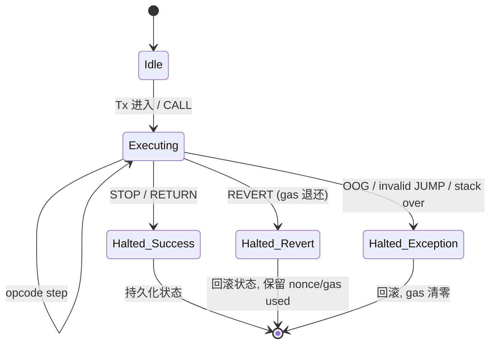

# EVM 架构深度（EVM Architecture Deep Dive）

> **TL;DR**：EVM 是一台 **256-bit 字长、栈式、准图灵完备（受 Gas 限制）** 的确定性虚拟机。执行上下文由 **Stack（最大 1024 项）+ Memory（线性，按字扩展）+ Storage（2^256 键值）+ Calldata + Returndata + Transient Storage (EIP-1153)** 构成。字节码由 ~150 个 opcode 组成，每条 opcode 有固定或动态的 Gas 成本——访问冷 slot 贵、热 slot 便宜（EIP-2929 引入），SSTORE 还区分 0→非 0、非 0→非 0、非 0→0 三档（EIP-2200）。理解 EVM 等于理解 Solidity 为何贵、为何容易出漏洞、为何需要代理升级。本文系统拆解 opcode、内存/存储语义、Gas 计费、调用栈、EOF 演进。

---

## 1. 背景与动机

Vitalik 2013 年构想 EVM 时的目标：**极简、确定、可计量**。前两者要求指令集足够小且无副作用未定义；可计量要求每条指令都能精确计费，避免"停机问题"——这是 Gas 机制的来源。EVM 选择 **栈式** 而不是寄存器式，出于两点：

1. 栈式 VM 的字节码紧凑（单字节 opcode，无寄存器编码），部署成本低。
2. 栈式更容易形式化、编写解释器，而早期客户端多样性（Go / Rust / Python / Java / C++）需要实现门槛低。

**字长 256-bit** 的选择常被批评过宽，但给 Keccak-256/secp256k1 运算原生对齐，省去 big-number 库；也让所有数值共享一种 slot 寻址（Storage 的 key 和 value 都是 256-bit）。代价是 ARM/x86 的 64-bit 寄存器需拆 4 份模拟，软件解释器慢。2024 年后 **evmone**（Ipsilon）通过基线 + advanced 双解释器达到近原生速度。

## 2. 核心原理

### 2.1 形式化定义（黄皮书 §9）

EVM 执行状态 `μ = (g, pc, m, i, s)`：

- `g`：剩余 gas
- `pc`：程序计数器
- `m`：内存（byte array）
- `i`：内存当前大小（以字为单位）
- `s`：栈

执行状态转换：

```
μ_{t+1} = (g - C(σ, μ, I), pc', m', i', s')
```

其中 `C` 是当前 opcode 的 gas 成本函数（见黄皮书附录 G，[execution-specs/src/ethereum/.../gas.py](https://github.com/ethereum/execution-specs)）。异常停机（OOG、栈溢出、JUMP 到非 JUMPDEST 等）会把所有子调用状态回滚并把剩余 gas 清零（REVERT 除外——REVERT 退还剩余 gas）。

核心不变式：

- **栈深度 ≤ 1024**；任何进入超出会 `stack overflow`。
- **调用深度 ≤ 1024**（EIP-150 起降到 1024 hard cap，通过 63/64 规则间接限制递归攻击）。
- **每个 opcode 必须在有限步数内消耗至少 1 gas**，保证停机。

### 2.2 数据区域：Stack / Memory / Storage / Calldata / Returndata / Code / Transient

| 区域 | 生命周期 | 成本级别 | opcode |
| --- | --- | --- | --- |
| Stack | 单次调用 | 极低（3 gas/push） | PUSH/POP/DUP/SWAP |
| Memory | 单次调用 | 低（线性扩展，二次方部分） | MLOAD/MSTORE/MSTORE8/MCOPY |
| Storage | 永久 | **极高**（冷 2100, 热 100, write 20k） | SLOAD/SSTORE |
| Transient Storage | 单次 Tx | 与 warm storage 同级（100） | TLOAD/TSTORE（EIP-1153, Cancun 激活） |
| Calldata | 只读，调用期 | 极低（ZERO=4/NONZERO=16） | CALLDATALOAD/CALLDATASIZE/CALLDATACOPY |
| Returndata | 只读，子调用返回后 | 低 | RETURNDATASIZE/RETURNDATACOPY |
| Code（自己） | 永久只读 | 低 | CODESIZE/CODECOPY |
| ExtCode | 永久只读（他合约） | 冷 2600, 热 100 | EXTCODESIZE/EXTCODEHASH/EXTCODECOPY |

**Memory 扩展成本**：`memory_cost = (a^2)/512 + 3*a`，`a` 以字为单位。所以随着 `a` 增大，每次扩展的边际成本呈线性 → 二次方跃升。大数组拷贝容易爆 Gas。

**Storage Gas（EIP-2929 + EIP-2200 + EIP-3529）**：

```
SSTORE:
  cold access: 2100 (首次触达 slot)
  current == new      : 100
  current != new & current == original:
     original == 0: 20000  (fresh slot)
     new == 0:     2900 + refund 4800
     else:         2900
  current != new & current != original: 100
```

Gas refund 上限 = tx_gas_used / 5（EIP-3529 从 1/2 降到 1/5，打击 GasToken 套利）。

### 2.3 Opcode 分组

按 [evm.codes](https://www.evm.codes/) 与黄皮书附录 H：

| 组 | Opcodes | 说明 |
| --- | --- | --- |
| Stop/Arith (0x00-0x0b) | STOP, ADD, MUL, SUB, DIV, SDIV, MOD, SMOD, ADDMOD, MULMOD, EXP, SIGNEXTEND | EXP 成本与指数字节数线性相关 |
| Compare/Bit (0x10-0x1d) | LT, GT, SLT, SGT, EQ, ISZERO, AND, OR, XOR, NOT, BYTE, SHL, SHR, SAR | SHL/SHR/SAR 由 EIP-145 引入（Constantinople） |
| Keccak (0x20) | KECCAK256 | 30 + 6*word |
| Env Info (0x30-0x3f) | ADDRESS, BALANCE, ORIGIN, CALLER, CALLVALUE, CALLDATALOAD, CALLDATASIZE, CALLDATACOPY, CODE*, GASPRICE, EXTCODE*, RETURNDATA*, EXTCODEHASH, BLOCKHASH | |
| Block Info (0x40-0x48) | BLOCKHASH, COINBASE, TIMESTAMP, NUMBER, DIFFICULTY/PREVRANDAO, GASLIMIT, CHAINID, SELFBALANCE, BASEFEE, BLOBHASH (0x49), BLOBBASEFEE (0x4a) | PoS 后 DIFFICULTY 重解释为 PREVRANDAO |
| Stack/Memory/Storage (0x50-0x5d) | POP, MLOAD, MSTORE, MSTORE8, SLOAD, SSTORE, JUMP, JUMPI, PC, MSIZE, GAS, JUMPDEST, TLOAD, TSTORE, MCOPY | Cancun 加入 TLOAD/TSTORE/MCOPY |
| Push (0x5f-0x7f) | PUSH0 (Shanghai), PUSH1..PUSH32 | PUSH0 省 1 字节立即数 |
| Dup/Swap (0x80-0x9f) | DUP1..DUP16, SWAP1..SWAP16 | |
| Log (0xa0-0xa4) | LOG0..LOG4 | 写 Receipt Trie，前端订阅 |
| System (0xf0-0xff) | CREATE, CALL, CALLCODE (deprecated), RETURN, DELEGATECALL, CREATE2, STATICCALL, REVERT, INVALID, SELFDESTRUCT | SELFDESTRUCT 在 EIP-6780 后语义大改 |

### 2.4 调用 4 兄弟

| opcode | 执行代码 | Storage 归属 | msg.sender 含义 | value 传递 |
| --- | --- | --- | --- | --- |
| CALL | 目标合约 | 目标合约 | 调用者 | 可传 |
| DELEGATECALL | 目标合约 | **调用者** | 原 msg.sender | 保留原 value |
| STATICCALL | 目标合约 | 目标合约 | 调用者 | 不可传（只读） |
| CALLCODE（废弃） | 目标合约 | **调用者** | 调用者 | 可传 |

**DELEGATECALL 是代理升级的基石**：Proxy 合约的 `fallback()` 使用 DELEGATECALL 转发到 Implementation，Storage 读写落在 Proxy 自己的 slot 上。

### 2.5 Gas 的 63/64 规则（EIP-150）

子调用最多传递 `remaining_gas * 63/64`。保证调用栈任意深度都能在回滚时留出至少 ~1.5% gas 给父帧处理异常。这也意味着：**要在目标合约中执行 N gas 的操作，你至少需要 `N * (64/63)^depth` gas**。

### 2.6 EOF（EVM Object Format, EIP-7692 Prague/Osaka）

EOF 把运行时字节码包进一个结构化容器：

```
magic (0xEF00) + version + header (code/data sections) + body
```

带来的关键改进：

- **静态跳转**：RJUMP/RJUMPI/RJUMPV 指令，编译期确定的相对偏移量，消除 JUMP + JUMPDEST 动态扫描。
- **函数节区**：CALLF/RETF，栈验证在部署期完成，禁止栈不平衡。
- **废弃指令**：SELFDESTRUCT、CODESIZE/CODECOPY/EXTCODECOPY、CALLCODE 等在 EOF 合约里禁用。
- **部署期验证**：所有 EOF 合约需通过结构与栈平衡校验才能被创建。

### 2.7 状态转换图（Mermaid）



### 2.8 ASCII 内存布局

```
Stack (栈顶在下)          Memory (线性)                 Storage (键值)
+----------+              +-------+ 0x00                 slot 0: val
|  0x20    | <- top       | 0x20  |                     slot 1: val
|  abi[0]  |              | 0x40  | <- free mem ptr     ...
|   ...    |              | 0x60  | <- zero slot        keccak(k.p)
|   ...    |              | 0x80+ | <- heap             
+----------+              +-------+
```

## 3. 架构剖析

### 3.1 分层视图

1. **客户端进程**：geth、nethermind、reth 等。
2. **EVM 解释器**：core.vm (geth)、evmone (C++)、revm (Rust)。
3. **状态访问层**：`StateDB` 抽象，底层 triedb + PathDB/HashDB。
4. **Precompile 层**：0x01..0x0a 映射到原生 Go/Rust 函数。
5. **Gas & Refund 会计**：贯穿解释器每一步。

### 3.2 核心模块（go-ethereum v1.14.x 视角）

| 模块 | 路径 | 职责 |
| --- | --- | --- |
| `core/vm/evm.go` | EVM 主循环、子调用分发 | 控制 CALL/CREATE 类 opcode |
| `core/vm/interpreter.go` | 栈/PC/Gas 主循环 | 读取 opcode、查 jump table、执行 |
| `core/vm/jump_table.go` | opcode → handler 映射 | 每次硬分叉更新常量/配置 |
| `core/vm/instructions.go` | 每条 opcode 的 Go 实现 | 栈操作、内存、存储 |
| `core/vm/gas_table.go` | 动态 gas 计算 | SSTORE、CALL、EXP 的复杂定价 |
| `core/state/statedb.go` | 读写状态的抽象 | dirtyJournal、revert 支持 |
| `core/vm/contracts.go` | Precompiled 合约 | ECRECOVER、SHA256、MODEXP 等 |
| `core/vm/eips.go` | EIP 开关 | 根据 chain config 启用/禁用 opcode |

### 3.3 端到端生命周期

```
eth_sendRawTransaction (RLP+Sig)
  ↓ txpool 校验 nonce/gas/sign
  ↓ 打包进 payload
Miner/Builder Execute:
  core.ApplyTransaction → core.ApplyMessage
    ↓ StateDB.Prepare (EIP-2929 access list)
    ↓ Intrinsic gas 计算 (21000 + 16/4 per byte)
    ↓ CREATE or CALL
       ↓ EVM.Interpreter.Run loop
          ├── Fetch opcode @ pc
          ├── jump_table[op] 查 handler + static gas
          ├── dynamic gas (SLOAD warm/cold etc)
          ├── 执行 handler → 读写 stack/mem/state
          └── pc += op size  (JUMP 改写 pc)
       ↓ STOP/RETURN/REVERT 出循环
    ↓ refund cap 应用
  ↓ receipt 落 Receipt Trie
  ↓ state root 更新，写入 block header
```

### 3.4 客户端多样性

| 客户端 | 语言 | EVM | 特色 |
| --- | --- | --- | --- |
| go-ethereum | Go | 内置 | 参考实现 |
| nethermind | C# | 内置 | JIT Research |
| besu | Java | 内置 | 企业向 |
| erigon | Go | 内置 | 重构存储 |
| reth | Rust | revm | 性能领先 |
| evmone | C++ | 独立 EVM | 最快解释器（baseline + advanced） |

### 3.5 对外接口

- **JSON-RPC**：`eth_call`（只读，不上链）/ `debug_traceTransaction`（含 opcode trace）。
- **Tracer API**：`callTracer` / `4byteTracer` / 自定义 JS/Go tracer（go-ethereum [eth/tracers](https://github.com/ethereum/go-ethereum/tree/master/eth/tracers)）。
- **evm CLI**：`evm run --code 0x... --input 0x...` 可离线跑字节码。

## 4. 关键代码 / 实现细节

`go-ethereum` 解释器主循环（简化自 [core/vm/interpreter.go](https://github.com/ethereum/go-ethereum/blob/v1.14.12/core/vm/interpreter.go)）：

```go
// go-ethereum/core/vm/interpreter.go (概念简化, 对应 v1.14.x L137-L240)
func (in *EVMInterpreter) Run(contract *Contract, input []byte, readOnly bool) ([]byte, error) {
    var (
        op   OpCode
        mem  = NewMemory()
        stack = newstack()
        pc   = uint64(0)
        cost uint64
    )
    contract.Input = input
    for {
        op = contract.GetOp(pc)                 // 取指
        operation := in.table[op]               // 查 jump table
        if err := operation.validateStack(stack); err != nil { return nil, err }
        // 静态 gas
        if !contract.UseGas(operation.constantGas) { return nil, ErrOutOfGas }
        // 动态 gas（SSTORE/CALL/EXP 等）
        if operation.dynamicGas != nil {
            cost, err = operation.dynamicGas(in.evm, contract, stack, mem, memorySize)
            if err != nil || !contract.UseGas(cost) { return nil, ErrOutOfGas }
        }
        // 执行 handler
        res, err := operation.execute(&pc, in, callCtx)
        if err != nil { return nil, err }
        if operation.halts { return res, nil }
        if !operation.jumps { pc++ }
    }
}
```

Gas 计量的精髓在 `operation.dynamicGas`——SSTORE 就引用了 [gas_table.go/gasSStoreEIP2200](https://github.com/ethereum/go-ethereum/blob/v1.14.12/core/vm/gas_table.go)，精确实现 EIP-2200 + EIP-2929 + EIP-3529 的三层定价。

## 5. 演进与版本对比

| 硬分叉 | 日期 | EVM 关键变化 |
| --- | --- | --- |
| Homestead | 2016-03 | DELEGATECALL 加入 |
| Byzantium | 2017-10 | REVERT、STATICCALL、RETURNDATA、modexp/bn256 预编译 |
| Constantinople | 2019-02 | SHL/SHR/SAR、CREATE2、EXTCODEHASH |
| Istanbul | 2019-12 | CHAINID、SELFBALANCE、Gas 重定价 EIP-2200 |
| Berlin | 2021-04 | EIP-2929 冷热 slot、EIP-2930 AccessList |
| London | 2021-08 | EIP-1559 BASEFEE opcode |
| Shanghai | 2023-04 | PUSH0 (EIP-3855) |
| Cancun | 2024-03 | TLOAD/TSTORE (EIP-1153)、MCOPY (EIP-5656)、BLOBHASH/BLOBBASEFEE、SELFDESTRUCT 语义弱化 (EIP-6780) |
| Prague/Osaka | 2025 | EOF (EIP-7692 套件)、EIP-7702 账户抽象 |

## 6. 实战示例

反汇编 + 运行一段字节码：

```bash
# 源码：return 42
cat > ret42.sol <<'EOF'
contract C { function f() external pure returns (uint) { return 42; } }
EOF
solc --bin-runtime ret42.sol
# 得到 runtime bytecode e.g. 6080604052...602a...

# evm 工具（geth 自带）
evm --codefile bytecode.hex --input 0x26121ff0 run
# --- 输出 ---
# PC 0x00: PUSH1 0x80
# PC 0x02: PUSH1 0x40
# PC 0x04: MSTORE
# ...
# OUT: 0x000000000000000000000000000000000000000000000000000000000000002a   (十六进制 42)
# Gas used: 21380
```

想要调试主网 tx？`cast run 0x<txhash>` 或 `debug_traceTransaction` 即可逐 opcode 回放。

## 7. 安全与已知攻击

- **重入（The DAO, 2016）**：CALL 在转账前未更新状态，被回调递归提取 $60M。对策：CEI 模式 + ReentrancyGuard（见 `solidity-patterns.md`）。
- **整数溢出（BEC, 2018）**：乘法溢出铸造天量代币。Solidity 0.8 默认启用 checked math，彻底终结此类。
- **delegatecall 存储碰撞**：代理合约 slot 0/1 被 implementation 意外改写（Parity Multisig 2017，$300M 冻结）。对策：EIP-1967 固定 slot + storage gap。
- **短地址攻击**：早期 ABI 解码缺字节补 0 导致转账数额被左移。现代 ABI 规范与 solc 已修复。
- **Gas 估算钓鱼**：`block.gaslimit` 或 `gasleft()` 被用作条件，63/64 规则下攻击者可精准构造失败路径。
- **tx.origin 钓鱼**：合约用 `tx.origin` 做权限校验可被中间合约代理劫持。一律用 `msg.sender`。

## 8. 与同类方案对比

| 维度 | EVM | WASM | SBF (Solana) | MoveVM |
| --- | --- | --- | --- | --- |
| 字长 | 256-bit | 32/64-bit | 64-bit | 64-bit |
| 执行效率 | 低 | 高 | 高 | 中 |
| 形式化 | 黄皮书/execution-specs | WASM spec | 无正式规范 | Move prover |
| 生态成熟度 | 极高 | 中 | 中 | 中 |
| 升级 | 代理 | 原生 migrate | 原生 upgrade | 原生 package upgrade |

EVM 的"慢且贵"是功能——它把成本强加到状态写入，间接倒逼开发者把逻辑上链、数据下链。

## 9. 延伸阅读

- **规范**：[Yellow Paper](https://ethereum.github.io/yellowpaper/paper.pdf)、[execution-specs](https://github.com/ethereum/execution-specs)。
- **工具**：[evm.codes](https://www.evm.codes/)（交互式 opcode 表）、[Playground](https://www.evm.codes/playground)。
- **Paradigm**：《An Introduction to EVM》、《Anatomy of the EVM》。
- **EIP 精华**：EIP-150 / 2200 / 2929 / 1153 / 5656 / 6780 / 7692。
- **论文**：KEVM（形式语义化 EVM）。
- **视频**：Austin Griffith "EVM from scratch"、Noxx Substack EVM 系列。

## 10. 术语表

| 术语 | 英文 | 释义 |
| --- | --- | --- |
| 操作码 | Opcode | EVM 指令的 1 字节编号 |
| 栈 | Stack | 最大 1024 项的 256-bit 值栈 |
| 内存 | Memory | 调用期线性字节数组 |
| 存储 | Storage | 永久 KV，2^256 slot |
| 瞬态存储 | Transient Storage | 单 Tx 内有效的 KV（EIP-1153） |
| 预编译 | Precompile | 0x01-0x0a 的 VM 原生函数 |
| 代理 | Proxy | 通过 DELEGATECALL 转发的合约 |
| EOF | EVM Object Format | 结构化字节码容器（EIP-7692） |

---

*Last verified: 2026-04-22*
