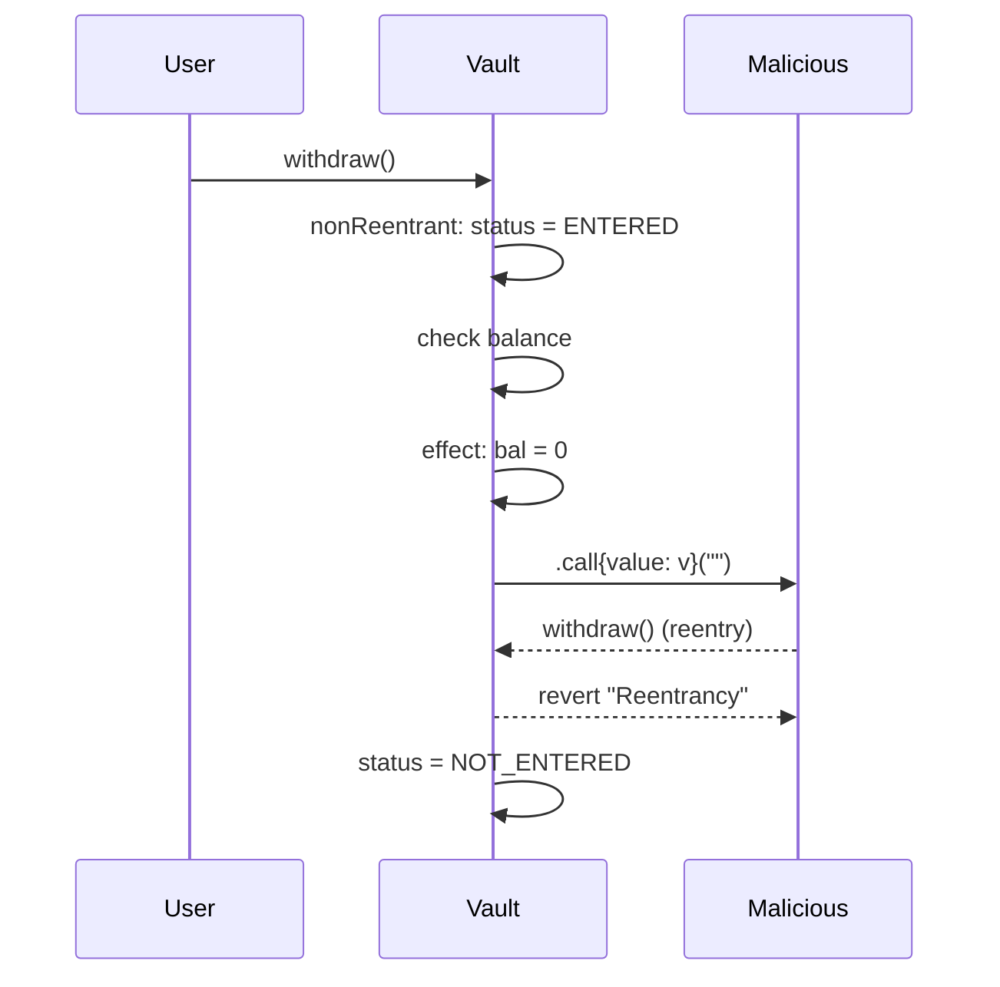

# Solidity 设计模式与最佳实践（Solidity Design Patterns）

> **TL;DR**：智能合约的坑集中在三处：**外部调用（重入）、权限（错误的 owner 模型）、资产记账（Push vs Pull、状态顺序）**。由此产生了几条必守设计模式：**Checks-Effects-Interactions (CEI)**、**Pull over Push**、**ReentrancyGuard**、**Factory / Clones（EIP-1167）**、**Pausable / CircuitBreaker**、**AccessControl / Role-Based**、**RateLimiter**、**SafeERC20**、**Permit2 / EIP-2612**、**Witness / Commit-Reveal**。本文按"问题驱动"的顺序逐个拆解，每个模式给出 Gas 代价、反例、OpenZeppelin 对应组件与 solmate 差异。

---

## 1. 背景与动机

Solidity 合约部署后 **代码/存储不可直接改写**（除非提前设计代理），每个 Gas 都要乘以"全球执行"常数。再加上调用者可能是任意合约——包括专门为攻击设计的——开发实践自发形成了一套"防御式编程"风格。这套风格大多源于两起事件：

1. **DAO 2016**：重入攻击暴露"先转账后记账"是灾难，催生 CEI。
2. **Parity Multisig 2017**：未保护的 `initWallet` 函数被公开调用，4.5 小时 freeze $300M，催生"default deny"权限模型。

OpenZeppelin Contracts 从 2018 年起把这些模式沉淀为可继承的 mixin；solmate / solady 则代表"最小 Gas 路线"的替代实现。

## 2. 核心原理

### 2.1 CEI 模式（Checks-Effects-Interactions）

函数体按固定顺序：

```
1. Checks       —— require / custom error / access 校验
2. Effects      —— 修改 state (storage) ；发射 event 也通常放这里
3. Interactions —— 外部调用（transfer, CALL, delegatecall）
```

理由：重入攻击在第 3 步"外部调用"中劫持控制流回到本合约，如果本合约 state 未及时更新，攻击者可以重复通过 check。CEI 等价于"临界区隔离"。

反例（脆弱）：

```solidity
function withdraw() external {
    uint256 v = bal[msg.sender];
    msg.sender.call{value: v}("");     // 3. interaction
    bal[msg.sender] = 0;                // 2. effect（太晚！）
}
```

攻击者在 fallback 里再次调用 withdraw，bal 未清零，金库被抽干。

### 2.2 Pull over Push

Push：合约主动 `send/transfer/call` 给收款方。
Pull：收款方主动 `withdraw`。

Push 的致命弱点是 **DoS by receiver revert**——一个拒收的地址可以卡住整个结算循环（典型：拍卖合约在 refund 上一个 bidder 时 revert，新人无法出价）。

Pull 模式用 `mapping(address => uint256) credit` 把"欠款"记账，由债权人主动取出——失败只影响自己。

### 2.3 ReentrancyGuard

```solidity
uint256 private constant _NOT_ENTERED = 1;
uint256 private constant _ENTERED     = 2;
uint256 private _status = _NOT_ENTERED;

modifier nonReentrant() {
    require(_status == _NOT_ENTERED, "Reentrancy");
    _status = _ENTERED;
    _;
    _status = _NOT_ENTERED;
}
```

0.8.24 之后 **OpenZeppelin 5.x 使用 transient storage（TSTORE/TLOAD）**，Gas 从 ~5000 降到 ~200/笔。核心思想：用瞬态 slot 存锁标志，单 tx 内部有效，tx 结束自动清零。

注意：ReentrancyGuard 只防本合约内的再入，**跨合约只读重入（read-only reentrancy）** 需要 `nonReentrantView`（0.8.21+ OZ 提供）。Curve 在 2023 年因只读重入被攻击过 $70M。

### 2.4 Factory / Clones (EIP-1167 Minimal Proxy)

部署多实例合约若每个都存完整 bytecode，Gas 天文数字。EIP-1167 提供仅 ~45 字节的 runtime：

```
runtime = 0x363d3d373d3d3d363d73{impl_address}5af43d82803e903d91602b57fd5bf3
```

核心：DELEGATECALL 转发到 `impl_address`，本 clone 只有 storage。部署一个 clone ~40k gas vs ~1M+ 全量部署。适用场景：Uniswap V3 pool、Superfluid stream 等每个资产/用户一实例的系统。

更新版 **EIP-1167 CREATE2 变体** 与 **Solady 的 Clone + Args**（带 immutable args 内联）为现代主流。

### 2.5 Pausable / Circuit Breaker

```solidity
bool public paused;
modifier whenNotPaused() { require(!paused, "paused"); _; }
function pause() external onlyOwner { paused = true; emit Paused(); }
```

意图：当监控系统发现异常（如价格源跳变、TVL 骤降），合约可"熔断"阻止新的写操作。设计上要区分 **partial pause**（仅深层操作）与 **emergency full pause**，且 pause 权限本身要多签或 timelock。

### 2.6 AccessControl / Role-Based

OpenZeppelin `AccessControl` 使用 `bytes32 role`：

```solidity
bytes32 public constant MINTER_ROLE = keccak256("MINTER_ROLE");
function mint(address to, uint256 v) external onlyRole(MINTER_ROLE) {...}
```

比 `onlyOwner` 更细粒度，可以把 mint / pause / upgrade 各自独立授权给不同 multisig / DAO。配合 `AccessControlDefaultAdminRules`（5.x）还能把 "admin 角色" 本身加时间锁，防私钥一次泄漏造成毁灭性后果。

### 2.7 Commit-Reveal

抵抗抢跑（front-running）：用户先提交 `commit = keccak256(abi.encode(secret, msg.sender))`，等若干块后 `reveal(secret)`。常用于盲拍、ENS 注册。

### 2.8 SafeERC20 与 ERC20 非标准性

现实中 USDT、BNB 这些"元老币"不按规范返回 bool，直接 `IERC20.transfer` 在 Solidity 0.8 编译下会 revert（因为静默缺失返回值）。`SafeERC20.safeTransfer` 用低级 call + 解码兼容层规避。

### 2.9 Permit2 / EIP-2612

传统"approve + transferFrom"需两笔 tx + 两次 Gas。EIP-2612 `permit()` 允许链下签名授权，单 tx 完成。Uniswap Permit2（2022）进一步把 approve 集中到一个合约，多 dApp 复用；兼容性更广（任意 ERC20）。

### 2.10 子机制图：CEI + ReentrancyGuard 组合



## 3. 架构剖析

### 3.1 分层视图

1. **Guard Layer**：modifier（nonReentrant、onlyRole、whenNotPaused）。
2. **State Layer**：存储结构（mapping、struct），关注 slot 打包。
3. **Logic Layer**：核心业务逻辑。
4. **Interaction Layer**：对外 call（ERC20、ERC721、其他协议）。
5. **Event Layer**：日志发射供前端/子图订阅。

### 3.2 核心模块清单（OpenZeppelin v5.x）

| 模块 | 路径 | 职责 | 依赖 |
| --- | --- | --- | --- |
| `access/Ownable.sol` | 单 owner 模型 | 最简权限 | - |
| `access/AccessControl.sol` | 角色授权 | 细粒度 | - |
| `access/manager/AccessManager.sol` | 集中式权限 | 带时间延迟 | - |
| `utils/ReentrancyGuard.sol` | 防重入 | transient 版 5.1+ | - |
| `utils/Pausable.sol` | 熔断 | | - |
| `proxy/Clones.sol` | EIP-1167 | minimal proxy factory | - |
| `proxy/ERC1967` / `proxy/utils/UUPSUpgradeable.sol` | UUPS | 合约升级 | Ownable |
| `token/ERC20/utils/SafeERC20.sol` | 兼容非标 ERC20 | - |
| `governance/TimelockController.sol` | 延迟执行 | 适合 DAO 操作 |

### 3.3 端到端示例：一次 Vault 存款的防御流程

```
User → Vault.deposit(100 USDC)
  1. nonReentrant 设置 status=ENTERED
  2. Checks: amount > 0 ; allowance >= amount
  3. Effects: totalShares += s ; positions[user] += amount ; emit Deposit
  4. Interactions: SafeERC20.safeTransferFrom(user, vault, amount)
  5. nonReentrant 还原 status=NOT_ENTERED
```

若 4 失败 revert，整笔 tx 回滚，状态原子。若 USDC 实现恶意 transferFrom 回调本合约，5 阻拦。

### 3.4 替代实现对比

| 库 | 风格 | Gas | 安全假设 | 备注 |
| --- | --- | --- | --- | --- |
| OpenZeppelin | 文档化最强、审计多 | 中 | 严谨 | 生态事实标准 |
| solmate (Rari→t11s) | 极简、激进优化 | 低 | 自负责 | `FixedPointMathLib`、`ERC20` |
| solady (Vectorized) | 汇编导向、省 gas | 最低 | 自负责 | `LibClone` 配 Clones-with-args |
| PRBMath | 定点数学 | 中 | 严谨 | Perpetual / DeFi 数学 |

### 3.5 检测工具接口

- **Slither**（静态分析，crytic/slither）：检查 CEI、unchecked-send、tx.origin、storage 碰撞。
- **Mythril / MythX**：符号执行。
- **Echidna / Foundry invariant**：模糊测试不变式。
- **Certora Prover / Halmos**：形式化验证，配合规范文件。

## 4. 关键代码 / 实现细节

OpenZeppelin 5.1 中 ReentrancyGuardTransient（[contracts/utils/ReentrancyGuardTransient.sol](https://github.com/OpenZeppelin/openzeppelin-contracts/blob/v5.1.0/contracts/utils/ReentrancyGuardTransient.sol)）：

```solidity
// openzeppelin-contracts/contracts/utils/ReentrancyGuardTransient.sol (v5.1.0, L~25-L~55 概念化)
abstract contract ReentrancyGuardTransient {
    // bytes32(uint256(keccak256("openzeppelin.storage.ReentrancyGuard")) - 1)
    bytes32 private constant REENTRANCY_GUARD_STORAGE = 0x9b779b17422d0df92223018b32b4d1fa46e071723d6817e2486d003becc55f00;

    error ReentrancyGuardReentrantCall();

    modifier nonReentrant() {
        _nonReentrantBefore();
        _;
        _nonReentrantAfter();
    }

    function _nonReentrantBefore() private {
        if (_reentrancyGuardEntered()) revert ReentrancyGuardReentrantCall();
        assembly { tstore(REENTRANCY_GUARD_STORAGE, 1) }   // EIP-1153 瞬态
    }
    function _nonReentrantAfter() private {
        assembly { tstore(REENTRANCY_GUARD_STORAGE, 0) }
    }
    function _reentrancyGuardEntered() internal view returns (bool e) {
        assembly { e := tload(REENTRANCY_GUARD_STORAGE) }
    }
}
```

单笔 tx 结束后 transient slot 自动归零，省掉传统 `_NOT_ENTERED` 的重置 SSTORE。在 Cancun 后的 EVM 上成本从 ~5000 gas 降到 ~200 gas。

## 5. 演进与版本对比

| 模式 | 出现 | 状态 |
| --- | --- | --- |
| CEI | 2016 DAO 后 | 必用 |
| Pull over Push | 2017 | 事实标准 |
| EIP-1167 Clones | 2018 | 稳定 |
| EIP-2612 permit | 2020 | 广泛采用 |
| Permit2 | 2022 | 成新标准 |
| ReentrancyGuard Transient | 2024 Cancun | 逐步替代原版 |
| ERC-7683（跨链意图） | 2024 | 新兴 |

## 6. 实战示例

完整 Factory + Clones + Pausable 模板：

```bash
# Foundry 项目
forge install OpenZeppelin/openzeppelin-contracts
```

```solidity
// src/VaultFactory.sol
pragma solidity ^0.8.26;
import {Clones} from "@openzeppelin/contracts/proxy/Clones.sol";
import {Vault} from "./Vault.sol";

contract VaultFactory {
    address public immutable implementation;
    event VaultCreated(address indexed asset, address vault);

    constructor() { implementation = address(new Vault()); }

    function create(address asset) external returns (address v) {
        v = Clones.cloneDeterministic(implementation, keccak256(abi.encode(asset)));
        Vault(v).initialize(asset);
        emit VaultCreated(asset, v);
    }

    function predict(address asset) external view returns (address) {
        return Clones.predictDeterministicAddress(
            implementation, keccak256(abi.encode(asset)), address(this));
    }
}
```

`forge test -vv` 验证部署 + 调用。Gas 报告：`forge test --gas-report` 会显示 clone 部署约 40k gas（对比 new Vault 约 900k）。

## 7. 安全与已知攻击

| 事件 | 年份 | 损失 | 模式相关 |
| --- | --- | --- | --- |
| The DAO | 2016 | $60M | 缺 CEI |
| Parity Multisig | 2017 | $300M freeze | 缺初始化保护 |
| Lendf.Me (imBTC 重入) | 2020 | $25M | ERC-777 hook 重入 |
| Cream Finance | 2021 | $130M | 价格预言机 + 闪电贷 |
| Cream v2 read-only reentrancy | 2022 | $130M | 只读重入 |
| Curve vyper 0.2.15-17 | 2023 | $70M | 编译器 bug 绕过 reentrancy lock |
| Euler | 2023 | $197M | donate-to-reserves 路径 |
| UwU Lend | 2024 | $20M | Oracle 操纵 + 闪电贷 |

## 8. 与同类方案对比

| 维度 | OpenZeppelin | solmate | solady | 自行实现 |
| --- | --- | --- | --- | --- |
| 审计次数 | 多 | 少 | 少 | 无 |
| Gas | 中 | 低 | 最低 | - |
| 可读性 | 高 | 中 | 低（汇编多） | - |
| 文档 | 完备 | 中 | 源码为主 | - |
| 推荐场景 | 生产/DAO | 熟练团队 | Gas 苛刻（DEX/MEV） | 学习勿上线 |

## 9. 延伸阅读

- **OpenZeppelin Docs**：https://docs.openzeppelin.com/contracts/5.x/
- **Solidity Patterns**：https://fravoll.github.io/solidity-patterns/
- **Consensys Best Practices**：https://consensys.github.io/smart-contract-best-practices/
- **Trail of Bits' "Building Secure Contracts"**：https://github.com/crytic/building-secure-contracts
- **rekt.news**：逐事件复盘
- **Samczsun / Paradigm**：漏洞分析博客

## 10. 术语表

| 术语 | 英文 | 释义 |
| --- | --- | --- |
| 重入 | Reentrancy | 外部调用回调本合约劫持控制流 |
| CEI | Checks-Effects-Interactions | 固定顺序防御 |
| 熔断 | Circuit Breaker / Pausable | 紧急停摆 |
| 克隆 | Clone (EIP-1167) | 最小代理 |
| 只读重入 | Read-only Reentrancy | 在 view 函数读取半更新状态 |

---

*Last verified: 2026-04-22*
