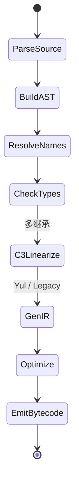

# Solidity 语法与类型系统（Solidity Syntax & Type System）

> **TL;DR**：Solidity 是 **静态类型、契约（contract）面向对象、编译到 EVM bytecode** 的语言，语法借鉴 C++/JS。关键概念：**变量存储位置（storage/memory/calldata）**、**可见性（public/external/internal/private）**、**状态可变性（pure/view/payable/nonpayable）**、**修饰器（modifier）**、**接口（interface）与抽象合约（abstract）**、**继承（C3 线性化）**、**custom errors（比 require 省 gas）**、**用户自定义值类型 UDVT**、**immutable/constant**。0.8 之后默认启用 checked arithmetic，0.8.26 稳定了 `transient` 存储与 EOF 支持前置语法。本文按编译器视角拆解每一个语法单元、给出 Gas 取舍与常见陷阱。

---

## 1. 背景与动机

Gavin Wood 在 2014 年构想 Solidity，目标是提供"类 JavaScript 的熟悉度 + 强类型 + 智能合约原生概念"。在此之前有 Serpent（Python 风，因 bug 被弃）、LLL（Lisp 风，过度底层）。Solidity 成功之处在于 **语法可读 + solc 编译器对 EVM 的深度优化 + 生态标准库（OpenZeppelin）**。

但 Solidity 的历史包袱不小：

- 早期 0.4 允许 `function` 默认 public，`uint` 溢出静默——这些被归类为"bug-by-default"。
- 继承与修饰器的组合，配合 storage 布局，容易出代理升级的 bug。
- `delegatecall` 语义不上升到语言层，需要开发者手动 care。

0.8.x 系列（2021-）是 Solidity 的"现代化转折点"：默认 overflow check、custom errors、UDVT、immutable、file-level constants/functions，安全属性大幅提升。

## 2. 核心原理

### 2.1 形式化：Solidity → EVM 的降级路径

```
Source (.sol)
  ↓ Parser: AST
  ↓ Analyzer: 类型检查 / 作用域 / 继承线性化 (C3)
  ↓ IR Generator: Yul / Legacy IR
  ↓ Yul Optimizer (yulOptimiser)
  ↓ EVM code generator
  ↓ Metadata + ABI emit
```

`solc --ir` 可以看到 Yul 中间表示，这是理解 Solidity 优化的首选切入点。

### 2.2 类型系统

**值类型（value type）** 传递按复制，**引用类型（reference type）** 传递需声明存储位置：

| 类别 | 成员 | 注释 |
| --- | --- | --- |
| 整数 | `uint8..uint256`、`int8..int256`（8 位步进） | 默认 uint256 |
| 布尔 | `bool` | 占 1 个 slot 最低 1 字节 |
| 地址 | `address`、`address payable` | payable 版本有 `.transfer/.send` |
| 定长字节 | `bytes1..bytes32` | 右对齐 |
| 动态 bytes | `bytes`、`string` | 引用类型 |
| 数组 | `T[N]`（定长）、`T[]`（动态） | 引用 |
| 映射 | `mapping(K => V)` | 仅可在 storage |
| 结构 | `struct` | 引用 |
| 枚举 | `enum` | 底层 uint8 |
| 用户定义值类型 | `type Price is uint256;` (UDVT) | 0.8.8+ |
| 函数类型 | `function (uint) external returns (uint)` | 可作参数/返回 |
| 合约类型 | `IERC20(addr)` | 转为 address |

### 2.3 存储位置（Data Location）

函数参数与局部变量必须显式声明：

- **storage**：永久，读写贵（SLOAD/SSTORE）。状态变量默认在此。
- **memory**：调用期暂存，函数退出释放；MLOAD/MSTORE 便宜。
- **calldata**：只读输入区，最便宜；`external` 函数入参默认 calldata。
- **stack**：值类型局部变量默认；EVM stack 只能放 1024 项。

Solidity 的一个常见陷阱：

```solidity
function push(Item[] storage arr, Item memory x) internal {
    arr.push(x);          // OK: memory → storage
}
function mut(Item[] storage arr) internal {
    Item storage item = arr[0]; // 引用
    Item memory copy = arr[0];  // 拷贝（贵）
}
```

`storage` 引用赋值给 `storage` 是指针别名；赋值给 `memory` 是按值拷贝——这在循环中非常昂贵。

### 2.4 可见性（Visibility）

| 修饰 | 可调用位置 | 典型用途 |
| --- | --- | --- |
| `external` | 仅外部 | 对 ABI 暴露；calldata 便宜 |
| `public` | 外部 + 内部 | 状态变量默认 getter |
| `internal` | 本合约 + 继承 | 辅助函数、library |
| `private` | 本合约 | 仅作可见性提示——链上数据仍可读 |

**"private 不是保密"**：链上所有 storage 都可读，`private` 仅阻止 Solidity 编译时其他合约 import。

### 2.5 状态可变性（State Mutability）

| 修饰 | 可写 state | 可读 state | 可收 ETH | Gas 提示 |
| --- | --- | --- | --- | --- |
| `nonpayable`（默认） | ✓ | ✓ | ✗ | |
| `view` | ✗ | ✓ | ✗ | 可用 `eth_call` 本地运行 |
| `pure` | ✗ | ✗ | ✗ | 无任何外部依赖 |
| `payable` | ✓ | ✓ | ✓ | 允许接收 msg.value |

solc 会对 `view`/`pure` 做静态检查，违反即编译失败。`STATICCALL` opcode 在运行时再强制一次。

### 2.6 修饰器（modifier）

```solidity
modifier onlyOwner() {
    if (msg.sender != owner) revert NotOwner();
    _;              // 被修饰函数的代码植入这里
}
function withdraw() external onlyOwner { ... }
```

修饰器本质是 AST 改写：被修饰函数体被"内联"到 `_` 处。缺点是多个修饰器同时使用时易产生意外的执行顺序，且代码在每次调用都被重复内联、增加部署成本。现代实践倾向用 internal 函数 + 显式调用，只在权限/CEI 场景保留 modifier。

### 2.7 继承与 C3 线性化

多继承时 Solidity 采用 **C3 线性化**（Python 同源）算法解决菱形继承顺序。基类声明顺序从 "最基" 到 "最派"：

```solidity
contract A { function foo() public virtual {} }
contract B is A { function foo() public virtual override {} }
contract C is A { function foo() public virtual override {} }
contract D is B, C { function foo() public override(B, C) { super.foo(); } }
// 线性化: D → C → B → A；super.foo() 调用顺序按此链
```

`super` 并非"父类"，而是"线性化链中下一个"。OpenZeppelin 大量使用可组合抽象合约（Ownable、ReentrancyGuard、Pausable 等），理解 super 调用链是 Debug 必备。

### 2.8 错误处理

从 0.8.4 起推荐 **custom errors**（Gas 比 `require(..., "message")` 省 50+ bytes 部署 + 约 20 gas/revert）：

```solidity
error InsufficientBalance(address user, uint256 needed, uint256 has);

function pay(uint256 v) external {
    if (bal[msg.sender] < v) 
        revert InsufficientBalance(msg.sender, v, bal[msg.sender]);
}
```

`revert` / `require` / `assert` 三者语义差异：

- `require(cond, reason)`：条件不满足 revert + 返还 gas。字符串 reason 占 bytecode。
- `revert CustomError(args)`：同上，但 error selector 4 字节 + abi.encode。
- `assert(cond)`：用于不可能为假的不变式——0.8 前会消耗所有 gas，0.8 后与 revert 一样退还但会触发 `Panic(0x01)`。

### 2.9 状态机图（函数解析）



## 3. 架构剖析

### 3.1 分层视图

1. **前端**：Lexer/Parser → AST（`libsolidity/ast`）。
2. **分析层**：NameResolver、TypeChecker、ContractLevelChecker、StaticAnalyzer。
3. **中端**：IR 生成器 → Yul。
4. **优化器**：YulOptimiser（SSA-like 变换、CSE、CopyPropagation、Unroller）。
5. **后端**：Yul → EVM bytecode（AsmAnalyzer + CodeGen）。
6. **元数据**：ABI/NatSpec/StorageLayout 输出。

### 3.2 核心模块清单（[solidity v0.8.26](https://github.com/ethereum/solidity)）

| 模块 | 路径 | 职责 |
| --- | --- | --- |
| AST | `libsolidity/ast/` | 语法树类型定义 |
| 分析 | `libsolidity/analysis/` | 静态检查、控制流 |
| Yul IR | `libyul/` | Yul 语言 + 优化器 |
| Code Gen | `libsolidity/codegen/` | IR/Legacy code 生成 |
| Interface | `libsolidity/interface/` | StandardCompiler（JSON I/O） |
| SMT Checker | `libsmtutil/` | 形式化验证（Z3/CVC5） |
| CLI | `solc/` | 命令行入口 |

### 3.3 编译生命周期

```
solc --standard-json input.json
    1. parse → AST
    2. analyze (types, scopes, mutability, overrides)
    3. IR gen (Yul) - 如 --via-ir
    4. yulOptimiser (multiple passes, configurable)
    5. evm code gen
    6. link libraries
    7. emit: ABI / bin / bin-runtime / metadata / storageLayout
```

`--via-ir` 开启 Yul IR pipeline，是 0.8.14+ 的默认优化路径，比 legacy 生成器 Gas 更省但编译慢。

### 3.4 参考实现多样性

仅 `solc`（C++，官方）一家；另有 `hardhat` 内嵌的 WebAssembly 版（soljson.js）和 `foundry` 通过 `svm` 管理多版本。

### 3.5 对外接口

- `--standard-json`：IDE 集成主接口（Hardhat / Foundry / Remix 都走它）。
- `--ast-compact-json`：导出 AST，静态分析工具（Slither）使用。
- `--storage-layout`：Upgrade 工具（OZ Upgrades, @openzeppelin/upgrades-core）的核心。
- **SMT Checker**：`pragma experimental SMTChecker;` 或 CLI `--model-checker-engine bmc`，用 Z3/CVC5 验证不变式。

## 4. 关键代码 / 实现细节

一个现代 Solidity 合约骨架，覆盖本文的多数语法点：

```solidity
// SPDX-License-Identifier: MIT
pragma solidity ^0.8.26;

import {IERC20} from "@openzeppelin/contracts/token/ERC20/IERC20.sol";

/// @title 最小化 Vault
/// @notice 演示语法与 Gas 友好实践
contract Vault {
    // ---------- 类型 ----------
    type Shares is uint256;                          // UDVT
    struct Position { uint128 amount; uint64 since; uint64 lock; }

    // ---------- 常量 / immutable ----------
    address public immutable asset;                  // 部署时确定, bytecode 内联
    uint256 public constant MIN_LOCK = 1 days;       // 编译期确定

    // ---------- 存储 ----------
    mapping(address user => Position) private positions; // 命名键 (0.8.18+)
    uint256 private totalShares;

    // ---------- 事件 & 错误 ----------
    event Deposit(address indexed user, uint256 amount, Shares shares);
    error ZeroAmount();
    error StillLocked(uint64 until);

    // ---------- 修饰器 ----------
    modifier nonZero(uint256 v) { if (v == 0) revert ZeroAmount(); _; }

    constructor(address _asset) { asset = _asset; }

    // ---------- 核心函数 ----------
    function deposit(uint256 amount, uint64 lock)
        external
        nonZero(amount)
        returns (Shares shares)
    {
        IERC20(asset).transferFrom(msg.sender, address(this), amount);

        uint256 s = totalShares == 0
            ? amount
            : amount * totalShares / IERC20(asset).balanceOf(address(this));
        shares = Shares.wrap(s);

        Position storage p = positions[msg.sender];  // storage 指针, 非拷贝
        unchecked { p.amount += uint128(amount); }   // 已 check 过 >0
        p.since = uint64(block.timestamp);
        p.lock  = lock;

        totalShares += s;
        emit Deposit(msg.sender, amount, shares);
    }

    function withdraw() external returns (uint256 amount) {
        Position memory p = positions[msg.sender];   // memory 拷贝一次便宜
        if (block.timestamp < p.since + p.lock) 
            revert StillLocked(p.since + p.lock);
        amount = uint256(p.amount);
        delete positions[msg.sender];                // 触发 refund
        // CEI: 先改状态, 后外部调用
        IERC20(asset).transfer(msg.sender, amount);
    }

    // ---------- view ----------
    function shareOf(address u) external view returns (uint256) {
        return uint256(positions[u].amount);
    }
}
```

亮点：custom errors、UDVT、named mapping keys、immutable、CEI、存储/内存选择。

## 5. 演进与版本对比

| 版本 | 年份 | 关键语法 |
| --- | --- | --- |
| 0.4.x | 2016–2018 | `function` 默认 public, 溢出静默, `var` 类型推导 |
| 0.5.x | 2018 | 显式可见性, 移除 `var`, 函数指针强化 |
| 0.6.x | 2019 | `virtual/override` 强制, `try/catch` 外部调用, `abstract` |
| 0.7.x | 2020 | 移除 `constructor() public`, 清理历史语法 |
| 0.8.0 | 2020-12 | **默认 checked arithmetic**, 移除 `now/block.difficulty` 字面量 |
| 0.8.4 | 2021 | Custom errors |
| 0.8.8 | 2021 | User Defined Value Types (UDVT) |
| 0.8.14 | 2022 | `--via-ir` 默认优化提升 |
| 0.8.18 | 2023 | Named mapping/event params |
| 0.8.24 | 2024 | TLOAD/TSTORE, MCOPY, transient 支持 |
| 0.8.26 | 2024 | EOF 相关前瞻语法（实验） |

## 6. 实战示例

```bash
solc --version        # solc 0.8.26+commit.8a97fa7a
solc --via-ir --optimize --optimize-runs 200 \
     --bin --abi --storage-layout -o out Vault.sol

# 查看 Yul IR
solc --ir-optimized Vault.sol > Vault.yul

# 看 storage 布局
jq '.contracts["Vault.sol"].Vault.storageLayout' out/*.json
# {
#   "storage": [
#     {"slot":"0","type":"...mapping..."},
#     {"slot":"1","type":"t_uint256"}
#   ],
#   "types": {...}
# }
```

## 7. 安全与已知攻击

- **存储碰撞（Proxy）**：两合约 storage slot 0 冲突。对策：EIP-1967 固定 slot；`storage gap`。
- **函数选择器碰撞**：两不同签名 Keccak[0:4] 相同。对策：Diamond 标准强制检测；solc 警告。
- **uint 溢出**：0.8 前主凶，BEC 代币 2018 损失数千万。0.8 默认 checked 解决。
- **delegatecall 到未信合约**：执行任意代码、改写自身存储。对策：只 delegate 到 audited 固定地址。
- **tx.origin 权限检查**：中间合约劫持。对策：`msg.sender`。
- **abi.encodePacked 冲突**：动态类型拼接可构造碰撞哈希。对策：用 `abi.encode` 或固定长度字段。
- **Signature malleability**：secp256k1 对称性，同签名对有两个合法 s。对策：ecrecover 包装校验 s ∈ 下半域；或用 OZ ECDSA。

## 8. 与同类方案对比

| 维度 | Solidity | Vyper | Yul | Huff |
| --- | --- | --- | --- | --- |
| 风格 | JS/C++ | Python | 汇编 IR | 纯 opcode |
| 安全默认 | 0.8+ 强 | 强（无继承、无 modifier、无汇编默认） | 弱 | 无 |
| Gas | 中 | 中（有时更省） | 低 | 最低 |
| 生态 | 极丰富 | 适中（Curve/Lido LDO 部分模块） | 专用 | 小众 |
| 学习曲线 | 中 | 低 | 高 | 极高 |

## 9. 延伸阅读

- **官方文档**：[docs.soliditylang.org](https://docs.soliditylang.org/en/v0.8.26/)。
- **博客**：Solidity Blog 每版本 release notes。
- **最佳实践**：[Consensys Secure Development](https://consensys.github.io/smart-contract-best-practices/)、[Solcurity Codes](https://github.com/transmissions11/solcurity)。
- **优化**：[Solidity Optimizer Docs](https://docs.soliditylang.org/en/latest/internals/optimizer.html)、[yul-optimizer paper](https://github.com/ethereum/solidity/issues/7327)。
- **EIP 相关**：EIP-165 / 1014 / 1153 / 3074 / 4337。
- **视频**：Patrick Collins "Learn Solidity"、smart-contract-programmer YouTube。

## 10. 术语表

| 术语 | 英文 | 释义 |
| --- | --- | --- |
| 可见性 | Visibility | public/external/internal/private |
| 修饰器 | Modifier | AST 改写的函数装饰 |
| 自定义错误 | Custom Error | 4-byte selector + abi 编码的 revert payload |
| 状态变量 | State Variable | 存储在合约 storage 的变量 |
| 不可变量 | Immutable | 部署时确定、写入 bytecode 的常量 |
| UDVT | User Defined Value Type | 0.8.8 起的类型别名 |
| NatSpec | Natural Spec | `///` 文档注释规范 |

---

*Last verified: 2026-04-22*
