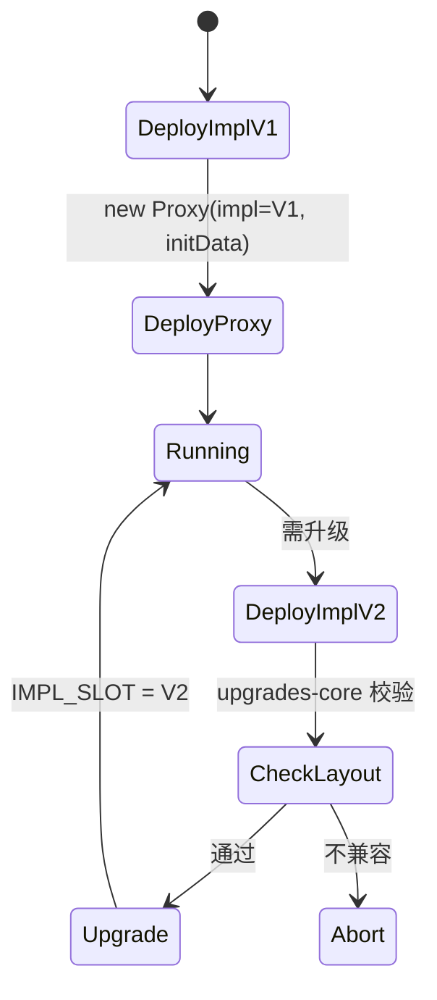

# 合约可升级性：Proxy / Transparent / UUPS / Diamond / Beacon

> **TL;DR**：以太坊合约字节码不可变，但业务需要迭代 → **代理模式**应运而生：Proxy 保留状态，调用通过 **DELEGATECALL** 转发到 Implementation 合约；升级只要改 Proxy 的 impl 指针。主流五种：**Transparent Proxy（TPP）**（OpenZeppelin 首推出，管理员与用户分离）、**UUPS（EIP-1822）**（升级逻辑放 impl，体积小）、**Beacon Proxy**（多个代理共享一个 Beacon 一次升级全部）、**Diamond（EIP-2535）**（多 Facet，突破 24KB 限制）、**ERC-1967 标准 slot**（所有代理共享固定 slot 地址，规避碰撞）。每种模式有独特的存储布局风险与升级流程；都必须通过 `@openzeppelin/upgrades-core` 的 storage layout 兼容性检查。

---

## 1. 背景与动机

EVM 合约一旦部署，`codeHash` 不可改。但真实业务需要 bug 修复、功能迭代、协议治理决议执行——**Immutable 代码 vs Mutable 业务** 是一对根本矛盾。

2018 年前主流方案是 **Eternal Storage + Forward Contract**（Zeppelin 早期）：状态存独立合约，业务合约可替换。缺点是每次访问 state 都要额外 CALL，Gas 爆炸。

2018-2019 转向 **Proxy 模式**：利用 `DELEGATECALL` 让 Implementation 在 Proxy 的 storage 上下文运行，只需一次 CALL 额外开销（~2000 gas）。但 Storage 布局必须在升级前后保持兼容——这是整个家族的根本约束。

EIP-1967（标准 slot）、EIP-1822（UUPS）、EIP-2535（Diamond）陆续把"代理"工程化。The Parity Multisig 冻结 2017 事件进一步证明：**升级逻辑本身必须隔离并严格鉴权**——UUPS 为了小体积把 `upgrade()` 放 impl 里，带来"忘记保留升级逻辑 = 失去升级权"的新风险（已发生 Audius 事件 2022 年 $6M）。

## 2. 核心原理

### 2.1 DELEGATECALL 机制（回顾）

```
Proxy.balance = 0          Impl.balance = N/A (无关紧要)
Proxy.storage ← 读写        Impl.storage 不被触及
msg.sender = 原始 caller   msg.value = 原始 value
```

DELEGATECALL 的要点："加载别人的代码，用自己的存储"。Proxy 的 fallback 转发所有 calldata 到 impl：

```solidity
fallback() external payable {
    assembly {
        calldatacopy(0, 0, calldatasize())
        let r := delegatecall(gas(), impl, 0, calldatasize(), 0, 0)
        returndatacopy(0, 0, returndatasize())
        switch r case 0 { revert(0, returndatasize()) }
                 default { return(0, returndatasize()) }
    }
}
```

### 2.2 EIP-1967 标准 Slot

为避免 impl 合约的 state 变量 slot 0/1 与 Proxy 元数据碰撞，EIP-1967 固定四个"伪随机"slot：

```
IMPLEMENTATION_SLOT = bytes32(uint256(keccak256("eip1967.proxy.implementation")) - 1)
                    = 0x360894a13ba1a3210667c828492db98dca3e2076cc3735a920a3ca505d382bbc

ADMIN_SLOT          = keccak256("eip1967.proxy.admin") - 1
                    = 0xb53127684a568b3173ae13b9f8a6016e243e63b6e8ee1178d6a717850b5d6103

BEACON_SLOT         = keccak256("eip1967.proxy.beacon") - 1
                    = 0xa3f0ad74e5423aebfd80d3ef4346578335a9a72aeaee59ff6cb3582b35133d50
```

这些 slot 距离任何"正常" storage layout 天文距离远，实际不可能碰撞。所有现代代理（TPP/UUPS/Beacon）都使用它。

### 2.3 Transparent Proxy（TPP, OpenZeppelin 原生）

核心思想：**管理员地址调用 → 被 Proxy 自己处理（升级/配置）；其他地址 → 转发到 impl**。这样 impl 可以和 Proxy 拥有同名函数（如 `upgradeTo`）而不混淆。

问题：每次调用都要比较 `msg.sender == admin`，额外 Gas ~500。5.x OpenZeppelin 引入 `TransparentUpgradeableProxy` + 独立 `ProxyAdmin` 合约，admin 永远是 ProxyAdmin，Proxy 直接对 Admin 做 onlyOwner。

### 2.4 UUPS（Universal Upgradeable Proxy Standard, EIP-1822）

升级逻辑放到 impl 合约（通过 `UUPSUpgradeable`），Proxy 只负责 DELEGATECALL。优点：Proxy 极小（~400 字节 bytecode），无 admin 分支判断；缺点：**新 impl 必须自带 `_authorizeUpgrade` 与 `proxiableUUID`，否则升级后失去升级能力（合约"砖化"）**。OpenZeppelin Upgrades 插件在部署时会检查这一点。

UUPS 的升级调用：

```
User → Proxy.upgradeToAndCall(newImpl, data)
       DELEGATECALL → Impl.upgradeToAndCall
           → _authorizeUpgrade()  (必须 onlyOwner)
           → sstore(IMPL_SLOT, newImpl)
           → if data.length > 0: delegatecall(newImpl, data)  // 初始化
```

### 2.5 Beacon Proxy（EIP-1967 + Beacon）

多个逻辑相同的实例（如每用户一个 Vault）共享一个 Beacon，Beacon 持 implementation 指针。Beacon 变 → 所有代理自动切换。结构：

```
Proxy_1 ─┐
Proxy_2 ─┼──→ Beacon ──→ Impl_v1 (升级后 → Impl_v2)
Proxy_3 ─┘
```

### 2.6 Diamond（EIP-2535）

Proxy 持有 `mapping(bytes4 selector => address facet)`。调用者发 4-byte 选择器，Proxy 查表分发到不同 Facet。意义：

- 单合约可承载 **任意多字节码**（突破 EIP-170 的 24KB 限制）。
- 细粒度升级——只替换某个 Facet。

代价：调用多一次 SLOAD + 分支，Gas 约 +1500。存储布局需使用 **Diamond Storage 模式**（每个 facet 在独立 keccak slot 建自己的 struct）以防碰撞。生态采用最深的是 **Nick Mudge 的 diamond-3**，被 Aavegotchi、GMX 等使用。

### 2.7 Initializer 模式

代理的 impl 不能用 constructor（constructor 只跑一次且作用于 impl 自身 storage），只能用 `initialize()` 函数 + `initializer` modifier 确保只调一次：

```solidity
bool private _initialized;
modifier initializer() {
    require(!_initialized, "already init");
    _initialized = true;
    _;
}
```

OpenZeppelin `Initializable` 使用 `_initialized` 计数 + `_initializing` 双标志，支持多次"reinitialization"（不同版本有不同 init 步骤）。

### 2.8 存储布局（Storage Layout）兼容性

Solidity 状态变量按声明顺序占 slot 0、1、2...（小类型可 pack）。升级时：

- **允许**：在末尾追加变量。
- **禁止**：插入/删除/重排/改类型/改修饰（immutable/constant 不占 slot）。
- **保留**：继承链必须保持顺序；OpenZeppelin Upgradeable 合约常留 `uint256[50] __gap;`，方便基类未来扩容。

`@openzeppelin/upgrades-core` 会对比两版 impl 的 `storageLayout`（solc 输出）自动报错。

### 2.9 状态图：升级流程



### 2.10 关键参数与限制

| 项 | 值 |
| --- | --- |
| Proxy delegatecall 额外 gas | ~500–2500 |
| TPP admin 分支判断 | ~500 gas/call |
| UUPS 升级入口 | impl 合约 `upgradeToAndCall` |
| Diamond selector lookup | 1× SLOAD + ~1500 gas |
| Storage gap 惯例 | `uint256[50] __gap` |

## 3. 架构剖析

### 3.1 分层视图

1. **Proxy 层**：最少代码，极简 fallback + 存储元数据。
2. **Implementation 层**：业务逻辑 + 可能的升级入口（UUPS）。
3. **Admin / Beacon 层**：升级权限与指针。
4. **Storage 层**：共享存储（EIP-1967 slot + 业务 slot 0/1/... / Diamond Storage）。
5. **工具层**：upgrades-core、foundry-upgrades、hardhat-upgrades 进行静态校验。

### 3.2 模块清单（OZ Upgradeable v5.x）

| 模块 | 作用 | 依赖 |
| --- | --- | --- |
| `proxy/ERC1967/ERC1967Proxy.sol` | EIP-1967 标准代理 | - |
| `proxy/transparent/TransparentUpgradeableProxy.sol` | TPP | ERC1967Proxy |
| `proxy/transparent/ProxyAdmin.sol` | 独立管理 | Ownable |
| `proxy/beacon/BeaconProxy.sol` | 指向 beacon | - |
| `proxy/beacon/UpgradeableBeacon.sol` | beacon 存 impl | Ownable |
| `proxy/utils/UUPSUpgradeable.sol` | UUPS mixin | Initializable |
| `proxy/utils/Initializable.sol` | init 保护 | - |
| `proxy/Clones.sol` | EIP-1167 不可升级 | - |

### 3.3 端到端生命周期（UUPS）

```
1. 开发者编写 ImplV1 继承 UUPSUpgradeable
2. hardhat-upgrades.deployProxy:
   - 部署 ImplV1
   - 部署 ERC1967Proxy(impl=V1, data=initialize(...))
   - 记录 layout 到 .openzeppelin/mainnet.json
3. 时间推移...
4. 升级 → upgrades.upgradeProxy(proxyAddr, ImplV2):
   - 部署 ImplV2
   - 比较 layout(V1 vs V2)
   - 调 Proxy.upgradeToAndCall(V2, reinit_data)
   - 写入 IMPL_SLOT
```

### 3.4 参考实现

- **OpenZeppelin Contracts Upgradeable**（最主流）
- **Wonderland zeppelin-upgrades-fork**（含 diamond 支持）
- **Foundry Upgrades**：<https://github.com/OpenZeppelin/openzeppelin-foundry-upgrades>
- **Diamond-3**（Nick Mudge）：参考 Diamond 实现

### 3.5 扩展接口

- `eth_getStorageAt(proxy, IMPL_SLOT)` 可直接读当前 impl 地址，无需 ABI。
- Etherscan "Contract Read as Proxy" 自动识别 EIP-1967 slot 并加载 impl ABI。

## 4. 关键代码 / 实现细节

UUPS 核心实现（[openzeppelin-contracts-upgradeable/contracts/proxy/utils/UUPSUpgradeable.sol](https://github.com/OpenZeppelin/openzeppelin-contracts-upgradeable/blob/v5.1.0/contracts/proxy/utils/UUPSUpgradeable.sol)）：

```solidity
// openzeppelin-contracts-upgradeable v5.1.0 L~80-L~130 简化
abstract contract UUPSUpgradeable is Initializable, IERC1822Proxiable, ERC1967Utils {
    address private immutable __self = address(this);

    // 要求当前调用是 DELEGATECALL 过来的 (即不是直接调 impl)
    modifier onlyProxy() {
        require(address(this) != __self, "Must be called via delegatecall");
        require(ERC1967Utils.getImplementation() == __self, "Impl mismatch");
        _;
    }

    // 相反：直接调 impl (不可代理)
    modifier notDelegated() {
        require(address(this) == __self, "Must NOT be called via delegatecall");
        _;
    }

    /// UUPS 入口
    function upgradeToAndCall(address newImpl, bytes memory data)
        public payable virtual onlyProxy
    {
        _authorizeUpgrade(newImpl);
        _upgradeToAndCallUUPS(newImpl, data);
    }

    /// 子合约必须重写，设置权限（OZ 推荐 onlyOwner）
    function _authorizeUpgrade(address newImplementation) internal virtual;

    function proxiableUUID() external view virtual notDelegated returns (bytes32) {
        return ERC1967Utils.IMPLEMENTATION_SLOT;
    }
}
```

关键：`_authorizeUpgrade` 必须在新 impl 里继续存在——否则下一次升级没有权限检查，任何人可以升级到恶意合约。Audius 2022 事件就是旧版丢了这个函数。

## 5. 演进与版本对比

| 方案 | 出现 | Proxy 大小 | 管理入口 | 优缺点 |
| --- | --- | --- | --- | --- |
| Transparent (TPP) | 2018 OZ | ~2.2KB | ProxyAdmin | 最成熟, 稍贵 |
| UUPS | 2019 EIP-1822 | ~0.4KB | Impl | 小, 有砖化风险 |
| Beacon | 2019 OZ | ~0.3KB/代理 | UpgradeableBeacon | 多实例友好 |
| Diamond | 2020 EIP-2535 | 多 facet | Cut 函数 | 绕 24KB, 复杂 |
| Clone (EIP-1167) | 2018 | ~45B | 不可升级 | 多实例省 Gas |
| ZeppelinOS (已弃) | 2018 | - | - | 历史 |

## 6. 实战示例

用 Foundry + OZ Foundry Upgrades 部署并升级 UUPS：

```bash
forge install OpenZeppelin/openzeppelin-contracts-upgradeable
forge install OpenZeppelin/openzeppelin-foundry-upgrades
```

```solidity
// script/DeployUUPS.s.sol
import {Upgrades} from "openzeppelin-foundry-upgrades/Upgrades.sol";
contract Deploy is Script {
    function run() external {
        vm.startBroadcast();
        address proxy = Upgrades.deployUUPSProxy(
            "MyVault.sol:MyVaultV1",
            abi.encodeCall(MyVaultV1.initialize, (address(0xabc)))
        );
        console.log("proxy", proxy);
        vm.stopBroadcast();
    }
}

// script/UpgradeUUPS.s.sol
contract Upgrade is Script {
    function run() external {
        vm.startBroadcast();
        Upgrades.upgradeProxy(
            vm.envAddress("PROXY"),
            "MyVault.sol:MyVaultV2",
            abi.encodeCall(MyVaultV2.reinitV2, ())
        );
        vm.stopBroadcast();
    }
}
```

`Upgrades` 工具会在编译期比较存储布局，不兼容直接 fail。

## 7. 安全与已知攻击

| 事件 | 年份 | 损失 | 根因 |
| --- | --- | --- | --- |
| Audius | 2022 | $6M | UUPS 升级后 `_authorizeUpgrade` 丢失 + 初始化抢跑 |
| dForce Lendf.Me | 2020 | $25M | 升级后代币改了 transfer 语义 |
| KILT proxy init | 2021 | - | 任意人调 initialize() |
| Nomad Bridge | 2022 | $190M | replay 漏洞（非代理但同样"升级后遗症"） |

关键风险清单：

1. **Uninitialized Implementation**：impl 自身若未 `disableInitializers()`，他人可直接 init impl 拥有 admin 权限。现代 OZ v5 `_disableInitializers()` 在 constructor 里调。
2. **Storage Collision**：升级前后 slot 布局不一致——升级瞬间所有余额错乱。upgrades-core 守护。
3. **Function Selector Clash（Transparent）**：新 impl 加了和 admin 同名的函数。TPP 设计层面已解决，Diamond 有专门 facet collision check。
4. **Forgotten Upgrade Mechanism（UUPS）**：新 impl 不继承 UUPSUpgradeable，变"不可升级"。
5. **`selfdestruct` 在 impl 上**：Parity Multisig 事件，任意人销毁 impl 导致所有代理崩。0.8.18 起 `selfdestruct` 警告，Cancun EIP-6780 弱化到仅在同 tx CREATE 的合约内生效。

## 8. 与同类方案对比

| 维度 | Transparent | UUPS | Beacon | Diamond | 不升级（Clone） |
| --- | --- | --- | --- | --- | --- |
| 部署成本 | 高 | 中 | 低 | 高 | 极低 |
| 调用 Gas | 中 | 低 | 低 | 中 | 低 |
| 管理复杂 | 低 | 中 | 低 | 高 | 无 |
| 多实例同步升级 | ✗ | ✗ | ✓ | ✗ | ✗ |
| 超大合约 | ✗ | ✗ | ✗ | ✓ | ✗ |
| 可升级 | ✓ | ✓ | ✓ | ✓ | ✗ |

## 9. 延伸阅读

- **EIP-1967 / 1822 / 2535**
- **OpenZeppelin Upgrades Docs**：https://docs.openzeppelin.com/upgrades-plugins/1.x/
- **Nick Mudge "Understanding Diamonds"**：https://eip2535diamonds.substack.com/
- **Trail of Bits**：[Contract Upgrade Anti-Patterns](https://blog.trailofbits.com/2018/09/05/contract-upgrade-anti-patterns/)
- **Paradigm**：《The Proxy Pattern》
- **Samczsun**：Audius 事件分析

## 10. 术语表

| 术语 | 英文 | 释义 |
| --- | --- | --- |
| 代理 | Proxy | DELEGATECALL 转发的合约 |
| 实现 | Implementation / Logic | 包含业务字节码 |
| 信标 | Beacon | 存储 impl 指针的中心合约 |
| 钻石 | Diamond | 多 facet 代理 |
| 切片 | Facet | Diamond 的功能单元 |
| 存储间隙 | Storage Gap | 预留 slot 供未来扩展 |
| UUPS | Universal Upgradeable Proxy Standard | EIP-1822 |

---

*Last verified: 2026-04-22*
