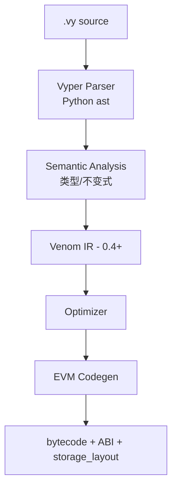

# Vyper 语言与 Curve 的选择

> **TL;DR**：Vyper 是针对 EVM 的 **Python 风格、故意极简、拒绝元编程** 的合约语言。核心哲学：**可审计性 > 表达力**——没有继承、没有 modifier、没有内联汇编（默认）、没有函数重载、没有递归调用。字节码布局与 Solidity 不同，接口兼容（同样输出 EVM bytecode + ABI）。Curve Finance 选择 Vyper 出于：(1) 可读性便于社区审计；(2) 防止过度工程化；(3) AMM 数学高度固定，不需要继承结构。代价是生态小、工具链弱、历史上出过编译器 bug（2023 年 0.2.15/16/17 的 ReentrancyLock 漏洞导致 Curve 池被黑 $70M）。现代 Vyper 0.4.x 在工具链与稳定性上已进入生产可用期。

---

## 1. 背景与动机

2017 年 Vitalik 与 Vyper 团队（原"Viper"）提出：**Solidity 功能过多，容易写出难审计的合约；EVM 其实不需要那么多语言特性**。Vyper 目标是"更接近写出可验证代码的 Python"，以审计友好为第一原则。

核心哲学：

- **No inheritance**：继承是 Solidity 安全漏洞的重要来源（C3 顺序、super 混淆、storage gap），Vyper 直接禁。
- **No modifiers**：修饰器是 AST 改写，阅读源码看不到真实执行流，Vyper 要求显式 `if` + `revert`。
- **No recursive calls**：自调用和互调递归难以静态分析栈深度，一律禁止。
- **No inline assembly (by default)**：汇编是 Gas 优化利器也是 bug 源；0.4 后小心引入 `raw_call`/`raw_revert` 原语，但不允许任意 yul。
- **Bounds-checked everything**：数组索引、overflow 默认检查。
- **Decidable**：力争编译器级别可静态分析出 gas 上界与栈深度。

取舍：牺牲"表达力"（写长了点）换"可审计性"。Curve 的 StableSwap、CryptoSwap 数学就是 Vyper 这种哲学的典型落地。

## 2. 核心原理

### 2.1 形式化目标：Decidability

Vyper 的设计论文（2017 Roadmap）列出三条性质：

1. **Decidable gas upper bound**：任何函数调用，编译器能在编译期给出 gas 上界。含义：禁止不定长循环（循环必须 `for i in range(N)` 常量 N）。
2. **No recursive calls**：禁止函数内直接或间接递归，栈深度可静态确定。
3. **No hidden modifications**：修改 state 的操作必须语法明显（不能被 modifier 掩盖）。

这三条配合**强类型 + 边界检查 + 不可变的函数签名**，使 Vyper 合约在"静态读代码"就能判断绝大部分行为。

### 2.2 关键语法与 Solidity 对照

```vyper
# Vyper 0.4.0+
from ethereum.ercs import IERC20

VERSION: public(constant(String[8])) = "1.0.0"
owner: public(address)
balances: HashMap[address, uint256]
MIN_AMOUNT: constant(uint256) = 10**6

event Deposit:
    user: indexed(address)
    amount: uint256

@deploy
def __init__(_owner: address):
    self.owner = _owner

@external
@payable
def deposit():
    assert msg.value >= MIN_AMOUNT, "too small"
    self.balances[msg.sender] += msg.value
    log Deposit(msg.sender, msg.value)

@external
def withdraw(amount: uint256):
    assert self.balances[msg.sender] >= amount, "insufficient"
    self.balances[msg.sender] -= amount
    send(msg.sender, amount)
```

对照 Solidity：

| 概念 | Solidity | Vyper |
| --- | --- | --- |
| 构造器 | `constructor(...)` | `@deploy def __init__` |
| 外部函数 | `function f() external` | `@external def f` |
| 可见性 | public/external/internal/private | `@external` / `@internal` / `public(var_type)` |
| 修饰器 | `modifier` | `@nonreentrant` 等装饰器（编译器白名单） |
| 继承 | `is A, B` | **不支持** |
| 接口 | `interface` | `interface IERC20` (只读签名) |
| 映射 | `mapping(K => V)` | `HashMap[K, V]` |
| 事件 | `event E(...)` + `emit` | `event E:` + `log` |
| 循环 | `for (...)` 任意条件 | `for i: uint256 in range(N, bound=K)` 需界 |
| 内联汇编 | `assembly {...}` | **不支持**；仅 `raw_call` |

### 2.3 存储布局

Vyper 的 storage 变量按**声明顺序分配 slot**（与 Solidity 类似），但：

- 不做 slot packing（每变量独占至少一个 slot），稳定可预测。
- `HashMap` 的 slot 地址规则与 Solidity `mapping` 兼容：`keccak256(key . base_slot)`——所以可与 Solidity 代理互操作。
- 0.3+ 引入 `immutable` 与 `constant`，与 Solidity 语义一致。

### 2.4 装饰器白名单

Vyper 不让用户定义修饰器，只提供编译器知晓的内置装饰器：

| 装饰器 | 作用 |
| --- | --- |
| `@external` / `@internal` | 可见性 |
| `@view` / `@pure` / `@payable` | 状态可变性 |
| `@deploy` | 构造器（0.4 起替换 `__init__` 前） |
| `@nonreentrant` (0.3.10+) | 重入锁，编译器自动加 transient slot |
| `@raw_return` | 返回已编码的 bytes（low level） |
| `@reentrant`（0.4 test） | 显式标注可被重入 |

### 2.5 数值与整数

默认 `uint256`/`int256`，支持 `uint8, uint16, ...`。所有算术默认 overflow check（与 Solidity 0.8 一致）。定点数 `decimal` 是独特特性（10^10 精度），被 Curve 部分合约使用。0.3+ 引入 `uint256x10` 等 fixed arrays。

### 2.6 参数与限制

| 项 | 值 |
| --- | --- |
| 运行时字节码上限 | 24 KB（EIP-170） |
| 单函数 stack 深度 | 编译期确定 ≤ 1024 |
| 循环必须带 bound | `for i: uint256 in range(n, bound=MAX)` |
| 继承深度 | 0（不支持） |
| 支持 interfaces | 纯签名, 无状态 |

### 2.7 重入锁的实现（编译器级）

Vyper 0.3.10 之前：使用 storage slot 做 `@nonreentrant('lock')` 锁，Gas 约 5000/调用。
0.3.10+（Cancun 后）：使用 TSTORE/TLOAD，Gas ~200。

注意：**2023 年 0.2.15–0.2.17 版本的 reentrancy lock 生成汇编有 bug**——锁的 slot 在某些编译路径下被覆盖，Curve alETH/msETH/pETH pool 被黑 $70M。教训：**编译器本身也会是攻击面**。

### 2.8 编译流程图



Vyper 0.4 引入新的 **Venom IR**（取代老的 LLL → Yul-like IR 方案），显著提升优化能力与稳定性。

## 3. 架构剖析

### 3.1 分层视图

1. **Parser 层**：复用 Python `ast` 模块，`.vy` 文件需语法是合法 Python 子集。
2. **Semantic 层**：类型推导、可见性检查、循环 bound 检查。
3. **IR 层**（0.4+ Venom）：SSA-like，专为 EVM 设计。
4. **Codegen 层**：Venom → EVM opcodes。
5. **Output 层**：bytecode、runtime bytecode、ABI、source map、storage_layout。

### 3.2 模块清单（[vyperlang/vyper](https://github.com/vyperlang/vyper)）

| 模块 | 路径 | 职责 |
| --- | --- | --- |
| `vyper/ast` | AST 节点 | Python AST 的包装 |
| `vyper/semantics` | 语义分析 | 类型、作用域、不变式 |
| `vyper/venom` | Venom IR | 0.4+ 新 IR |
| `vyper/codegen` | 旧 codegen | 兼容 0.3 |
| `vyper/builtin_functions` | 内置 | send/raw_call/convert 等 |
| `vyper/compile_code.py` | 编译入口 | |
| `vyper/cli/vyper_compile.py` | CLI | |

### 3.3 部署生命周期

与 Solidity 几乎相同（同 EVM 字节码），差别仅在 ABI 中 Vyper 更严格（函数可见性映射、参数命名稳定）。部署工具：

- **Vyper CLI**：`vyper file.vy > file.bin`
- **Ape（ApeWorX）**：Python 生态主流 DApp 框架，对 Vyper 原生友好
- **Foundry + Foundry-Vyper**：近年 Foundry 加入对 Vyper 的编译支持

### 3.4 参考实现

仅官方 `vyper` 一套。0.4.x 是长期维护线。

### 3.5 对外接口

- 标准 EVM JSON-RPC（因为最终字节码就是 EVM）。
- `--format` 支持输出 `abi`、`bytecode`、`bytecode_runtime`、`source_map`、`layout`、`ir`、`venom`。

## 4. 关键代码 / 实现细节

Curve 3Pool StableSwap 核心（简化自 [curvefi/curve-contract/contracts/pools/3pool/StableSwap3Pool.vy](https://github.com/curvefi/curve-contract/blob/master/contracts/pools/3pool/StableSwap3Pool.vy)）：

```vyper
# curvefi/curve-contract (commit 3bbfdd2 概念化片段, L400 附近)
N_COINS: constant(int128) = 3
A_PRECISION: constant(uint256) = 100

@view
@internal
def get_D(xp: uint256[N_COINS], amp: uint256) -> uint256:
    """StableSwap 不变式 D 的牛顿迭代求解"""
    S: uint256 = 0
    for _x in xp:
        S += _x
    if S == 0:
        return 0
    D: uint256 = S
    Ann: uint256 = amp * N_COINS
    for _i in range(255):                        # bound=255 满足 Vyper 要求
        D_P: uint256 = D
        for _x in xp:
            D_P = D_P * D / (_x * N_COINS)
        Dprev: uint256 = D
        D = (Ann * S / A_PRECISION + D_P * N_COINS) * D \
          / ((Ann - A_PRECISION) * D / A_PRECISION + (N_COINS + 1) * D_P)
        if D > Dprev:
            if D - Dprev <= 1: return D
        else:
            if Dprev - D <= 1: return D
    raise "D did not converge"
```

这段 StableSwap 的价值在于**算法紧凑、循环有界、每行可独立核对**。Solidity 等价实现更啰嗦，容易让审计者失焦。

## 5. 演进与版本对比

| 版本 | 年份 | 关键变化 |
| --- | --- | --- |
| 0.1.x | 2018–2019 | 初版, 语法多次大变 |
| 0.2.x | 2020–2021 | 稳定化, 但有 ReentrancyLock bug（0.2.15–17） |
| 0.3.x | 2022–2023 | storage layout 稳定, interfaces 强化 |
| 0.3.10 | 2023 | @nonreentrant 用 TSTORE; 修复历史 lock bug |
| 0.4.0 | 2024 | **Venom IR** 替代 LLL; `@deploy` 装饰器; 去掉 `__default__`；模块系统 |
| 0.4.1+ | 2025 | 性能/稳定性迭代, EOF 前瞻 |

## 6. 实战示例

```bash
pip install vyper==0.4.0
echo 'counter: public(uint256)

@deploy
def __init__():
    self.counter = 0

@external
def inc():
    self.counter += 1
' > Counter.vy

vyper -f abi,bytecode,layout Counter.vy
# 输出 ABI + 部署字节码 + storage layout

# 与 Foundry 集成
forge init --vyper counter-proj
forge build           # 自动识别 .vy
forge test
```

## 7. 安全与已知攻击

- **Vyper 0.2.15/16/17 Reentrancy Lock Bug (2023-07)**：编译器在某些路径下把 reentrancy lock 存到与 storage 变量相同的 slot，被重入抽干。受害者 Curve alETH/pETH/msETH/CRV/ETH 池，损失 ~$70M。修复版本 0.3.0+。教训：**编译器也要审计**；生产版本应 pin 具体版本并跟进官方 advisory。
- **Integer precision drift**：StableSwap 数学中 Newton 迭代精度偏差若被放大可导致 pool 套利损失。
- **Interface 与 Solidity 不完全一致**：Vyper 的 ABI 有时不输出完整的 state mutability；与某些前端/索引器兼容性需要测试。

## 8. 与同类方案对比

| 维度 | Vyper | Solidity | Fe | Huff |
| --- | --- | --- | --- | --- |
| 语法风格 | Python | C++/JS | Rust | Opcode |
| 继承 | 无 | 有 | 无 | 无 |
| Modifier | 无 | 有 | 无 | 无 |
| 内联汇编 | 基本无 | 有 | 无 | 全是汇编 |
| 生态规模 | 小（Curve/Lido 部分） | 巨大 | 极小 | 小 |
| Gas 优化 | 中 | 中 | 中 | 极高 |
| 审计友好 | 高 | 中 | 高 | 低 |

### 为什么 Curve 选 Vyper？

1. **AMM 数学固定**：StableSwap 公式是论文级数学，不需要继承/模块化。Vyper 的直白直接映射公式即可。
2. **可读性是护城河**：Curve 社区审计者多为学术背景，Python-like 语法降低审计门槛。
3. **Michael Egorov（Curve 创始人）本人偏好 Python**：早期研究背景。
4. **跨版本稳定性需求**：Curve 池一经部署即不可动（不可升级），必须一次写对——Vyper 的保守性天然契合。

副作用：一旦 Vyper 编译器出 bug，Curve 几乎必然中招（2023 年印证）。后 2023 Curve 的新池开始用多版本编译交叉验证。

## 9. 延伸阅读

- **官方文档**：https://docs.vyperlang.org/en/stable/
- **Vyper 博客**：https://blog.vyperlang.org/
- **Curve Contracts**：https://github.com/curvefi/curve-contract
- **Vitalik 推文**：多次公开表示偏好 Vyper 的审计性
- **Trail of Bits**：Vyper 0.2.x 审计报告
- **2023 Curve 事件分析**：BlockSec / Chainalysis / rekt.news 多份报告
- **Venom IR 设计**：[https://github.com/vyperlang/vyper/tree/master/vyper/venom](https://github.com/vyperlang/vyper/tree/master/vyper/venom)

## 10. 术语表

| 术语 | 英文 | 释义 |
| --- | --- | --- |
| 可决定性 | Decidability | 编译期可静态分析关键属性 |
| 装饰器 | Decorator | Vyper 中用 `@xxx` 声明函数属性 |
| Venom IR | Vyper's new IR | 0.4+ 的中间表示 |
| 重入锁 | Nonreentrant Lock | `@nonreentrant` 编译器自动插入 |
| 边界循环 | Bounded Loop | `for i in range(n, bound=K)` 必须静态上界 |

---

*Last verified: 2026-04-22*
