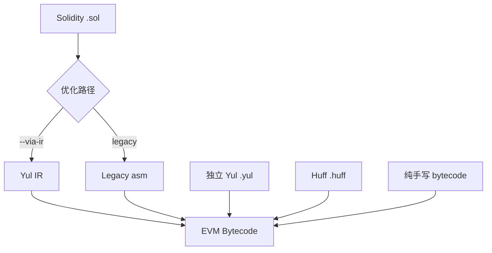
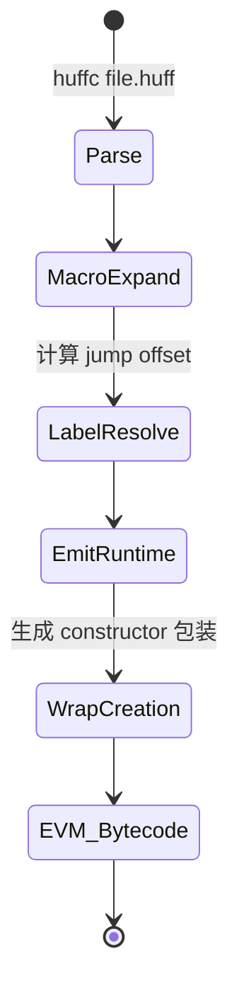

# Yul 与 Huff：汇编级合约开发

> **TL;DR**：Yul 是 Solidity 的**中间表示语言（IR）**，语法类 Rust/Go，提供命名局部变量与函数定义，但直接映射 EVM opcode 语义；既可作为 solc 优化管线（`--via-ir`）的中端，也可独立写合约。Huff 则是更极端的**纯 opcode 宏汇编**——只比"直接写字节码"多了标签和宏展开，无类型、无变量名映射，极致压榨 Gas。Yul 适合在 Solidity 内嵌 `assembly { ... }` 做局部优化（memcpy、位操作、自定义调用）；Huff 适合写小而狠的关键合约（DEX 路由、MEV 机器人、GasToken）。用它们的代价：**失去 Solidity 的所有安全网**（overflow、长度检查、权限），需要审计者能读汇编。

---

## 1. 背景与动机

**Yul** 起源于 Solidity 0.5（2018），Gavin Wood 与团队为了给 Solidity 换优化后端，抽出一个"足够像 Assembly 又足够高级"的语言。Yul 的价值：

- 作为 Solidity 的 **inline assembly** 语法（`assembly { ... }` 块）。
- 作为 `--via-ir` 优化管线的 IR：Solidity → Yul → 优化 → EVM。
- 作为独立语言部署 `.yul` 文件。

**Huff** 起源于 2019 Aztec Protocol（隐私卷），他们需要为 Zcash 风格电路手写 EVM 汇编——Solidity/Yul 都不够低层。Huff 纯粹是 opcode 的"带宏"汇编器，在 AMM/MEV/ZK-verifier 等 Gas 关键路径被复用。Huff 2.0（huff-rs, Rust 重写）2022 年后成熟。

双方的共同受众：**明白字节码为何贵、愿意承担审计负担、需要 20-80% Gas 节省** 的项目。

## 2. 核心原理

### 2.1 Yul 的语言模型

Yul 基于两个核心概念：**命名变量**与**内置函数**。

```yul
{
    // 变量声明
    let x := 10
    let y := mload(0x40)        // 内置 mload = MLOAD opcode
    
    // 函数
    function add_mod(a, b, m) -> r {
        r := addmod(a, b, m)
    }
    
    // 控制流
    for { let i := 0 } lt(i, 10) { i := add(i, 1) } {
        sstore(i, mul(i, 2))
    }
    
    if lt(x, y) { revert(0, 0) }
    switch x
    case 0 { x := 1 }
    default { x := 2 }
}
```

Yul 是 **无类型** 的（单一类型 u256），但 `Yul+` 方言加入类型用于其他 VM。内置函数 1-to-1 映射到 opcode（`mload/sstore/add/mul/lt/eq/mstore/call/delegatecall/revert/...`）。

与纯 opcode 的差别：

- 无需手动管理 stack（Yul 编译器负责栈调度）。
- 支持 `for/if/switch` 控制流，翻译到 JUMP/JUMPI。
- 支持函数（CALLF 之前的 Yul 函数内联展开）。

### 2.2 Yul 的执行流程（编译期）

```
Yul AST → Desugar (switch→if, for→loop)
       → Expression splitter (SSA-like)
       → Common subexpression elimination
       → Redundant assignment eliminator
       → Yul Optimiser 主循环 (多 pass)
       → Stack compressor (最小 DUP/SWAP)
       → EVM code emit
```

`solc --ir-optimized` 可以看优化后的 Yul；`solc --asm` 查看最终的 EVM 汇编。

### 2.3 Huff 的语言模型

Huff 把一个合约拆成 **macros** 与 **functions（宏别名）**：

```huff
/* counter.huff */
#define constant SLOT = 0x00

#define macro GET_COUNT() = takes(0) returns(1) {
    [SLOT] sload                    // 读 counter
}

#define macro INCREMENT() = takes(0) returns(0) {
    0x01                            // push 1
    [SLOT] sload                    // counter
    add                             // counter + 1
    [SLOT] sstore                   // store
}

#define macro MAIN() = takes(0) returns(0) {
    0x00 calldataload 0xe0 shr      // 取 selector
    dup1 0xa87d942c eq inc_jump jumpi   // increment() selector
    dup1 0x8ada066e eq get_jump jumpi   // count() selector
    0x00 0x00 revert
    
    inc_jump:
        INCREMENT()
        stop
    get_jump:
        GET_COUNT()
        0x00 mstore
        0x20 0x00 return
}
```

看得出来，Huff 基本就是 **opcode + 宏展开 + jump label**。好处：程序员可精确控制每条 opcode；坏处：自己做 ABI 解码、自己检查参数类型、自己处理 selector。

### 2.4 与 Solidity 的分层关系



### 2.5 内存布局约定

Solidity 规定 Yul 代码必须遵守 **free memory pointer** 约定：`mload(0x40)` 是下一个空闲位置；分配后更新 `0x40`。`0x00-0x3f` 是 scratch space（短期拼接用），`0x60` 是 zero slot。Huff 无此约束，完全自由——代价是与 Solidity 合约互调需手动对齐。

### 2.6 Gas 对比示意（同一 ERC-20 transfer 实现）

| 实现 | 部署 Gas | transfer Gas（非零→非零） |
| --- | --- | --- |
| Solidity 0.8 OpenZeppelin | ~900 k | ~51 k |
| Solidity 0.8 solmate | ~600 k | ~38 k |
| Solidity + inline Yul (Solady) | ~500 k | ~36 k |
| Pure Yul | ~450 k | ~35 k |
| Huff | ~350 k | ~33 k |

相对差 20–40%，对 DEX 路由器等高频合约极有价值。

### 2.7 参数与限制

- Yul 栈深度同 EVM ≤ 1024，但编译器会强制"local variable ≤ 16"以便 DUP 指令能访问（超过会 "stack too deep" 报错）。`--via-ir` 大幅缓解此限制。
- Huff 完全不管栈深度——程序员自负责任。
- Yul 可嵌入 `verbatim_Ni_No_hex` 指令块直接塞字节码，但不参与优化。

### 2.8 状态图：一次 Huff 部署



## 3. 架构剖析

### 3.1 分层视图

1. **前端**：Yul/Huff parser → AST。
2. **宏/IR 展开层**：Huff 宏替换；Yul 函数内联、优化 pass。
3. **栈调度层**：Yul 有专用 stack layout algorithm（参 [libyul/backends/evm/StackLayoutGenerator](https://github.com/ethereum/solidity/tree/v0.8.26/libyul/backends/evm)）；Huff 无。
4. **Code Emit 层**：输出 runtime + deployable bytecode。

### 3.2 模块清单

**Yul**（在 solidity 仓内）：

| 模块 | 路径 | 职责 |
| --- | --- | --- |
| Parser | `libyul/YulStack.cpp` | .yul 文件入口 |
| AST | `libyul/AST.h` | Yul 语法节点 |
| Optimizer | `libyul/optimiser/` | 30+ 个优化 pass |
| Backend | `libyul/backends/evm/` | stack layout + emit |

**Huff**（huff-rs 仓）：

| 模块 | 路径 | 职责 |
| --- | --- | --- |
| Lexer / Parser | `huff_parser/` | .huff → AST |
| Code Gen | `huff_codegen/` | 宏展开 + label 偏移 |
| CLI | `huff_cli/` | `huffc` 命令 |
| Tests | `huff_tests/` | 与 Foundry 集成 |

### 3.3 生命周期：`assembly` 块在 Solidity 中的处理

```
Solidity source (有 assembly 块)
  ↓ parser：inline assembly 作为 Yul AST 节点
  ↓ semantic analyzer：不做类型检查，但查变量作用域
  ↓ IR 生成：整个函数翻译到 Yul，inline assembly 直接并入
  ↓ yul optimiser：全文统一优化，inline 部分也被优化
  ↓ codegen：和其他 Yul 一样出 bytecode
```

意义：Solidity 里的 `assembly` 不是黑盒——它**与其他 Yul 代码一起进优化器**。这也是为何 Solady 大量用 assembly 而 Gas 能刷新。

### 3.4 实现分散度

- Yul：仅 solc 一家官方，但其规范稳定，形式化工具（如 `echidna` 的 yulSSA fuzz）可解析。
- Huff：huff-rs（Rust, 主流）+ 老版 huff-js（TypeScript, 弃）。

### 3.5 外部接口

- Foundry：`foundry.toml` 配置 `[profile.default]` 支持 `.huff` / `.yul`。
- Yul 的 IR 格式可被 [Halmos](https://github.com/a16z/halmos) 等符号执行器消费，做形式化验证。

## 4. 关键代码 / 实现细节

### 4.1 Solady 的超优化 transfer（混合 Solidity + Yul）

参考 [solady/src/tokens/ERC20.sol](https://github.com/Vectorized/solady/blob/main/src/tokens/ERC20.sol)：

```solidity
// solady/src/tokens/ERC20.sol (概念化, commit ~2025 H1)
function transfer(address to, uint256 amount) public virtual returns (bool) {
    _beforeTokenTransfer(msg.sender, to, amount);
    /// @solidity memory-safe-assembly
    assembly {
        // 读取 sender 的 balance slot
        mstore(0x0c, _BALANCE_SLOT_SEED)
        mstore(0x00, caller())
        let fromBalanceSlot := keccak256(0x0c, 0x20)
        let fromBalance := sload(fromBalanceSlot)
        // 余额检查
        if gt(amount, fromBalance) {
            mstore(0x00, 0xf4d678b8) // `InsufficientBalance()`
            revert(0x1c, 0x04)
        }
        // 减 from 余额
        sstore(fromBalanceSlot, sub(fromBalance, amount))
        // 加 to 余额
        mstore(0x00, to)
        let toBalanceSlot := keccak256(0x0c, 0x20)
        sstore(toBalanceSlot, add(sload(toBalanceSlot), amount))
        // emit Transfer
        mstore(0x20, amount)
        log3(0x20, 0x20, _TRANSFER_EVENT_SIG, caller(), shr(96, shl(96, to)))
    }
    _afterTokenTransfer(msg.sender, to, amount);
    return true;
}
```

要点：
- 手动计算 `keccak256(caller . slot_seed)` 等同 Solidity `mapping` 的 slot 地址；
- 使用 scratch space `0x00/0x0c/0x20` 构造 keccak 输入，省下 memory 扩展；
- `log3` 直接发 `Transfer(from,to,value)` 事件；
- `/// @solidity memory-safe-assembly` 告诉优化器此处遵守内存约定，允许更激进优化。

### 4.2 Huff ERC-20 `transfer` 片段

```huff
#define macro TRANSFER() = takes(2) returns(1) {     // stack: [to, amount]
    // from balance slot = keccak256(caller . BAL_SLOT)
    caller 0x00 mstore
    [BAL_SLOT] 0x20 mstore
    0x40 0x00 sha3              // fromSlot
    dup1 sload                  // fromBalance
    dup3 gt iszero insufficient jumpi
    dup3 dup2 sub               // newFrom
    dup2 sstore                 // store fromBalance
    // to balance slot
    dup2 0x00 mstore
    [BAL_SLOT] 0x20 mstore
    0x40 0x00 sha3              // toSlot
    dup1 sload dup5 add dup2 sstore
    0x01 0x00 mstore 0x20 0x00 return
    insufficient:
        0x00 0x00 revert
}
```

这段更原始，所有栈与 slot 计算都显式。Gas 通常再比 Yul 版省 10-15%。

## 5. 演进与版本对比

| 年份 | 事件 |
| --- | --- |
| 2018 | Solidity 0.5 引入 inline assembly 方言 Yul |
| 2019 | Aztec Huff v0 诞生 |
| 2020 | `.yul` 单独可编译 |
| 2021 | Solidity `--via-ir` 优化管线落地 |
| 2022 | huff-rs Rust 重写，Foundry 集成 |
| 2023 | Solady / Solmate 广泛使用 memory-safe assembly 标记 |
| 2024–25 | EOF 准备，Yul 调整以支持 RJUMP/CALLF |

## 6. 实战示例

### 6.1 独立 Yul 部署

```bash
# add.yul
cat > add.yul <<'EOF'
object "Adder" {
    code { datacopy(0, dataoffset("runtime"), datasize("runtime")) return(0, datasize("runtime")) }
    object "runtime" {
        code {
            let sel := shr(224, calldataload(0))
            switch sel
            case 0x771602f7 {                             // add(uint,uint)
                let r := add(calldataload(4), calldataload(36))
                mstore(0, r)
                return(0, 32)
            }
            default { revert(0, 0) }
        }
    }
}
EOF
solc --strict-assembly --optimize add.yul
```

### 6.2 Huff + Foundry

```bash
forge install huff-language/foundry-huff
# src/Counter.huff 按前述示例
forge test --match-contract CounterHuffTest -vv
```

### 6.3 Solidity inline Yul

```solidity
function unsafeSum(uint256[] calldata arr) external pure returns (uint256 s) {
    assembly {
        let end := add(arr.offset, mul(arr.length, 32))
        for { let p := arr.offset } lt(p, end) { p := add(p, 32) } {
            s := add(s, calldataload(p))
        }
    }
}
// Gas < 普通 Solidity for 循环的 60%
```

## 7. 安全与已知攻击

汇编级开发去掉安全网，最易踩的坑：

- **未检 overflow**：Yul 的 `add/mul/sub` 不 check。必须显式 `if lt(a, b) { revert(0, 0) }`。
- **memory collision**：忘记更新 free memory pointer → 后续 mload 读到垃圾。
- **Storage slot 错位**：手写 keccak 计算 slot 时参数顺序/类型错误，写进错误 slot（可能覆盖 `_totalSupply` 之类）。
- **Msg.sender clean 问题**：Solidity 某些上下文 address 左侧 12 字节不一定清零，汇编做 keccak 前要 `shl/shr` 清理。
- **Selector 碰撞**：Huff 纯手写 selector 分发，写错一个字符可能路由错。
- **无 ABI 解码容错**：calldata 长度不足时，Yul/Huff 不自动 revert。
- **memory-safe 宣告错误**：写了 `@solidity memory-safe-assembly` 但实际违规 → 优化器误假设，产生错误 bytecode。

历史事件：
- **0.8.13 inline assembly + --via-ir 优化器 bug (2022-06)**：导致部分 `MLOAD` 被错误消除；Solidity 官方发布 security advisory。
- **2023 Curve 事件**实际是 Vyper，但揭示了"编译器生成汇编 + 重入锁"的脆弱性，Huff/Yul 项目同样要警惕。

## 8. 与同类方案对比

| 维度 | Yul | Huff | Inline Yul in Solidity | Pure bytecode |
| --- | --- | --- | --- | --- |
| 抽象级 | 中 | 低 | 中 | 最低 |
| 工具链 | solc | huffc (huff-rs) | solc | 无 |
| 调试 | source map | source map | source map | 仅 opcode trace |
| 生态 | 中（Solady 大量使用） | 小（Aztec、DEX router） | 广泛 | 无 |
| 学习曲线 | 中 | 高 | 中 | 极高 |
| 适用场景 | 优化热点、DSL 后端 | 极致 Gas 合约 | 日常项目优化 | 特殊绕过 |

## 9. 延伸阅读

- **Yul Spec**：https://docs.soliditylang.org/en/v0.8.26/yul.html
- **Yul Optimizer Passes**：https://docs.soliditylang.org/en/latest/internals/optimizer.html
- **Huff Docs**：https://docs.huff.sh/
- **huff-rs**：https://github.com/huff-language/huff-rs
- **Solady 源码** 是汇编最佳实践教学
- **Noxx Substack "EVM Deep Dives"**：opcode/Yul 入门
- **Paradigm RareSkills**：Yul / Assembly 教程

## 10. 术语表

| 术语 | 英文 | 释义 |
| --- | --- | --- |
| IR | Intermediate Representation | 编译器中端表示 |
| 内联汇编 | Inline Assembly | Solidity 中嵌入 Yul 块 |
| 宏 | Macro | Huff 的可复用 opcode 序列 |
| 栈调度 | Stack Scheduling | Yul 优化器管理 DUP/SWAP |
| Memory-safe | Memory-safe assembly | 遵守 free memory pointer 约定 |
| Scratch space | Scratch Space | Solidity 约定的 0x00-0x3f 临时区 |

---

*Last verified: 2026-04-22*
