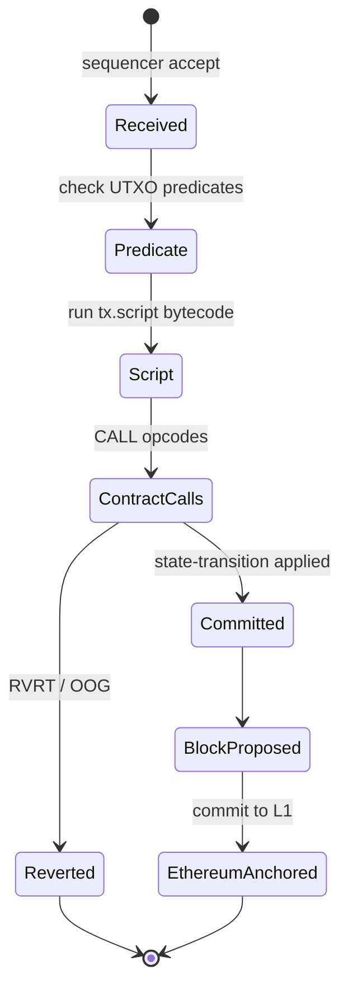
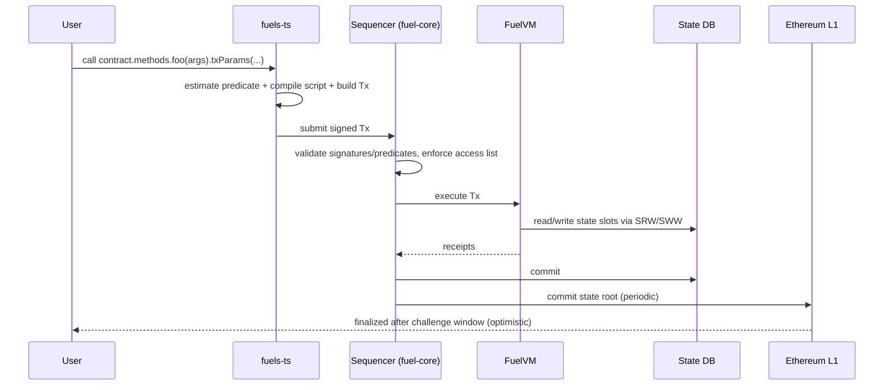

# Fuel 与 Sway

> **TL;DR**：Fuel 是 John Adler、Nick Dodson 等 2020 年发起的**并行 UTXO + 合约**执行层，最早作为 Ethereum optimistic rollup （Fuel v1，2020），2024-05 以 **Ethereum 上的模块化执行层 Fuel Ignition（v2 主网）** 上线。核心创新：**严格访问列表 UTXO 模型**——每笔 Tx 在签名时就列出所有要消费的 UTXO + 要访问的合约 storage key，让运行时能按 "写集不相交"把 Tx 天然并行。**Sway** 是 Fuel Labs 从 Rust 借用语法 + 资源语义 + 指针禁用设计的新语言，编译到 **FuelVM** 字节码（寄存器机 + ~100 opcodes + 专用 predicates）。标准库 `core / std`，工具链 `forc`（类 cargo）+ `fuels-rs` / `fuels-ts` SDK。Fuel 定位为 "Ethereum 最佳 execution layer"——使用 Ethereum 作 DA + settlement，自己做高并行执行。

---

## 1. 背景与动机

Fuel 团队认为 EVM 的本质瓶颈与 Anatoly 类似："**交易不声明写集**"导致无法并行；但解决路径不同：

- Solana / Aptos：要么静态预声明账户 (Solana) 要么乐观并发 (Aptos)。
- **Fuel**：回到 **UTXO 模型**（Bitcoin 原生并行性），再加"合约 storage 访问列表"约束。UTXO 天然每笔 Tx 输入唯一且不再可重用，写集互斥显而易见。

同时 Fuel 认为 EVM 字节码过度复杂、gas 模型奇葩、数据不友好：

- EVM 是 stack machine（操作栈）；Fuel 用 **寄存器机**（更接近现代 ISA，编译器更容易优化）。
- EVM gas 分 base+memory+storage 多维度且常有意外（call 31000/700 gwei 分支）；Fuel 用 **线性 gas**（1 opcode ≈ 固定 gas）+ 单独的 DA / storage cost。
- EVM storage 是 `uint256 → uint256` 无结构化；Fuel 合约有"state storage slots"并对每个 slot 显式声明 access。

2020 年 Fuel v1 以 optimistic rollup 形态上线以太坊，活跃度有限。2023 团队宣布 "Fuel v2 = Modular Execution Layer"：专注执行，把共识/DA 交给 Ethereum（或后续多 DA）。2024 Mainnet Ignition 正式启动。

## 2. 核心原理

### 2.1 形式化定义

Fuel 状态组合为 `(UTXOSet, ContractStorage)`：

- `UTXOSet : UtxoID → Coin` 其中 `UtxoID = hash(tx_id || output_index)`。
- `ContractStorage : (ContractID, Bytes32) → Bytes32`。

一笔 Tx：

```
Tx = {
  inputs: Vec<Input>,       // UTXO spent, Contract invoked, Message consumed
  outputs: Vec<Output>,     // Coin/Contract/Change/Variable/Message
  witnesses: Vec<Witness>,  // 签名 or predicate bytecode
  script / create bytecode: Vec<u8>,
  policies, gas_limit, maturity, ...
}
```

**不变式**：

- **F1（UTXO 不可重用）**：一个 UtxoID 只能出现在一个 Tx 的 inputs 中。
- **F2（资金守恒）**：`Σ inputs.amount = Σ outputs.amount + fees`（按 AssetId 分桶）。
- **F3（预声明 contract）**：Tx 必须在 `inputs: Input::Contract{contract_id}` 中显式声明所调用的每个合约，否则调用失败。
- **F4（Witness 匹配）**：每个 UTXO 的 predicate/owner 必须被对应 witness（签名或 predicate script 返回 true）满足。
- **F5（严格确定性）**：FuelVM 指令集中所有 opcode 无非决定性（无 now/random，除 block-synced sysvar）。

### 2.2 FuelVM 指令集

FuelVM 是**寄存器机**：64 个 64-bit 通用寄存器 `$r0..$r63`，预留若干（`$zero, $one, $of, $pc, $ssp, $sp, $fp, $hp, $err, $ggas, $cgas, $bal, $is, $ret, $retl, $flag`）。

指令分类：

- **算术/逻辑**：`ADD / SUB / MUL / DIV / MOD / AND / OR / XOR / SLL / SRL`。
- **内存**：`LW / SW / MCP / MCL / ALOC` (堆栈分配)。
- **控制流**：`JMP / JI / JNE / JNEF / RET / RETD`.
- **合约相关**：`CALL / CCP / CSIZ / CROO / CRO / CB / SCWQ / SRW / SRWQ / SWW / SWWQ`（state read/write）。
- **UTXO/链访问**：`BHSH / BHEI / TIME / TR / TRO`.
- **加密**：`ECK1 / ECR1 / ED19 / K256 / S256 / KECCAK256`。
- **Predicate**：仅部分 opcode 允许，禁用 state/contract call、禁用随机——确保 predicate 可 offline 验签。

### 2.3 子机制拆解

**(a) Scripts、Predicates、Contracts**：

- **Script**：一次性脚本（类似 Bitcoin scriptSig 的执行器），运行完即弃。常用于"多步链上业务"的胶水层。
- **Predicate**：无状态、pure 函数，决定某 UTXO 能否被花。典型应用：多签、state channels、intent 市场。
- **Contract**：有状态合约，持 storage + 代码；通过 `CALL` 进入。

**(b) Coin / Variable Outputs / Change / Message**：

- `Coin`：普通花费给地址。
- `Contract`：合约 UTXO（ID 固定 = 合约 ID）。
- `Change`：找零（编译器填）。
- `Variable`：合约执行时动态决定金额（如 DEX 输出）。
- `Message`：跨层消息，Ethereum L1 ↔ Fuel。

**(c) Access List**：Tx 预声明合约、UTXO；调度器按"写集互斥"形成 Tx 并发图。Fuel 理论 TPS 受限于 L1 DA 带宽而非执行。

**(d) Gas Model**：`gas_limit` 声明于 Tx；每条 opcode 按静态表扣 `$cgas`（context gas）。超限 → 整 Tx revert。线性、可预测。

**(e) Native Asset**：FuelVM 原生支持多资产——每个合约可发行任意 `AssetId = sha256(contract_id || sub_id)`；内建 opcode `TR / TRO` 做转账，无需 ERC-20 调用链。

**(f) 以太坊锚定 / Settlement**：Fuel Ignition 作为 L2，将 block commit 锁定到 Ethereum `FuelMessagePortal` 合约；通过 `Message` input/output 与 L1 互通。

### 2.4 参数与常量

| 参数 | 值 | 说明 |
| --- | --- | --- |
| 寄存器数 | 64 | 64-bit |
| 栈大小 | VM 分配（heap/stack pointer） | |
| 最大 predicate gas | 2,000,000 | 防止 DoS |
| 最大 Tx size | 17.5 MB（预 SDK） | 可治理 |
| Block gas limit | 30,000,000（初版） | 可治理 |
| State slot 大小 | 32 bytes | |
| UTXO 最大 outputs | 255 | |
| Witness 最大 | 255 | |
| AssetId 推导 | `sha256(contract_id || sub_id)` | |
| Base asset | ETH（Ignition） | |

### 2.5 边界条件

- **Double-spend**：F1 由 state-transition 强制；竞争由 Fuel Sequencer 决定顺序。
- **预声明缺失**：CALL 未声明 contract 输入 → revert；此为 Sway 编译器自动填。
- **Predicate 非纯**：VM 拒绝使用禁用 opcode 的 predicate。
- **跨层消息重入**：L1 → L2 消息必须在 `block_height >= message.block_height + delay` 后才能被消费。
- **Gas 漏估**：Sway 静态可部分估算，动态循环需用户设 limit；不足就 revert，gas 费全扣。
- **Sway unsafe**：Sway 禁止裸指针但 `asm { ... }` 允许嵌内联汇编；审计重点。

### 2.6 Mermaid 交易状态机



### 2.7 ASCII 分层

```
 +--------------------- Fuel Stack ---------------------+
 |  Sway source (.sw) ----forc build----> FuelVM ASM     |
 |  FuelVM bytecode (.bin) + storage_slots.json + abi    |
 +-------------------------------------------------------+
 |  fuel-core node                                       |
 |   - tx_pool (access-list aware scheduler)             |
 |   - executor (FuelVM interpreter)                     |
 |   - state db (RocksDB, Sparse Merkle Tree)            |
 |   - p2p / relayer                                     |
 +-------------------------------------------------------+
 |  L1 Ethereum (data availability + settlement)         |
 +-------------------------------------------------------+
```

## 3. 架构剖析

### 3.1 分层视图

1. **Sway 前端**：`sway-core` 编译器（Rust）解析 `.sw` → ASM → FuelVM bytecode。
2. **FuelVM 层**：`fuel-vm` crate 解释器 + predicate runner。
3. **fuel-core 节点**：`txpool / executor / database / p2p / relayer / graphql`。
4. **Relayer**：听 Ethereum FuelMessagePortal 的 L1→L2 事件。
5. **L1 合约**：`FuelChainState`、`FuelMessagePortal`、`FuelERC20Gateway`。
6. **SDK**：`fuels-rs`、`fuels-ts`。

### 3.2 模块表

| 模块 | 路径 | 职责 | 依赖 | 可替换性 |
| --- | --- | --- | --- | --- |
| fuel-vm | `FuelLabs/fuel-vm` | 指令解释 + gas | fuel-tx | 低 |
| fuel-tx | `fuel-tx` crate | Tx/Output/Input 类型 | fuel-types | 低 |
| fuel-core | `FuelLabs/fuel-core` | 节点实现 | fuel-vm | 低 |
| sway-core | `FuelLabs/sway` | 编译器 | — | 低 |
| forc | `sway/forc/` | 包管理 + build/test/deploy | — | 中 |
| fuels-rs / fuels-ts | `fuels-rs/`, `fuels-ts/` | SDK | — | 中 |
| fuel-merkle | `fuel-merkle/` | Sparse / Binary Merkle | — | 低 |
| fuel-p2p | `fuel-core` 子 crate | libp2p 协议 | — | 中 |
| fuel-bridge / L1 contracts | `FuelLabs/fuel-bridge` | Solidity L1 合约 | — | 低 |

### 3.3 数据流：一笔 Sway 合约调用



### 3.4 客户端多样性

- **fuel-core**（Rust）：官方客户端。
- **Fuelup**：工具版本管理。
- 目前无其它完整生产客户端（2026-04 状态）——客户端多样性待补；Fuel Labs 发布过 spec 鼓励第二实现。

### 3.5 扩展 / 互操作接口

- **GraphQL API**（默认）：`balance / contract / transaction / block / messageProof` 等。
- **JSON-RPC 适配**（兼容层）：部分工具可复用。
- **Predicates**：链下可自由构造 intent / state channels。
- **Messages**：L1 ↔ L2 原生通路；`FuelMessagePortal.sendMessage / relayMessage`。
- **ERC-20 Gateway**：L1 锁定 ERC-20 → L2 发行对应资产。

## 4. 关键代码 / 实现细节

Sway 合约（`examples/counter/src/main.sw`）：

```sway
contract;

use std::storage::storage_api::{read, write};

abi Counter {
    #[storage(read, write)]
    fn increment() -> u64;
    #[storage(read)]
    fn get() -> u64;
}

storage { count: u64 = 0 }

impl Counter for Contract {
    #[storage(read, write)]
    fn increment() -> u64 {
        let c = storage.count.read() + 1;
        storage.count.write(c);
        c
    }
    #[storage(read)]
    fn get() -> u64 {
        storage.count.read()
    }
}
```

`forc build` → 产出 `out/debug/counter.bin` + `counter-abi.json` + `counter-storage_slots.json`。

Predicate 例子（纯函数）：

```sway
predicate;

fn main(secret: u64) -> bool {
    let expected: u64 = 0xDEADBEEF;
    secret == expected
}
```

任何 UTXO owner = `Address::from(predicate_hash)` 的 coin 都可以由携带正确 secret 的 script 解锁。

FuelVM 关键片段（`fuel-vm/src/interpreter/executors/instruction.rs`，概念化）：

```rust
match op {
    Opcode::ADD  => { self.registers[a] = self.registers[b].wrapping_add(self.registers[c]); }
    Opcode::SRW  => { // state read
        let key = self.mem_read_bytes32(self.registers[c])?;
        let (val, exists) = self.state.read(self.contract_id(), &key);
        self.mem_write_bytes32(self.registers[a], val)?;
        self.registers[b] = exists as u64;
    }
    Opcode::CALL => {
        // args: contract_id pointer, forward coin, forward asset_id, forward gas
        self.call(params)?;
    }
    Opcode::RVRT => { return Err(InterpreterError::Revert(self.registers[a])); }
    // ...
}
self.ggas = self.ggas.saturating_sub(gas_cost(op));
if self.ggas < gas_cost(op) { return Err(OutOfGas); }
```

fuel-core Tx Pool（`fuel-core/crates/services/txpool/src/service.rs`）按 `colliding_utxos + colliding_contracts + colliding_messages` 构造依赖图，avoid conflict。

## 5. 演进与版本对比

| 时间 | 事件 |
| --- | --- |
| 2020-03 | Fuel 提案 |
| 2020-12 | Fuel v1 optimistic rollup 主网 |
| 2022 | FuelVM spec 1.0 |
| 2023 | Sway v0.49+（switch tables、generics） |
| 2023-Q3 | Fuel Ignition Testnet |
| 2024-05 | **Ignition 主网（v2）** |
| 2024-10 | Sway 2024 edition，ABI v2 |
| 2025 | 原生 DA 多样化提案（Celestia/Avail） |

## 6. 实战示例

```bash
# 安装 Fuelup
curl https://install.fuel.network | sh
fuelup install latest

forc new counter
cd counter
# 编辑 src/main.sw 如上
forc build
forc test

# 部署
forc wallet new
forc deploy --node-url https://mainnet.fuel.network \
  --signing-key <privkey>
```

TS 调用：

```ts
import { Provider, Wallet } from 'fuels';
import { CounterAbi__factory } from './contracts/factories';

const provider = await Provider.create('https://mainnet.fuel.network/v1/graphql');
const wallet = Wallet.fromPrivateKey(pk, provider);
const counter = CounterAbi__factory.connect(CONTRACT_ID, wallet);
const { value } = await counter.functions.increment().call();
console.log(value.toString());
```

## 7. 安全与已知攻击

- **Predicate gas DoS**：早期 predicate gas 上限过高 → 攻击者写慢 predicate 占用 sequencer。修复：严格上限 + predicate cache。
- **Variable output 溢出**：DEX-like 合约若未校验 variable output 数量 → 逻辑错误。Sway 用户需手动 assert。
- **Access list 不全**：调用合约 A，但 A 内部又 CALL B，若 Tx 没声明 B → revert。开发者容易踩坑；fuels-ts `get_all_contract_dependencies` 帮助自动发现。
- **L1 withdrawal delay**：optimistic rollup 的 7 天挑战期。第三方 bridge 提供快速提款。
- **Sway `asm {}` 漏洞**：内联汇编可绕过部分安全检查；审计必查。
- **Sequencer 中心化**：目前单序列器；去中心化 sequencer 在路线图。

## 8. 与同类方案对比

| 维度 | Fuel + Sway | Solana + Rust | Aptos/Sui Move | EVM L2 (Optimism/Arbitrum) |
| --- | --- | --- | --- | --- |
| 状态模型 | UTXO + 合约 storage | 账户 | 对象 / 全局 | ERC 合约 |
| 并行模型 | 预声明 + UTXO | Sealevel 预声明 | Block-STM / 对象 | 通常串行 |
| 语言 | Sway | Rust | Move | Solidity/Vyper |
| VM | 寄存器 | sBPF | Move VM | EVM |
| 与 Ethereum 关系 | DA + Settlement | 独立 L1 | 独立 L1 | Rollup L2 |
| 字节码体积 | 紧凑 | 中 | 中 | 冗长 |

## 9. 延伸阅读

- 官方文档：<https://docs.fuel.network/>
- Fuel specs：<https://github.com/FuelLabs/fuel-specs>
- Sway book：<https://docs.fuel.network/docs/sway/>
- fuel-core：<https://github.com/FuelLabs/fuel-core>
- John Adler — "Fuel: The Modular Execution Layer"（YouTube）
- Fuel Ignition 技术博客：<https://fuel.mirror.xyz/>
- 登链 Fuel 专栏：<https://learnblockchain.cn/tags/Fuel>

## 10. 术语表

| 术语 | 英文 | 释义 |
| --- | --- | --- |
| FuelVM | Fuel Virtual Machine | 寄存器型 VM |
| Sway | Sway | Rust 风格合约语言 |
| 谓词 | Predicate | 无状态 pure 函数作 UTXO 解锁器 |
| 脚本 | Script | 一次性执行脚本 |
| 合约 | Contract | 有状态模块 |
| UTXO | Unspent Transaction Output | 未花费交易输出 |
| 消息 | Message | L1↔L2 跨层消息 |
| 可变输出 | Variable Output | 运行时决定金额的输出 |
| Forc | Forc | Sway 构建/包管理工具 |
| Fuel Ignition | Fuel Ignition | Fuel v2 主网（以太坊 L2） |

---

*Last verified: 2026-04-22*
