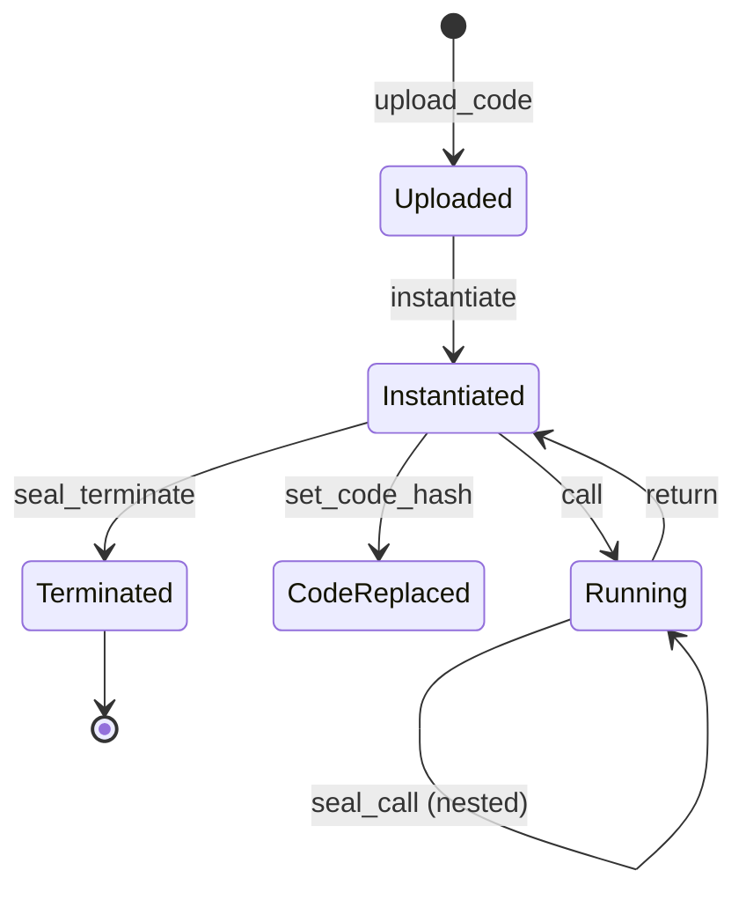
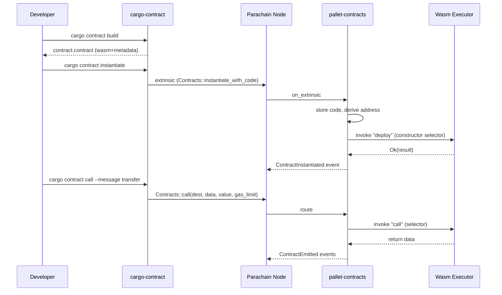

# ink! 与 Substrate Contracts Pallet

> **TL;DR**：ink! 是 Parity 推出的基于 Rust 宏的智能合约 eDSL，源代码编译为 Wasm（PolkaVM / RISC-V 是新方向），运行在 Substrate 的 `pallet-contracts`（或新一代 `pallet-revive`）之上。合约使用纯 Rust 语法书写，配合 `#[ink::contract]` / `#[ink(storage)]` / `#[ink(message)]` 属性宏定义存储与对外方法。与 Solidity 相比，ink! 带来 Rust 类型系统、Cargo 工具链、no_std 生态；与 CosmWasm 相比，它采用 **同步跨合约调用**（类似 EVM），但嵌入在 Substrate Runtime 里，可以直接调用 Pallet 提供的 Chain Extension。2024 年 Parity 发布 ink! 5.0 并开始推动 **PolkaVM（RISC-V）** 作为下一代执行目标，意在改善 gas 计量精度与性能。

## 1. 背景与动机

Polkadot 的设计哲学是 **Runtime = Chain Logic**：每条平行链的业务逻辑以 Substrate Pallet 形式写入 WASM Runtime，由 relay chain 验证。这与以太坊 "链核心 + 用户合约" 的分层不同——Substrate 早期并不预设合约层。但社区很快认识到，不是所有应用都值得单独做一条平行链，许多轻量级 DApp 仍需通用合约层。

2019 年 Parity 启动 `pallet-contracts`，目标：
1. 沿用 Wasm 作为字节码，兼容 Substrate Runtime 的执行环境。
2. 提供类似 Ethereum 的合约调用体验（EOA 发起 tx、合约 call 合约、event）。
3. 与 Pallets 双向交互：合约能访问 Balances / Staking / Assets pallet；Pallet 也能调用合约（Chain Extension）。

ink! 是这一栈上的高层 SDK：开发者写 Rust，宏展开后产出 `no_std` Wasm 二进制，通过 `cargo contract build` 打包为 `.contract` 文件（包含 Wasm + metadata ABI JSON）。

为何不直接沿用 Solidity？
- Rust 的所有权 / 借用检查天然减少 UB，重入模式更受控。
- Substrate 社区已全 Rust，生态对齐。
- Wasm 作为通用目标，利于跨 VM 演进（后期切换 RISC-V / PolkaVM）。

2024–2025 年 Parity 启动 `pallet-revive` + **PolkaVM**（基于 RISC-V 的寄存器式 VM，受 Polkadot 多核执行需求驱动）。ink! 6 的目标是同时支持 Wasm 与 PolkaVM 后端，并提供与 EVM 兼容的 ABI，让 Solidity 合约可直接部署到 Substrate 链上。这体现了 Polkadot 生态吸纳 EVM 流动性的战略。

## 2. 核心原理

### 2.1 形式化定义

合约是元组 `(C, S, M, E)`：
- `C`：Wasm/PolkaVM 字节码。
- `S`：存储 schema，映射到 Substrate Trie（Blake2 哈希的 PATRICIA Trie）。
- `M`：消息集合 `{m_i : (Selector, Args, Return, Mutability)}`。
- `E`：Environment，包含 `caller`、`value`、`block_number`、`block_timestamp`、`chain_extension`。

状态转移：`(S, m, args) → (S', ret, events)`，其中 `m` 由 4 字节 **selector** 标识（`blake2_256(signature)[0..4]`）。跨合约调用通过宿主函数 `seal_call` 同步执行目标合约，返回值直接回传到调用栈——与 CosmWasm 的异步 Actor 不同。

重入与 EVM 类似：A 调 B，B 可以回调 A（call depth 受限于 `Schedule::limits.call_depth`，默认 32）。因此开发者需要 Checks-Effects-Interactions 模式；pallet-contracts 默认禁止 **同合约** 递归重入（除非 `CallFlags::ALLOW_REENTRY`）。

### 2.2 关键数据结构

存储布局由 `ink_storage` 管理，核心类型：
- `Mapping<K, V>`：K → V 的 KV 映射，底层使用 Blake2 前缀的 child trie。
- `Lazy<T>`：延迟加载的单值（只有访问时才从存储读）。
- `StorageVec<T>`（ink! 5.x）：可变长度向量，带索引。
- 结构体字段默认为 eager 加载；大字段应以 `Lazy` 包装。

示例存储：
```rust
#[ink(storage)]
pub struct Erc20 {
    total_supply: Balance,
    balances: Mapping<AccountId, Balance>,
    allowances: Mapping<(AccountId, AccountId), Balance>,
}
```

合约地址：默认通过 `blake2_256(code_hash || caller || salt)` 派生（类 CREATE2）。`code_hash` 是代码的 blake2 摘要，多个实例共享一份代码以节约存储。

### 2.3 子机制拆解

1. **Code Storage**：pallet-contracts 将 Wasm 以 `code_hash → PrefabWasmModule` 存储；多个合约实例可共享一份代码。
2. **Instantiate / Call**：两条 extrinsic，对应部署与调用。`call` 可带 `value`、`gas_limit`、`storage_deposit_limit`。
3. **Storage Deposit**：合约写入状态需押金（`Config::DepositPerByte * bytes + DepositPerItem`），账户余额不足则失败。删除键可退还押金。这是应对 "state bloat" 的经济机制，EVM 没有。
4. **Chain Extension**：合约调用 Pallet 专属 host 函数的通道。在 Runtime 层注册 `ChainExtension`，合约内通过 `self.env().extension().call_foo()` 触发。
5. **Debug / Tracing**：pallet-contracts 提供 `debug_message` syscall，dry-run 时可返回合约内 `println!` 风格日志。
6. **Determinism level**：合约可声明 `is_deterministic = false`（允许浮点）但不能参与链上共识执行；常态为 Deterministic。

### 2.4 参数与常量（pallet-contracts 默认）

| 参数 | 默认值 | 可治理 | 说明 |
| --- | --- | --- | --- |
| `MaxCodeLen` | 123 KiB | ✅ | 单 Wasm 代码上限 |
| `Schedule::limits.call_depth` | 32 | ✅ | 跨合约嵌套深度 |
| `Schedule::limits.memory_pages` | 16（= 1 MiB） | ✅ | 合约内存页 |
| `DepositPerByte` | 链定义 | ✅ | 每字节存储押金 |
| `DepositPerItem` | 链定义 | ✅ | 每 KV 项押金 |
| `DefaultDepositLimit` | extrinsic 传入 | — | 单次调用最大押金 |

### 2.5 失败模式

- **Gas 耗尽**：`seal_gas` 注入指令超限即 trap，状态回滚。
- **Storage Deposit 不足**：签名者余额不够或超出 `storage_deposit_limit`，直接失败。
- **ContractTrapped**：Wasm 执行触发 trap（除零、unreachable、内存越界）。
- **Reentrant 保护**：默认禁止同合约再次入栈；需显式 `ALLOW_REENTRY` 才允许。
- **升级风险**：合约可 `set_code_hash`（类似 Solidity UUPS），逻辑错误会直接自毁。

### 2.6 图示



```
          ┌─────────────┐
EOA tx ──▶│ pallet-     │──► deploy/call Contract
          │ contracts   │         │
          └─────┬───────┘         │ seal_call
                │                 ▼
                │         ┌────────────────┐
                │         │ Other Contract │
                │         └────────────────┘
                │
                ▼ Chain Extension
          ┌─────────────┐
          │ Other Pallet│ (Balances, Assets, XCM, ...)
          └─────────────┘
```

## 3. 架构剖析

### 3.1 分层视图

```
┌────────────────────────────────────────────┐
│ ink! Smart Contract (Rust + attr macros)   │
├────────────────────────────────────────────┤
│ ink! Metadata & ABI (JSON + scale codec)   │
├────────────────────────────────────────────┤
│ pallet-contracts / pallet-revive (Runtime) │
├────────────────────────────────────────────┤
│ Wasm Executor (wasmi / wasmtime) / PolkaVM │
├────────────────────────────────────────────┤
│ Substrate Runtime (FRAME Pallets)          │
├────────────────────────────────────────────┤
│ Substrate Client (networking, consensus)   │
└────────────────────────────────────────────┘
```

### 3.2 核心模块清单

| 模块 | 职责 | 依赖 | 可替换性 |
| --- | --- | --- | --- |
| `ink` / `ink_env` | 合约 SDK，宏展开、host ABI | scale, scale-info | 核心 |
| `ink_storage` | Mapping / Lazy / StorageVec | ink_primitives | 核心 |
| `cargo-contract` | 构建、打包、部署工具 | subxt, scale | 第三方可补 |
| `pallet-contracts` | 执行合约，管理 code storage / instance | FRAME | 可换 pallet-revive |
| `pallet-revive` | 下一代合约 Pallet，EVM ABI + PolkaVM | FRAME | 研究中 |
| `wasmi` | Wasm 解释器（确定性） | — | 可换 wasmtime JIT |
| `PolkaVM` | RISC-V 寄存器式 VM | — | 新方向 |
| `subxt` | Rust 客户端 SDK | scale | 通用 Substrate 工具 |
| Polkadot.js / Contracts UI | 前端交互 | RPC | 可替换为自研 |

### 3.3 数据流：一次 instantiate + call 全流程



### 3.4 参考实现与链

- **ink! 仓库**：`github.com/use-ink/ink`（2024 年从 paritytech 移到社区 org）。
- **pallet-contracts**：`github.com/paritytech/polkadot-sdk` 下 `substrate/frame/contracts`。
- **部署链**：Astar（EVM + WasmVM 双栈）、Aleph Zero、Shiden、Phala、Robonomics、`substrate-contracts-node`（本地）。
- **Polkadot Asset Hub**：2024 起支持 ink! 合约。

### 3.5 外部接口

- **RPC**：Substrate JSON-RPC + `ContractsApi`（dry-run, instantiate, call）。
- **XCM**：合约 via chain extension 可发送 XCM message 到 relay / 其他 parachain。
- **EVM 兼容**：Astar / Moonbeam 并行提供 EVM；pallet-revive 将进一步融合。

## 4. 关键代码 / 实现细节

ink! 合约典型骨架（参考 `use-ink/ink-examples/erc20/lib.rs`，ink! 5.0.0）：

```rust
// 路径：ink-examples/erc20/lib.rs:1-85（简化）
#![cfg_attr(not(feature = "std"), no_std, no_main)]

#[ink::contract]
mod erc20 {
    use ink::storage::Mapping;

    #[ink(storage)]
    pub struct Erc20 {
        total_supply: Balance,
        balances: Mapping<AccountId, Balance>,
        allowances: Mapping<(AccountId, AccountId), Balance>,
    }

    #[ink(event)]
    pub struct Transfer {
        #[ink(topic)] from: Option<AccountId>,
        #[ink(topic)] to: Option<AccountId>,
        value: Balance,
    }

    #[derive(Debug, PartialEq, Eq, scale::Encode, scale::Decode)]
    pub enum Error { InsufficientBalance, InsufficientAllowance }

    impl Erc20 {
        #[ink(constructor)]
        pub fn new(total: Balance) -> Self {
            let caller = Self::env().caller();
            let mut balances = Mapping::default();
            balances.insert(caller, &total);
            Self::env().emit_event(Transfer { from: None, to: Some(caller), value: total });
            Self { total_supply: total, balances, allowances: Mapping::default() }
        }

        #[ink(message)]
        pub fn total_supply(&self) -> Balance { self.total_supply }

        #[ink(message)]
        pub fn balance_of(&self, who: AccountId) -> Balance {
            self.balances.get(who).unwrap_or_default()
        }

        #[ink(message)]
        pub fn transfer(&mut self, to: AccountId, value: Balance) -> Result<(), Error> {
            let from = self.env().caller();
            let from_bal = self.balance_of(from);
            if from_bal < value { return Err(Error::InsufficientBalance); }
            self.balances.insert(from, &(from_bal - value));
            let to_bal = self.balance_of(to);
            self.balances.insert(to, &(to_bal + value));
            self.env().emit_event(Transfer { from: Some(from), to: Some(to), value });
            Ok(())
        }
    }
}
```

宏展开关键点（简化）：
1. `#[ink::contract]` 生成 `__ink_StorageLayout`、`__ink_Metadata`、Wasm 导出符号 `call` / `deploy`。
2. 每个 `#[ink(message)]` 被分配一个 4 字节 selector = `blake2_256(&name)[0..4]`，可通过 `#[ink(selector = 0xCAFEBABE)]` 覆盖。
3. `Mapping::insert` 在宿主侧走 `seal_set_storage`，key = `blake2(prefix || scale(key))`。
4. `emit_event` 调用 `seal_deposit_event`，topics 经 `scale-encode` + blake2 哈希。

## 5. 演进与版本对比

| 版本 | 发布时间 | 关键变化 | 外部影响 |
| --- | --- | --- | --- |
| ink! 2.x | 2020 | 早期实验，基于 `ink_lang` 宏 | 仅 PoC |
| ink! 3.0 | 2021 | Stable 存储 API；`Mapping` 引入 | 标志 prod-ready |
| ink! 3.4 | 2022 | Chain extension 改进；metadata v4 | 集成更好 |
| ink! 4.0 | 2023-03 | `Mapping` 取代 `HashMap`；`Lazy<T>`；selector 语义调整 | breaking，合约需重写存储 |
| ink! 4.3 | 2023-Q4 | E2E 测试框架；cross-contract call builder | 工具链完善 |
| ink! 5.0 | 2024-03 | 依赖精简；`StorageVec`；events v2 | metadata v5 |
| ink! 6.0（RC） | 2025 | pallet-revive 支持；PolkaVM 后端；Solidity ABI 互操作 | 与 EVM 交界 |

Substrate 合约 pallet 并存：
- `pallet-contracts`（Wasm + ink!-centric）
- `pallet-evm`（Frontier，EVM + Solidity，Moonbeam / Astar EVM 采用）
- `pallet-revive`（合一，支持 Solidity + ink!，PolkaVM 目标）——Polkadot 2024–2025 主推方向

## 6. 实战示例

```bash
# 1. 安装工具
rustup component add rust-src
rustup target add wasm32-unknown-unknown
cargo install --force --locked cargo-contract

# 2. 创建合约
cargo contract new flipper
cd flipper

# 3. 构建（输出 target/ink/flipper.contract）
cargo contract build --release

# 4. 启动本地节点
docker run --rm -p 9944:9944 -p 9933:9933 \
  paritytech/contracts-node:latest --dev --rpc-external

# 5. 部署
cargo contract instantiate \
  --constructor new --args true \
  --suri //Alice --url ws://127.0.0.1:9944 \
  --skip-confirm
# 返回 Contract: 5FEmZ...

# 6. 调用
cargo contract call --contract 5FEmZ... \
  --message flip --suri //Alice --execute --skip-confirm

# 7. 只读查询（dry-run）
cargo contract call --contract 5FEmZ... \
  --message get --suri //Alice
# Result: Ok(true)
```

前端可用 **Contracts UI**（`contracts-ui.substrate.io`）直接上传 `.contract` 文件交互。

## 7. 安全与已知攻击

- **重入（Cross-contract reentrancy）**：尽管 `pallet-contracts` 默认禁止同合约递归调用，跨合约 A→B→A 仍可能。2022 年 `openbrush` 社区修复过 PSP22 实现中的一处重入风险。
- **Storage rent 遗失**（ink! 3 → 4 迁移）：旧版存储布局（`HashMap<K, V>` 存 `Vec<(K,V)>`）在 4.0 后不再工作，很多早期合约迁移时遗失数据。Lesson：版本间 storage 不保证兼容。
- **Gas 估算偏差**：cargo-contract dry-run 有时低估 gas，部署后链上失败。新版（4.x+）使用更精确的 gas reference。
- **Chain Extension 权限错配**：自定义 Chain Extension 若未校验调用者，合约可绕过 Pallet 权限。曾在某 parachain 测试网出现过 Balances 无限铸币。
- **Kusama Statemine pallet-contracts 下线（2023）**：pallet-contracts 曾在 Kusama 下线重装，因为早期版本的存储 migration 风险未成熟；后续通过 Asset Hub 重新部署。

整体 ink! / pallet-contracts 在主网事故数量远少于 Solidity，一方面生态体量小，另一方面 Rust 类型系统拦截了一些常见错误（整数溢出需显式 `checked_*`）。

## 8. 与同类方案对比

| 维度 | ink! | Solidity (EVM) | CosmWasm | Move (Sui / Aptos) |
| --- | --- | --- | --- | --- |
| 源语言 | Rust + 宏 | Solidity DSL | Rust | Move |
| 字节码 | Wasm（→ PolkaVM） | EVM | Wasm | Move bytecode |
| 调用模型 | 同步，默认禁同合约重入 | 同步，可重入 | 异步 Actor | 同步 + 资源移动 |
| 存储计量 | Storage Deposit | Gas（状态写入贵） | Gas（链级 fee） | Move object rent |
| 合约升级 | `set_code_hash` | Proxy | admin migrate | 包管理器 |
| 跨合约 | seal_call + ABI | CALL / DELEGATECALL | SubMsg/Reply | entry fn call |
| 生态规模 | 小（Polkadot 生态） | 最大 | 中（Cosmos 生态） | 中（Sui/Aptos） |
| 工具链 | cargo-contract, subxt | Hardhat, Foundry | CosmJS, cw-orch | Aptos / Sui CLI |

Trade-offs：
- ink! 的优势是 Rust 原生、与 Substrate Pallet 深度集成、押金机制更明确；劣势是生态流动性远不及 EVM。
- 若项目主要发布在 Polkadot / Astar / Aleph，ink! 是首选；若跨链覆盖 EVM / Solana 多生态，ink! 并非唯一解。

## 9. 延伸阅读

- **官方文档**：<https://use.ink/>、<https://paritytech.github.io/polkadot-sdk/master/pallet_contracts/>
- **仓库**：<https://github.com/use-ink/ink>、<https://github.com/use-ink/ink-examples>
- **规范**：PSP22 / PSP34 / PSP37（OpenBrush 标准，类 ERC）
- **Wiki**：<https://wiki.polkadot.network/docs/build-smart-contracts>
- **学习**：Astar Docs、Aleph Zero Academy、Polkadot Blockchain Academy
- **视频**：Sub0 大会、Polkadot Decoded ink! track
- **PolkaVM 设计**：Jan Bujak @ Web3 Summit 2024

## 10. 术语表

| 术语 | 英文 | 释义 |
| --- | --- | --- |
| 消息 | Message | ink! 合约对外暴露的方法 |
| 选择器 | Selector | 消息名 blake2 前 4 字节 |
| 延迟加载 | Lazy | 字段访问时才解码 |
| 存储押金 | Storage Deposit | 按字节收取的状态占用押金 |
| 链扩展 | Chain Extension | 合约调用 Pallet 的专用 host 接口 |
| Revive | pallet-revive | Polkadot SDK 下一代合约 Pallet |
| PolkaVM | PolkaVM | 基于 RISC-V 的新合约 VM |
| PSP | PSP-XX | Polkadot Standard Proposal，类 ERC |

---

*Last verified: 2026-04-22*
