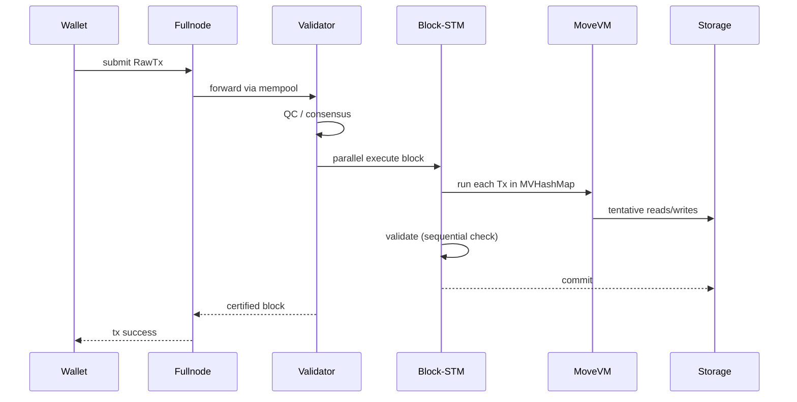

# Aptos Move

> **TL;DR**：Aptos Move 是 Aptos Labs 在原 Diem Move 基础上演进出的方言：**保留全局存储模型**（`move_to<T>(signer, v)` / `borrow_global<T>(addr)` / `acquires T`），以 **Block-STM** 乐观并行执行（Aptos 自研，论文 OSDI'22），并新增 **Fungible Asset (FA)** 和 **Object** 两大框架（2024）替代早期的 `Coin`/资源型 NFT。配合 **Aptos Framework** 标准库（`0x1::*`）、**Aptos Token Objects**（0x4）、**Aptos Randomness**（链上 VRF）、**Aptos Keyless Accounts**（Google/Apple OAuth 直签）、**Aptos Agent**（动态分派）等特性，形成面向高性能与主流用户的合约平台。开发工具链 `aptos-cli` + `move-package`；EVM bytecode 兼容由 Porto（2025 preview）提供。

---

## 1. 背景与动机

2022 年 Diem 解散，Aptos Labs 接手 Move 运行时并于当年 10 月主网上线。Aptos 的两个"与 Sui 不同"的关键决策：

1. **保留全局存储**：继续用 `address → T` 的键值结构。好处是 account-centric 模型直观、兼容 Diem 既有模块；坏处是并行冲突仍需 Block-STM 在运行时探测。
2. **Block-STM 乐观并行**：不要求开发者预声明读写集（不像 Solana Sealevel）；运行时先假设 Tx 互不冲突，检测冲突后按 Tx 顺序号重试。2022 OSDI 论文证明其最坏退化为顺序执行。

2023–2024 Aptos 进一步推出：

- **Aptos Object Model**（AIP-10, 2023）：在全局存储之上建轻量对象容器，具备可转移 ObjectRef。
- **Fungible Asset（FA）框架**（AIP-21, 2024）：替代早期 `coin` 模块，支持分账户余额、冻结、dispatch 型 hook。
- **Aptos Randomness v1**（AIP-41, 2024）：共识内置 VRF。
- **Keyless Accounts**（AIP-61, 2024）：ZK + OAuth → 无助记词登录。

## 2. 核心原理

### 2.1 形式化定义

Aptos Move 继承 Move 通用语义（见 move-language.md §2.1），在宿主层增加三类状态：

- 全局存储：`Σ_g : (Address, StructTag) → Value`，对每个 `(addr, T)` 至多一份 `T` 资源。
- 事件流：`E`，按 `EventHandle` 逐笔 append；2023 起 `module events`（`#[event]`）直接 emit。
- Randomness：`R : Epoch × TxSeq → [0, 2^256)`，由共识 DRB（Distributed Randomness Beacon）填充。

**不变式 A1（资源所有权）**：账户 `addr` 的任一 `T` 资源仅能由拥有 `signer addr` 或 `key` 持有 `SignerCapability`/`Object<T>` 的模块修改。

**不变式 A2（Block-STM 等价顺序执行）**：一个 block 的 Tx 序列 `t_1...t_n` 执行后 state hash 等价于严格按 `i=1..n` 串行执行的 hash（见 OSDI'22 定理 1）。

**不变式 A3（Dispatch 受控）**：AIP-73 动态分派只能在注册表里合法的函数签名间调用，runtime 拒绝不匹配。

### 2.2 Block-STM 算法

Block-STM（Software Transactional Memory）核心：

1. **Execution**：执行器线程池并发跑 Tx，记录 read set / write set。
2. **Validation**：按 Tx 顺序号逐个验证——若某 Tx 的 read set 包含已被前序 Tx 写入的 key → invalid → 重置、重新 execute。
3. **Commit**：所有前序 Tx 都 commit 后，当前 Tx 写入持久化。

关键数据结构：

- `MVHashMap<K, V>`：多版本哈希表，允许读历史版本。
- `Scheduler`：分派 exec/validation 任务。
- 最坏 `O(n^2)` 重试，但实测 DApp 场景几乎无冲突（实测 60–160k TPS 理论峰值）。

与 Solana Sealevel 的区别：Solana 要求开发者显式声明账户（静态）；Aptos Block-STM 动态探测（开发零成本，但有重试代价）。

### 2.3 Aptos Object 模型

`aptos_framework::object`（framework/sources/object.move）：

```move
struct ObjectCore has key {
    guid_creation_num: u64,
    owner: address,
    allow_ungated_transfer: bool,
    transfer_events: EventHandle<TransferEvent>,
}
struct Object<phantom T> has copy, drop, store { inner: address }
```

- 创建 `ConstructorRef = object::create_object(creator_addr)` → 得到 `object_addr`。
- 后续资源可 `move_to(&object_signer, MyData{...})`；通过 `object::object_from_constructor_ref<MyData>` 得到 `Object<MyData>`。
- 转移：`object::transfer<MyData>(&owner, obj, new_addr)`；可用 `ExtendRef / TransferRef / DeleteRef` 精细控制。
- **延伸**：每个对象都拥有独立 address，可再挂更多资源——相当于"轻量账户"。

### 2.4 Fungible Asset 框架

`aptos_framework::fungible_asset` + `primary_fungible_store`：

- 每种代币 = 一个 **Metadata Object**（含 name、symbol、icon_uri、decimals、supply）。
- 每个账户可持有多个 **FungibleStore** 对象，每个 store 只存一种 metadata 的余额。
- `primary_fungible_store` 约定了"每 holder 每 metadata 一个 store"的 PDA 式地址派生（seeds = [holder, metadata]）。
- 迁移：旧的 `0x1::coin` 可通过 `coin::create_pairing` 把 coin 类型桥接到 FA metadata。

**Dispatchable FA（AIP-73）**：在 transfer/deposit/withdraw 路径注入 hook 函数，允许白名单、KYC、transfer fee 等扩展，语义类似 Solana Token-2022 的 transfer hook。

### 2.5 子机制拆解

**(1) Account 模型**：`aptos_framework::account`，每账户有 `authentication_key`（默认等于 address，可 rotate）、sequence_number、event handles。Keyless Account 的 authentication_key 派生自 `(iss, aud, sub, pepper)` + ZK proof。

**(2) 交易**：`RawTransaction { sender, sequence_number, payload, max_gas, gas_price, expiration, chain_id }`。Payload 种类：`EntryFunction`、`Script`（受限）、`Multisig`、`MultiAgent`、`FeePayer`（gasless）。

**(3) 升级策略**：AIP-1 `upgrade_policy` = `arbitrary | compatible | immutable`。Compatible 要求：字段不删、公共函数签名不变、资源 layout 扩展不改。

**(4) Keyless**：`aptos_framework::keyless_account` 保存 `OpenIdConfig`；用户从 OAuth 拿 JWT、在本地生成 Groth16 proof 证明 `hash(user_id)` 属于该 iss/aud → 生成交易签名。

**(5) Randomness**：`aptos_framework::randomness::u64_integer()`，底层由共识 DRB 提供 entropy；AIP-41 要求调用函数带 `#[randomness]` attribute 防止 test-and-abort bias。

**(6) Parallel Fee Payer**：`FeePayer` payload 支持"别人替我付 gas"；常见于 dapp onboarding。

### 2.6 参数与常量

| 参数 | 值 | 说明 |
| --- | --- | --- |
| 区块时间 | ~100–150 ms | AptosBFT v4 |
| 交易最大 gas | 2,000,000 units（默认） | 可设更高至 25,000,000 |
| Gas unit price | 治理调整，典型 ~100 octas | 1 APT = 10^8 octas |
| Max transaction size | 65,536 B | |
| Execution 线程 | 默认 32 | Block-STM worker |
| Module size 上限 | ~60 KB | framework v8 |
| Randomness 成本 | 额外 gas | 防 undergasing 攻击 |

### 2.7 边界条件

- **Block-STM 重试风暴**：热点资源（所有 Tx 写 Treasury）→ 并行退化串行。热点对象应引入 sharding。
- **Upgrade 兼容性违反**：AIP-1 check 拒绝后必须走 `arbitrary` 或 immutable 重发布。
- **Keyless pepper 丢失**：用户无法恢复账户（pepper 服务是一阶设计，第三方 pepper committee 提供冗余）。
- **Randomness bias**：被调函数 abort → 重试可挑结果；AIP-41 通过"unbiasable" attribute 封死。
- **Gas 耗尽**：回滚全部写入，但执行到该点的 gas 费不退。

### 2.8 Mermaid：一笔交易生命周期



### 2.9 ASCII 全局存储图

```
Global Store
  account 0xA1 -> { AccountResource, Coin<APT>, FungibleStore<USDC>, Object<MyNFT>#0xaa }
  account 0xA2 -> { AccountResource, Object<DomainName>#0xbb }
  object  0xaa -> { Token, Royalty, TransferRef }
  object  0xbb -> { DomainNameData }
```

## 3. 架构剖析

### 3.1 分层视图

1. **Aptos Framework（0x1）**：language/standard lib + account/coin/fungible_asset/object/block/staking/reconfiguration。
2. **Aptos Token Objects（0x4）**：NFT 标准基于 object 模型。
3. **Aptos VM（`aptos-vm` crate）**：封装 MoveVM，提供 prologue/epilogue、gas metering、natives。
4. **Block-STM 执行器**（`aptos-block-executor`）。
5. **Storage 层**（`aptos-storage` = RocksDB + Jellyfish Merkle Tree 变种）。

### 3.2 模块表

| 模块 | 路径 | 职责 | 依赖 | 可替换性 |
| --- | --- | --- | --- | --- |
| aptos-framework | `aptos-move/framework/aptos-framework/` | 标准库 + 系统模块 | move-stdlib | 低 |
| aptos-token-objects | `aptos-move/framework/aptos-token-objects/` | NFT/Token v2 | framework | 低 |
| aptos-vm | `aptos-move/aptos-vm/` | VM 适配 | MoveVM | 低 |
| block-executor | `aptos-move/block-executor/` | Block-STM | MoveVM、MVHashMap | 中 |
| move-stdlib | `third_party/move/move-stdlib/` | vector/hash/signer | — | 低 |
| consensus | `consensus/` | AptosBFT v4 | 网络、crypto | 低 |
| storage | `storage/aptosdb/` | RocksDB + SMT | — | 中 |
| state-sync | `state-sync/` | 状态同步 | network | 中 |
| mempool | `mempool/` | Tx pool | network | 中 |
| crypto | `crypto/` | Ed25519, BLS, Groth16 (keyless) | — | 低 |

### 3.3 数据流：Tx 提交 → Finality

1. 钱包构造 RawTx，对其 BCS + `prefix` hash 做 Ed25519 签名（或 Keyless ZK proof）。
2. Fullnode mempool 验签、序列号检查、入 MinTxnGasTank。
3. 经 gossip 到 leader；AptosBFT v4 3-chain BFT 共识生成 `ExecutedBlock`。
4. block-executor 以 Block-STM 并行执行，更新 Jellyfish Merkle Tree。
5. 状态承诺（state_root）并入 QC，再轮 BFT 达成 commit。
6. Fullnode state-sync 接收 proof + 状态 diff。
7. 客户端通过 REST API `/v1/transactions/{hash}` 获取最终状态。

### 3.4 客户端多样性 / 参考实现

- **aptos-core**（Rust）：Aptos Labs 主客户端。
- **Kestrel**（Kestrel Labs 研发中，C++ 节点）：目标多样化。
- **indexer-grpc** + **indexer-processor**：Rust 官方索引框架。
- **aptos-ts-sdk**（TS）、**aptos-python-sdk**、**aptos-go-sdk** 等。
- **move-analyzer (LSP)**、**move-prover**、**Formal Verifier**。

### 3.5 扩展 / 互操作

- **REST API v1**：账户、资源、事件、交易、gas 估算。
- **gRPC Indexer Stream**：按账户/事件类型订阅。
- **Keyless / OIDC Federation**：支持 Google、Apple、Facebook。
- **Bridges**：LayerZero、Wormhole、Circle CCTP 已接入。
- **Aptos Connect**：链下钱包 SDK。
- **Porto EVM 兼容层**（2025 preview）：把 Solidity/EVM bytecode 翻译到 Move。

## 4. 关键代码 / 实现细节

`aptos_framework::object::create_object`（`framework/aptos-framework/sources/object.move` 2024-Q3 附近）：

```move
public fun create_object(owner_address: address): ConstructorRef {
    let unique_address = transaction_context::generate_auid_address();
    create_object_internal(owner_address, unique_address, true)
}

fun create_object_internal(
    owner: address, addr: address, can_delete: bool,
): ConstructorRef {
    assert!(!exists_at(addr), error::already_exists(EOBJECT_EXISTS));
    let obj_signer = create_signer(addr);
    move_to(&obj_signer, ObjectCore {
        guid_creation_num: INIT_GUID_CREATION_NUM,
        owner,
        allow_ungated_transfer: true,
        transfer_events: account::new_event_handle(&obj_signer),
    });
    ConstructorRef { self: addr, can_delete }
}
```

Fungible Asset transfer（`framework/aptos-framework/sources/fungible_asset.move`）：

```move
public entry fun transfer<T: key>(
    sender: &signer, recipient: address, metadata: Object<T>, amount: u64,
) acquires FungibleStore {
    let sender_store = primary_fungible_store::ensure_primary_store_exists(signer::address_of(sender), metadata);
    let recipient_store = primary_fungible_store::ensure_primary_store_exists(recipient, metadata);
    withdraw(sender, sender_store, amount);
    deposit(recipient_store, amount);
}
```

Block-STM 调度骨架（`aptos-move/block-executor/src/scheduler.rs` 简化）：

```rust
loop {
    match scheduler.next_task() {
        Task::Execute(tx_idx) => {
            let (reads, writes) = vm.execute(tx_idx, &mvhash);
            mvhash.record(tx_idx, writes);
            scheduler.finish_execution(tx_idx);
        }
        Task::Validate(tx_idx) => {
            if mvhash.read_set_still_valid(tx_idx) {
                scheduler.finish_validation(tx_idx, true);
            } else {
                scheduler.abort(tx_idx);  // re-execute later
            }
        }
        Task::Done => break,
    }
}
```

## 5. 演进与版本对比

| 时间 | 事件 |
| --- | --- |
| 2022-10 | 主网 v1；Move v5 |
| 2023-02 | Aptos Framework v1（coin、token v1） |
| 2023-06 | Object model（AIP-10） |
| 2023-10 | Token v2 / Aptos Token Objects |
| 2024-02 | Fungible Asset v2（AIP-21） |
| 2024-05 | Randomness v1（AIP-41） |
| 2024-08 | Keyless Accounts（AIP-61） |
| 2024-10 | Dispatchable FA（AIP-73） |
| 2025 | Function Values / Dynamic Dispatch |

## 6. 实战示例

```bash
aptos init --network testnet
aptos account fund-with-faucet --account default
aptos move init --name fa_demo
```

发币 Demo（简化，基于 FA 框架）：

```move
module fa_demo::my_fa {
    use aptos_framework::object;
    use aptos_framework::fungible_asset::{Self, MintRef, TransferRef};
    use aptos_framework::primary_fungible_store;
    use std::option;
    use std::string;

    const ASSET_SYMBOL: vector<u8> = b"MYFA";

    fun init_module(admin: &signer) {
        let ctor = object::create_named_object(admin, ASSET_SYMBOL);
        primary_fungible_store::create_primary_store_enabled_fungible_asset(
            &ctor,
            option::none(),                         // max supply
            string::utf8(b"My Fungible Asset"),
            string::utf8(ASSET_SYMBOL),
            8,                                      // decimals
            string::utf8(b""), string::utf8(b""),
        );
        let mint_ref = fungible_asset::generate_mint_ref(&ctor);
        let _transfer_ref = fungible_asset::generate_transfer_ref(&ctor);
        // persist refs ...
    }
}
```

部署 & 调用：

```bash
aptos move publish --named-addresses fa_demo=default
aptos move run --function-id default::my_fa::mint --args address:0xabc u64:1000
```

## 7. 安全与已知攻击

- **2022 初 Devnet Proof bug**：共识 BLS 聚合早期实现问题。
- **Aptos Names 2023**：域名模块未校验 Object owner → 抢注漏洞（修复）。
- **Pyth on Aptos 2024**：预言机调用 gas 估算异常（非语言）。
- **Keyless service risk**：pepper service 若集中、被钓鱼 → 账户被控。AIP-75 引入多方 pepper。
- **Randomness bias**：未加 `#[randomness]`/`unbiasable` 的函数中调用 random → 可回滚+重试直到满意结果。所有使用 random 的逻辑必须封闭。
- **Upgrade `arbitrary`**：若 admin 私钥丢失可被替换为恶意 framework。

## 8. 与同类方案对比

| 维度 | Aptos Move | Sui Move | Solana Anchor | EVM Solidity |
| --- | --- | --- | --- | --- |
| 存储模型 | 全局 `addr→T` + Object | 对象 UID | Account | Contract storage |
| 并行 | Block-STM | Mysticeti 对象 DAG | Sealevel | 无 |
| 资源语义 | Move linear | 同 | Rust own | 数字 |
| 形式化 | Prover 内置 | Prover | — | Certora |
| 开发者心智 | 类 Rust + global storage | 对象拥有权 | 账户预声明 | 状态 map |

## 9. 延伸阅读

- 官方：<https://aptos.dev/en/build/smart-contracts>
- AIPs：<https://github.com/aptos-foundation/AIPs>
- Block-STM 论文：<https://arxiv.org/abs/2203.06871>
- aptos-core：<https://github.com/aptos-labs/aptos-core>
- MoveBit / OtterSec 审计 blog：<https://movebit.xyz>、<https://osec.io/blog>
- 登链 Aptos 专栏：<https://learnblockchain.cn/tags/Aptos>

## 10. 术语表

| 术语 | 英文 | 释义 |
| --- | --- | --- |
| 全局存储 | Global Storage | Aptos Move 的 `(addr, T) → value` 键值 |
| 对象 | Object | address-like 容器，轻量账户 |
| 可替代资产 | Fungible Asset (FA) | Coin v2 框架 |
| 代币对象 | Token Object | 基于 Object 的 NFT v2 |
| 乐观并行 | Block-STM | Aptos 运行时并行执行算法 |
| 能力引用 | MintRef/TransferRef | FA 元对象上的权柄 |
| 无助记词账户 | Keyless Account | ZK + OAuth 登录的 Aptos 账户 |
| 可调度 FA | Dispatchable FA | 在 transfer 路径挂 hook 的扩展 FA |

---

*Last verified: 2026-04-22*
