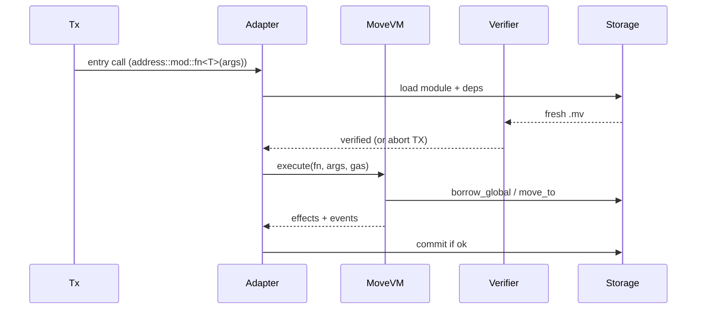

# Move 语言

> **TL;DR**：Move 是 Sam Blackshear（Meta/Diem）2019 年发表的面向数字资产的静态类型、字节码安全、**基于资源（Resource）** 的智能合约语言。核心抽象是 **线性类型（linear types）**：资源值 **不可隐式复制、不可隐式销毁**，必须显式 `move` 移动所有权——这天生杜绝了 EVM 世界常见的"代币重复铸造 / 丢失"错误。Move 以 `module` 为单位组织代码，把类型 + 操作封装在 `address::module_name`。字节码验证器（Bytecode Verifier）在**加载时**静态证明类型、引用安全、资源守恒。语言本身中立，目前存在三大活跃方言：**Aptos Move**（保留 Diem 风格的全局存储 `borrow_global<T>(addr)`）、**Sui Move**（废除全局存储，改为对象中心 `UID`）、**Movement**（兼容两派的 L2 路线）。本篇聚焦 Move 语言通用语义；Aptos / Sui 分叉细节见各自文档。

---

## 1. 背景与动机

2019 年 Facebook 推出 Libra（后改名 Diem）时，核心工程师 Sam Blackshear 认为：

> "**Smart contracts should be as safe as possible by default**. In Solidity, nothing stops a function from minting tokens out of thin air; the language has no notion of 'asset'."

Solidity 的核心缺陷：

- `uint256` 既可以代表余额，也可以代表随机计数。编译器无法区分"这个数字是钱"。
- 外部调用 → 重入、权限混乱。
- 无静态资源守恒检查（mint/burn 完全自由）。

Move 的回答：

- 把"资产"编码到类型系统里——`Coin<USDC>` 是一个 **resource**，有且只有一个副本。
- 线性类型强制：`let x: Coin<USDC> = ...; /* 不做任何事 */` **编译不过**，因为 `x` 没被消费。
- 没有 dangling reference，没有 integer 当 pointer，无法类型混淆。
- **bytecode verifier** 在部署时执行严格的数据流分析；任何违反资源守恒的字节码被拒绝执行。

2022 年 Diem 解散后，核心团队分流：**Aptos Labs**（Mo Shaikh、Avery Ching）继承 Diem 全局存储模型；**Mysten Labs**（Evan Cheng、Sam Blackshear 本人）另起炉灶做 Sui，彻底重写存储层为"对象中心"。两者共享相同的 Move core语法，但标准库、存储模型、并行模型不同。

## 2. 核心原理

### 2.1 形式化定义

Move 可被看作带状态、带能力系统（abilities）的仿射/线性 lambda 演算。设 `Σ` 为全局存储、`Γ` 为类型环境：

- **值能力**（abilities）：`copy`（可复制）、`drop`（可销毁）、`store`（可入全局存储）、`key`（可作为顶层资源入存储）。四种能力自由组合。`Coin` 通常是 `store` 但不 `copy` 也不 `drop` ——这就是线性语义。
- **类型规则 T-Copy**：`Γ ⊢ x : τ  ∧  copy ∈ abilities(τ)  ⇒  Γ ⊢ copy x : τ`。否则只能 `move`。
- **类型规则 T-Drop**：离开作用域的值若无 `drop` 能力 → 编译错。必须显式 `destroy` 或 `move` 出去。
- **全局存储规则**：`move_to<T>(signer, v)`、`move_from<T>(addr): T`、`borrow_global<T>(addr): &T`、`exists<T>(addr): bool`——`T` 必须有 `key` 能力。
- **不变式 R1（资源守恒）**：对任一 `key` 资源 `R`，全局存储中 `|R|` 只能通过 `move_to / move_from` 显式调整；任何 bytecode 路径若不符则 verifier 拒绝。
- **不变式 R2（无悬空引用）**：引用 `&T` / `&mut T` 不能逃出源生命周期；同一 storage slot 不能同时被 `&` 与 `&mut` 借用（borrow checker 静态）。

Move Prover（`move-prover`）甚至能把这些不变式交给 SMT solver 形式化证明。

### 2.2 字节码结构

Move 字节码（`.mv`）受 LLVM 启发：

- **CompiledModule**：handles（module/struct/function/signature/address/constant 引用池）、struct/field/function 定义、code unit（字节码数组）、metadata。
- **指令集**：~100 条，包括 `LdU8/U64/U128/U256/LdConst/LdTrue/LdFalse`、`CopyLoc/MoveLoc/StLoc`、`Pack/Unpack/ImmBorrowField/MutBorrowField`、`Call/CallGeneric`、`MoveTo/MoveFrom/BorrowGlobal/Exists`、`Branch/BrTrue/BrFalse`、`Abort`、`Add/Sub/Mul/Mod/Div/BitOr/BitAnd/Xor/Shl/Shr`、`Eq/Neq/Lt/Le/Gt/Ge`。
- **无动态分派**：所有函数调用在编译时确定目标（除 `dispatch` 型 vtable，由 `DynamicDispatchHook` 后续提供）。这是静态验证的关键。

### 2.3 Bytecode Verifier

加载模块时，verifier 依次执行：

1. **结构完整性**：所有 handle 指向合法索引。
2. **类型检查**：每条指令的栈 in/out 类型与 signature 相符。
3. **引用安全 / borrow checker**：基于 abstract interpretation 的数据流分析，确保 `&` 与 `&mut` 不重叠。
4. **资源安全**：没有 `drop` 的资源不能 implicitly 被丢弃；没有 `copy` 的资源不能被 `Dup` 指令复制。
5. **控制流安全**：没有不可到达块、无越界跳转。
6. **栈平衡**：每条函数退出时栈深度与签名一致。

这些检查完成前字节码不会执行——部署阶段发现的 bug 不可能在运行时出现。

### 2.4 模块与脚本

- **Module（模块）**：类型定义 + 函数 + friends + resource。`module 0xCAFE::coin {}`。模块一旦发布不可直接修改（Aptos/Sui 各自定义了升级规则，见相应文档）。
- **Script（脚本）**：一次性交易函数，不持久化在链上。Sui 已取消 script；Aptos 通过 entry function 调用替代大部分 script 用法。
- **entry 函数**：可直接被交易调用；参数只能是基本类型 + `signer`（Aptos）/ `TxContext`（Sui）+ 已公开的资源引用。

### 2.5 子机制拆解

**(a) Abilities 矩阵**

| 能力 | 含义 | 典型用于 |
| --- | --- | --- |
| `copy` | 允许 `copy` 操作 | 数字、struct of primitives |
| `drop` | 离开作用域自动销毁 | 数字、只读数据 |
| `store` | 可嵌套进其它 `store`/`key` 结构 | 资产载荷 |
| `key` | 可成为全局资源（有 address 作主键） | 账户下的余额、NFT |

典型声明：

```move
struct Coin<phantom T> has store { value: u64 }
struct Balance<phantom T> has key { coin: Coin<T> }
```

**(b) Generic / phantom 类型**：`Coin<USDC>` vs `Coin<USDT>` 是不同类型；`phantom` 标记不参与运行时表示，仅做类型标记（相当于"品牌"）。

**(c) Events**：Aptos 用 `0x1::event::emit`；Sui 用 `sui::event::emit`。都不可变、索引器可解析。

**(d) 错误码与 Abort**：无异常体系，只有 `abort <u64>`——交易整体回滚。约定错误码按 `module::ECODE_NAME = u64` 常量。

**(e) Gas**：每条字节码指令按 table 扣 gas；每次 `move_to/move_from` 按 storage IO 计费。Aptos 的 gas schedule 按 treasury governance 调整；Sui 用 storage rebate（删除对象返还 gas）。

### 2.6 参数与常量（语言层）

| 参数 | 值 | 说明 |
| --- | --- | --- |
| 字节码版本 | v6（Aptos 主网） / v7 等 | Move 每代增量 |
| 最大 type 参数深度 | 16 | 避免组合爆炸 |
| 最大函数局部变量 | 256 | 字节码 |
| 最大模块大小 | ~10 KB on Aptos | 可治理 |
| u256 原生类型 | 支持（自 bytecode v6） | |
| vector<T> | 内置动态数组 | 不可嵌套 resource |
| String | `std::string::String`（字节有效 UTF-8） | 库而非关键字 |

### 2.7 边界条件与失败模式

- **资源泄漏尝试**：若代码写 `let c = Coin { value: 100 }; /* end of scope */` 且 `Coin` 无 `drop` → verifier/compiler 报错。
- **引用越界**：`&mut` + `&` 同时持有同一字段 → borrow check 失败。
- **递归 generic**：`Pair<Pair<Pair<...>>>` 超深度 → 拒绝。
- **循环依赖模块**：A 依赖 B，B 依赖 A → 发布拒绝。
- **非确定性**：Move 无系统时间、随机、浮点——除非宿主（Aptos/Sui）提供显式 sysvar。
- **Integer overflow**：u64 溢出直接 abort，不 wrapping。
- **Gas 耗尽**：abort with `OUT_OF_GAS`，所有修改回滚（包括 `move_to`）。

### 2.8 Mermaid 状态图：Coin 生命周期

```mermaid
stateDiagram-v2
  [*] --> Minted : Coin::mint(&cap, amount)
  Minted --> Holding : move_to(owner, Balance{c})
  Holding --> Holding : transfer (merge/split)
  Holding --> Burnt : Coin::burn(c, &cap)
  Burnt --> [*]
  Minted --> Burnt : Coin::burn (before storing)
```

### 2.9 ASCII 编译栈

```
 .move source
     |  (move-compiler)
     v
 AST  -> Type-check + Ability-check  -> IR
     |                                   |
     v                                   v
 Bytecode (.mv)                      Move Prover specs
     |  (move-bytecode-verifier)
     v
 Verified .mv  --->  on-chain MoveModule store
                     |
                     v
                 Move VM (interpreter / JIT)
```

## 3. 架构剖析

### 3.1 分层视图

1. **前端（Compiler）**：`move-compiler` Rust 实现，`.move → .mv`。
2. **字节码层**：`.mv` 文件 + BCS 序列化元数据。
3. **Verifier**：`move-bytecode-verifier` — 独立可审计。
4. **Move VM**：`move-vm-runtime`，基于 stack machine 的解释器；Sui/Aptos 各自嵌入。
5. **适配层**：Aptos `MoveVmExt`；Sui `sui-move` 增加对象系统。

### 3.2 模块表

| 模块 | 路径（`move-language/move`） | 职责 |
| --- | --- | --- |
| move-compiler | `language/move-compiler/` | 源码 → 字节码 |
| move-bytecode-verifier | `language/move-bytecode-verifier/` | 静态安全检查 |
| move-vm-runtime | `language/move-vm/runtime/` | 解释执行 |
| move-vm-types | `language/move-vm/types/` | Value、Locals |
| move-core-types | `language/move-core/types/` | Address、StructTag、BCS |
| move-stdlib | `language/move-stdlib/` | vector、hash、signer 等 |
| move-prover | `language/move-prover/` | SMT 形式化验证 |
| move-cli / move-package | `language/tools/` | 开发工具链 |
| aptos-move / sui-move | 各自 repo | 宿主集成 |

### 3.3 模块加载 & 调用生命周期



### 3.4 客户端多样性

- **`move-cli`**（Diem 系传统）：独立运行 Move 模块，用于测试。
- **`aptos-cli`**：Aptos 专用，加上账户、faucet、multisig 功能。
- **`sui-cli`**：Sui 专用，加对象模型。
- **`movement-cli`**（Movement Labs）：跨 Aptos/Sui 方言桥接。

### 3.5 接口 / 扩展点

- **Framework（标准库）**：各链自带 `0x1::*`（Aptos framework、Sui framework）；模块是链级资产（升级走治理）。
- **BCS（Binary Canonical Serialization）**：所有 on-chain 数据的标准序列化格式，无歧义；客户端需要对齐实现。
- **Move Prover**：开发者用 `spec module {}` / `spec fun` 写不变式，prover 翻译成 Boogie/SMT 验证。
- **Dynamic Dispatch / Function Values**（Aptos 2025 提案）：允许模块导出 function handle 供其它模块传参调用，扩展了原语义。

## 4. 关键代码 / 实现细节

典型 Coin 模块（简化自 `aptos-core/framework/aptos-framework/sources/coin.move`）：

```move
module 0x1::my_coin {
    use std::signer;

    struct MyCoin has store { value: u64 }

    struct CapStore has key { mint_cap: MintCap, burn_cap: BurnCap }
    struct MintCap has store, drop {}
    struct BurnCap has store, drop {}

    public fun init(admin: &signer) {
        move_to(admin, CapStore { mint_cap: MintCap{}, burn_cap: BurnCap{} });
    }

    public fun mint(admin: &signer, amount: u64): MyCoin acquires CapStore {
        let _cap = &borrow_global<CapStore>(signer::address_of(admin)).mint_cap;
        MyCoin { value: amount }  // 凭空造出，但受 cap 守护
    }

    public fun burn(admin: &signer, c: MyCoin) acquires CapStore {
        let _cap = &borrow_global<CapStore>(signer::address_of(admin)).burn_cap;
        let MyCoin { value: _ } = c;   // 解构 = 显式 drop 资源
    }

    public fun value(c: &MyCoin): u64 { c.value }

    public fun merge(a: &mut MyCoin, b: MyCoin) {
        let MyCoin { value } = b;
        a.value = a.value + value;
    }
}
```

Verifier 关键片段（`move-bytecode-verifier/src/abstract_interpreter.rs`，概念化）：

```rust
// 抽象解释每个指令对 (type_stack, locals, reference_safety) 的影响
fn execute(&mut self, instr: &Bytecode) -> VMResult<()> {
    match instr {
        Bytecode::CopyLoc(i) => {
            let ty = self.locals[*i].clone();
            if !self.abilities(&ty).has_copy() { return Err(copy_violation()); }
            self.stack.push(ty);
        }
        Bytecode::MoveTo(handle) => {
            let v = self.stack.pop_typed()?;
            let signer = self.stack.pop_signer()?;
            if !self.abilities(&v).has_key() { return Err(missing_key()); }
            // 资源守恒检查：必须此处取用
        }
        // ... 100+ arms
    }
    Ok(())
}
```

## 5. 演进与版本对比

| 时间 | 事件 |
| --- | --- |
| 2019-06 | Facebook 公布 Libra + Move |
| 2020-05 | Move 白皮书 arXiv 2004.05106 |
| 2022-01 | Diem 解散，Move 开源独立 |
| 2022-10 | Aptos 主网（Move v5） |
| 2023-05 | Sui 主网（Move "Sui flavor"） |
| 2023 | Move Prover 成熟 |
| 2024 | Aptos Move 2（u256、receiver-style call） |
| 2024 | Sui Move：Enum、关联类型 |
| 2025 | Aptos 动态分派（函数值） |

### 5.1 Aptos vs Sui 方言差异表

| 特性 | Aptos Move | Sui Move |
| --- | --- | --- |
| 全局存储 | `move_to<T>(signer, v)` + `borrow_global<T>` | 取消，全部对象 (`UID`) |
| 地址 | 纯 `address` | 对象 `ID` |
| 资源 key | `has key` 挂在 address | `has key` 挂在 UID |
| 并发模型 | Block-STM 自动 | 对象所有权（owned / shared） |
| Gas rebate | 无 | 删除对象返还 |
| 升级 | `upgrade_policy` | `UpgradeCap` |

## 6. 实战示例

```bash
# 安装
curl -fsSL https://aptos.dev/scripts/install_cli.py | python3
aptos init --network testnet

# 新建包
aptos move init --name hello_move
```

`sources/hello.move`：

```move
module hello::hello {
    use std::string;
    struct Greeting has key { msg: string::String }
    public entry fun set(acct: &signer, msg: string::String) acquires Greeting {
        if (exists<Greeting>(@hello)) {
            let g = borrow_global_mut<Greeting>(@hello);
            g.msg = msg;
        } else {
            move_to(acct, Greeting { msg });
        }
    }
}
```

编译 & 测试：

```bash
aptos move compile --named-addresses hello=default
aptos move test
aptos move publish --named-addresses hello=default
```

## 7. 安全与已知攻击

Move 的设计使得 EVM 常见 bug（重入、余额凭空增加、整数溢出）在语言层即被消除；但仍有以下类别：

- **Generic 类型未约束**：`phantom T` 若未配合 `witness` 模式可能让他人冒充 `T=USDC`。
- **Capability 泄漏**：把 `MintCap` 错误 `public` 出去 → 任意铸币（见早期 Aptos DEX bug）。
- **Abort 码混用**：多个模块共享同一 u64 abort code，错误难以诊断。
- **Cetus 2025 事件**（Sui）：并非 Move 语言问题，而是 DEX 数学精度 bug，流动性计算未防边界。
- **Prover spec 不全**：Move Prover 能力很强，但具体规范是人写的；spec 覆盖不足仍会漏检业务 bug。
- **Upgrade 漏洞**：Aptos 的 `upgrade_policy = arbitrary` 可改任意函数体，一旦 admin 被盗全局崩。

## 8. 与同类方案对比

| 维度 | Move | Solidity (EVM) | Rust + Solana | Cairo (Starknet) | Sway (Fuel) |
| --- | --- | --- | --- | --- | --- |
| 线性类型 | 是（资源） | 否 | 是（Rust own） | 有限 | 是（Rust own） |
| 静态资源守恒 | 是 | 否 | 否（运行时） | 部分 | 部分 |
| 并行执行 | Block-STM / 对象 | 无 | Sealevel | STARK 级 | UTXO |
| 形式化验证 | Prover 一等公民 | 需 Certora | 需外部 | 官方 proof | 计划 |
| 字节码 verifier | 强制 | EVM 无 resource 概念 | BPF verifier | Casm verifier | FuelVM verifier |

## 9. 延伸阅读

- 官方：<https://move-language.github.io/move/>
- Move book（Aptos 版）：<https://aptos.dev/en/build/smart-contracts/book>
- Move book（Sui 版）：<https://move-book.com/>
- 白皮书：Blackshear et al., "Move: A Language With Programmable Resources", 2019。
- Move Prover 论文：<https://research.facebook.com/publications/the-move-prover/>
- MoveBit 审计经验谈：<https://movebit.xyz>
- 登链社区 Move 专栏：<https://learnblockchain.cn/tags/Move>
- Mysten Labs Sui blog：<https://blog.sui.io>
- Aptos dev portal：<https://aptos.dev>

## 10. 术语表

| 术语 | 英文 | 释义 |
| --- | --- | --- |
| 资源 | Resource | 线性、不可复制/销毁的类型（常具 `key` 能力） |
| 能力 | Ability | `copy` / `drop` / `store` / `key` 四种类型能力 |
| 模块 | Module | Move 代码基本单位，`address::name` |
| 脚本 | Script | 一次性交易函数（Aptos 保留，Sui 废止） |
| 签名者 | Signer | 交易发起者的能力 token，用于 `move_to` |
| 字节码 | Bytecode | `.mv` 栈机指令 |
| 验证器 | Bytecode Verifier | 加载时执行静态检查 |
| 证明器 | Move Prover | 基于 SMT 的形式化验证工具 |
| 动态分派 | Dynamic Dispatch | 函数值 / 分派钩子（Aptos 2025+） |

---

*Last verified: 2026-04-22*
