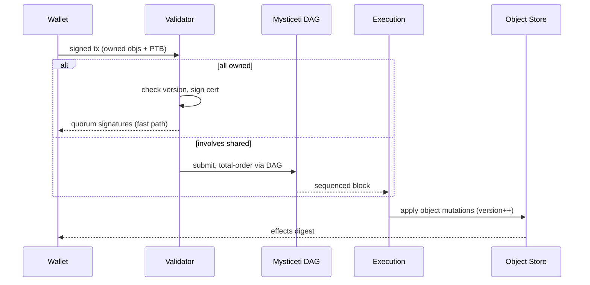

# Sui Move

> **TL;DR**：Sui Move 是 Mysten Labs（Sam Blackshear、Evan Cheng 等原 Diem 核心）对 Move 做的**激进重写**。它**废除了 Move 的全局存储语义**——不再有 `move_to / borrow_global`——而把所有链上状态抽象为带唯一 `UID` 的 **对象（Object）**：每个资源要么被某地址 **owned**、要么是全局 **shared**、要么 **immutable**、要么 **frozen**、要么 wrapped 进其它对象。交易对拥有权清晰的 owned 对象可走 **fast path**（Mysticeti DAG 共识直接定序，无需全局共识），对共享对象走标准 BFT。Dynamic Fields / Dynamic Object Fields 提供灵活的 map-like 扩展。Sui Move 的资源语义严格（`has key` 要求首字段 `id: UID`），编译器 + verifier 强制这一模式。

---

## 1. 背景与动机

Sam Blackshear 发明 Move 后反思：Move 的全局存储虽安全，却把"谁拥有什么"埋进了隐式 `address→T` 映射。这对并行 **极其不友好**——运行时必须先解析类型 + 地址才能知道该 Tx 访问哪块状态。

Sui 给出的核心洞察：

- 大多数链上资产有**明确的所有者**（拥有者的钱包地址或另一个对象）。若把所有权显式化、状态切成粒度细的 "对象"，则 **"对象单 owner 的交易彼此天然无冲突"**——无需共识排序。这就是 **owned object fast path**。
- 共享对象（DEX pool、global registry）仍需 BFT，但只占少数。

这让 Sui 2023 主网上线时就做到 "owned 交易亚秒级 finality + shared 交易秒级 finality"，在钱包支付类场景显著优于 Aptos/Solana/EVM。

代价：开发范式与 Move 原版完全不同——必须把状态切成对象、显式 transfer/share/freeze，工具链和标准库全要重做（`sui-framework`）。

## 2. 核心原理

### 2.1 形式化定义

Sui 链状态 `Σ_s` 定义为 `ObjectID → Object`：

```
Object = (
  id: ObjectID,
  owner: Owner,                // {AddressOwner, ObjectOwner, Shared, Immutable}
  version: SequenceNumber,
  previous_tx: TransactionDigest,
  contents: MoveStructValue,
  storage_rebate: u64,
  type: StructTag,
)
```

**核心不变式**：

- **I1（显式所有权）**：`Owner` 非空；任一读写操作必须符合 owner 规则。
- **I2（版本递增）**：每次修改 `version += 1`，拒绝旧版本重复提交。
- **I3（Move 线性）**：含 `id: UID` 的结构体不能 implicitly drop—— `UID` 无 `drop` 能力；必须调用 `object::delete(id)` 显式销毁。
- **I4（拓扑一致）**：ObjectOwner 关系必须无环（由 runtime 检测）。
- **I5（共识分层）**：owned-only Tx 可走 fast path；涉及 shared 对象的 Tx 必须走全局 Mysticeti 共识。

### 2.2 UID / ID 结构

```move
module sui::object {
    struct UID has store {
        id: ID,
    }
    struct ID has copy, drop, store {
        bytes: address,
    }
    public fun new(ctx: &mut TxContext): UID {
        UID { id: ID { bytes: tx_context::fresh_object_address(ctx) } }
    }
    public fun delete(id: UID) {
        let UID { id: _ } = id;  // destruct
    }
}
```

- `UID` 线性、无 `drop`：防止"忘删对象"。
- `ID` 可 copy/drop，用来在业务逻辑里引用。
- `fresh_object_address(ctx)` 由 `(sender, gas_payment, sequence_number)` 哈希生成，全局唯一。

任何 `has key` 结构体**第一个字段必须是 `id: UID`**。这是 Sui verifier 硬规则（`sui-verifier` crate 中的 `id_leak_verifier` / `struct_with_key_verifier`）。

### 2.3 Owner 状态机

```mermaid
stateDiagram-v2
  [*] --> AddressOwner : transfer::transfer(obj, addr)
  AddressOwner --> AddressOwner : transfer
  AddressOwner --> ObjectOwner : dynamic_field::add / object::transfer to object
  AddressOwner --> Shared : transfer::share_object(obj)
  AddressOwner --> Immutable : transfer::freeze_object(obj)
  Shared --> Shared : via shared ref
  Shared --> Immutable : freeze (受限)
  Immutable --> [*] : 不可 mutate（仅读）
  AddressOwner --> [*] : object::delete
```

- Shared → Shared 不可变（一旦 shared 就无法变回 owned）。
- Immutable 永久只读，生命周期长。
- Wrapped（嵌入父对象）= ObjectOwner，只能通过父对象访问。

### 2.4 子机制拆解

**(1) `transfer::transfer<T>(obj, recipient)`**：owned transfer；无需共识（fast path）。
**(2) `transfer::share_object<T>(obj)`**：发布共享；后续写入需共识。一般只用于 DEX pool、clock 等全局资源。
**(3) `transfer::freeze_object<T>(obj)`**：冻结为只读；典型用于合约 publish 的元数据。
**(4) `object::delete(id: UID)`**：销毁对象，返还 storage rebate。
**(5) Dynamic Fields**：`dynamic_field::add(&mut obj.id, key, val)`——像哈希表一样挂字段到 UID，不影响对象本身类型签名。`Dynamic Object Field`：挂的 value 本身是一个 object（有独立 ID）。这是 Sui 处理"百万级 NFT" 等大 collection 的主要模式。
**(6) Package & Upgrade**：`sui client publish` 部署 package；`UpgradeCap` 对象控制后续升级（`compatible | additive | dep_only | immutable`）。
**(7) Clock & Random**：`0x6::clock::Clock` 是系统共享对象，提供毫秒时间戳；`0x8::random::Random` 提供 VRF（合约里使用前必须消耗 `&Random`）。
**(8) PTB（Programmable Transaction Blocks）**：一笔 Tx 可以串联多个 Move 调用 + `SplitCoins / MergeCoins / TransferObjects` 内建命令，中间值通过 PTB 栈传递。

### 2.5 参数与常量

| 参数 | 值 | 说明 |
| --- | --- | --- |
| 出块 | Mysticeti 亚秒（owned） / 2-3s（shared finality） | 2024+ |
| Object 最大 size | 256 KB | `MAX_MOVE_OBJECT_SIZE` |
| Package 最大 size | 100 KB | `max_package_size` |
| 每 PTB 最大 commands | 1024 | `max_programmable_tx_commands` |
| Gas unit price | ≥ 1000 MIST | 1 SUI = 10^9 MIST |
| Storage rebate ratio | 99% | 删除对象返还比例 |
| Object 最大 dynamic fields | 无硬限（按 gas） | |
| Max type depth | 128 | 避免爆炸 |

### 2.6 边界条件

- **忘记 transfer/share**：若函数创建 `UID` 对象但未 transfer/share/freeze/delete/return → verifier 报 "id leak"（对象无处可去）。
- **Shared 对象并发写**：Mysticeti 会定序，但若热点共享对象 → 吞吐退化。
- **Wrap cycle**：尝试把对象 A 塞入 B，再把 B 塞入 A → runtime 报错。
- **Upgrade 不兼容**：`compatible` 模式下删字段、改类型 → 拒绝。
- **Random 重试攻击**：Sui 要求消费 random 的 entry function 不能 abort 回退到安全状态——Move Prover 辅助验证。

### 2.7 Mermaid：Sui Tx 数据流



### 2.8 ASCII 对象图

```
Address 0xA1
  owns ->  Coin<SUI>#O1
  owns ->  Kiosk#O2  (holds items ObjectOwned)
              owns ->  NFT#O3
              owns ->  NFT#O4 (has dynamic_field "upgrade"-> Object#O9)
Shared
  - Clock#0x6
  - Random#0x8
  - DEX::Pool<SUI,USDC>#O5
Immutable
  - Package#O6 (my_dapp v1)
```

## 3. 架构剖析

### 3.1 分层视图

1. **Move Core**（`crates/sui-move-natives`, `external-crates/move`）：修改版编译器，支持 Sui 方言。
2. **Sui Framework（`0x2`）**：`object / tx_context / transfer / event / coin / balance / clock / random / table / bag / kiosk / token` 等。
3. **Move Adapter（`sui-adapter`）**：PTB 解析、对象加载、验证、后处理。
4. **Execution 引擎（`sui-execution`）**：并发执行 + effects 构造。
5. **Consensus（Mysticeti）**：并发 DAG 总序（`consensus`、`narwhal` 历史）。
6. **Storage（`sui-storage`）**：RocksDB + versioned object store + Merkle state root。

### 3.2 模块表

| 模块 | 路径 | 职责 | 依赖 | 可替换性 |
| --- | --- | --- | --- | --- |
| sui-framework | `crates/sui-framework/packages/sui-framework` | 标准库 | move-stdlib | 低 |
| sui-system | `crates/sui-framework/packages/sui-system` | 验证者集合、质押 | framework | 低 |
| sui-adapter | `crates/sui-adapter/` | PTB + MoveVM 适配 | MoveVM | 低 |
| sui-execution | `crates/sui-execution/` | 执行层面向 consensus | adapter | 低 |
| mysticeti | `consensus/core` | DAG 共识 | network | 低 |
| sui-storage | `crates/sui-core/src/authority/authority_store.rs` | 对象版本化存储 | rocksdb | 低 |
| sui-indexer | `crates/sui-indexer/` | 外部索引 | pg | 中 |
| sui-cli | `crates/sui/` | 开发者 CLI | — | 中 |
| sui-sdk (TS/Rust) | `sdk/typescript/`, `crates/sui-sdk/` | 客户端 | — | 中 |

### 3.3 数据流：一笔涉 shared + owned 的 Tx

1. 钱包构造 PTB，引用 owned obj ids + shared obj ids + pure args。
2. 对每个 validator 预签（certificate collection）。
3. 涉 shared → validator 把 cert 入 Mysticeti DAG；DAG 达成 order 后放入 `SequencedTx` 流。
4. Execution 层加载对象快照（带 version），进入 Move adapter：解析 PTB commands，逐条 `MoveCall / TransferObjects / SplitCoins / MergeCoins / MakeMoveVec / Publish / Upgrade`。
5. Move VM 执行，产出 effects（新 object、修改、删除、event、gas）。
6. 提交到对象 store，`previous_tx = tx_digest`, `version++`。
7. 返回 `TxEffects` 给客户端；indexer 推送。

### 3.4 客户端多样性

- **sui-node**（Rust，Mysten Labs，主）。
- **Sui Lite Client**（社区，读）—— 原型。
- **Walrus、SuiPlay** 等外围基础设施。
- **SDK**：TypeScript（`@mysten/sui`）、Rust、Python（`pysui`）、Go (`go-sui-sdk`)。

### 3.5 扩展 / 互操作

- **JSON-RPC**：`sui_getObject / sui_executeTransactionBlock / suix_queryEvents / suix_getDynamicFields / suix_getOwnedObjects`。
- **GraphQL**（2024 替代 RPC 大部分读）：schema 直接映射对象模型。
- **Indexer v2**：Postgres + gRPC 流。
- **ZkLogin**：Google/Facebook/Twitch OIDC 登录派生 Sui 地址 + Groth16 proof。
- **Bridges**：Wormhole、LayerZero、Sui Bridge（原生）。
- **Mysten Deepbook**：中心对象型 limit order book；案例库。

## 4. 关键代码 / 实现细节

`sui::object::new`（`crates/sui-framework/packages/sui-framework/sources/object.move`）：

```move
public fun new(ctx: &mut TxContext): UID {
    UID { id: ID { bytes: tx_context::fresh_object_address(ctx) } }
}

public(package) fun delete(id: UID) {
    let UID { id: ID { bytes } } = id;
    delete_impl(bytes);  // native, 从 object store 移除
}
```

`sui::transfer`（`.../sources/transfer.move`）：

```move
public fun transfer<T: key>(obj: T, recipient: address) {
    transfer_impl(obj, recipient);
}
public fun share_object<T: key>(obj: T) {
    share_object_impl(obj);
}
public fun freeze_object<T: key>(obj: T) {
    freeze_object_impl(obj);
}
```

典型 NFT 合约：

```move
module demo::nft {
    use sui::object::{Self, UID};
    use sui::transfer;
    use sui::tx_context::{Self, TxContext};
    use std::string::String;

    struct DemoNFT has key, store {
        id: UID,
        name: String,
        level: u8,
    }

    public fun mint(name: String, ctx: &mut TxContext): DemoNFT {
        DemoNFT { id: object::new(ctx), name, level: 1 }
    }

    public entry fun mint_to(name: String, to: address, ctx: &mut TxContext) {
        let nft = mint(name, ctx);
        transfer::transfer(nft, to);
    }

    public entry fun level_up(nft: &mut DemoNFT) {
        nft.level = nft.level + 1;
    }

    public entry fun burn(nft: DemoNFT) {
        let DemoNFT { id, name: _, level: _ } = nft;
        object::delete(id);
    }
}
```

PTB（TypeScript SDK）：

```ts
import { Transaction } from '@mysten/sui/transactions';
const tx = new Transaction();
const [coin] = tx.splitCoins(tx.gas, [tx.pure.u64(1_000_000)]);
tx.moveCall({ target: `${pkgId}::demo::nft::mint_to`, arguments: [tx.pure.string('Alice'), tx.pure.address(recipient)] });
tx.transferObjects([coin], tx.pure.address(recipient));
await client.signAndExecuteTransaction({ transaction: tx, signer: keypair });
```

## 5. 演进与版本对比

| 时间 | 事件 |
| --- | --- |
| 2022-12 | Sui Devnet |
| 2023-05 | 主网 v1 |
| 2023 | Narwhal/Bullshark → Mysticeti 路线 |
| 2024-02 | Mysticeti 主网上线 |
| 2024-05 | zkLogin 主网 |
| 2024-09 | 原生 Random（0x8） |
| 2024-10 | Sui Bridge |
| 2024-11 | Enum 类型 稳定 |
| 2025 | Walrus 去中心化存储与 Sui 打通；Sui Move 2024 edition |

## 6. 实战示例

```bash
cargo install --git https://github.com/MystenLabs/sui sui --tag mainnet-v1.38.0
sui client new-address ed25519
sui client faucet
sui move new demo
```

```bash
sui move build
sui client publish --gas-budget 200000000
sui client call --package <PKG> --module nft --function mint_to \
  --args "Alice" <RECIPIENT_ADDR> --gas-budget 20000000
```

## 7. 安全与已知攻击

- **Cetus 2025-05**：Sui 最大 DEX Cetus 的 CLMM 数学漏洞，攻击者通过极端 tick range 造成"虚假流动性"从而抽走约 2.2 亿美元。非 Sui 语言/共识问题，是合约算术 bug；Sui 基金会协同 validator 冻结部分可疑交易引发中心化讨论。教训：PriceMath 必须严格 bounded + fuzz。
- **Object ownership 绕过**：早期应用将 `public fun transfer<T>(obj: T)` 写为任意可调 → 攻击者可转走他人对象。修复：入口应限定 signer / UpgradeCap / KioskOwnerCap。
- **Dynamic field 数据泄漏**：前端假设 UID 的 dynamic fields 不会被读到，但 indexer 会完整索引。勿把机密放里。
- **Clock / Random 误用**：未通过 Prover 或手工审查的 random 消费可能被 re-execute 选择性 abort（SIP-41 等修复中）。
- **Upgrade compatibility bypass**：若用 `additive` 之外的 policy，可能破坏下游依赖。

## 8. 与同类方案对比

| 维度 | Sui Move | Aptos Move | Solana Anchor | EVM |
| --- | --- | --- | --- | --- |
| 状态模型 | 对象 UID | 全局 `addr→T` + Object | Account | Storage map |
| 并行 | 对象所有权 fast path + Mysticeti | Block-STM | Sealevel | 无 |
| 资源语义 | Move 线性 + UID | Move 线性 | Rust own | 无 |
| 用户体验 | Wallet 理解对象 | 类 Account | 账户预声明 | storage 不可见 |
| 升级 | UpgradeCap + policy | `upgrade_policy` | BPF Loader v3 | proxy |
| 开发门槛 | 需要换思维 | 熟悉 global storage | 账户学习曲线 | 最低 |

## 9. 延伸阅读

- 官方：<https://docs.sui.io/concepts>
- Sui Move book：<https://move-book.com>
- Mysten blog：<https://blog.sui.io>
- sui repo：<https://github.com/MystenLabs/sui>
- Mysticeti 论文：<https://arxiv.org/abs/2310.14821>
- OtterSec / MoveBit 审计报告：Cetus post-mortem
- 登链 Sui 专栏：<https://learnblockchain.cn/tags/Sui>

## 10. 术语表

| 术语 | 英文 | 释义 |
| --- | --- | --- |
| 对象 | Object | Sui 链上状态单元，带 UID |
| 唯一 ID | UID | 不可复制/drop 的对象身份 |
| 所有者 | Owner | {Address, Object, Shared, Immutable} |
| 共享对象 | Shared Object | 可全局读写，须共识 |
| 不可变对象 | Immutable | 冻结后只读 |
| 包装 | Wrap | 对象嵌进别的对象 |
| 动态字段 | Dynamic Field | UID 上挂任意 key-val |
| 动态对象字段 | Dynamic Object Field | 值本身是 object |
| PTB | Programmable Transaction Block | 串联多步 Move 调用的事务 |
| zkLogin | zkLogin | OIDC + ZK 的账户 |
| Mysticeti | Mysticeti | Sui 最新 DAG 共识协议 |

---

*Last verified: 2026-04-22*
