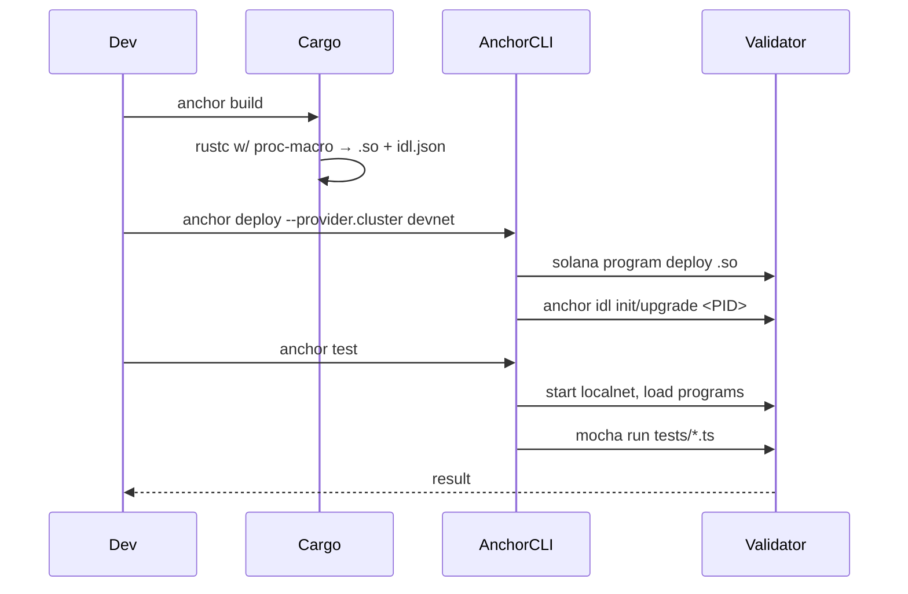

# Anchor 框架

> **TL;DR**：Anchor 是 Armani Ferrante 2021 年发起、目前由 coral-xyz 维护的 **Solana 智能合约 Rust DSL + 开发工具链**，扮演类似 Hardhat/Foundry 对 EVM 的角色。核心由四部分组成：① 过程宏 `#[program] / #[derive(Accounts)] / #[account]`，把 Rust 结构体翻译成 AccountInfo 反序列化 + 安全检查 + IDL 提取；② **IDL**（Interface Description Language，JSON），前后端通过它实现强类型调用；③ **Anchor CLI** 提供 `build / deploy / test / idl` 管线；④ **TypeScript 客户端 SDK** 自动从 IDL 生成类型化 `program.methods.foo(...).accounts({...}).rpc()` 调用。2024 年发布 Anchor 0.30 支持 Solana 2.x、Token-2022、新版 `solana-program`。缺点：宏增加编译复杂度；部分高端用户倾向 native Rust（`solana-program` / `pinocchio`）以获更细控制。

---

## 1. 背景与动机

2020–2021 年 Solana 原生开发体验：

- 手写 `fn process_instruction(program_id, accounts, ix_data)`；手动 `Pubkey::find_program_address`、手动 `AccountInfo.try_borrow_mut_data()`、手动 `borsh::deserialize`；忘记任何一个安全检查都是 rug pull。
- 客户端要手动把 instruction 号 + borsh layout 写在 TS 里，前后端 borsh schema 分裂是最大痛点。
- 无 IDL、无类型化 RPC、无统一测试框架。

Anchor 的三大目标：**安全默认（secure defaults）、样板消除（kill the boilerplate）、前后端类型同构（IDL-based typing）**。类比 EVM 世界：

- `#[program]` ≈ Solidity `contract` 声明。
- `#[derive(Accounts)]` ≈ EVM 中"函数参数 + modifiers"。
- IDL ≈ Solidity ABI。
- `anchor test` ≈ `hardhat test` / `forge test`。

## 2. 核心原理

### 2.1 形式化定义

Anchor 的语义可用一个编译函数刻画：

```
Anchor : (ProgramRust, AccountsRust, StateRust) → (BPFProgram, IDL, TSClient)
```

其中：

- `ProgramRust` 是 `#[program] mod m { pub fn f(ctx: Context<F>, args) -> Result<()> {...} }` 形式的 Rust 源码。
- `AccountsRust` 是 `#[derive(Accounts)]` 生成的结构体，声明"本指令需要哪些账户、每个账户的约束（owner/signer/mut/init/seeds/has_one）"。
- `StateRust` 是 `#[account]` 标注的结构体，其 on-chain layout 由 borsh 序列化 + 8 字节 Discriminator 前缀定义。

编译后：

- **不变式 A1（Discriminator）**：每个 `#[account]` 类型首 8 字节是 `sha256("account:<Name>")[..8]`；反序列化时若不符 → `AccountDidNotDeserialize`。
- **不变式 A2（自动 owner 检查）**：`Account<'info, T>` 在 constructor 自动验证 `owner == crate::ID`。
- **不变式 A3（约束先行）**：所有 `#[account(...)]` 约束在 handler 主体执行前校验。失败则立刻 revert，不进入用户代码。
- **不变式 A4（签名传递）**：CPI 通过 `CpiContext::new_with_signer(program, accts, signer_seeds)` 由宏展开为 `invoke_signed`。

### 2.2 关键宏与数据结构

**(1) `#[program]`**：把 `mod` 内每个 `pub fn` 转译为入口分发：

```rust
pub fn entry(program_id: &Pubkey, accounts: &[AccountInfo], ix_data: &[u8]) -> Result<()> {
    let (sighash, data) = ix_data.split_at(8);   // 前 8 字节 = sighash("global:<fn_name>")
    match sighash {
        b if b == INCREMENT_SIGHASH => __private::__global::increment(program_id, accounts, data),
        // ... other ixs
        _ => Err(AnchorError::InstructionMissing.into()),
    }
}
```

**(2) `#[derive(Accounts)]`**：为结构体每个字段生成 `try_accounts` 反序列化 + 约束检查：

```rust
#[derive(Accounts)]
pub struct Increment<'info> {
    #[account(mut, seeds=[b"counter", user.key().as_ref()], bump)]
    pub counter: Account<'info, Counter>,
    pub user: Signer<'info>,
    pub system_program: Program<'info, System>,
}
```

展开后 `try_accounts` 伪代码：

```rust
let counter_info = next_account_info(&mut iter)?;
let user_info = next_account_info(&mut iter)?;
let system_info = next_account_info(&mut iter)?;

let user = Signer::try_from(user_info)?;               // 自动检查 is_signer
let bump = Pubkey::find_program_address(&[b"counter", user.key.as_ref()], program_id).1;
require_keys_eq!(*counter_info.key, Pubkey::create_program_address(&[b"counter", user.key.as_ref(), &[bump]], program_id)?);
let counter = Account::<Counter>::try_from(counter_info)?; // 校验 owner == program_id && discriminator
require!(counter_info.is_writable, ConstraintMut);
```

**(3) `#[account]`**：让类型实现 `AccountSerialize / AccountDeserialize` + discriminator。

**(4) 约束集**：`mut / signer / init / init_if_needed / seeds / bump / has_one / constraint / close / payer / space / owner / token::mint / associated_token / rent_exempt / realloc`。

**(5) 错误体系**：`#[error_code]` + `ErrorCode` 枚举生成 `AnchorError::Custom(code)`。

### 2.3 子机制拆解

**(a) IDL 生成**：`anchor build` 时宏解析器额外输出 `target/idl/<name>.json`，字段包含 `instructions / accounts / events / types / errors / address`。2024 起 Anchor 0.30 的 IDL v1.0 自带 address、discriminator、新版 Anchor-TS v2 基于它做 codec。

**(b) Seeds & Bump**：`seeds = [...]` 声明 PDA 派生种子；`bump` 可让 runtime 自动查表（或显式 `bump = account.bump`，建议）。Anchor 强制使用 canonical bump 防攻击。

**(c) CPI 助手**：`cpi::*` 模块自动生成 Cross-Program Invocation wrapper：

```rust
use anchor_spl::token::{self, Transfer};
token::transfer(CpiContext::new(
    ctx.accounts.token_program.to_account_info(),
    Transfer { from: ctx.accounts.from.to_account_info(),
               to:   ctx.accounts.to.to_account_info(),
               authority: ctx.accounts.authority.to_account_info() },
), amount)?;
```

**(d) Event**：`emit!(MyEvent{..})` 写入交易 log，客户端订阅 `onLogs`。

**(e) Test Framework**：`anchor test` 调起 `solana-test-validator`，加载本地 programs，运行 `tests/*.ts` mocha。

### 2.4 参数与常量

| 参数 | 值 | 说明 |
| --- | --- | --- |
| Discriminator 长度 | 8 B | `sha256("account:<Name>")` 前缀 |
| Instruction sighash | 8 B | `sha256("global:<fn_name>")` 前缀 |
| Event discriminator | 8 B | `sha256("event:<Name>")` |
| 默认 `space` 字段 | 宏计算 | Anchor v0.30 自动推断 |
| IDL 版本 | 0.1.0 (legacy) / 1.0.0 (0.30+) | JSON schema |
| CLI 版本 | 0.30.x | Solana 2.x 兼容 |
| init 默认 payer | 显式声明 | 省略报错 |

### 2.5 边界条件与失败模式

- **Discriminator collide**：两个账户类型同名 → 宏展开相同 sighash 冲突，Anchor 要求模块内类型名唯一。
- **init_if_needed 风险**：允许 idempotent 创建但容易被"re-init 攻击"（在账户已有价值时重置）；Anchor 默认 off，开启需 `--features init-if-needed`。
- **Realloc 失败**：若新 `space` 超过 10 MB 或增长 > 10 KB/次 → `AccountSpaceTooLarge`。
- **Canonical bump 不一致**：客户端若传非 canonical bump 但服务端 `find_program_address`，最终 create 指令会失败。
- **IDL 漂移**：部署后代码升级未重新上传 IDL → 前端序列化错误。

### 2.6 Mermaid 数据流

```mermaid
flowchart LR
  Src[Rust 源码<br/>#[program] #[derive(Accounts)] #[account]]
  Src --> Build[anchor build]
  Build --> BPF[target/deploy/*.so]
  Build --> IDL[target/idl/*.json]
  IDL --> Upload[anchor idl init/upgrade]
  Upload --> Chain[(链上 IDL Account)]
  IDL --> TSGen[@coral-xyz/anchor<br/>Program.at(idl, programId)]
  TSGen --> App[前端/测试]
  App -- RPC --> Validator
  BPF --> Validator[(Solana Validator)]
```

### 2.7 ASCII 模块图

```
  +---------------------- Anchor Stack -----------------------+
  |  #[program] macros   |   #[derive(Accounts)] constraints  |
  |-----------------------------------------------------------|
  |  IDL emitter (proc-macro) -> target/idl/*.json            |
  |-----------------------------------------------------------|
  |  anchor-lang crate (Context, Account, Signer, Program...) |
  |-----------------------------------------------------------|
  |  solana-program (AccountInfo, Pubkey, Sysvar, CPI)        |
  |-----------------------------------------------------------|
  |  sBPF target (bpfel-unknown-unknown)                      |
  +-----------------------------------------------------------+
       |                                     |
  anchor CLI (cargo wrapper +              @coral-xyz/anchor (TS)
  deploy/test/idl/migrate)                  program.methods.*.rpc()
```

## 3. 架构剖析

### 3.1 分层视图

1. **Macro 层**（`lang/syn/`, `lang/attribute/`, `lang/derive/`）：`syn`/`quote` 解析源码并生成代码。
2. **Runtime crate `anchor-lang`**：`Context`、`Account<'info, T>`、`Signer`、`Program`、`AccountLoader`、错误包装。
3. **SPL 封装 `anchor-spl`**：Token Program、ATA、Metadata 的 Anchor-friendly 包装。
4. **CLI（`cli/`）**：Cargo workspace 管理、`build/deploy/test/idl` 子命令、`Anchor.toml` 配置、localnet orchestration。
5. **TS 客户端（`ts/packages/anchor/`）**：`Program`、`BorshCoder`、`AccountsCoder`、`EventParser`、`Wallet`、`Provider`。

### 3.2 模块表

| 模块 | 路径 | 职责 | 依赖 | 可替换性 |
| --- | --- | --- | --- | --- |
| anchor-attribute-program | `lang/attribute/program/` | `#[program]` 宏 | syn, quote | 低 |
| anchor-derive-accounts | `lang/derive/accounts/` | `#[derive(Accounts)]` | — | 低 |
| anchor-attribute-account | `lang/attribute/account/` | `#[account]` | — | 低 |
| anchor-syn | `lang/syn/` | IDL 抽取 + 代码生成 | — | 低 |
| anchor-lang | `lang/src/` | 运行时类型 | solana-program | 低 |
| anchor-spl | `spl/src/` | Token/ATA 包装 | spl-token | 中 |
| anchor CLI | `cli/` | build/deploy/test | solana-cli | 中（可用 nx/hardhat 替） |
| @coral-xyz/anchor (TS) | `ts/packages/anchor/` | IDL → typed client | @solana/web3.js | 中 |
| @coral-xyz/anchor-cli-ts | `ts/packages/anchor-cli/` | node 脚本桥 | — | 中 |

### 3.3 构建 / 部署生命周期



### 3.4 客户端多样性

- **`@coral-xyz/anchor`**（TS）：主力。
- **`anchorpy`**（Python，第三方）：Kamino、Drift 生态广泛使用。
- **`anchor-client`**（Rust）：服务端索引 / 交易 bot。
- **`anchor-gen`**（codegen）：把 IDL 编成 Solidity-like 风格静态类型文件。

### 3.5 扩展接口

- **IDL Account on-chain**：部署时可选把 IDL 压缩后写入 `<program>-idl.bin` 账户，供 `anchor idl fetch` 下载。
- **Custom coder**：通过 `BorshCoder` 或自定义 `InstructionCoder` 支持非 borsh layout（少数情形）。
- **Events v2**：Anchor 0.29+ 支持通过 CPI `event_cpi` 发射，供索引器解析。
- **Generator**：`anchor-gen` 可从 IDL 生成 Rust/TS 文件用于非 Anchor 客户端消费。

## 4. 关键代码 / 实现细节

`lang/src/context.rs`（v0.30，简化）：

```rust
pub struct Context<'a, 'b, 'c, 'info, T> {
    pub program_id: &'a Pubkey,
    pub accounts: &'b mut T,
    pub remaining_accounts: &'c [AccountInfo<'info>],
    pub bumps: BTreeMap<String, u8>,
}
```

`#[derive(Accounts)]` 宏片段（`lang/derive/accounts/src/lib.rs:100-180` 近似，展开后）：

```rust
impl<'info> anchor_lang::Accounts<'info> for Increment<'info> {
    fn try_accounts(
        program_id: &Pubkey,
        accounts: &mut &[AccountInfo<'info>],
        ix_data: &[u8],
        bumps: &mut BTreeMap<String, u8>,
    ) -> Result<Self> {
        let counter: AccountInfo = anchor_lang::Accounts::try_accounts(program_id, accounts, ix_data, bumps)?;
        let user: Signer = anchor_lang::Accounts::try_accounts(program_id, accounts, ix_data, bumps)?;
        // seeds + bump 校验
        let (derived, bump) = Pubkey::find_program_address(
            &[b"counter", user.key.as_ref()], program_id);
        if counter.key() != derived { return err!(ConstraintSeeds); }
        bumps.insert("counter".to_owned(), bump);
        // owner + discriminator
        let counter = Account::<Counter>::try_from(&counter)?;
        // mut
        if !counter.to_account_info().is_writable { return err!(ConstraintMut); }
        Ok(Self { counter, user, system_program: Program::try_from(...)? })
    }
}
```

TS 客户端（`ts/packages/anchor/src/program/index.ts`）核心：

```ts
const program = new Program<Counter>(idl, provider);
await program.methods
  .increment()
  .accounts({ counter: counterPda, user: wallet.publicKey, systemProgram: SystemProgram.programId })
  .signers([wallet.payer])
  .rpc();
```

## 5. 演进与版本对比

| 版本 | 时间 | 关键变化 |
| --- | --- | --- |
| 0.20 | 2022-03 | `#[account(zero_copy)]` 大账户 |
| 0.24 | 2022-07 | Accounts 结构体重构，IDL 类型完善 |
| 0.26 | 2022-11 | `init_if_needed` feature-gate |
| 0.27 | 2023-02 | SPL Token-2022 初步支持 |
| 0.28 | 2023-07 | 改进宏错误信息、solana 1.16 兼容 |
| 0.29 | 2024-01 | Event CPI、新 IDL 提案 |
| 0.30 | 2024-09 | IDL v1.0、Solana 2.x、stdx |
| 0.31 | 2025 | `Pinocchio`-compatible entry、进一步瘦身宏 |

## 6. 实战示例

```bash
cargo install --git https://github.com/coral-xyz/anchor --tag v0.30.1 anchor-cli
anchor init counter
cd counter
```

`programs/counter/src/lib.rs`：

```rust
use anchor_lang::prelude::*;

declare_id!("CounterExampleProgramIDxxxxxxxxxxxxxxxxxxxxxx");

#[program]
pub mod counter {
    use super::*;
    pub fn initialize(ctx: Context<Init>) -> Result<()> {
        ctx.accounts.counter.count = 0;
        ctx.accounts.counter.bump = ctx.bumps.counter;
        Ok(())
    }
    pub fn increment(ctx: Context<Inc>) -> Result<()> {
        ctx.accounts.counter.count = ctx.accounts.counter.count.checked_add(1).unwrap();
        Ok(())
    }
}

#[derive(Accounts)]
pub struct Init<'info> {
    #[account(init, payer=user, space=8+8+1, seeds=[b"counter", user.key().as_ref()], bump)]
    pub counter: Account<'info, Counter>,
    #[account(mut)] pub user: Signer<'info>,
    pub system_program: Program<'info, System>,
}

#[derive(Accounts)]
pub struct Inc<'info> {
    #[account(mut, seeds=[b"counter", user.key().as_ref()], bump=counter.bump)]
    pub counter: Account<'info, Counter>,
    pub user: Signer<'info>,
}

#[account]
pub struct Counter { pub count: u64, pub bump: u8 }
```

```bash
anchor build
anchor test               # 启动 localnet + mocha
```

## 7. 安全与已知攻击

- **`init_if_needed` reinit**：若账户已有资产仍被允许重置（见 2022 年 Cashio 漏洞相关教训）。默认关闭；用时必须加 `has_one` 或 ownership check。
- **非 canonical bump**：早期 Anchor 允许 `seeds = [..., bumpSeed]` 而不校验是否 canonical；攻击者可用 bump=254 等派生影子账户（Neodyme 2022 报告）。0.25+ 要求 canonical。
- **`AccountInfo` 裸用绕过约束**：若字段类型是 `UncheckedAccount<'info>`，Anchor 不做任何校验——必须手动 `require_keys_eq!`。
- **IDL 不同步**：部署后 program 升级未上传新 IDL → 客户端调用旧 instruction discriminator 错误成功进入未知分支（Anchor discriminator 碰撞几率极低但仍需测试）。
- **Signer 结构体冒用**：把 `Signer<'info>` 写成 `AccountInfo<'info>` 会绕过签名检查。审计必查。
- **CPI 权限**：调用第三方 program 前务必校验 `program.key() == expected`。

## 8. 与同类方案对比

| 维度 | Anchor | native `solana-program` | Pinocchio | Seahorse (Py) | Solang (Sol) |
| --- | --- | --- | --- | --- | --- |
| 抽象度 | 高（宏+DSL） | 零 | 零（但更小） | 最高（Python） | 中（Solidity→sBPF） |
| 编译速度 | 慢（proc-macro） | 快 | 快 | 中 | 中 |
| 字节码体积 | 偏大 | 最小 | 最小 | 大 | 中 |
| 生态 | 最大 | 核心开发者 | 新兴 | 小众 | 小众 |
| IDL | 自动 | 无 | 无 | 生成 | 有（类 ABI） |

## 9. 延伸阅读

- 官方文档：<https://www.anchor-lang.com/docs>
- GitHub：<https://github.com/coral-xyz/anchor>
- "The Book"（社区）：<https://book.anchor-lang.com/>
- Neodyme 安全系列：<https://neodyme.io/blog>
- Helius Anchor tutorial：<https://www.helius.dev/blog/anchor-tutorial>
- 登链社区 Anchor 专栏：<https://learnblockchain.cn/tags/Anchor>
- Sealevel Attacks（教学 repo）：<https://github.com/coral-xyz/sealevel-attacks>

## 10. 术语表

| 术语 | 英文 | 释义 |
| --- | --- | --- |
| 账户约束 | Account Constraints | `#[account(...)]` 属性声明的 runtime 校验 |
| 辨识前缀 | Discriminator | 账户/指令前 8 字节哈希 |
| 接口描述 | IDL | JSON 描述 program 接口 |
| 零拷贝 | Zero-Copy | `#[account(zero_copy)]` 直接读 mmap 数据 |
| 跨程序调用 | CPI | Cross-Program Invocation |
| 种子派生 | PDA Seeds | 派生 PDA 的参数 |
| Canonical Bump | Canonical Bump | `find_program_address` 返回的第一个合法 bump |
| 事件 | Event | `emit!` 发射的可解析 log |

---

*Last verified: 2026-04-22*
