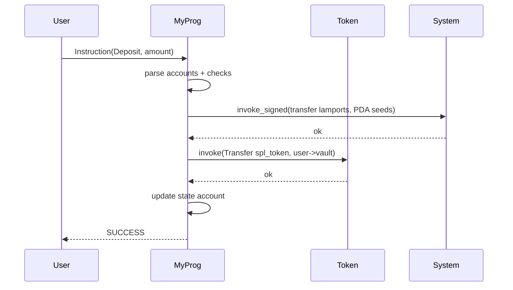
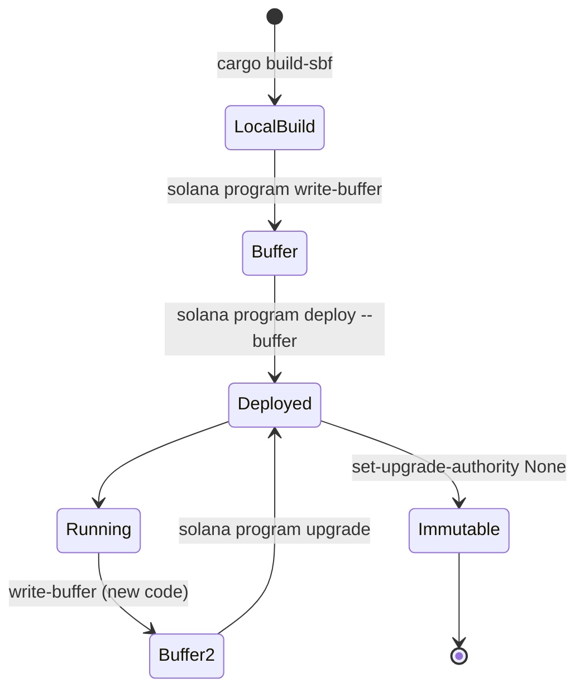

# Solana Program 开发

> **TL;DR**：不依赖 Anchor，也可以用 `solana-program` crate 直接写原生 Rust 程序（Native Program），得到更小字节码、更快编译、更透明的控制流——代价是必须亲手做所有安全检查。本文聚焦 **原生开发范式**：`process_instruction` 入口 + borsh/bytemuck 反序列化 + 显式 owner/signer/pda 检查 + CPI（`invoke` / `invoke_signed`）；详解 **SPL Token Program**（最常集成）与 **Token-2022** 扩展（transfer hook、confidential transfer、metadata pointer 等）的差异；介绍 **BPF Loader v3/v4** 的部署/升级/authority 设计、`solana-verify` 可复现构建、Pinocchio 零依赖 entrypoint 方案。

---

## 1. 背景与动机

Anchor 大幅降低了 Solana 合约门槛，但在以下场景原生开发仍不可替代：

- **极致字节码体积**：Drift、Kamino、Jupiter 等高频合约每字节都是 CU，Pinocchio + native 可把某些 program 砍到 Anchor 版 1/3。
- **细粒度 CU 控制**：自定义反序列化、避开宏展开的"多余 borsh 解析"能省成千 CU。
- **异常 layout**：比如直接读取第三方 program 账户（非 Anchor discriminator）。
- **教学理解**：理解 runtime 本身的约定（SBF ABI、Instruction 格式），Anchor 只是上层语法糖。

本篇面向"已理解 Solana 账户模型 + 交易格式 + Sealevel 运行时"的开发者。

## 2. 核心原理

### 2.1 Program 入口 ABI

Solana runtime 调用 BPF program 的 ABI：

```rust
#[no_mangle]
pub extern "C" fn entrypoint(input: *mut u8) -> u64 {
    // input 指向一段序列化的 (program_id, accounts, instruction_data)
    // solana-program 提供 deserialize 辅助
    unsafe {
        let (program_id, accounts, instruction_data) =
            solana_program::entrypoint::deserialize(input);
        match process_instruction(&program_id, &accounts, instruction_data) {
            Ok(()) => SUCCESS,
            Err(e) => e.into(),
        }
    }
}
```

`SUCCESS = 0`；非零返回码被 runtime 解析为 `InstructionError`。

`solana-program` 宏 `entrypoint!(process_instruction)` 自动生成 entrypoint；也可以用 Pinocchio（无 Rust stdlib 依赖）进一步瘦身：

```rust
pinocchio::entrypoint!(process_instruction);
pub fn process_instruction(
    program_id: &Pubkey,
    accounts: &[AccountInfo],
    data: &[u8],
) -> Result<(), ProgramError> { /* ... */ }
```

### 2.2 指令调度格式

Solana 本身不规定指令格式——完全由 program 自己解析 `instruction_data`。常见做法：

- **Borsh variant**：`Instruction::try_from_slice(data)` → enum 派发。这是 Solana 官方 SPL 家族的规范。
- **1-byte tag**：`data[0]` 为 opcode，后续按手写布局解析（最紧凑）。
- **8-byte sighash**（Anchor 风格）：`sha256("global:<fn>")[..8]` 作前缀。兼容 Anchor 客户端。
- **zero-copy**：`bytemuck::from_bytes::<MyArgs>(data)` 直接映射为结构体（要求 `#[repr(C)] + Pod + Zeroable`）。

### 2.3 子机制拆解

**(1) 账户解析与校验（开发者全责）**：

每条指令都需做：

1. `accounts.len()` 是否够 → `NotEnoughAccountKeys`。
2. `account.owner == expected_program_id` → 防伪账户。
3. `account.is_signer` → 防未授权。
4. `account.is_writable` → 防误写。
5. PDA 合法：`Pubkey::create_program_address(seeds, program_id) == *account.key`。
6. 反序列化 data（borsh / bytemuck）。

Anchor 把这些封装成 `#[derive(Accounts)]`，native 开发必须手写。

**(2) Cross-Program Invocation (CPI)**：

```rust
use solana_program::program::{invoke, invoke_signed};
invoke(
    &system_instruction::transfer(&from.key, &to.key, lamports),
    &[from.clone(), to.clone(), system_prog.clone()],
)?;

invoke_signed(
    &spl_token::instruction::transfer(&token_prog.key, &src.key, &dst.key, &pda.key, &[], amount)?,
    &[src.clone(), dst.clone(), pda.clone(), token_prog.clone()],
    &[&[b"vault", user.key.as_ref(), &[bump]]],   // signer_seeds → 为 PDA 代签
)?;
```

`invoke` 不带 signer seeds（仅透传调用方签名）；`invoke_signed` 允许 PDA 作 signer。

**(3) Compute Budget**：程序内可 `msg!` 输出当前 CU；用 `sol_log_compute_units()` 精细 profiling。超预算 runtime 抛 `ProgramFailedToComplete`。

**(4) BPF Loader v3（Upgradeable）**：

- 程序由两个账户组成：**ProgramAccount**（固定，仅存指针）和 **ProgramDataAccount**（持真正字节码 + upgrade_authority）。
- `solana program deploy --upgrade-authority <kp>` 部署。
- `solana program upgrade <PID> --buffer <BUF>` 替换字节码，不改 Program ID。
- `solana program set-upgrade-authority <PID> --new-upgrade-authority <PUB>` 转 authority；传 `None` 即**永久不可升级**（immutable）。

**(5) BPF Loader v4**（2024+，feature-gated）：简化升级流程；支持 `Deploy/Retract/Finalize` 状态机；IDL 账户与 program data 合并。

**(6) SPL Token Program**：

- 所有同质化 / NFT 标准的底层。单一 program_id `TokenkegQfeZyiNwAJbNbGKPFXCWuBvf9Ss623VQ5DA`。
- 三类账户：`Mint`（代币类型，含 decimals、supply、mint_authority、freeze_authority）、`Account`（holder 余额），`Multisig`。
- 指令：`InitializeMint / InitializeAccount / MintTo / Transfer / Burn / Approve / CloseAccount / FreezeAccount / SetAuthority`。
- **Associated Token Account (ATA)**：约定 PDA `find_program_address([owner, tokenProgram, mint], ATA_PROGRAM)`；客户端与合约都按此派生。

**(7) Token-2022**（program_id `TokenzQdBNbLqP5VEhdkAS6EPFLC1PHnBqCXEpPxuEb`）：

同 layout 兼容 + extension TLV：`TransferFee`、`InterestBearing`、`NonTransferable`、`ConfidentialTransfer`、`DefaultAccountState`、`TransferHook`（调用自定义 program）、`MetadataPointer` / 内嵌 Metadata、`GroupPointer`、`MemberPointer`、`ScaledUiAmount`（2025）等。

### 2.4 参数与常量

| 参数 | 值 | 说明 |
| --- | --- | --- |
| Entrypoint 返回值 | u64 | 0 success, 否则 ProgramError |
| invoke 最大深度 | 4 | MAX_INVOKE_STACK_HEIGHT |
| 指令 accounts 上限 | 128（legacy msg 35） | runtime 硬限 |
| ProgramData overhead | 45 B | metadata header |
| Buffer account lifetime | 创建后需在 `solana program deploy --buffer` 完成或清理 | |
| Upgrade authority | Option<Pubkey> | `None` = 永久 immutable |
| 新 Pinocchio entry | 无 std | ~30% 更小字节码 |
| Token Mint account 长度 | 82 B | SPL Token |
| Token Account 长度 | 165 B | SPL Token |

### 2.5 边界条件与失败模式

- **签名伪造**：未检查 `is_signer` → 他人冒权。必须显式 `require!`。
- **重入退化**：CPI 嵌套 > 4 → `CallDepthExceeded`。
- **Arithmetic overflow**：Rust 的 `+` 在 release 默认 wrapping，实际风险巨大（Sollet 等事件）。必须 `checked_add / checked_mul`，或开启 `overflow-checks = true`（代价：~10-30% CU）。
- **未对 data len 校验**：`try_from_slice` 可能 panic → runtime trap → Tx revert（不泄露资金但用户体验差）。
- **升级权限丢失**：若 upgrade_authority 设为未知 pubkey 或被盗，合约可被替换。大资产程序应 transfer 给多签或 set None。
- **可复现构建失败**：若本地与 CI Rust 版本差异 → 部署字节码与 `solana-verify` 校验不符。

### 2.6 Mermaid 调用链



### 2.7 ASCII 程序部署状态图

```
BPF Loader v3:
  [Program Account]  ---points to--->  [ProgramData Account]
   executable=true                       data = [slot|authority|bytecode]
   owner = BPFLoader v3                  owner = BPFLoader v3

  Deploy:   CreateBuffer -> Write -> DeployWithMaxLen -> ProgramData pinned
  Upgrade:  CreateBuffer -> Write -> Upgrade (swap bytecode, keep Program pubkey)
  Immutable: SetAuthority(None)
```

## 3. 架构剖析

### 3.1 分层视图

1. **用户 Program 层**：业务 Rust 代码 + `solana-program` API。
2. **`solana-program` crate**：账户句柄、Pubkey、sysvar、系统指令构造器、CPI helpers。
3. **BPF Loader 层**：负责部署/升级、调用前的 Executable 加载。
4. **runtime / rbpf 层**：见 Sealevel 文。
5. **SPL 生态 program**：Token、ATA、Metaplex、Token-2022，通过 CPI 集成。

### 3.2 模块表

| 模块 | 路径 | 职责 | 依赖 | 可替换性 |
| --- | --- | --- | --- | --- |
| solana-program | `sdk/program/` | 程序侧标准库 | — | 低 |
| solana-sdk | `sdk/` | 客户端/程序共用类型 | — | 低 |
| bpf_loader | `programs/bpf_loader/` | 部署/升级 native | — | 低 |
| spl-token / spl-token-2022 | `solana-program/token*` repo | 代币标准 | solana-program | 低 |
| spl-associated-token-account | `spl-associated-token-account` crate | ATA 派生 | — | 低 |
| Pinocchio | `anza-xyz/pinocchio` | 零依赖 entrypoint | — | 中 |
| solana-verify | `otter-sec/solana-verifiable-build` | 可复现字节码比对 | docker | 中 |
| solana-test-framework / litesvm | `liteSVM` crate | 单元测试（非 validator） | — | 高 |

### 3.3 部署 / 升级生命周期



### 3.4 客户端多样性 / 参考实现

- **Agave CLI `cargo build-sbf`**：标准编译链（LLVM sbf target）。
- **Solana-CLI `solana program ...`**：部署、authority、close、dump。
- **Pinocchio**：替代 `solana-program::entrypoint!`，零 heap alloc、最小栈帧。
- **`litesvm`**：Rust in-process Solana VM，用于单元测试，不依赖本地 validator。

### 3.5 扩展 / 互操作接口

- **SPL Token interface**：`Transfer / TransferChecked / TransferCheckedWithFee` 等；Token-2022 hooks 可触发自定义逻辑。
- **Metaplex Token Metadata**：NFT metadata 标准。
- **IDL**：非 Anchor 程序可手写 Codama / Kinobi schema 再生成 TS/Rust 客户端。
- **Event log**：`msg!("Program data: <base64>")` 约定前缀，索引器解析。
- **Geyser**：账户/log 流 → 下游索引。

## 4. 关键代码 / 实现细节

SPL Token 核心（`solana-program/token/program/src/processor.rs`，简化）：

```rust
pub fn process(program_id: &Pubkey, accounts: &[AccountInfo], input: &[u8]) -> ProgramResult {
    let instruction = TokenInstruction::unpack(input)?;
    match instruction {
        TokenInstruction::InitializeMint { decimals, mint_authority, freeze_authority } => {
            Self::process_initialize_mint(accounts, decimals, mint_authority, freeze_authority)
        }
        TokenInstruction::Transfer { amount } => {
            Self::process_transfer(program_id, accounts, amount, None)
        }
        TokenInstruction::TransferChecked { amount, decimals } => {
            Self::process_transfer(program_id, accounts, amount, Some(decimals))
        }
        // ...
    }
}
```

CPI 典型封装：

```rust
pub fn vault_withdraw<'info>(
    ctx: Context<'info>,
    amount: u64,
) -> ProgramResult {
    let vault_seeds: &[&[u8]] = &[b"vault", ctx.user.key.as_ref(), &[ctx.vault_bump]];
    let ix = spl_token::instruction::transfer(
        &spl_token::ID,
        ctx.vault_ata.key,
        ctx.user_ata.key,
        ctx.vault_pda.key,
        &[],
        amount,
    )?;
    solana_program::program::invoke_signed(
        &ix,
        &[ctx.vault_ata.clone(), ctx.user_ata.clone(),
          ctx.vault_pda.clone(), ctx.token_program.clone()],
        &[vault_seeds],
    )
}
```

BPF loader v3 升级（`programs/bpf_loader/src/lib.rs`，v2.1 附近）：

```rust
LoaderInstruction::Upgrade => {
    let [programdata, program, buffer, spill, rent, clock, authority] = accounts else { return Err(...) };
    assert_eq!(authority.is_signer, true);
    let pd_state: UpgradeableLoaderState = bincode::deserialize(programdata.data.borrow())?;
    assert_eq!(pd_state.upgrade_authority_address, Some(authority.key));
    // copy buffer.data[metadata_size..] into programdata.data[header_size..]
    ...
    // close buffer, transfer rent to spill
}
```

## 5. 演进与版本对比

| 时间 | 事件 |
| --- | --- |
| 2020-03 | 初版 BPF Loader (v1/v2) |
| 2021-09 | BPF Loader v3 Upgradeable |
| 2022-06 | sBPF 指令集扩展 |
| 2022-10 | SPL Token-2022 测试网 |
| 2023-07 | Token-2022 主网激活（SIMD-0078 等） |
| 2024-03 | Pinocchio 发布 |
| 2024-09 | BPF Loader v4 feature gate（部分网络） |
| 2025 | ScaledUiAmount、ConfidentialTransfer 稳定 |

## 6. 实战示例

最小 native program：

```rust
// src/lib.rs
use solana_program::{
    account_info::{next_account_info, AccountInfo},
    entrypoint, entrypoint::ProgramResult,
    msg, program_error::ProgramError, pubkey::Pubkey,
};

entrypoint!(process);

pub fn process(program_id: &Pubkey, accounts: &[AccountInfo], data: &[u8]) -> ProgramResult {
    let iter = &mut accounts.iter();
    let state = next_account_info(iter)?;
    if state.owner != program_id { return Err(ProgramError::IllegalOwner); }
    let mut buf = state.data.borrow_mut();
    let n = u64::from_le_bytes(buf[..8].try_into().unwrap()).wrapping_add(1);
    buf[..8].copy_from_slice(&n.to_le_bytes());
    msg!("count = {}", n);
    Ok(())
}
```

构建 & 部署：

```bash
cargo build-sbf
solana program deploy target/deploy/minimal.so \
  --upgrade-authority ~/.config/solana/id.json
solana program show <PID>
# 放弃升级权限（immutable）
solana program set-upgrade-authority <PID> --final
```

## 7. 安全与已知攻击

- **Wormhole 2022-02**：bridge program 对 `Sysvar::Instructions` 的 `load_current_index` 缺失导致签名伪造，盗走 12 万 ETH。教训：**所有 sysvar 要用运行时 helper 而不是手解**。
- **Cashio 2022-03**：未校验 saber LP mint 的 "printer" 账户 owner → 任何人铸无限代币。教训：owner 检查。
- **Mango Markets 2022-10**：预言机操纵，非合约本身漏洞，但提醒"外部数据源信任"。
- **Nirvana 2022-07**：闪电贷操纵内部 AMM。
- **Solend 2022-11**：治理投票导致清算逻辑被滥用（设计问题）。
- **整数 overflow**：Sollet bug；强制 `checked_*`。
- **升级权限被盗**：若 upgrade_authority 私钥泄露 → 攻击者可替换整个字节码。主流大 program 均使用 Squads 等多签。

## 8. 与同类方案对比

| 维度 | Native Rust | Anchor | Pinocchio | EVM Solidity |
| --- | --- | --- | --- | --- |
| 样板代码 | 多 | 极少 | 中 | 中 |
| 字节码体积 | 小 | 大 | 最小 | 中 |
| 安全默认 | 无 | 强 | 无 | 弱 |
| IDL | 无 | 自动 | 无 | ABI 自动 |
| 可升级 | BPF Loader v3/v4 | 同 | 同 | Proxy pattern |
| 学习曲线 | 陡 | 平 | 陡 | 平 |

## 9. 延伸阅读

- Solana Docs — Programs：<https://solana.com/docs/programs>
- solana-program repo：<https://github.com/anza-xyz/agave/tree/master/programs>
- SPL Token v3：<https://github.com/solana-program/token>
- Token-2022 Cookbook：<https://spl.solana.com/token-2022>
- Pinocchio：<https://github.com/anza-xyz/pinocchio>
- solana-verifiable-build：<https://github.com/Ellipsis-Labs/solana-verifiable-build>
- Neodyme audits / common pitfalls：<https://neodyme.io/blog>
- 登链 Solana native 教程：<https://learnblockchain.cn/tags/Solana>

## 10. 术语表

| 术语 | 英文 | 释义 |
| --- | --- | --- |
| 原生程序 | Native Program | 非宏框架直接使用 solana-program 开发的 program |
| 入口函数 | Entrypoint | `entrypoint!(process_instruction)` |
| 跨程序调用 | CPI | Cross-Program Invocation |
| 升级权限 | Upgrade Authority | 能替换 ProgramData 的 pubkey；None = immutable |
| 关联代币账户 | Associated Token Account (ATA) | PDA 派生的默认 Token Account |
| 扩展 | Extension (Token-2022) | TLV 附加功能，如 transfer hook、confidential |
| 可复现构建 | Verifiable Build | 通过 docker + 固定工具链校验字节码 |
| 缓冲账户 | Buffer Account | 部署前暂存字节码的账户 |

---

*Last verified: 2026-04-22*
