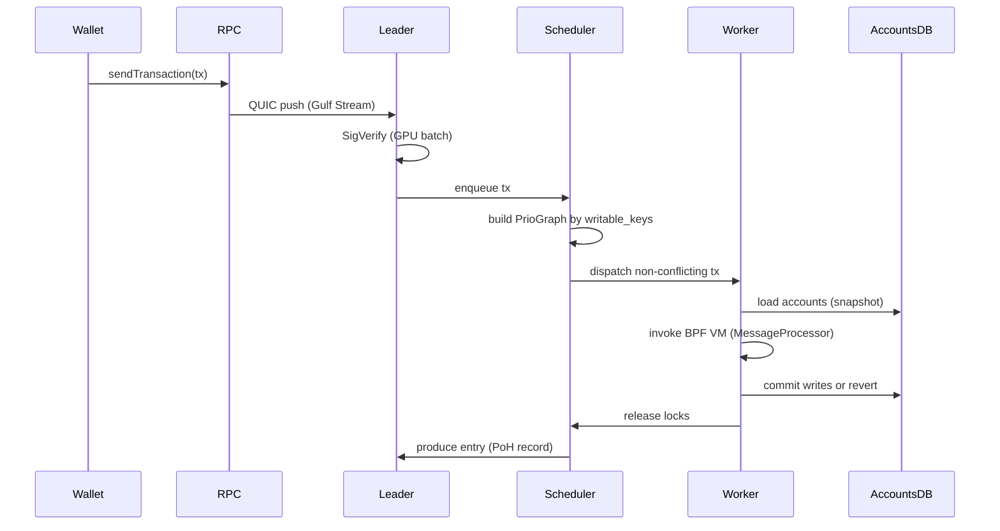

# Sealevel 运行时

> **TL;DR**：Sealevel 是 Solana 独有的 **并行智能合约执行运行时**，也是 Solana 把 TPS 推过万量级的根本原因。其本质是把"交易调度"退化成"账户访问集的冲突检测"——每笔 Tx 必须在 message 头显式声明读/写账户列表，运行时据此建立 `AccountLock`（读共享、写互斥），在 **一个 slot 内** 把访问集两两不相交的 Tx 分配到多核并行执行。核心组件包括：`Bank`（slot 状态机）、`AccountLocks`（锁表）、`TransactionScheduler`（2024 起的 Central Scheduler）、`MessageProcessor`（指令分发）、`ProgramCache`（已加载 BPF 程序缓存）。Sealevel 与 EVM 的顺序执行 + 乐观并发（Aptos Block-STM）路线分属三种典型范式。

---

## 1. 背景与动机

以太坊 EVM 在 2015 年设计时是**串行**的：每个区块内的 Tx 按顺序在单线程 EVM 上执行，因为任何 Tx 都**可能**读写任何 storage slot，事先无法判断冲突。这在共识吞吐 ≥ 数百 TPS 时成为绝对瓶颈。

Anatoly Yakovenko 2017 年的洞察：**如果让交易在提交时就把所有要碰的账户明说**，运行时就能像数据库事务调度器一样，按"读写集"做静态冲突分析，进而把无冲突的交易分发到多个 CPU 核心并行跑。这就是 **Sealevel**（命名取自"海平面"——暗指让原本串行的高山瓶颈推平成可并行的浅水）。

Sealevel 不是一个独立 crate，而是 Solana runtime 的一组机制集合：**账户锁**、**调度器**、**消息处理器**、**程序加载器**、**Compute Budget** 合力构成"交易从 mempool 到落账"的执行层。2024 年 Anza 团队交付的 **Central Scheduler**（SIMD-0097）是近三年最关键的调度器重写，彻底解决了旧 `ThreadAwareAccountLocks` 的 starvation 问题。

## 2. 核心原理

### 2.1 形式化定义

Sealevel 可被形式化为一个 **冲突串行化调度器**（conflict-serializable scheduler）：

设一个 slot 的交易集合 `T = {t_1, ..., t_n}`，每笔交易 `t_i` 附带读集 `R_i ⊆ A` 和写集 `W_i ⊆ A`（`A` 为全体账户）。定义冲突关系：

```
conflict(t_i, t_j) ⇔ (W_i ∩ W_j) ∪ (W_i ∩ R_j) ∪ (R_i ∩ W_j) ≠ ∅
```

若构造一个优先图 `G = (T, E)`，`(t_i, t_j) ∈ E` 当且仅当 `conflict(t_i, t_j) ∧ i < j`（按 Tx 在块内序），则 Sealevel 保证：

- **不变式 S1（冲突串行化）**：最终执行结果等价于 `T` 按 `<` 全序串行执行的结果。
- **不变式 S2（原子性）**：每笔 Tx 要么全部应用要么完全回滚（通过 account 写前快照实现）。
- **不变式 S3（确定性）**：给定同一 `(bank_state, T, scheduling_policy)`，输出 `bank_state'` 唯一——这是 Tower BFT 验证者能重算并投票的先决条件。

策略约束：由于 Solana 要求 validator 节点**重放**而非"接收计算结果"，调度策略本身必须确定性。Central Scheduler 用 writable account 的 `Pubkey` 做 shard key，保证所有 validator 独立算出同一张依赖图。

### 2.2 AccountLocks 数据结构

`runtime/src/accounts/account_locks.rs` 核心：

```rust
pub struct AccountLocks {
    write_locks: HashMap<Pubkey, u64>,   // 账户 -> 持有写锁的 Tx 计数
    readonly_locks: HashMap<Pubkey, u64>, // 账户 -> 持有读锁的 Tx 计数
}
```

不变式：

- `∀ k. write_locks[k] ∈ {0, 1}`（写锁互斥）。
- `write_locks[k] = 1 ⇒ readonly_locks[k] = 0`（读写互斥）。
- `readonly_locks[k] ≥ 0` 无上限（读共享）。

加锁 `try_lock_accounts(writable, readonly)` 是原子的：若任一冲突则全部撤销并返回 `AccountInUse`。这对应数据库的 2PL（Two-Phase Locking）严格协议。

### 2.3 子机制拆解

**(1) 静态账户声明**：每笔 Message 的 `account_keys: Vec<Pubkey>` 是完整账户集；`header` 字段 `num_required_signatures / num_readonly_signed_accounts / num_readonly_unsigned_accounts` 把 account_keys 分为 4 个区段——{signer-writable, signer-readonly, nonsigner-writable, nonsigner-readonly}。解析复杂度 `O(1)`。

**(2) Address Lookup Table (ALT, v0 message)**：legacy message 上限约 35 账户，过于受限。v0 message 引入 `address_table_lookups: Vec<MessageAddressTableLookup>`，让一笔 Tx 可间接引用几百账户（来自链上 LUT）。解析时需先 `getAccountInfo(LUT)` 展开。

**(3) Scheduler**：Central Scheduler（`core/src/banking_stage/transaction_scheduler/`）维护 `PrioGraph`：节点是 Tx，边是 writable-account 冲突。从源节点（入度 0）向 worker thread 分发，worker 执行完后解锁并重算入度。这种设计保证 **high-priority Tx 不会被 low-priority hot-account Tx 卡死**（旧 ThreadAware 方案的痛点）。

**(4) MessageProcessor**：按 Message 内指令顺序执行。每条指令 `Instruction { program_id, accounts, data }` 对应一次 Program 调用。Native Program（System、Vote、Stake、BPFLoader）走特化路径；BPF Program 通过 `bpf_loader::process_instruction` 进入 rbpf VM。

**(5) Compute Budget**：每 Tx 默认 200k CU，最多 1.4M CU。`ComputeBudgetInstruction` 可在交易首条设定 `set_compute_unit_limit / set_compute_unit_price / set_heap_size / set_loaded_accounts_data_size_limit`。CU 超限 → 整 Tx revert。

**(6) ProgramCache**：每次调用 BPF 程序都 JIT 重编译不现实；`ProgramCache`（`program-runtime/src/loaded_programs.rs`）以 `(Pubkey, slot)` 为 key 缓存已 verify 且 JIT 过的程序，跨 slot 复用。程序 upgrade 时按 `deployment_slot` 让旧版本缓存失效。

### 2.4 参数与常量

| 参数 | 值 | 来源 | 可治理 |
| --- | --- | --- | --- |
| Slot 时间 | 400 ms | `poh/src/poh.rs::DEFAULT_TICKS_PER_SLOT` | feature-gated |
| 每 Tx 默认 CU | 200,000 | `compute_budget` | 客户端固定 |
| 每 Tx 最大 CU | 1,400,000 | SIMD-0033 | SIMD |
| 每 block 最大 CU | 48,000,000 (2026) | MAX_BLOCK_UNITS | SIMD |
| 每 writable account 最大 CU | 12,000,000 | MAX_WRITABLE_ACCOUNT_UNITS | SIMD |
| 栈帧大小 | 4 KB | rbpf `MAX_CALL_DEPTH * STACK_FRAME_SIZE` | 代码常量 |
| 堆大小 | 32 KB 默认，可扩至 256 KB | `ComputeBudget::heap_size` | Tx 内声明 |
| CPI 调用深度 | 最多 4 | `MAX_INVOKE_STACK_HEIGHT` | 代码 |
| 签名验证批 | 128/批 | `packet::PACKETS_PER_BATCH` | 代码 |

### 2.5 边界条件与失败模式

- **账户热点（hot account）**：大量 Tx 都写同一账户（如 pump.fun bonding curve）→ 并行度退化为 1。运行时行为正确，但吞吐下降；Local Fee Market 让该账户的 fee 飙升是自然反压。
- **读锁溢出**：`readonly_locks[k]` 理论无限，但实际受 block CU 上限约束。
- **死锁**：Sealevel 不会死锁——`try_lock_accounts` 失败时立刻回滚所有已持锁，Tx 进入 retry 队列。
- **跨 slot 重试**：锁冲突 Tx 不会被 drop；Central Scheduler 把它放回队列下一轮调度，直到 `blockhash expire`（150 slot ≈ 60 秒）。
- **确定性破坏风险**：若调度策略依赖于运行时物理变量（线程数、系统时钟）→ 不同 validator 算出不同调度 → 分叉。Solana 用"account shard 哈希 mod 固定 worker_count"规避。
- **CU 攻击**：恶意合约通过 CPI 快速消耗 CU 做 DoS。应对：set_compute_unit_limit 必须声明，block-level CU cap 硬限。

### 2.6 Mermaid 时序图



## 3. 架构剖析

### 3.1 分层视图

Sealevel 落在 Solana runtime 层，自顶向下可拆为：

1. **Banking Stage 调度层**（`core/src/banking_stage/`）：决定 Tx 的入池/排序/分发。
2. **Bank 层**（`runtime/src/bank.rs`）：slot 状态机，提供 `process_transactions`、`load_and_execute_transactions`。
3. **Program Runtime 层**（`program-runtime/`）：InvokeContext、MessageProcessor、SyscallRegistry、ProgramCache。
4. **sBPF VM 层**（`sbf/`, `programs/bpf_loader/`）：rbpf 解释/JIT 执行字节码。
5. **AccountsDB 层**（`accounts-db/`）：账户 mmap 存储 + AccountLocks。

### 3.2 核心模块表

| 模块 | 路径 | 职责 | 依赖 | 可替换性 |
| --- | --- | --- | --- | --- |
| BankingStage | `core/src/banking_stage/mod.rs` | 接收/校验/调度 Tx | Scheduler、Bank | 高（Jito 即替换） |
| CentralScheduler | `core/src/banking_stage/transaction_scheduler/` | PrioGraph 调度 | AccountLocks | 中（SIMD-0097） |
| AccountLocks | `runtime/src/accounts/account_locks.rs` | 读写锁表 | — | 低（共识依赖） |
| Bank | `runtime/src/bank.rs` | slot 状态机 | AccountsDB、Sysvar | 低 |
| MessageProcessor | `program-runtime/src/message_processor.rs` | 指令分发 | InvokeContext | 低 |
| InvokeContext | `program-runtime/src/invoke_context.rs` | CPI 调用栈 | SyscallRegistry | 低 |
| ProgramCache | `program-runtime/src/loaded_programs.rs` | 已加载程序缓存 | rbpf Executable | 低 |
| BPFLoader | `programs/bpf_loader/src/` | 部署/升级程序 | rbpf | 低 |
| rbpf VM | `sbf/`（external crate） | sBPF 解释/JIT | — | 中（Firedancer 自研 fd_vm） |
| AccountsDB | `accounts-db/src/` | mmap 账户存储 | — | 低 |

### 3.3 数据流：一笔 Tx 的 Sealevel 生命周期

1. **接入**：QUIC → `fetch_stage` 放入 `PacketBatch`。
2. **校验**：`sigverify_stage` 批量 Ed25519（GPU/AVX）。
3. **反序列化**：`BankingStage::receive_and_buffer` 解 Tx，提取 `writable_keys / readonly_keys`。
4. **调度**：CentralScheduler 把 Tx 插入 PrioGraph（按 `priority_fee / cu` 降序），维护"可调度节点"集合。
5. **分发**：worker thread 从源节点取 Tx，通过 `try_lock_accounts` 获取账户读写锁。
6. **加载**：`Bank::load_accounts`——从 AccountsDB mmap 区读入账户字节，建立 Snapshot。
7. **执行**：`MessageProcessor::process_message` 逐指令：
   - native program → 直接调用 Rust 函数。
   - BPF program → `ProgramCache.load_program(pubkey) → Executable::execute(...)` 在 rbpf VM 中跑 sBPF。
   - CPI：通过 `sol_invoke_signed_c` syscall 递归创建新 InvokeContext。
8. **CU 扣减**：每条 BPF 指令按 opcode 表扣减 CU，超限 `trap`。
9. **落账**：执行完所有指令且未 revert → `Bank::commit_transactions` 把 dirty accounts 写回 AccountsDB（append-only），释放锁。
10. **记录**：entry 通过 PoH record 混入哈希流，进入 Broadcast Stage。

### 3.4 客户端多样性

- **Agave**（Rust）：参考实现，本文所有路径来源。
- **Firedancer**（C）：`fd_runtime` / `fd_vm` 独立重写 Sealevel 核心，2024-12 起与 Agave 并存。Firedancer 自研 C 版 BPF VM 比 rbpf 快数倍。
- **Sig**（Zig，Syndica）：当前仅实现 replay-only 子集，不调度交易。

客户端多样性的难点在 **字节级确定性**：任一客户端对某 slot 的 Bank state 哈希必须完全一致；新版本激活前需经历数月"双跑对比"（shadow replay）。

### 3.5 扩展 / 互操作接口

- **Program ABI**：`pub extern "C" fn entrypoint(input: *mut u8) -> u64`。
- **Syscall 注册表**（`SyscallRegistry`）：`sol_log_*`、`sol_memcpy_`、`sol_sha256`、`sol_keccak256`、`sol_secp256k1_recover`、`sol_get_clock_sysvar`、`sol_invoke_signed_c`、`sol_alloc_free_`、`sol_set_return_data`、`sol_get_return_data` 等 ~50 个。
- **Sysvar 账户**：`Clock`、`EpochSchedule`、`Rent`、`SlotHashes`、`Instructions`、`StakeHistory`。
- **RPC**：`simulateTransaction`（不走实际锁）用于前端预估 CU。
- **Geyser plugin**：`ReplicaAccountInfo` + `ReplicaTransactionInfo` 流式推送给外部索引器。
- **ComputeBudget Instruction**：Tx 内 opt-in 调参。

## 4. 关键代码 / 实现细节

`runtime/src/accounts/account_locks.rs`（Agave v2.1，简化）：

```rust
impl AccountLocks {
    pub fn try_lock_accounts<'a>(
        &mut self,
        keys: impl Iterator<Item = (&'a Pubkey, bool /*writable*/)>,
    ) -> Result<(), TransactionError> {
        let mut locked_writable = Vec::new();
        let mut locked_readonly = Vec::new();
        for (k, is_write) in keys {
            if is_write {
                if self.is_locked_readonly(k) || self.is_locked_write(k) {
                    self.unlock_all(&locked_writable, &locked_readonly);
                    return Err(TransactionError::AccountInUse);
                }
                self.write_locks.insert(*k, 1);
                locked_writable.push(*k);
            } else {
                if self.is_locked_write(k) {
                    self.unlock_all(&locked_writable, &locked_readonly);
                    return Err(TransactionError::AccountInUse);
                }
                *self.readonly_locks.entry(*k).or_insert(0) += 1;
                locked_readonly.push(*k);
            }
        }
        Ok(())
    }
}
```

Central Scheduler 入队关键路径（`core/src/banking_stage/transaction_scheduler/scheduler_controller.rs`，摘自 v2.1 附近）：

```rust
fn receive_and_buffer_packets(&mut self, ...) {
    while let Ok(packet_batch) = self.packet_receiver.try_recv() {
        for packet in packet_batch {
            let tx = sanitize_transaction(packet)?;           // 反序列化
            let prio = compute_priority(&tx);                 // priority_fee / cu_limit
            let writable = tx.writable_account_keys();
            self.prio_graph.insert(tx.signature(), prio, writable); // 插入依赖图
        }
    }
    while let Some(tx_id) = self.prio_graph.pop_ready() {     // 取入度 0
        self.dispatch_to_worker(tx_id)?;
    }
}
```

`program-runtime/src/message_processor.rs` 主循环：

```rust
for (i, instruction) in message.instructions().iter().enumerate() {
    let program_id = message.account_keys()[instruction.program_id_index];
    invoke_context.prepare_next_instruction(instruction)?;
    invoke_context.process_instruction(
        &instruction.data,
        &instruction_accounts,
        &program_indices,
        &mut compute_units_consumed,
        &mut timings,
    )?;  // 任一失败 → Tx revert
}
```

> 省略了 feature-gate 分支、timings 采样、CPI 深度检查。

## 5. 演进与版本对比

| 版本 | 时间 | 关键变化 | 影响 |
| --- | --- | --- | --- |
| 初代 Sealevel | 2020-03 | 基本 AccountLocks + ThreadAwareLocks | 实现并行执行 |
| v1.10 | 2022-04 | BPF → sBPF 指令集完善 | 字节码独立演进 |
| v1.14 QUIC TPU | 2022-09 | 配合 SWQoS，抵御 spam | 提升调度公平 |
| Local Fee Market | 2023-02 | Writable account 维度 fee | 热点不拖全网 |
| Program Cache v2 | 2023-10 | LRU + background compile | 降低 JIT 延迟 |
| Central Scheduler (SIMD-0097) | 2024-02 | PrioGraph 全面替换 ThreadAware | 消除 starvation |
| Token-2022 Extensions | 2024-09 | transfer hook 等触发 CPI | 复杂调度 |
| SIMD-0172 greedy scheduler | 2025 | 简化版 backup | 小节点更易用 |

## 6. 实战示例

观测一个本地 slot 的并行度：

```bash
# 启动带 RPC 的 test validator
solana-test-validator --rpc-port 8899 --log

# 另开终端
solana logs | grep "pack"

# 观测 banking stage 指标
curl -s http://127.0.0.1:8899 -X POST -H 'content-type: application/json' \
  -d '{"jsonrpc":"2.0","id":1,"method":"getRecentPerformanceSamples","params":[5]}' | jq
```

自写小程序显式设置 CU：

```rust
use solana_sdk::{compute_budget::ComputeBudgetInstruction, transaction::Transaction};
let ix_budget = ComputeBudgetInstruction::set_compute_unit_limit(400_000);
let ix_price  = ComputeBudgetInstruction::set_compute_unit_price(10_000); // micro-lamports
let tx = Transaction::new_signed_with_payer(
    &[ix_budget, ix_price, my_ix],
    Some(&payer.pubkey()),
    &[&payer],
    recent_blockhash,
);
```

## 7. 安全与已知攻击

- **TPU spam（2021–2022）**：bot 刷 UDP Tx 占满 leader 入口带宽 → 多次停机。修复：QUIC + Stake-weighted QoS + Local Fee Market。
- **Hot account starvation**：旧 ThreadAwareLocks 让低优先级写 hot account 的 Tx 反复抢占线程，导致其他独立 Tx 等 worker。修复：Central Scheduler。
- **CPI re-entrancy**：由于 Solana 要求每次 CPI 重新声明账户列表且每个 program 的 signer seeds 独立，结构性避免了 EVM 式重入——但跨程序逻辑一致性仍需开发者验证（见 Mango Markets 2022 事件，非重入但为预言机 + 杠杆逻辑漏洞）。
- **Compute exhaustion**：恶意程序通过长循环耗尽 CU。rbpf verifier + CU budget 硬限使 worker 不会永久 hang。
- **Shadow accounts**（未声明账户）：若指令代码尝试读取未在 message 中声明的账户 → `NotEnoughAccountKeys` 立刻 revert，runtime 保证不越权访问。

## 8. 与同类方案对比

| 维度 | Sealevel | EVM（串行） | Aptos Block-STM | Sui Mysticeti 对象级 |
| --- | --- | --- | --- | --- |
| 并行模型 | 静态冲突检测（预声明） | 无 | 乐观并发 + 重试 | 对象所有权 DAG |
| 开发者负担 | 高（必须声明 account） | 零 | 低（自动检测） | 中（拥有权/共享区分） |
| 冲突处理 | 回退队列 | — | 重试到顺序 | 单 owner 不冲突 |
| 最坏吞吐 | hot account 退化为 1 | 恒定单线程 | 退化为串行 | 同左 |
| 确定性 | 完全 | 完全 | 完全 | 完全 |

## 9. 延伸阅读

- 官方：<https://solana.com/docs/core/runtime>，<https://solana.com/docs/core/transactions>
- SIMD-0097 Central Scheduler：<https://github.com/solana-foundation/solana-improvement-documents/blob/main/proposals/0097-central-scheduler.md>
- Anza Banking Stage 博客：<https://www.anza.xyz/blog>
- Helius 深度：<https://www.helius.dev/blog/solana-executes-parallel-transactions>
- Firedancer：<https://github.com/firedancer-io/firedancer>
- 学术：Block-STM 论文（Gelashvili 等，Aptos Labs, 2022）
- 中文：登链社区 "Solana 并行执行深入剖析" 专栏

## 10. 术语表

| 术语 | 英文 | 释义 |
| --- | --- | --- |
| 海平面运行时 | Sealevel | Solana 并行执行运行时总称 |
| 账户锁 | AccountLocks | 读共享/写互斥的锁表 |
| 计算单元 | Compute Unit (CU) | Tx 资源计量单位 |
| 中心调度器 | Central Scheduler | 基于 PrioGraph 的新调度器（SIMD-0097） |
| 消息处理器 | MessageProcessor | 指令分发器 |
| 调用上下文 | InvokeContext | CPI 递归栈 |
| 程序缓存 | ProgramCache | 已 verify/JIT 程序缓存 |
| 跨程序调用 | CPI | Cross-Program Invocation |
| 地址查找表 | ALT | Address Lookup Table，v0 message 机制 |

---

*Last verified: 2026-04-22*
