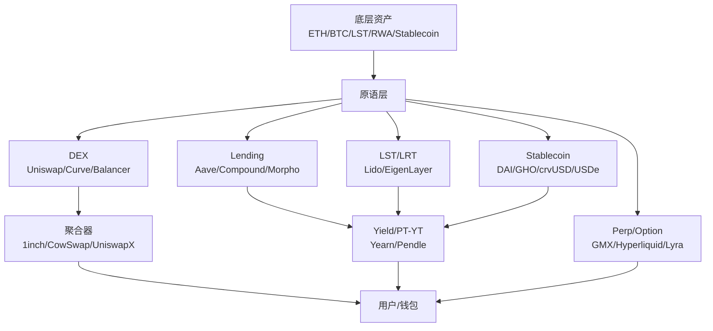
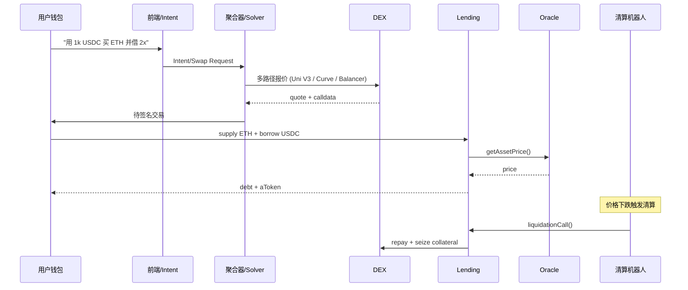

# DeFi 全景（Decentralized Finance Landscape）

> **TL;DR**：DeFi（去中心化金融）是在公链上以**无需许可的合约**重建银行、交易所、券商、保险、结算等金融职能的体系。自 2017 年 MakerDAO 发行 DAI、2018 年 Uniswap V1 上线、2020 年 Compound 点燃"DeFi Summer"以来，DeFi 在 2021 年 TVL 峰值约 1800 亿美元、2022 年 Terra/3AC/FTX 连环崩溃回落至 400 亿、2024–2025 年随 Restaking / RWA / LSDfi 重新爬升至 ~1500 亿美元。核心板块包括 **DEX（现货/永续/期权）、Lending（超额/隔离/点对点）、Stablecoin（CDP/储备/算法/合成美元）、LST/LRT（流动性质押与再质押）、Yield（利率分离/聚合器）、RWA（链上国债/私募信贷）、Derivatives（永续合约/结构化产品）**。风险矩阵涵盖合约漏洞、预言机操纵、MEV、经济模型、治理攻击、跨链桥、清算瀑布、合规监管八大维度。本篇为 DeFi 主题的顶层索引，给出分类学、生命周期、模块映射与后续深度文的阅读路径。

---

## 1. 背景与动机

### 1.1 为什么需要 DeFi

传统金融（TradFi）在中心化清算、信任中介、合规护城河、跨境成本、服务半径上存在结构性摩擦：证券结算 T+2、国际汇款 2–5 日、跨境清算费 3%–8%、小额信贷覆盖不足、夜间与节假日停摆、资产 24/7 流动性缺失。DeFi 的核心命题是 **用公开代码替代不可见对手方、用原子结算替代 T+N、用 24/7 全球流动性池替代分时段的做市商**。

DeFi 的可编程属性带来三项质变：

1. **可组合性（Composability / Money Lego）**：合约间原子调用，使得一个用户在一笔 transaction 内完成"借贷 → 兑换 → 存入 LP → 抵押借贷"整条链。
2. **无需许可（Permissionless）**：任何地址都能部署新合约、列出新资产、创建新市场，监管只能在法币出入金、前端、中心化服务等边界介入。
3. **透明可审计（Transparent）**：所有状态、余额、交易、参数均链上可查，催生了 DeFiLlama、Dune、Nansen 等透明数据层。

### 1.2 历史主线

- **2015–2017 早期萌芽**：MakerDAO 白皮书（2015）、EtherDelta（2017）、0x（2017）提出链上撮合与订单簿原型。
- **2018 CPMM 革命**：Uniswap V1（2018-11）将恒定乘积做市（Constant Product Market Maker, CPMM）推向主流，Bancor、Kyber 同期。
- **2019 抵押借贷成型**：Compound V1 / V2（2019）、Aave V1（原 ETHLend，2020 品牌更名）确定"池式超额抵押借贷"范式。
- **2020 DeFi Summer**：Compound 发行治理代币 COMP 点燃流动性挖矿；yearn、Curve、Yearn、Sushi、Balancer 密集上线；TVL 从 10 亿跳跃至 150 亿。
- **2021 扩张与创新**：Uniswap V3 集中流动性、Aave V2 信用委托、Convex 取得 Curve 治理权、永续 DEX（dYdX、Perpetual Protocol、GMX）起飞，TVL 峰值 1800 亿美元。
- **2022 黑天鹅连发**：Terra UST 脱锚（2022-05，500 亿蒸发）、3AC、Celsius、FTX 相继爆雷，DeFi TVL 回撤 70%。
- **2023–2024 重建与分化**：LST（Lido）、LRT（EigenLayer）、RWA（MakerDAO DSR、Ondo USDY、BlackRock BUIDL）、Intent-centric DEX（CowSwap、UniswapX）成为主叙事。
- **2025–2026 制度化**：GENIUS Act（美）、MiCA（欧）、香港稳定币条例等合规框架落地，PayPal PYUSD、Circle USDC、BlackRock BUIDL 将 TradFi 大量引流。

## 2. 核心原理（DeFi 基本原语与板块分类）

### 2.1 形式化定义：DeFi 协议的五元组

把任意 DeFi 协议抽象为五元组 `P = (A, S, F, O, G)`：

- **A（Assets）**：协议接受或发行的代币集合，含 ERC-20/721/1155/4626/3643 等标准。
- **S（State）**：协议维护的链上状态，如借贷池的 `totalBorrows / totalSupply`、AMM 的 `(x, y, k)`、Vault 的 `totalAssets / totalShares`。
- **F（Functions）**：可被外部调用的状态转移函数 `f: (S, Tx) → S'`，以 EVM opcode 或 Solidity external/public 函数形式暴露。
- **O（Oracles）**：协议依赖的外部输入，包括价格预言机（Chainlink、Pyth）、利率曲线、治理参数。
- **G（Governance）**：对参数 / 逻辑 / 升级权限的控制主体，多为治理代币 + Timelock + Multisig。

形式化表达"DeFi 协议组合性"：若协议 `P_1` 的 Function `f_1` 的返回状态可作为 `P_2` 的输入资产，则组合协议 `P_12 = P_1 ∘ P_2` 在同一 transaction 内原子执行。这条性质是 Money Lego 的数学基础，也是 DeFi 与 TradFi 本质差异所在——跨机构的原子结算在 TradFi 中需引入清算所，而在 DeFi 中由底层链保证。

### 2.2 AMM（自动做市商）数学基础

| 名称 | 不变式 | 代表协议 |
| --- | --- | --- |
| CPMM（Constant Product） | `x · y = k` | Uniswap V1/V2/V3/V4 |
| CSMM（Constant Sum） | `x + y = k` | 理论模型（无实用，易被清空） |
| StableSwap | `A·n^n·∑x_i + D = A·D·n^n + D^(n+1)/(n^n·∏x_i)` | Curve V1 |
| Weighted Geometric Mean | `∏(B_i)^(w_i) = k` | Balancer |
| CLMM（Concentrated Liquidity） | 分段 CPMM，每个 tick 内 `L = √(x · y)` | Uniswap V3、PancakeSwap V3 |
| CryptoSwap | Curve V2 动态 peg 的二次型加权 CPMM+StableSwap | Curve tricrypto |

交易滑点为不变式在交换前后的状态差投影；无常损失（Impermanent Loss）为持仓 vs 外部参考价的价值差。不同 AMM 的几何含义：CPMM 以双曲线沿坐标轴无限延展（永不枯竭但深度低），StableSwap 在 peg 附近近似 CSMM 而在偏离时退化为 CPMM，CLMM 把流动性压缩到有限价格区间以提高资本效率。

### 2.3 借贷与清算（Lending & Liquidation）

借贷协议的核心状态：

- **Supply Side**：供应者铸造 *interest-bearing token*（aToken / cToken / ERC-4626 share）。
- **Borrow Side**：借款人超额抵押后铸造债务 token（Aave 的 variableDebtToken、Compound V3 的 baseToken 借款），按 `borrowIndex` 复利计息。
- **Health Factor**：`HF = ∑(collateral_i · price_i · LT_i) / ∑(debt_j · price_j)`；当 `HF < 1` 触发清算。
- **利率模型**：`borrowRate = f(utilization)`，常为分段线性函数，在 optimal U 处出现拐点。

### 2.4 稳定币（Stablecoin）

| 类型 | 锚定机制 | 示例 |
| --- | --- | --- |
| 法币储备 | 1:1 银行存款/国债 | USDT、USDC、PYUSD、FDUSD |
| CDP（超额抵押） | 抵押 crypto → 贷出稳定币 | DAI、LUSD、crvUSD、GHO |
| 合成美元（Delta-neutral） | 现货多头 + 永续空头 | USDe（Ethena） |
| 算法（已失败为主） | 双代币无抵押铸销 | UST（崩盘）、FRAX v1 → v3（转向 CDP） |
| 部分准备金（混合） | 部分抵押 + 算法 | 早期 FRAX v1 |

### 2.5 LST / LRT（Liquid Staking / Restaking）

- **LST**：PoS 原生质押的流动性代币化。Lido stETH、Rocket Pool rETH、Coinbase cbETH、Frax sfrxETH。
- **LRT**：EigenLayer 等 Restaking 平台将 LST / ETH 再抵押以为 AVS（Actively Validated Services）提供经济安全，铸造 LRT（ether.fi eETH、Renzo ezETH、Kelp rsETH）。

### 2.6 Yield 与 PT/YT 分离

Pendle 将任意 yield-bearing token（如 stETH、sUSDe）拆分为 **PT（Principal Token）** + **YT（Yield Token）**，实现固定收益、杠杆收益、利率套利三种市场形态。PT 类似零息债券：按折价买入、到期按 1:1 赎回 underlying；YT 持有等同于**购买未来收益流的看涨期权**，价格随隐含 APY 波动。

### 2.7 子机制：MEV、预言机、治理

- **MEV（Maximal Extractable Value）**：Searcher 通过 sandwich、arb、清算获取的超额利润。Flashbots、MEV-Share、SUAVE、CowSwap、UniswapX 等是缓解路径。
- **Oracle**：DeFi 的 single point of failure。高低质价格源决定借贷安全线。Chainlink 推送式、Pyth 拉取式、UMA 乐观式各有 trade-off。
- **治理**：veToken（Curve 首创）、Lock-up、Delegation、Snapshot off-chain vote、Tally on-chain vote 构成治理矩阵。Convex 对 Curve、Aura 对 Balancer 的"贿赂经济"是 veToken 模型衍生。

### 2.8 关键参数与边界

| 参数 | 典型值 | 影响 |
| --- | --- | --- |
| 借贷 LTV | 70%–93% | 抵押效率 vs 清算缓冲 |
| 清算罚金 | 5%–15% | 清算人激励 vs 借款人成本 |
| AMM Fee Tier | 0.01%–1% | 做市收益 vs 交易成本 |
| 稳定币 DSR / Savings Rate | 3%–15% | 锚定需求 vs 协议成本 |
| 预言机心跳 / 偏差 | 1h / 0.5% | 实时性 vs Gas |
| 清算 Close Factor | 50%–100% | 单次清算比例 |

边界条件与失败模式：

- **Oracle 延迟 / 被操纵**：bZx（2020）、Mango（2022）、Euler（2023）等事件。
- **流动性枯竭**：Luna-UST、Iron Finance 死亡螺旋。
- **参数极端**：Aave 曾在 2022 年因 CRV 做空者抬价面临坏账风险。
- **重入 / 跨合约调用**：CREAM、Fei、Euler 等经典重入漏洞。
- **治理攻击**：Beanstalk（2022-04）通过闪电贷收购 67% 治理权，提案瞬时通过，损失 1.8 亿美元。

### 2.9 Mermaid：DeFi 板块全图



## 3. 架构剖析（DeFi 栈分层与模块清单）

### 3.1 分层视图

| 层 | 职责 | 代表 |
| --- | --- | --- |
| L0 结算层 | 区块链基础设施 | Ethereum、Solana、L2（Arbitrum/Optimism/Base） |
| L1 资产与标准 | Token 标准、账户 | ERC-20/4626、SPL |
| L2 原语 | AMM、借贷、CDP、永续 | Uniswap、Aave、MakerDAO |
| L3 聚合与路由 | DEX 聚合、收益聚合 | 1inch、CowSwap、Yearn、Pendle |
| L4 结构化 | 金库、RWA、LST/LRT 包装、期权结构 | Morpho Vault、Ondo、ether.fi |
| L5 前端/Intent | 钱包、Intent Solver | MetaMask、Rabby、CowSwap Solver |

### 3.2 核心模块清单（对照仓库）

| 模块 | 职责 | 代码位置 | 可替换性 |
| --- | --- | --- | --- |
| Uniswap V4 PoolManager | Singleton AMM 内核 | `Uniswap/v4-core/src/PoolManager.sol` | 低（协议核心） |
| Uniswap V4 Hooks | 可插拔扩展（Dynamic Fee、LVR 保护等） | `v4-core/src/interfaces/IHooks.sol` | 高（自定义实现） |
| Curve StableSwap | 稳定币池不变式 | `curvefi/curve-contract/contracts/pool-templates/base/SwapTemplateBase.vy` | 低 |
| Balancer V2 Vault | 统一 Vault 管理所有池 | `balancer-v2-monorepo/pkg/vault/contracts/Vault.sol` | 低 |
| Aave V3 Pool | 借贷核心 | `aave-v3-origin/contracts/protocol/pool/Pool.sol` | 低 |
| Compound V3 Comet | 单抵押 base 资产借贷 | `compound-finance/comet/contracts/Comet.sol` | 中 |
| Morpho Blue | 隔离市场的极简借贷内核 | `morpho-org/morpho-blue/src/Morpho.sol` | 中（Vault 层可换） |
| MakerDAO dss | CDP Engine | `makerdao/dss/src/vat.sol` | 低 |
| EigenLayer | Restaking 基座 | `Layr-Labs/eigenlayer-contracts/src/contracts/core/DelegationManager.sol` | 低 |
| Pendle | PT/YT 分离 | `pendle-finance/pendle-core-v2-public/contracts/core/Market/PendleMarketV3.sol` | 中 |

### 3.3 数据流（端到端）



### 3.4 实现多样性

- **EVM**：Solidity（Aave、Uniswap）、Vyper（Curve）、Huff（极小部分优化合约）。
- **Solana**：Rust + Anchor：Raydium CLMM、Jupiter、Marginfi、Kamino、Drift。
- **Move**：Aptos/Sui 生态的 Cetus、Thala、Navi。
- **Cosmos**：CosmWasm 的 Osmosis、Astroport、Mars Protocol。
- **应用链**：dYdX v4（Cosmos SDK）、Hyperliquid（自建 L1）。

### 3.5 扩展接口

- **ERC-4626 Tokenized Vault**：统一金库接口，Morpho、Yearn V3、Aave V3 aToken 皆兼容。
- **ERC-2612 permit**：无需单独 approve 交易。
- **Permit2（Uniswap）**：统一授权协议，已被绝大多数聚合器采用。
- **EIP-7540 Async Vault**：异步存赎标准，用于 RWA / 机构金库。
- **Intent / UniswapX / CowSwap**：Signed Order + Off-chain Solver 撮合。

## 4. 关键代码 / 实现细节

Uniswap V2 CPMM 核心 swap 代码（参考 `uniswap-v2-core` tag `v1.0.1`, `contracts/UniswapV2Pair.sol:159-180`）：

```solidity
function swap(uint amount0Out, uint amount1Out, address to, bytes calldata data) external lock {
    require(amount0Out > 0 || amount1Out > 0, "UniswapV2: INSUFFICIENT_OUTPUT_AMOUNT");
    (uint112 _reserve0, uint112 _reserve1,) = getReserves();
    require(amount0Out < _reserve0 && amount1Out < _reserve1, "UniswapV2: INSUFFICIENT_LIQUIDITY");
    // 先转出资产（乐观转账） → 再校验不变式 k
    _safeTransfer(_token0, to, amount0Out);
    _safeTransfer(_token1, to, amount1Out);
    if (data.length > 0) IUniswapV2Callee(to).uniswapV2Call(msg.sender, amount0Out, amount1Out, data);
    (uint balance0, uint balance1) = (IERC20(_token0).balanceOf(address(this)), IERC20(_token1).balanceOf(address(this)));
    uint amount0In = balance0 > _reserve0 - amount0Out ? balance0 - (_reserve0 - amount0Out) : 0;
    uint amount1In = balance1 > _reserve1 - amount1Out ? balance1 - (_reserve1 - amount1Out) : 0;
    // 校验 k' >= k，扣除 0.3% 手续费
    uint balance0Adjusted = balance0.mul(1000).sub(amount0In.mul(3));
    uint balance1Adjusted = balance1.mul(1000).sub(amount1In.mul(3));
    require(balance0Adjusted.mul(balance1Adjusted) >= uint(_reserve0).mul(_reserve1).mul(1000**2), "UniswapV2: K");
    _update(balance0, balance1, _reserve0, _reserve1);
}
```

> 上述为删减后的示意，已省略事件与保护逻辑。完整代码见 Uniswap/v2-core 仓库 tag `v1.0.1`。

## 5. 演进与版本对比

| 阶段 | 时间 | 代表事件 | TVL 量级 |
| --- | --- | --- | --- |
| 萌芽 | 2017–2018 | MakerDAO、EtherDelta、Uniswap V1 | <1B |
| 原语扩张 | 2019–2020 | Compound、Aave、Curve、yearn、Sushi | 10–50B |
| 巅峰 | 2021 | Uniswap V3、Olympus、Anchor | 150–180B |
| 塌缩 | 2022 | UST / 3AC / FTX | 40–80B |
| 重建 | 2023–2024 | Lido、EigenLayer、RWA、UniswapX | 80–150B |
| 制度化 | 2025–2026 | GENIUS Act、MiCA、Uni V4、Morpho Blue、sUSDe | ≥150B |

## 6. 实战示例

一次完整的"存 ETH → 借 USDC → 换回更多 ETH → 再存（杠杆循环）"脚本（简化 ethers.js 伪码）：

```ts
import { Contract, parseEther, parseUnits } from "ethers";
const aavePool = new Contract(AAVE_POOL, AAVE_ABI, signer);
const uniRouter = new Contract(UNISWAP_ROUTER, UNI_ABI, signer);

const supply = parseEther("10");
await aavePool.supply(WETH, supply, me, 0);
// 以 70% LTV 借 USDC
const borrowUsdc = parseUnits("14000", 6);
await aavePool.borrow(USDC, borrowUsdc, 2, 0, me);
// 通过 Uniswap V3 将借到的 USDC 换回 ETH
await uniRouter.exactInputSingle({
  tokenIn: USDC,
  tokenOut: WETH,
  fee: 500,
  recipient: me,
  amountIn: borrowUsdc,
  amountOutMinimum: 0n,
  sqrtPriceLimitX96: 0n,
});
```

预期：第二次 `supply` 后杠杆倍数 ~2x，Aave 前端显示 HF 约 1.6–1.8，利率由借出占比决定。

## 7. 安全与已知攻击

- **The DAO（2016-06）**：重入攻击 → Ethereum 硬分叉。
- **bZx（2020-02）**：闪电贷 + 预言机操纵，~95 万 USD。
- **Harvest（2020-10）**：Curve pool 操纵，3300 万。
- **Cream（2021-10）**：闪电贷 + 预言机操纵，1.3 亿。
- **Terra UST（2022-05）**：死亡螺旋，400–500 亿蒸发。
- **Ronin Bridge（2022-03）**：6.2 亿（Axie Infinity 桥）。
- **Nomad（2022-08）**：1.9 亿，消息校验漏洞。
- **Euler（2023-03）**：1.97 亿，donateToReserves 未校验健康度。
- **Curve（2023-07）**：Vyper 编译器 re-entrancy 漏洞，7000 万。
- **Radiant / KyberSwap（2023-11）**：ES 级数学边界利用。

防御矩阵：多源预言机、TWAP、借贷冻结与 Cap、隔离市场、熔断、Bug Bounty（Immunefi $2M+）。

## 8. 与同类方案对比

| 维度 | 链上 DeFi | 中心化交易所 (CEX) | 传统金融 |
| --- | --- | --- | --- |
| 托管 | 用户自托管 | 平台托管 | 第三方机构 |
| 透明度 | 全状态可查 | 部分（POR） | 季度审计 |
| 运行时间 | 24/7 | 24/7 | 交易时段 |
| 结算 T | 秒级原子 | 平台内即时 | T+1 ~ T+2 |
| 准入 | 无许可 | KYC | 合规账户 |
| 风险 | 合约 + 预言机 + 经济 | 托管 + 挪用 + 黑客 | 制度/系统性风险 |

## 9. 延伸阅读

- [DeFiLlama TVL Dashboard](https://defillama.com/)
- [Ethereum Foundation DeFi Hub](https://ethereum.org/en/defi/)
- [a16z Crypto: The Rise of DeFi](https://a16zcrypto.com/)
- [Paradigm Research](https://www.paradigm.xyz/writing)
- [learnblockchain.cn DeFi 专栏](https://learnblockchain.cn/)
- 论文：Angeris et al. *An Analysis of Uniswap Markets* (2019)
- 论文：Werner et al. *SoK: Decentralized Finance (DeFi)* (2021)

## 10. 术语表

| 术语 | 英文 | 释义 |
| --- | --- | --- |
| 自动做市商 | AMM | 基于池与不变式定价的去中心化交易模型 |
| 集中流动性 | Concentrated Liquidity | LP 在价格区间内提供资金的 AMM 模式 |
| 超额抵押 | Over-collateralized | 借款需抵押价值大于借款价值的资产 |
| 健康因子 | Health Factor | 衡量抵押能力的归一化指标，<1 即清算 |
| 清算 | Liquidation | 第三方替借款人偿还债务换取折价抵押物 |
| CDP | Collateralized Debt Position | 锁仓铸稳定币的头寸 |
| veToken | Vote-Escrowed Token | 锁仓治理增强模型 |
| LST / LRT | Liquid (Re-)Staking Token | 质押凭证代币 |
| Intent | Intent | 声明式交易，由 Solver 代为执行 |
| MEV | Maximal Extractable Value | 矿工/验证者/搜索者可提取价值 |

---

*Last verified: 2026-04-22*
