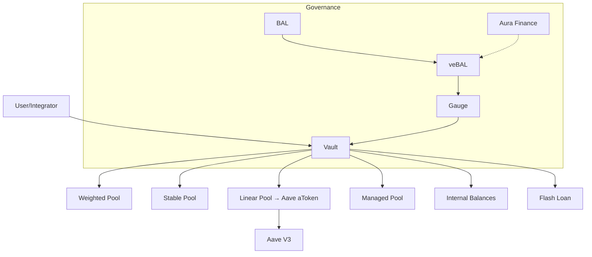
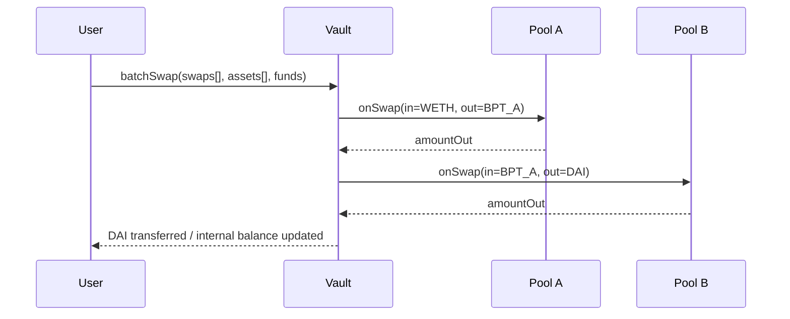

# Balancer（加权池、V2 Vault、Boosted、Managed）

> **TL;DR**：Balancer 由 Fernando Martinelli 与 Mike McDonald 于 2018 年发起，2020-03 上线主网，其创新是把 Uniswap 的二资产 CPMM 推广到 **n 资产、任意权重的加权几何平均 AMM**：`∏ B_i^{w_i} = k`，使 LP 可在一个池内自行配置资产比例（如 80% BAL / 20% WETH），池本身即为"自动平衡的指数基金"。**V1**（2020-03）每池独立合约；**V2**（2021-05）引入 **Singleton Vault**——所有池共享一个资金保管库，跨池互换、Flash Loan、Gas 优化统一实现；**Boosted Pool**（2021-10）把池内闲置资金注入 Aave/Yearn 赚取底层收益；**Managed Pool** 支持可动态再平衡（Gradual Weight Change、AUM Fee）的机构级 Index；**V3**（2024-12 主网）将 V2 经验固化为更小的 Core Vault + 可插拔 **Hooks**（与 Uni V4 平行独立演化），并引入 **100% Boosted Pool** 与 **ERC-4626 作一等资产**。veBAL（2022-03）把治理与 Gauge 绑定，80/20 BAL/WETH LP 锁仓获得投票权，Aura Finance 充当 Balancer 的"Convex"。

---

## 1. 背景与动机

Uniswap 让"无许可做市"成立后，下一个问题是 **"如何在链上表达多资产投资组合"**。传统 ETF 需要中心化再平衡服务与做市商报价；Balancer 颠倒视角：**让 AMM 自己变成 ETF**——任何偏离目标权重的价格都会触发套利者修正，LP 被动收手续费，净效果等同"自动再平衡的加权组合"。白皮书提出两类池：

- Weighted Pool（2–8 资产，各自 1–99% 权重）；
- Smart Pool（权重/费率/成员可变）。

此后 Balancer 沿这一方向演化出 StablePool（StableSwap 变体）、MetaStable（含 rate provider 的 LST 池）、Linear Pool（base + wrapped base, 嵌入 yield）、Managed Pool（机构基金）。

## 2. 核心原理

### 2.1 形式化定义

给定 n 资产、权重 `w_i` 且 `∑w_i = 1`，不变式为：

```
V = ∏ B_i^{w_i}
```

对单次 swap，给定输入 token i 数量 `A_i`，输出 token o 数量满足：

```
A_o = B_o · (1 − (B_i / (B_i + A_i · (1 − f)))^{w_i / w_o})
```

`f` 为 swap 费率。其中 n=2、w_i=w_o=0.5 时退化为 Uniswap V2 CPMM。

Spot Price（忽略手续费）：

```
SP_{i→o} = (B_i / w_i) / (B_o / w_o)
```

这一公式意味着 **池内价格仅由余额与权重比决定**，而不是储备简单比值，从而支持"80/20 BAL/WETH"这类极端权重。

### 2.2 关键数据结构

- **Pool**：每个池有唯一 `poolId`（前 20 字节为 Pool 合约地址，后 12 字节为 specialization 与 nonce）。
- **Vault**（V2 核心）：`mapping(bytes32 => mapping(IERC20 => uint256)) internal _poolTokenBalances;` 集中记录所有池余额。
- **BPT（Balancer Pool Token）**：代表 LP 份额的 ERC20。
- **Linear Pool**：维护 `main token / wrapped token / bpt` 三资产，使用**直线 AMM**定价，允许池内 yield 通过 `rateProvider` 增值。

### 2.3 子机制

#### 2.3.1 Vault 架构（V2）

V2 最根本的变化：把"池"与"资金保管库"分离。池只负责 **"给我 balances，告诉你 swap 数学"**，真正的资产由 Vault 持有。好处：

1. 单笔 `batchSwap` 可在多个池间跳转，只需一次转账。
2. **Internal Balances**：用户把资产存入 Vault 的内部账本，后续交易免去 ERC20 转账 gas。
3. **Flash Loan**：Vault 作为全局流动性源。
4. 池实现可升级/可替换——V2 上已存在 Weighted/Stable/MetaStable/Linear/Managed 等多种池代码。

#### 2.3.2 Boosted Pool

Boosted Pool（首发 bb-a-USD，3pool 嵌套）在 Stable Pool 内放入 **Linear Pool BPT**；Linear Pool 将 DAI/USDC/USDT 的闲置部分投入 Aave aToken，使 LP 同时获得 swap 费 + Aave 利息。

#### 2.3.3 Managed Pool

Managed Pool 在 Weighted Pool 上加：

- `updateWeightsGradually(startTime, endTime, endWeights)` 线性迁移权重；
- `setSwapFeePercentage` 动态费；
- 成员 whitelist；
- AUM Fee（按管理规模向基金管理者周期性收取）。

应用：链上 Index Fund（Tradelink、PowerPool）、对冲基金分仓、TokenUnlock 逐步释放。

#### 2.3.4 veBAL 与 Gauge

veBAL（2022-03）要求用户先把 80/20 BAL/WETH LP token 锁入 VotingEscrow（≤ 1 年），得到 veBAL 进行 Gauge 投票、分享协议费、Boost LP 收益。Aura Finance 类似 Convex 聚合 veBAL。

#### 2.3.5 V3 与 Hooks

Balancer V3（2024-12）把 Vault 进一步瘦身：

- 核心 Pool 类型由 "WeightedMath / StableMath" 等 libraries 组成；
- **Hooks** 在 onBefore/onAfterSwap、onBeforeAddLiquidity 等插入自定义逻辑；
- **ERC-4626 作为一等资产**：Boosted Pool 天然兼容 Aave aToken、Morpho Vault、sDAI 等；
- Transient Storage 降低 gas。

### 2.4 参数与常量

| 参数 | 值 | 说明 |
| --- | --- | --- |
| Weight 范围 | 0.01 – 0.99 | `∑=1` |
| Swap Fee | 0.0001% – 10% | 池级别 |
| Max Tokens | 8 | Weighted/Managed 单池上限 |
| Protocol Fee | 0–50% of swap fee | 治理可调 |
| veBAL 最长锁 | 1 年 | 与 Curve 4 年不同 |
| AUM Fee（Managed） | 0–10%/年 | 线性累计收取 |

### 2.5 边界条件与失败模式

- **极端权重池（1/99）**：小权重一侧的价格冲击巨大，LP 需承受高 IL。
- **Rate Provider 失灵**（Stable/MetaStable）：2023-08 Euler 事件曾波及 bb-e-USD，导致 Balancer Boosted Pool 临时清退。
- **Flash Loan 组合攻击**：Beethoven X 2022、Balancer V2 某些老池曾因第三方包装合约被利用。
- **V3 Hook 风险**：类似 Uni V4，恶意 Hook 可重入 Vault；Balancer V3 引入 `reentrancy guard` + `hookFlags`。

### 2.6 Mermaid：V2 Vault 结构



## 3. 架构剖析

### 3.1 分层视图

| 层 | 说明 |
| --- | --- |
| Math Library | `WeightedMath.sol` / `StableMath.sol` / `LinearMath.sol` |
| Pool Contracts | 具体池实现（继承 BasePool） |
| Vault | 单例 `Vault.sol`，资金托管、swap 调度 |
| Periphery | `BalancerQueries`, `BatchRelayer`, `VeBALDelegation` |
| Governance | BAL + veBAL + Snapshot + Timelock |
| Integrations | Aura, Beethoven X, Gyroscope |

### 3.2 核心模块清单

| 模块 | 路径 | 职责 |
| --- | --- | --- |
| `Vault.sol` | `balancer-v2-monorepo/pkg/vault/contracts/Vault.sol` | 资产托管、swap 调度、Flash Loan |
| `WeightedPool.sol` | `pkg/pool-weighted/contracts/WeightedPool.sol` | 加权池 |
| `StablePool.sol` | `pkg/pool-stable/contracts/StablePool.sol` | Curve 风格不变式 |
| `MetaStablePool.sol` | `pkg/pool-stable/contracts/meta/MetaStablePool.sol` | 含 rate provider 的 LST 池 |
| `LinearPool.sol` | `pkg/pool-linear/contracts/LinearPool.sol` | wrapper 定价 |
| `ManagedPool.sol` | `pkg/pool-weighted/contracts/managed/ManagedPool.sol` | 机构池 |
| `BalancerQueries.sol` | `pkg/standalone-utils/contracts/BalancerQueries.sol` | 报价 |
| `BatchRelayer` | `pkg/standalone-utils/contracts/relayer/BatchRelayerLibrary.sol` | 组合调用 |
| `VotingEscrow` | `balancer-v2-monorepo/pkg/liquidity-mining/contracts/VotingEscrow.vy` | veBAL（Curve fork） |
| `GaugeController` | 同上 | Gauge 投票 |
| V3 `Vault.sol` | `balancer-v3-monorepo/pkg/vault/contracts/Vault.sol` | V3 核心 |
| V3 `Router.sol` | `balancer-v3-monorepo/pkg/vault/contracts/Router.sol` | V3 路由 |

### 3.3 数据流：一次 V2 `batchSwap`



batchSwap + internal balance 让 DEX 聚合器（1inch、Paraswap、CowSwap）常将 Balancer 作为重要路径节点。

### 3.4 实现多样性

- **官方**：Solidity（V2/V3）。
- **多链**：Ethereum、Arbitrum、Optimism、Polygon、Gnosis、Avalanche、Base、zkEVM 等。
- **分叉**：Beethoven X（Fantom/Optimism）、Embr Finance、Impermax 借贷结合。

### 3.5 扩展接口

- `IVault` 接口：`swap / batchSwap / joinPool / exitPool / flashLoan / managePoolBalance`。
- Subgraph：`balancer-labs/balancer-subgraph-v2`。
- SDK：`@balancer-labs/sdk`（TS），封装 SOR（Smart Order Router）。
- V3 Hook：`IHooks` 接口，支持注册到 Vault。

## 4. 关键代码 / 实现细节

V2 Weighted Pool 的 swap 计算（`balancer-v2-monorepo` tag `v2.0`，`pkg/pool-weighted/contracts/WeightedMath.sol:67-100`）：

```solidity
function _calcOutGivenIn(
    uint256 balanceIn,
    uint256 weightIn,
    uint256 balanceOut,
    uint256 weightOut,
    uint256 amountIn
) internal pure returns (uint256) {
    uint256 denominator = balanceIn.add(amountIn);
    uint256 base = balanceIn.divUp(denominator);                  // B_i / (B_i + A_i)
    uint256 exponent = weightIn.divDown(weightOut);               // w_i / w_o
    uint256 power = base.powUp(exponent);
    return balanceOut.mulDown(power.complement());                // B_o · (1 − base^exp)
}
```

V2 Vault joinPool 回调（`Vault.sol:450-520`，简化）：

```solidity
function joinPool(
    bytes32 poolId,
    address sender,
    address recipient,
    JoinPoolRequest memory request
) external override whenNotPaused {
    (address pool, ) = _getPoolAddress(poolId);
    uint256[] memory amountsIn = IBasePool(pool).onJoinPool(
        poolId, sender, recipient, _getPoolBalances(poolId), /* ... */);
    _receiveAssets(sender, request.assets, amountsIn, request.useInternalBalance);
    _updatePoolBalances(poolId, amountsIn, /* isIn = */ true);
    emit PoolBalanceChanged(poolId, sender, ...);
}
```

## 5. 演进与版本对比

| 版本 | 时间 | 关键变化 |
| --- | --- | --- |
| V1 | 2020-03 | 每池独立合约，支持任意权重 |
| V2 | 2021-05 | Singleton Vault、batchSwap、Flash Loan |
| Boosted | 2021-10 | 闲置资金注入 Aave/Yearn |
| MetaStable | 2022-01 | LST（stETH/wstETH）rate provider |
| Managed | 2022-04 | 机构基金池 |
| veBAL | 2022-03 | 80/20 LP 锁仓 |
| V3 | 2024-12 | Vault 瘦身、Hooks、ERC-4626 一等资产、100% Boosted |

## 6. 实战示例

通过 SDK 发起 `batchSwap`（TS 简化）：

```ts
import { BalancerSDK } from "@balancer-labs/sdk";
const sdk = new BalancerSDK({ network: 1, rpcUrl });
const route = await sdk.swaps.findRouteGivenIn({
  tokenIn: USDC,
  tokenOut: WETH,
  amount: parseUnits("10000", 6),
  gasPrice: parseUnits("20", 9),
  maxPools: 4,
});
const tx = sdk.swaps.buildSwap({ ...route, userAddress: me, slippage: "0.005" });
await signer.sendTransaction(tx);
```

创建 Managed Pool（通过 `ManagedPoolFactory.create`）：权重从 `[80,20]` 在 7 天内逐步平滑到 `[50,50]`，LP 自动再平衡。

## 7. 安全与已知攻击

- **2023-08 Vulnerability（BIP-32）**：Rate Provider 升级错误影响约 12 个 Boosted/MetaStable 池，Balancer 紧急迁移流动性，部分池损失 ~97.3 万美元，被白帽 + 套利抢回大部分。
- **2023-09 前端漏洞**：frontend.balancer.fi 因 DNS 被劫持注入钓鱼合约，损失约 23.8 万美元（非合约问题）。
- **早期 V1 Deflationary Token 攻击**：含通缩/rebasing 代币池可被压榨，V2 增加 `TokenCallbackGuard`。
- **与 LST depeg 关联**：stETH/ETH 2022-06 折价曾让 MetaStable Pool LP 价值缩水。

## 8. 与同类方案对比

| 维度 | Balancer V3 | Uniswap V4 | Curve V2 |
| --- | --- | --- | --- |
| 多资产池 | ★★★★★（≤8） | ★（主要双资产） | ★★★★（3–4） |
| 加权灵活 | 任意 | 50/50 | 自动动态 |
| Vault 统一 | 是 | 是（PoolManager） | 否 |
| Boost 底层收益 | 100% Boosted | Hooks 可实现 | Factory Pool 可嵌 LP |
| 治理 | veBAL + Aura | UNI（已启动费率开关讨论） | veCRV + Convex |

## 9. 延伸阅读

- [Balancer Whitepaper](https://balancer.fi/whitepaper.pdf)
- [Balancer V2 Docs](https://docs.balancer.fi/)
- [Balancer V3 Announcement](https://medium.com/balancer-protocol)
- Fernando Martinelli 访谈（Bankless、Unchained）
- Aura Finance Docs
- Rekt: *Balancer Rate Provider Incident* (2023-08)

## 10. 术语表

| 术语 | 英文 | 释义 |
| --- | --- | --- |
| 加权几何均值 | Weighted Geometric Mean | Balancer 不变式 `∏B^w = k` |
| BPT | Balancer Pool Token | LP 份额代币 |
| Internal Balance | Internal Balance | Vault 内部账本 |
| Boosted Pool | Boosted Pool | 嵌套 Linear Pool 赚外部收益 |
| Managed Pool | Managed Pool | 可动态调权的机构池 |
| Rate Provider | Rate Provider | MetaStable 价格比率预言机 |
| veBAL | veBAL | 锁仓治理 + Gauge boost |
| AUM Fee | AUM Fee | 按管理规模收费 |

---

*Last verified: 2026-04-22*
