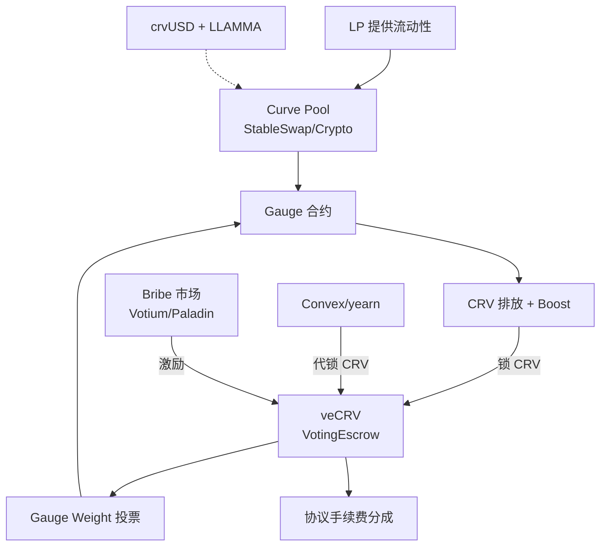
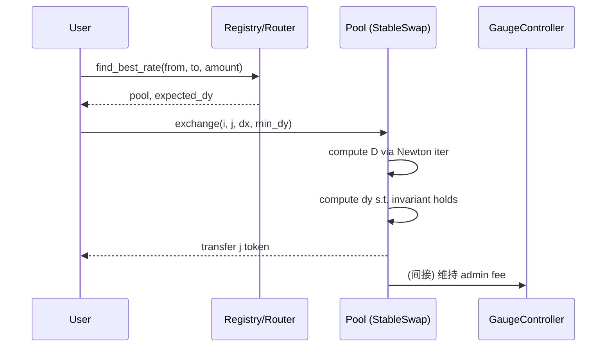

# Curve StableSwap 与 Cryptoswap（含 veCRV 治理）

> **TL;DR**：Curve Finance 由俄裔物理学家 Michael Egorov 于 2020-01 上线，核心创新是 **StableSwap 不变式**——一种在锚点附近近似 Constant Sum、在远端退化为 Constant Product 的混合做市公式，使稳定币及相关资产（ETH/stETH、BTC/WBTC）在 $1 peg 附近达到极高深度与极低滑点。2021-06 发布 **Cryptoswap（Curve V2）** 扩展到非锚定资产，引入 **动态 peg**（internal oracle）、二次型损失函数与重新加权算法。其 **veCRV 治理**（2020-08 引入）把 CRV 锁仓转换为投票与 boost 权，Gauge 系统按 veCRV 投票分配 CRV 排放；由此诞生了 Convex Finance（2021-05）与"Curve War"——各稳定币项目为保护 peg 争夺 veCRV 贿赂。本篇覆盖 StableSwap/Cryptoswap 数学、Gauge/Bribe 机制、crvUSD 的 LLAMMA 清算、以及 2023-07 Vyper 编译器漏洞。

---

## 1. 背景与动机

2020 年初 DeFi 稳定币 swap 面临痛点：在 Uniswap V2 上 USDC/USDT 价格 $1 附近滑点高（CPMM 曲线平坦度差）、LP 手续费被套利者快速蚕食。Egorov 在 [StableSwap Paper (2019)](https://curve.fi/files/stableswap-paper.pdf) 提出：稳定币间应基于"**相等最优**"的数学曲线——当池中资产等量时趋近常和，偏离时才退化为常积，以兼顾低滑点与抗清空。

Curve V2（Cryptoswap）进一步把模型推广到高波动资产对——通过在线 EMA 价格预言机重新定位 peg 中心，使不变式总能让做市围绕当前市场价展开。这使 Curve 能同时承载 `tricrypto (USDT/WBTC/ETH)`、`crvCVX`、`stETH/frxETH` 等多种形态。

## 2. 核心原理

### 2.1 StableSwap 不变式（形式化定义）

对 n 种"可兑换"资产，定义：

```
A · n^n · Σx_i + D = A · D · n^n + D^(n+1) / (n^n · Π x_i)
```

其中：

- `x_i` 为第 i 种资产余额（归一化到同精度）；
- `D` 为"总不变流动性"（近似等于池总价值）；
- `A` 为 **amplification coefficient**，控制曲线在 peg 附近逼近常和的程度。

极限：

- `A → 0`：退化为 Uniswap CPMM `Π x_i = const`。
- `A → ∞`：逼近常和 `Σ x_i = const`（零滑点但易被清空）。

`A` 典型取值：3pool（DAI/USDC/USDT）为 100–2000，需 DAO 提案逐步调整（`ramp_A`）。

### 2.2 Cryptoswap（Curve V2）

Cryptoswap 把 StableSwap 推广到非锚定对，通过**内部 EMA 价格预言机**维护 `price_scale`，把资产余额以 `x'_i = x_i · price_scale_i` 重新缩放，再套用改进不变式（二次型损失 + gamma 参数）。当池内实际价格偏离 `price_scale` 超过阈值，算法触发"重新加权"，把 LP 损失限制在可控范围并按 EMA 收敛到新 peg。

```
K0 = (∏ x'_i) · n^n / D^n
K = A · K0 · gamma^2 / (gamma + 1 - K0)^2
K · D^(n-1) · Σx'_i = K · D^n + (D/n)^n  (简化示意)
```

`gamma` 控制从常和到常积过渡的"柔软度"，`A` 仍是振幅。

### 2.3 子机制

#### 2.3.1 LP 与赎回

LP 按存入资产比例或偏离比例铸造 `LP token`（即 pool 对应的 ERC20，如 `3CRV`）。支持**单边退出**（withdraw_one_coin），代价是承担 imbalance 引起的滑点。

#### 2.3.2 Gauge 与 veCRV

`CRV` 总量 3.03 亿，每日 ~574k 线性释放。持有者将 CRV 锁定至 `VotingEscrow` 合约（锁 1 周 – 4 年），得到 `veCRV` 数量 = `CRV · t_left / t_max`。veCRV 作用：

1. 投票（Snapshot + 链上 Gauge Weight）决定每个 pool 获得多少 CRV 排放；
2. 对 LP 提供最多 **2.5× boost**（按 veCRV 比例）；
3. 分享协议手续费（50% 交易费给 veCRV 持有者）。

Bribe 市场（Votium、Convex、Hidden Hand、Paladin Quest）让稳定币项目用代币收买 veCRV 投票。Convex Finance 通过接受用户存入的 CRV 永久锁仓为 veCRV，并发行 cvxCRV 给用户，将 boost 与投票权集中化——其一度掌控 50%+ 的 veCRV。

#### 2.3.3 crvUSD 与 LLAMMA

crvUSD（2023-05 上线）是 Curve 自有 CDP 稳定币，采用 **LLAMMA（Lending-Liquidation AMM Algorithm）**：把抵押物分段 deposit 到一系列价格带（bands），价格下行时抵押物被**自动以 AMM 方式逐档转换为 crvUSD**（而非一次性清算）；上行恢复可逆转。相比 Aave/MakerDAO 一次性清算折价，LLAMMA 把清算分散为连续过程，降低极端行情下的坏账与罚金。

#### 2.3.4 手续费与 Admin Fee

- Swap Fee：Stable pool 0.04%（`fee=4e6`），Crypto pool 动态。
- Admin Fee：50% 给 veCRV，50% 留 LP。
- Halborn/池级别 kill-switch 由 DAO 控制。

### 2.4 参数与常量

| 参数 | 典型值 | 备注 |
| --- | --- | --- |
| A（3pool） | 2000 | 经多次 ramp 逐步提高 |
| gamma（tricrypto） | 1.45e-5 | 控制 CPMM 过渡 |
| fee（Stable） | 4 bp | 0.04% |
| fee（Crypto） | 5–50 bp 动态 | EMA 波动率相关 |
| mid_fee / out_fee | 5bp / 45bp | Crypto pool |
| LP boost 上限 | 2.5x | 需足够 veCRV |
| Lock 最长时间 | 4 年 | veCRV 权衰减 |

### 2.5 边界条件 / 失败模式

- **Depeg 风险**：若池中某资产永久脱锚（如 2023-03 USDC 因 SVB 暂时跌至 0.87），LP 会被动持有大量贬值资产。
- **A 突然调整**：`ramp_A` 若过快可造成套利损失。
- **Oracle Re-entrancy**：2022-07 起部分池内 EMA 读取被第三方合约误用，演化为 2023-07 Vyper re-entrancy 漏洞（见 §7）。
- **Gauge 权重攻击**：无 veCRV 门槛的小 Gauge 可能被游说方轻易提高排放，2022 Mochi、Curve 内部激烈博弈。

### 2.6 Mermaid：Curve 生态全景



## 3. 架构剖析

### 3.1 分层视图

| 层 | 模块 | 说明 |
| --- | --- | --- |
| 资产层 | ERC20 代币 | 稳定币、LST、包装 BTC |
| 池层 | StableSwap / Cryptoswap / TriCrypto / Meta pool | Vyper 合约，每池一实例 |
| 聚合层 | Metapool / Factory / Registry | 允许组合（如 FRAX/3CRV） |
| Gauge 层 | LiquidityGauge, GaugeController | 分配 CRV 排放 |
| 治理层 | VotingEscrow + Aragon DAO + Ownership | 参数调节 |
| 生态层 | Convex、yearn、Bribe 平台 | 聚合 veCRV |
| 稳定币 | crvUSD + LLAMMA Controller | 原生 CDP |

### 3.2 核心模块清单

| 模块 | 职责 | 路径 |
| --- | --- | --- |
| `StableSwap.vy` | StableSwap 不变式与交易 | `curvefi/curve-contract/contracts/pools/3pool/StableSwap3Pool.vy` |
| `CryptoSwap.vy` | V2 非稳定池 | `curvefi/curve-crypto-contract/contracts/CurveCryptoSwap.vy` |
| `Factory` | 无许可创建 meta / pool | `curvefi/curve-factory` |
| `GaugeController.vy` | 汇总 veCRV 投票 | `curve-dao-contracts/contracts/GaugeController.vy` |
| `VotingEscrow.vy` | CRV 锁仓 | `curve-dao-contracts/contracts/VotingEscrow.vy` |
| `LiquidityGauge.vy` | 质押 LP、分配 CRV | `curve-dao-contracts/contracts/gauges/LiquidityGaugeV5.vy` |
| `Minter.vy` | CRV 排放 | `curve-dao-contracts/contracts/Minter.vy` |
| `crvUSD Controller` | LLAMMA 借贷 | `curve-stablecoin/contracts/Controller.vy` |
| `AMM.vy (LLAMMA)` | 逐 band 清算 | `curve-stablecoin/contracts/AMM.vy` |

### 3.3 数据流：一次 swap



耗时：Ethereum mainnet 一笔 3pool swap 约 80k gas。

### 3.4 实现多样性

- 官方用 **Vyper** 实现（合约可读性与 Gas 更优）；crvUSD 仍然 Vyper。
- 社区分叉：Saddle Finance（Solidity 版 StableSwap）、Ellipsis（BSC 分叉）、Platypus（Avalanche 单边 StableSwap 变体）。
- 跨链部署：Ethereum、Arbitrum、Optimism、Base、Polygon、Fantom、Avalanche、Gnosis 等。

### 3.5 扩展接口

- `Registry` 提供 `find_pool_for_coins`, `get_coins`, `get_balances` 统一查询。
- `MetaRegistry` 合并多版本 factory。
- Curve API：`https://api.curve.fi/api/getPools` 获取 TVL、APY、Gauge 权重。
- Convex `Booster.deposit(pid, amount, stake)` 即实现一键代锁。

## 4. 关键代码 / 实现细节

StableSwap get_D 的 Newton 迭代（`curvefi/curve-contract` tag `v1.0`，`StableSwap3Pool.vy:250-300`）：

```python
@view
@internal
def get_D(_xp: uint256[N_COINS], _amp: uint256) -> uint256:
    S: uint256 = 0
    for _x in _xp:
        S += _x
    if S == 0:
        return 0
    D: uint256 = S
    Ann: uint256 = _amp * N_COINS
    for _i in range(255):
        D_P: uint256 = D
        for _x in _xp:
            D_P = D_P * D / (_x * N_COINS)   # 防止除零由上方 S==0 已排除
        Dprev: uint256 = D
        D = (Ann * S + D_P * N_COINS) * D / ((Ann - 1) * D + (N_COINS + 1) * D_P)
        if D > Dprev:
            if D - Dprev <= 1:
                return D
        else:
            if Dprev - D <= 1:
                return D
    raise "did not converge"
```

veCRV 锁仓权重衰减（`curve-dao-contracts/contracts/VotingEscrow.vy:220-260`，简化）：

```python
@external
def create_lock(_value: uint256, _unlock_time: uint256):
    unlock_time: uint256 = (_unlock_time / WEEK) * WEEK  # 按周取整
    assert _value > 0
    assert unlock_time > block.timestamp
    assert unlock_time <= block.timestamp + MAXTIME  # 4 年
    # ... bias/slope 线性下降，到期归零
```

## 5. 演进与版本对比

| 时间 | 里程碑 |
| --- | --- |
| 2020-01 | StableSwap 主网 |
| 2020-08 | veCRV / Gauge 上线 |
| 2021-05 | Convex 启动 Curve War |
| 2021-06 | Cryptoswap（V2）上线 |
| 2022-03 | Tricrypto V2（USDT/WBTC/ETH）升级 |
| 2023-05 | crvUSD + LLAMMA 启动 |
| 2023-07 | Vyper 0.2.15/0.2.16/0.3.0 编译器 re-entrancy 漏洞，约 6100 万美元损失 |
| 2023–2024 | 跨链部署扩展、tricrypto-ng 优化 |
| 2025 | LLAMMA-V2、RWA 合作（Elixir、Monerium） |

## 6. 实战示例

与 3pool 交互（ethers.js）：

```js
const pool = new Contract(THREEPOOL, THREEPOOL_ABI, signer);
// 将 1000 USDC 换 DAI，i=1 (USDC), j=0 (DAI)
await usdc.approve(THREEPOOL, parseUnits("1000", 6));
const dy = await pool.get_dy(1, 0, parseUnits("1000", 6));
await pool.exchange(1, 0, parseUnits("1000", 6), dy * 995n / 1000n); // 0.5% 容忍
```

锁 CRV 得 veCRV：

```js
const ve = new Contract(VE_CRV, VE_ABI, signer);
await crv.approve(VE_CRV, parseEther("1000"));
await ve.create_lock(parseEther("1000"), Math.floor(Date.now()/1000) + 4*365*86400);
// 可立即在 Curve DAO 前端投票 Gauge weight
```

## 7. 安全与已知攻击

- **2020-11 iron bank 无关事件**——Curve 未直接受影响。
- **2022-02 Egorov 个人钱包 CRV 大额抵押**导致 Aave 面临坏账担忧（非合约漏洞，但治理/流动性风险事件）。
- **2023-07 Vyper 编译器 re-entrancy**：Vyper 0.2.15/0.2.16/0.3.0 生成的 `nonreentrant` lock 在某些场景下失效，攻击者通过 `exchange + raw_call` 构造重入，aETH/msETH/alETH/CRV/ETH 等多池被抽走约 6100 万美元。Curve 与 c0ffeebabe.eth 等白帽追回大部分。事件引发 CRV 价格与 Egorov 个人杠杆连锁反应，最终由 Justin Sun 等场外收购缓解。
- **LP imbalance 套利**：当池极度失衡时，`exchange` 反向操作者可获取额外收益；参数调整需渐进。

## 8. 与同类方案对比

| 维度 | Curve V1 | Curve V2 | Uniswap V3 CL | Balancer Stable |
| --- | --- | --- | --- | --- |
| 适用 | 锚定资产 | 弱相关资产 | 通用 | 加权锚定 |
| 滑点（peg 附近） | 极低 | 低 | 需 LP 主动集中 | 低 |
| LP 被动性 | 高 | 中 | 低（需管理区间） | 高 |
| 治理代币 | CRV/veCRV | CRV/veCRV | UNI | BAL/veBAL |
| 清算/稳定币 | crvUSD | crvUSD | 无原生 | 无原生 |

## 9. 延伸阅读

- [StableSwap Paper (Egorov, 2019)](https://curve.fi/files/stableswap-paper.pdf)
- [Curve V2 Crypto Pools Paper](https://curve.fi/files/crypto-pools-paper.pdf)
- [curve.readthedocs.io](https://curve.readthedocs.io/)
- [Convex Finance Docs](https://docs.convexfinance.com/)
- [Rekt: Vyper Reentrancy](https://rekt.news/curve-vyper-rekt/)
- a16z: *The Curve Wars* 系列
- B 站：Curve 数学推导视频

## 10. 术语表

| 术语 | 英文 | 释义 |
| --- | --- | --- |
| StableSwap | StableSwap | Curve V1 的混合不变式 |
| Amplification | A | 控制常和/常积过渡强度 |
| Cryptoswap | Cryptoswap | Curve V2 动态 peg AMM |
| veToken | Vote-Escrowed Token | 锁仓获得治理加权 |
| Gauge | Gauge | 分配排放的 LP 质押合约 |
| Bribe | Bribe | 向 veToken 持有者支付激励 |
| LLAMMA | Lending-Liquidation AMM | crvUSD 的逐 band 清算机制 |
| Metapool | Metapool | 嵌套 pool（如 X/3CRV） |

---

*Last verified: 2026-04-22*
