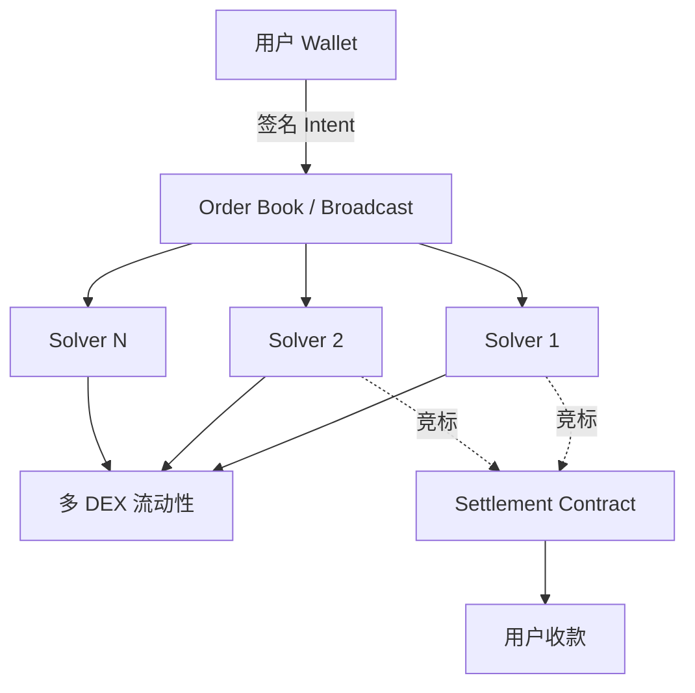
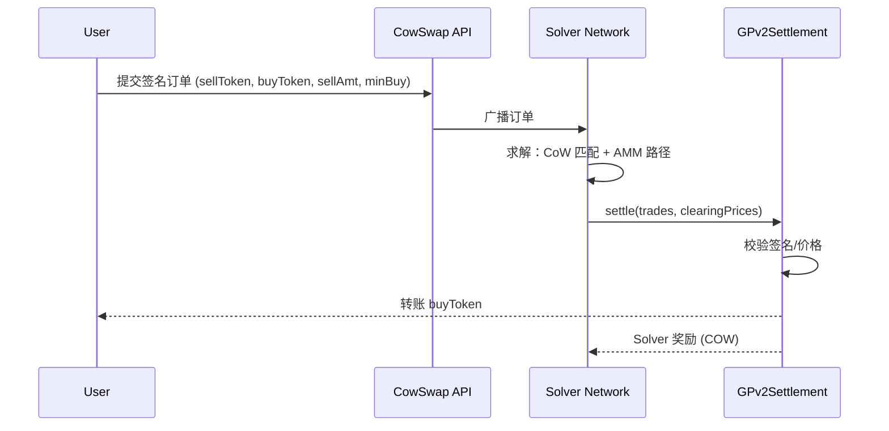
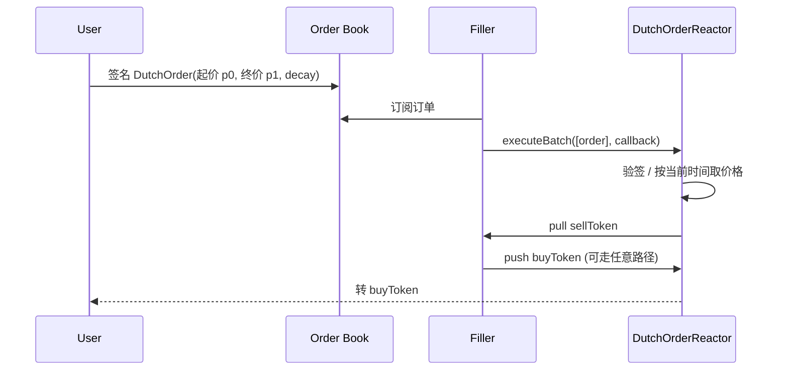

# DEX 聚合器（1inch / Jupiter / Odos / CowSwap / Matcha / UniswapX）

> **TL;DR**：DEX 聚合器的职责是 **在多个链上/链下流动性源之间寻找最优成交路径**，并负责 MEV 保护、Gas 优化、签名授权、结算撮合。其核心技术栈包括 **路径寻优（Pathfinder）**、**批量撮合（Batch Auction）**、**Intent + Solver**、**RFQ（PMM）询价**、**私有 Mempool / Order Flow Auction**。以生态视角看：**1inch**（2019，EVM）、**Paraswap**、**0x / Matcha**、**KyberSwap** 代表经典"Smart Order Router + on-chain Router"；**CowSwap**（2021）首创链上批量撮合 + CoW（Coincidence of Wants）+ Solver 竞拍；**Uniswap X**（2023）将签名 Dutch Auction 订单开放给 Filler；**Odos**（2022）强调 SOR v2 的线性规划求解；**Jupiter**（Solana 2021 至今主导）、**OpenOcean**、**DeFiLlama Meta-Aggregator** 亦各具特色。2024–2026 年 Intent 与 Order Flow Auction（OFA）成为主流，超过 30% 的 Ethereum 现货成交来自 Intent 层。

---

## 1. 背景与动机

当链上 AMM 与订单簿数量爆炸（仅 Ethereum 已超过 200 个主流 DEX），用户单独使用任一前端会面临：

1. **价格次优**：单池深度有限，大额单需要拆单；
2. **Gas 冗余**：多跳 swap 若手动执行需多笔交易、多次 approve；
3. **MEV 损失**：公共 mempool 中 sandwich 攻击普遍；
4. **授权复杂**：每个协议都需要 approve，存在过度授权风险。

聚合器解决方案：**把寻路、授权、签名、执行四者打包**。早期（2019–2021）聚合器是"多跳 Router"式合约；2022 后进入"**Intent-centric**"范式——用户签名声明"我想换到多少最少"，由链下 Solver 竞标实现。

## 2. 核心原理

### 2.1 形式化定义：最优路径问题

给定流动性图 `G = (V, E)`，节点为代币，边为 `pool_i`（含深度/费率），用户希望 `tokenIn` → `tokenOut` 最大化 `amountOut(Σ splits)`。这是 **有约束的非凸路径优化**：

```
max_{x_e} f(x_e)   s.t.  Σ x_e = amountIn,  x_e ≥ 0
```

其中 `f(x_e)` 是多段 AMM 曲线的组合产出。现实中使用：

- **Bellman-Ford / Dijkstra 变体**（1inch Pathfinder v1）；
- **线性规划松弛 + 分支定界**（Odos SOR v2）；
- **启发式拆单 + 模拟**（Jupiter v6）；
- **链下 Solver 通用优化**（CowSwap、UniswapX）。

### 2.2 关键算法 / 数据结构

- **Quote Graph**：每条边附带价格函数 `q_e(x) = amountOut / amountIn`，线性化后可用 MIP 求解。
- **Piecewise Linear Approximation**：对 CPMM/CLMM 曲线按 tick 或等分进行分段线性化，减少求解复杂度。
- **RFQ Orderbook**：做市商（Wintermute、Kronos、DWF）通过签名报价快照提供即时成交价，聚合器以 RFQ 为 tie-breaker。
- **Batch Auction**：同一批次内所有订单使用统一结算价 `p*`，消除同批次 front-run。
- **Signed Order（EIP-712）**：用户签名中携带 `permit`、`deadline`、`nonce`、`minOut`，Solver 在链上执行。

### 2.3 子机制拆解

#### 2.3.1 Smart Order Router（SOR）

核心是"拆单 + 路径并行"。1inch Pathfinder v2（2021）号称能在链下毫秒级计算 10+ 条路径的最优组合；Odos v2 采用 SOR v2 在路径优化上支持 **同池多段路径**与**跨池 split**。

#### 2.3.2 CoW（Coincidence of Wants）

当批次中存在反向订单 A→B 与 B→A，可直接内部撮合、无需链上 AMM，省去 AMM 手续费与 MEV。CoW Protocol 2021 首次将 CoW 产品化。

#### 2.3.3 Solver 竞拍 / Order Flow Auction

Intent 被广播到 Solver 网络，Solver 竞标能为用户返回最优解的执行方案，中标者获取执行权与可能的"surplus"奖励。UniswapX、CowSwap、Anoma、1inch Fusion、0x v2 均采用此模型。

#### 2.3.4 RFQ / PMM（Private Market Maker）

对大额订单优先查询做市商 RFQ。若 RFQ 报价 > AMM 路径，直接走 RFQ；无需动用公共流动性，保护对手方隐私。

#### 2.3.5 MEV 保护

- **私有 mempool**：Flashbots Protect、MEV Blocker、Eden Network。
- **Batch Settlement**：CowSwap 批次内所有订单同价，Sandwich 无利可图。
- **Dutch Auction**：UniswapX 的起始高价逐步下探，Filler 竞速 fill 锁定价差。
- **封装交易（encrypted mempool）**：Shutter、SUAVE 前沿。

### 2.4 参数与常量

| 参数 | 典型值 | 说明 |
| --- | --- | --- |
| SOR 最大路径数 | 1inch Pathfinder v2: 100+ | 毫秒级求解 |
| Pathfinder 最大拆分 | 1inch: 20 部分 | 每部分可走不同路径 |
| CowSwap 批次间隔 | ~30s | 按新块聚合 |
| UniswapX Decay | 数十秒至 5 min | Dutch 起始 → 结束价 |
| Solver 中标费 | 0–0.5% surplus | 协议设计而定 |
| RFQ 报价有效期 | 10–60s | 做市商风控 |

### 2.5 边界条件 / 失败模式

- **深度不足**：大额（>$10M）仍可能只能走 RFQ 或场外。
- **链下 Solver 作恶**：若唯一 Solver，可能不递交或收取过高 surplus；需要多 Solver 竞争 + 链上 `minOut` 硬约束。
- **过期订单**：Dutch Auction 未被 fill 会过期，用户需重签；前端 UX 承担。
- **跨链聚合**：需配合桥 + Solver，引入桥风险（见 LayerZero/Chainlink CCIP 文档）。

### 2.6 Mermaid：Intent-based 聚合架构



## 3. 架构剖析

### 3.1 分层视图

| 层 | 职责 | 典型实现 |
| --- | --- | --- |
| 订单层 | 接收用户 Intent/Quote | CowSwap API、UniswapX Order Book、1inch API |
| 求解层 | 寻路、拆单、优化 | 1inch Pathfinder、Odos SOR、Jupiter Quote |
| Solver 网络 | 竞标 + 链下构造 calldata | CowSwap Solvers、UniswapX Fillers |
| 结算合约 | 链上执行、签名校验、支付 | CowSwap `GPv2Settlement`、UniswapX `DutchOrderReactor` |
| 流动性源 | AMM/RFQ | Uniswap、Curve、Balancer、1inch PMM、Hashflow |

### 3.2 核心模块清单

| 模块 | 项目 | 路径 / 合约 |
| --- | --- | --- |
| `GPv2Settlement.sol` | CowSwap | `cowprotocol/contracts:src/contracts/GPv2Settlement.sol` |
| `DutchOrderReactor.sol` | UniswapX | `Uniswap/UniswapX:src/reactors/DutchOrderReactor.sol` |
| `AggregationRouterV6.sol` | 1inch | `1inch/limit-order-protocol-v4` / Router V6 |
| `FusionResolver` | 1inch Fusion | off-chain solver + on-chain settler |
| Jupiter Aggregator | Jupiter (Solana) | `jup-ag/jupiter-core`（Rust） |
| `OdosRouterV2.sol` | Odos | `odos-xyz/odos-router-v2` |
| `0x ExchangeProxy` | 0x/Matcha | `0xProject/protocol:contracts/zero-ex/contracts/src/ZeroEx.sol` |
| `KyberSwap Meta Aggregator` | Kyber | `KyberNetwork/ks-aggregator-router` |

### 3.3 数据流：一次 CowSwap 订单



一次 UniswapX 订单：



### 3.4 实现多样性

- **EVM**：1inch（Solidity）、CowSwap（Solidity，使用 Gnosis Safe 管理 settlement ownership）、UniswapX（Solidity + Permit2）、0x、Paraswap、KyberSwap、Odos。
- **Solana**：Jupiter（Rust）、OpenBook Aggregator、Prism。
- **Cosmos/IBC**：Squid（基于 Axelar + Osmosis）、Skip API。
- **Meta-Aggregator**：DeFiLlama Meta-Agg 比较上述聚合器报价。

### 3.5 扩展 / 互操作接口

- **Permit2 / EIP-2612**：签名授权。
- **API**：1inch `/v6.0/{chainId}/quote`、CowSwap `/api/v1/orders`、Jupiter `/v6/quote`、UniswapX Order Book `/orders`。
- **Solver SDK**：CowSwap solver-rs、UniswapX artemis-solver 模板。
- **Subgraph**：CowSwap、UniswapX、1inch 均提供 The Graph 索引。

## 4. 关键代码 / 实现细节

CowSwap 结算函数（`cowprotocol/contracts` tag `v1.6`，`src/contracts/GPv2Settlement.sol:120-185`，简化）：

```solidity
function settle(
    IERC20[] calldata tokens,
    uint256[] calldata clearingPrices,
    GPv2Trade.Data[] calldata trades,
    GPv2Interaction.Data[][3] calldata interactions
) external nonReentrant onlySolver {
    executeInteractions(interactions[0]);                   // setup: approve/deposit
    GPv2Transfer.Data[] memory inTransfers = _processTrades(tokens, clearingPrices, trades);
    _executeTransfers(inTransfers);                          // 拉取 sell token
    executeInteractions(interactions[1]);                   // 执行外部 swap / CoW
    _executeTransfers(_buyTransfers);                        // 按 clearingPrice 支付
    executeInteractions(interactions[2]);                   // cleanup
    emit Settlement(msg.sender);
}
```

UniswapX Dutch Auction 价格衰减（`Uniswap/UniswapX` tag `v1.0.0`，`src/lib/NonlinearDutchDecayLib.sol` / `DutchDecayLib.sol`，简化）：

```solidity
function decay(uint256 startAmount, uint256 endAmount, uint256 startTime, uint256 endTime) internal view returns (uint256) {
    if (block.timestamp <= startTime) return startAmount;
    if (block.timestamp >= endTime) return endAmount;
    uint256 elapsed = block.timestamp - startTime;
    uint256 duration = endTime - startTime;
    // 线性插值：startAmount → endAmount
    if (startAmount > endAmount) {
        return startAmount - (startAmount - endAmount) * elapsed / duration;
    } else {
        return startAmount + (endAmount - startAmount) * elapsed / duration;
    }
}
```

## 5. 演进与版本对比

| 阶段 | 代表 | 特征 |
| --- | --- | --- |
| 2019–2020 Router 时代 | 1inch V1/V2, Paraswap V1, 0x API | 链下寻路 + 链上 Router |
| 2021 拆单优化 | 1inch Pathfinder v2, Matcha RFQ | 多路径并行、PMM |
| 2021 Batch + CoW | CowSwap | 批次统一价、CoW、Solver 竞拍 |
| 2023 Intent 化 | UniswapX、1inch Fusion、0x v2 | Signed order + Auction |
| 2024–2026 OFA / 跨链 | MEV-Share、SUAVE、Across Intent | Cross-domain solver |

## 6. 实战示例

调用 1inch v6 API 做 100 USDC → ETH 询价 + 交易：

```bash
curl "https://api.1inch.dev/swap/v6.0/1/quote?src=$USDC&dst=$WETH&amount=100000000" -H "Authorization: Bearer $KEY"
```

CowSwap 下单（ethers.js，签名 EIP-712）：

```ts
const order = {
  sellToken: USDC,
  buyToken: WETH,
  sellAmount: parseUnits("1000", 6).toString(),
  buyAmount: "300000000000000000",
  validTo: Math.floor(Date.now()/1000)+1800,
  appData: ZERO32,
  feeAmount: "0",
  kind: "sell",
  partiallyFillable: false,
  receiver: me,
  sellTokenBalance: "erc20",
  buyTokenBalance: "erc20",
};
const sig = await signer._signTypedData(domain, types, order);
await fetch("https://api.cow.fi/mainnet/api/v1/orders", { method: "POST", body: JSON.stringify({ ...order, signature: sig })});
```

Jupiter v6 Solana：

```ts
const quote = await (await fetch(`https://quote-api.jup.ag/v6/quote?inputMint=${USDC}&outputMint=${SOL}&amount=1000000000`)).json();
const { swapTransaction } = await (await fetch("https://quote-api.jup.ag/v6/swap", { method: "POST", body: JSON.stringify({ quoteResponse: quote, userPublicKey: me })})).json();
```

## 7. 安全与已知攻击

- **KyberSwap（2023-11）**：Elastic Pool 数学边界漏洞，~4800 万美元；非聚合器本体，但影响主流聚合结果。
- **1inch 路由（2022）**：因对可回调代币处理不当被恶意代币挖，后加入 `TokenWithABI` whitelist。
- **0x 相关第三方集成漏洞**：Indexed Finance 2021 用 0x 引擎跨池套利被利用（根因为池设计，非 0x）。
- **前端伪造**：CoW Swap 前端 2023 曾被域名抢注；官方建议核验合约地址。
- **Solver MEV**：Solver 可在自身节点批次内占优，OFA 设计需保证拍卖公开可验证。

## 8. 与同类方案对比

| 维度 | 1inch | CowSwap | UniswapX | Jupiter | Odos |
| --- | --- | --- | --- | --- | --- |
| 模型 | Pathfinder + Fusion | Batch + CoW | Dutch Auction | Pathfinder (SOL) | LP SOR v2 |
| MEV 保护 | Fusion 模式强 | 强（Batch） | 强（签名订单） | 中 | 中 |
| 跨链 | 原生 Fusion+ | 通过 Superchain | UniswapX Cross-chain | 仅 Solana | 多链（EVM） |
| 费用 | 0 前端费（API Tier） | Solver surplus 分成 | 0（Filler 承担） | 0.1–0.85% 平台费 | 0（surplus） |
| 代币 | 1INCH | COW | UNI（未激励聚合） | JUP | 无 |

## 9. 延伸阅读

- [1inch Docs](https://docs.1inch.io/)
- [CowSwap Docs](https://docs.cow.fi/)
- [UniswapX Whitepaper](https://docs.uniswap.org/contracts/uniswapx/overview)
- [Jupiter Station](https://station.jup.ag/)
- [Odos SOR v2 Post](https://medium.com/odos-protocol)
- Flashbots: *The future of MEV is SUAVE*
- Paradigm: *Intent-centric Protocols*

## 10. 术语表

| 术语 | 英文 | 释义 |
| --- | --- | --- |
| 路径寻优 | Smart Order Router | 在多 DEX 寻找最优成交路径 |
| 意图 | Intent | 声明式交易，由 Solver 执行 |
| CoW | Coincidence of Wants | 批次内反向订单直接撮合 |
| 求解者 | Solver | 链下竞标者 |
| 填单者 | Filler | UniswapX 中执行 order 的角色 |
| 私有撮合 | RFQ / PMM | 做市商签名报价 |
| 订单流拍卖 | Order Flow Auction | 用户订单拍卖给搜索者 |
| Dutch Auction | Dutch Auction | 价格随时间单调下降的订单形式 |

---

*Last verified: 2026-04-22*
