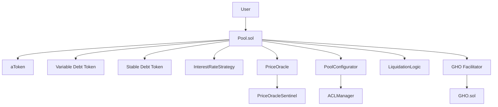
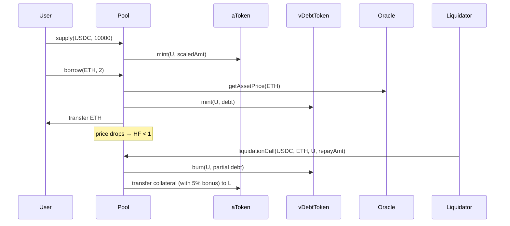

# Aave 借贷（V1/V2/V3/V4、利率模型、eMode、GHO）

> **TL;DR**：Aave 由 Stani Kulechov 创立（前身 ETHLend 2017，2020-09 品牌重塑为 Aave），是 DeFi 最大超额抵押借贷协议之一。**V1**（2020-01）定型"池式共用流动性 + aToken 计息"模型；**V2**（2020-12）引入债务代币化、信用委托、稳定/浮动双利率、闪电贷 Batch；**V3**（2022-03）是迄今最重要的一版，带来 **Portal 跨链**、**eMode 高效模式**、**Isolation Mode 隔离资产**、**Supply Cap / Borrow Cap**、**Siloed Borrowing**、**Price Oracle Sentinel**、Gas 优化约 20–25%；**V4**（2024–2026 渐进发布）引入 **Hub-and-Spoke 架构**、**统一流动性层**、**动态利率模型**、**Umbrella 风险保险**、GHO 深度整合。此外 **GHO**（2023-07 上线）是 Aave 原生 CDP 稳定币，由 Aave 治理控制利率与 Facilitator。截至 2026-04，Aave 跨 12 条链 TVL 约 180–200 亿美元，是 DeFi 蓝筹。

---

## 1. 背景与动机

在 Compound 确立"池式借贷"雏形后，Aave V1 的差异化包含：

- **多资产池**（当时 Compound 仅 ~10 种资产）；
- **Flash Loan**（2020 首创）——解锁套利、再融资、治理攻击等闭环交易；
- **稳定利率选项**（借款人可锁定利率，对冲利率波动）。

V2 的目标是产品化与资本效率；V3 的目标则是 **风险隔离 + 跨链 + Gas 降本**，为机构资金提供类 Basel 的"分层风险"框架；V4 的目标是 **降耦合**：把流动性、利率、风险参数各自抽象为独立模块，便于未来接入 RWA、LRT 和跨链 Hub。

## 2. 核心原理

### 2.1 形式化定义：利率与健康因子

对资产 `a`，定义：

- `S_a`：供应量；`B_a`：借款量；
- 利用率 `U_a = B_a / S_a`；
- 借款利率：

```
R_b(U) = R_0 + (U / U_opt) · R_slope1             if U ≤ U_opt
       = R_0 + R_slope1 + (U − U_opt)/(1 − U_opt) · R_slope2    if U > U_opt
```

- 供应利率：`R_s = U · R_b · (1 − reserveFactor)`。
- 储备因子 `reserveFactor`（如 10–25%）留作 DAO 国库。

**健康因子**：

```
HF = Σ_i (collateral_i · price_i · LT_i) / Σ_j (debt_j · price_j)
```

`HF < 1` 时触发清算。`LT` 为 Liquidation Threshold（清算门槛，例如 USDC 为 0.78），`LTV` 为最大借贷比（例如 0.75）。

### 2.2 关键数据结构

- **Pool**：聚合所有资产；每资产维护 `ReserveData`：
  - `liquidityIndex / variableBorrowIndex`（累积复利乘子）；
  - `currentLiquidityRate / currentVariableBorrowRate / currentStableBorrowRate`；
  - `aTokenAddress / variableDebtTokenAddress / stableDebtTokenAddress`；
  - `configuration`：一个打包的 uint256（bitmap）存 LTV/LT/bonus/cap/frozen/paused 等。
- **aToken**：ERC20，用户存款凭证，`balanceOf = scaledBalance · liquidityIndex / RAY`。
- **variableDebtToken**：债务计息代币，不可转让。
- **stableDebtToken**：稳定利率债务，记录借款时的利率快照。
- **UserConfiguration**：bitmap，记录用户每种资产的"抵押 / 借入 / 隔离"状态。

### 2.3 子机制

#### 2.3.1 利率模型（Interest Rate Strategy）

V3 每资产对应一个 `DefaultReserveInterestRateStrategy` 合约，参数在 DAO 可升级。利率模型在 `U_opt`（如稳定币 90%、ETH 80%）出现拐点，高于拐点迅速飙升以抑制利用率。

#### 2.3.2 eMode（High Efficiency Mode）

当借款人抵押与借款均属"同一类别"（如 ETH ↔ stETH ↔ cbETH ↔ rETH 共属 "ETH-correlated" e-mode）时，协议允许 **更高的 LTV（如 93%）与 LT**，因为类内价格高度相关。适用场景：stETH leveraged staking、稳定币循环借贷。

#### 2.3.3 Isolation Mode

新上线资产作为"隔离抵押物"时，借款人仅能借指定白名单的稳定币、有单独 debt ceiling（例如 $10M），避免个别长尾资产危及整池。

#### 2.3.4 Siloed Borrowing

某些高风险资产只允许作为"单一借款"存在，即用户借该资产期间不能再借其他资产，限制风险扩散（如 2024 年早期的 wstETH 上线阶段）。

#### 2.3.5 Flash Loan

`flashLoan` 与 `flashLoanSimple`：单次交易借出任意池内资产，要求在同笔交易内还本金 + 0.05% 手续费，否则 revert。用例：清算、抵押物置换、治理套利。

#### 2.3.6 Portal（V3 跨链）

V3 Portal 允许协议借桥梁将 aToken 在不同网络间"传送"（需有特许 Portal 合约，如 Chainlink CCIP / Wormhole），但需治理授权。

#### 2.3.7 Price Oracle Sentinel & Risk Admins

在 L2 或新上线资产，若发现预言机暂停/异常，`PriceOracleSentinel` 可延迟清算、禁止借款，避免坏账。

#### 2.3.8 GHO 稳定币

GHO 由 Aave V3 作为 Facilitator 无抵押铸造——用户抵押资产后直接 `borrow GHO`，利率由 AaveDAO 设置（2024 年约 7%），借款时 GHO 全部铸出、还款时销毁。Aave 讨论 Sky/Maker DSR 式的 stkGHO / sGHO（储蓄合约）。

### 2.4 参数与常量

| 参数 | 典型值 | 说明 |
| --- | --- | --- |
| WETH LTV / LT / Bonus | 80 / 82.5 / 5% | V3 Ethereum |
| USDC LTV / LT | 75 / 78 | 稳定币典型 |
| stETH eMode LTV / LT | 93 / 95 | ETH-correlated |
| `U_opt` 稳定币 | 90% | 利率拐点 |
| Flash Loan Fee | 0.05% | 可由 DAO 调 |
| reserveFactor | 10–25% | 入国库比例 |
| closeFactor | 50% | 单次清算最多 50% 债务 |
| liquidationBonus | 5–10% | 清算人折扣奖励 |

### 2.5 边界条件 / 失败模式

- **抵押物恶性下跌 + 堵链**：清算队列可能失败，产生坏账（2020-03 ETH 闪崩导致 MakerDAO 出现 0 DAI 拍卖；Aave 后续引入 `isolated` + `borrowable in isolation` + `ceiling`）。
- **治理攻击**：V1/V2 依赖 AAVE + stkAAVE 投票；V3 延续 Timelock + Executor 双层。
- **CRV 做空事件（2022-11）**：Avraham Eisenberg 试图做空 CRV 致坏账边界；Aave DAO 紧急冻结 CRV 借款并设 borrow cap。
- **Oracle Delay**：借助 PriceOracleSentinel 避免在极端市场下错误清算。

### 2.6 Mermaid：Aave V3 模块



## 3. 架构剖析

### 3.1 分层视图

| 层 | 说明 |
| --- | --- |
| Protocol Core | Pool / Logic / Token 合约 |
| Risk / Configuration | ACLManager、PoolConfigurator、InterestRateStrategy |
| Oracle | AaveOracle（多 provider）+ Sentinel |
| Peripherals | WETHGateway、WrappedTokenGateway、UiPoolDataProvider、ParaSwapAdapter |
| Governance | AAVE + stkAAVE + Executor + Timelock |
| Safety Module | stkAAVE / stkABPT 提供保险资金 |
| Stablecoin | GHO + Facilitator（Aave Pool / FlashMinter） |

### 3.2 核心模块清单

| 模块 | 路径 | 职责 |
| --- | --- | --- |
| `Pool.sol` | `aave-v3-origin/contracts/protocol/pool/Pool.sol` | 存/借/还/清算入口 |
| `SupplyLogic.sol` | `.../libraries/logic/SupplyLogic.sol` | supply/withdraw 库 |
| `BorrowLogic.sol` | `.../libraries/logic/BorrowLogic.sol` | borrow/repay 库 |
| `LiquidationLogic.sol` | `.../libraries/logic/LiquidationLogic.sol` | liquidationCall |
| `AToken.sol` | `.../tokenization/AToken.sol` | 存款凭证 |
| `VariableDebtToken.sol` | `.../tokenization/VariableDebtToken.sol` | 浮动债务 |
| `StableDebtToken.sol` | `.../tokenization/StableDebtToken.sol` | 稳定债务（V3.2 起弃用） |
| `DefaultReserveInterestRateStrategy.sol` | `.../pool/DefaultReserveInterestRateStrategy.sol` | 利率模型 |
| `AaveOracle.sol` | `.../oracle/AaveOracle.sol` | 聚合 Chainlink / fallback |
| `PoolConfigurator.sol` | `.../pool/PoolConfigurator.sol` | 参数变更 |
| `ACLManager.sol` | `.../ACLManager.sol` | 角色控制 |
| GHO `Gho.sol` | `aave/gho-core:src/contracts/gho/GhoToken.sol` | 稳定币 |
| GHO `AaveFacilitator` | `gho-core:src/contracts/facilitators/aave/tokens/GhoAToken.sol` | 特殊 aToken，零利息供应，变量债务为 GHO |

### 3.3 数据流：supply + borrow + liquidation



### 3.4 实现多样性

- 官方 Solidity，部署在 Ethereum、Polygon、Avalanche、Arbitrum、Optimism、Base、BNB Chain、Gnosis、Metis、Scroll、Linea、zkSync Era 等 12+ 链。
- 生态分叉：Spark Protocol（MakerDAO Sub-DAO，基于 Aave V3）、Radiant（跨链借贷 + LayerZero）、Granary、Siren。

### 3.5 扩展接口

- **LendingPoolAddressesProvider / PoolAddressesProvider**：所有模块地址的注册表，便于升级。
- **IUiPoolDataProvider**：前端用于批量读取池状态。
- **Aave Incentives Controller**：分发奖励（stkAAVE、wETH、GHO 等）。
- **Flash Loan 接口**：实现 `IFlashLoanReceiver.executeOperation()`。
- **GHO Facilitator 接口**：`mint(address, uint256)` / `burn(uint256)` 受 capacity 限制。

## 4. 关键代码 / 实现细节

Aave V3 borrow 核心（`aave-v3-origin` tag `v3.1`，`contracts/protocol/libraries/logic/BorrowLogic.sol:70-140`，简化）：

```solidity
function executeBorrow(
    mapping(address => DataTypes.ReserveData) storage reserves,
    /* ... */,
    DataTypes.ExecuteBorrowParams memory params
) external {
    DataTypes.ReserveData storage reserve = reserves[params.asset];
    reserve.updateState(reserveCache);
    ValidationLogic.validateBorrow(/* HF 校验、cap 校验、isolated 校验 */);

    uint256 isolationModeTotalDebt = ...;
    bool isFirstBorrowing = false;
    (isFirstBorrowing, reserveCache.nextScaledVariableDebt) =
        IVariableDebtToken(reserve.variableDebtTokenAddress).mint(
            params.user, params.user, params.amount, reserveCache.nextVariableBorrowIndex);

    if (isFirstBorrowing) userConfig.setBorrowing(reserve.id, true);
    reserve.updateInterestRates(reserveCache, params.asset, 0, params.amount);
    IAToken(reserveCache.aTokenAddress).transferUnderlyingTo(params.user, params.amount);
    emit Borrow(...);
}
```

HF 计算（`contracts/protocol/libraries/logic/GenericLogic.sol`）：

```solidity
function calculateUserAccountData(...) internal view returns (uint256 totalCollateralBase, uint256 totalDebtBase, uint256 avgLtv, uint256 avgLt, uint256 hf, bool hasZeroLtvCollateral) {
    // 遍历 userConfig bitmap，累加抵押与债务，按 LT 加权
    hf = totalDebtBase == 0 ? type(uint256).max : totalCollateralBase.percentMul(avgLt).wadDiv(totalDebtBase);
}
```

## 5. 演进与版本对比

| 版本 | 时间 | 关键点 |
| --- | --- | --- |
| V1 (ETHLend) | 2017 | P2P 订单簿式借贷 |
| V1 (Aave) | 2020-01 | 池模型、aToken、Flash Loan |
| V2 | 2020-12 | Debt Token、信用委托、稳定利率 |
| V3 | 2022-03 | eMode、Isolation、Portal、Sentinel、Gas 优化 |
| V3.1 | 2024 | Stable rate 弃用、事件改进 |
| V3.2 | 2024 Q4 | eMode 改造支持多类、borrowable collateral |
| V4 | 2025–2026 | Hub & Spoke、统一流动性层、Umbrella 保险、GHO 深度集成 |
| GHO | 2023-07 | 原生稳定币，由 Facilitator 铸销 |

## 6. 实战示例

Forge 脚本：在 Aave V3 上存 WETH 并借 USDC：

```solidity
contract AaveDemo is Script {
    IPool pool = IPool(0x87870Bca3F3fD6335C3F4ce8392D69350B4fA4E2); // Mainnet V3 Pool
    IERC20 weth = IERC20(WETH);
    IERC20 usdc = IERC20(USDC);
    function run() external {
        vm.startBroadcast();
        weth.approve(address(pool), 5 ether);
        pool.supply(WETH, 5 ether, msg.sender, 0);
        pool.setUserEMode(1); // 开 ETH-correlated e-mode
        pool.borrow(USDC, 5_000e6, 2, 0, msg.sender); // 2 = variable
        vm.stopBroadcast();
    }
}
```

闪电贷套利模板：

```solidity
function executeOperation(address asset, uint256 amount, uint256 premium, address initiator, bytes calldata params) external returns (bool) {
    // 用 flash-loaned amount 做套利...
    IERC20(asset).approve(address(pool), amount + premium);
    return true;
}
pool.flashLoanSimple(address(this), USDC, 1_000_000e6, "", 0);
```

## 7. 安全与已知攻击

- **2020-10 aToken v1 bug**：内部记账精度问题，已修复。
- **2022-11 CRV 做空事件**：攻击者试图以 USDC 抵押借 CRV 推价 → 以巨量卖压迫使 Aave 清算坏账；DAO 冻结、最终坏账 ~ $1.6M，Safety Module 未启用覆盖。
- **2022-08 sUSD oracle 异常**：及时冻结避免损失。
- **2023-11 部分 L2 暂停**：V3 eMode on stETH 上出现配置错误（非漏洞），AIP 修正。
- **永续防御**：Safety Module（stkAAVE + stkABPT）拍卖覆盖坏账；V4 Umbrella 进一步精细化。

审计与监控：Aave 通过多方审计（OpenZeppelin、Trail of Bits、Sigma Prime、Certora 形式化），并有 Immunefi $1M bug bounty。

## 8. 与同类方案对比

| 维度 | Aave V3 | Compound V3 | Morpho Blue | MakerDAO Spark |
| --- | --- | --- | --- | --- |
| 抵押 | 多抵押 + eMode | 多抵押 / 单借款 | 隔离市场 | 多抵押 + PSM |
| 借款 | 多种 | 单 base asset | 单 loan asset | DAI |
| 利率模型 | DAO 参数 | 直接曲线 | 市场自选 | Stability Fee |
| 跨链 | Portal | 多链独立 | 主要 Ethereum | Spark L2 部分 |
| 稳定币 | GHO | 无 | 无 | DAI / sDAI |
| Flash Loan | 原生 | 不支持 | 不支持 | PSM 代替 |

## 9. 延伸阅读

- [Aave Docs V3](https://aave.com/docs)
- [Aave V2 Whitepaper](https://aave.com/whitepaper-v2.pdf)
- [Aave V3 Technical Paper](https://github.com/aave/aave-v3-core)
- [AaveDAO Governance Forum](https://governance.aave.com/)
- [GHO Docs](https://docs.gho.xyz/)
- Avraham Eisenberg CRV 事件复盘（Bankless、The Block）
- Paradigm: *Aave V3 Portal Analysis*

## 10. 术语表

| 术语 | 英文 | 释义 |
| --- | --- | --- |
| aToken | aToken | 存款凭证 ERC20 |
| Debt Token | vDebt/sDebt | 债务凭证 ERC20（不可转） |
| 利用率 | Utilization | `B/S` |
| 利率模型 | Interest Rate Strategy | 分段线性 |
| eMode | Efficiency Mode | 类内资产高 LTV |
| 隔离模式 | Isolation Mode | 新资产单独 debt ceiling |
| Siloed Borrowing | Siloed Borrowing | 单资产独占借贷 |
| Facilitator | Facilitator | GHO 授权铸销者 |
| Safety Module | Safety Module | stkAAVE 覆盖坏账 |

---

*Last verified: 2026-04-22*
