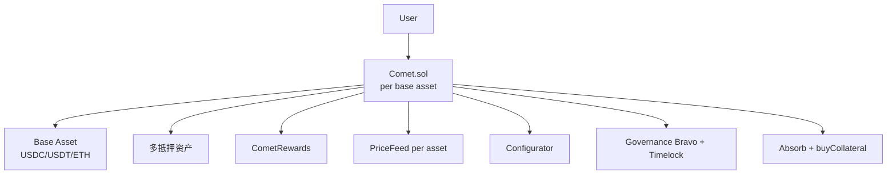
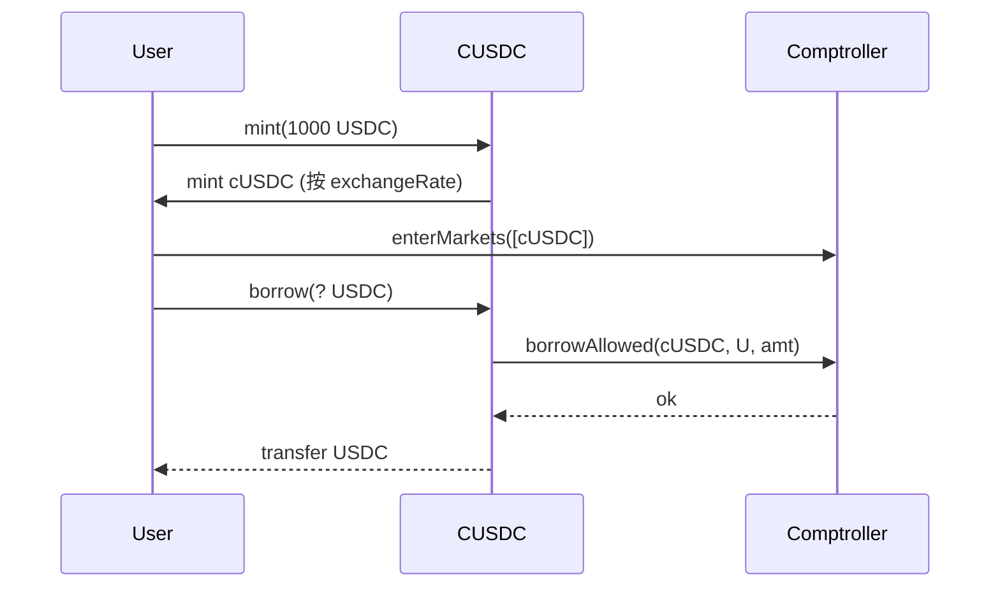
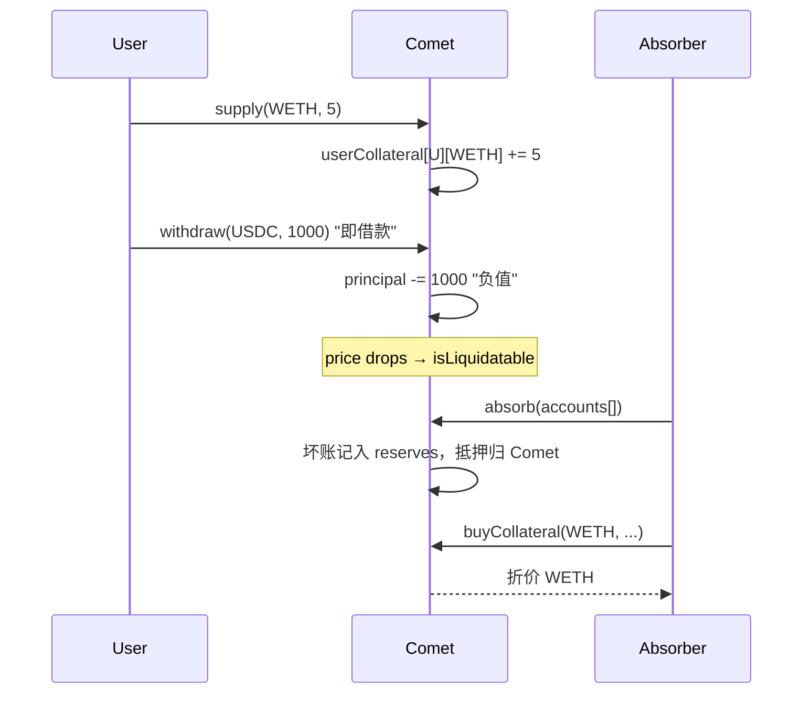

# Compound 借贷（V2 cToken 与 V3 Comet）

> **TL;DR**：Compound 由 Robert Leshner 与 Geoffrey Hayes 于 2018-09 上线 V1、2019-05 正式发布 V2，是 DeFi 借贷协议的"原型"——提出了 **池式借贷 + cToken 计息凭证 + 分段利率曲线 + Comptroller 风控模块** 的范式，几乎被所有 EVM 借贷协议继承。2020-06 发行 **COMP 治理代币并引入流动性挖矿**，直接引爆 DeFi Summer。**V3 (Comet)** 于 2022-08 上线，是一次根本性重写：放弃"多抵押多借款"的通用模型，改为 **单一借款资产（base asset，如 USDC/USDT/WETH）+ 多抵押资产** 的隔离市场；每个市场部署为独立的 `Comet` 合约，最小化攻击面；借贷计息直接在 base asset 余额中累积，无需 cToken 包装。Compound V3 强调 **安全、清晰、Gas 高效**，目前部署于 Ethereum、Polygon、Arbitrum、Base、Optimism、Scroll、Mantle 等，单市场 TVL 最大约 10–20 亿美元。

---

## 1. 背景与动机

2018 年 Compound 白皮书观察到：链上借贷若沿用 EtherDelta 式订单簿会极低效，因为"借款方必须等待匹配的贷款方、利率由市场手动撮合"。解决方案是 **货币市场协议（Money Market Protocol）**：

- 所有存款进入统一池；
- 借款从池内借出；
- 利率由 **利用率 U = Borrow/Supply** 程序化决定；
- 存款/借款实时可赎。

这一模型对贷款方是 "随存随取 + 自动利率 + 可组合收据 token (cToken)"，对借款方是 "即时借贷、超额抵押、自动清算"。Compound V2 把该模型产品化，成为 DeFi 借贷标杆。V3 则在经历 2021 Compound USDC 错发奖励事件（bug 导致错发 8000 万美元 COMP）后意识到——*"一个多抵押通用合约太复杂了"*——选择隔离单借款资产、减少潜在漏洞面。

## 2. 核心原理

### 2.1 形式化定义

对资产 `a` 池（V2 每资产一个池）：

- `cash_a`（池内余额）、`borrow_a`（借出量）、`reserves_a`（储备）；
- 利用率 `U = borrow / (cash + borrow − reserves)`；
- 借款利率 `R_b = BaseRate + U · Multiplier`（V2 早期）；拐点模型（V2 后期 JumpRateModel）`U > Kink` 时叠加 `JumpMultiplier`；
- 供应利率 `R_s = U · R_b · (1 − reserveFactor)`；
- cToken 汇率：`exchangeRate = (cash + borrow − reserves) / totalSupply(cToken)`，随利息累积单调递增。

健康性：V2 通过 `Comptroller.getAccountLiquidity()` 计算 `liquidity − shortfall`；`shortfall > 0` 则可被清算。

### 2.2 关键数据结构

**V2**

- `CToken / CErc20 / CEther`：每资产一合约，实现 mint/redeem/borrow/repayBorrow/liquidateBorrow；继承 `CTokenStorage`。
- `Comptroller`：全局风控，维护 `markets[cToken]`（collateralFactor / isListed）、`accountAssets[user]`（用户已进入的抵押市场）、oracle、borrowCaps、pauseGuardian。
- `InterestRateModel`：`JumpRateModelV2` 合约，参数 `baseRatePerYear / multiplierPerYear / jumpMultiplierPerYear / kink`。

**V3 (Comet)**

- 每个市场一合约 `Comet`，存储：
  - `baseToken`（唯一借款资产，如 USDC）；
  - `assetInfo[]`（抵押资产，至多 15 种）：`offset, asset, priceFeed, scale, borrowCollateralFactor, liquidateCollateralFactor, liquidationFactor, supplyCap`；
  - `userBasic[user]`：`principal`（正表示存款，负表示借款）、`baseTrackingIndex / baseTrackingAccrued`（COMP 奖励计算）；
  - `userCollateral[user][asset]`：`balance, reserved`；
  - 全局 `baseSupplyIndex / baseBorrowIndex`：RAY 级累计复利。

### 2.3 子机制

#### 2.3.1 cToken 模型（V2）

LP `mint` cToken = `underlying / exchangeRate`；随时间 `exchangeRate` 单调上升 → 相同 cToken 余额对应更多 underlying。`redeem` 反向。该设计优雅但增加 "cToken ↔ underlying" 的理解成本。

#### 2.3.2 抵押与清算（V2）

进入抵押需 `enterMarkets([cToken])`。健康度由 `collateralFactor`（V2 中 0–0.9）决定；清算人可用 `liquidateBorrow` 替债务人偿还最多 `closeFactor × borrow` 比例的债务，换取带 bonus 的 cToken 抵押物。

#### 2.3.3 Comptroller & Governance

Comptroller 升级通过 `_setPendingImplementation + _acceptImplementation` 两步；治理由 COMP + Governor Bravo + Timelock 组成，所有参数变更需 2 天以上 timelock。

#### 2.3.4 Comet（V3）架构革新

- 每个市场独立合约 → 攻击面与升级风险隔离。
- 直接在 `userBasic.principal` 上累加利息（无 cToken）；正本金为供应者，赚取 `supplyRate`；负本金为借款者，支付 `borrowRate`。
- 抵押物不计息、不重用做出借：用户的抵押资产"锁仓"在 `userCollateral`，不流向借款市场，牺牲一部分资本效率换取安全与清算可预测。
- 奖励：COMP 通过 `baseTrackingIndex` 按参与度分配。
- 清算：`absorb()` 由 Comet 直接吸收坏账到协议 reserves，然后以折扣向 `buyCollateral()` 出售抵押物给套利者——把"清算人个别行动"工程化为"协议吸收 + 拍卖"两步，减少清算竞赛 Gas。

#### 2.3.5 利率曲线（V3）

V3 使用连续分段线性 `U < kink` 与 `U > kink` 两段，`supplyRate / borrowRate` 均由同一曲线衍生。参数由治理设置，典型 `kink = 80%`。

### 2.4 参数与常量

| 参数 | V2 典型 | V3 典型 |
| --- | --- | --- |
| collateralFactor / borrowCF | 60–80% | 70–85% |
| liquidationFactor | 固定 8% bonus | 0.88–0.95 |
| closeFactor | 50% | 协议吸收，单次无上限 |
| reserveFactor | 10–25% | 10–15% |
| Kink | 80% | 80% |
| Max Assets（V3） | - | 15 |
| Supply Cap / Borrow Cap | 可设 | 必设 |

### 2.5 边界条件 / 失败模式

- **V2 cToken 精度漏洞**：2021-10 Proposal 62 因分发逻辑错误一次性派发 8000 万 COMP，创始人发推请求归还；部分用户主动归还。
- **Oracle 操纵**：2020-11 DAI on Coinbase 被操纵至 $1.30 触发 Compound 清算 ~900 万美元。随后切换 UniswapV2 TWAP + Chainlink 混合。
- **V3 单点失败**：若某市场 base asset 暴雷（如 USDC depeg），该市场受重创但不会波及其他 Comet 市场。
- **长尾抵押物**：V3 不开放列出，严控仅主流资产。

### 2.6 Mermaid：V3 Comet 架构



## 3. 架构剖析

### 3.1 分层视图（V2）

| 层 | 说明 |
| --- | --- |
| Money Market | CEther / CErc20 / CDaiDelegate |
| Risk | Comptroller (Unitroller proxy) |
| Oracle | PriceOracle → UniswapAnchoredView |
| Governance | COMP + GovernorBravo + Timelock |

分层视图（V3）：

| 层 | 说明 |
| --- | --- |
| Market Layer | Comet (per market) |
| Ext Layer | CometExt（读视图分离） |
| Reward | CometRewards |
| Config | Configurator + ConfiguratorProxy |
| Governance | Governor Bravo + Timelock |

### 3.2 核心模块清单

| 模块 | 路径 | 职责 |
| --- | --- | --- |
| `Comptroller.sol` | `compound-protocol/contracts/Comptroller.sol` | V2 风控 |
| `Unitroller.sol` | 同上 | Storage + 代理 |
| `CErc20Delegate.sol` | `contracts/CErc20Delegate.sol` | V2 单池实现 |
| `JumpRateModelV2.sol` | `contracts/JumpRateModelV2.sol` | V2 利率 |
| `UniswapAnchoredView.sol` | `contracts/Uniswap/UniswapAnchoredView.sol` | V2 价格 |
| `Comet.sol` | `comet/contracts/Comet.sol` | V3 市场核心 |
| `CometExt.sol` | `contracts/CometExt.sol` | V3 视图扩展 |
| `CometRewards.sol` | `contracts/CometRewards.sol` | COMP 奖励 |
| `Configurator.sol` | `contracts/Configurator.sol` | V3 参数 |
| `Governor Bravo / Timelock` | `compound-finance/compound-protocol` | 治理 |

### 3.3 数据流

V2 mint + borrow：



V3 supply + withdraw + absorb：



### 3.4 实现多样性

- 官方 Solidity，V2 源自 Robert Leshner 等；V3 由 Compound Labs 主导重写。
- 分叉：Venus（BSC）、Iron Bank / Cream（已停）、Rari Fuse（已停）、Benqi（Avalanche）、Sonne（Optimism）。
- Gearbox 等信用委托协议重用 Compound 内核。

### 3.5 扩展 / 互操作接口

- **V2 cToken ERC20** 可直接 `transfer` 作为抵押凭证。
- **V3 `allow / withdrawFrom`** 允许外部合约代管。
- `CometInterface` ABI 被主流钱包（MetaMask Portfolio、Rabby）原生集成。
- `CometRewards.claim(market, user, true)` 领取 COMP。

## 4. 关键代码 / 实现细节

V2 borrow 核心（`compound-protocol` tag `v2.8.1`，`contracts/CToken.sol:740-800`，简化）：

```solidity
function borrowInternal(uint borrowAmount) internal nonReentrant returns (uint) {
    accrueInterest();
    uint allowed = comptroller.borrowAllowed(address(this), msg.sender, borrowAmount);
    require(allowed == 0, "borrow not allowed");
    BorrowSnapshot storage snap = accountBorrows[msg.sender];
    uint accountBorrowsNew = borrowBalanceStoredInternal(msg.sender) + borrowAmount;
    snap.principal = accountBorrowsNew;
    snap.interestIndex = borrowIndex;
    totalBorrows += borrowAmount;
    doTransferOut(msg.sender, borrowAmount);
    emit Borrow(msg.sender, borrowAmount, accountBorrowsNew, totalBorrows);
    return 0;
}
```

V3 absorb（`comet/contracts/Comet.sol:1104-1170`，简化）：

```solidity
function absorbInternal(address absorber, address account) internal {
    if (!isLiquidatable(account)) revert NotLiquidatable();
    UserBasic memory basic = userBasic[account];
    int104 oldBalance = presentValue(basic.principal);
    int104 newBalance = 0;
    for (uint8 i = 0; i < numAssets; i++) {
        AssetInfo memory info = getAssetInfo(i);
        uint128 seizeAmount = userCollateral[account][info.asset].balance;
        // 以 liquidationFactor 折价估值，加到 newBalance
        newBalance += signed256(mulPrice(seizeAmount, getPrice(info.priceFeed), info.scale)
                                 .mul(uint256(info.liquidationFactor)) / FACTOR_SCALE);
        totalsCollateral[info.asset].totalSupplyAsset -= seizeAmount;
        userCollateral[account][info.asset].balance = 0;
    }
    int104 deltaBalance = newBalance - oldBalance;
    // 更新 userBasic.principal；超额部分转入 reserves，不足则 reserves 承担
    updateBasePrincipal(account, basic, principalValue(deltaBalance));
}
```

## 5. 演进与版本对比

| 版本 | 时间 | 关键 |
| --- | --- | --- |
| V1 | 2018-09 | 仅 4 个市场，手动上币 |
| V2 | 2019-05 | cToken、Comptroller、JumpRate |
| COMP | 2020-06 | 治理 + 流动性挖矿，点燃 DeFi Summer |
| 2021-10 bug | - | 错发 8000 万 COMP，治理漏洞事件 |
| V3 Comet | 2022-08 | 单借款资产、吸收清算、Gas 优化 |
| V3 多市场扩展 | 2023–2024 | USDT/WETH/USDbC/WETH 市场，多 L2 部署 |
| V3.x | 2025 | 跨链奖励、动态利率模型、Risk Steward |

## 6. 实战示例

V3 supply & borrow（ethers.js）：

```ts
const comet = new Contract(COMET_USDC, COMET_ABI, signer);
// 抵押 WETH
await weth.approve(COMET_USDC, parseEther("2"));
await comet.supply(WETH, parseEther("2"));
// 借 USDC （withdraw base asset == borrow）
await comet.withdraw(USDC, parseUnits("2000", 6));
// 领取 COMP
await cometRewards.claim(COMET_USDC, me, true);
```

## 7. 安全与已知攻击

- **2020-11 DAI Oracle 操纵**：Coinbase USD:DAI 喂价被操纵到 $1.30，致 ~900 万美元清算（实际大多属合法清算）。
- **2021-10 COMP 错发**：Proposal 62 bug 致 8000 万美元 COMP 意外派发，CEO 公开请求归还，成为 DeFi 治理史标志事件。
- **2022-03 MIM "Uniswap Anchored View" 事件**：非 Compound 被攻击，但属该类预言机设计的鉴戒。
- **V3 审计**：Comet 经 ChainSecurity、OpenZeppelin、Certora 多轮审计 + 形式化验证，上线以来未发生本体资金损失。

## 8. 与同类方案对比

| 维度 | Compound V3 | Aave V3 | Morpho Blue | Spark |
| --- | --- | --- | --- | --- |
| 抵押 | 多抵押 | 多抵押 | 单抵押单借款（市场级） | 多抵押 |
| 借款 | 单 base asset | 多 | 单 | 多（DAI 为主） |
| 资产隔离 | 市场级 | 模式级（Isolation） | 市场级 | - |
| Gas | 较低 | 中 | 极低 | 中 |
| 稳定币 | 无原生 | GHO | 无 | DAI |
| 治理 | Governor Bravo | Aave Executor | 无（中性内核 + Vault 治理） | MakerDAO |

## 9. 延伸阅读

- [Compound Whitepaper](https://compound.finance/documents/Compound.Whitepaper.pdf)
- [Compound III (Comet) Overview](https://www.comp.xyz/t/compound-iii-the-next-generation-of-compound/3121)
- [Compound Docs](https://docs.compound.finance/)
- Robert Leshner Bankless 访谈
- Paradigm：*Compound III Technical Overview*
- Rekt / Compound 错发 COMP 事件复盘

## 10. 术语表

| 术语 | 英文 | 释义 |
| --- | --- | --- |
| cToken | cToken | V2 存款凭证 ERC20 |
| Comptroller | Comptroller | V2 风险与权限中心 |
| Base Asset | Base Asset | V3 Comet 单借款资产 |
| Absorb | Absorb | V3 协议吸收坏账 |
| buyCollateral | buyCollateral | V3 折价出售抵押物 |
| Kink | Kink | 利率曲线拐点 |
| collateralFactor | Collateral Factor | 抵押物可借比例 |
| Governor Bravo | Governor Bravo | Compound 治理合约标准 |

---

*Last verified: 2026-04-22*
