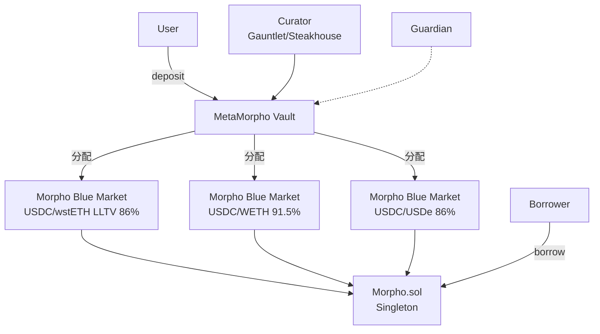
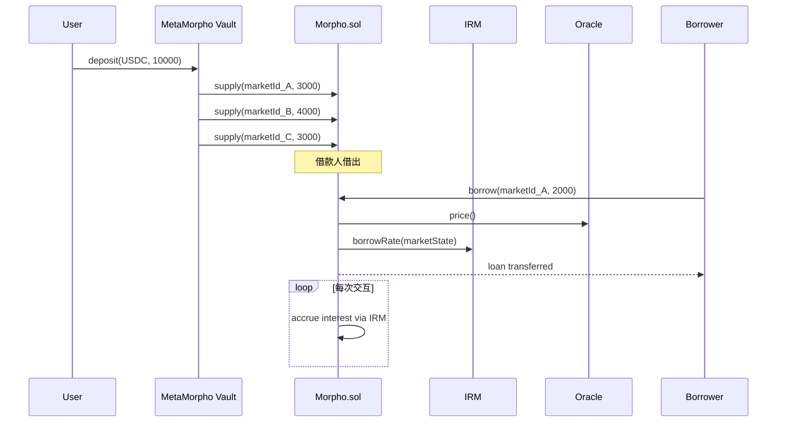

# Morpho（Optimizer → Blue → Metamorpho Vault）

> **TL;DR**：Morpho 由 Paul Frambot 等人于 2021 年在法国巴黎发起，愿景是 **"在既有借贷协议之上榨出点对点撮合红利"**。**Morpho Optimizer**（2022，覆盖 Compound V2 与 Aave V2/V3）在原有池利率之上加一层 P2P 匹配层：当有同一资产的供贷双方匹配时，他们各自获得更优利率（供应方利率 ↑，借款方利率 ↓），未匹配部分继续留在底层协议，兼容所有风险参数。2024 年推出的 **Morpho Blue** 是彻底重写：一份不到 1000 行的极简、不可升级、不可治理的 **isolated lending primitive**——任何人可无许可创建 `(collateralToken, loanToken, IRM, oracle, LLTV)` 五元组定义的市场。风险由**市场创建者**在创建时固化，不由协议层治理调整。**MetaMorpho**（2024）是基于 ERC-4626 的 **策展金库**，Curator 把存款分配到多个 Morpho Blue 市场，实现类似 Aave 的"一键存款 + 分散风险"体验，同时保留隔离市场的安全性。截至 2026-04，Morpho 生态 TVL 超过 120 亿美元，是 Aave V3 之后最大借贷协议。

---

## 1. 背景与动机

在 Aave/Compound 的池式模型中，**利差（supplyRate < borrowRate）** 相当恒定（储备因子 + 利率曲线设计）。Morpho 团队观察到：如果某时刻供需基本对等，理论上供贷双方可以在不损失安全性的前提下"各让一半利差"——供应方多得一部分，借款方少付一部分。Morpho Optimizer 通过 **链上点对点匹配**实现这一点，同时底层仍托管在 Compound/Aave，继承其清算、预言机、风险参数。

随着稳定币 LST/LRT 增多，Morpho 团队意识到 **Aave/Compound 的治理不可能为每种长尾资产快速上市**。于是提出 Morpho Blue："**去治理、去升级、极简、模块化**"的借贷内核，把风险外包给 **Vault 策展人（Curator）**、**预言机提供方**、**利率模型作者**。这一理念与 Uniswap V4 的"singleton + hooks" 哲学呼应——内核极简、边缘可编程。

## 2. 核心原理

### 2.1 形式化定义：Morpho Blue 市场

每个市场由不可变参数五元组定义：

```
MarketParams = {
    loanToken,       // 借款资产
    collateralToken, // 抵押资产
    oracle,          // IOracle 合约，返回 price(collateral→loan, 1e36 scale)
    irm,             // IIrm 合约，输入市场状态返回 borrowRate
    lltv             // Liquidation LTV (1e18 缩放), 如 86% = 0.86e18
}
marketId = keccak256(abi.encode(MarketParams))
```

协议只维护：

- `totalSupplyAssets / totalSupplyShares / totalBorrowAssets / totalBorrowShares / lastUpdate / fee`；
- `position[marketId][user] = (supplyShares, borrowShares, collateral)`。

Health 约束：
```
assets_borrowed ≤ collateral · oracle.price / 1e36 · LLTV / 1e18
```

超出则可被清算。清算奖励（liquidationIncentive）：
```
incentive = min(M, 1 / (1 − β · (1 − LLTV)))
```
其中 `β` 为协议常量（0.3）、`M = 1.15` 为硬上限。LLTV 越高，清算奖励越低（因为离爆仓越近，头寸规模仍大）。

### 2.2 关键数据结构

Morpho Blue 全部状态压缩在单合约 `Morpho.sol`：

- `mapping(Id => Market)` — Market 每市场；
- `mapping(Id => mapping(address => Position))` — user 头寸；
- `mapping(Id => MarketParams)` → `idToMarketParams` 帮助反查；
- `mapping(bytes32 => bool) isIrmEnabled` / `isLltvEnabled` — 白名单 IRM 与 LLTV（治理仅允许批准 IRM 实现与 LLTV 档位，不得改变已部署市场参数）。

MetaMorpho Vault（ERC-4626）状态：

- `supplyQueue[]` / `withdrawQueue[]`：市场排序；
- `config[marketId]`：`cap / removableAt / enabled`；
- `guardian / curator / owner / allocator`：多角色权限分层；
- `fee / feeRecipient / timelock`。

### 2.3 子机制

#### 2.3.1 Optimizer（Morpho-Aave-V3、Morpho-Compound）

Optimizer 通过"队列式"撮合：

- 新供应用户资产默认放入底层池；若存在等待被撮合的借款用户，则"弹出"配对。
- 撮合后双方利率落在底层 supplyRate 与 borrowRate 之间，通常是两者均值（`p2pIndex`）。
- 匹配用户在 `peer-to-peer balance`；池上仍留份额用作退出流动性保证。

#### 2.3.2 Blue 的无许可市场

任何地址可以 `createMarket(MarketParams)`：

- 若 `(IRM, LLTV)` 组合已在协议 `isIrmEnabled / isLltvEnabled` 白名单内，即可立即部署；
- 市场参数一经部署**永不可变**。

这让新资产（LRT、RWA）可在数秒内创建借贷市场，风险由"谁使用它"决定，而非治理被迫审查。

#### 2.3.3 IRM（Interest Rate Model）

Morpho 默认提供 **Adaptive Curve IRM**：

- 目标利用率 `U_target = 0.9`；
- 当前利率 `rate = rateAtTarget · curve(U)`，`curve(U) = (1 − r_0) + r_0 · U / U_target`（低利用率端）或加速（高端）；
- `rateAtTarget` 在每次交互后按 "过去一段时间内 `U` 与 `U_target` 的偏差" 指数调整（`speed = 50%/year`）。

这一模型无需治理手动调参，自动收敛到让 `U` 落在 target 附近的均衡利率；适合大量长尾市场。

#### 2.3.4 Oracle

Morpho Blue 把 oracle 抽象为 `price()` 单函数。官方 `ChainlinkOracle` 实现支持任意喂价 pair（含 LST 换算）。第三方可提供 `Pyth`、`Redstone`、`Curve TWAP` 等。Oracle 风险全由市场创建者与使用者自担——选择不好即意味着坏账。

#### 2.3.5 Clean Liquidation

清算人调用 `liquidate(marketParams, borrower, seizedAssets, repaidShares, data)`：

- 协议校验 HF < 1；
- 按 `incentive` 折价转移抵押物给清算人；
- 若清算后仍存在坏账（抵押物不足），**剩余债务从贷款方比例扣减**（通过缩小 `supplyShares`），无协议国库兜底。这一"穿仓社会化损失"设计避免协议坏账积累，但要求 Vault 管理者严格风控。

#### 2.3.6 MetaMorpho（ERC-4626 Vault）

MetaMorpho Vault 就像 "Yearn + Aave"：

- 用户存入 loanToken（如 USDC）；
- Curator 把存款分配到多个 Morpho Blue 市场（USDC/wstETH 86%、USDC/WETH 91.5%、USDC/USDe 86%…）；
- 单市场 cap 限制最大敞口；
- 提款按 `withdrawQueue` 顺序从各市场撤回；
- 带 `timelock` 的参数变更（新增市场、修改 cap）保障用户可提前逃离；
- Guardian 可紧急否决危险提议。

### 2.4 参数与常量

| 参数 | 值 | 备注 |
| --- | --- | --- |
| LLTV 白名单 | 38.5%/62.5%/77%/86%/91.5%/94.5% | 每档对应一个 liquidationIncentive |
| liquidationIncentive 公式 β | 0.3 | |
| liquidationIncentive 上限 | 1.15 | |
| Fee cap | 25% | MetaMorpho Vault 与 Morpho Blue 各有 fee |
| IRM Target U | 0.9 | Adaptive Curve |
| IRM Speed | 50%/year | 收敛速度 |
| Timelock（Vault） | ≥ 1 天，用户可设 | Curator 修改参数 |

### 2.5 边界条件 / 失败模式

- **市场创建者恶意 oracle**：如创建 `WBTC/USDC` 使用错误 oracle，对 Vault curator 来说等于黑名单，但用户若自发参与仍然会亏损。
- **Curator 风控失败**：MetaMorpho 的 Vault 声誉很重要，Gauntlet、Block Analitica、Steakhouse、Re7、MEV Capital 等专业 curator 各自竞争。
- **长尾资产流动性枯竭**：极端行情下清算失败可能产生穿仓；由 supplyShares 社会化承担。
- **Oracle 操纵**：低流动性 token 容易被操纵 spot 价格；市场创建者应选择 TWAP 或去中心化 oracle。

### 2.6 Mermaid：Morpho 生态图



## 3. 架构剖析

### 3.1 分层视图

| 层 | 模块 | 特点 |
| --- | --- | --- |
| Core Primitive | `Morpho.sol` | 不可升级，~650 行 |
| 市场适配 | IRM / Oracle 模块 | 可插拔 |
| Vault 层 | MetaMorpho | ERC-4626，可升级，策展人运营 |
| Periphery | `Bundler`, `PublicAllocator`, `URD` rewards | Gas 优化、奖励 |
| 监控/前端 | morpho.org、Morpho Blueprint API | 数据透明 |

### 3.2 核心模块清单

| 模块 | 路径 | 职责 |
| --- | --- | --- |
| `Morpho.sol` | `morpho-org/morpho-blue:src/Morpho.sol` | 借贷内核 |
| `IIrm.sol` | `src/interfaces/IIrm.sol` | IRM 接口 |
| `IOracle.sol` | `src/interfaces/IOracle.sol` | Oracle 接口 |
| `AdaptiveCurveIrm.sol` | `morpho-blue-irm:src/adaptive-curve-irm/AdaptiveCurveIrm.sol` | 自适应曲线 |
| `ChainlinkOracle.sol` | `morpho-blue-oracles:src/ChainlinkOracle.sol` | 默认 Chainlink oracle |
| `MetaMorpho.sol` | `morpho-org/metamorpho:src/MetaMorpho.sol` | ERC-4626 Vault |
| `Bundler3.sol` | `morpho-org/bundlers` | 多操作组合 |
| `PublicAllocator.sol` | `metamorpho/contracts/PublicAllocator.sol` | 无许可再分配 |
| `URD / UniversalRewardsDistributor` | `universal-rewards-distributor` | 奖励发放 |
| Morpho Optimizer（Aave V3） | `morpho-optimizers/morpho-aave-v3` | 旧版撮合层（维护中） |

### 3.3 数据流：用户→ Vault → Market



### 3.4 实现多样性

- 官方 Solidity（MIT），部署于 Ethereum、Base、Polygon PoS、Unichain、Fraxtal、Sonic 等。
- 风险策展：Gauntlet、Steakhouse、Block Analitica、MEV Capital、Re7、B.Protocol 等。
- 三方整合：Yearn V3 策略、Instadapp Avocado、Summer.fi、Safe 等。
- 官方发布 **Morpho Blueprint**：提供 React SDK 与 API。

### 3.5 扩展接口

- **ERC-4626**：Vault 与主流 Yearn/Lagoon/Sommelier 兼容。
- **Permit2 / Permit**：签名授权。
- **Bundler3**：多操作打包（supply + borrow + deposit-to-vault）原子执行。
- **Callbacks**：`onMorphoSupply/Repay/Liquidate/FlashLoan` 回调，支持闪电式组合。
- **Flash Loan**：`flashLoan(token, assets, data)`，免费闪电贷（由 Morpho 内的市场流动性提供）。

## 4. 关键代码 / 实现细节

### 4.1 `_accrueInterest` 深度解析

这是理解 Morpho Blue 记账模型最关键的一个函数。先用大白话讲清直觉，再拆细节。

#### 直觉：池子 + 份额 + 懒更新

Morpho Blue 本质是"一个装钱的池子"——出借人丢钱进池子，借款人押抵押品借走。协议记两个数：

- `totalSupplyAssets`：池子现在值多少钱
- `totalSupplyShares`：发行了多少"股份"

每个出借人持有一定 `supplyShares`，就相当于池子的一个固定**百分比**。利息进来时，**股份数不变、池子总值上涨**，于是每股净值自动上升——所有人按持股比例共享利息，协议不需要给每个人逐个更新余额。

**懒更新（lazy accrual）**：利息不是每个区块自动跳涨，而是等到有人来操作市场（存/取/借/还/清算）时，一次性把"上次到现在"这段时间的利息补算进来。没人用的市场零 gas 开销，任意时刻读到的 `totalBorrowAssets` 都是结过账的。

#### 核心公式：为什么用三阶泰勒展开

连续复利的精确值是 `(e^{r·t} − 1) × 本金`，但 Solidity 里 `exp()` gas 极贵。Morpho 用**三阶泰勒展开**近似：

$$
e^{rt} - 1 \approx rt + \frac{(rt)^2}{2} + \frac{(rt)^3}{6}
$$

现实场景中 `r·t` 极小（典型日化 `rt ≈ 3×10⁻⁴`），截断余项 `(rt)⁴/24` 落在 WAD（1e-18）精度之外，完全可忽略。而且**截断误差永远偏小**（扔掉的都是正项），所以协议"少记一丢丢利息"——这是有意为之的保守记账，绝不会凭空制造坏账。

#### Fee 的"铸股稀释"机制

直觉上 fee = "从利息里扣一块给协议"。但 Morpho 的实现更巧妙：

1. **全部利息都先加进池子**（所有 supplier 的每股净值同步上涨）
2. **协议给 `feeRecipient` 铸新股**，新股的价值正好等于 `feeAmount`

等效结果是：supplier 的绝对赚幅没变（该涨还是涨），但他们的**持股比例被稀释了一点点**，稀释出来的份额就是协议 fee。好处是只用维护**一根** `totalSupplyAssets`，不像 Aave 需要 `liquidityIndex / variableBorrowIndex` 两根索引分别演进。

#### 源码（`src/Morpho.sol`）

```solidity
function _accrueInterest(MarketParams memory marketParams, Id id) internal {
    uint256 elapsed = block.timestamp - market[id].lastUpdate;
    if (elapsed == 0) return;

    if (marketParams.irm != address(0)) {
        uint256 borrowRate = IIrm(marketParams.irm).borrowRate(marketParams, market[id]);
        uint256 interest = market[id].totalBorrowAssets.wMulDown(borrowRate.wTaylorCompounded(elapsed));
        market[id].totalBorrowAssets += interest.toUint128();
        market[id].totalSupplyAssets += interest.toUint128();

        uint256 feeShares;
        if (market[id].fee != 0) {
            uint256 feeAmount = interest.wMulDown(market[id].fee);
            feeShares = feeAmount.toSharesDown(
                market[id].totalSupplyAssets - feeAmount,  // ← 关键
                market[id].totalSupplyShares
            );
            position[id][feeRecipient].supplyShares += feeShares;
            market[id].totalSupplyShares += feeShares.toUint128();
        }
        emit EventsLib.AccrueInterest(id, borrowRate, interest, feeShares);
    }
    market[id].lastUpdate = uint128(block.timestamp);
}
```

以及 `wTaylorCompounded`（`src/libraries/MathLib.sol`）：

```solidity
function wTaylorCompounded(uint256 x, uint256 n) internal pure returns (uint256) {
    uint256 firstTerm  = x * n;                                      // r·t
    uint256 secondTerm = mulDivDown(firstTerm, firstTerm, 2 * WAD);  // (r·t)²/2
    uint256 thirdTerm  = mulDivDown(secondTerm, firstTerm, 3 * WAD); // (r·t)³/6
    return firstTerm + secondTerm + thirdTerm;
}
```

#### 细节要点

**① `elapsed == 0` 早退**
同一区块多次入口（bundler 常见）短路返回，且此时连 `lastUpdate` 写入都省掉。

**② `irm == address(0)` 的合法性**
Morpho Blue 允许创建**无息市场**（纯抵押托管，如 RWA 代币）。此时跳过利息逻辑，但仍更新 `lastUpdate` 保持早退路径有效。

**③ IRM 可以有状态**
`borrowRate()` 不是 `view`——`AdaptiveCurveIrm` 会在这里更新 `rateAtTarget`（按利用率偏离 target 的时长指数调整）。传入 IRM 的是**未累息**的 `market[id]`，避免自指。

**④ 双边对称记账**
```solidity
totalBorrowAssets += interest;
totalSupplyAssets += interest;
```
协议从不"印钱"——利息纯粹是债务端 → 权益端的记账转移。不变量 `totalSupplyAssets − totalBorrowAssets = cashReserve` 在本函数中严格保持。

**⑤ Fee 铸股公式推导**
令 `A = totalSupplyAssets`（已含 interest），`S = totalSupplyShares`，希望 `feeRecipient` 持有的 shares 恰好兑换回 `feeAmount`：

$$
\frac{\text{feeShares}}{S + \text{feeShares}} \cdot A = \text{feeAmount}
\;\Rightarrow\; \text{feeShares} = \frac{\text{feeAmount} \cdot S}{A - \text{feeAmount}}
$$

这正是代码中 `toSharesDown(feeAmount, A − feeAmount, S)` 得到的结果——分母必须用 `A − feeAmount` 还原到"未分配 fee 时"的每股价格，否则 `feeRecipient` 会少拿。

**⑥ 溢出与救援**
`x * n` 不加 SafeMath 包装，Solidity 0.8+ 会 revert。极端（长期无交互 + 异常高利率）会导致入口函数 revert，协议可通过 1 wei 级别交互刷新 `lastUpdate` 救援。实际 `rateAtTarget` 有 `MAX_RATE_AT_TARGET` 约束，并不会失控。

**⑦ `lastUpdate` 无条件末尾写入**
即便走了 `irm == address(0)` 分支也更新，保持 `elapsed == 0` 早退语义一致；先累加后写 `lastUpdate`，事务原子性兜底防止"算了利息但没更新时间戳"的不一致。

#### 与 Aave V3 / Compound V3 对比

| 维度 | Morpho Blue | Aave V3 | Compound V3 |
| --- | --- | --- | --- |
| 索引根数 | 1 根（`totalSupplyAssets` 本身隐含净值） | 2 根（`liquidityIndex` + `variableBorrowIndex`） | 1 根 + 独立 borrow |
| 复利方式 | 三阶 Taylor `e^{rt}−1` | Taylor（阶数不同） | 线性近似 `rt` |
| Fee 实现 | 铸 shares 给 `feeRecipient` | `reserveFactor` 在曲线内分流 | reserves 专用账户累加 |
| IRM 可有状态 | 是（Adaptive Curve 写存储） | 否（纯函数曲线） | 否 |

把记账压到"一根 assets + 一根 shares"，fee 和利息走同一机制（shares 稀释 / 净值上涨），换来了代码极度精简和审计表面极小——这正是 Morpho Blue 敢做成**不可升级、不可治理**的前提。

### 4.2 `supply`

Morpho Blue supply（`morpho-blue/src/Morpho.sol:200-250`，简化）：

```solidity
function supply(MarketParams memory marketParams, uint256 assets, uint256 shares, address onBehalf, bytes calldata data)
    external returns (uint256, uint256)
{
    Id id = marketParams.id();
    require(market[id].lastUpdate != 0, "market not created");
    require((assets == 0) != (shares == 0), "inconsistent input");
    _accrueInterest(marketParams, id);
    if (assets > 0) shares = assets.toSharesDown(market[id].totalSupplyAssets, market[id].totalSupplyShares);
    else             assets = shares.toAssetsUp(market[id].totalSupplyAssets, market[id].totalSupplyShares);
    position[id][onBehalf].supplyShares += shares;
    market[id].totalSupplyShares += uint128(shares);
    market[id].totalSupplyAssets += uint128(assets);
    emit EventsLib.Supply(id, msg.sender, onBehalf, assets, shares);
    if (data.length > 0) IMorphoSupplyCallback(msg.sender).onMorphoSupply(assets, data); // 支持回调完成多步操作
    IERC20(marketParams.loanToken).safeTransferFrom(msg.sender, address(this), assets);
    return (assets, shares);
}
```

### 4.3 MetaMorpho `reallocate`

MetaMorpho reallocation（`metamorpho/src/MetaMorpho.sol` `reallocate` 函数，简化）：

```solidity
function reallocate(MarketAllocation[] calldata allocations) external onlyAllocatorRole {
    uint256 totalSupplied; uint256 totalWithdrawn;
    for (uint256 i; i < allocations.length; i++) {
        Id id = allocations[i].marketParams.id();
        uint256 supplyAssets = _supplyBalance(allocations[i].marketParams);
        uint256 target = allocations[i].assets;
        if (target < supplyAssets) {
            uint256 toWithdraw = supplyAssets - target;
            MORPHO.withdraw(allocations[i].marketParams, toWithdraw, 0, address(this), address(this));
            totalWithdrawn += toWithdraw;
        } else if (target > supplyAssets) {
            uint256 toSupply = target - supplyAssets;
            require(config[id].cap >= supplyAssets + toSupply, "cap exceeded");
            MORPHO.supply(allocations[i].marketParams, toSupply, 0, address(this), "");
            totalSupplied += toSupply;
        }
    }
    require(totalSupplied <= totalWithdrawn, "inconsistent");
}
```

## 5. 演进与版本对比

| 版本 | 时间 | 特征 |
| --- | --- | --- |
| Morpho-Compound | 2022-06 | P2P 撮合层 |
| Morpho-Aave V2 | 2022-11 | 扩展 Aave V2 |
| Morpho-Aave V3 | 2023-05 | eMode / 进一步优化 |
| Morpho Blue | 2024-01 | 全新内核，无许可市场 |
| MetaMorpho | 2024-03 | Curator Vault |
| 2025 Morpho Vaults V2 | 2025 | 允许存入 ERC-4626 资产、更灵活策略 |
| 2026 RWA / Compliance | 2026 | 与 Securitize、Centrifuge 集成 |

## 6. 实战示例

通过 Morpho SDK 直接在一个市场 supply + borrow：

```ts
import { MORPHO } from "@morpho-org/morpho-blue-bundlers";
const bundler = new Contract(BUNDLER3, BUNDLER_ABI, signer);
const actions = [
  bundler.interface.encodeFunctionData("morphoSupplyCollateral", [marketParams, parseEther("2"), me, "0x"]),
  bundler.interface.encodeFunctionData("morphoBorrow", [marketParams, parseUnits("3000", 6), 0, me, me]),
];
await bundler.multicall(actions);
```

MetaMorpho 存款：

```ts
const vault = new Contract(STEAKHOUSE_USDC, ERC4626_ABI, signer);
await usdc.approve(vault.address, parseUnits("10000", 6));
await vault.deposit(parseUnits("10000", 6), me);
```

## 7. 安全与已知攻击

- Morpho Blue 自发布以来通过 Spearbit、ChainSecurity、OpenZeppelin、Cantina、Certora 等多轮审计 + 形式化验证，无本体资金损失。
- **Vault curator 事件**：2024 年个别长尾市场（如 PAXG/USDC）因 Oracle 断档出现坏账，由 Curator 调整市场排除。MetaMorpho 保留 Guardian 否决机制使影响可控。
- **Optimizer 暂停 AAVE-V2 matching**（2024）：底层 Aave V2 停用，Optimizer 按流程迁移至 V3。
- Morpho 设有 Immunefi $2.5M bug bounty。

## 8. 与同类方案对比

| 维度 | Morpho Blue | Aave V3 | Compound V3 | Euler V2 |
| --- | --- | --- | --- | --- |
| 核心 LOC | ~650 | 数千 | ~1000（Comet） | 多模块 |
| 治理介入 | 仅白名单 IRM/LLTV | 全参数 | 全参数 | 模块可插拔 |
| 风险隔离 | 每市场 | Isolation mode | 市场级 | Cluster |
| 可升级 | 否（不可变） | 是 | 是 | 是 |
| Vault | MetaMorpho ERC-4626 | 生态 Yearn | 生态 | 自带 Vault Kit |
| 清算坏账处理 | 社会化穿仓 | Safety Module | reserves | 穿仓 shares |

## 9. 延伸阅读

- [Morpho Docs](https://docs.morpho.org/)
- [Morpho Blue Paper](https://github.com/morpho-org/morpho-blue/blob/main/morpho-blue-whitepaper.pdf)
- [MetaMorpho Paper](https://github.com/morpho-org/metamorpho/blob/main/README.md)
- Paul Frambot 访谈（Bankless、Epicenter）
- Gauntlet Morpho Risk Analytics
- Paradigm: *Lending primitives redux*

## 10. 术语表

| 术语 | 英文 | 释义 |
| --- | --- | --- |
| Optimizer | Optimizer | P2P 撮合层 |
| Blue | Morpho Blue | 极简隔离借贷内核 |
| MetaMorpho | MetaMorpho | ERC-4626 策展金库 |
| Curator | Curator | 管理 Vault 分配的风控团队 |
| LLTV | Liquidation LTV | 市场创建时固化的清算阈值 |
| IRM | Interest Rate Model | 可插拔利率模型 |
| Adaptive Curve | Adaptive Curve | Morpho 默认动态收敛 IRM |
| 社会化穿仓 | Bad Debt Socialization | 坏账按 supplyShares 按比例承担 |
| PublicAllocator | Public Allocator | 无许可再分配合约 |

---

*Last verified: 2026-04-28*
