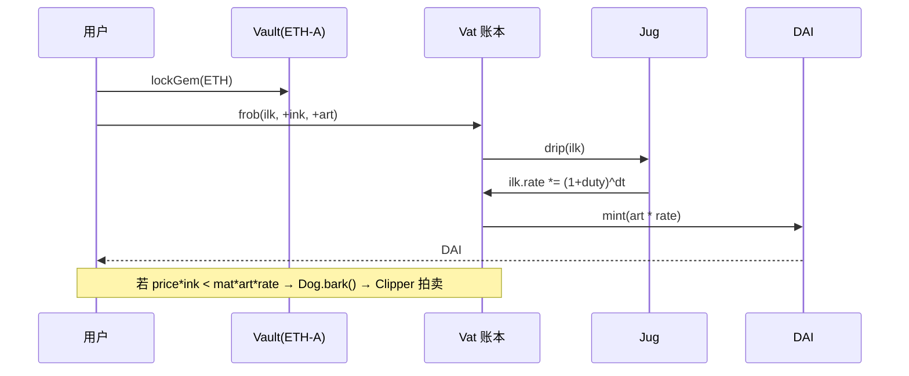

# MakerDAO / Sky 与 Spark Protocol：从 DAI 到 USDS 的十年演进

> **TL;DR**：MakerDAO 是 DeFi 最早的去中心化稳定币发行协议，以超额抵押铸造 DAI。2024 年通过 Endgame 方案升级为 Sky 生态，发行 USDS（可与 DAI 1:1 兑换）并上线 Sky Savings Rate（SSR）与 Sky Borrow Rate（SBR）。Spark Protocol 是 Sky 生态官方借贷前端，Fork 自 Aave V3，通过 Direct Deposit Module（D3M）从 Maker/Sky 获取成本极低的流动性，并运营 Spark Liquidity Layer（SLL）跨链部署资金。本文系统讲解 Vault/Collateral 机制、利率治理、USDS/DAI 双轨、SSR/SBR 以及 Spark 对 Sky 的战略意义。

## 1. 背景与动机

2017 年，Rune Christensen 团队上线 Single Collateral DAI（SAI），用 ETH 单一抵押铸造 1 美元稳定币，是 DeFi 超额抵押稳定币的起点。2019 年升级为 Multi Collateral DAI（MCD, 即 dss：Dai Stablecoin System），支持多种抵押品（WBTC、USDC、LP Token、RWA 等）。在 2020 年"312 黑色星期四"之后，Maker 引入 PSM（Peg Stability Module）以 USDC 作为 1:1 硬锚，以保证 DAI 与 1 美元不脱钩；此举在 2023 年 SVB 事件中曾一度导致 DAI 短暂脱锚至 0.88，随后通过扩大 RWA（美债、私人信贷）与真实世界收益来稳定储备。

2022—2024 年 Rune 提出 **Endgame Plan**：将 MakerDAO 拆分为若干 SubDAO，引入 USDS 作为新品牌（原 DAI 保留但定位为"legacy brand"），并推出治理代币 SKY（1 MKR ≈ 24,000 SKY）。在 SubDAO 中，**Spark Protocol**（由 Phoenix Labs 开发，Fork 自 Aave V3）成为 Sky 官方对外放贷的"前台"。它解决了一个长期问题：Maker 直接面向 Vault 用户时产品体验差、资本效率低；通过 D3M（Direct Deposit DAI Module），Maker/Sky 可直接将稳定币"印"进 Spark 作为流动性，Spark 再按市场化利率出借，差额反哺 Sky Savings Rate。

动机总结：
- **Maker 单体 Vault 不够灵活**：用户要开仓、清算、管理 CDP 太重；Aave 式 pool-based 借贷体验更好。
- **DAI 收益率低**：若 Maker 只持有稳定抵押，利差薄。通过 D3M 把 DAI 直接入 Spark，按 Aave 曲线收取市场利息，提升协议收入。
- **Endgame 叙事**：Sky 需要一条对外界面吸收新资产（wstETH、WBTC、RWA、USDC），Spark 作为"主力船坞"。
- **合规与 RWA**：USDS 支持冻结（Freeze）功能，以配合未来机构合规；DAI 保留"不可冻结"属性，双轨并行满足不同用户。

## 2. 核心原理

### 2.1 形式化定义：Vault 与清算

MakerDAO 的基础单元是 **Vault**（旧称 CDP, Collateralized Debt Position），一个 Vault 的状态记为四元组：

```
Vault(i) = (ink_i, art_i, ilk, urn)
```

- `ink`：锁定的抵押品数量（如 ETH 数量，单位 wad = 10^18）。
- `art`：归一化债务（normalized debt，单位 wad）。实际欠款 `tab = art * rate`，其中 `rate` 是该 ilk 的累计利率指数（单位 ray = 10^27）。
- `ilk`：抵押品类型（如 `ETH-A`, `WSTETH-B`, `USDC-PSM`）。
- `urn`：持仓地址。

核心不变式（`Vat.sol`）：

```
tab = art * ilk.rate           # 实际债务
tab <= ink * ilk.spot          # 健康度要求
```

`spot = price / mat`，其中 `price` 由 OSM（Oracle Security Module）延迟喂价 1 小时，`mat` 是最小抵押率（如 150%）。当不等式不满足时，任何人可调用 `Dog.bark()` 触发 Liquidation 2.0（荷兰式拍卖 `Clipper`），从高价开始按 `abacus` 曲线递减，直到有 keeper 愿意吃下。拍卖溢价（tip + chip * tab）激励 keeper 参与。

### 2.2 关键数据结构：dss 合约家族

`dss` 是 Multi Collateral DAI 的核心实现，由若干用 Solidity 写的模块化合约组成：

| 合约 | 作用 |
| --- | --- |
| `Vat` | 账本核心，存所有 ilk、urn、dai、sin（债务）、gem（抵押）余额 |
| `Dai` | ERC20 DAI 代币合约，`mint/burn` 权限授予 `DaiJoin` |
| `Jug` | 利率累积器，调用 `drip(ilk)` 把 `duty`（每秒利率）以 `rpow` 复利累计到 `rate` |
| `Spotter` | 把 Oracle 价格转为 `spot` |
| `Cat/Dog` | 触发清算，Liquidation 1.2 / 2.0 |
| `Clipper` | Liquidation 2.0 的荷兰拍卖 |
| `Vow` | 系统盈亏账户，surplus auction / debt auction |
| `Flop/Flap` | 赤字拍卖（铸 MKR 卖掉换 DAI）/ 盈余拍卖（拿 DAI 买 MKR 销毁）|
| `End` | Emergency Shutdown 模块 |
| `PSM` | Peg Stability Module（USDC↔DAI 1:1）|
| `DssAutoLine` | 自动调整 debt ceiling |

Vat 采用**双 entry 记账**（internal accounting）：任何债务变动必须 `sin[vow] += delta && dai[urn] += delta`，总和为零。所有余额以 rad（10^45）精度存储以避免 rounding。

### 2.3 子机制拆解

1. **Stability Fee / DSR / SSR**：每种 ilk 有独立 `duty`（借出利率，年化如 5%）；存款侧是 `DSR`（DAI Savings Rate），通过 `Pot` 合约实现，用户 `join` 后按 `chi` 累计。Endgame 之后 USDS 使用 **SSR（Sky Savings Rate）**，由 `sUSDS` 合约记账，治理决定 ssr 参数。SBR 是 Sky Borrow Rate（Spark Borrow 侧综合利率的治理目标）。
2. **PSM**：直接以 1 DAI = 1 USDC（收 0—0.1% tin/tout 手续费）的方式双向兑换，作为硬锚。PSM-USDC-A 持仓曾占 DAI 储备的 50%+，Sky 正在降低此风险。
3. **D3M（Direct Deposit Module）**：Maker/Sky 可直接向 Aave/Spark 等外部协议"印"DAI 并以池子的 aToken/spDAI 记账，允许目标利率区间（如希望 Spark supply APY ≈ 4%），自动 mint/burn 调整。对 Spark 来说等于有一条几乎无限的低息资金源。
4. **Surplus / Debt Auction**：`Vow` 累计 `surplus` 到阈值（如 60M DAI）后拍卖成 MKR 销毁；若系统有 bad debt 则反向 Flop（铸 MKR 拍卖）。这是 MKR（现 SKY）的核心价值捕获。
5. **Emergency Shutdown**：持有足够 MKR/SKY 可触发 `End.cage()`，冻结系统，用户按当时抵押价比例赎回，防止极端情况下的坏账扩散。
6. **USDS 与 DAI 双轨**：`UsdsJoin` 允许 1:1 兑换 DAI/USDS；USDS 合约包含 `freeze()` 权限（非默认启用），为合规做准备；`sUSDS` = rebase-free 的 SSR 存款凭证（类似 sDAI）。
7. **Spark Liquidity Layer (SLL)**：Sky 治理通过 SLL 把流动性跨链部署到 Spark（L2/侧链/Base/Gnosis 等），由 `ALM Controller`（Allocator）分配，目标是让 USDS/DAI 在多链维持深度。

### 2.4 关键参数（2026 年初近似值，治理可改）

| 参数 | 含义 | 典型值 |
| --- | --- | --- |
| DSR / SSR | 存款年化 | 5—8%（随市场调整） |
| ETH-A Stability Fee | ETH 借出年息 | 6—10% |
| ETH-A LR | 最小抵押率 | 150% |
| PSM-USDC-A `tin/tout` | 兑换费 | 0 / 0 |
| debt ceiling（系统级 Line） | 系统总上限 | ~10B DAI |
| OSM delay | 喂价延迟 | 1 小时 |
| Liquidation Penalty | 清算罚金 | 13% |
| `buf` | 拍卖起价加成 | 1.10—1.20 |
| `tail` | 拍卖最长时长 | 7200 秒 |
| `cusp` | 最低价折扣阈值 | 0.4 |

### 2.5 边界条件与失败模式

- **Oracle 异常**：OSM 1 小时延迟可避免闪存攻击，但也意味着剧烈下跌时清算延后，2020-03-12 因网络拥堵 Keeper 无法出价，被 0 DAI 买走 ETH，系统产生 ~5.3M 坏账，最终通过 Flop 拍卖 MKR 填补。
- **PSM 集中度风险**：若 USDC 脱锚（SVB 事件），DAI 将按 PSM 储备比例跟随脱锚。Endgame 计划把储备换成 RWA/美债/稳定 LST。
- **D3M 反身性**：D3M 目标利率过低会让 Spark 过度扩张，遇市场反转时 Sky 需承担"最后贷款人"。治理通过 `maxDebt` 硬上限控制。
- **治理攻击**：MKR/SKY 闪电贷治理攻击（flash governance）在 2020 年就被讨论。引入 `GSM pause`（Governance Security Module）24/48 小时延迟改动以缓解。

### 2.6 图示



```
+---------------------------+
|        Sky / Maker        |
|  Vat  Jug  Spotter  Vow   |
+-------+--+----+-----+-----+
        |      |     |
   D3M  |      |  Surplus
        v      v     v
+------------------+   +-------------+
|  Spark Protocol  |<->| PSM(USDC)    |
|  (Aave V3 fork)  |   +-------------+
+------------------+
```

## 3. 架构剖析

### 3.1 分层视图

1. **账本层 (Vat)**：所有抵押、债务、DAI 余额的最终真相；其它合约通过 `dss-role`（`Rely/Deny`）向 Vat 施加修改。
2. **抵押管理层 (Join, GemJoin, DaiJoin, UsdsJoin)**：桥接 ERC20 与 Vat 内部账本。外部 ETH、USDC、wstETH 必须先 join 才能进入 `gem[ilk][urn]`。
3. **风险与定价层 (Spotter, OSM, Jug, Pot)**：价格来源、利率累积、储蓄率。
4. **清算与拍卖层 (Dog, Clipper, Flop, Flap, Vow)**：负责不良头寸的处置与系统盈亏平衡。
5. **治理层 (DSChief / GovernanceFacilitator, Spell, GSM)**：MKR/SKY 持有者通过"Executive Spell"（Proxy 合约，一次性调用）修改参数；重大改动经 `GSM pause` 延迟生效。
6. **Sky/Spark 应用层**：Spark Protocol、PSM、D3M、SubDAO（Spark 本身就是一个 SubDAO，代币为 SPK）、USDS/sUSDS 代币。

### 3.2 核心模块清单

| 模块 | 仓库路径（近似） | 职责 | 依赖 | 可替换性 |
| --- | --- | --- | --- | --- |
| Vat | `makerdao/dss/src/vat.sol` | 总账本 | — | 不可替换 |
| Jug | `makerdao/dss/src/jug.sol` | 借出利率累计 | Vat | 治理可升级 |
| Spotter | `makerdao/dss/src/spot.sol` | 读 OSM 设定 spot | Vat, OSM | 可升级 |
| OSM | `makerdao/osm` | 延迟喂价 | Chainlink/Median | 可替换 |
| Clipper | `makerdao/dss/src/clip.sol` | 荷兰拍 | Vat, Dog | 每 ilk 独立 |
| PSM | `makerdao/dss-psm` | 稳定币兑换 | Vat, GemJoin | 可关闭 |
| D3M | `makerdao/dss-direct-deposit` | 直接存款模块 | Aave/Spark Pool | 可替换 target |
| Spark Pool | `marsfoundation/sparklend-v1-core` | Aave V3 fork | WETH Gateway, Oracle | Fork 独立维护 |
| ALM Controller (SLL) | `marsfoundation/sparklend-alm-controller` | 跨链流动性分配 | CCTP, Axelar | 逐步演进 |
| sUSDS | `makerdao/sdai` fork | SSR 存款凭证 | UsdsJoin, Pot-like | 可替换 |

### 3.3 数据流：一个 ETH 用户铸 DAI

1. 用户在 Oasis / DeFi Saver 前端打开 ETH-A Vault，输入抵押 10 ETH、借出 5000 DAI。
2. 前端调用 `CdpManager.open(bytes32 ilk, address usr)` 创建 Urn，再 `lockETHAndDraw(gemJoin, daiJoin, cdp, wadD)`：内部执行 `ethJoin.join` → `vat.frob` → `daiJoin.exit` → 用户收到 5000 DAI。
3. Jug 在 `frob` 前被调用 `drip(ETH-A)`，利率累计至最新。
4. 每隔一段时间 OSM 推最新 ETH 价格（1 小时延迟），Spotter 更新 spot。
5. 若 ETH 跌至 `5000*150%/10 = 750` 附近，Dog 启动 Clipper 拍卖；前端 keeper（如 Aave Keepers, B.Protocol, DeFiSaver）出价买走 ETH，还 DAI 到 Vat，Vault 关闭或剩余部分解锁。
6. 若清算成本超过抵押，系统坏账入 `sin[vow]`，通过 Flop 拍卖 MKR/SKY 偿付。

### 3.4 参考实现与客户端

- **Maker dss**：Solidity，主网合约集（`0x9759A6Ac90977b93B58547b4A71c78317f391A28` 是 MCD Cat 等老地址，主账本 Vat 在 `0x35D1b3F3D7966A1DFe207aa4514C12a259A0492B`）。
- **Spark**：Fork Aave V3.0.2；增加 `sDAI/sUSDS` 原生集成、D3M 接口、Spark Liquidity Layer。
- **Oasis.app** / **Summer.fi**：官方前端；DeFi Saver、Instadapp 提供自动保护。
- **Endgame Atlas / Sky Atlas**：治理流程的"宪法"版本化文档。

### 3.5 扩展接口

- **Executive Spells**：每次治理通过一次性部署合约并授权调用 Vat 等；透明可审计。
- **Multicall / ProxyActions (dss-proxy-actions)**：打包多步操作，降低 Gas。
- **Cross-chain via SLL**：Spark 通过 CCTP（Circle）与 LayerZero/Axelar 分发 USDS 到 Base、Optimism、Arbitrum、Gnosis。
- **Sky Token Rewards (STR)**：USDS 存款可选择接受 SKY 激励。

## 4. 关键代码 / 实现细节

以 `dss` 主库 `v1.0.4` tag 为准（commit 约 2019 年底首版，后续仅治理参数升级）。文件：`dss/src/vat.sol:142`。

```solidity
// dss/src/vat.sol:142 (节选，已加中文注释)
function frob(bytes32 i, address u, address v, address w, int dink, int dart) external note {
    Urn memory urn = urns[i][u];
    Ilk memory ilk = ilks[i];
    require(ilk.rate != 0, "Vat/ilk-not-init");         // 抵押类型必须已初始化

    urn.ink = add(urn.ink, dink);                        // 增减抵押
    urn.art = add(urn.art, dart);                        // 增减债务
    ilk.Art = add(ilk.Art, dart);

    int dtab = mul(ilk.rate, dart);                      // 本次债务的美元精度变化 (rad)
    uint tab  = mul(ilk.rate, urn.art);                  // 当前总债务 (rad)
    debt      = add(debt, dtab);

    // 必须满足：增债时"安全"，并在 debt ceiling 之内
    require(either(dart <= 0, both(mul(ilk.Art, ilk.rate) <= ilk.line, debt <= Line)),
            "Vat/ceiling-exceeded");
    require(either(both(dart <= 0, dink >= 0),
                   tab <= mul(urn.ink, ilk.spot)),       // ink * spot >= art * rate
            "Vat/not-safe");
    // ... 省略权限与 dust 检查
}
```

Spark D3M 关键片段（`dss-direct-deposit` / `sparklend-alm-controller`）：

```solidity
// dss-direct-deposit/src/plans/D3MAavePlan.sol (节选)
function getTargetAssets(uint256 current) external view returns (uint256) {
    uint256 supplyAPY = _aaveSupplyAPY();      // 从 Aave/Spark 读实时曲线
    if (supplyAPY > bar) {                     // 目标利率 bar (ray)
        return current + delta;                // 再投入，把 APY 压到 bar
    } else if (supplyAPY < bar) {
        return current - delta;                // 赎回以提高 APY
    }
    return current;
}
```

> 以上代码经过删减，省略了 wad/ray/rad 精度转换、授权校验与溢出检查。实际 D3M v2 使用 `Plan` + `Pool` 分离，`DSSInstance.pools[ilk]` 返回指向 Spark Pool 的适配器。

## 5. 演进与版本对比

| 版本 | 发布时间 | 关键变化 | 影响 |
| --- | --- | --- | --- |
| SAI (SCD) | 2017-12 | 单抵押 ETH → DAI | DeFi 稳定币开端 |
| MCD / dss | 2019-11 | 多抵押、DSR、治理代币 MKR | 架构现代化 |
| PSM | 2020-12 | USDC 1:1 硬锚 | DAI 长期锚定 ≈ 1.00 |
| Liquidation 2.0 (Clipper) | 2021-04 | 荷兰式拍卖替代英式 | 降低 Keeper 门槛 |
| RWA 上线 (Monetalis, BlockTower) | 2022—2023 | 美债、私人信贷 | 储备多元化 |
| Spark Protocol | 2023-05 | Aave V3 fork + D3M | Sky 的"放贷前台" |
| Endgame / Sky 品牌 | 2024-08 | 新发 USDS/SKY，SubDAO | 品牌与治理重构 |
| SubDAO (Spark, Sparkdot 等) | 2024—2026 | 独立代币 SPK | 分散治理与激励 |
| SLL（Spark Liquidity Layer）| 2025 | 跨链 USDS 分发 | Sky 成为多链稳定币发行方 |

## 6. 实战示例

以 Foundry + Ethers.js 脚本为例，开一个 ETH-A Vault 并借 1000 DAI：

```bash
# 1. 起分叉节点
anvil --fork-url $MAINNET_RPC --chain-id 1

# 2. 使用 DssProxyActions 一步到位
cast send --rpc-url http://localhost:8545 \
  --private-key $PK \
  0x82ecD135Dce65Fbc6DbdD0e4237E0AF93FFD5038 \
  "lockETHAndDraw(address,address,address,address,uint256,uint256)" \
  0x9759...Manager 0x19c0...Jug 0x2F0b...EthJoin 0x9759...DaiJoin \
  1 1000000000000000000000 \
  --value 2ether
```

预期：账户收到 1000 DAI，链上 `Vat.urns("ETH-A", proxy)` 中 `ink=2e18, art≈1000e18/rate`。可在 Summer.fi 前端以相同参数图形化确认。

Spark 借贷 demo：

```bash
cast send $SPARK_POOL "supply(address,uint256,address,uint16)" \
  $WSTETH 10000000000000000000 $ME 0 --from $ME --private-key $PK
cast send $SPARK_POOL "borrow(address,uint256,uint256,uint16,address)" \
  $DAI 2000000000000000000000 2 0 $ME --from $ME --private-key $PK
```

## 7. 安全与已知攻击

- **2020-03-12 黑色星期四**：Ethereum Gas 飙升到 200+ gwei，OSM 推送新价时 Keeper 因 mempool 拥堵未能出价，Liquidation 1.0 英式拍卖出现 0 DAI 中标，系统产生 ~5.3M DAI 坏账；通过首次 Flop 拍卖 MKR 补足。直接催生 Liquidation 2.0。
- **2023-03-11 SVB**：USDC 短暂脱锚至 0.88，由于 PSM 持有大量 USDC，DAI 同步跌至 0.88。Maker 连夜通过紧急提案降低 PSM `tin/tout` 摩擦并提高 DSR 以吸引回流。
- **治理攻击风险**：MKR 投票可以通过闪电贷放大；`GSM pause`（24 小时）与 `Delay` 是主要缓解。
- **Spark Oracle**：Spark 对 wstETH/WETH 使用 Chainlink + 自研转换率，需对 Lido 治理事件保持警觉。
- **D3M 反身性**：若 Spark 储备全由 D3M 组成，利率模型会失真。治理设 `maxLine` 与 `buffer`。
- **RWA 违约**：非链上抵押（BlockTower、Huntingdon Valley Bank 等）若发生违约，DAI/USDS 储备会出现账面亏损；可通过治理冲减。

## 8. 与同类方案对比

| 维度 | Sky/Maker (DAI/USDS) | Liquity V2 (BOLD) | Aave GHO | Curve crvUSD |
| --- | --- | --- | --- | --- |
| 抵押资产 | 多元（ETH/LST/RWA/USDC） | ETH + LST | Aave 池内资产 | ETH/LST/WBTC |
| 利率模型 | 治理决定 duty / DSR | 用户自选利率 | 治理 + stkAAVE 贴现 | LLAMMA 动态 |
| 清算 | 荷兰拍卖（Clipper） | Stability Pool 直接偿付 | Aave 清算 | LLAMMA 连续清算 |
| 治理代币 | SKY (旧 MKR) | BOLD 分红给 LQTY | AAVE | CRV |
| 特色 | 规模最大、RWA 深度、D3M | 无需治理、用户定利率 | 与 Aave 深度整合 | 软清算 LLAMMA |
| 风险 | PSM 集中、治理复杂 | 新协议 TVL 小 | 治理 + 池子依赖 | LLAMMA 对剧烈波动敏感 |

## 9. 延伸阅读

- 官方：https://docs.makerdao.com/ ，https://sky.money/ ，https://docs.spark.fi/
- Endgame Atlas：https://endgame.makerdao.com/
- dss 代码：https://github.com/makerdao/dss
- Spark 代码：https://github.com/marsfoundation
- a16z 论文《Decentralized Lending：A Study》
- Rune Christensen 的 Endgame 论坛帖（forum.sky.money 置顶）
- 学习资源：learnblockchain.cn 关于 MCD 的系列译文
- YouTube：Bankless 对 Rune 的访谈；DeFi Dad 的 Maker 系列

## 10. 术语表

| 术语 | 英文 | 释义 |
| --- | --- | --- |
| CDP/Vault | Collateralized Debt Position | 抵押债仓 |
| ilk | ilk | 抵押品类型标识 |
| DSR/SSR | Dai/Sky Savings Rate | 稳定币储蓄利率 |
| SBR | Sky Borrow Rate | Spark 综合借款利率治理目标 |
| PSM | Peg Stability Module | 稳定币 1:1 兑换模块 |
| D3M | Direct Deposit Module | Maker 向外部池直接存款模块 |
| OSM | Oracle Security Module | 延迟喂价模块 |
| Clipper | Clipper | 荷兰式清算拍卖合约 |
| SLL | Spark Liquidity Layer | Spark 跨链流动性分配层 |
| Endgame | Endgame | Sky 的 SubDAO 化重构计划 |

---

*Last verified: 2026-04-22*
